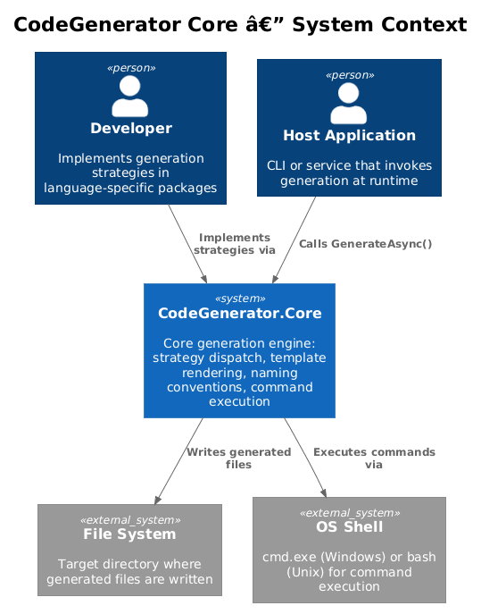
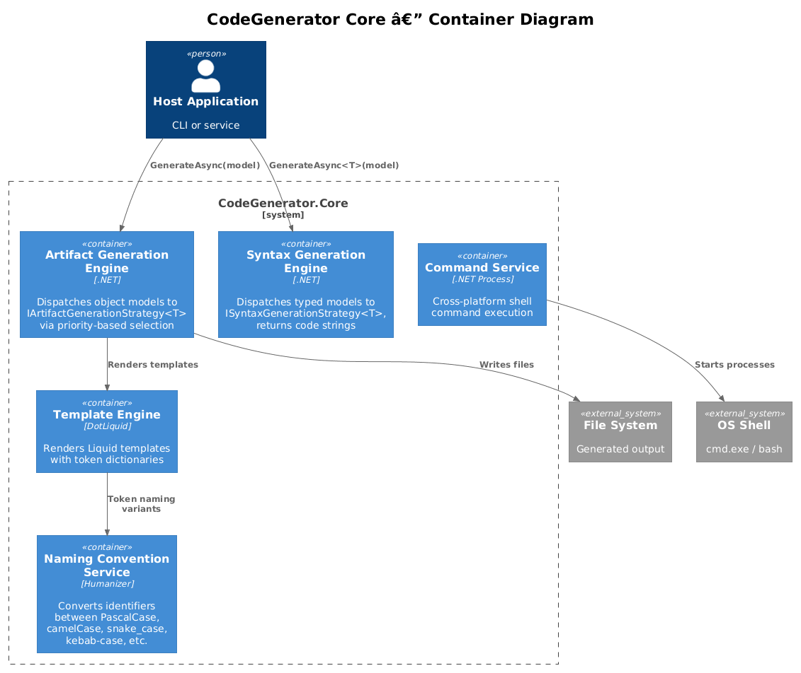
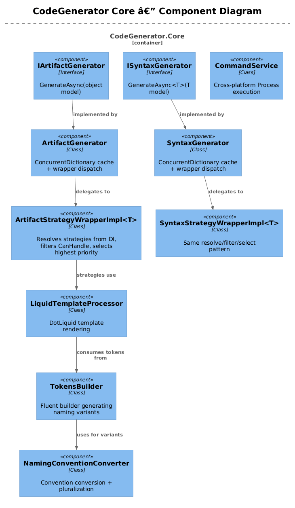
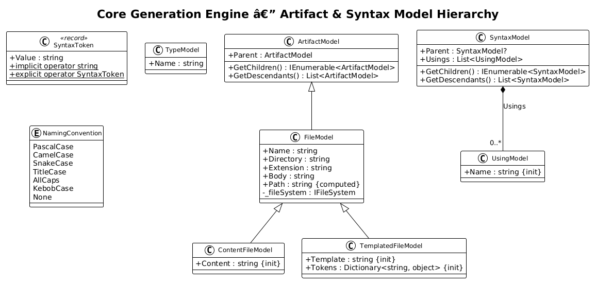
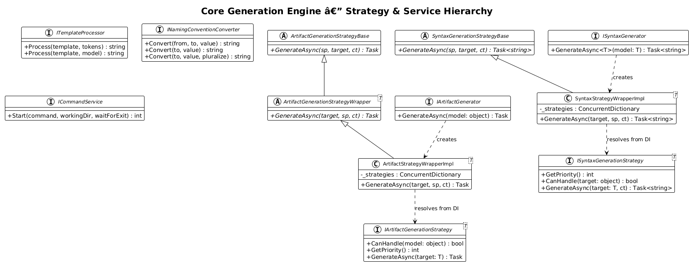
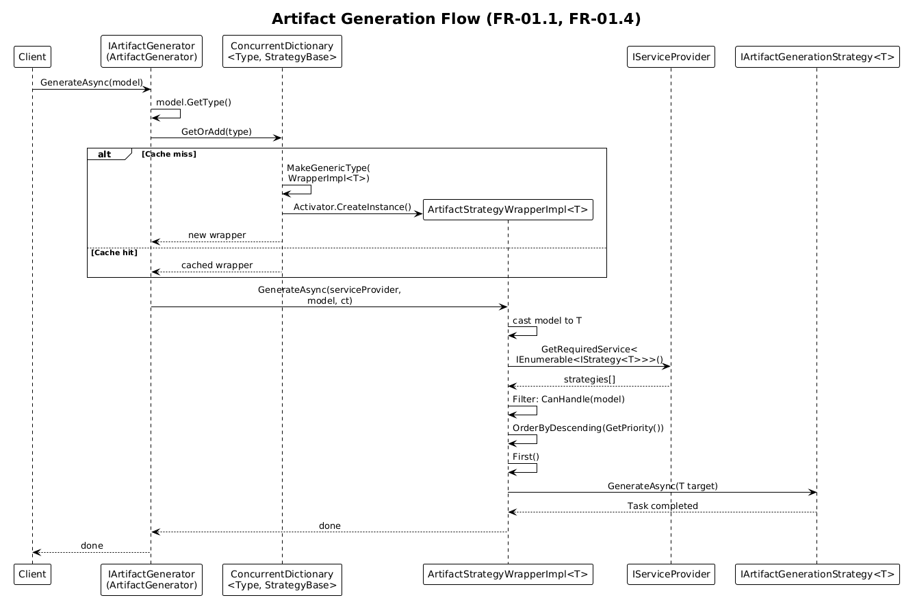
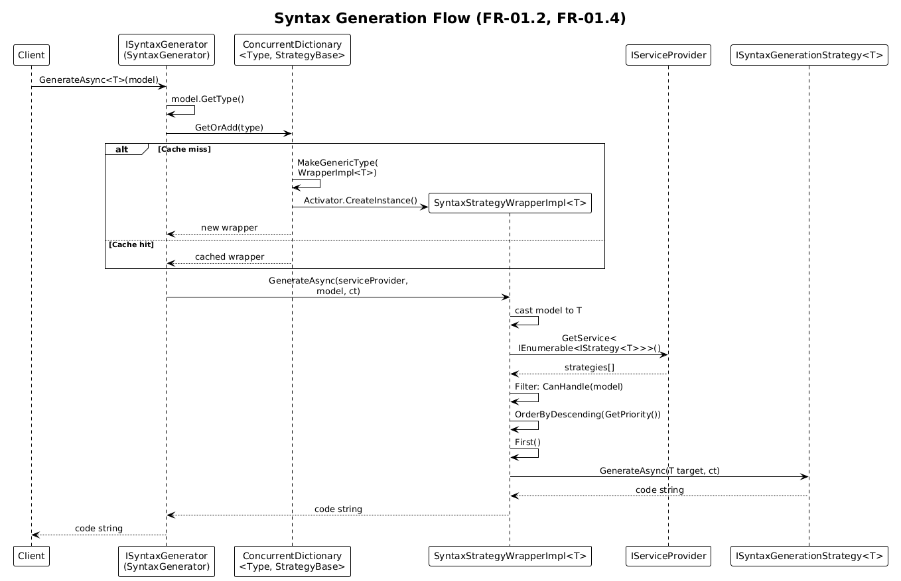
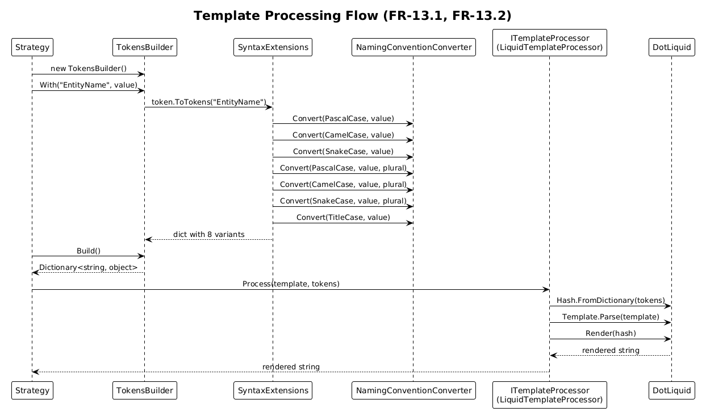
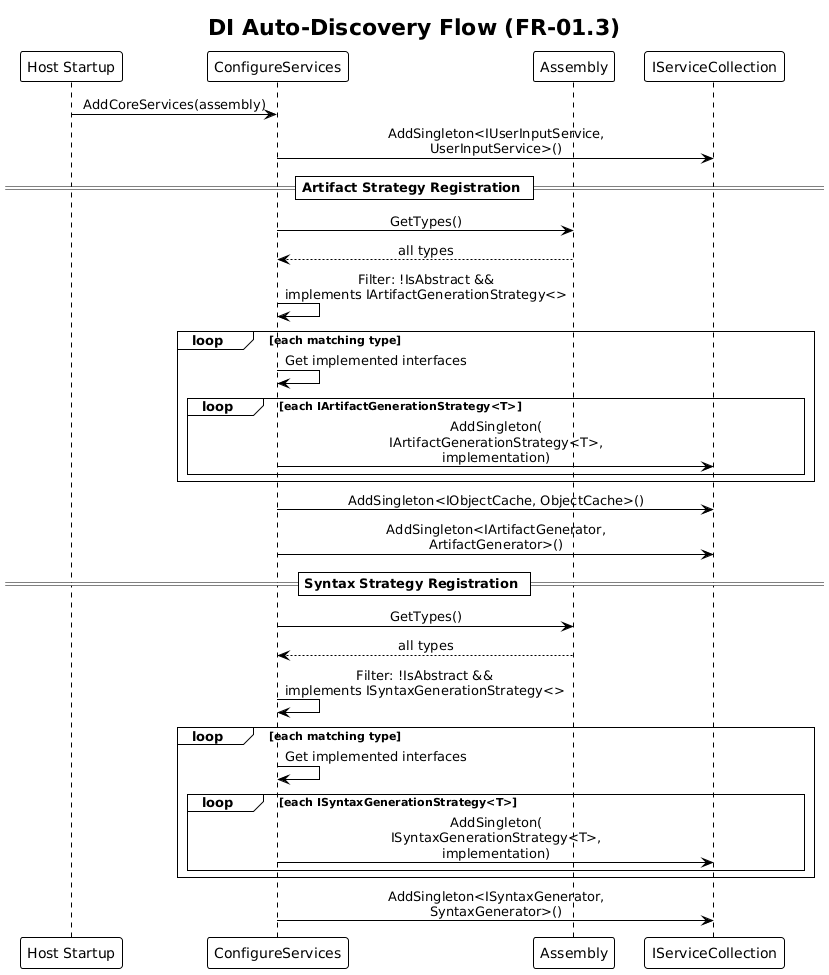

# Core Generation Engine — Detailed Design

**Feature:** 01-core-generation-engine
**Status:** Draft
**Requirements:** [L2-CoreEngine.md](../../specs/L2-CoreEngine.md) — FR-01, FR-13, FR-14, FR-18, NFR-01, NFR-02

---

## 1. Overview

The Core Generation Engine (`CodeGenerator.Core`) is the foundational library of the CodeGenerator framework. It provides the runtime dispatch, caching, template rendering, naming convention conversion, and command execution services that all language-specific generator packages depend on.

### Purpose

Enable model-driven code generation at two levels:

- **Artifact generation** — produce files, projects, and solutions from object models
- **Syntax generation** — produce code strings from typed syntax models

### Actors

| Actor | Description |
|-------|-------------|
| **Developer** | Implements `IArtifactGenerationStrategy<T>` or `ISyntaxGenerationStrategy<T>` in a language-specific package |
| **Host Application** | A CLI or service that calls `AddCoreServices(assembly)` at startup and invokes `IArtifactGenerator` / `ISyntaxGenerator` at runtime |

### Scope

This design covers the `CodeGenerator.Core` NuGet package — namespaces `CodeGenerator.Core.Artifacts`, `CodeGenerator.Core.Syntax`, `CodeGenerator.Core.Services`, and `CodeGenerator.Core.Events`. Language-specific packages (`.DotNet`, `.React`, etc.) are out of scope.

---

## 2. Architecture

### 2.1 C4 Context Diagram

Shows how the Core library sits within the broader system landscape.

### 2.2 C4 Container Diagram

The logical containers inside the CodeGenerator Core library.

### 2.3 C4 Component Diagram

Internal components within the Core library and their relationships.

---

## 3. Component Details

### 3.1 Artifact Generation Engine

- **Responsibility:** Accept any object model and dispatch to the correct `IArtifactGenerationStrategy<T>` implementation.
- **Key classes:** `IArtifactGenerator`, `ArtifactGenerator`, `ArtifactGenerationStrategyBase`, `ArtifactGenerationStrategyWrapper<T>`, `ArtifactGenerationStrategyWrapperImplementation<T>`
- **Caching:** A static `ConcurrentDictionary<Type, ArtifactGenerationStrategyBase>` maps model types to their wrapper instances. Wrappers are created once via `Activator.CreateInstance` and reused for all subsequent calls. *(FR-01.1)*
- **Strategy resolution:** The wrapper implementation resolves `IEnumerable<IArtifactGenerationStrategy<T>>` from DI, filters by `CanHandle(model)`, orders descending by `GetPriority()`, and invokes the first match. *(FR-01.4)*
- **Dependencies:** `IServiceProvider`, `ILogger<ArtifactGenerator>`

### 3.2 Syntax Generation Engine

- **Responsibility:** Accept a typed syntax model and return a generated code string via the appropriate strategy.
- **Key classes:** `ISyntaxGenerator`, `SyntaxGenerator`, `SyntaxGenerationStrategyBase`, `SyntaxGenerationStrategyWrapper<T>`, `SyntaxGenerationStrategyWrapperImplementation<T>`
- **Caching:** Same `ConcurrentDictionary<Type, SyntaxGenerationStrategyBase>` pattern as artifacts. *(FR-01.2)*
- **Strategy resolution:** Identical filter-and-select pattern — `CanHandle` → `GetPriority` → first match. *(FR-01.4)*
- **Dependencies:** `IServiceProvider`

### 3.3 Template Engine

- **Responsibility:** Render DotLiquid templates with token dictionaries or dynamic model objects.
- **Key classes:** `ITemplateProcessor`, `LiquidTemplateProcessor`, `EmbeddedResourceTemplateLocatorBase<T>`, `ITemplateLocator`
- **Token rendering:** Parses the template string via `Template.Parse()`, builds a DotLiquid `Hash` from the token dictionary, and calls `Render(hash)`. *(FR-13.1)*
- **Dynamic model support:** Converts object properties to a dictionary via reflection. List properties are recursively converted; scalar string/int properties generate naming-convention variants via `TokensBuilder`. *(FR-13.2)*
- **Ignore tokens:** Optional `ignoreTokens` array excludes specified keys from the hash before rendering. *(FR-13.1)*
- **Template location:** `EmbeddedResourceTemplateLocatorBase<T>` reads `.liquid` templates from assembly embedded resources. *(FR-13.3)*
- **Dependencies:** DotLiquid 2.2.677

### 3.4 Naming Convention Service

- **Responsibility:** Convert identifiers between PascalCase, camelCase, snake_case, kebab-case, TitleCase, and AllCaps; auto-detect source convention; pluralize/singularize via Humanizer. *(FR-14)*
- **Key classes:** `INamingConventionConverter`, `NamingConventionConverter`, `NamingConvention` enum
- **Auto-detection logic:** Inspects the first character and separator presence — lowercase + no separators → CamelCase; uppercase + no separators → PascalCase; has spaces → TitleCase; all lowercase + underscores/dashes → SnakeCase. *(FR-14.2)*
- **Pluralization:** Delegates to `Humanizer.Core` library (`Pluralize()` / `Singularize()`). *(FR-14.3)*
- **Dependencies:** Humanizer.Core 2.14.1

### 3.5 Token Builder

- **Responsibility:** Fluent API for building token dictionaries with automatic naming-convention variants.
- **Key classes:** `TokensBuilder`, `SyntaxExtensions`
- **Variant generation:** For each `With(name, value)` call, `SyntaxExtensions.ToTokens()` emits: `{name}`, `{name}PascalCase`, `{name}PascalCasePlural`, `{name}CamelCase`, `{name}CamelCasePlural`, `{name}SnakeCase`, `{name}SnakeCasePlural`, `{name}TitleCase`. *(FR-13.2)*
- **Dependencies:** `NamingConventionConverter` (static instance)

### 3.6 Command Service

- **Responsibility:** Execute shell commands cross-platform. *(FR-18)*
- **Key classes:** `ICommandService`, `CommandService`, `NoOpCommandService`
- **Platform dispatch:** Detects OS via `RuntimeInformation.IsOSPlatform` — Windows uses `cmd.exe /C`, Unix uses `bash -c`. *(FR-18.1)*
- **Blocking mode:** When `waitForExit=true`, blocks on `Process.WaitForExit()` and returns the exit code.
- **Testing:** `NoOpCommandService` provides a no-op implementation for unit tests.
- **Dependencies:** `ILogger<CommandService>`, `System.Diagnostics.Process`

### 3.7 Artifact Model Hierarchy

- **Responsibility:** Represent generated file artifacts with parent-child relationships.
- **Key classes:** `ArtifactModel`, `FileModel`, `ContentFileModel`, `TemplatedFileModel`, `IFileFactory`, `FileFactory`
- **Path computation:** `FileModel` computes `Path` = `Directory` + `Name` + `Extension` via `IFileSystem.Path.Combine`. *(FR-01.5)*
- **Recursive traversal:** `GetDescendants()` recursively collects all children from `GetChildren()` overrides. *(FR-01.5)*
- **Dependencies:** `System.IO.Abstractions` for testable file system access

### 3.8 Syntax Model Hierarchy

- **Responsibility:** Represent code syntax trees with parent-child relationships.
- **Key classes:** `SyntaxModel`, `SyntaxToken`, `TypeModel`, `UsingModel`
- **SyntaxToken:** A `record` wrapping a string value with implicit/explicit conversion operators.
- **Traversal:** Same `GetDescendants()` pattern as `ArtifactModel` for recursive child collection.

### 3.9 Domain Events & Context

- **Responsibility:** Provide thread-scoped state sharing without constructor injection.
- **Key classes:** `DomainEvents`, `CustomEvent<T>`, `IContext`, `Context`
- **Implementation:** `DomainEvents` uses a `[ThreadStatic]` list of delegates. `Register<T>` adds a callback; `Raise<T>` invokes it. Only one callback per type is allowed (replaces previous).
- **Context pattern:** `Context.Set<T>` registers a callback that sets the event payload; `Context.Get<T>` raises the event and reads the payload back.

### 3.10 Object Cache

- **Responsibility:** General-purpose cache-aside pattern for expensive computations.
- **Key classes:** `IObjectCache`, `ObjectCache`
- **Implementation:** `ConcurrentDictionary<string, object>` — `FromCacheOrService<T>(func, key)` checks cache, invokes func on miss, stores result. *(NFR-02)*

### 3.11 DI Auto-Discovery

- **Responsibility:** Scan assemblies and register all strategy implementations as singletons. *(FR-01.3)*
- **Key class:** `ConfigureServices` (static extension methods)
- **Process:** `AddCoreServices(assembly)` → `AddArifactGenerator(assembly)` + `AddSyntaxGenerator(assembly)`. Each scans for non-abstract types implementing the generic strategy interface, then registers each generic interface variant as a singleton. *(NFR-01)*

---

## 4. Data Model

### 4.1 Artifact Model Hierarchy

### 4.2 Strategy & Service Hierarchy

### 4.3 Entity Descriptions

| Entity | Description |
|--------|-------------|
| `ArtifactModel` | Base class with `Parent` reference and `GetChildren()`/`GetDescendants()` for tree traversal |
| `FileModel` | Extends `ArtifactModel` — adds `Name`, `Directory`, `Extension`, `Body`, computed `Path`, and `IFileSystem` |
| `ContentFileModel` | Extends `FileModel` — holds raw string `Content` (init-only) |
| `TemplatedFileModel` | Extends `FileModel` — holds a `Template` name and `Tokens` dictionary for DotLiquid rendering |
| `SyntaxModel` | Base syntax tree node with `Parent`, `Usings`, and recursive `GetDescendants()` |
| `SyntaxToken` | Immutable record wrapping a string value with implicit/explicit conversions |
| `TypeModel` | Simple model with `Name` property for type references |
| `UsingModel` | Simple model with `Name` property for using/import statements |
| `NamingConvention` | Enum: PascalCase, CamelCase, SnakeCase, TitleCase, AllCaps, KebobCase, None |

---

## 5. Key Workflows

### 5.1 Artifact Generation Flow

A host application calls `IArtifactGenerator.GenerateAsync(model)`. The generator checks its type cache, creates or retrieves a typed wrapper, resolves strategies from DI, and invokes the highest-priority matching strategy.

**Steps:**
1. Client calls `IArtifactGenerator.GenerateAsync(model)`.
2. `ArtifactGenerator` looks up `model.GetType()` in the static `ConcurrentDictionary`.
3. On cache miss: creates `ArtifactGenerationStrategyWrapperImplementation<T>` via `Activator.CreateInstance` using `MakeGenericType`. Stores in cache.
4. Calls `wrapper.GenerateAsync(serviceProvider, model, cancellationToken)`.
5. Wrapper casts model to `T` and resolves `IEnumerable<IArtifactGenerationStrategy<T>>` from `IServiceProvider`.
6. Filters strategies by `CanHandle(model)`, orders by `GetPriority()` descending, takes first.
7. Invokes `strategy.GenerateAsync(T target)`.

### 5.2 Syntax Generation Flow

Same pattern as artifact generation but returns a `string` instead of `Task`.

**Steps:**
1. Client calls `ISyntaxGenerator.GenerateAsync<T>(model)`.
2. `SyntaxGenerator` looks up `model.GetType()` in its static `ConcurrentDictionary`.
3. On cache miss: creates `SyntaxGenerationStrategyWrapperImplementation<T>` via reflection. Stores in cache.
4. Calls `wrapper.GenerateAsync(serviceProvider, model, cancellationToken)`.
5. Wrapper resolves `IEnumerable<ISyntaxGenerationStrategy<T>>` from DI.
6. Filters by `CanHandle`, orders by `GetPriority()` descending, takes first.
7. Invokes `strategy.GenerateAsync(T target, cancellationToken)` and returns the string result.

### 5.3 Template Processing Flow

Strategies use `TokensBuilder` to prepare token dictionaries with naming-convention variants, then pass them to `ITemplateProcessor` for DotLiquid rendering.

**Steps:**
1. Strategy creates a `TokensBuilder` instance.
2. Calls `With("EntityName", value)` for each property — `SyntaxExtensions.ToTokens()` generates 8 naming variants per property.
3. Calls `Build()` to get the final `Dictionary<string, object>`.
4. Calls `ITemplateProcessor.Process(template, tokens)`.
5. `LiquidTemplateProcessor` creates a DotLiquid `Hash` from the dictionary, parses the template, and renders it.
6. Returns the rendered string to the strategy.

### 5.4 DI Auto-Discovery Flow

At startup, `AddCoreServices` scans the provided assembly to find and register all strategy implementations.

**Steps:**
1. Host calls `services.AddCoreServices(assembly)`.
2. `AddArifactGenerator` gets all types from the assembly.
3. Filters to non-abstract types implementing `IArtifactGenerationStrategy<>`.
4. For each type, iterates its interfaces; for each matching generic interface, registers `services.AddSingleton(interface, implementation)`.
5. Registers `IObjectCache` → `ObjectCache` and `IArtifactGenerator` → `ArtifactGenerator` as singletons.
6. `AddSyntaxGenerator` repeats the same scan for `ISyntaxGenerationStrategy<>`.
7. Registers `ISyntaxGenerator` → `SyntaxGenerator` as singleton.

---

## 6. Security Considerations

| Concern | Mitigation |
|---------|------------|
| **Template injection** | DotLiquid is a safe-by-default template engine — it does not allow arbitrary code execution within templates. Only whitelisted properties are accessible. |
| **Command injection** | `CommandService.Start` passes the entire argument string to `cmd.exe /C` or `bash -c`. Callers must sanitize inputs. The `NoOpCommandService` is available for testing. |
| **Assembly scanning** | `ConfigureServices` only scans a caller-provided assembly — it does not load arbitrary assemblies from disk. The scanning scope is controlled by the host application. |
| **Thread safety** | Strategy wrapper caches use `ConcurrentDictionary`. `DomainEvents` uses `[ThreadStatic]` to isolate state per thread. `StringBuilderCache` is also `[ThreadStatic]`. |

---

## 7. Open Questions

| # | Question | Context |
|---|----------|---------|
| 1 | Should `ArtifactGenerationStrategyWrapperImplementation<T>` throw a descriptive exception when no strategy matches, rather than letting `First()` throw `InvalidOperationException`? | Currently the error message does not indicate the model type that failed. |
| 2 | Should strategy wrappers cache the filtered/sorted strategy list per model instance (beyond caching the wrapper per type)? | The current design resolves strategies from DI on every call, which is fine for singletons but could be optimized. |
| 3 | Should `DomainEvents` support multiple callbacks per type instead of replacing the previous one? | The current single-callback design is intentional for the context pattern but may limit extensibility. |
| 4 | Should the `LiquidTemplateProcessor` async methods be implemented rather than throwing `NotImplementedException`? | Currently only synchronous `Process` methods are functional. |
| 5 | The `NamingConvention.KebobCase` enum value appears to be a typo for "KebabCase" — should this be corrected? | Would be a breaking change for existing consumers. |
