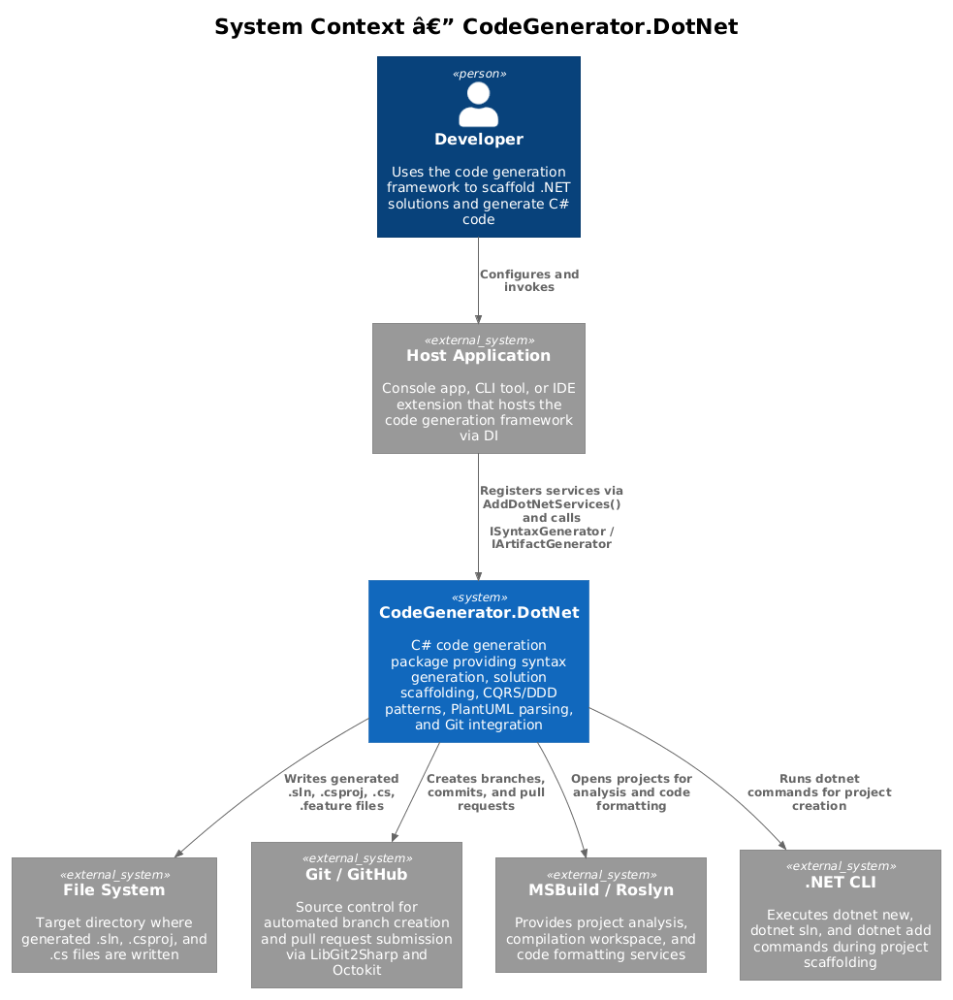
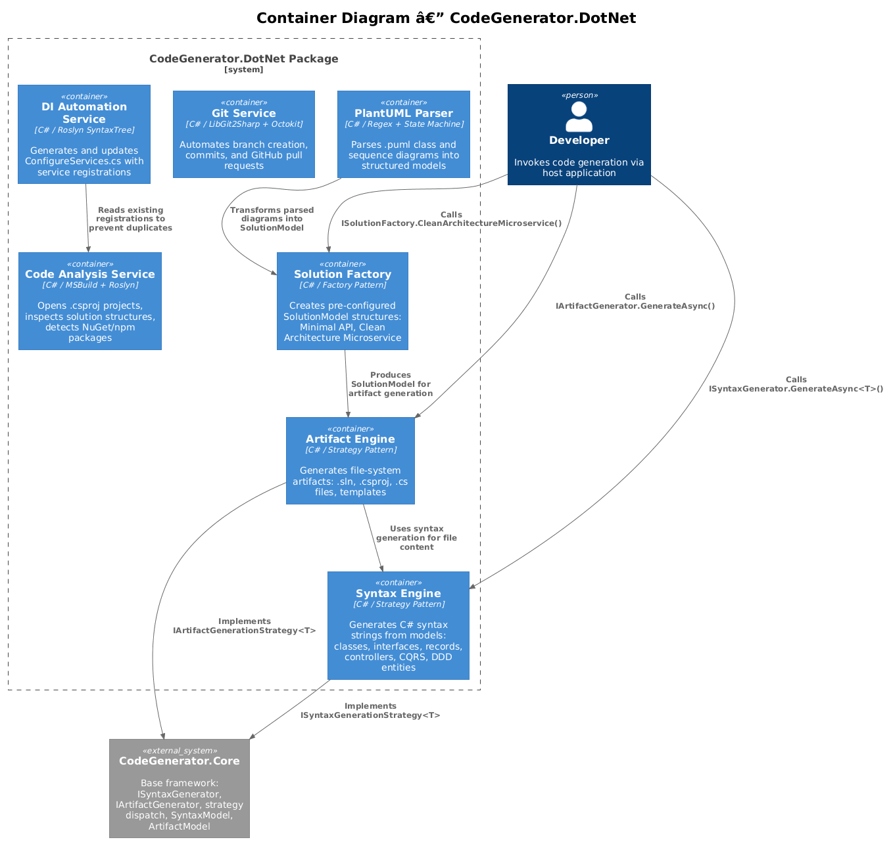
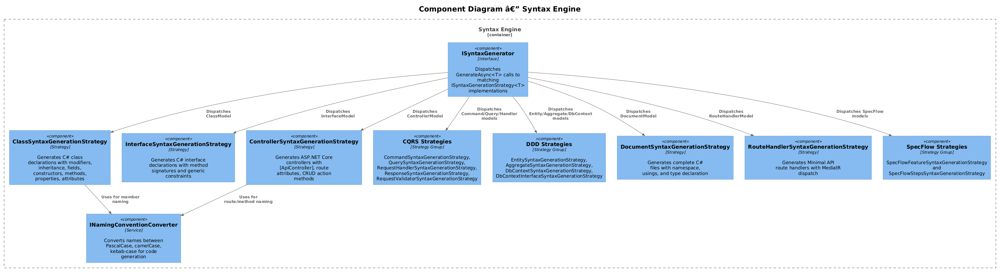
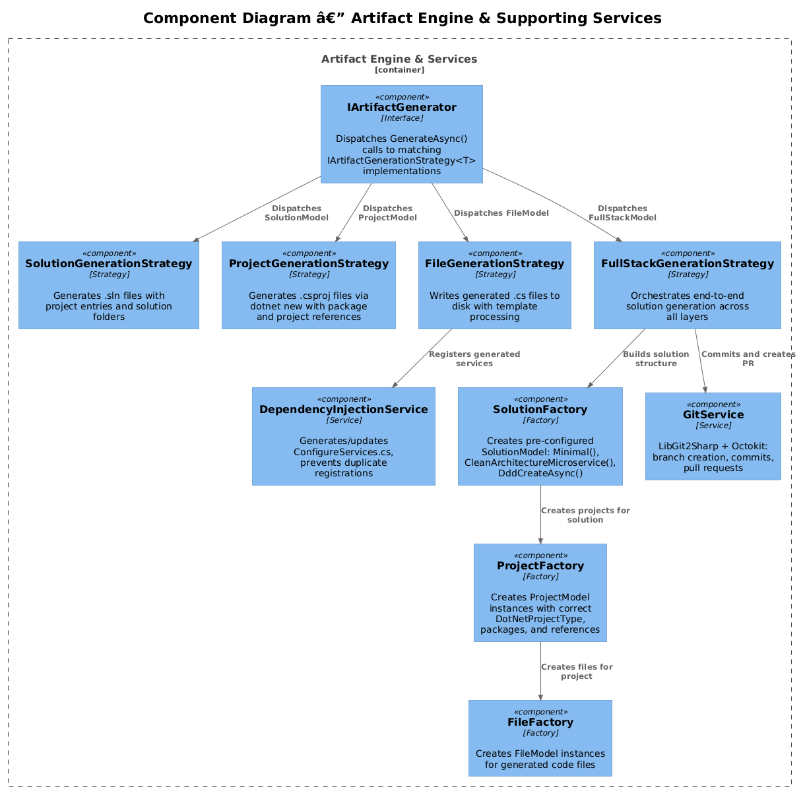
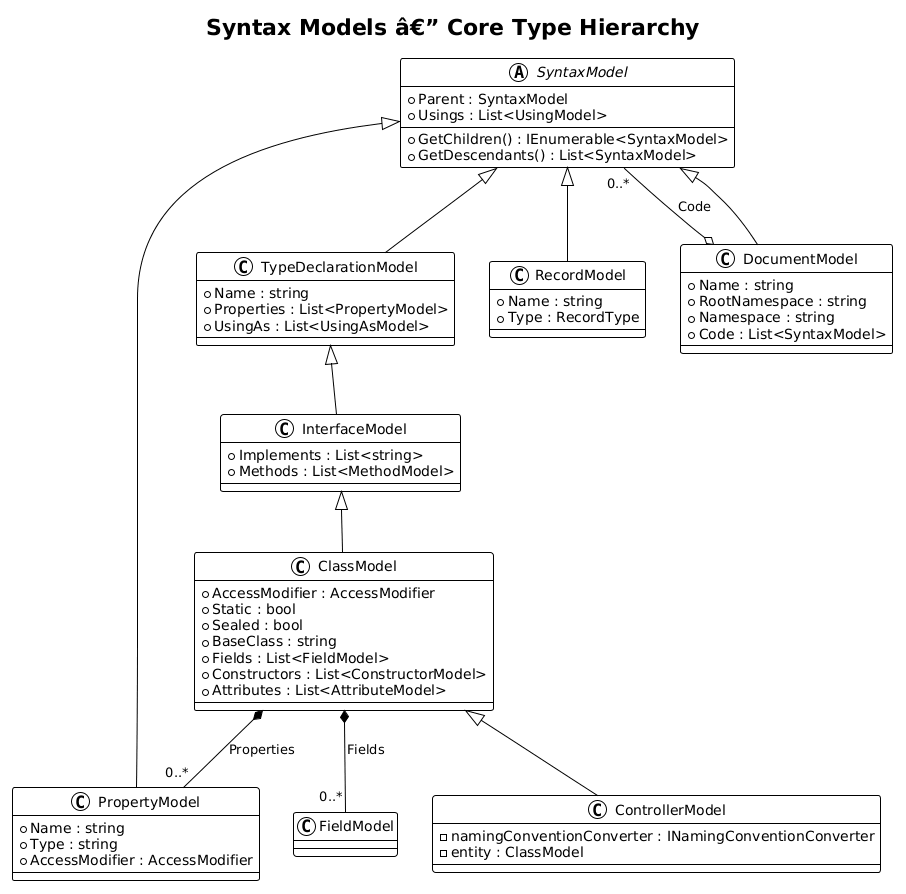
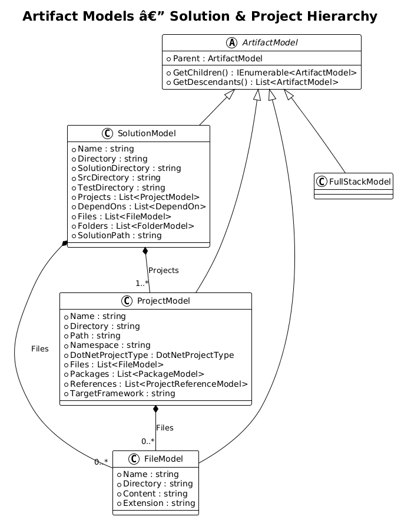
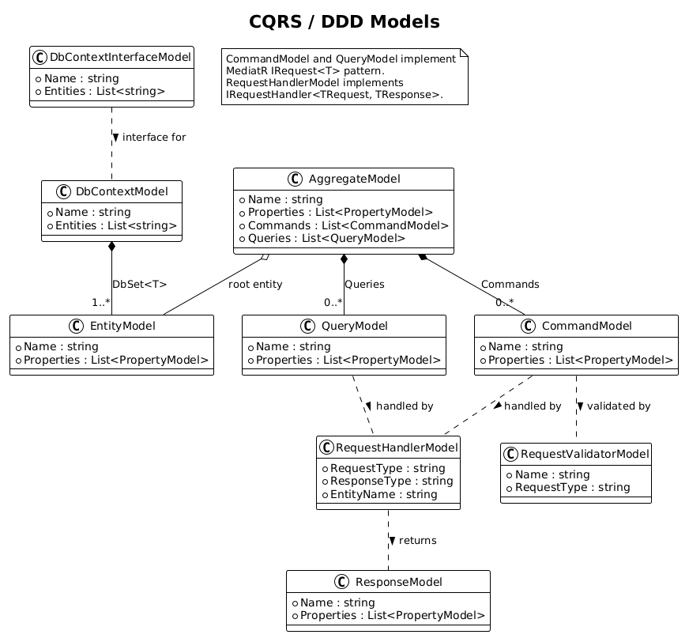
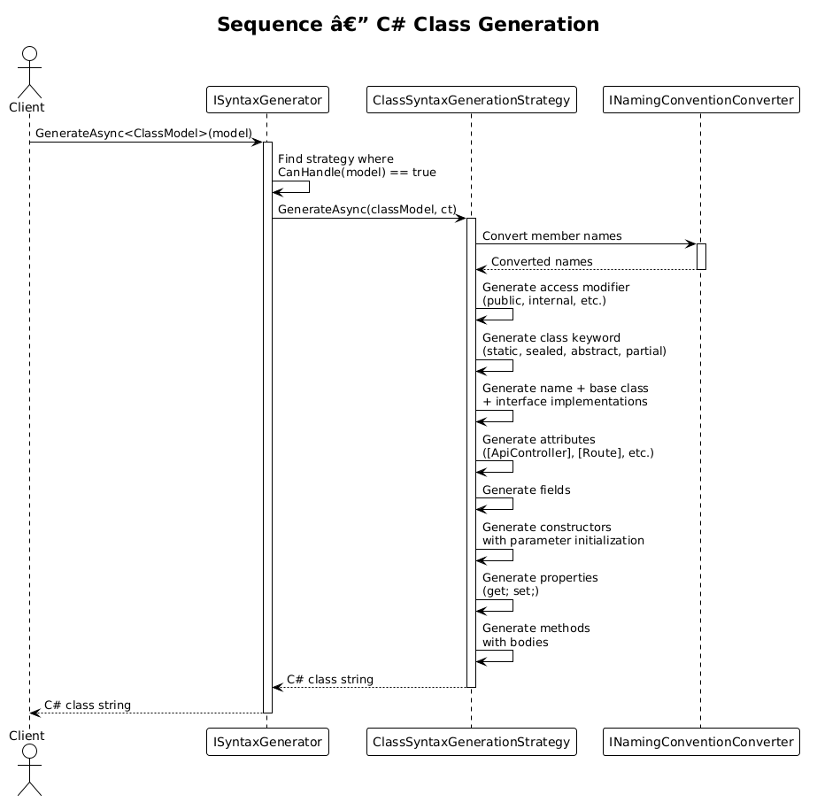
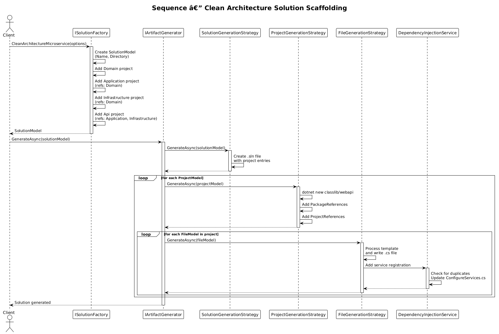
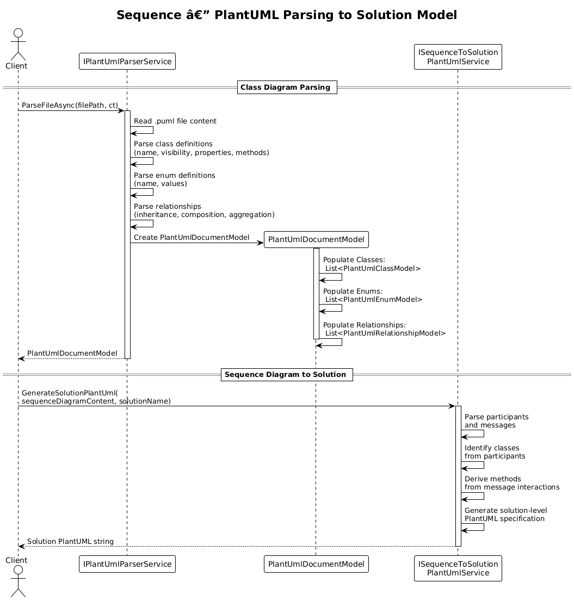

# Detailed Design — .NET Code Generation

**Parent:** [L2-DotNet.md](../../specs/L2-DotNet.md) — FR-02, FR-03, FR-11, FR-12, FR-16, FR-17
**Status:** Reverse-engineered from source code
**Date:** 2026-04-03

---

## 1. Overview

The **CodeGenerator.DotNet** package (~323 source files) is the largest component in the CodeGenerator framework. It provides:

- **C# syntax generation** — classes, interfaces, records, controllers, CQRS commands/queries, DDD entities/aggregates, SpecFlow tests
- **Solution scaffolding** — .sln and .csproj generation for Minimal API and Clean Architecture Microservice layouts
- **PlantUML parsing** — class diagram and sequence diagram parsing into structured models
- **Roslyn code analysis** — MSBuild/Roslyn workspace integration for project inspection and package detection
- **Git integration** — automated branch creation and pull request submission via LibGit2Sharp and Octokit
- **DI automation** — generation and maintenance of `ConfigureServices.cs` with duplicate-safe service registrations

All strategies implement the Core framework's `ISyntaxGenerationStrategy<T>` and `IArtifactGenerationStrategy<T>` interfaces and are dispatched through `ISyntaxGenerator` and `IArtifactGenerator` respectively. Services are registered via the `AddDotNetServices()` extension method.

**Key Namespace:** `CodeGenerator.DotNet`
**Project:** `src/CodeGenerator.DotNet/CodeGenerator.DotNet.csproj`
**Target Frameworks:** net8.0, net9.0

---

## 2. Architecture

### 2.1 System Context

The DotNet package operates within a broader system context involving the developer, host application, file system, Git/GitHub, and MSBuild/Roslyn.



*Figure 2.1 — System context showing CodeGenerator.DotNet and its external dependencies.*

### 2.2 Container View

Internally, the package is organized into seven logical containers:

| Container | Responsibility |
|---|---|
| **Syntax Engine** | Generates C# syntax strings from models via strategy dispatch |
| **Artifact Engine** | Generates file-system artifacts (.sln, .csproj, .cs files) via strategy dispatch |
| **Solution Factory** | Creates pre-configured `SolutionModel` structures (Minimal, Clean Architecture) |
| **PlantUML Parser** | Parses `.puml` files into `PlantUmlDocumentModel` / `PlantUmlSolutionModel` |
| **Code Analysis Service** | MSBuild/Roslyn project analysis, NuGet/npm package detection |
| **Git Service** | LibGit2Sharp + Octokit for automated PR workflows |
| **DI Automation Service** | Generates/updates `ConfigureServices.cs` with dedup logic |



*Figure 2.2 — Internal containers of CodeGenerator.DotNet and their relationships.*

### 2.3 Component View — Syntax Engine

The Syntax Engine dispatches model objects to strategy implementations via `ISyntaxGenerator.GenerateAsync<T>()`. Each strategy handles a specific model type.



*Figure 2.3 — Syntax engine components showing strategy dispatch.*

### 2.4 Component View — Artifact Engine & Services

The Artifact Engine dispatches artifact models to strategies for file-system generation. Supporting services (factories, DI, Git) are composed alongside.



*Figure 2.4 — Artifact engine components and supporting services.*

---

## 3. Component Details

### 3.1 Syntax Generation

**Namespace:** `CodeGenerator.DotNet.Syntax.*`
**Pattern:** Strategy pattern — each `ISyntaxGenerationStrategy<T>` generates a C# string from a typed model.

| Strategy | Model | Output |
|---|---|---|
| `ClassSyntaxGenerationStrategy` | `ClassModel` | C# class with modifiers, inheritance, members |
| `InterfaceSyntaxGenerationStrategy` | `InterfaceModel` | C# interface with method signatures |
| `RecordSyntaxGenerationStrategy` | `RecordModel` | C# 9+ record declaration |
| `ControllerSyntaxGenerationStrategy` | `ControllerModel` | ASP.NET Core controller with attributes |
| `RouteHandlerSyntaxGenerationStrategy` | `RouteHandlerModel` | Minimal API handler with MediatR |
| `CommandSyntaxGenerationStrategy` | `CommandModel` | MediatR `IRequest<T>` command |
| `QuerySyntaxGenerationStrategy` | `QueryModel` | MediatR query request |
| `RequestHandlerSyntaxGenerationStrategy` | `RequestHandlerModel` | `IRequestHandler<TReq, TRes>` |
| `ResponseSyntaxGenerationStrategy` | `ResponseModel` | Response DTO |
| `RequestValidatorSyntaxGenerationStrategy` | `RequestValidatorModel` | FluentValidation `AbstractValidator<T>` |
| `EntitySyntaxGenerationStrategy` | `EntityModel` | DDD entity with typed ID |
| `AggregateSyntaxGenerationStrategy` | `AggregateModel` | DDD aggregate root |
| `DbContextSyntaxGenerationStrategy` | `DbContextModel` | EF Core DbContext with `DbSet<T>` |
| `DbContextInterfaceSyntaxGenerationStrategy` | `DbContextInterfaceModel` | DbContext interface |
| `DocumentSyntaxGenerationStrategy` | `DocumentModel` | Complete .cs file (namespace + usings + type) |
| `SpecFlowFeatureSyntaxGenerationStrategy` | `SpecFlowFeatureModel` | `.feature` file |
| `SpecFlowStepsSyntaxGenerationStrategy` | `SpecFlowStepsModel` | Step definition class |

**Dispatch mechanism:** `ISyntaxGenerator` iterates registered strategies, calls `CanHandle(model)` (default: `target is T`), and invokes `GenerateAsync()` on the first match (ordered by `GetPriority()`).

### 3.2 Artifact Generation

**Namespace:** `CodeGenerator.DotNet.Artifacts.*`
**Pattern:** Strategy pattern — each `IArtifactGenerationStrategy<T>` writes file-system artifacts.

| Strategy | Model | Output |
|---|---|---|
| `SolutionGenerationStrategy` | `SolutionModel` | `.sln` file with project entries |
| `ProjectGenerationStrategy` | `ProjectModel` | `.csproj` via `dotnet new` with references |
| `FileGenerationStrategy` | `FileModel` | `.cs` file with template processing |
| `ContentFileGenerationStrategy` | `ContentFileModel` | Static content file |
| `FullStackGenerationStrategy` | `FullStackModel` | Orchestrates entire solution |

**Tree dispatch:** `SolutionModel.GetChildren()` returns `ProjectModel` instances, and `ProjectModel.GetChildren()` returns `FileModel` instances, enabling recursive artifact generation.

### 3.3 Solution Scaffolding

**Namespace:** `CodeGenerator.DotNet.Artifacts.Solutions.Factories`
**Interface:** `ISolutionFactory`

| Method | Description |
|---|---|
| `Minimal(options)` | Minimal API solution: `src/{Name}.Api` + `tests/{Name}.Api.Tests` |
| `CleanArchitectureMicroservice(options)` | Four-layer solution: Domain, Application, Infrastructure, Api with correct inter-project references |
| `CreateHttpSolution(options)` | HTTP solution variant |
| `DddCreateAsync(name, directory)` | DDD-style solution |
| `Create(name)` | Basic empty solution |

**Project dependencies for Clean Architecture:**
- `Api` → Application, Infrastructure
- `Application` → Domain
- `Infrastructure` → Domain

### 3.4 PlantUML Parsing

**Namespace:** `CodeGenerator.DotNet.Artifacts.PlantUml.Services`

**`IPlantUmlParserService`** parses `.puml` files into structured models:

| Method | Description |
|---|---|
| `ParseFileAsync(filePath, ct)` | Parses a single `.puml` file → `PlantUmlDocumentModel` |
| `ParseDirectoryAsync(directoryPath, ct)` | Parses all `.puml` in directory → `PlantUmlSolutionModel` |
| `ParseContent(content, sourcePath)` | Parses raw PlantUML string → `PlantUmlDocumentModel` |

**Parsed model structure:**
- `PlantUmlDocumentModel` contains `List<PlantUmlClassModel>`, `List<PlantUmlEnumModel>`, `List<PlantUmlRelationshipModel>`
- Visibility markers: `+` Public, `-` Private, `#` Protected, `~` Package
- Relationship types: inheritance (`--|>`), composition (`--*`), aggregation (`o--`)

**`ISequenceToSolutionPlantUmlService`** transforms sequence diagrams into solution PlantUML specifications via `GenerateSolutionPlantUml(sequenceDiagramContent, solutionName)`.

### 3.5 Code Analysis

**Namespace:** `CodeGenerator.DotNet.Services`
**Interface:** `ICodeAnalysisService`

| Member | Description |
|---|---|
| `SyntaxModel` | Current parsed syntax model |
| `SolutionModel` | Current parsed solution model |
| `IsPackageInstalledAsync(name, directory)` | Checks NuGet package presence in `.csproj` |
| `IsNpmPackageInstalledAsync(name)` | Checks global npm package installation |

Internally registers MSBuild exactly once (thread-safe singleton) for Roslyn workspace access.

### 3.6 Git Integration

**Namespace:** `CodeGenerator.DotNet.Artifacts.Git`
**Interface:** `IGitService`

| Method | Description |
|---|---|
| `CreatePullRequestAsync(pullRequestTitle, directory)` | Creates a feature branch, commits changes, pushes to remote, creates GitHub PR via Octokit, merges, and switches back to default branch |

Uses **LibGit2Sharp** for local repository operations and **Octokit** for GitHub API interactions.

### 3.7 DI Automation

**Namespace:** `CodeGenerator.DotNet.Services`
**Interface:** `IDependencyInjectionService`

| Method | Description |
|---|---|
| `Add(interfaceName, className, directory, lifetime?)` | Adds `services.AddSingleton<I, C>()` to `ConfigureServices.cs` (skips if exists) |
| `AddHosted(hostedServiceName, directory)` | Adds `services.AddHostedService<T>()` registration |
| `AddConfigureServices(layer, directory)` | Creates `ConfigureServices.cs` with `Add{Layer}Services()` extension method |

**Duplicate prevention:** reads existing file content and checks for existing registration before appending.

---

## 4. Data Model

### 4.1 Syntax Models

The syntax model hierarchy provides the data structures for C# code generation:



*Figure 4.1 — Syntax model inheritance hierarchy. `ClassModel` extends `InterfaceModel` extends `TypeDeclarationModel` extends `SyntaxModel`.*

**Key inheritance chain:**
```
SyntaxModel
  └─ TypeDeclarationModel (+ Name, Properties)
       └─ InterfaceModel (+ Implements, Methods)
            └─ ClassModel (+ AccessModifier, Fields, Constructors, Attributes, Static, Sealed, BaseClass)
                 └─ ControllerModel (+ entity reference, naming converter)
```

### 4.2 Artifact Models

The artifact model hierarchy represents file-system outputs:



*Figure 4.2 — Artifact model hierarchy. `SolutionModel` contains `ProjectModel` instances, each containing `FileModel` instances.*

**Composite pattern:** `ArtifactModel.GetChildren()` enables recursive traversal:
- `SolutionModel.GetChildren()` → `ProjectModel[]`
- `ProjectModel.GetChildren()` → `FileModel[]`

### 4.3 CQRS / DDD Models

The CQRS and DDD models support command/query separation and domain-driven design patterns:



*Figure 4.3 — CQRS/DDD model relationships: AggregateModel owns Commands and Queries; RequestHandlerModel handles both.*

---

## 5. Key Workflows

### 5.1 C# Class Generation

A client calls `ISyntaxGenerator.GenerateAsync<ClassModel>(model)`, which dispatches to `ClassSyntaxGenerationStrategy`. The strategy assembles the class string by generating modifiers, name, inheritance, attributes, fields, constructors, properties, and methods in order.



*Figure 5.1 — Class generation sequence showing strategy dispatch and C# string assembly.*

### 5.2 Solution Scaffolding

A client calls `ISolutionFactory.CleanArchitectureMicroservice(options)` to build a `SolutionModel` with four projects (Domain, Application, Infrastructure, Api) and correct inter-project references. The model is then passed to `IArtifactGenerator.GenerateAsync()`, which recursively dispatches to solution, project, and file strategies.



*Figure 5.2 — Solution scaffolding sequence from factory through recursive artifact generation.*

### 5.3 PlantUML-to-Code

A client calls `IPlantUmlParserService.ParseFileAsync()` to parse a `.puml` file into a `PlantUmlDocumentModel` containing classes, enums, and relationships. Optionally, `ISequenceToSolutionPlantUmlService.GenerateSolutionPlantUml()` transforms a sequence diagram into a solution-level PlantUML specification for further scaffolding.



*Figure 5.3 — PlantUML parsing and sequence-to-solution transformation.*

### 5.4 CQRS Generation

For a given entity, the CQRS workflow generates:
1. `CommandModel` → `CommandSyntaxGenerationStrategy` → MediatR `IRequest<Response>` class
2. `QueryModel` → `QuerySyntaxGenerationStrategy` → MediatR query request class
3. `RequestHandlerModel` → `RequestHandlerSyntaxGenerationStrategy` → `IRequestHandler<TRequest, TResponse>` implementation
4. `ResponseModel` → `ResponseSyntaxGenerationStrategy` → Response DTO
5. `RequestValidatorModel` → `RequestValidatorSyntaxGenerationStrategy` → FluentValidation `AbstractValidator<T>`
6. Each is wrapped in a `DocumentModel` for namespace/usings and written via `FileGenerationStrategy`

---

## 6. API Contracts

### 6.1 Core Interfaces (from CodeGenerator.Core)

```csharp
// Strategy dispatch
public interface ISyntaxGenerator
{
    Task<string> GenerateAsync<T>(T model);
}

public interface IArtifactGenerator
{
    Task GenerateAsync(object model);
}

// Strategy contracts
public interface ISyntaxGenerationStrategy<T>
{
    virtual int GetPriority() => 1;
    public bool CanHandle(object target) => target is T;
    Task<string> GenerateAsync(T target, CancellationToken cancellationToken);
}

public interface IArtifactGenerationStrategy<T>
{
    public bool CanHandle(object model) => model is T;
    public int GetPriority() => 1;
    Task GenerateAsync(T target);
}
```

### 6.2 Key DotNet Service Interfaces

```csharp
// Solution scaffolding
public interface ISolutionFactory
{
    Task<SolutionModel> Minimal(CreateCodeGeneratorSolutionOptions options);
    Task<SolutionModel> CleanArchitectureMicroservice(CreateCleanArchitectureMicroserviceOptions options);
    Task<SolutionModel> CreateHttpSolution(CreateCodeGeneratorSolutionOptions options);
    Task<SolutionModel> DddCreateAsync(string name, string directory);
    Task<SolutionModel> Create(string name);
    Task<SolutionModel> Create(string name, string projectName, string dotNetProjectTypeName,
                                string folderName, string directory);
}

// PlantUML parsing
public interface IPlantUmlParserService
{
    Task<PlantUmlSolutionModel> ParseDirectoryAsync(string directoryPath, CancellationToken ct = default);
    Task<PlantUmlDocumentModel> ParseFileAsync(string filePath, CancellationToken ct = default);
    PlantUmlDocumentModel ParseContent(string content, string sourcePath = null);
}

// Sequence-to-solution transformation
public interface ISequenceToSolutionPlantUmlService
{
    string GenerateSolutionPlantUml(string sequenceDiagramContent, string solutionName);
}

// Code analysis
public interface ICodeAnalysisService
{
    SyntaxModel SyntaxModel { get; set; }
    SolutionModel SolutionModel { get; set; }
    Task<bool> IsNpmPackageInstalledAsync(string name);
    Task<bool> IsPackageInstalledAsync(string name, string directory);
}

// DI automation
public interface IDependencyInjectionService
{
    Task Add(string interfaceName, string className, string directory, ServiceLifetime? serviceLifetime = null);
    Task AddHosted(string hostedServiceName, string directory);
    Task AddConfigureServices(string layer, string directory);
}

// Git integration
public interface IGitService
{
    Task CreatePullRequestAsync(string pullRequestTitle, string directory);
}
```

### 6.3 DI Registration Entry Point

```csharp
namespace Microsoft.Extensions.DependencyInjection;

public static class ConfigureServices
{
    public static void AddDotNetServices(this IServiceCollection services)
    {
        // Registers all DotNet-specific services:
        // - ISolutionFactory → SolutionFactory
        // - IPlantUmlParserService → PlantUmlParserService
        // - ICodeAnalysisService → CodeAnalysisService
        // - IDependencyInjectionService → DependencyInjectionService
        // - IGitService → GitService
        // - ICodeFormatterService → DotnetCodeFormatterService
        // - 30+ syntax/artifact strategy implementations
        // - MediatR handlers from assembly
    }
}
```

---

## 7. Open Questions

| # | Question | Impact |
|---|---|---|
| 1 | `FullStackModel` is currently an empty stub — what properties and behavior should it expose? | FR-03 scaffolding completeness |
| 2 | Should `ICodeAnalysisService` expose richer Roslyn workspace APIs (e.g., symbol lookup, refactoring)? | FR-12 extensibility |
| 3 | The `ControllerModel` extends `ClassModel` via inheritance — should this be composition instead to avoid coupling? | Syntax model flexibility |
| 4 | `RecordModel` does not extend `TypeDeclarationModel` — should it, for consistency with `ClassModel`/`InterfaceModel`? | Model hierarchy consistency |
| 5 | Should `IGitService` support configurable merge strategies and branch naming conventions? | FR-16 Git workflow flexibility |
| 6 | Is a single `GetPriority()` sufficient for strategy ordering, or should a more granular precedence system be introduced? | Strategy extensibility |

---

## Requirements Traceability

| Requirement | Component(s) | Section |
|---|---|---|
| FR-02: .NET Code Generation | Syntax Engine, all `*SyntaxGenerationStrategy` | §3.1, §5.1 |
| FR-03: Solution Scaffolding | Artifact Engine, `ISolutionFactory`, `SolutionModel` | §3.2, §3.3, §5.2 |
| FR-11: PlantUML Parsing | `IPlantUmlParserService`, `ISequenceToSolutionPlantUmlService` | §3.4, §5.3 |
| FR-12: Roslyn Code Analysis | `ICodeAnalysisService` | §3.5 |
| FR-16: Git Integration | `IGitService` | §3.6 |
| FR-17: DI Automation | `IDependencyInjectionService` | §3.7 |
