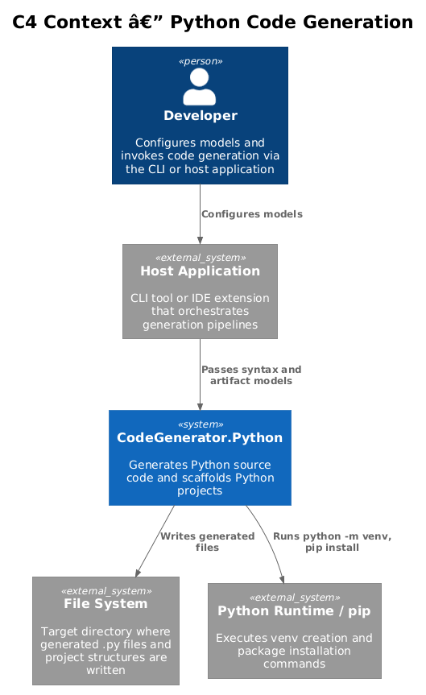
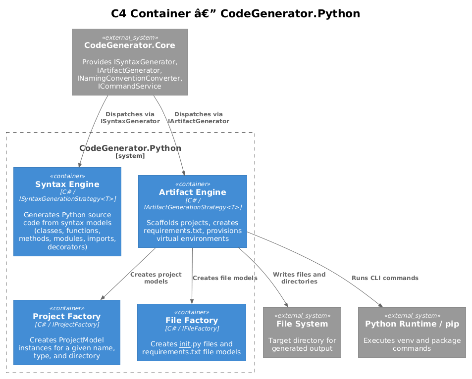
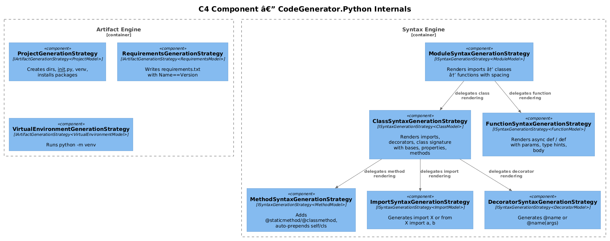
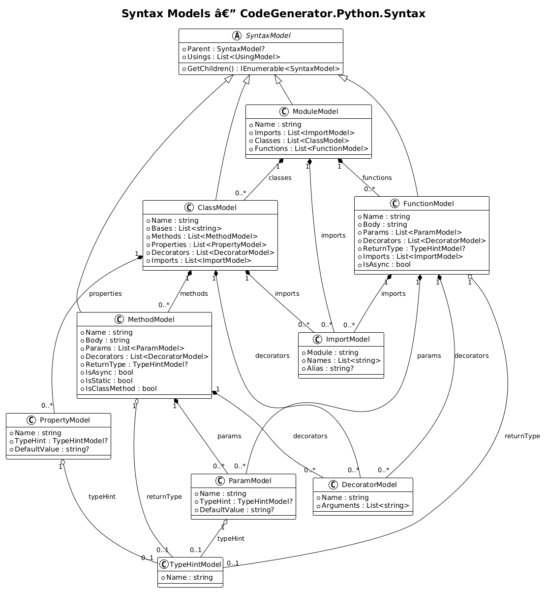
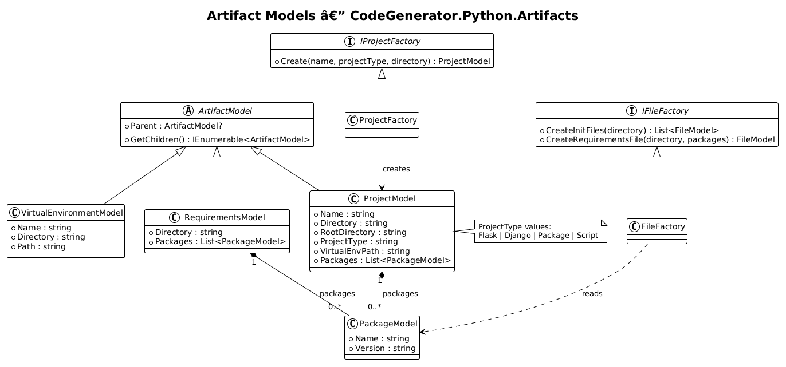
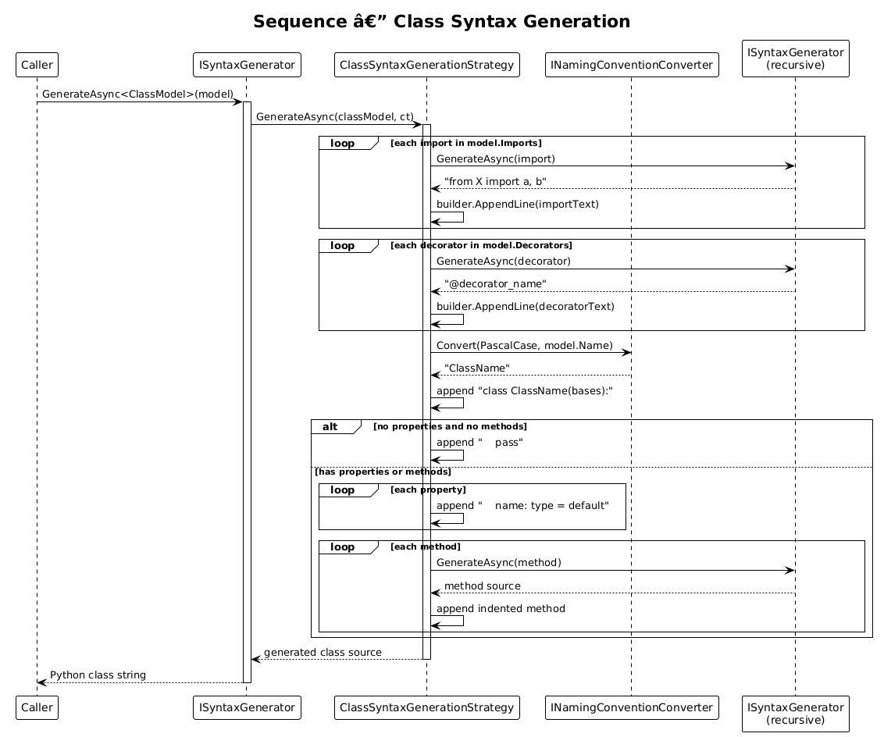
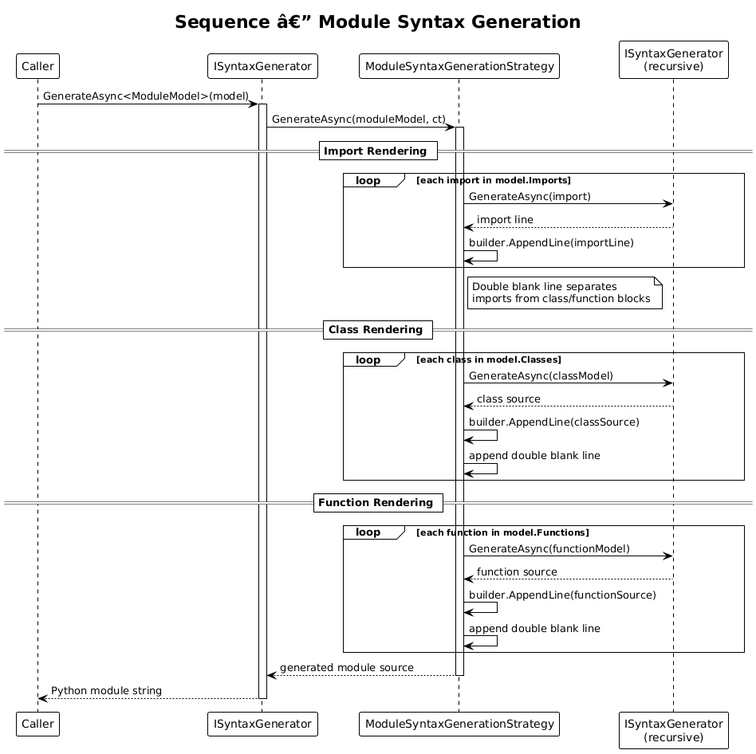
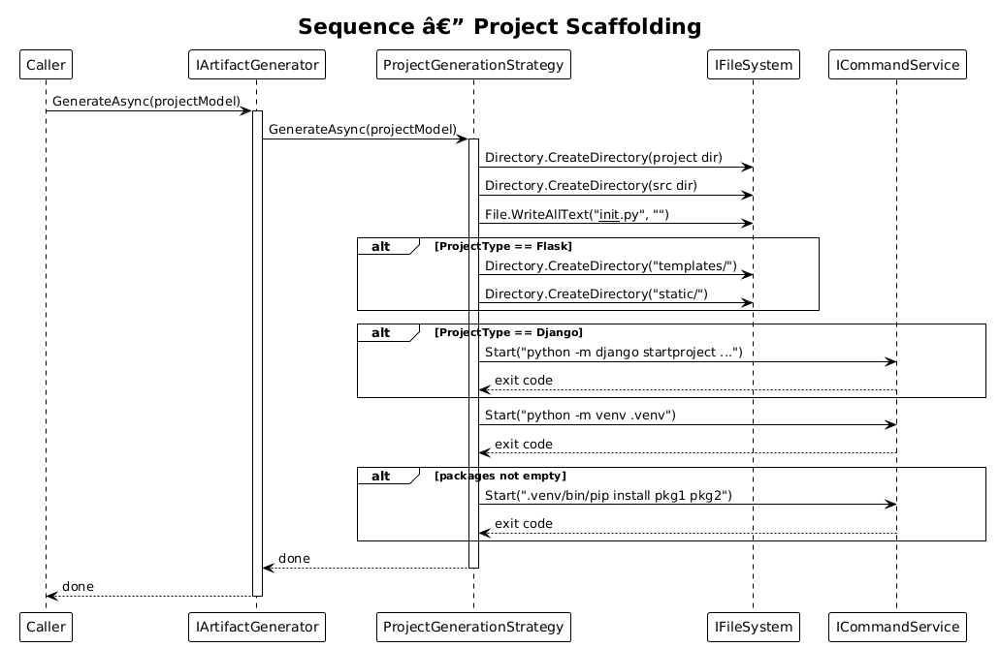

# Python Code Generation — Detailed Design

**Feature:** 03-python-code-generation
**Requirements:** [L2-PythonFlask.md](../../specs/L2-PythonFlask.md) — FR-04
**Status:** Approved
**Date:** 2026-04-03

---

## 1. Overview

CodeGenerator.Python extends the Core engine's strategy pattern to generate Python source code and scaffold Python projects. It provides two generation surfaces:

- **Syntax Engine** — Transforms syntax models (classes, functions, methods, modules, imports, decorators) into valid Python source text.
- **Artifact Engine** — Scaffolds project directories, creates `requirements.txt`, and provisions virtual environments.

All strategies are auto-discovered via assembly scanning and registered through the `AddPythonServices` extension method.

---

## 2. Architecture

### 2.1 C4 Context

The Python package sits between the host application and external systems (file system, Python runtime).

| Actor / System | Responsibility |
|---|---|
| Developer | Configures syntax and artifact models |
| Host Application | CLI or IDE extension that orchestrates generation |
| CodeGenerator.Python | Generates Python code and project structures |
| File System | Receives generated `.py` files and directories |
| Python Runtime / pip | Executes `venv` creation and package installation |

### 2.2 C4 Container

Inside the package, four containers collaborate:

| Container | Role |
|---|---|
| Syntax Engine | Six `ISyntaxGenerationStrategy<T>` implementations that render Python source |
| Artifact Engine | Three `IArtifactGenerationStrategy<T>` implementations that scaffold projects |
| Project Factory | `IProjectFactory` — creates `ProjectModel` instances |
| File Factory | `IFileFactory` — creates `__init__.py` and `requirements.txt` file models |

### 2.3 C4 Component

Syntax strategies delegate to each other via `ISyntaxGenerator`: `ModuleSyntaxGenerationStrategy` delegates to class and function strategies, which in turn delegate to import, decorator, and method strategies.

---

## 3. Syntax Models

### 3.1 Class Diagram

All syntax models extend `SyntaxModel` (from Core), which provides the `Parent` reference and `Usings` collection.

| Model | Purpose | Key Properties |
|---|---|---|
| `ClassModel` | Python class declaration | `Name`, `Bases`, `Methods`, `Properties`, `Decorators`, `Imports` |
| `FunctionModel` | Standalone function | `Name`, `Body`, `Params`, `Decorators`, `ReturnType`, `Imports`, `IsAsync` |
| `MethodModel` | Class-bound method | `Name`, `Body`, `Params`, `Decorators`, `ReturnType`, `IsAsync`, `IsStatic`, `IsClassMethod` |
| `ModuleModel` | Complete `.py` file | `Name`, `Imports`, `Classes`, `Functions` |
| `ImportModel` | Import statement | `Module`, `Names`, `Alias` |
| `DecoratorModel` | `@decorator` annotation | `Name`, `Arguments` |
| `TypeHintModel` | Type annotation (e.g., `int`, `List[str]`) | `Name` |
| `ParamModel` | Function/method parameter | `Name`, `TypeHint?`, `DefaultValue?` |
| `PropertyModel` | Class-level typed attribute | `Name`, `TypeHint?`, `DefaultValue?` |

### 3.2 Composition Rules

- `ClassModel` composes `MethodModel`, `PropertyModel`, `DecoratorModel`, and `ImportModel`.
- `FunctionModel` composes `ParamModel`, `DecoratorModel`, `ImportModel`, and optionally references a `TypeHintModel` return type.
- `MethodModel` composes `ParamModel` and `DecoratorModel`; the strategy auto-injects `self` or `cls` as the first parameter.
- `ModuleModel` composes `ImportModel`, `ClassModel`, and `FunctionModel`.
- `ParamModel` and `PropertyModel` optionally reference a `TypeHintModel`.

---

## 4. Artifact Models

All artifact models extend `ArtifactModel` (from Core).

| Model | Purpose | Key Properties |
|---|---|---|
| `ProjectModel` | Full project scaffold | `Name`, `Directory`, `RootDirectory`, `ProjectType`, `VirtualEnvPath`, `Packages` |
| `RequirementsModel` | `requirements.txt` file | `Directory`, `Packages` |
| `VirtualEnvironmentModel` | `.venv` directory | `Name`, `Directory`, `Path` |
| `PackageModel` | pip dependency | `Name`, `Version` |

### 4.1 Project Types

Defined in `Constants.ProjectType`:

| Type | Behavior |
|---|---|
| `Flask` | Creates `templates/` and `static/` directories |
| `Django` | Runs `django-admin startproject` |
| `Package` | Standard Python package layout |
| `Script` | Minimal script layout |

### 4.2 Factories

| Interface | Implementation | Responsibility |
|---|---|---|
| `IProjectFactory` | `ProjectFactory` | `Create(name, projectType, directory)` → `ProjectModel` |
| `IFileFactory` | `FileFactory` | `CreateInitFiles(directory)` — scans subdirectories for missing `__init__.py`; `CreateRequirementsFile(directory, packages)` — builds `requirements.txt` content |

---

## 5. Syntax Generation Strategies

Each strategy implements `ISyntaxGenerationStrategy<T>` and is dispatched by `ISyntaxGenerator.GenerateAsync<T>()`.

### 5.1 ClassSyntaxGenerationStrategy

**Inputs:** `ClassModel`
**Injects:** `ISyntaxGenerator`, `INamingConventionConverter`, `ILogger`

**Algorithm:**
1. Render each `ImportModel` via `ISyntaxGenerator` (blank line after last import).
2. Render each `DecoratorModel` via `ISyntaxGenerator`.
3. Convert class name to PascalCase via `INamingConventionConverter`.
4. Emit `class ClassName(Base1, Base2):`.
5. If no properties and no methods → emit `    pass`.
6. Otherwise render properties as `    name: type = default`, then methods (indented one level, blank line between each).

### 5.2 FunctionSyntaxGenerationStrategy

**Inputs:** `FunctionModel`
**Injects:** `ISyntaxGenerator`, `INamingConventionConverter`, `ILogger`

**Algorithm:**
1. Render imports (blank line after last).
2. Render decorators.
3. Convert function name to snake_case.
4. Build parameter list: `name: type = default` for each `ParamModel`.
5. Emit `async def` or `def`, append `(params)`, append `-> ReturnType` if present.
6. Emit indented body or `    pass` if body is empty.

### 5.3 MethodSyntaxGenerationStrategy

**Inputs:** `MethodModel`
**Injects:** `ISyntaxGenerator`, `INamingConventionConverter`, `ILogger`

**Algorithm:**
1. Render decorators.
2. If `IsStatic` → emit `@staticmethod`; if `IsClassMethod` → emit `@classmethod`.
3. Build parameter list: prepend `self` (instance), `cls` (classmethod), or nothing (static).
4. Convert method name to snake_case, emit `def`/`async def`, params, optional return type.
5. Emit indented body or `    pass`.

### 5.4 ModuleSyntaxGenerationStrategy

**Inputs:** `ModuleModel`
**Injects:** `ISyntaxGenerator`, `ILogger`

**Algorithm:**
1. Render each import via `ISyntaxGenerator`.
2. Emit double blank line between imports and class/function blocks.
3. Render each `ClassModel` via `ISyntaxGenerator`, double blank line between each.
4. Render each `FunctionModel` via `ISyntaxGenerator`, double blank line between each.

### 5.5 ImportSyntaxGenerationStrategy

**Inputs:** `ImportModel`
**Injects:** `ILogger`

**Rules:**
- `Names` is empty → `import Module` (with optional `as Alias`).
- `Names` is populated → `from Module import Name1, Name2`.

### 5.6 DecoratorSyntaxGenerationStrategy

**Inputs:** `DecoratorModel`
**Injects:** `ILogger`

**Rules:**
- No arguments → `@name`.
- With arguments → `@name(arg1, arg2)`.

---

## 6. Artifact Generation Strategies

Each strategy implements `IArtifactGenerationStrategy<T>` and is dispatched by `IArtifactGenerator.GenerateAsync()`.

### 6.1 ProjectGenerationStrategy

**Inputs:** `ProjectModel`
**Injects:** `ICommandService`, `IFileSystem`, `ILogger`

**Steps:**
1. Create project directory.
2. Create source subdirectory (`name` with hyphens replaced by underscores).
3. Write empty `__init__.py` in source directory.
4. **Flask** — create `templates/` and `static/` directories.
5. **Django** — run `python -m django startproject <name> .`.
6. Run `python -m venv .venv`.
7. If packages present — run `.venv/bin/pip install pkg1==ver1 pkg2`.

### 6.2 RequirementsGenerationStrategy

**Inputs:** `RequirementsModel`
**Injects:** `IFileSystem`, `ILogger`

Writes `requirements.txt` to `model.Directory`. Each line is either `Name` (no version) or `Name==Version`.

### 6.3 VirtualEnvironmentGenerationStrategy

**Inputs:** `VirtualEnvironmentModel`
**Injects:** `ICommandService`, `ILogger`

Runs `python -m venv <name>` in `model.Directory`.

---

## 7. Dependency Injection

`ConfigureServices.AddPythonServices(IServiceCollection)` registers:

| Registration | Lifetime | Mechanism |
|---|---|---|
| `IFileFactory` → `FileFactory` | Singleton | Explicit |
| `IProjectFactory` → `ProjectFactory` | Singleton | Explicit |
| All `ISyntaxGenerationStrategy<T>` | — | Assembly scanning via `AddSyntaxGenerator` |
| All `IArtifactGenerationStrategy<T>` | — | Assembly scanning via `AddArifactGenerator` |

Assembly scanning discovers strategies from the assembly containing `ProjectModel`.

---

## 8. Constants

### File Extensions

| Constant | Value |
|---|---|
| `Python` | `.py` |
| `Requirements` | `.txt` |
| `Toml` | `.toml` |
| `Cfg` | `.cfg` |
| `Ini` | `.ini` |

### File Names

| Constant | Value |
|---|---|
| `Init` | `__init__` |
| `Main` | `__main__` |
| `Requirements` | `requirements` |
| `SetupPy` | `setup` |
| `Conftest` | `conftest` |

### Template Types

`InitFile`, `SetupPy`, `SetupCfg`, `PyProjectToml`, `ManagePy`, `AppPy`

---

## 9. Requirements Traceability

| Requirement | Component |
|---|---|
| FR-04.1 Class Generation | `ClassModel`, `ClassSyntaxGenerationStrategy` |
| FR-04.2 Function Generation | `FunctionModel`, `FunctionSyntaxGenerationStrategy` |
| FR-04.3 Method Generation | `MethodModel`, `MethodSyntaxGenerationStrategy` |
| FR-04.4 Import Generation | `ImportModel`, `ImportSyntaxGenerationStrategy` |
| FR-04.5 Module Generation | `ModuleModel`, `ModuleSyntaxGenerationStrategy` |
| FR-04.6 Decorator Generation | `DecoratorModel`, `DecoratorSyntaxGenerationStrategy` |
| FR-04.7 Type Hint Generation | `TypeHintModel`, `ParamModel`, `PropertyModel` |
| FR-04.8 Project Scaffolding | `ProjectModel`, `ProjectGenerationStrategy`, `RequirementsGenerationStrategy`, `VirtualEnvironmentGenerationStrategy` |

---

## 10. Diagram Index

| Diagram | File | Description |
|---|---|---|
| C4 Context | [c4_context.puml](diagrams/c4_context.puml) | System context with external actors |
| C4 Container | [c4_container.puml](diagrams/c4_container.puml) | Internal containers: Syntax Engine, Artifact Engine, Factories |
| C4 Component | [c4_component.puml](diagrams/c4_component.puml) | All nine strategy components and their delegation |
| Syntax Class Diagram | [class_diagram.puml](diagrams/class_diagram.puml) | Syntax model inheritance and composition |
| Artifact Class Diagram | [class_artifact_models.puml](diagrams/class_artifact_models.puml) | Artifact model hierarchy and factories |
| Class Generation | [sequence_class_generation.puml](diagrams/sequence_class_generation.puml) | Step-by-step class rendering flow |
| Project Scaffolding | [sequence_project_scaffolding.puml](diagrams/sequence_project_scaffolding.puml) | Directory creation, venv, pip install flow |
| Module Generation | [sequence_module_generation.puml](diagrams/sequence_module_generation.puml) | Import dedup, class/function rendering flow |
