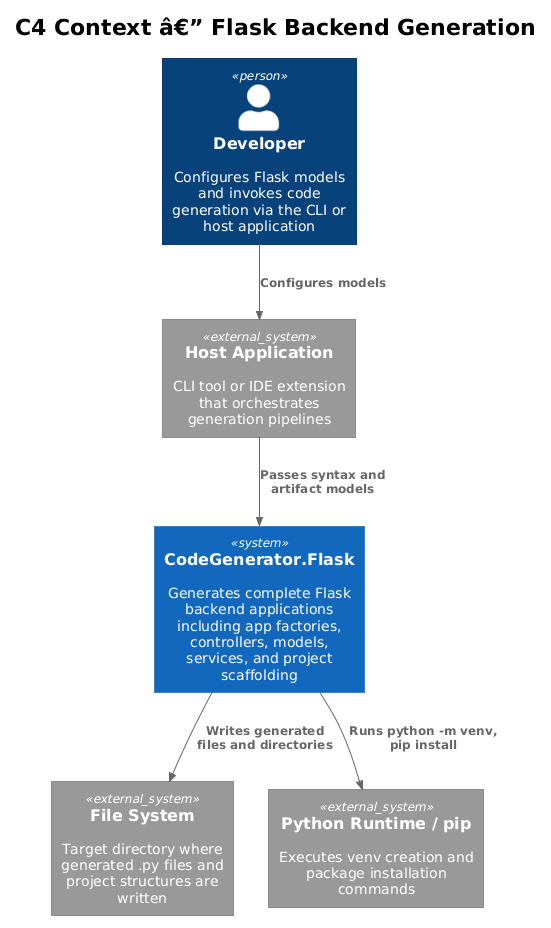
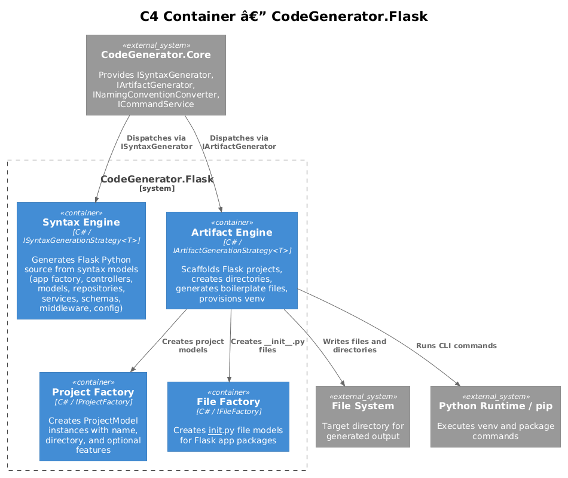
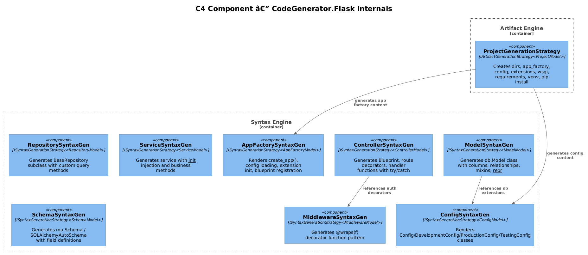
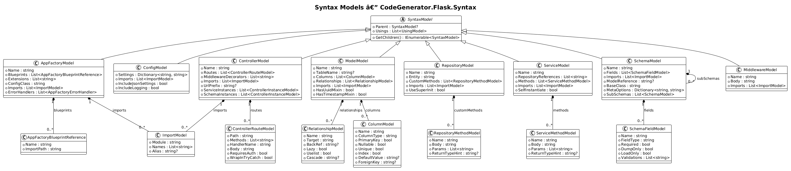
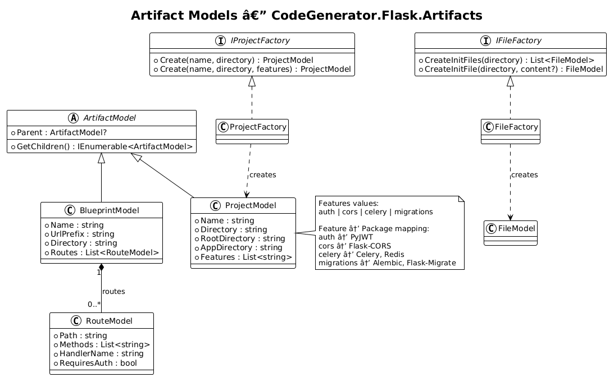
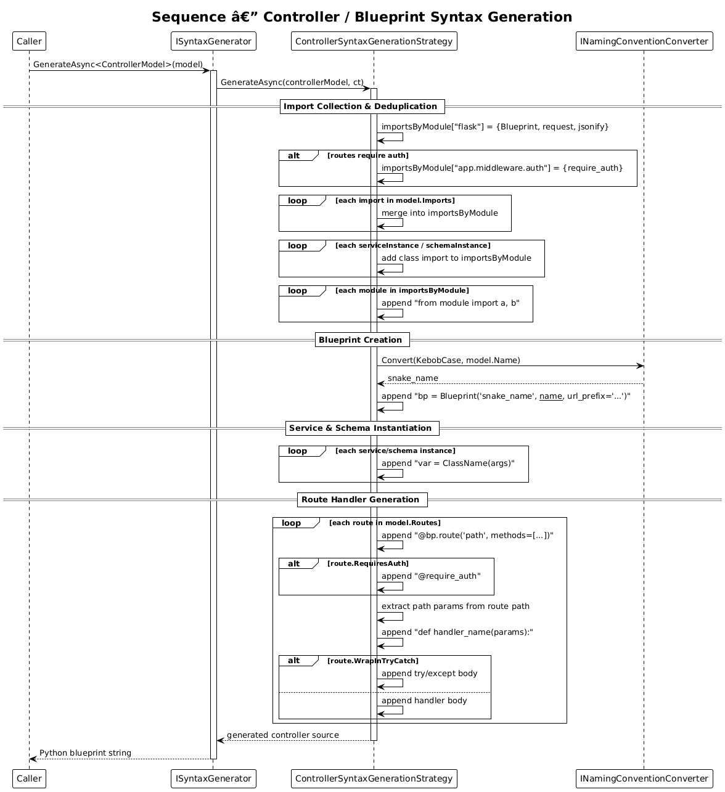
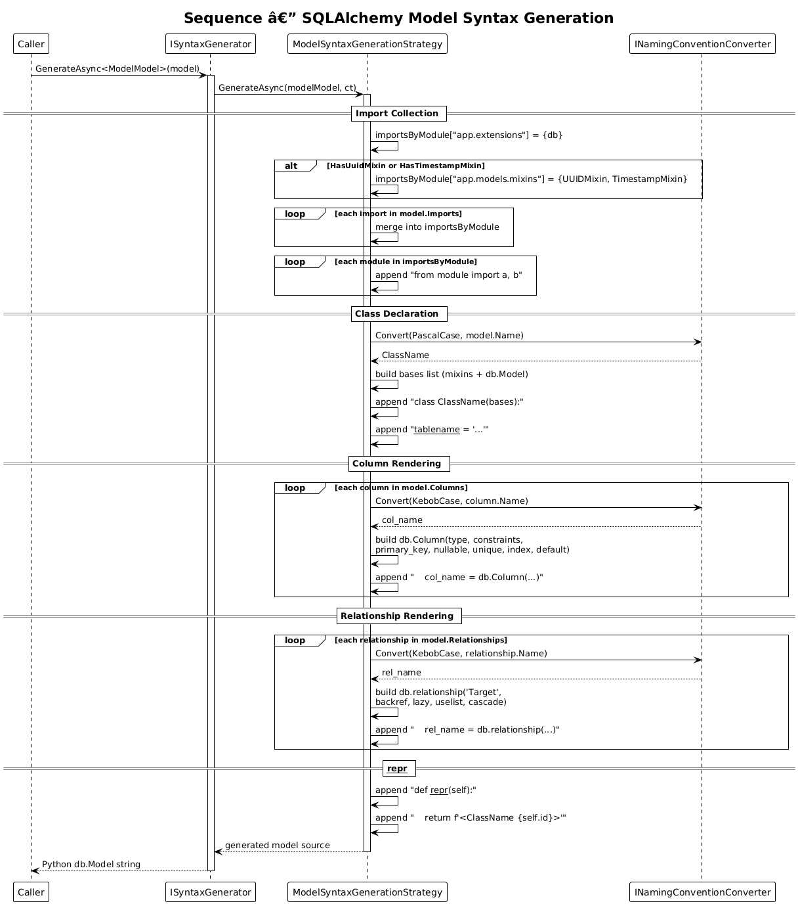
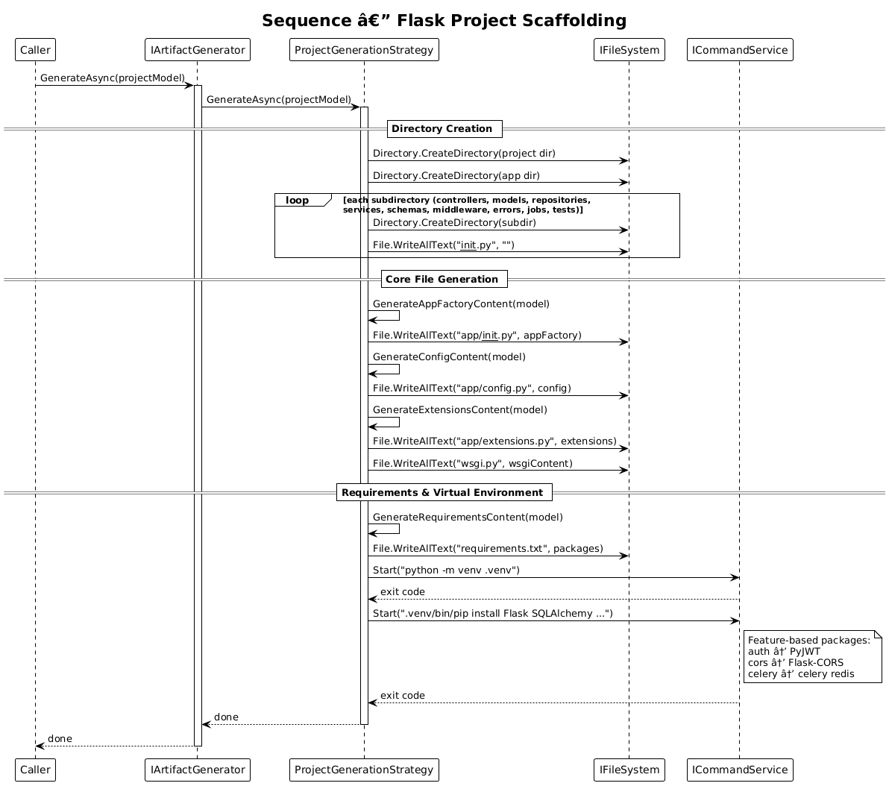

# Flask Backend Generation — Detailed Design

**Feature:** 04-flask-backend-generation
**Requirements:** [L2-PythonFlask.md](../../specs/L2-PythonFlask.md) — FR-05
**Status:** Implemented
**Date:** 2026-04-03

---

## 1. Overview

CodeGenerator.Flask extends the Core engine's strategy pattern to generate complete Flask backend applications. It provides two generation surfaces:

- **Syntax Engine** — Transforms Flask-specific syntax models (app factories, controllers, SQLAlchemy models, repositories, services, Marshmallow schemas, middleware, configuration) into valid Python source text.
- **Artifact Engine** — Scaffolds complete Flask project structures with directory hierarchies, boilerplate files, virtual environments, and feature-based package installation.

All strategies are auto-discovered via assembly scanning and registered through the `AddFlaskServices` extension method.

---

## 2. Architecture

### 2.1 C4 Context

The Flask package sits between the host application and external systems (file system, Python runtime).

| Actor / System | Responsibility |
|---|---|
| Developer | Configures Flask syntax and artifact models |
| Host Application | CLI or IDE extension that orchestrates generation |
| CodeGenerator.Flask | Generates Flask Python code and project structures |
| File System | Receives generated `.py` files and directories |
| Python Runtime / pip | Executes `venv` creation and package installation |

### 2.2 C4 Container

Inside the package, four containers collaborate:

| Container | Role |
|---|---|
| Syntax Engine | Eight `ISyntaxGenerationStrategy<T>` implementations that render Flask Python source |
| Artifact Engine | Two `IArtifactGenerationStrategy<T>` implementations that scaffold projects and blueprints |
| Project Factory | `IProjectFactory` — creates `ProjectModel` instances with optional features |
| File Factory | `IFileFactory` — creates `__init__.py` file models for Flask app packages |

### 2.3 C4 Component

The Syntax Engine contains eight strategies for generating Flask-specific Python constructs. The Artifact Engine's `ProjectGenerationStrategy` orchestrates full project scaffolding including directory creation, boilerplate file generation, and environment provisioning.

---

## 3. Syntax Models

### 3.1 Class Diagram

All syntax models extend `SyntaxModel` (from Core), which provides the `Parent` reference and `Usings` collection.

| Model | Purpose | Key Properties |
|---|---|---|
| `AppFactoryModel` | Flask app factory with `create_app()` | `Name`, `Blueprints`, `Extensions`, `ConfigClass`, `Imports`, `ErrorHandlers` |
| `ConfigModel` | Multi-environment configuration classes | `Settings`, `Imports`, `IncludeJsonSettings`, `IncludeLogging` |
| `ControllerModel` | Blueprint controller with routes | `Name`, `Routes`, `MiddlewareDecorators`, `Imports`, `UrlPrefix`, `ServiceInstances`, `SchemaInstances` |
| `ModelModel` | SQLAlchemy `db.Model` class | `Name`, `TableName`, `Columns`, `Relationships`, `Imports`, `HasUuidMixin`, `HasTimestampMixin` |
| `RepositoryModel` | Data access repository (BaseRepository subclass) | `Name`, `Entity`, `CustomMethods`, `Imports`, `UseSuperInit` |
| `ServiceModel` | Business logic service with DI | `Name`, `RepositoryReferences`, `Methods`, `Imports`, `SelfInstantiate` |
| `SchemaModel` | Marshmallow schema for validation | `Name`, `Fields`, `Imports`, `ModelReference`, `BaseClass`, `MetaOptions`, `SubSchemas` |
| `MiddlewareModel` | Decorator-based middleware function | `Name`, `Body`, `Imports` |

### 3.2 Supporting Models

| Model | Purpose | Key Properties |
|---|---|---|
| `ImportModel` | Python import statement | `Module`, `Names`, `Alias` |
| `AppFactoryBlueprintReference` | Blueprint registration entry | `Name`, `ImportPath` |
| `AppFactoryErrorHandler` | Custom error handler | `StatusCode`, `Body` |
| `ControllerRouteModel` | Route definition | `Path`, `Methods`, `HandlerName`, `Body`, `RequiresAuth`, `WrapInTryCatch` |
| `ControllerInstanceModel` | Service/schema instance | `VariableName`, `ClassName`, `ImportModule`, `ConstructorArgs` |
| `ControllerRouteQueryParameter` | Query parameter | `Name`, `DefaultValue`, `Type` |
| `ColumnModel` | SQLAlchemy column | `Name`, `ColumnType`, `PrimaryKey`, `Nullable`, `Unique`, `Index`, `DefaultValue`, `ForeignKey`, `Length` |
| `RelationshipModel` | SQLAlchemy relationship | `Name`, `Target`, `BackRef`, `BackPopulates`, `Lazy`, `LazyMode`, `Uselist`, `Cascade` |
| `RepositoryMethodModel` | Custom repository method | `Name`, `Body`, `Params`, `ReturnTypeHint` |
| `ServiceMethodModel` | Service method | `Name`, `Body`, `Params`, `TypedParams`, `ReturnTypeHint` |
| `SchemaFieldModel` | Marshmallow field | `Name`, `FieldType`, `Required`, `DumpOnly`, `LoadOnly`, `Validations` |

### 3.3 Composition Rules

- `AppFactoryModel` composes `AppFactoryBlueprintReference`, `AppFactoryErrorHandler`, and `ImportModel`.
- `ControllerModel` composes `ControllerRouteModel`, `ControllerInstanceModel`, and `ImportModel`.
- `ControllerRouteModel` composes `ControllerRouteQueryParameter`.
- `ModelModel` composes `ColumnModel`, `RelationshipModel`, and `ImportModel`.
- `RepositoryModel` composes `RepositoryMethodModel` and `ImportModel`.
- `ServiceModel` composes `ServiceMethodModel` and `ImportModel`.
- `SchemaModel` composes `SchemaFieldModel`, `ImportModel`, and nested `SchemaModel` sub-schemas.
- `MiddlewareModel` composes `ImportModel`.

---

## 4. Artifact Models

All artifact models extend `ArtifactModel` (from Core).

| Model | Purpose | Key Properties |
|---|---|---|
| `ProjectModel` | Full Flask project scaffold | `Name`, `Directory`, `RootDirectory`, `AppDirectory`, `Features` |
| `BlueprintModel` | Flask blueprint artifact | `Name`, `UrlPrefix`, `Directory`, `Routes` |
| `RouteModel` | Blueprint route entry | `Path`, `Methods`, `HandlerName`, `RequiresAuth` |

### 4.1 Feature Flags

Defined in `Constants.Features`:

| Feature | Behavior | Packages Added |
|---|---|---|
| `auth` | Adds JWT-based authentication support | PyJWT |
| `cors` | Enables cross-origin resource sharing | Flask-CORS |
| `celery` | Adds async task queue support | Celery, Redis |
| `migrations` | Enables database migrations | Alembic, Flask-Migrate |

### 4.2 Factories

| Interface | Implementation | Responsibility |
|---|---|---|
| `IProjectFactory` | `ProjectFactory` | `Create(name, directory)` → `ProjectModel`; `Create(name, directory, features)` → `ProjectModel` with feature flags |
| `IFileFactory` | `FileFactory` | `CreateInitFiles(directory)` — scans subdirectories for missing `__init__.py`; `CreateInitFile(directory, content?)` — creates a single `__init__.py` |

---

## 5. Syntax Generation Strategies

Each strategy implements `ISyntaxGenerationStrategy<T>` and is dispatched by `ISyntaxGenerator.GenerateAsync<T>()`.

### 5.1 AppFactorySyntaxGenerationStrategy

**Inputs:** `AppFactoryModel`
**Injects:** `INamingConventionConverter`, `ILogger`

**Algorithm:**
1. Emit `from flask import Flask`, `from app.extensions import db, migrate`, `from app.config import {ConfigClass}`.
2. For each blueprint, emit `from {ImportPath} import bp as {snake_name}_bp`.
3. Render additional imports (deduplicating by module).
4. Emit `def create_app(config_class={ConfigClass}):` with Flask instantiation and config loading.
5. Initialize each extension via `{ext}.init_app(app)` (defaults to `db` and `migrate` if none specified).
6. Register each blueprint via `app.register_blueprint({bp_var})`.
7. Render error handlers if present.
8. Return `app`.

### 5.2 ConfigSyntaxGenerationStrategy

**Inputs:** `ConfigModel`
**Injects:** `ILogger`

**Algorithm:**
1. Emit `import os`.
2. Render base `Config` class with `SECRET_KEY` and `SQLALCHEMY_DATABASE_URI` from environment variables, plus any custom `Settings`.
3. Render `DevelopmentConfig(Config)` with `DEBUG = True`.
4. Render `ProductionConfig(Config)` with `DEBUG = False`.
5. Render `TestingConfig(Config)` with `TESTING = True` and in-memory SQLite URI.

### 5.3 ControllerSyntaxGenerationStrategy

**Inputs:** `ControllerModel`
**Injects:** `INamingConventionConverter`, `ILogger`

**Algorithm:**
1. Collect and deduplicate imports by module: Flask core (`Blueprint`, `request`, `jsonify`), auth middleware (if any route requires auth), user-provided imports, service/schema instance imports.
2. Emit all `from module import names` lines.
3. Convert controller name to snake_case via `INamingConventionConverter`.
4. Emit `bp = Blueprint('{snake_name}', __name__, url_prefix='{urlPrefix}')`.
5. Instantiate service and schema instances (e.g., `user_service = UserService()`).
6. For each route:
   - Emit `@bp.route('{path}', methods=['{methods}'])`.
   - If `RequiresAuth` → emit `@require_auth`.
   - Extract path parameters from route pattern (e.g., `<int:id>` → `id`).
   - Emit `def handler_name(params):`.
   - If `WrapInTryCatch` → wrap body in `try/except Exception`.
   - Render query parameters, custom body, or default HTTP-method-specific responses.

### 5.4 ModelSyntaxGenerationStrategy

**Inputs:** `ModelModel`
**Injects:** `INamingConventionConverter`, `ILogger`

**Algorithm:**
1. Collect imports: `db` from `app.extensions`, mixin imports from `app.models.mixins` if needed, user-provided imports.
2. Convert model name to PascalCase.
3. Build base class list: optional `UUIDMixin`, optional `TimestampMixin`, then `db.Model`.
4. Emit `class ClassName(bases):` with `__tablename__`.
5. For each column: convert name to snake_case, build `db.Column(db.{Type}, constraints...)` with all options (primary_key, nullable, unique, index, default, foreign_key, length, check_constraint, comment, server_default, onupdate, autoincrement).
6. For each relationship: build `db.relationship('{Target}', backref, back_populates, lazy, uselist, cascade)`.
7. Emit `def __repr__(self):` returning `f'<ClassName {self.id}>'`.

### 5.5 RepositorySyntaxGenerationStrategy

**Inputs:** `RepositoryModel`
**Injects:** `INamingConventionConverter`, `ILogger`

**Algorithm:**
1. Render imports for `BaseRepository` and the entity model.
2. Emit `class {Name}(BaseRepository):`.
3. If `UseSuperInit` → emit `def __init__(self):` with `super().__init__({Entity})`.
4. For each custom method: emit `def {name}(self, params):` with body and optional return type hint.

### 5.6 ServiceSyntaxGenerationStrategy

**Inputs:** `ServiceModel`
**Injects:** `INamingConventionConverter`, `ILogger`

**Algorithm:**
1. Render imports for repository dependencies.
2. Emit `class {Name}:`.
3. Emit `def __init__(self, {repositories}):` with `self.{repo} = {repo}` assignments.
4. For each method: emit `def {name}(self, params):` with typed parameters, body, and optional return type hint.

### 5.7 SchemaSyntaxGenerationStrategy

**Inputs:** `SchemaModel`
**Injects:** `INamingConventionConverter`, `ILogger`

**Algorithm:**
1. Render imports for `marshmallow` or `marshmallow_sqlalchemy`.
2. Emit `class {Name}({BaseClass}):`.
3. If `MetaOptions` present → render `class Meta:` with model, fields, etc.
4. For each field: emit `{name} = fields.{FieldType}(required=, dump_only=, load_only=, validate=[...])`.
5. For each nested sub-schema: render inline `SchemaModel` class.

### 5.8 MiddlewareSyntaxGenerationStrategy

**Inputs:** `MiddlewareModel`
**Injects:** `INamingConventionConverter`, `ILogger`

**Algorithm:**
1. Render imports including `from functools import wraps`.
2. Emit `def {name}(f):`.
3. Emit `    @wraps(f)`.
4. Emit `    def decorated_function(*args, **kwargs):`.
5. Render custom body logic.
6. Emit `        return f(*args, **kwargs)`.
7. Emit `    return decorated_function`.

---

## 6. Artifact Generation Strategies

Each strategy implements `IArtifactGenerationStrategy<T>` and is dispatched by `IArtifactGenerator.GenerateAsync()`.

### 6.1 ProjectGenerationStrategy

**Inputs:** `ProjectModel`
**Injects:** `ICommandService`, `IFileSystem`, `ILogger`

**Steps:**
1. Create project root directory and `app/` directory.
2. Create subdirectories: `controllers/`, `models/`, `repositories/`, `services/`, `schemas/`, `middleware/`, `errors/`, `jobs/` (inside `app/`) and `tests/` (at project root).
3. Write empty `__init__.py` in each subdirectory.
4. Generate and write `app/__init__.py` (app factory with `create_app()`).
5. Generate and write `app/config.py` (Config, DevelopmentConfig, ProductionConfig, TestingConfig).
6. Generate and write `app/extensions.py` (SQLAlchemy `db`, Migrate `migrate` instances).
7. Generate and write `wsgi.py` (WSGI entry point).
8. Generate and write `requirements.txt` (base packages + feature-based additions).
9. Run `python -m venv .venv` to create virtual environment.
10. Run `.venv/bin/pip install` with all required packages (feature-dependent).

### 6.2 BlueprintGenerationStrategy

**Inputs:** `BlueprintModel`
**Injects:** `IFileSystem`, `INamingConventionConverter`, `ILogger`

**Steps:**
1. Convert blueprint name to snake_case.
2. Emit `from flask import Blueprint, request, jsonify`.
3. Emit `bp = Blueprint('{snake_name}', __name__, url_prefix='{UrlPrefix}')`.
4. For each route: emit `@bp.route()` decorator with methods, optional `@require_auth`, and handler stub.
5. Write to `{Directory}/{snake_name}.py`.

---

## 7. Dependency Injection

`ConfigureServices.AddFlaskServices(IServiceCollection)` registers:

| Registration | Lifetime | Mechanism |
|---|---|---|
| `IFileFactory` → `FileFactory` | Singleton | Explicit |
| `IProjectFactory` → `ProjectFactory` | Singleton | Explicit |
| All `ISyntaxGenerationStrategy<T>` | — | Assembly scanning via `AddSyntaxGenerator` |
| All `IArtifactGenerationStrategy<T>` | — | Assembly scanning via `AddArifactGenerator` |

Assembly scanning discovers strategies from the assembly containing `ProjectModel`.

---

## 8. Constants

### File Extensions

| Constant | Value |
|---|---|
| `Python` | `.py` |
| `Requirements` | `.txt` |
| `Toml` | `.toml` |
| `Env` | `.env` |

### File Names

| Constant | Value |
|---|---|
| `Init` | `__init__` |
| `App` | `app` |
| `Config` | `config` |
| `Extensions` | `extensions` |
| `Requirements` | `requirements` |
| `Wsgi` | `wsgi` |
| `Manage` | `manage` |
| `Conftest` | `conftest` |
| `BaseRepository` | `base_repository` |
| `Errors` | `errors` |
| `Mixins` | `mixins` |

### Directories

| Constant | Value |
|---|---|
| `Controllers` | `controllers` |
| `Models` | `models` |
| `Repositories` | `repositories` |
| `Services` | `services` |
| `Schemas` | `schemas` |
| `Middleware` | `middleware` |
| `Errors` | `errors` |
| `Jobs` | `jobs` |
| `Tests` | `tests` |

### Project Types

| Constant | Value |
|---|---|
| `FlaskApi` | REST API project |
| `FlaskWeb` | Web application project |

---

## 9. Requirements Traceability

| Requirement | Component |
|---|---|
| FR-05.1 App Factory Generation | `AppFactoryModel`, `AppFactorySyntaxGenerationStrategy` |
| FR-05.2 Configuration Class Generation | `ConfigModel`, `ConfigSyntaxGenerationStrategy` |
| FR-05.3 Controller/Blueprint Generation | `ControllerModel`, `ControllerSyntaxGenerationStrategy`, `BlueprintModel`, `BlueprintGenerationStrategy` |
| FR-05.4 SQLAlchemy Model Generation | `ModelModel`, `ModelSyntaxGenerationStrategy` |
| FR-05.5 Repository Generation | `RepositoryModel`, `RepositorySyntaxGenerationStrategy` |
| FR-05.6 Service Generation | `ServiceModel`, `ServiceSyntaxGenerationStrategy` |
| FR-05.7 Marshmallow Schema Generation | `SchemaModel`, `SchemaSyntaxGenerationStrategy` |
| FR-05.8 Middleware Generation | `MiddlewareModel`, `MiddlewareSyntaxGenerationStrategy` |
| FR-05.9 Flask Project Scaffolding | `ProjectModel`, `ProjectGenerationStrategy`, `IProjectFactory`, `IFileFactory` |

---

## 10. Diagram Index

| Diagram | File | Description |
|---|---|---|
| C4 Context | [c4_context.puml](diagrams/c4_context.puml) | System context with external actors |
| C4 Container | [c4_container.puml](diagrams/c4_container.puml) | Internal containers: Syntax Engine, Artifact Engine, Factories |
| C4 Component | [c4_component.puml](diagrams/c4_component.puml) | All nine strategy components and their interactions |
| Syntax Class Diagram | [class_diagram.puml](diagrams/class_diagram.puml) | Syntax model inheritance and composition |
| Artifact Class Diagram | [class_artifact_models.puml](diagrams/class_artifact_models.puml) | Artifact model hierarchy, factories, and feature flags |
| Project Scaffolding | [sequence_project_scaffolding.puml](diagrams/sequence_project_scaffolding.puml) | Full Flask project creation flow |
| Controller Generation | [sequence_controller_generation.puml](diagrams/sequence_controller_generation.puml) | Blueprint creation, import dedup, route handler rendering |
| Model Generation | [sequence_model_generation.puml](diagrams/sequence_model_generation.puml) | db.Model class, columns, relationships, mixins rendering |
