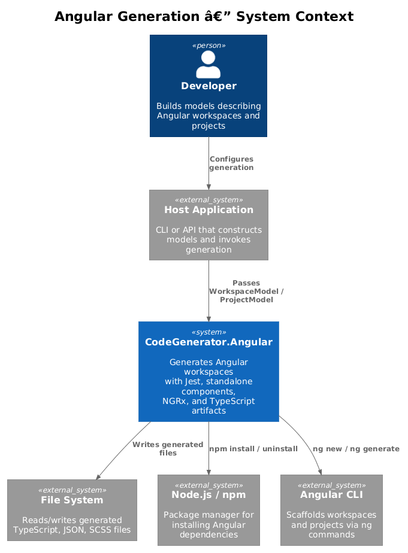
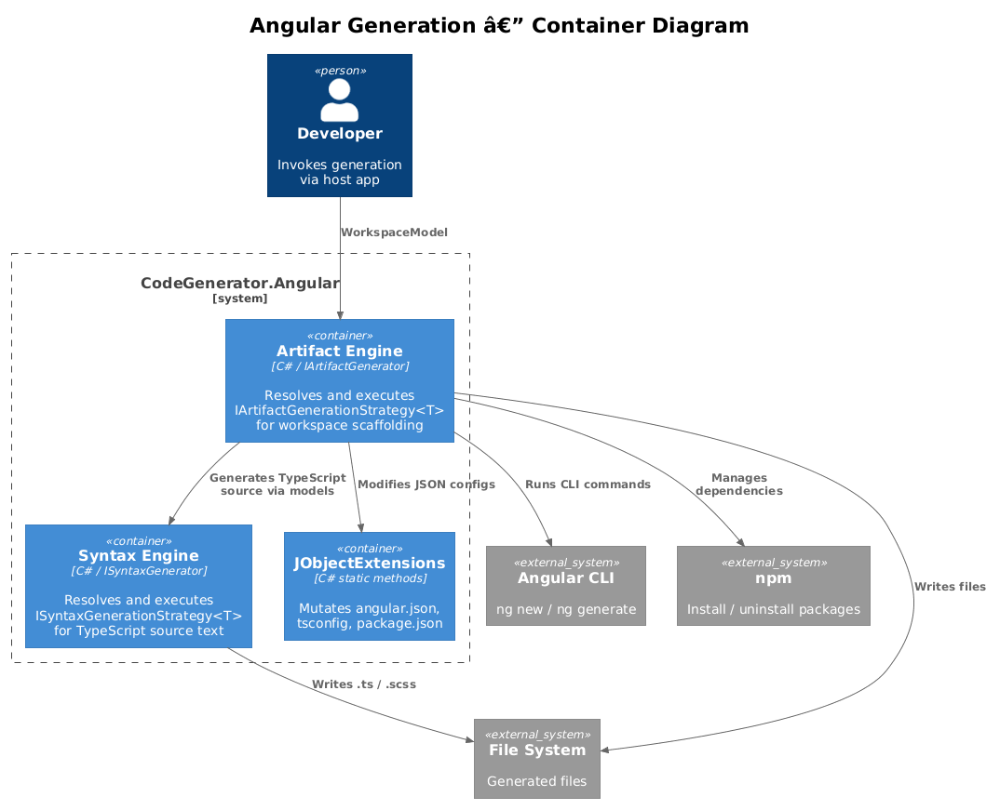
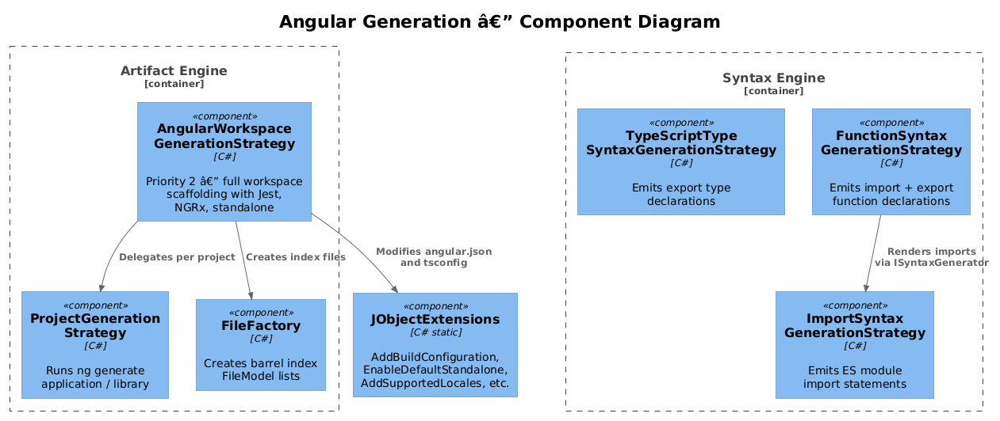
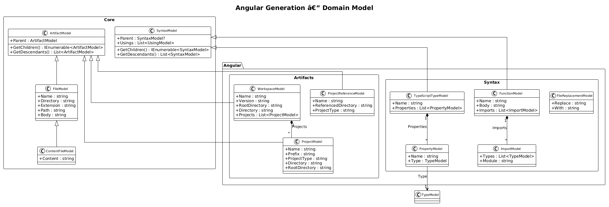
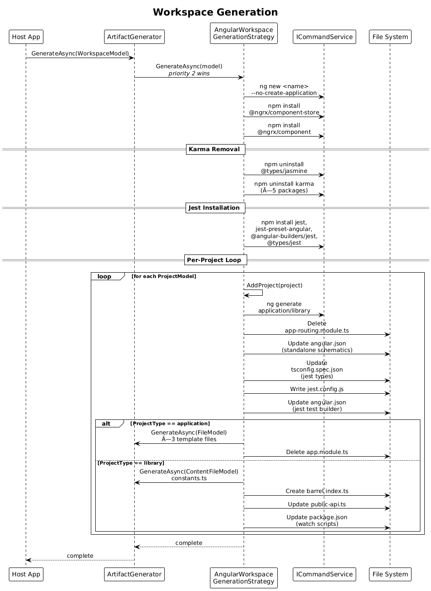
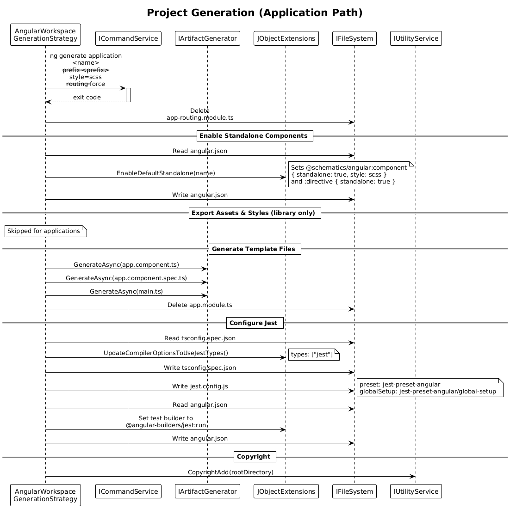

# Angular Generation — Detailed Design

## 1. Overview

The **CodeGenerator.Angular** package generates fully configured Angular workspaces and projects from model descriptions. It automates the scaffolding of Angular CLI workspaces with Jest testing (replacing Karma), standalone components, NGRx state management, TypeScript type definitions, exported functions, and barrel index files.

**Actors:** A host application (CLI or API) that constructs workspace/project models and invokes the generation pipeline.

**Scope:** The `CodeGenerator.Angular` assembly — syntax strategies that emit TypeScript source text, and artifact strategies that orchestrate Angular CLI commands and file-system mutations.

## 2. Architecture

### 2.1 C4 Context Diagram

Shows the Angular generation package in the broader system landscape.



### 2.2 C4 Container Diagram

The two logical engines inside the package — Syntax Engine and Artifact Engine — and their external touchpoints.



### 2.3 C4 Component Diagram

Individual strategy and utility components within the Angular package.



## 3. Component Details

### 3.1 WorkspaceGenerationStrategy

- **Responsibility:** Scaffolds a new Angular workspace via `ng new --no-create-application`, removes Karma test dependencies, installs Jest and NGRx packages, then delegates each child project to the artifact pipeline.
- **Interface:** `IArtifactGenerationStrategy<WorkspaceModel>` (priority 1)
- **Dependencies:** `ICommandService`, `ILogger<WorkspaceGenerationStrategy>`

### 3.2 AngularWorkspaceGenerationStrategy

- **Responsibility:** Higher-priority workspace strategy (priority 2) that extends workspace generation with project-level configuration: standalone component enablement, Jest config creation, tsconfig updates, barrel index creation, library watch scripts, and public-api management.
- **Interface:** `IArtifactGenerationStrategy<WorkspaceModel>` (priority 2 — wins over `WorkspaceGenerationStrategy`)
- **Dependencies:** `ICommandService`, `IArtifactGenerator`, `IFileProvider`, `IFileFactory`, `INamingConventionConverter`, `IFileSystem`, `IUtilityService`
- **Key methods:** `KarmaRemove`, `JestInstall`, `AddProject`, `EnableDefaultStandalone`, `ExportsAssetsAndStyles`, `UpdateCompilerOptionsToUseJestTypes`, `UpdateAngularJsonToUseJest`, `JestConfigCreate`, `IndexCreate`

### 3.3 ProjectGenerationStrategy

- **Responsibility:** Runs `ng generate application` or `ng generate library` for a single project inside the workspace.
- **Interface:** `IArtifactGenerationStrategy<ProjectModel>` (priority 1)
- **Dependencies:** `ICommandService`, `ILogger<ProjectGenerationStrategy>`

### 3.4 TypeScriptTypeSyntaxGenerationStrategy

- **Responsibility:** Emits a TypeScript `export type` declaration from a `TypeScriptTypeModel`. Properties are rendered with optional (`?:`) syntax and camelCase naming.
- **Interface:** `ISyntaxGenerationStrategy<TypeScriptTypeModel>`
- **Dependencies:** `INamingConventionConverter`, `ILogger`

### 3.5 FunctionSyntaxGenerationStrategy

- **Responsibility:** Emits import statements followed by an `export function` declaration from a `FunctionModel`. Delegates import rendering to the `ISyntaxGenerator` pipeline.
- **Interface:** `ISyntaxGenerationStrategy<FunctionModel>`
- **Dependencies:** `ISyntaxGenerator`, `INamingConventionConverter`, `ILogger`

### 3.6 ImportSyntaxGenerationStrategy

- **Responsibility:** Emits a single ES module import statement (`import { Type1, Type2 } from "module";`) from an `ImportModel`.
- **Interface:** `ISyntaxGenerationStrategy<ImportModel>`
- **Dependencies:** `ILogger`

### 3.7 JObjectExtensions

- **Responsibility:** Static helper methods that mutate Newtonsoft `JObject` instances representing `angular.json`, `tsconfig.spec.json`, `package.json`, and `ng-package.json`. Provides `AddBuildConfiguration`, `EnableDefaultStandalone`, `AddSupportedLocales`, `UpdateCompilerOptionsToUseJestTypes`, `ExportsAssetsAndStyles`, `AddScript`, `AddStyle`, `AddAuthor`, `GetProjectDirectory`.
- **Dependencies:** None (static extension methods on `JObject`)

### 3.8 FileFactory

- **Responsibility:** Creates barrel index `FileModel` lists by scanning directories for `.ts` or `.scss` files and producing `export *` or `@use` lines.
- **Interface:** `IFileFactory` (Angular-specific)
- **Dependencies:** `IFileSystem`, `ILogger`

## 4. Data Model

### 4.1 Class Diagram



### 4.2 Entity Descriptions

| Entity | Inherits | Description |
|--------|----------|-------------|
| **ArtifactModel** | — | Base class for all generatable artifacts. Provides `Parent` reference and `GetChildren()`/`GetDescendants()` tree traversal. |
| **WorkspaceModel** | ArtifactModel | Represents an Angular CLI workspace. Holds `Name`, `Version`, `RootDirectory`, `Directory`, and a list of `ProjectModel` children. |
| **ProjectModel** | ArtifactModel | Represents an application or library project inside a workspace. Supports scoped package names (`@scope/name`). Holds `Name`, `Prefix`, `ProjectType`, `Directory`. |
| **ProjectReferenceModel** | ArtifactModel | Lightweight reference to an existing project used for configuration updates (standalone enablement, asset exports). |
| **FileModel** | ArtifactModel | A generated file with `Name`, `Directory`, `Extension`, `Path`, and `Body`. |
| **ContentFileModel** | FileModel | A file whose content is provided directly as a string (`Content`). |
| **SyntaxModel** | — | Base class for syntax tree nodes. Provides `Parent`, `Usings`, and `GetChildren()`/`GetDescendants()`. |
| **TypeScriptTypeModel** | SyntaxModel | A TypeScript type declaration with `Name` and `Properties` (list of `PropertyModel`). |
| **FunctionModel** | SyntaxModel | A TypeScript function with `Name`, `Body`, and `Imports` (list of `ImportModel`). |
| **ImportModel** | — | An ES module import with `Types` (list of `TypeModel`) and `Module` path. |
| **PropertyModel** | — | A property with `Name` and `Type` (`TypeModel`). |
| **FileReplacementModel** | — | A pair of file paths (`Replace`, `With`) used in Angular build configurations. |

## 5. Key Workflows

### 5.1 Workspace Generation

The full end-to-end flow from a `WorkspaceModel` through CLI scaffolding, dependency management, and per-project generation.



**Steps:**

1. Host application passes `WorkspaceModel` to `IArtifactGenerator.GenerateAsync`.
2. The `ArtifactGenerator` resolves `AngularWorkspaceGenerationStrategy` (priority 2).
3. Strategy runs `ng new <name> --no-create-application` to scaffold an empty workspace.
4. Installs NGRx packages (`@ngrx/component-store`, `@ngrx/component`).
5. Calls `KarmaRemove` — uninstalls six Karma/Jasmine packages.
6. Calls `JestInstall` — installs `jest`, `jest-preset-angular`, `@angular-builders/jest`, `@types/jest`.
7. Iterates over `model.Projects` and calls `AddProject` for each.
8. For each project: runs `ng generate`, enables standalone, updates tsconfig for Jest types, creates `jest.config.js`, updates `angular.json` to use `@angular-builders/jest:run`, generates template files (applications) or library scaffolding (libraries).

### 5.2 Project Generation (Application)

Detailed flow for adding an **application** project to an existing workspace.



**Steps:**

1. `AddProject` builds the `ng generate application` command with `--prefix`, `--style=scss`, `--routing` flags.
2. Runs the CLI command via `ICommandService`.
3. Deletes the legacy `app-routing.module.ts`.
4. Calls `EnableDefaultStandalone` — updates `angular.json` schematics for standalone components and directives.
5. Generates template files: `app.component.ts`, `app.component.spec.ts`, `main.ts` via `IArtifactGenerator`.
6. Deletes `app.module.ts`.
7. Calls `UpdateCompilerOptionsToUseJestTypes` — replaces tsconfig.spec.json types with `["jest"]`.
8. Calls `JestConfigCreate` — writes `jest.config.js` with `jest-preset-angular`.
9. Calls `UpdateAngularJsonToUseJest` — sets test builder to `@angular-builders/jest:run`.
10. Calls `IUtilityService.CopyrightAdd` to stamp copyright headers.

## 6. Dependency Injection

The `ConfigureServices.AddAngularServices` extension method registers all Angular generation components:

```csharp
services.AddSingleton<IFileFactory, FileFactory>();
services.AddArtifactGenerator(typeof(ProjectModel).Assembly);  // scans assembly for IArtifactGenerationStrategy<T>
services.AddSyntaxGenerator(typeof(ProjectModel).Assembly);    // scans assembly for ISyntaxGenerationStrategy<T>
```

Assembly scanning automatically registers:
- `WorkspaceGenerationStrategy` → `IArtifactGenerationStrategy<WorkspaceModel>` (priority 1)
- `AngularWorkspaceGenerationStrategy` → `IArtifactGenerationStrategy<WorkspaceModel>` (priority 2)
- `ProjectGenerationStrategy` → `IArtifactGenerationStrategy<ProjectModel>`
- `TypeScriptTypeSyntaxGenerationStrategy` → `ISyntaxGenerationStrategy<TypeScriptTypeModel>`
- `FunctionSyntaxGenerationStrategy` → `ISyntaxGenerationStrategy<FunctionModel>`
- `ImportSyntaxGenerationStrategy` → `ISyntaxGenerationStrategy<ImportModel>`

## 7. Security Considerations

- **Command injection:** `ICommandService.Start` passes user-supplied names directly into shell commands (`ng new {model.Name}`). Names must be validated upstream before model construction.
- **File-system traversal:** `ProjectModel` computes directory paths from `Name`; scoped names containing `..` could escape the workspace root. Input sanitisation is the caller's responsibility.
- **Registry pinning:** npm install calls use `--registry=https://registry.npmjs.org/` to prevent supply-chain redirection.

## 8. Open Questions

1. **Priority overlap:** Both `WorkspaceGenerationStrategy` (priority 1) and `AngularWorkspaceGenerationStrategy` (priority 2) handle `WorkspaceModel`. The higher-priority strategy always wins — should the lower-priority one be removed or repurposed?
2. **Async methods returning `Task`:** Several methods in `AngularWorkspaceGenerationStrategy` are marked `async` but contain no `await` expressions. Consider converting to synchronous or adding `Task.CompletedTask` returns.
3. **IndexModel:** The user-facing requirements mention `IndexModel` and `IndexSyntaxGenerationStrategy`, but the codebase implements barrel index generation procedurally inside `AngularWorkspaceGenerationStrategy.IndexCreate` and `FileFactory.IndexCreate`. Extracting these into a formal `ISyntaxGenerationStrategy<IndexModel>` would improve testability.
