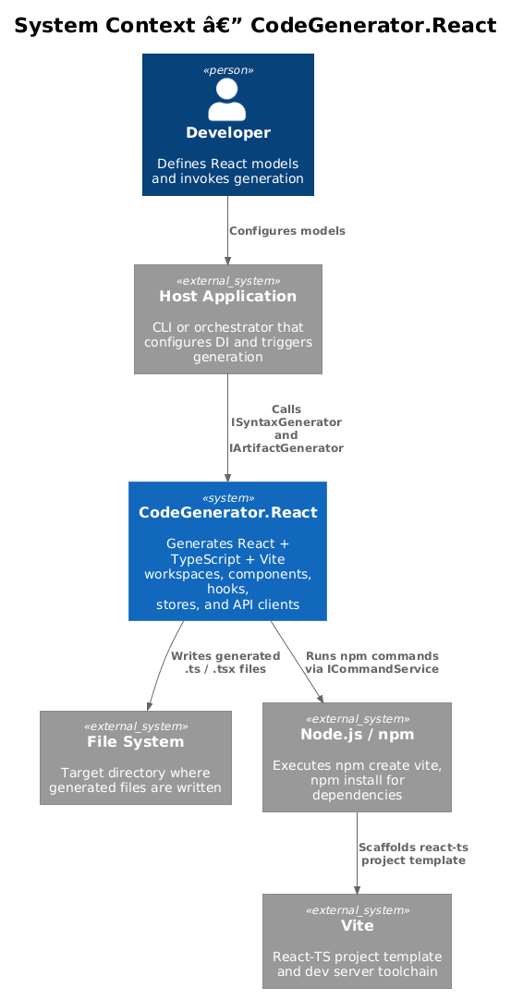
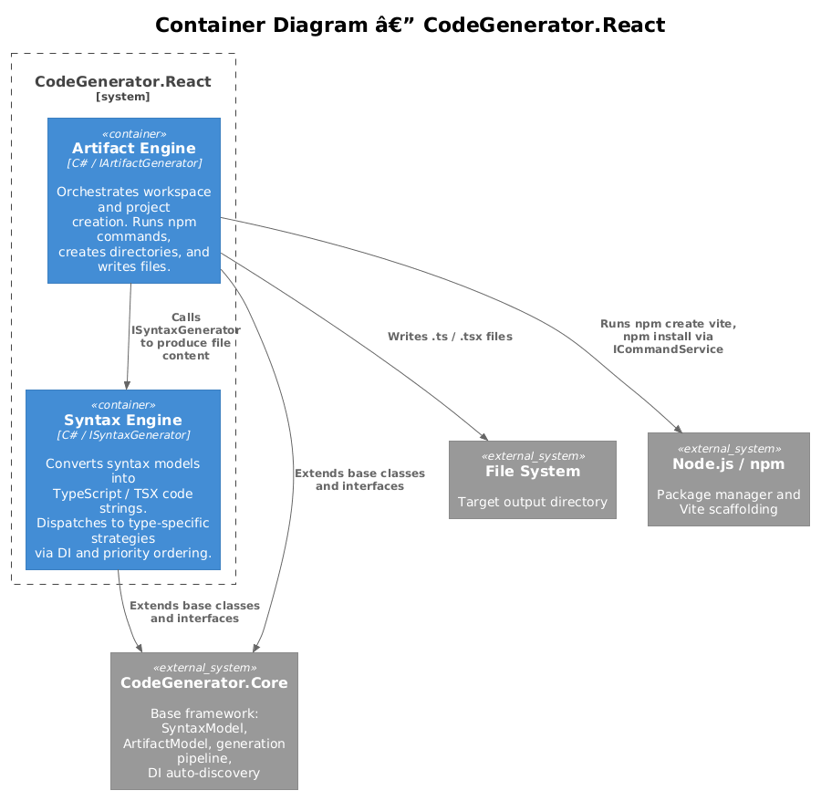
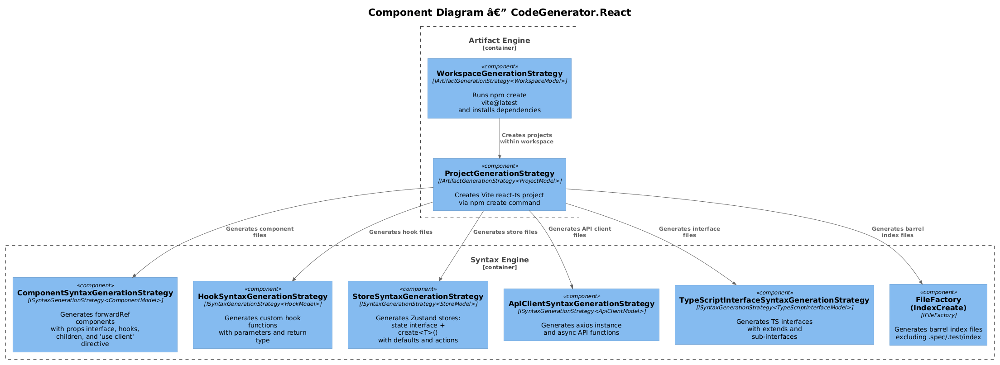
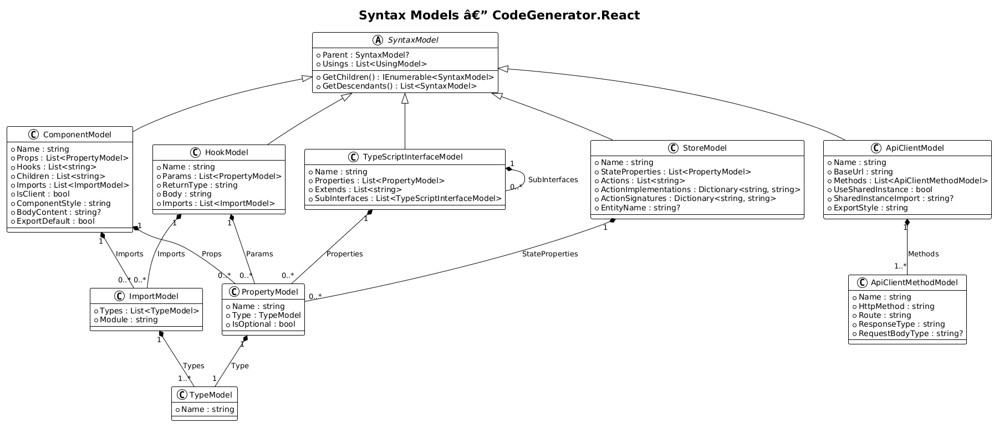
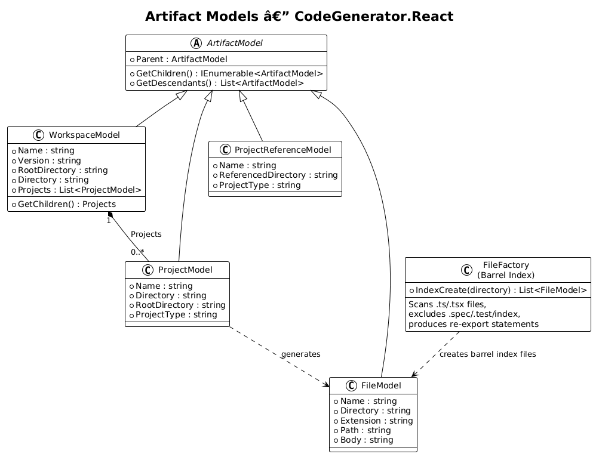
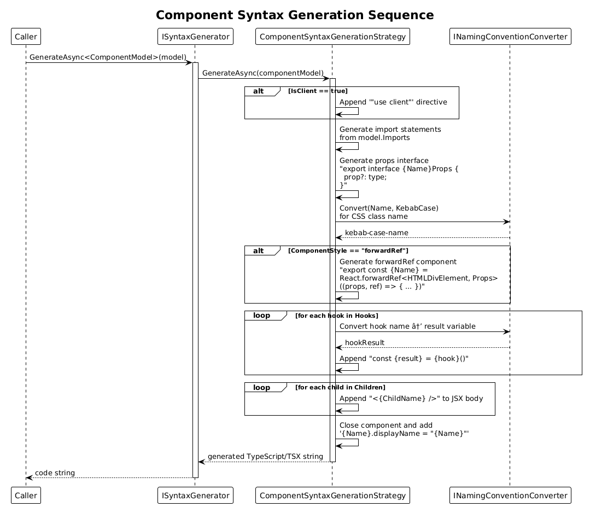
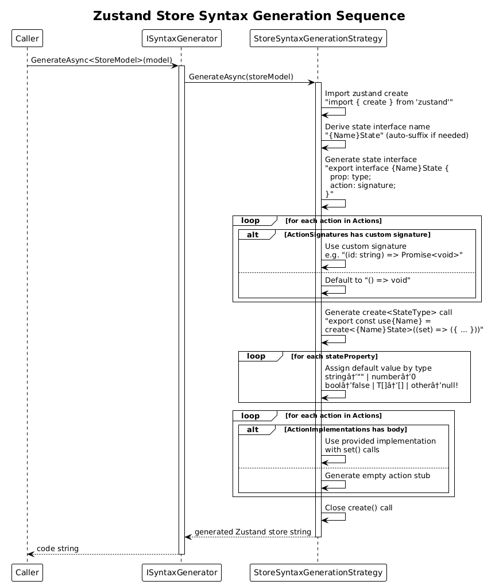
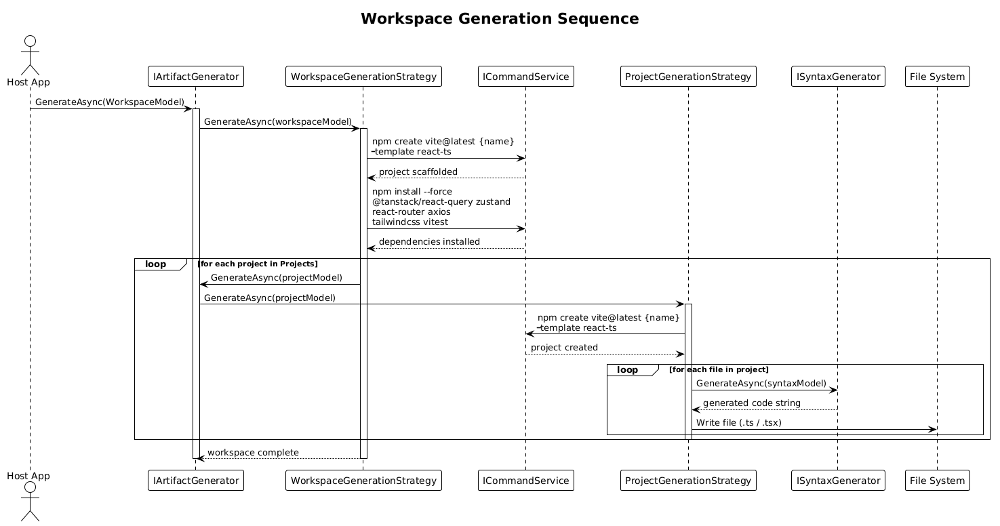

# Detailed Design — 06 React Generation

**Feature:** CodeGenerator.React
**Requirement:** FR-07 (React Generation) — [L2-Frontend.md](../../specs/L2-Frontend.md)
**Status:** Implemented
**Date:** 2026-04-03

---

## 1. Overview

`CodeGenerator.React` generates React + TypeScript + Vite workspaces containing functional components, custom hooks, Zustand stores, Axios-based API clients, TypeScript interfaces with inheritance, and barrel index files. It extends the Core generation engine through two pipelines:

- **Syntax Generation** — converts model objects into TypeScript / TSX code strings.
- **Artifact Generation** — orchestrates workspace scaffolding, dependency installation, project creation, and file output.

All strategies are auto-discovered and registered via `AddReactServices()` which scans the React assembly for `ISyntaxGenerationStrategy<T>` and `IArtifactGenerationStrategy<T>` implementations.

---

## 2. Architecture

### 2.1 System Context

The React generator is invoked by a host application (CLI or orchestrator) that configures DI, builds models, and calls `ISyntaxGenerator` / `IArtifactGenerator`. Output flows to the file system and Node.js/npm for workspace scaffolding.



### 2.2 Container View

Two logical containers exist inside the package:

| Container | Responsibility |
|---|---|
| **Syntax Engine** | Dispatches syntax models to type-specific strategies that return generated code strings. |
| **Artifact Engine** | Orchestrates workspace/project creation, runs npm commands via `ICommandService`, and writes files. |



### 2.3 Component View



---

## 3. Syntax Models

All syntax models extend `SyntaxModel` from `CodeGenerator.Core`, inheriting `Parent`, `Usings`, and the `GetChildren()` / `GetDescendants()` traversal methods.



### 3.1 ComponentModel

| Property | Type | Description |
|---|---|---|
| `Name` | `string` | Component name (PascalCase). |
| `Props` | `List<PropertyModel>` | Typed props with optional flag. |
| `Hooks` | `List<string>` | Hook names to initialize (e.g., `useState`). |
| `Children` | `List<string>` | Child component names rendered in JSX. |
| `Imports` | `List<ImportModel>` | Import statements for the file. |
| `IsClient` | `bool` | When `true`, emits `"use client"` directive. |
| `ComponentStyle` | `string` | `"forwardRef"` (default), `"fc"`, or `"arrow"`. |
| `BodyContent` | `string?` | Optional custom JSX body. |
| `ExportDefault` | `bool` | Use `export default` instead of named export. |

### 3.2 HookModel

| Property | Type | Description |
|---|---|---|
| `Name` | `string` | Hook name (must start with `use`). |
| `Params` | `List<PropertyModel>` | Typed parameters. |
| `ReturnType` | `string` | TypeScript return type annotation. |
| `Body` | `string` | Hook implementation body. |
| `Imports` | `List<ImportModel>` | Import statements. |

### 3.3 StoreModel

| Property | Type | Description |
|---|---|---|
| `Name` | `string` | Store name (e.g., `UserStore`). |
| `StateProperties` | `List<PropertyModel>` | State fields with types. |
| `Actions` | `List<string>` | Action names. |
| `ActionImplementations` | `Dictionary<string, string>` | Action name → body with `set()` calls. |
| `ActionSignatures` | `Dictionary<string, string>` | Action name → custom signature. |
| `EntityName` | `string?` | Optional entity name for naming conventions. |

### 3.4 ApiClientModel

| Property | Type | Description |
|---|---|---|
| `Name` | `string` | Client name. |
| `BaseUrl` | `string` | Axios base URL. |
| `Methods` | `List<ApiClientMethodModel>` | HTTP method definitions. |
| `UseSharedInstance` | `bool` | Import shared axios instance vs. create inline. |
| `SharedInstanceImport` | `string?` | Path to shared instance module. |
| `ExportStyle` | `string` | `"functions"` (default) or `"object"`. |

**ApiClientMethodModel:**

| Property | Type | Description |
|---|---|---|
| `Name` | `string` | Function name. |
| `HttpMethod` | `string` | `GET`, `POST`, `PUT`, `DELETE`. |
| `Route` | `string` | URL path with `${param}` placeholders. |
| `ResponseType` | `string` | TypeScript response type (default `"any"`). |
| `RequestBodyType` | `string?` | Body type for POST/PUT methods. |

### 3.5 TypeScriptInterfaceModel

| Property | Type | Description |
|---|---|---|
| `Name` | `string` | Interface name. |
| `Properties` | `List<PropertyModel>` | Typed properties with optional flag. |
| `Extends` | `List<string>` | Base interface names. |
| `SubInterfaces` | `List<TypeScriptInterfaceModel>` | Nested sub-interface definitions. |

### 3.6 Barrel Index (FileFactory.IndexCreate)

The `IFileFactory.IndexCreate(directory)` method scans a directory for `.ts` and `.tsx` files, excludes `.spec.*`, `.test.*`, and `index.*` files, and generates `export * from './module';` re-export lines. Subdirectories containing an `index.ts` are also re-exported.

### 3.7 Supporting Models

| Model | Properties | Purpose |
|---|---|---|
| `PropertyModel` | `Name`, `Type` (`TypeModel`), `IsOptional` | Describes a typed property (prop, param, state field). |
| `ImportModel` | `Types` (`List<TypeModel>`), `Module` | `import { A, B } from "module";` |
| `TypeModel` | `Name` | Type reference (e.g., `string`, `Promise<User[]>`). |

---

## 4. Artifact Models

Artifact models extend `ArtifactModel` from Core and represent file-system structures.



### 4.1 WorkspaceModel

| Property | Type | Description |
|---|---|---|
| `Name` | `string` | Workspace/package name. |
| `Version` | `string` | Package version. |
| `RootDirectory` | `string` | Parent directory for the workspace. |
| `Directory` | `string` | Computed: `RootDirectory/Name`. |
| `Projects` | `List<ProjectModel>` | Child projects in the workspace. |

`GetChildren()` returns `Projects`, enabling recursive artifact generation.

### 4.2 ProjectModel

| Property | Type | Description |
|---|---|---|
| `Name` | `string` | Project/package name (supports `@scope/name`). |
| `Directory` | `string` | Computed path under `RootDirectory/packages/`. |
| `RootDirectory` | `string` | Workspace root directory. |
| `ProjectType` | `string` | `"application"` (default). |

Scoped names (`@scope/package`) resolve to `{RootDirectory}/packages/scope/package`.

### 4.3 FileModel (Core)

| Property | Type | Description |
|---|---|---|
| `Name` | `string` | File name without extension. |
| `Directory` | `string` | Target directory. |
| `Extension` | `string` | File extension (`.ts`, `.tsx`). |
| `Path` | `string` | Computed full path. |
| `Body` | `string` | Generated file content. |

---

## 5. Syntax Generation Strategies

Each strategy implements `ISyntaxGenerationStrategy<T>` and is auto-registered as a singleton.

### 5.1 ComponentSyntaxGenerationStrategy

**Input:** `ComponentModel` → **Output:** TypeScript/TSX component file.



**Generation steps:**

1. Emit `"use client"` directive if `IsClient` is true.
2. Render all import statements from `model.Imports`.
3. Generate props interface: `export interface {Name}Props { prop?: type; }`.
4. Convert component name to kebab-case for CSS `className`.
5. Emit `React.forwardRef<HTMLDivElement, {Name}Props>((props, ref) => { ... })` wrapper (default style).
6. Initialize each hook: `const {hookResult} = {hook}()`.
7. Render child components as `<ChildName />` JSX elements inside the return.
8. Append `{Name}.displayName = "{Name}"`.

**Dependencies:** `ISyntaxGenerator`, `INamingConventionConverter`, `ILogger`.

### 5.2 HookSyntaxGenerationStrategy

**Input:** `HookModel` → **Output:** Custom hook function.

```typescript
// Generated output structure
import { dep } from "module";

export function useHookName(param: Type): ReturnType {
  // body
}
```

### 5.3 StoreSyntaxGenerationStrategy

**Input:** `StoreModel` → **Output:** Zustand store module.



**Generation steps:**

1. Emit `import { create } from 'zustand'`.
2. Derive state interface name (`{Name}State`, auto-suffixed if needed).
3. Generate state interface with property types and action signatures.
4. Emit `export const use{Name} = create<{Name}State>((set) => ({ ... }))`.
5. Assign default values by type: `string` → `""`, `number` → `0`, `boolean` → `false`, `T[]` → `[]`, other → `null!`.
6. Emit each action implementation body (uses `set()` for state updates).

### 5.4 ApiClientSyntaxGenerationStrategy

**Input:** `ApiClientModel` → **Output:** Axios API client module.

**Generation steps:**

1. Create axios instance with `baseURL` or import shared instance.
2. Extract route parameters from `${param}` placeholders via regex.
3. Generate async functions for each method:
   - **GET:** `export async function getName(id: string): Promise<ResponseType> { return (await api.get(\`/route/${id}\`)).data; }`
   - **POST/PUT:** Adds `requestBody: RequestBodyType` parameter.
4. Supports `"functions"` (individual exports) or `"object"` (single const with methods) export styles.

### 5.5 TypeScriptInterfaceSyntaxGenerationStrategy

**Input:** `TypeScriptInterfaceModel` → **Output:** TypeScript interface declarations.

```typescript
// Generated output structure
export interface Name extends Base1, Base2 {
  requiredProp: string;
  optionalProp?: number;
}

export interface SubInterface {
  field?: type;
}
```

### 5.6 Barrel Index Generation (FileFactory)

**Input:** Directory path → **Output:** `FileModel` with barrel re-exports.

Scans for `.ts`/`.tsx` files, excludes `.spec.*`, `.test.*`, and `index.*`, and emits:

```typescript
export * from './componentA';
export * from './componentB';
export * from './subdirectory';
```

---

## 6. Artifact Generation Strategies

### 6.1 WorkspaceGenerationStrategy

**Input:** `WorkspaceModel` → **Output:** Scaffolded Vite workspace with dependencies.



**Generation steps:**

1. Run `npm create vite@latest {name} -- --template react-ts` in `RootDirectory`.
2. Run `npm install --force` for: `@tanstack/react-query`, `zustand`, `react-router`, `axios`, `tailwindcss`, `vitest`.
3. Iterate over `Projects` and delegate each to `IArtifactGenerator.GenerateAsync()`.

**Dependencies:** `ICommandService`, `ILogger`.

### 6.2 ProjectGenerationStrategy

**Input:** `ProjectModel` → **Output:** Vite react-ts project.

Runs `npm create vite@latest {name} -- --template react-ts` in the project's `RootDirectory`. Files are then generated by the syntax pipeline and written to the project directory.

**Dependencies:** `ICommandService`, `ILogger`.

---

## 7. Dependency Injection

```csharp
public static void AddReactServices(this IServiceCollection services)
{
    services.AddSingleton<IFileFactory, FileFactory>();
    services.AddArifactGenerator(typeof(ProjectModel).Assembly);
    services.AddSyntaxGenerator(typeof(ProjectModel).Assembly);
}
```

`AddArifactGenerator` and `AddSyntaxGenerator` (from Core) scan the React assembly, auto-discover all `IArtifactGenerationStrategy<T>` and `ISyntaxGenerationStrategy<T>` implementations, and register each as a singleton. Strategy dispatch uses `CanHandle()` type-checking and `GetPriority()` ordering.

---

## 8. Generation Pipeline Flow

```
Model Object (e.g., ComponentModel)
    │
    ▼
ISyntaxGenerator / IArtifactGenerator
    │
    ▼
Strategy Wrapper (type dispatch via DI + CanHandle + GetPriority)
    │
    ▼
Concrete Strategy (e.g., ComponentSyntaxGenerationStrategy)
    │
    ▼
Output: code string (syntax) or file-system side effects (artifact)
```

---

## 9. Key Design Decisions

| Decision | Rationale |
|---|---|
| `React.forwardRef` as default component style | Enables ref forwarding for component composition and library usage. |
| Zustand over Redux | Lighter boilerplate; `create<T>()` pattern produces concise stores. |
| Axios with instance pattern | Shared base URL and interceptors; supports both inline and shared instances. |
| Auto-discovery via assembly scanning | Eliminates manual strategy registration; new strategies are picked up automatically. |
| Barrel index exclusion of `.spec`/`.test` | Keeps public API surface clean; test files remain importable directly. |
| `"use client"` directive support | Enables Next.js App Router compatibility for client-side components. |

---

## 10. Requirements Traceability

| Requirement | Component | Strategy |
|---|---|---|
| FR-07.1 Workspace Generation | `WorkspaceModel` | `WorkspaceGenerationStrategy` |
| FR-07.2 Component Generation | `ComponentModel` | `ComponentSyntaxGenerationStrategy` |
| FR-07.3 Custom Hook Generation | `HookModel` | `HookSyntaxGenerationStrategy` |
| FR-07.4 API Client Generation | `ApiClientModel` | `ApiClientSyntaxGenerationStrategy` |
| FR-07.5 Zustand Store Generation | `StoreModel` | `StoreSyntaxGenerationStrategy` |
| FR-07.6 TypeScript Interface Generation | `TypeScriptInterfaceModel` | `TypeScriptInterfaceSyntaxGenerationStrategy` |
| FR-07.7 Barrel Index Generation | `FileFactory` | `IFileFactory.IndexCreate()` |

---

## 11. Diagram Index

| Diagram | File | Description |
|---|---|---|
| System Context (C4) | [c4_context.png](diagrams/c4_context.png) | External actors and systems interacting with CodeGenerator.React. |
| Container (C4) | [c4_container.png](diagrams/c4_container.png) | Syntax Engine and Artifact Engine containers. |
| Component (C4) | [c4_component.png](diagrams/c4_component.png) | All generation strategies and their relationships. |
| Syntax Models | [class_diagram.png](diagrams/class_diagram.png) | ComponentModel, HookModel, StoreModel, ApiClientModel, TypeScriptInterfaceModel and helpers. |
| Artifact Models | [class_artifact_models.png](diagrams/class_artifact_models.png) | WorkspaceModel, ProjectModel, FileModel, and FileFactory. |
| Workspace Generation | [sequence_workspace_generation.png](diagrams/sequence_workspace_generation.png) | End-to-end workspace scaffolding flow. |
| Component Generation | [sequence_component_generation.png](diagrams/sequence_component_generation.png) | Step-by-step component code generation. |
| Store Generation | [sequence_store_generation.png](diagrams/sequence_store_generation.png) | Zustand store generation with defaults and actions. |
