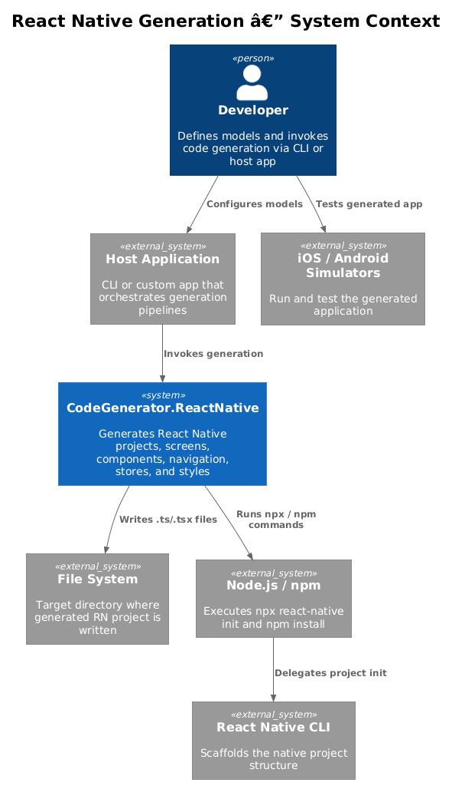
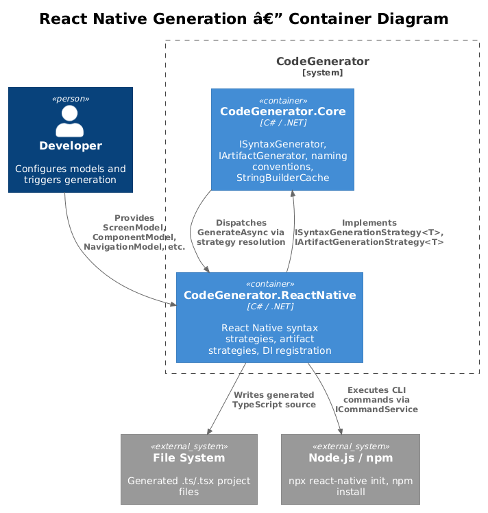
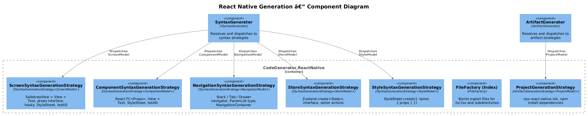
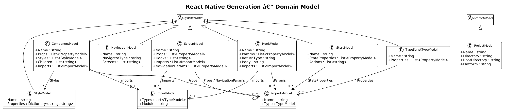
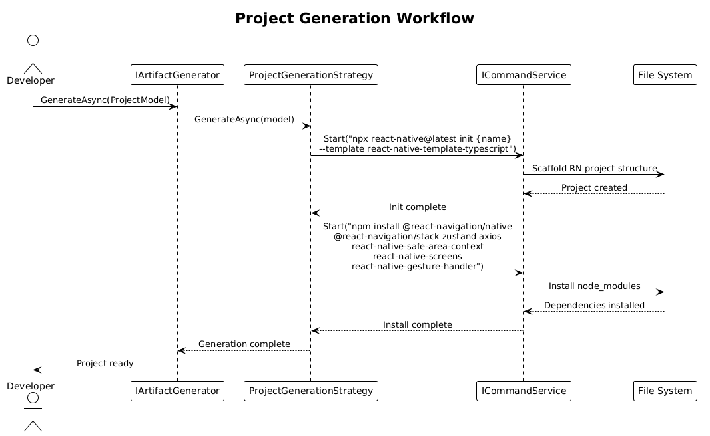
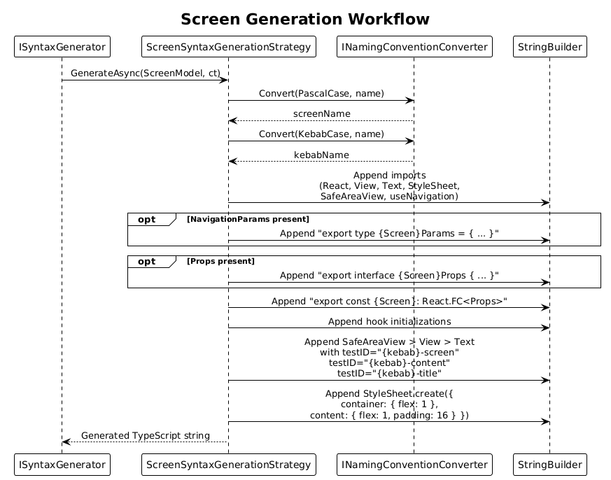
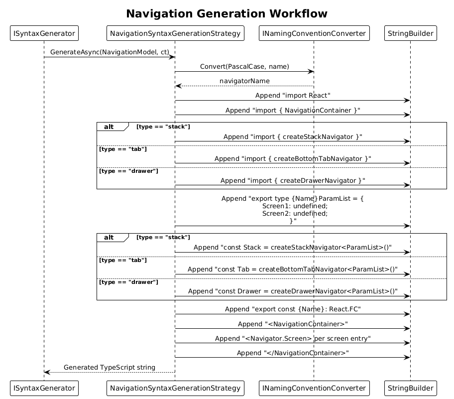

# React Native Generation — Detailed Design

**Parent:** [L2-Frontend.md](../../specs/L2-Frontend.md) — FR-08
**Status:** Draft
**Date:** 2025-07-17

---

## 1. Overview

`CodeGenerator.ReactNative` generates complete React Native projects with TypeScript, including screens, reusable components, React Navigation configurations (Stack, Tab, Drawer), Zustand state stores, StyleSheet definitions, and barrel index files. It extends the core `ISyntaxGenerationStrategy<T>` and `IArtifactGenerationStrategy<T>` abstractions defined in `CodeGenerator.Core`.

The primary actors are developers who define models (e.g., `ScreenModel`, `NavigationModel`) and invoke code generation through a host application or CLI. The generated output is a fully scaffolded React Native project ready for `npx react-native run-ios` or `npx react-native run-android`.

---

## 2. Architecture

### 2.1 C4 Context Diagram

How the React Native generation package fits into the broader system landscape.



The developer configures models and invokes generation through a host application. `CodeGenerator.ReactNative` writes generated `.ts`/`.tsx` files to the file system and delegates project scaffolding to `npx react-native init` via Node.js/npm.

### 2.2 C4 Container Diagram

The high-level technical containers involved in React Native code generation.



`CodeGenerator.ReactNative` implements strategy interfaces from `CodeGenerator.Core`. The core engine resolves and dispatches models to the appropriate strategies. Generated source is written to disk, and shell commands are executed via `ICommandService`.

### 2.3 C4 Component Diagram

Internal components within the `CodeGenerator.ReactNative` package.



Each syntax model has a corresponding generation strategy. The `SyntaxGenerator` dispatches models to the correct `ISyntaxGenerationStrategy<T>` implementation, while the `ArtifactGenerator` dispatches `ProjectModel` to `ProjectGenerationStrategy`.

---

## 3. Component Details

### 3.1 ScreenSyntaxGenerationStrategy

- **Responsibility:** Generates React Native screen components with `SafeAreaView > View > Text` hierarchy, navigation parameter types, props interface, hook initialization, `StyleSheet.create()`, and `testID` attributes using kebab-case naming.
- **Interface:** `ISyntaxGenerationStrategy<ScreenModel>`
- **Dependencies:** `ISyntaxGenerator` (for nested import generation), `INamingConventionConverter`, `ILogger`
- **Key behavior:**
  - Converts screen name to PascalCase for the component and KebabCase for `testID` values.
  - Conditionally emits `export type {Name}Params` when `NavigationParams` is non-empty.
  - Conditionally emits `export interface {Name}Props` when `Props` is non-empty.
  - Emits `useNavigation` import only when the hook is present in the model.
  - Generates `testID` attributes: `"{kebab}-screen"`, `"{kebab}-content"`, `"{kebab}-title"`.

### 3.2 ComponentSyntaxGenerationStrategy

- **Responsibility:** Generates reusable `React.FC<Props>` components with `View > Text` structure, StyleSheet, and `testID` attributes.
- **Interface:** `ISyntaxGenerationStrategy<ComponentModel>`
- **Dependencies:** `ISyntaxGenerator`, `INamingConventionConverter`, `ILogger`
- **Key behavior:**
  - Emits a props interface when the model has props.
  - Renders child elements from `ComponentModel.Children`.
  - Applies `testID` with the kebab-case component name.

### 3.3 NavigationSyntaxGenerationStrategy

- **Responsibility:** Generates React Navigation configurations supporting Stack, Tab, and Drawer navigators.
- **Interface:** `ISyntaxGenerationStrategy<NavigationModel>`
- **Dependencies:** `INamingConventionConverter`, `ILogger`
- **Key behavior:**
  - Selects the correct factory function based on `NavigatorType`: `createStackNavigator`, `createBottomTabNavigator`, or `createDrawerNavigator`.
  - Exports a `{Name}ParamList` type with an entry per screen (`Screen: undefined`).
  - Wraps screen entries in `<NavigationContainer>` with `<Navigator.Screen>` elements.

### 3.4 StoreSyntaxGenerationStrategy

- **Responsibility:** Generates simplified Zustand stores with a state interface and `create<State>()` call.
- **Interface:** `ISyntaxGenerationStrategy<StoreModel>`
- **Dependencies:** `INamingConventionConverter`, `ILogger`
- **Key behavior:**
  - Generates a `{Name}State` interface with state properties and action signatures.
  - Generates `export const use{Name}Store = create<{Name}State>((set) => ({ ... }))`.
  - Assigns type-appropriate defaults: `""` for string, `0` for number, `false` for boolean, `[]` for arrays.

### 3.5 StyleSyntaxGenerationStrategy

- **Responsibility:** Generates `StyleSheet.create()` blocks from style model definitions.
- **Interface:** `ISyntaxGenerationStrategy<StyleModel>`
- **Dependencies:** `INamingConventionConverter`, `ILogger`
- **Key behavior:**
  - Converts the style name to camelCase.
  - Emits `StyleSheet.create({ styleName: { property: value, ... } })`.

### 3.6 FileFactory (Index / Barrel Files)

- **Responsibility:** Generates barrel `index.ts` files that re-export all `.ts`/`.tsx` modules and subdirectories.
- **Interface:** `IFileFactory`
- **Dependencies:** `IFileSystem`, `ILogger`
- **Key behavior:**
  - Scans the target directory for `.ts` and `.tsx` files, excluding `.spec`, `.test`, and existing `index` files.
  - Scans subdirectories and includes re-exports for those containing an `index` file.
  - Emits `export * from './moduleName';` lines.

### 3.7 ProjectGenerationStrategy

- **Responsibility:** Scaffolds a complete React Native project and installs all dependencies.
- **Interface:** `IArtifactGenerationStrategy<ProjectModel>`
- **Dependencies:** `ICommandService`, `ILogger`
- **Key behavior:**
  - Runs `npx react-native@latest init {name} --template react-native-template-typescript`.
  - Runs `npm install` with: `@react-navigation/native`, `@react-navigation/stack`, `zustand`, `axios`, `react-native-safe-area-context`, `react-native-screens`, `react-native-gesture-handler`.

### 3.8 Supporting Syntax Strategies

| Strategy | Model | Output |
|----------|-------|--------|
| `ImportSyntaxGenerationStrategy` | `ImportModel` | `import { Type } from "module";` |
| `HookSyntaxGenerationStrategy` | `HookModel` | `export function hookName(params) { body }` |
| `TypeScriptTypeSyntaxGenerationStrategy` | `TypeScriptTypeModel` | `export type Name = { prop?: type; }` |

---

## 4. Data Model

### 4.1 Class Diagram



### 4.2 Entity Descriptions

| Entity | Base | Description |
|--------|------|-------------|
| `ScreenModel` | `SyntaxModel` | Represents a React Native screen with name, props, hooks, imports, and navigation parameters. |
| `ComponentModel` | `SyntaxModel` | Represents a reusable component with name, props, styles, children, and imports. |
| `NavigationModel` | `SyntaxModel` | Represents a navigator configuration with type (stack/tab/drawer) and screen list. |
| `StoreModel` | `SyntaxModel` | Represents a Zustand store with state properties and action signatures. |
| `StyleModel` | `SyntaxModel` | Represents a named style with a dictionary of CSS-like properties. |
| `HookModel` | `SyntaxModel` | Represents a custom React hook with parameters, return type, body, and imports. |
| `TypeScriptTypeModel` | `SyntaxModel` | Represents a TypeScript type alias with properties. |
| `ImportModel` | — | Represents an ES module import with types and module path. |
| `PropertyModel` | — | Represents a typed property (name + `TypeModel` reference). |
| `ProjectModel` | `ArtifactModel` | Represents a React Native project with name, directory, and platform target. |

---

## 5. Key Workflows

### 5.1 Project Generation

Scaffolds a new React Native project with TypeScript template and installs navigation, state management, and safe-area dependencies.



1. The developer passes a `ProjectModel` to `IArtifactGenerator.GenerateAsync()`.
2. The artifact engine resolves `ProjectGenerationStrategy` via `CanHandle`.
3. The strategy executes `npx react-native@latest init` with the TypeScript template.
4. The strategy then runs `npm install` for all required dependencies.

### 5.2 Screen Generation

Generates a typed functional component wrapped in `SafeAreaView` with accessibility `testID` attributes.



1. The caller passes a `ScreenModel` to `ISyntaxGenerator.GenerateAsync<ScreenModel>()`.
2. The syntax engine resolves `ScreenSyntaxGenerationStrategy`.
3. The strategy converts the name to PascalCase and KebabCase.
4. It emits imports (React, View, Text, StyleSheet, SafeAreaView, and conditionally useNavigation).
5. It conditionally emits the `Params` type and `Props` interface.
6. It emits the functional component with hook initialization and the JSX hierarchy.
7. It emits `StyleSheet.create()` with default container and content styles.
8. `testID` attributes are applied to `SafeAreaView`, `View`, and `Text` elements.

### 5.3 Navigation Generation

Generates a navigator component with typed route parameters supporting three navigator types.



1. The caller passes a `NavigationModel` to `ISyntaxGenerator.GenerateAsync<NavigationModel>()`.
2. The syntax engine resolves `NavigationSyntaxGenerationStrategy`.
3. The strategy selects the appropriate imports and factory function based on `NavigatorType`.
4. It emits the `ParamList` type with one entry per screen (all defaulting to `undefined`).
5. It emits the navigator instance via the selected `create*Navigator<ParamList>()`.
6. It wraps `Screen` entries in `<NavigationContainer>` and the navigator element.

---

## 6. Dependency Injection

All strategies are registered via the `AddReactNativeServices` extension method in `ConfigureServices.cs`:

```csharp
public static void AddReactNativeServices(this IServiceCollection services)
{
    services.AddSingleton<IFileFactory, FileFactory>();
    services.AddSingleton<IProjectFactory, ProjectFactory>();
    services.AddArifactGenerator(typeof(ProjectModel).Assembly);
    services.AddSyntaxGenerator(typeof(ProjectModel).Assembly);
}
```

`AddSyntaxGenerator` scans the assembly for all `ISyntaxGenerationStrategy<T>` implementations and registers them. `AddArifactGenerator` does the same for `IArtifactGenerationStrategy<T>`.

---

## 7. Generated Output Structure

A generated React Native project follows this layout:

```
MyApp/
├── src/
│   ├── screens/
│   │   ├── HomeScreen.tsx
│   │   ├── SettingsScreen.tsx
│   │   └── index.ts
│   ├── components/
│   │   ├── Header.tsx
│   │   └── index.ts
│   ├── navigation/
│   │   ├── AppNavigator.tsx
│   │   └── index.ts
│   ├── stores/
│   │   ├── useAppStore.ts
│   │   └── index.ts
│   └── index.ts
├── package.json
├── tsconfig.json
└── app.json
```

---

## 8. Security Considerations

- **Command injection:** `ProjectGenerationStrategy` passes the project name directly to shell commands via `ICommandService.Start()`. The host application must validate project names before invoking generation.
- **File system writes:** Generated files are written relative to the user-specified `RootDirectory`. No path traversal protections exist in the generation layer; the caller is responsible for sanitization.

---

## 9. Open Questions

1. **Screen import generation for navigators:** `NavigationSyntaxGenerationStrategy` references screen component names (e.g., `{HomeScreen}`) but does not generate the corresponding import statements. Should the strategy accept `ImportModel` entries for screens?
2. **Navigation parameter types:** The `ParamList` type currently defaults all screens to `undefined`. Should it integrate with `ScreenModel.NavigationParams` to produce typed route parameters?
3. **Bottom Tab/Drawer navigator packages:** Only `@react-navigation/stack` is installed by `ProjectGenerationStrategy`. If Tab or Drawer navigators are used, `@react-navigation/bottom-tabs` and `@react-navigation/drawer` should also be installed.
