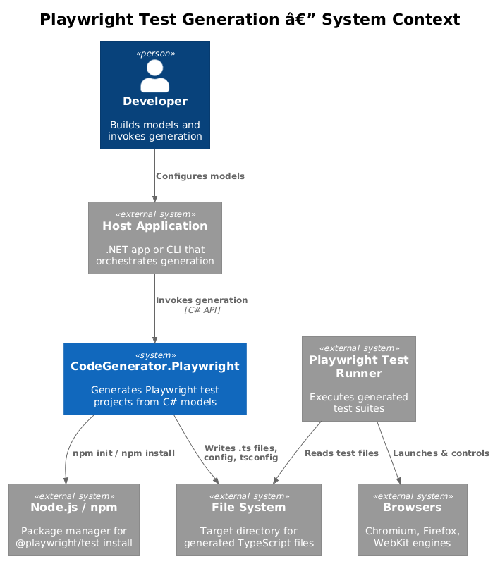
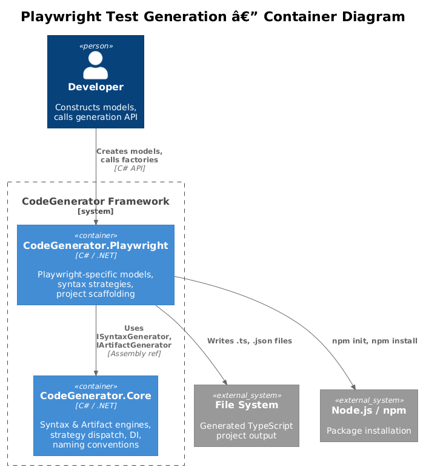
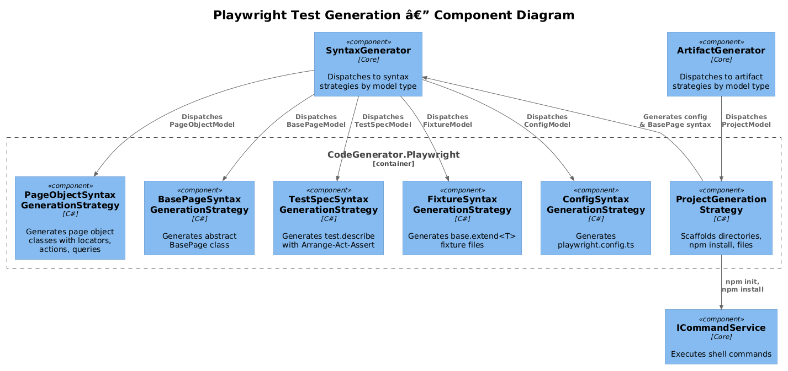
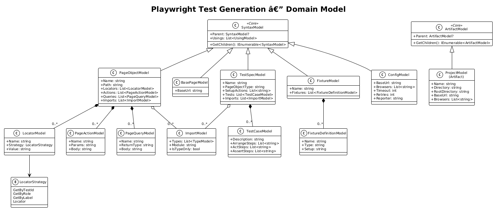
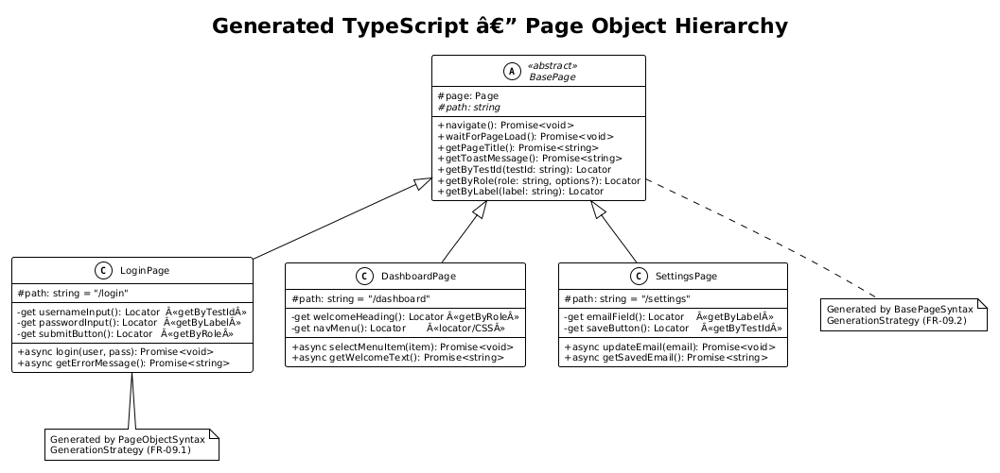
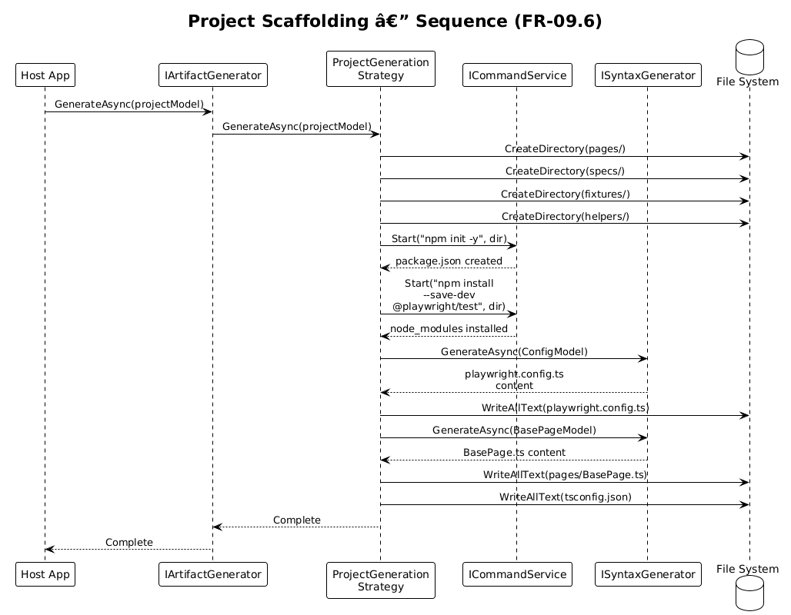
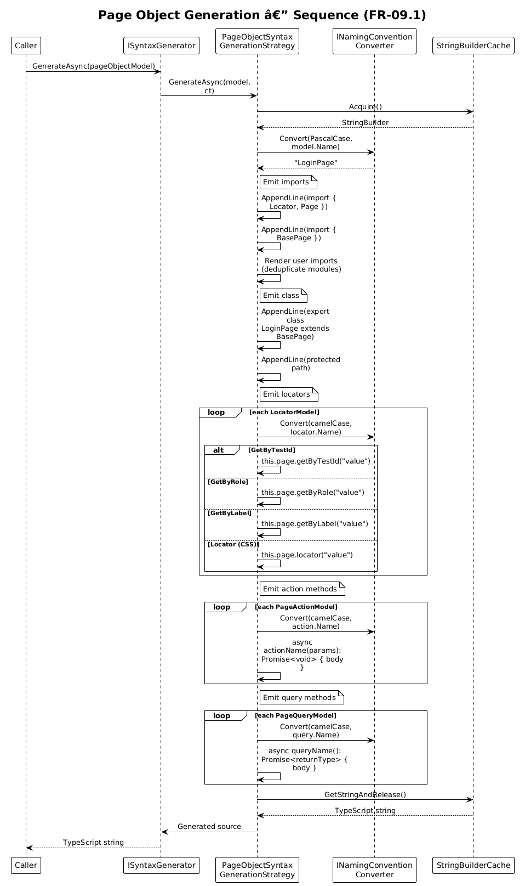
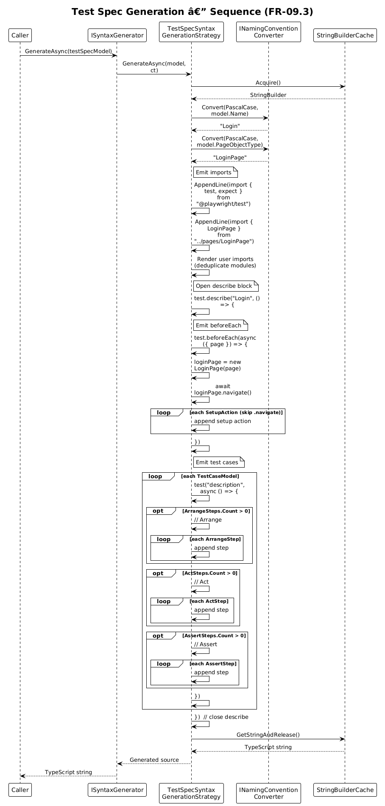

# Playwright Test Generation — Detailed Design

## 1. Overview

The **CodeGenerator.Playwright** package generates complete Playwright end-to-end test projects from C# models. It produces TypeScript page objects (with four locator strategies), test specs using the Arrange-Act-Assert pattern, custom fixtures via `base.extend<T>()`, multi-browser configuration, and an abstract `BasePage` class — all scaffolded into a ready-to-run project structure.

**Actors:** A .NET developer (or host application) that constructs models and invokes the generation engine.

**Scope:** Generation of Playwright TypeScript source files and project scaffolding. Does not cover test execution or CI pipeline setup beyond the generated `playwright.config.ts`.

**Requirements:** [FR-09 (L1)](../../specs/L1-CodeGenerator.md) · [FR-09.1–FR-09.6 (L2)](../../specs/L2-TestingCli.md)

---

## 2. Architecture

### 2.1 C4 Context Diagram

How the Playwright generation feature fits in the broader system landscape.



### 2.2 C4 Container Diagram

The high-level technical containers involved in code generation.



### 2.3 C4 Component Diagram

Internal components within the CodeGenerator.Playwright package.



---

## 3. Component Details

### 3.1 PageObjectSyntaxGenerationStrategy

- **Responsibility:** Generates TypeScript page object classes that extend `BasePage` with private locator getter properties, async action methods, and async query methods.
- **Interface:** `ISyntaxGenerationStrategy<PageObjectModel>`
- **Dependencies:** `ISyntaxGenerator` (for rendering imports), `INamingConventionConverter` (PascalCase class names, camelCase members)
- **Key behavior:**
  - Maps `LocatorStrategy` enum → `this.page.getByTestId()`, `getByRole()`, `getByLabel()`, or `locator()`.
  - Avoids doubling the "Page" suffix on class names.
  - Deduplicates built-in imports (`@playwright/test`, `./BasePage`).

### 3.2 BasePageSyntaxGenerationStrategy

- **Responsibility:** Generates the abstract `BasePage` class containing shared navigation and locator helpers.
- **Interface:** `ISyntaxGenerationStrategy<BasePageModel>`
- **Dependencies:** Logger only (no naming converter needed).
- **Generated members:** `navigate()`, `waitForPageLoad()`, `getPageTitle()`, `getToastMessage()`, `getByTestId()`, `getByRole()`, `getByLabel()`.

### 3.3 TestSpecSyntaxGenerationStrategy

- **Responsibility:** Generates Playwright test files with `test.describe()` / `test()` blocks, `beforeEach` setup, and Arrange-Act-Assert sections.
- **Interface:** `ISyntaxGenerationStrategy<TestSpecModel>`
- **Dependencies:** `ISyntaxGenerator`, `INamingConventionConverter`
- **Key behavior:**
  - `beforeEach` instantiates the page object and calls `navigate()`.
  - Duplicate `.navigate()` calls in `SetupActions` are automatically skipped.
  - Each `TestCaseModel` renders `// Arrange`, `// Act`, `// Assert` comment blocks.

### 3.4 FixtureSyntaxGenerationStrategy

- **Responsibility:** Generates custom Playwright fixtures using `base.extend<T>()` and re-exports `expect`.
- **Interface:** `ISyntaxGenerationStrategy<FixtureModel>`
- **Dependencies:** `INamingConventionConverter`
- **Output structure:** Type alias → `base.extend<Fixtures>()` → individual fixture setup lambdas → `export { expect }`.

### 3.5 ConfigSyntaxGenerationStrategy

- **Responsibility:** Generates `playwright.config.ts` with multi-browser projects and CI-aware settings.
- **Interface:** `ISyntaxGenerationStrategy<ConfigModel>`
- **Dependencies:** Logger only.
- **Key behavior:** Maps browser names to device descriptors (`chromium` → `Desktop Chrome`, `firefox` → `Desktop Firefox`, `webkit` → `Desktop Safari`). CI settings: `forbidOnly`, `retries: 2`, `workers: 1`.

### 3.6 ProjectGenerationStrategy

- **Responsibility:** Scaffolds the complete Playwright project directory structure, installs npm dependencies, and generates configuration files.
- **Interface:** `IArtifactGenerationStrategy<ProjectModel>`
- **Dependencies:** `ICommandService` (shell execution), `ISyntaxGenerator`
- **Steps:** Create `pages/`, `specs/`, `fixtures/`, `helpers/` → `npm init -y` → `npm install --save-dev @playwright/test` → generate `playwright.config.ts` → generate `pages/BasePage.ts` → write `tsconfig.json`.

### 3.7 Factory Classes

| Interface | Implementation | Purpose |
|-----------|---------------|---------|
| `IProjectFactory` | `ProjectFactory` | Creates `ProjectModel` instances with default browser list |
| `IFileFactory` | `FileFactory` | Creates index/barrel export files |

### 3.8 Dependency Injection — `AddPlaywrightServices()`

Registers all Playwright generation services into the DI container:

```csharp
public static void AddPlaywrightServices(this IServiceCollection services)
{
    services.AddSingleton<IFileFactory, FileFactory>();
    services.AddSingleton<IProjectFactory, ProjectFactory>();
    services.AddArifactGenerator(typeof(ProjectModel).Assembly);  // auto-discovers IArtifactGenerationStrategy<T>
    services.AddSyntaxGenerator(typeof(ProjectModel).Assembly);   // auto-discovers ISyntaxGenerationStrategy<T>
}
```

Assembly scanning discovers all strategy implementations automatically — no manual registration per strategy.

---

## 4. Data Model

### 4.1 Class Diagram — Syntax Models



### 4.2 Entity Descriptions

| Model | Base | Key Properties | Purpose |
|-------|------|----------------|---------|
| `PageObjectModel` | `SyntaxModel` | `Name`, `Path`, `Locators`, `Actions`, `Queries`, `Imports` | Represents a page object class with locator fields, action methods, and query methods |
| `LocatorModel` | — | `Name`, `Strategy` (enum), `Value` | A single element locator with strategy selection |
| `PageActionModel` | — | `Name`, `Params`, `Body` | An async action method on a page object |
| `PageQueryModel` | — | `Name`, `ReturnType` (default: `string`), `Body` | An async query method returning data |
| `BasePageModel` | `SyntaxModel` | `BaseUrl` | Triggers generation of the abstract `BasePage` class |
| `TestSpecModel` | `SyntaxModel` | `Name`, `PageObjectType`, `SetupActions`, `Tests`, `Imports` | Represents a test spec file with describe/test blocks |
| `TestCaseModel` | — | `Description`, `ArrangeSteps`, `ActSteps`, `AssertSteps` | A single test case with Arrange-Act-Assert sections |
| `FixtureModel` | `SyntaxModel` | `Name`, `Fixtures` (list of `FixtureDefinitionModel`) | Represents a custom fixture file |
| `FixtureDefinitionModel` | — | `Name`, `Type`, `Setup` | A single fixture definition inside `base.extend<T>()` |
| `ConfigModel` | `SyntaxModel` | `BaseUrl`, `Browsers`, `Timeout` (30000), `Retries` (0), `Reporter` ("html") | Playwright configuration settings |
| `ImportModel` | — | `Types`, `Module`, `IsTypeOnly` | A TypeScript import statement |
| `ProjectModel` | `ArtifactModel` | `Name`, `Directory`, `RootDirectory`, `BaseUrl`, `Browsers` | Represents the full project to scaffold |

### 4.3 Generated Page Object Hierarchy

The TypeScript output follows a BasePage → concrete page object inheritance model.



---

## 5. Key Workflows

### 5.1 Project Scaffolding

The end-to-end flow when a host application requests a complete Playwright project.



**Steps:**

1. Host calls `IArtifactGenerator.GenerateAsync(projectModel)`.
2. `ArtifactGenerator` dispatches to `ProjectGenerationStrategy.GenerateAsync()`.
3. Strategy creates directory tree: `pages/`, `specs/`, `fixtures/`, `helpers/`.
4. Strategy invokes `ICommandService.Start("npm init -y")`.
5. Strategy invokes `ICommandService.Start("npm install --save-dev @playwright/test")`.
6. Strategy creates `ConfigModel` and calls `ISyntaxGenerator.GenerateAsync()` → writes `playwright.config.ts`.
7. Strategy creates `BasePageModel` and calls `ISyntaxGenerator.GenerateAsync()` → writes `pages/BasePage.ts`.
8. Strategy writes `tsconfig.json` inline.

### 5.2 Page Object Generation

The flow when generating a single page object TypeScript class.



**Steps:**

1. Caller invokes `ISyntaxGenerator.GenerateAsync(pageObjectModel)`.
2. `SyntaxGenerator` dispatches to `PageObjectSyntaxGenerationStrategy`.
3. Strategy renders import statements (deduplicating built-in modules).
4. Strategy emits `export class XxxPage extends BasePage` with protected `path`.
5. For each `LocatorModel`, strategy maps `LocatorStrategy` enum → `getByTestId()` / `getByRole()` / `getByLabel()` / `locator()` and writes a private getter.
6. For each `PageActionModel`, strategy writes an `async` method with params and body.
7. For each `PageQueryModel`, strategy writes an `async` method returning `Promise<ReturnType>`.

### 5.3 Test Spec Generation

The flow when generating a Playwright test specification file.



**Steps:**

1. Caller invokes `ISyntaxGenerator.GenerateAsync(testSpecModel)`.
2. `SyntaxGenerator` dispatches to `TestSpecSyntaxGenerationStrategy`.
3. Strategy renders imports: `test`, `expect` from `@playwright/test` and the page object class.
4. Strategy opens `test.describe("Name", () => { ... })`.
5. Strategy writes `test.beforeEach`: instantiates page object, calls `navigate()`, runs additional setup actions.
6. For each `TestCaseModel`, strategy writes `test("description", async () => { ... })` with `// Arrange`, `// Act`, `// Assert` comment-delimited sections.

---

## 6. Locator Strategy Mapping

The framework supports four locator strategies, each mapping to a Playwright API call:

| `LocatorStrategy` Enum | Generated TypeScript | Playwright API | Use Case |
|------------------------|---------------------|----------------|----------|
| `GetByTestId` | `this.page.getByTestId("value")` | User-facing test IDs | Preferred for `data-testid` attributes |
| `GetByRole` | `this.page.getByRole("value")` | ARIA roles | Accessibility-first element selection |
| `GetByLabel` | `this.page.getByLabel("value")` | Form labels | Form input selection via associated labels |
| `Locator` | `this.page.locator("value")` | CSS selectors | Fallback for complex or legacy selectors |

---

## 7. Security Considerations

- **Shell command injection:** `ICommandService` executes `npm init` and `npm install` with hardcoded arguments. The `model.Directory` path is the only dynamic input — it originates from the host application, not user input.
- **File system writes:** Generated files are written to the directory specified in `ProjectModel.Directory`. The host application controls this path.
- **No secrets:** No credentials, tokens, or sensitive data are embedded in generated files.

---

## 8. Open Questions

1. **Custom reporter support** — `ConfigModel.Reporter` is a single string. Should it support multiple reporters (e.g., `["html", "json"]`)?
2. **Authentication fixtures** — Should `FixtureModel` include a built-in authentication setup pattern (e.g., `storageState`)?
3. **Global setup/teardown** — The current design does not generate `globalSetup.ts` / `globalTeardown.ts`. Should it?
4. **Test tagging** — Playwright supports `test.describe.configure({ tag: '@smoke' })`. Should `TestCaseModel` support tags?
