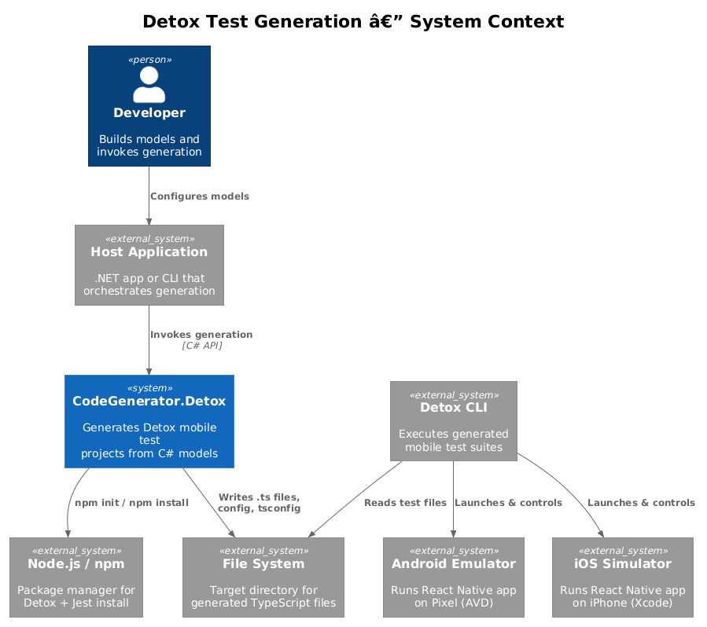
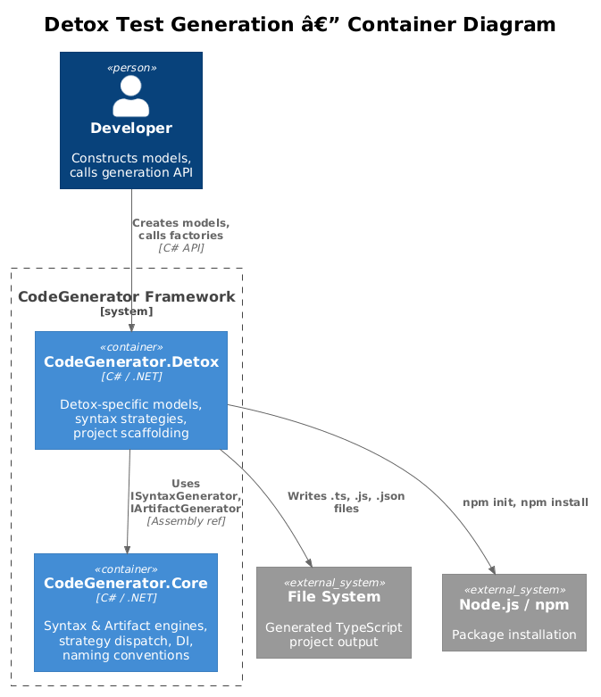
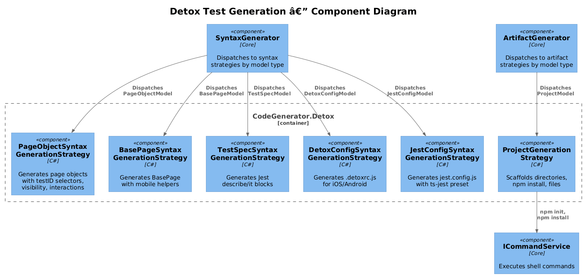
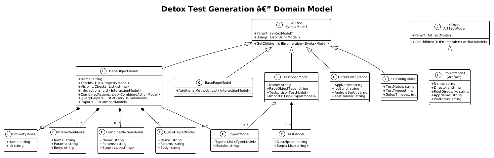
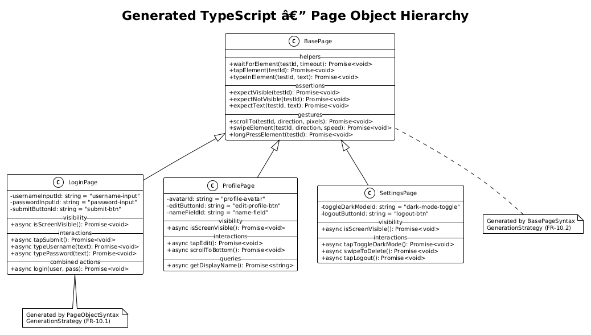
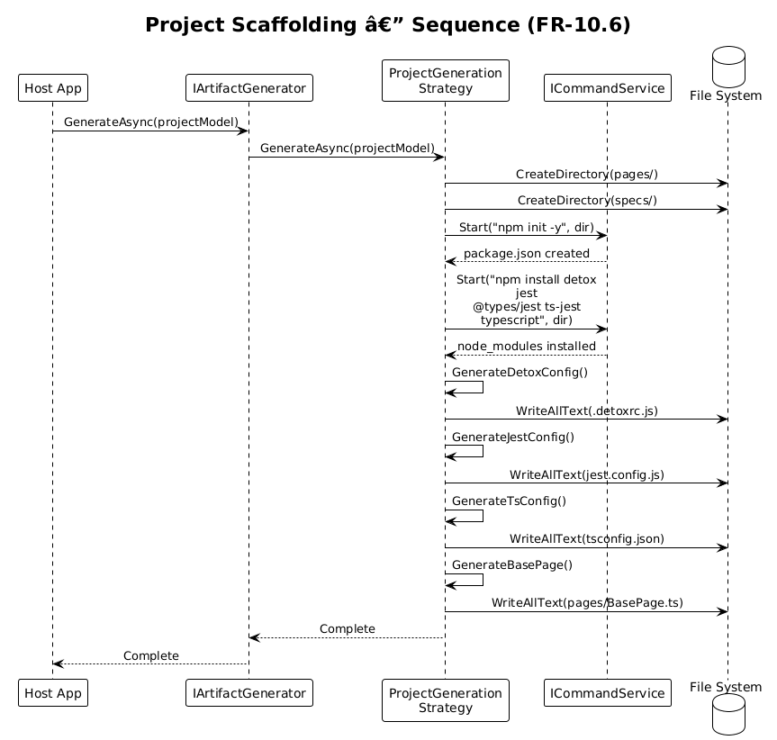
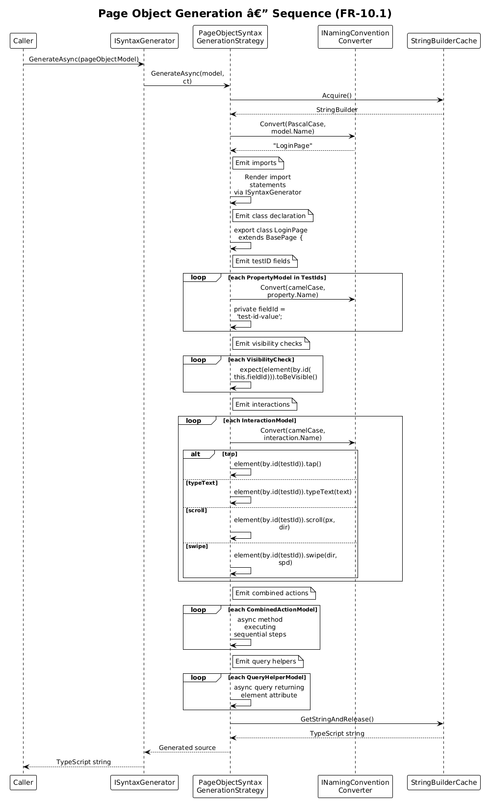
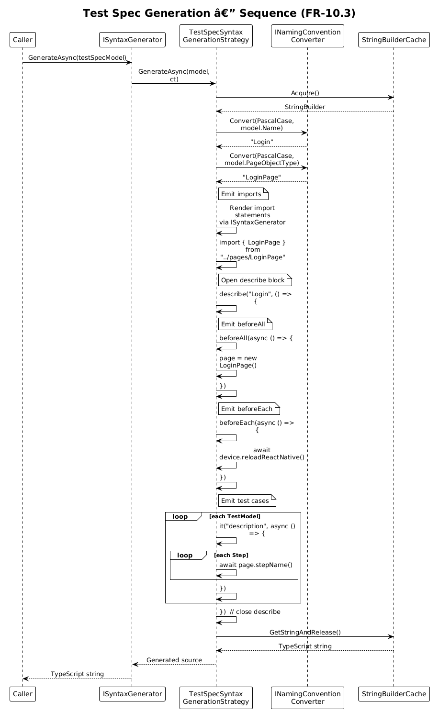

# Detox Test Generation — Detailed Design

## 1. Overview

The **CodeGenerator.Detox** package generates complete Detox end-to-end mobile test projects from C# models. It produces TypeScript page objects with `testID`-based selectors, Jest test specs with `describe()`/`it()` blocks, `.detoxrc.js` configuration for iOS and Android platforms, Jest configuration with `ts-jest`, and an abstract `BasePage` class with mobile interaction helpers — all scaffolded into a ready-to-run project structure targeting React Native applications.

**Actors:** A .NET developer (or host application) that constructs models and invokes the generation engine.

**Scope:** Generation of Detox TypeScript source files and project scaffolding. Does not cover test execution, CI pipeline setup, or React Native application builds beyond the generated `.detoxrc.js` build commands.

**Requirements:** [FR-10 (L1)](../../specs/L1-CodeGenerator.md) · [FR-10.1–FR-10.6 (L2)](../../specs/L2-TestingCli.md)

---

## 2. Architecture

### 2.1 C4 Context Diagram

How the Detox generation feature fits in the broader system landscape.



### 2.2 C4 Container Diagram

The high-level technical containers involved in code generation.



### 2.3 C4 Component Diagram

Internal components within the CodeGenerator.Detox package.



---

## 3. Component Details

### 3.1 PageObjectSyntaxGenerationStrategy

- **Responsibility:** Generates TypeScript page object classes that extend `BasePage` with private `testID` string fields, `element(by.id())` visibility check methods, interaction methods (tap, typeText, scroll, swipe), combined multi-step action methods, and query helper methods.
- **Interface:** `ISyntaxGenerationStrategy<PageObjectModel>`
- **Dependencies:** `ISyntaxGenerator` (for rendering imports), `INamingConventionConverter` (PascalCase class names, camelCase members)
- **Key behavior:**
  - Emits private `readonly` string fields for each `PropertyModel` in `TestIds`.
  - Visibility checks use `expect(element(by.id(this.fieldName))).toBeVisible()`.
  - Each `InteractionModel` maps to an `async` method with `element(by.id()).tap()`, `.typeText()`, `.scroll()`, or `.swipe()`.
  - `CombinedActionModel` entries produce methods that execute multiple steps sequentially.
  - `QueryHelperModel` entries produce methods that return element attributes.
  - Avoids doubling the "Page" suffix on class names.

### 3.2 BasePageSyntaxGenerationStrategy

- **Responsibility:** Generates the `BasePage` class containing shared Detox mobile interaction utilities.
- **Interface:** `ISyntaxGenerationStrategy<BasePageModel>`
- **Dependencies:** Logger only (no naming converter needed).
- **Generated members:**
  - **Wait:** `waitForElement(testId, timeout)` — waits for element visibility with configurable timeout.
  - **Interaction:** `tapElement(testId)`, `typeInElement(testId, text)` — basic tap and text input.
  - **Assertions:** `expectVisible(testId)`, `expectNotVisible(testId)`, `expectText(testId, text)` — element state assertions using `expect(element(by.id())).toBeVisible()` / `.not.toBeVisible()` / `.toHaveText()`.
  - **Advanced:** `scrollTo(testId, direction, pixels)`, `swipeElement(testId, direction, speed)`, `longPressElement(testId)` — gesture-based interactions.
  - Any `AdditionalMethods` defined on the model are appended after the standard set.

### 3.3 TestSpecSyntaxGenerationStrategy

- **Responsibility:** Generates Jest test specification files with `describe()`/`it()` blocks, `beforeAll()`/`beforeEach()` lifecycle hooks, and sequential test step execution.
- **Interface:** `ISyntaxGenerationStrategy<TestSpecModel>`
- **Dependencies:** `ISyntaxGenerator`, `INamingConventionConverter`
- **Key behavior:**
  - `beforeAll()` hook initializes the page object instance.
  - `beforeEach()` hook calls `await device.reloadReactNative()` to reset app state.
  - Each `TestModel` renders as an `it("description", async () => { ... })` block.
  - Test steps are executed sequentially via `await page.stepName()` calls.

### 3.4 DetoxConfigSyntaxGenerationStrategy

- **Responsibility:** Generates `.detoxrc.js` configuration file with platform-specific settings for iOS and Android.
- **Interface:** `ISyntaxGenerationStrategy<DetoxConfigModel>`
- **Dependencies:** Logger only.
- **Key behavior:**
  - Emits `testRunner` property (defaults to `"jest"`).
  - Configures `apps` section with `ios.debug` (xcodebuild) and `android.debug` (Gradle assembleDebug).
  - Configures `devices` section with `simulator` (iPhone 15) and `emulator` (Pixel 5 API 34).
  - Configures `configurations` section mapping device + app combinations.
  - Uses model's `IosBuild` and `AndroidBuild` for custom build commands when provided.

### 3.5 JestConfigSyntaxGenerationStrategy

- **Responsibility:** Generates `jest.config.js` with Detox-specific Jest settings.
- **Interface:** `ISyntaxGenerationStrategy<JestConfigModel>`
- **Dependencies:** Logger only.
- **Generated settings:**
  - `preset: 'ts-jest'` for TypeScript compilation.
  - `testEnvironment: 'detox/runners/jest/testEnvironment'`.
  - `testRunner: 'detox/runners/jest/testRunner'`.
  - `testMatch` pattern (default: `<rootDir>/specs/**/*.spec.ts`).
  - `testTimeout` (default: 120000ms).
  - `globalSetup: 'detox/runners/jest/globalSetup'`.
  - `globalTeardown: 'detox/runners/jest/globalTeardown'`.
  - `reporters: ['detox/runners/jest/reporter']`.
  - `setupTimeout` (default: 120000ms).

### 3.6 ProjectGenerationStrategy

- **Responsibility:** Scaffolds the complete Detox test project directory structure, installs npm dependencies, and generates all configuration and base files.
- **Interface:** `IArtifactGenerationStrategy<ProjectModel>`
- **Dependencies:** `ICommandService` (shell execution)
- **Steps:**
  1. Create `pages/` and `specs/` directories.
  2. Execute `npm init -y` via `ICommandService`.
  3. Execute `npm install detox jest @types/jest ts-jest typescript` via `ICommandService`.
  4. Generate `.detoxrc.js` via `GenerateDetoxConfig()`.
  5. Generate `jest.config.js` via `GenerateJestConfig()`.
  6. Generate `tsconfig.json` via `GenerateTsConfig()` (ES2020 target, strict mode).
  7. Generate `pages/BasePage.ts` via `GenerateBasePage()`.

### 3.7 Factory Classes

| Interface | Implementation | Purpose |
|-----------|---------------|---------|
| `IProjectFactory` | `ProjectFactory` | Creates `ProjectModel` instances with name, directory, appName, and platforms |
| `IFileFactory` | `FileFactory` | Creates `index.ts` barrel export files for TypeScript modules |

### 3.8 Dependency Injection — `AddDetoxServices()`

Registers all Detox generation services into the DI container:

```csharp
public static void AddDetoxServices(this IServiceCollection services)
{
    services.AddSingleton<IFileFactory, FileFactory>();
    services.AddSingleton<IProjectFactory, ProjectFactory>();
    services.AddArifactGenerator(typeof(ProjectModel).Assembly);  // auto-discovers IArtifactGenerationStrategy<T>
    services.AddSyntaxGenerator(typeof(ProjectModel).Assembly);   // auto-discovers ISyntaxGenerationStrategy<T>
}
```

Assembly scanning discovers all strategy implementations automatically — no manual registration per strategy.

---

## 4. Data Model

### 4.1 Class Diagram — Syntax Models



### 4.2 Entity Descriptions

| Model | Base | Key Properties | Purpose |
|-------|------|----------------|---------|
| `PageObjectModel` | `SyntaxModel` | `Name`, `TestIds`, `VisibilityChecks`, `Interactions`, `CombinedActions`, `QueryHelpers`, `Imports` | Represents a Detox page object class with testID fields, visibility checks, and interaction methods |
| `PropertyModel` | — | `Name`, `Id` | A single testID field mapping a logical name to a `testID` attribute value |
| `InteractionModel` | — | `Name`, `Params`, `Body` | An async interaction method (tap, typeText, scroll, swipe) on a page object |
| `CombinedActionModel` | — | `Name`, `Params`, `Steps` | A multi-step action method executing sequential interactions |
| `QueryHelperModel` | — | `Name`, `Params`, `Body` | A query method returning element attributes or state |
| `BasePageModel` | `SyntaxModel` | `AdditionalMethods` | Triggers generation of the `BasePage` class with standard Detox helpers |
| `TestSpecModel` | `SyntaxModel` | `Name`, `PageObjectType`, `Tests`, `Imports` | Represents a Jest test spec file with describe/it blocks |
| `TestModel` | — | `Description`, `Steps` | A single test case with sequential step execution |
| `DetoxConfigModel` | `SyntaxModel` | `AppName`, `IosBuild`, `AndroidBuild`, `TestRunner` | Configuration for `.detoxrc.js` with iOS/Android platform settings |
| `JestConfigModel` | `SyntaxModel` | `TestMatch`, `TestTimeout`, `SetupTimeout` | Configuration for `jest.config.js` with ts-jest and Detox runners |
| `ImportModel` | — | `Types`, `Module` | A TypeScript ES6 import statement |
| `ProjectModel` | `ArtifactModel` | `Name`, `Directory`, `RootDirectory`, `AppName`, `Platforms` | Represents the full Detox project to scaffold |

### 4.3 Generated Page Object Hierarchy

The TypeScript output follows a BasePage → concrete page object inheritance model using `testID`-based selectors.



---

## 5. Key Workflows

### 5.1 Project Scaffolding

The end-to-end flow when a host application requests a complete Detox project.



**Steps:**

1. Host calls `IArtifactGenerator.GenerateAsync(projectModel)`.
2. `ArtifactGenerator` dispatches to `ProjectGenerationStrategy.GenerateAsync()`.
3. Strategy creates directory tree: `pages/`, `specs/`.
4. Strategy invokes `ICommandService.Start("npm init -y")`.
5. Strategy invokes `ICommandService.Start("npm install detox jest @types/jest ts-jest typescript")`.
6. Strategy generates `.detoxrc.js` with iOS simulator (iPhone 15) and Android emulator (Pixel 5 API 34) configuration.
7. Strategy generates `jest.config.js` with ts-jest preset, Detox test environment, 120s timeouts.
8. Strategy writes `tsconfig.json` with ES2020 target, strict mode enabled.
9. Strategy generates `pages/BasePage.ts` with Detox interaction helpers.

### 5.2 Page Object Generation

The flow when generating a single Detox page object TypeScript class.



**Steps:**

1. Caller invokes `ISyntaxGenerator.GenerateAsync(pageObjectModel)`.
2. `SyntaxGenerator` dispatches to `PageObjectSyntaxGenerationStrategy`.
3. Strategy renders import statements via `ISyntaxGenerator.GenerateAsync(ImportModel)`.
4. Strategy emits `export class XxxPage extends BasePage`.
5. For each `PropertyModel` in `TestIds`, strategy writes a private `readonly` string field: `private submitButtonId = 'submit-btn';`.
6. For each `VisibilityCheck`, strategy writes an `async` method using `expect(element(by.id(this.fieldId))).toBeVisible()`.
7. For each `InteractionModel`, strategy writes an `async` method with the appropriate Detox API call (`tap()`, `typeText()`, `scroll()`, `swipe()`).
8. For each `CombinedActionModel`, strategy writes a multi-step `async` method executing steps sequentially.
9. For each `QueryHelperModel`, strategy writes an `async` method returning element data.

### 5.3 Test Spec Generation

The flow when generating a Detox/Jest test specification file.



**Steps:**

1. Caller invokes `ISyntaxGenerator.GenerateAsync(testSpecModel)`.
2. `SyntaxGenerator` dispatches to `TestSpecSyntaxGenerationStrategy`.
3. Strategy renders imports: page object class and any custom imports.
4. Strategy opens `describe("Name", () => { ... })`.
5. Strategy writes `beforeAll()`: creates page object instance (`const page = new LoginPage()`).
6. Strategy writes `beforeEach()`: calls `await device.reloadReactNative()` to reset app state.
7. For each `TestModel`, strategy writes `it("description", async () => { ... })` with sequential `await page.step()` calls.

---

## 6. Detox API Mapping

The framework maps page object model elements to Detox API calls:

| Model Element | Generated TypeScript | Detox API | Use Case |
|---------------|---------------------|-----------|----------|
| `PropertyModel` (testId) | `private fieldId = 'test-id-value';` | — | Field declaration for testID selector |
| Visibility check | `expect(element(by.id(this.fieldId))).toBeVisible()` | `expect().toBeVisible()` | Assert element is on screen |
| Tap interaction | `element(by.id(testId)).tap()` | `element().tap()` | Tap/press a UI element |
| Type text interaction | `element(by.id(testId)).typeText(text)` | `element().typeText()` | Enter text in input fields |
| Scroll interaction | `element(by.id(testId)).scroll(pixels, direction)` | `element().scroll()` | Scroll within a scrollable element |
| Swipe interaction | `element(by.id(testId)).swipe(direction, speed)` | `element().swipe()` | Swipe gesture on an element |
| Device reload | `await device.reloadReactNative()` | `device.reloadReactNative()` | Reset app state between tests |

---

## 7. Security Considerations

- **Shell command injection:** `ICommandService` executes `npm init` and `npm install` with hardcoded arguments. The `model.Directory` path is the only dynamic input — it originates from the host application, not end-user input.
- **File system writes:** Generated files are written to the directory specified in `ProjectModel.Directory`. The host application controls this path.
- **Build commands:** `IosBuild` and `AndroidBuild` strings on `DetoxConfigModel` are written into `.detoxrc.js` as configuration values. These originate from the C# model constructor, not from user input.
- **No secrets:** No credentials, tokens, or sensitive data are embedded in generated files.

---

## 8. Open Questions

1. **Custom device targets** — `DetoxConfigModel` hardcodes iPhone 15 and Pixel 5 API 34. Should device names be configurable via the model?
2. **Multiple configurations** — The current design generates `ios.sim.debug` and `android.emu.debug`. Should it support release/CI configurations?
3. **Global setup files** — Should `ProjectGenerationStrategy` generate `globalSetup.ts` / `globalTeardown.ts` files for Detox?
4. **Test tagging** — Should `TestModel` support tags or categories for selective test execution (e.g., `@smoke`, `@regression`)?
5. **BasePage extensibility** — Should `BasePageModel.AdditionalMethods` support typed parameters for custom methods, or is the current `InteractionModel` shape sufficient?

---

## 9. Requirements Traceability

| Requirement | Component(s) | Section |
|---|---|---|
| FR-10.1: Mobile Page Object Generation | `PageObjectSyntaxGenerationStrategy`, `PageObjectModel`, `PropertyModel`, `InteractionModel`, `CombinedActionModel`, `QueryHelperModel` | §3.1, §5.2 |
| FR-10.2: Detox Base Page Generation | `BasePageSyntaxGenerationStrategy`, `BasePageModel` | §3.2 |
| FR-10.3: Detox Test Spec Generation | `TestSpecSyntaxGenerationStrategy`, `TestSpecModel`, `TestModel` | §3.3, §5.3 |
| FR-10.4: Detox Configuration Generation | `DetoxConfigSyntaxGenerationStrategy`, `DetoxConfigModel` | §3.4 |
| FR-10.5: Jest Configuration Generation | `JestConfigSyntaxGenerationStrategy`, `JestConfigModel` | §3.5 |
| FR-10.6: Detox Project Scaffolding | `ProjectGenerationStrategy`, `ProjectModel`, `ICommandService` | §3.6, §5.1 |
