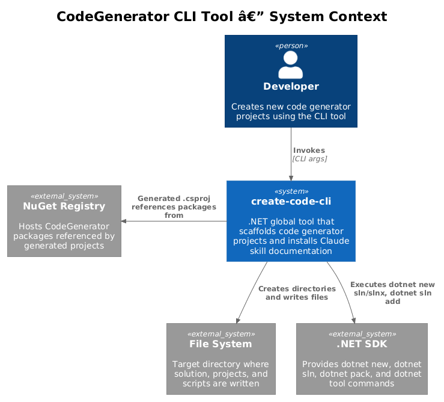
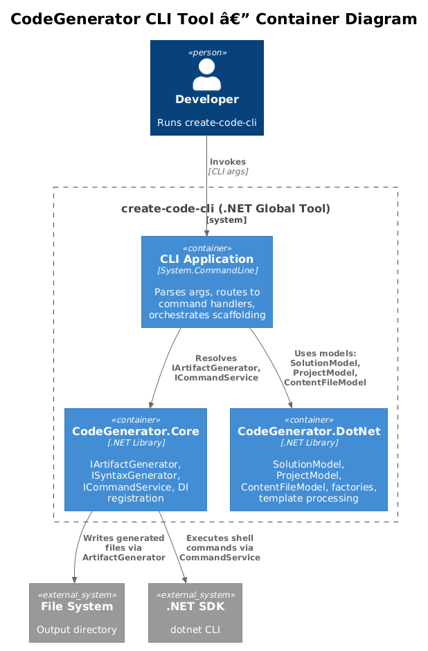
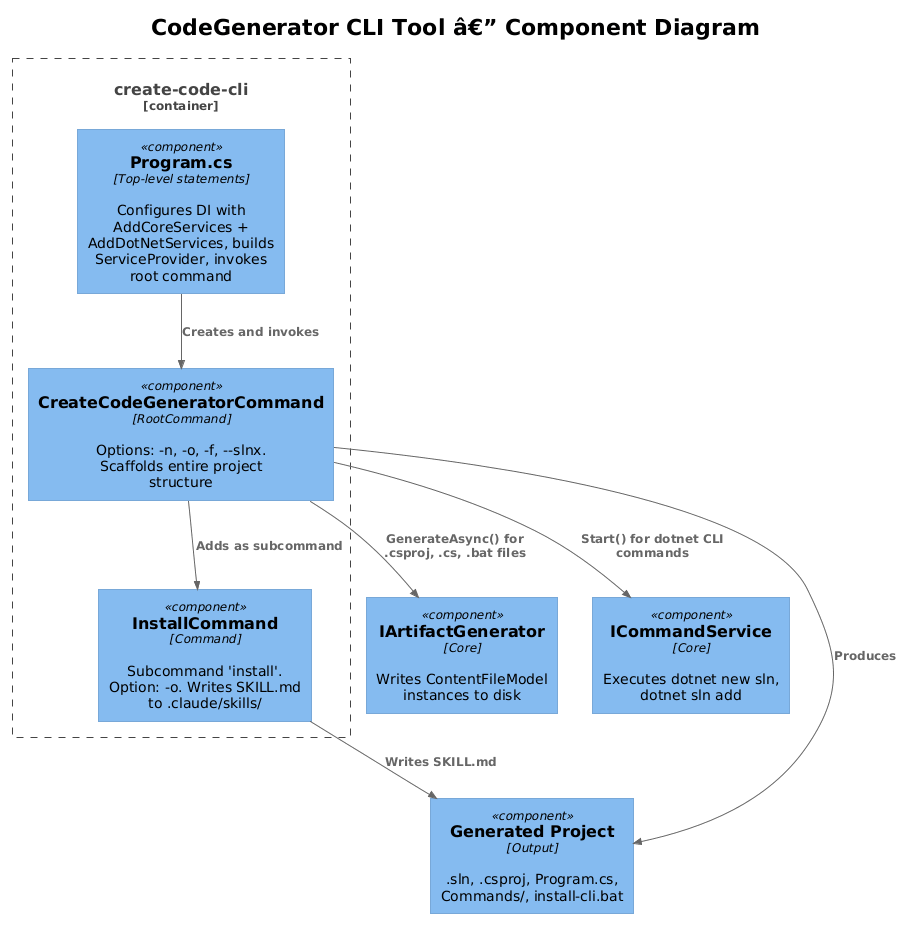
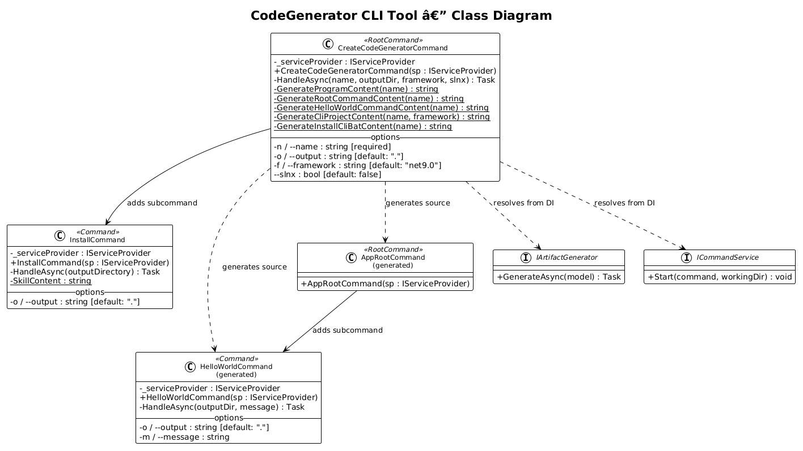
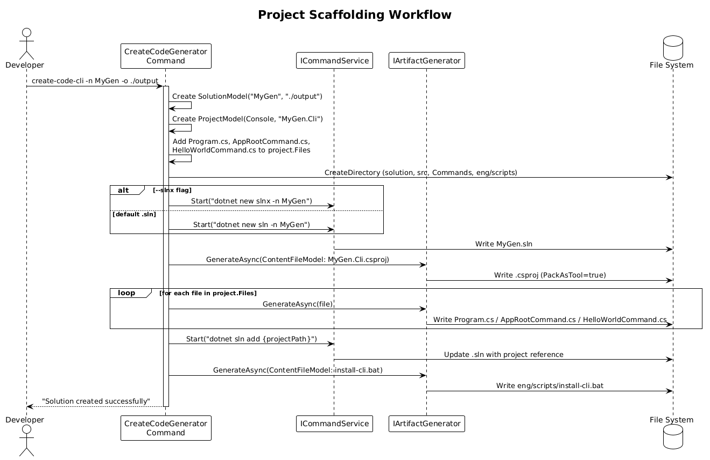
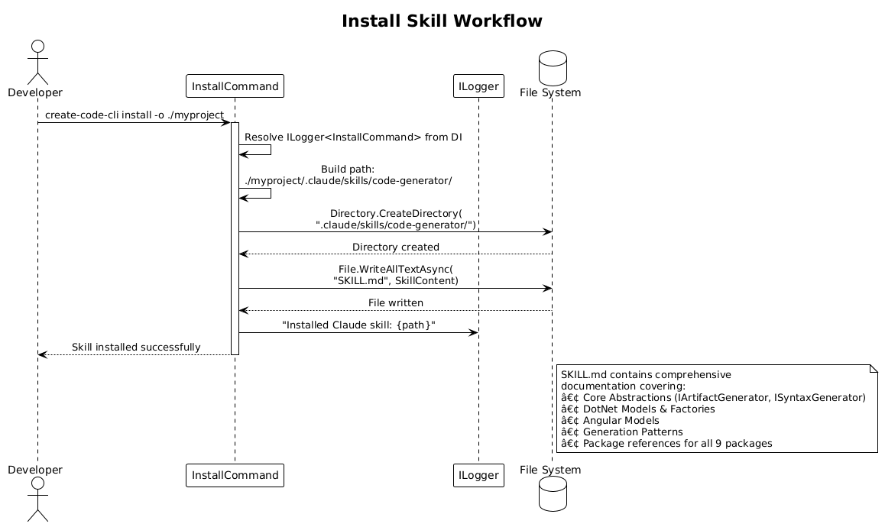

# CLI Tool (`create-code-cli`) — Detailed Design

**Status:** Implemented

## 1. Overview

The CodeGenerator CLI tool (`create-code-cli`) is a .NET global tool that scaffolds new code generator projects. When invoked, it creates a complete solution with a DI-configured program, sample commands demonstrating the CodeGenerator framework, install scripts for global tool deployment, and an optional Claude skill documentation file.

**Actors:** Developer — invokes the tool from a terminal to bootstrap new code generator CLI projects.

**Scope:** The CLI itself (`CodeGenerator.Cli`) and the project structure it generates. This covers requirements **FR-15** (L1) and detailed acceptance criteria **FR-15.1** through **FR-15.4** (L2).

## 2. Architecture

### 2.1 C4 Context Diagram

Shows the CLI tool in its broader ecosystem — the developer, file system, .NET SDK, and NuGet registry.



The developer invokes `create-code-cli` with arguments. The CLI writes generated files to the file system, delegates to the .NET SDK for solution/project operations (`dotnet new sln`, `dotnet sln add`), and the generated `.csproj` references CodeGenerator packages from NuGet.

### 2.2 C4 Container Diagram

Shows the internal containers: the CLI application layer (System.CommandLine), CodeGenerator.Core, and CodeGenerator.DotNet.



| Container | Technology | Responsibility |
|-----------|------------|----------------|
| CLI Application | System.CommandLine 2.0 | Arg parsing, command routing, handler orchestration |
| CodeGenerator.Core | .NET 9.0 Library | `IArtifactGenerator` (file writing), `ICommandService` (shell execution), DI registration via `AddCoreServices()` |
| CodeGenerator.DotNet | .NET 9.0 Library | `SolutionModel`, `ProjectModel`, `ContentFileModel`, factories, 40+ DI services via `AddDotNetServices()` |

### 2.3 C4 Component Diagram

Shows the internal components within the CLI application and their interactions with core services.



## 3. Component Details

### 3.1 Program.cs — Entry Point and DI Setup

- **Responsibility:** Configures the dependency injection container and invokes the root command.
- **DI Registration:**
  1. `IConfiguration` — built from environment variables
  2. `ILogger` — console output, minimum level `Information`
  3. `AddCoreServices(typeof(Program).Assembly)` — registers `IArtifactGenerator`, `ISyntaxGenerator`, `IUserInputService`, and auto-discovers `IArtifactGenerationStrategy<T>` / `ISyntaxGenerationStrategy<T>` implementations
  4. `AddDotNetServices()` — registers 40+ singletons including factories (`ISolutionFactory`, `IProjectFactory`, `IClassFactory`, `ICqrsFactory`), services (`ICommandService`, `IFileSystem`, `ITemplateProcessor`), and MediatR handlers
- **Execution:** Creates `CreateCodeGeneratorCommand` with the `ServiceProvider`, invokes via `rootCommand.InvokeAsync(args)`

### 3.2 CreateCodeGeneratorCommand — Root Command (FR-15.1)

- **Responsibility:** Scaffolds an entire code generator CLI project from a single command invocation.
- **Base Class:** `System.CommandLine.RootCommand`
- **Description:** `"Creates a new code generator CLI project"`
- **Options:**

| Option | Aliases | Type | Required | Default | Traces To |
|--------|---------|------|----------|---------|-----------|
| Name | `-n`, `--name` | `string` | Yes | — | FR-15.1 |
| Output | `-o`, `--output` | `string` | No | Current directory | FR-15.1 |
| Framework | `-f`, `--framework` | `string` | No | `net9.0` | FR-15.1 |
| Slnx | `--slnx` | `bool` | No | `false` | FR-15.1 |

- **Subcommands:** `InstallCommand` (added in constructor)
- **Dependencies:** `IArtifactGenerator` (file generation), `ICommandService` (dotnet CLI execution)
- **Handler Flow:** See §5.1 for the full scaffolding workflow.

### 3.3 InstallCommand — Install Subcommand (FR-15.4)

- **Responsibility:** Creates a Claude skill documentation file (`SKILL.md`) that describes the entire CodeGenerator API.
- **Base Class:** `System.CommandLine.Command`
- **Command Name:** `install`
- **Description:** `"Installs a Claude skill for CodeGenerator"`
- **Options:**

| Option | Aliases | Type | Required | Default |
|--------|---------|------|----------|---------|
| Output | `-o`, `--output` | `string` | No | Current directory |

- **Dependencies:** `ILogger<InstallCommand>` (logging only — no artifact generation needed)
- **Output:** `{outputDir}/.claude/skills/code-generator/SKILL.md`
- **Handler Flow:** See §5.2 for the install skill workflow.

### 3.4 Generated Project Structure (FR-15.2, FR-15.3)

When `CreateCodeGeneratorCommand` runs, it produces the following output:

```
{Name}/
├── eng/scripts/
│   └── install-cli.bat              ← Global tool install script
├── src/{Name}.Cli/
│   ├── Commands/
│   │   ├── AppRootCommand.cs        ← Generated root command
│   │   └── HelloWorldCommand.cs     ← Sample "hello" subcommand
│   ├── {Name}.Cli.csproj            ← PackAsTool=true, CodeGenerator refs
│   └── Program.cs                   ← DI setup + command invocation
└── {Name}.sln (.slnx)              ← Solution file
```

**Generated AppRootCommand:** A minimal `RootCommand` that adds `HelloWorldCommand` as a subcommand. Serves as the extensibility point for the developer's custom commands.

**Generated HelloWorldCommand:** A sample `Command` demonstrating the CodeGenerator pattern — resolves `IArtifactGenerator` from DI, creates a `ContentFileModel`, and generates a `HelloWorld.txt` file. Options: `-o` (output directory) and `-m` (message).

**Generated .csproj:** Configured with `PackAsTool=true`, `ToolCommandName={name}-cli`, and package references for all 9 CodeGenerator NuGet packages (Core, DotNet, Angular, React, Python, Flask, Playwright, Detox, ReactNative).

**Generated install-cli.bat:** A batch script that navigates to solution root, uninstalls any existing version, builds in Release, packs the NuGet package, and installs globally from the local package folder.

## 4. Data Model

### 4.1 Class Diagram



### 4.2 Entity Descriptions

| Class | Base | Responsibility |
|-------|------|----------------|
| `CreateCodeGeneratorCommand` | `RootCommand` | CLI entry point. Holds 4 options and 6 static template-generation methods. Handler orchestrates the full scaffolding process. |
| `InstallCommand` | `Command` | `install` subcommand. Holds 1 option and an embedded `SkillContent` constant (~400 lines of markdown). Writes SKILL.md to disk. |
| `AppRootCommand` (generated) | `RootCommand` | Generated in scaffolded projects. Adds `HelloWorldCommand` as subcommand. |
| `HelloWorldCommand` (generated) | `Command` | Generated in scaffolded projects. Demonstrates `IArtifactGenerator` usage with `ContentFileModel`. |
| `IArtifactGenerator` | — | Core interface. Writes model objects to disk as files. |
| `ICommandService` | — | Core interface. Executes shell commands in a working directory. |

**Relationships:**
- `CreateCodeGeneratorCommand` adds `InstallCommand` as a subcommand (composition)
- `CreateCodeGeneratorCommand` depends on `IArtifactGenerator` and `ICommandService` (resolved from DI)
- `CreateCodeGeneratorCommand` generates source code for `AppRootCommand` and `HelloWorldCommand`
- Generated `AppRootCommand` adds generated `HelloWorldCommand` as a subcommand

## 5. Key Workflows

### 5.1 Project Scaffolding (FR-15.1, FR-15.2, FR-15.3)

When the developer runs `create-code-cli -n MyGen -o ./output`:



**Step-by-step:**

1. **Parse arguments** — System.CommandLine parses `-n`, `-o`, `-f`, `--slnx` options and invokes `HandleAsync`.
2. **Create models** — Builds a `SolutionModel("MyGen", "./output")` and a `ProjectModel(Console, "MyGen.Cli", srcDir)`. Adds three `ContentFileModel` instances to `project.Files`: `Program.cs`, `AppRootCommand.cs`, `HelloWorldCommand.cs`.
3. **Create directories** — Creates `MyGen/`, `MyGen/src/`, `MyGen/src/MyGen.Cli/`, `MyGen/src/MyGen.Cli/Commands/`, and `MyGen/eng/scripts/`.
4. **Generate solution file** — Calls `ICommandService.Start("dotnet new sln -n MyGen")` (or `dotnet new slnx` if `--slnx`).
5. **Generate .csproj** — Calls `IArtifactGenerator.GenerateAsync()` with a `ContentFileModel` containing the tool-configured `.csproj` (PackAsTool, 9 NuGet refs, target framework).
6. **Generate code files** — Iterates `project.Files`, calling `IArtifactGenerator.GenerateAsync()` for each: `Program.cs`, `AppRootCommand.cs`, `HelloWorldCommand.cs`.
7. **Add project to solution** — Calls `ICommandService.Start("dotnet sln add {projectPath}")`.
8. **Generate install script** — Calls `IArtifactGenerator.GenerateAsync()` with `install-cli.bat` content.
9. **Log completion** — Outputs next-steps instructions to the console.

### 5.2 Install Skill (FR-15.4)

When the developer runs `create-code-cli install -o ./myproject`:



**Step-by-step:**

1. **Parse arguments** — System.CommandLine routes to `InstallCommand.HandleAsync` with the output directory.
2. **Resolve logger** — Gets `ILogger<InstallCommand>` from DI.
3. **Create skill directory** — Calls `Directory.CreateDirectory("{outputDir}/.claude/skills/code-generator/")`.
4. **Write SKILL.md** — Calls `File.WriteAllTextAsync()` with the embedded `SkillContent` constant, which documents:
   - Core abstractions (`IArtifactGenerator`, `ISyntaxGenerator`, `ICommandService`, `ITemplateProcessor`)
   - DotNet models (`SolutionModel`, `ProjectModel`, `ClassModel`, `EntityModel`, etc.)
   - DotNet factories (`ISolutionFactory`, `IProjectFactory`, `IClassFactory`, `ICqrsFactory`)
   - Angular models (`WorkspaceModel`, `ProjectModel`, `FunctionModel`, `ImportModel`)
   - Generation patterns and workflow examples
5. **Log result** — Outputs the installed skill file path.

## 6. CLI Contracts

### 6.1 Command Reference

```
create-code-cli [options] [command]

Options:
  -n, --name <name>            Solution name (required)
  -o, --output <output>        Output directory [default: .]
  -f, --framework <framework>  Target framework [default: net9.0]
  --slnx                       Use .slnx format [default: false]

Commands:
  install                      Installs Claude skill documentation
    -o, --output <output>      Target directory [default: .]
```

### 6.2 Exit Behavior

The tool returns `0` on success via `rootCommand.InvokeAsync(args)`. System.CommandLine handles parsing errors (missing required `-n`) and displays auto-generated help text.

### 6.3 Generated Tool Command

The scaffolded project produces a global tool named `{name-lowercase}-cli` (e.g., `mygen-cli`), installable via `dotnet tool install -g`.

## 7. Security Considerations

- **No secrets or credentials** are handled or generated by the CLI.
- **File system access** is limited to the user-specified output directory. No files are read or modified outside that scope.
- **Shell command injection** — The `name` parameter is interpolated into `dotnet new sln -n {name}` and `dotnet sln add` commands via `ICommandService.Start()`. Names with special characters could cause unexpected behavior. The CLI relies on System.CommandLine's input parsing but does not perform additional sanitization.
- **NuGet package versions** in the generated `.csproj` are hardcoded to `1.2.x`. Generated projects should update these as new versions are published.

## 8. Open Questions

1. **Cross-platform install script** — Currently only `install-cli.bat` (Windows batch) is generated. Should a `install-cli.sh` (bash) script also be generated for Linux/macOS users?
2. **Package version management** — Generated `.csproj` files hardcode CodeGenerator package versions (`1.2.0`, `1.2.1`, `1.2.2`). Should the CLI accept a `--version` option or query NuGet for the latest versions?
3. **Name validation** — No validation is performed on the `-n` value. Names with spaces, special characters, or reserved words could produce invalid C# namespaces or project paths.
