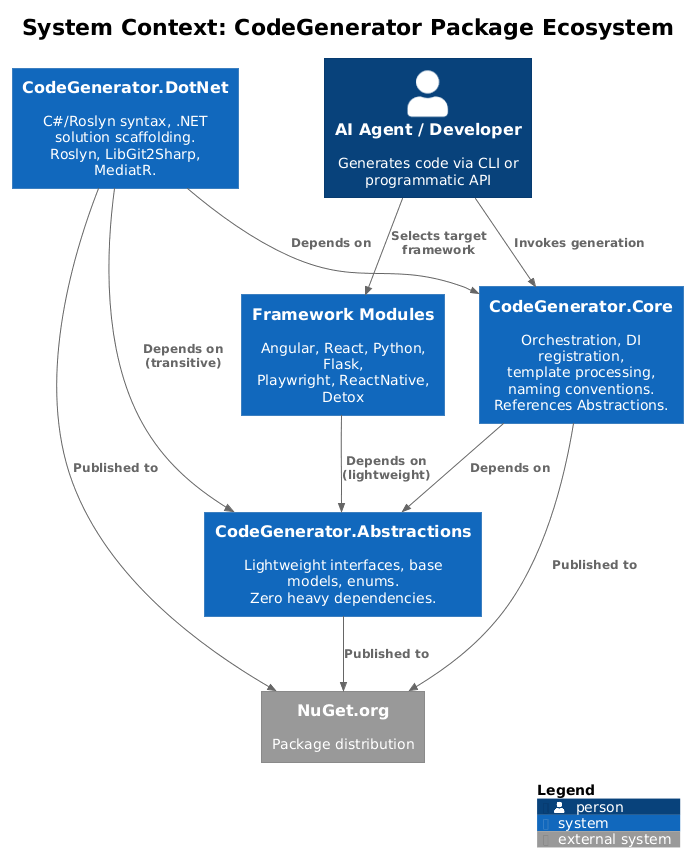
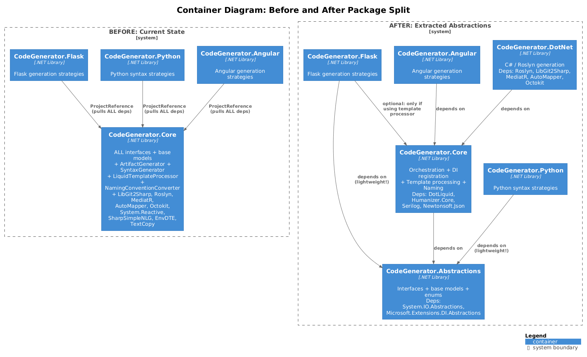
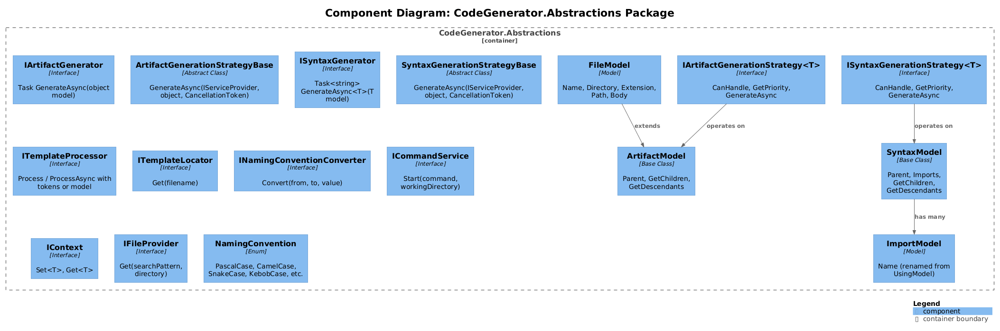
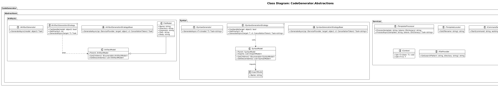
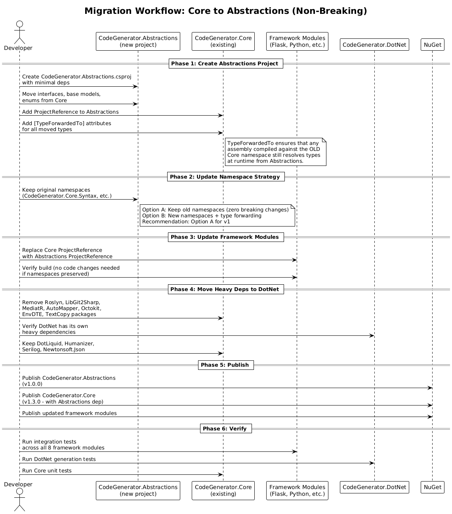

# Detailed Design: Extract CodeGenerator.Abstractions

| Field          | Value                                      |
|----------------|--------------------------------------------|
| **Priority**   | #1 (Architecture Audit)                    |
| **Status**     | Draft                                      |
| **Author**     | Quinntyne Brown                            |
| **Created**    | 2026-04-03                                 |
| **Package**    | `QuinntyneBrown.CodeGenerator.Abstractions`|

---

## 1. Overview

### 1.1 Problem Statement

`CodeGenerator.Core` is the foundation package for the entire CodeGenerator framework. Every framework module (Angular, React, Flask, Python, Playwright, ReactNative, Detox) takes a `ProjectReference` on Core. The problem is that Core bundles **both** lightweight abstractions (interfaces, base models, enums) **and** heavy .NET-specific dependencies:

| Heavy Dependency                        | Size / Impact                     |
|-----------------------------------------|-----------------------------------|
| Microsoft.CodeAnalysis.CSharp (Roslyn)  | ~15 MB, C#-only                   |
| Microsoft.CodeAnalysis.Workspaces.MSBuild | ~5 MB, C#-only                  |
| LibGit2Sharp                            | ~8 MB, native binaries            |
| MediatR                                 | CQRS pattern, .NET-specific       |
| AutoMapper                              | Object mapping, .NET-specific     |
| Octokit                                 | GitHub API client                 |
| System.Reactive                         | Rx.NET                            |
| SharpSimpleNLG                          | NLP library                       |
| EnvDTE                                  | Visual Studio automation          |
| TextCopy                                | Clipboard, platform-specific      |
| Microsoft.EntityFrameworkCore.Design    | EF tooling                        |
| TinyMapper                              | Object mapping                    |

When `CodeGenerator.Flask` (which generates Python/Flask code) references Core, it transitively pulls in Roslyn, LibGit2Sharp, and every other dependency -- none of which Flask needs. This bloats NuGet packages, increases restore times, and creates unnecessary coupling.

### 1.2 Goal

Extract a new `CodeGenerator.Abstractions` package containing **only** the interfaces, base model classes, and enums that define the generation contract. This package will have minimal dependencies, allowing language-agnostic framework modules to reference it directly without pulling in the .NET toolchain.

### 1.3 Success Criteria

- `CodeGenerator.Abstractions` NuGet package has zero Roslyn/Git/MediatR dependencies
- Framework modules that do not need Core orchestration (Flask, Python, Detox, ReactNative) can reference only Abstractions
- No breaking changes for existing consumers (type forwarding preserves binary compatibility)
- All 8 framework modules build and pass tests after migration

---

## 2. Architecture

### 2.1 System Context

The system context diagram shows how the AI agent (or developer) interacts with the CodeGenerator package ecosystem after the split.



Key relationships:
- Framework modules depend on **Abstractions** (lightweight) rather than Core
- Core depends on Abstractions and adds orchestration + template processing
- DotNet depends on Core and owns all Roslyn/Git/MediatR dependencies

### 2.2 Container View: Before and After

The container diagram contrasts the current monolithic Core with the proposed three-tier structure.



**Before:** All 8 framework modules reference Core, pulling in ~40 MB of transitive dependencies.

**After:** Three distinct layers:

| Layer | Package | Dependencies | Size Estimate |
|-------|---------|-------------|---------------|
| Abstractions | `CodeGenerator.Abstractions` | System.IO.Abstractions, MS.Extensions.DI.Abstractions | < 100 KB |
| Core | `CodeGenerator.Core` | Abstractions + DotLiquid, Humanizer, Serilog, Newtonsoft.Json | < 500 KB |
| DotNet | `CodeGenerator.DotNet` | Core + Roslyn, LibGit2Sharp, MediatR, AutoMapper, Octokit | ~40 MB |

### 2.3 Component View: Inside Abstractions

The component diagram details every type that will live inside the Abstractions package.



---

## 3. Component Details

### 3.1 Types Moving to CodeGenerator.Abstractions

#### 3.1.1 Artifact Contracts

| Type | Current Location | Role |
|------|-----------------|------|
| `IArtifactGenerator` | `Core/Artifacts/Abstractions/IArtifactGenerator.cs` | Entry point for artifact generation |
| `IArtifactGenerationStrategy<T>` | `Core/Artifacts/Abstractions/IArtifactGenerationStrategy.cs` | Strategy pattern for artifact types |
| `ArtifactGenerationStrategyBase` | `Core/Artifacts/Abstractions/ArtifactGenerationStrategyBase.cs` | Abstract base with IServiceProvider overload |
| `ArtifactModel` | `Core/Artifacts/ArifactModel.cs` | Base model with Parent/GetDescendants tree |
| `FileModel` | `Core/Artifacts/FileModel.cs` | Concrete model: Name, Directory, Extension, Path, Body |

#### 3.1.2 Syntax Contracts

| Type | Current Location | Role |
|------|-----------------|------|
| `ISyntaxGenerator` | `Core/Syntax/ISyntaxGenerator.cs` | Entry point for syntax generation |
| `ISyntaxGenerationStrategy<T>` | `Core/Syntax/ISyntaxGenerationStrategy.cs` | Strategy pattern for syntax types |
| `SyntaxGenerationStrategyBase` | `Core/Syntax/SyntaxGenerationStrategyBase.cs` | Abstract base with IServiceProvider overload |
| `SyntaxModel` | `Core/Syntax/SyntaxModel.cs` | Base model with Parent/Imports tree |
| `UsingModel` | `Core/Syntax/UsingModel.cs` | Import/using declaration model |

#### 3.1.3 Service Contracts

| Type | Current Location | Role |
|------|-----------------|------|
| `ITemplateProcessor` | `Core/Services/ITemplateProcessor.cs` | Template rendering contract |
| `ITemplateLocator` | `Core/Services/ITemplateLocator.cs` | Template file resolution |
| `INamingConventionConverter` | `Core/Services/INamingConventionConverter.cs` | Case conversion contract |
| `ICommandService` | `Core/Services/ICommandService.cs` | Shell command execution |
| `IContext` | `Core/Services/IContext.cs` | Ambient state bag |
| `IFileProvider` | `Core/Services/IFileProvider.cs` | File search contract |
| `ITenseConverter` | `Core/Services/ITenseConverter.cs` | Verb tense conversion |
| `NamingConvention` | `Core/Services/NamingConvention.cs` | Enum: PascalCase, CamelCase, SnakeCase, etc. |

### 3.2 Types Staying in CodeGenerator.Core

These types contain implementation logic and depend on concrete libraries:

| Type | Reason to Stay |
|------|---------------|
| `ArtifactGenerator` | Implementation of `IArtifactGenerator`; uses reflection, DI |
| `SyntaxGenerator` | Implementation of `ISyntaxGenerator`; uses reflection, DI |
| `LiquidTemplateProcessor` | Implementation of `ITemplateProcessor`; depends on DotLiquid |
| `NamingConventionConverter` | Implementation of `INamingConventionConverter`; depends on Humanizer |
| `CommandService` / `NoOpCommandService` | Implementation of `ICommandService` |
| `TenseConverter` | Implementation of `ITenseConverter`; depends on SharpSimpleNLG |
| `Context` | Implementation of `IContext` |
| `ConfigureServices` | DI registration; depends on MS.Extensions.DependencyInjection |
| `ObjectCache` / `IObjectCache` | Internal caching |
| `EmbeddedResourceTemplateLocatorBase` | Implementation of `ITemplateLocator` |
| `TokensBuilder` | Implementation of `ITokenBuilder`; depends on MS.Extensions.Configuration |
| `UtlitityService` | Copyright utility |
| `UserInputService` | Console I/O |
| `ClipboardService` | Depends on TextCopy |
| `StringBuilderCache` | Performance utility |
| `StringExtensions` | Extension methods |

### 3.3 Types Moving to CodeGenerator.DotNet (or Already There)

Heavy .NET-specific dependencies that should NOT be in Core:

| Dependency | Current Location | Target |
|-----------|-----------------|--------|
| Roslyn (`Microsoft.CodeAnalysis.*`) | Core .csproj | DotNet (already has its own copy) |
| LibGit2Sharp | Core .csproj | DotNet |
| MediatR | Core .csproj | DotNet |
| AutoMapper | Core .csproj | DotNet |
| Octokit | Core .csproj | DotNet |
| System.Reactive | Core .csproj | DotNet |
| EnvDTE | Core .csproj | DotNet |
| TextCopy | Core .csproj | Remove from Core (ClipboardService moves to DotNet or Cli) |
| TinyMapper | Core .csproj | DotNet |
| Microsoft.EntityFrameworkCore.Design | Core .csproj | DotNet |

### 3.4 Dependency Comparison

#### Core .csproj: Before

```
AutoMapper, DotLiquid, EnvDTE, Humanizer.Core, LibGit2Sharp,
MediatR, Microsoft.Build.Locator, Microsoft.CodeAnalysis.CSharp,
Microsoft.CodeAnalysis.Workspaces.Common, Microsoft.CodeAnalysis.Workspaces.MSBuild,
Microsoft.CSharp, Microsoft.EntityFrameworkCore.Design,
Microsoft.Extensions.Configuration, Microsoft.Extensions.DependencyInjection,
Microsoft.Extensions.DependencyInjection.Abstractions,
Microsoft.Extensions.Hosting.Abstractions, Microsoft.Extensions.Logging,
Newtonsoft.Json, Octokit, Serilog.Sinks.Console, SharpSimpleNLG,
System.IO.Abstractions, System.Reactive, System.Reactive.Linq,
TextCopy, TinyMapper
```

#### Abstractions .csproj: After

```
System.IO.Abstractions (FileModel uses IFileSystem)
Microsoft.Extensions.DependencyInjection.Abstractions (IServiceProvider in base classes)
```

#### Core .csproj: After

```
CodeGenerator.Abstractions (ProjectReference)
DotLiquid, Humanizer.Core, Serilog.Sinks.Console,
Microsoft.Extensions.Configuration, Microsoft.Extensions.DependencyInjection,
Microsoft.Extensions.Hosting.Abstractions, Microsoft.Extensions.Logging,
Newtonsoft.Json, SharpSimpleNLG, Microsoft.CSharp
```

---

## 4. Data Model

The class diagram shows all interfaces, base classes, and their relationships within the Abstractions package.



### 4.1 Key Design Decisions

**SyntaxModel.Usings property:** The current `Usings` property (of type `List<UsingModel>`) is C#-centric in naming. Two options:

| Option | Approach | Breaking Change? |
|--------|----------|-----------------|
| A (Recommended for v1) | Keep `Usings` and `UsingModel` names unchanged | No |
| B (Future v2) | Rename to `Imports` and `ImportModel`; add `[Obsolete]` alias | Yes (soft) |

Recommendation: Ship v1 with existing names. Introduce `ImportModel` as a subclass or alias in v2 once all consumers have migrated.

**FileModel dependency on System.IO.Abstractions:** `FileModel` uses `IFileSystem` in its constructor to build the `Path` property. This is the sole reason Abstractions needs `System.IO.Abstractions`. This is acceptable since file path composition is fundamental to code generation.

**ArtifactGenerationStrategyBase / SyntaxGenerationStrategyBase:** These abstract classes reference `IServiceProvider`, which lives in `System` (no extra package needed on modern .NET). They are included in Abstractions because framework modules extend them.

---

## 5. Key Workflows

### 5.1 Migration Sequence

The migration sequence diagram shows the step-by-step process to extract Abstractions without breaking existing consumers.



### 5.2 Detailed Migration Steps

#### Phase 1: Create the Abstractions Project

1. Create `src/CodeGenerator.Abstractions/CodeGenerator.Abstractions.csproj`:
   ```xml
   <Project Sdk="Microsoft.NET.Sdk">
     <PropertyGroup>
       <TargetFrameworks>net8.0;net9.0</TargetFrameworks>
       <ImplicitUsings>enable</ImplicitUsings>
       <Nullable>enable</Nullable>
       <LangVersion>latest</LangVersion>
       <PackageId>QuinntyneBrown.CodeGenerator.Abstractions</PackageId>
       <Version>1.0.0</Version>
     </PropertyGroup>
     <ItemGroup>
       <PackageReference Include="System.IO.Abstractions" Version="19.2.51" />
       <PackageReference Include="Microsoft.Extensions.DependencyInjection.Abstractions" Version="7.0.0" />
     </ItemGroup>
   </Project>
   ```

2. Move the 18 files listed in Section 3.1 into the new project, preserving directory structure:
   ```
   CodeGenerator.Abstractions/
     Artifacts/
       ArtifactModel.cs
       FileModel.cs
       IArtifactGenerator.cs
       IArtifactGenerationStrategy.cs
       ArtifactGenerationStrategyBase.cs
     Syntax/
       SyntaxModel.cs
       UsingModel.cs
       ISyntaxGenerator.cs
       ISyntaxGenerationStrategy.cs
       SyntaxGenerationStrategyBase.cs
     Services/
       ITemplateProcessor.cs
       ITemplateLocator.cs
       INamingConventionConverter.cs
       ICommandService.cs
       IContext.cs
       IFileProvider.cs
       ITenseConverter.cs
       NamingConvention.cs
   ```

3. **Keep original namespaces** (e.g., `namespace CodeGenerator.Core.Syntax`) in v1 to avoid breaking changes.

#### Phase 2: Wire Up Type Forwarding in Core

Add `[assembly: TypeForwardedTo]` attributes to Core so that any assembly compiled against the old Core types resolves them from Abstractions at runtime:

```csharp
// src/CodeGenerator.Core/TypeForwards.cs
using System.Runtime.CompilerServices;

[assembly: TypeForwardedTo(typeof(CodeGenerator.Core.Artifacts.IArtifactGenerator))]
[assembly: TypeForwardedTo(typeof(CodeGenerator.Core.Artifacts.IArtifactGenerationStrategy<>))]
[assembly: TypeForwardedTo(typeof(CodeGenerator.Core.Artifacts.ArtifactModel))]
[assembly: TypeForwardedTo(typeof(CodeGenerator.Core.Artifacts.FileModel))]
[assembly: TypeForwardedTo(typeof(CodeGenerator.Core.Syntax.ISyntaxGenerator))]
[assembly: TypeForwardedTo(typeof(CodeGenerator.Core.Syntax.ISyntaxGenerationStrategy<>))]
[assembly: TypeForwardedTo(typeof(CodeGenerator.Core.Syntax.SyntaxModel))]
[assembly: TypeForwardedTo(typeof(CodeGenerator.Core.Syntax.UsingModel))]
[assembly: TypeForwardedTo(typeof(CodeGenerator.Core.Services.ITemplateProcessor))]
[assembly: TypeForwardedTo(typeof(CodeGenerator.Core.Services.INamingConventionConverter))]
[assembly: TypeForwardedTo(typeof(CodeGenerator.Core.Services.ICommandService))]
[assembly: TypeForwardedTo(typeof(CodeGenerator.Core.Services.NamingConvention))]
// ... etc for all moved types
```

Add `ProjectReference` from Core to Abstractions:

```xml
<ItemGroup>
  <ProjectReference Include="..\CodeGenerator.Abstractions\CodeGenerator.Abstractions.csproj" />
</ItemGroup>
```

#### Phase 3: Update Framework Modules

For modules that only need abstractions (Flask, Python, Detox, ReactNative):

```xml
<!-- Replace this: -->
<ProjectReference Include="..\CodeGenerator.Core\CodeGenerator.Core.csproj" />

<!-- With this: -->
<ProjectReference Include="..\CodeGenerator.Abstractions\CodeGenerator.Abstractions.csproj" />
```

For modules that also need template processing or DI registration (Angular, React, Playwright):

```xml
<!-- Keep Core reference (which transitively includes Abstractions): -->
<ProjectReference Include="..\CodeGenerator.Core\CodeGenerator.Core.csproj" />
```

#### Phase 4: Strip Heavy Dependencies from Core

Remove these PackageReference entries from `CodeGenerator.Core.csproj`:

- `AutoMapper`
- `LibGit2Sharp`
- `MediatR`
- `Microsoft.Build.Locator`
- `Microsoft.CodeAnalysis.CSharp`
- `Microsoft.CodeAnalysis.Workspaces.Common`
- `Microsoft.CodeAnalysis.Workspaces.MSBuild`
- `Microsoft.EntityFrameworkCore.Design`
- `Octokit`
- `System.Reactive` / `System.Reactive.Linq`
- `EnvDTE`
- `TextCopy`
- `TinyMapper`

Verify that any Core implementation files referencing these have been moved to DotNet or deleted.

#### Phase 5: Publish and Verify

1. Publish `CodeGenerator.Abstractions` v1.0.0 to NuGet
2. Publish `CodeGenerator.Core` v1.3.0 (bumped, with Abstractions dependency)
3. Publish updated framework module packages
4. Run full integration test suite

### 5.3 Impact on Framework Modules

| Module | Current Dep | New Dep | Transitive Savings |
|--------|------------|---------|-------------------|
| **CodeGenerator.Flask** | Core (all deps) | Abstractions only | ~40 MB removed |
| **CodeGenerator.Python** | Core (all deps) | Abstractions only | ~40 MB removed |
| **CodeGenerator.Detox** | Core (all deps) | Abstractions only | ~40 MB removed |
| **CodeGenerator.ReactNative** | Core (all deps) | Abstractions only | ~40 MB removed |
| **CodeGenerator.Angular** | Core (all deps) | Core (trimmed) | ~20 MB removed |
| **CodeGenerator.React** | Core (all deps) | Core (trimmed) | ~20 MB removed |
| **CodeGenerator.Playwright** | Core (all deps) | Core (trimmed) | ~20 MB removed |
| **CodeGenerator.DotNet** | Core (all deps) | Core + own heavy deps | No change (owns Roslyn) |

---

## 6. Migration Strategy

### 6.1 Versioning

| Package | Current Version | Post-Migration Version |
|---------|----------------|----------------------|
| CodeGenerator.Abstractions | (new) | 1.0.0 |
| CodeGenerator.Core | 1.2.1 | 1.3.0 |
| CodeGenerator.DotNet | 1.2.0 | 1.3.0 |
| CodeGenerator.Flask | 1.2.6 | 1.3.0 |
| CodeGenerator.Python | 1.2.1 | 1.3.0 |
| All others | 1.2.x | 1.3.0 |

### 6.2 Binary Compatibility

The `[TypeForwardedTo]` attribute in Core ensures that:

- Assemblies compiled against Core v1.2.x resolve the moved types from Abstractions at runtime
- No recompilation is needed for third-party consumers
- The forwarding is transparent to reflection-based DI registration in `ConfigureServices`

### 6.3 Namespace Strategy

**v1 (this release):** Preserve all existing namespaces exactly as-is. Types in `CodeGenerator.Abstractions` will still use `namespace CodeGenerator.Core.Syntax`, `namespace CodeGenerator.Core.Artifacts.Abstractions`, etc. This is unconventional but ensures zero source-breaking changes.

**v2 (future):** Introduce new namespaces (`CodeGenerator.Abstractions.Syntax`, etc.) with `[Obsolete]` type aliases in the old namespaces. This gives consumers a migration window.

### 6.4 Risk Mitigation

| Risk | Mitigation |
|------|-----------|
| Type forwarding breaks at runtime | Integration tests covering all 8 modules + CLI |
| Framework module needs a Core implementation type | Audit each module's `using` statements before switching |
| `FileModel` constructor needs `IFileSystem` from DI | Ensure `System.IO.Abstractions` is in Abstractions deps |
| `ITokenBuilder` references `Microsoft.Extensions.Configuration` | Keep `ITokenBuilder` in Core (not Abstractions) |
| `ConfigureServices` uses reflection on strategy interfaces | Strategy interfaces in Abstractions; reflection code stays in Core |

---

## 7. Open Questions

| # | Question | Options | Recommendation |
|---|----------|---------|----------------|
| 1 | Should `ITokenBuilder` move to Abstractions? | It depends on `Microsoft.Extensions.Configuration` which is not lightweight | Keep in Core |
| 2 | Should `UsingModel` be renamed to `ImportModel`? | Rename now (breaking) vs later (v2) | Keep name in v1, rename in v2 |
| 3 | Should `EmbeddedResourceTemplateLocatorBase` move to Abstractions? | It is an abstract class but uses `Assembly.GetManifestResourceStream` | Keep in Core -- it is an implementation detail |
| 4 | Should `IObjectCache` move to Abstractions? | Used only by `ArtifactGenerator` internally | Keep in Core -- internal concern |
| 5 | Should `IUserInputService` / `IClipboardService` move to Abstractions? | These are UI concerns, not generation contracts | Keep in Core or move to Cli |
| 6 | Where should `SharpSimpleNLG` (used by `TenseConverter`) live? | Core has the implementation; interface is in Abstractions | Keep SharpSimpleNLG in Core alongside implementation |
| 7 | Should framework modules that use `LiquidTemplateProcessor` reference Core or get their own? | Some modules embed templates and process them | If they call `ITemplateProcessor`, reference Core. If they only define strategies, reference Abstractions |
| 8 | Should we create a `CodeGenerator.Infrastructure` package? | Alternative to putting heavy deps in DotNet | Defer -- DotNet already has its own heavy deps. Re-evaluate if a second .NET-heavy module emerges |

---

## Appendix A: Proposed Project File

```xml
<?xml version="1.0" encoding="utf-8"?>
<Project Sdk="Microsoft.NET.Sdk">
  <PropertyGroup>
    <TargetFrameworks>net8.0;net9.0</TargetFrameworks>
    <ImplicitUsings>enable</ImplicitUsings>
    <Nullable>enable</Nullable>
    <LangVersion>latest</LangVersion>
    <PackageId>QuinntyneBrown.CodeGenerator.Abstractions</PackageId>
    <Title>CodeGenerator Abstractions</Title>
    <Description>Core interfaces, base models, and enums for the CodeGenerator framework. Lightweight package with no Roslyn, Git, or MediatR dependencies.</Description>
    <Authors>Quinntyne Brown</Authors>
    <Company>Quinntyne Brown</Company>
    <PackageTags>code-generation;abstractions;interfaces;scaffolding</PackageTags>
    <RepositoryUrl>https://github.com/QuinntyneBrown/CodeGenerator</RepositoryUrl>
    <RepositoryType>git</RepositoryType>
    <AssemblyVersion>1.0.0</AssemblyVersion>
    <FileVersion>1.0.0</FileVersion>
    <Version>1.0.0</Version>
    <PackageLicenseExpression>MIT</PackageLicenseExpression>
    <NoWarn>$(NoWarn);1998;4014;SA1101;SA1600;SA1200;SA1633;1591</NoWarn>
  </PropertyGroup>

  <ItemGroup>
    <PackageReference Include="Microsoft.Extensions.DependencyInjection.Abstractions" Version="7.0.0" />
    <PackageReference Include="System.IO.Abstractions" Version="19.2.51" />
  </ItemGroup>
</Project>
```

## Appendix B: Proposed Directory Structure

```
src/
  CodeGenerator.Abstractions/
    CodeGenerator.Abstractions.csproj
    Artifacts/
      ArtifactModel.cs
      FileModel.cs
      IArtifactGenerator.cs
      IArtifactGenerationStrategy.cs
      ArtifactGenerationStrategyBase.cs
    Syntax/
      SyntaxModel.cs
      UsingModel.cs
      ISyntaxGenerator.cs
      ISyntaxGenerationStrategy.cs
      SyntaxGenerationStrategyBase.cs
    Services/
      ITemplateProcessor.cs
      ITemplateLocator.cs
      INamingConventionConverter.cs
      ICommandService.cs
      IContext.cs
      IFileProvider.cs
      ITenseConverter.cs
      NamingConvention.cs
```
