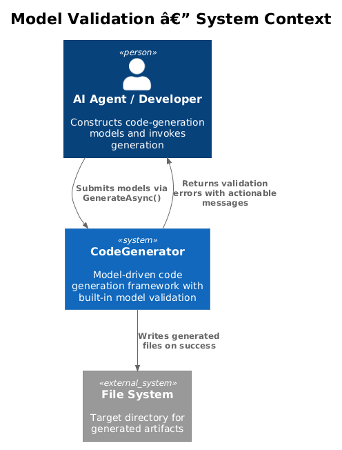
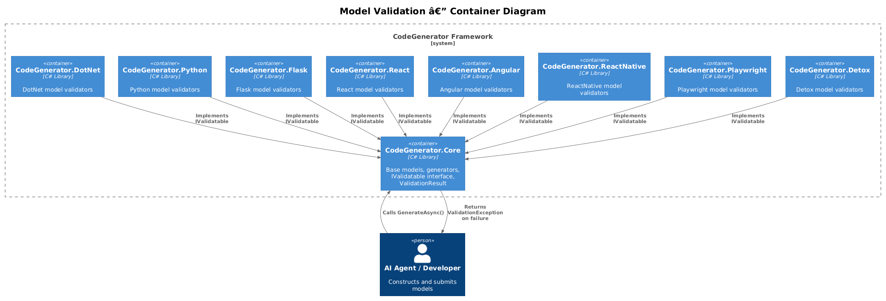
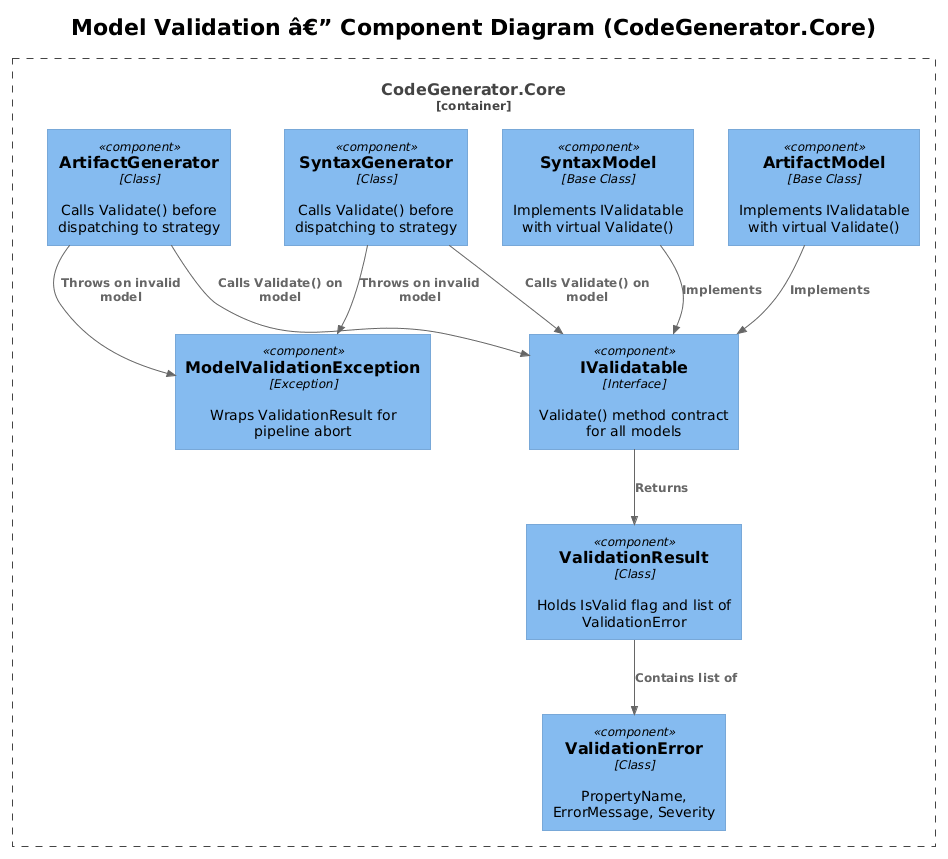
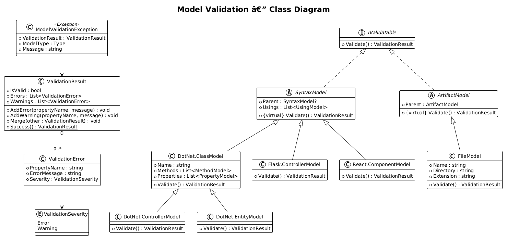
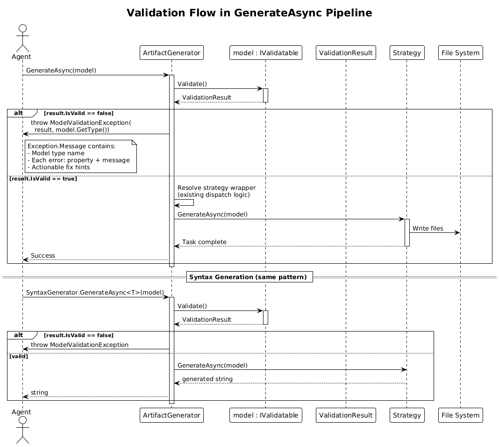

# Model Validation — Detailed Design

**Feature:** 12-model-validation (Priority Action #2)
**Status:** Draft
**Context:** Architecture Audit — all models are plain POCOs with no constraints; invalid models produce garbage output with no error feedback to agents.

---

## 1. Overview

The CodeGenerator framework currently dispatches models directly to generation strategies with zero validation. A `ProjectModel` with a null `Name`, a `ControllerModel` with no entity, or a `FileModel` with an empty `Directory` will silently produce malformed output or throw cryptic `NullReferenceException` deep in template rendering.

### Problem

- **No fail-fast:** Invalid models propagate through the entire pipeline before failing (or producing garbage).
- **No actionable errors:** When generation fails, the exception stack trace gives no indication of which property was wrong or how to fix it.
- **Agent self-correction is impossible:** AI agents calling `GenerateAsync` cannot learn from errors because there is no structured error response.

### Goal

Add a validation layer so that every model is checked before dispatch. When validation fails, the caller receives a `ModelValidationException` containing a structured `ValidationResult` with property-level error messages that are specific enough for an agent to self-correct.

### Actors

| Actor | Description |
|-------|-------------|
| **AI Agent** | Constructs models programmatically and calls `GenerateAsync`; needs structured error feedback to self-correct |
| **Developer** | Implements custom models and validators in language-specific packages |
| **Host Application** | CLI or service that invokes generation and surfaces validation errors |

### Scope

- `IValidatable` interface and `ValidationResult` types in `CodeGenerator.Core`
- Virtual `Validate()` on `SyntaxModel` and `ArtifactModel` base classes
- Validation rules for key models across all 8 language-specific packages
- Validation gate in `ArtifactGenerator.GenerateAsync` and `SyntaxGenerator.GenerateAsync`
- `ModelValidationException` with structured error payload

### Out of Scope

- FluentValidation integration (deferred to a follow-up; this design uses a simpler built-in approach that can be swapped later)
- Cross-model validation (e.g., verifying that a `SolutionModel` project reference actually exists)
- Runtime validation of generated output (post-generation checks)

---

## 2. Architecture

### 2.1 C4 Context Diagram

Shows how agents interact with the CodeGenerator and receive validation feedback.



### 2.2 C4 Container Diagram

The validation layer spans all packages: `Core` defines the contracts, each language package implements validators on its models.



### 2.3 C4 Component Diagram

Internal validation components within `CodeGenerator.Core` and how they integrate with the generation pipeline.



---

## 3. Component Details

### 3.1 IValidatable Interface

**Location:** `CodeGenerator.Core.Validation`

```csharp
public interface IValidatable
{
    ValidationResult Validate();
}
```

- Single method returning a `ValidationResult`.
- Implemented by `SyntaxModel` and `ArtifactModel` base classes with a virtual no-op (returns `ValidationResult.Success()`).
- Concrete models override `Validate()` to add their rules.

### 3.2 ValidationResult

**Location:** `CodeGenerator.Core.Validation`

```csharp
public class ValidationResult
{
    public bool IsValid => Errors.Count == 0;
    public List<ValidationError> Errors { get; }
    public List<ValidationError> Warnings { get; }

    public void AddError(string propertyName, string message);
    public void AddWarning(string propertyName, string message);
    public void Merge(ValidationResult other);
    public static ValidationResult Success();
}
```

- `Errors` block generation; `Warnings` are logged but do not block.
- `Merge()` combines results from child model validation (recursive validation of `GetChildren()`).

### 3.3 ValidationError

**Location:** `CodeGenerator.Core.Validation`

```csharp
public class ValidationError
{
    public string PropertyName { get; init; }
    public string ErrorMessage { get; init; }
    public ValidationSeverity Severity { get; init; }
}

public enum ValidationSeverity { Error, Warning }
```

### 3.4 ModelValidationException

**Location:** `CodeGenerator.Core.Validation`

```csharp
public class ModelValidationException : Exception
{
    public ValidationResult ValidationResult { get; }
    public Type ModelType { get; }

    public override string Message =>
        $"Validation failed for {ModelType.Name}: " +
        string.Join("; ", ValidationResult.Errors.Select(
            e => $"{e.PropertyName}: {e.ErrorMessage}"));
}
```

- Thrown by both generators when `ValidationResult.IsValid` is false.
- `Message` is a single-line summary suitable for agent consumption.
- `ValidationResult` is available for structured inspection.

### 3.5 Base Model Integration

**SyntaxModel changes:**

```csharp
public class SyntaxModel : IValidatable
{
    // ... existing members ...

    public virtual ValidationResult Validate()
    {
        return ValidationResult.Success();
    }
}
```

**ArtifactModel changes:**

```csharp
public class ArtifactModel : IValidatable
{
    // ... existing members ...

    public virtual ValidationResult Validate()
    {
        return ValidationResult.Success();
    }
}
```

### 3.6 Generator Integration

**ArtifactGenerator.GenerateAsync:**

```csharp
public async Task GenerateAsync(object model)
{
    if (model is IValidatable validatable)
    {
        var result = validatable.Validate();
        if (!result.IsValid)
            throw new ModelValidationException(result, model.GetType());

        foreach (var warning in result.Warnings)
            logger.LogWarning("Validation warning on {Type}.{Prop}: {Msg}",
                model.GetType().Name, warning.PropertyName, warning.ErrorMessage);
    }

    // ... existing dispatch logic unchanged ...
}
```

**SyntaxGenerator.GenerateAsync\<T\>:**

Same pattern — check `IValidatable`, validate, throw or log warnings, then proceed.

### 3.7 Validators Per Module

Each module overrides `Validate()` on its key models. The table below lists the initial validation rules.

#### Core

| Model | Property | Rule |
|-------|----------|------|
| `FileModel` | `Name` | Required, non-empty |
| `FileModel` | `Directory` | Required, non-empty |
| `FileModel` | `Extension` | Required, must start with `.` |

#### DotNet

| Model | Property | Rule |
|-------|----------|------|
| `ClassModel` | `Name` | Required, non-empty, valid C# identifier |
| `InterfaceModel` | `Name` | Required, non-empty |
| `ControllerModel` | `Name` | Required, non-empty |
| `EntityModel` | `Name` | Required, non-empty |
| `MethodModel` | `Name` | Required, non-empty |
| `PropertyModel` | `Name` | Required, non-empty |
| `PropertyModel` | `Type` | Required, non-null |
| `DbContextModel` | `Name` | Required, non-empty |
| `DbContextModel` | `Entities` | Required, at least one entity |
| `ProjectModel` | `Name` | Required, non-empty |
| `ProjectModel` | `ProjectGuid` | Required, non-empty |
| `SolutionModel` | `Projects` | Required, at least one project |

#### Python

| Model | Property | Rule |
|-------|----------|------|
| `ClassModel` | `Name` | Required, non-empty, valid Python identifier |
| `MethodModel` | `Name` | Required, non-empty |
| `FunctionModel` | `Name` | Required, non-empty |
| `ModuleModel` | `Name` | Required, non-empty |

#### Flask

| Model | Property | Rule |
|-------|----------|------|
| `ControllerModel` | `Name` | Required, non-empty |
| `ModelModel` | `Name` | Required, non-empty |
| `ServiceModel` | `Name` | Required, non-empty |
| `SchemaModel` | `Name` | Required, non-empty |
| `ProjectModel` | `Name` | Required, non-empty |

#### React

| Model | Property | Rule |
|-------|----------|------|
| `ComponentModel` | `Name` | Required, non-empty |
| `HookModel` | `Name` | Required, non-empty, must start with `use` (warning) |
| `StoreModel` | `Name` | Required, non-empty |
| `ApiClientModel` | `Name` | Required, non-empty |
| `ApiClientModel` | `BaseUrl` | Required, non-empty |

#### Angular

| Model | Property | Rule |
|-------|----------|------|
| `WorkspaceModel` | `Name` | Required, non-empty |
| `ProjectModel` | `Name` | Required, non-empty |
| `TypeScriptTypeModel` | `Name` | Required, non-empty |

#### ReactNative

| Model | Property | Rule |
|-------|----------|------|
| `ScreenModel` | `Name` | Required, non-empty |
| `ComponentModel` | `Name` | Required, non-empty |
| `NavigationModel` | `Name` | Required, non-empty |
| `NavigationModel` | `Screens` | Required, at least one screen |

#### Playwright

| Model | Property | Rule |
|-------|----------|------|
| `PageObjectModel` | `Name` | Required, non-empty |
| `PageObjectModel` | `Url` | Required, non-empty |
| `TestSpecModel` | `Name` | Required, non-empty |
| `FixtureModel` | `Name` | Required, non-empty |

#### Detox

| Model | Property | Rule |
|-------|----------|------|
| `PageObjectModel` | `Name` | Required, non-empty |
| `TestSpecModel` | `Name` | Required, non-empty |

---

## 4. Data Model

### 4.1 Validation Class Hierarchy



### 4.2 Entity Descriptions

| Entity | Description |
|--------|-------------|
| `IValidatable` | Interface with single `Validate()` method returning `ValidationResult` |
| `ValidationResult` | Aggregates errors and warnings; `IsValid` is true when `Errors` is empty |
| `ValidationError` | Identifies a specific property violation with severity |
| `ValidationSeverity` | Enum: `Error` (blocks generation) or `Warning` (logged only) |
| `ModelValidationException` | Exception thrown by generators; carries `ValidationResult` and `ModelType` for structured error handling |
| `SyntaxModel` | Base class for all syntax models; implements `IValidatable` with virtual no-op |
| `ArtifactModel` | Base class for all artifact models; implements `IValidatable` with virtual no-op |

---

## 5. Key Workflows

### 5.1 Validation in the Generation Pipeline

Both `ArtifactGenerator.GenerateAsync(object model)` and `SyntaxGenerator.GenerateAsync<T>(T model)` follow the same validation-first pattern.



**Steps:**

1. Agent calls `GenerateAsync(model)`.
2. Generator checks if model implements `IValidatable`.
3. Calls `model.Validate()` which returns a `ValidationResult`.
4. The model's `Validate()` override checks its own properties and optionally calls `Validate()` on child models via `GetChildren()`, merging results.
5. If `result.IsValid == false`: throw `ModelValidationException` with the full result and model type.
6. If there are warnings: log each via `ILogger.LogWarning`.
7. If valid: proceed with existing dispatch logic (strategy lookup, resolution, invocation) unchanged.

### 5.2 Recursive Child Validation

Models with children (e.g., `ClassModel` with `Methods`, `Fields`, `Constructors`) validate themselves first, then iterate over `GetChildren()` and merge each child's `ValidationResult`:

```csharp
public override ValidationResult Validate()
{
    var result = new ValidationResult();

    if (string.IsNullOrWhiteSpace(Name))
        result.AddError(nameof(Name), "Class name is required.");

    foreach (var child in GetChildren())
    {
        if (child is IValidatable validatable)
            result.Merge(validatable.Validate());
    }

    return result;
}
```

This ensures that a `ClassModel` with an invalid `MethodModel` child reports the method-level error without requiring the caller to manually walk the tree.

### 5.3 Agent Error Handling Flow

When an agent receives a `ModelValidationException`:

1. Parse `exception.Message` for a human-readable summary (e.g., `"Validation failed for ClassModel: Name: Class name is required."`).
2. Optionally inspect `exception.ValidationResult.Errors` for structured property-level details.
3. Fix the identified properties on the model.
4. Retry `GenerateAsync(model)`.

This feedback loop allows agents to self-correct without understanding the internal generation pipeline.

---

## 6. API Contracts

### 6.1 Validation Error Format

When `ModelValidationException` is caught and serialized (e.g., in a CLI or HTTP wrapper), the recommended JSON format is:

```json
{
    "error": "ModelValidationFailed",
    "modelType": "CodeGenerator.DotNet.Syntax.Classes.ClassModel",
    "isValid": false,
    "errors": [
        {
            "propertyName": "Name",
            "errorMessage": "Class name is required.",
            "severity": "Error"
        },
        {
            "propertyName": "Methods[2].Name",
            "errorMessage": "Method name is required.",
            "severity": "Error"
        }
    ],
    "warnings": [
        {
            "propertyName": "BaseClass",
            "errorMessage": "BaseClass is null; the class will have no base type.",
            "severity": "Warning"
        }
    ]
}
```

### 6.2 Exception Hierarchy

| Exception | When Thrown | Contains |
|-----------|-----------|----------|
| `ModelValidationException` | `Validate()` returns errors | `ValidationResult`, `ModelType` |
| `InvalidOperationException` | No strategy found for model type (existing behavior) | Strategy type info |

### 6.3 Backward Compatibility

- `IValidatable` is implemented on base classes with a virtual no-op. Models that do not override `Validate()` pass validation automatically.
- Existing callers that do not catch `ModelValidationException` will see it as an unhandled exception (same as current `NullReferenceException` failures, but with a clear message).
- No changes to `IArtifactGenerator` or `ISyntaxGenerator` interfaces.

---

## 7. Implementation Plan

### Phase 1: Core Infrastructure

1. Add `CodeGenerator.Core.Validation` namespace with `IValidatable`, `ValidationResult`, `ValidationError`, `ValidationSeverity`, `ModelValidationException`.
2. Make `SyntaxModel` and `ArtifactModel` implement `IValidatable` with virtual `Validate()`.
3. Add validation gate to `ArtifactGenerator.GenerateAsync` and `SyntaxGenerator.GenerateAsync<T>`.
4. Add `FileModel.Validate()` override (Name, Directory, Extension checks).

### Phase 2: DotNet Validators

5. Add `Validate()` overrides to `ClassModel`, `InterfaceModel`, `ControllerModel`, `EntityModel`, `MethodModel`, `PropertyModel`, `DbContextModel`, `ProjectModel`, `SolutionModel`.

### Phase 3: All Other Modules

6. Python: `ClassModel`, `MethodModel`, `FunctionModel`, `ModuleModel`.
7. Flask: `ControllerModel`, `ModelModel`, `ServiceModel`, `SchemaModel`, `ProjectModel`.
8. React: `ComponentModel`, `HookModel`, `StoreModel`, `ApiClientModel`.
9. Angular: `WorkspaceModel`, `ProjectModel`, `TypeScriptTypeModel`.
10. ReactNative: `ScreenModel`, `ComponentModel`, `NavigationModel`.
11. Playwright: `PageObjectModel`, `TestSpecModel`, `FixtureModel`.
12. Detox: `PageObjectModel`, `TestSpecModel`.

### Phase 4: Tests

13. Unit tests for `ValidationResult` merge behavior.
14. Unit tests for each model's `Validate()` — valid model passes, invalid model returns expected errors.
15. Integration tests confirming `ArtifactGenerator` and `SyntaxGenerator` throw `ModelValidationException` for invalid models.

---

## 8. Open Questions

| # | Question | Context |
|---|----------|---------|
| 1 | Should validation be opt-out via a flag on `GenerateAsync` (e.g., `GenerateAsync(model, skipValidation: false)`)? | Some callers may want to bypass validation for performance or during prototyping. |
| 2 | Should `Validate()` be async to support validators that need I/O (e.g., checking file existence)? | Current rules are all in-memory. Async would future-proof but adds complexity to every override. |
| 3 | Should recursive child validation be automatic in the base class or explicit per model? | Automatic is safer (no model forgets to validate children) but may validate the same child multiple times in diamond hierarchies. |
| 4 | Should we adopt FluentValidation from the start instead of the built-in approach? | FluentValidation adds a NuGet dependency but provides a richer rule DSL, conditional rules, and collection validation out of the box. The built-in approach can be migrated later. |
| 5 | Should `ValidationResult` include a `ModelPath` to indicate nesting depth (e.g., `Solution.Projects[0].Name`)? | Would improve error messages for deeply nested models but requires threading the path through recursive validation. |
| 6 | Should warnings for common naming conventions (e.g., React hook names starting with `use`) be errors or warnings? | Warnings allow generation to proceed; errors enforce convention strictly. |
