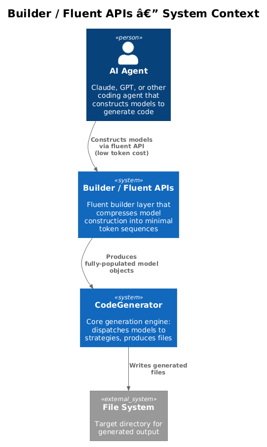
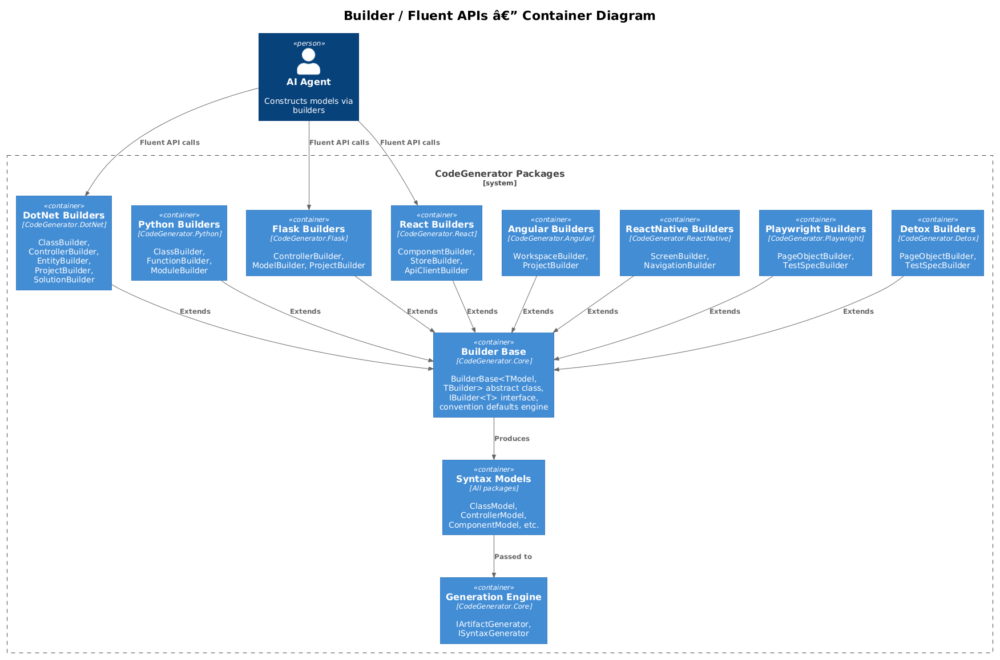
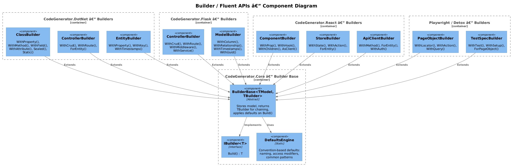
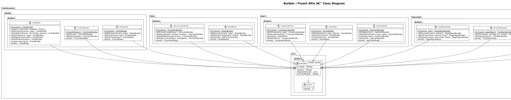
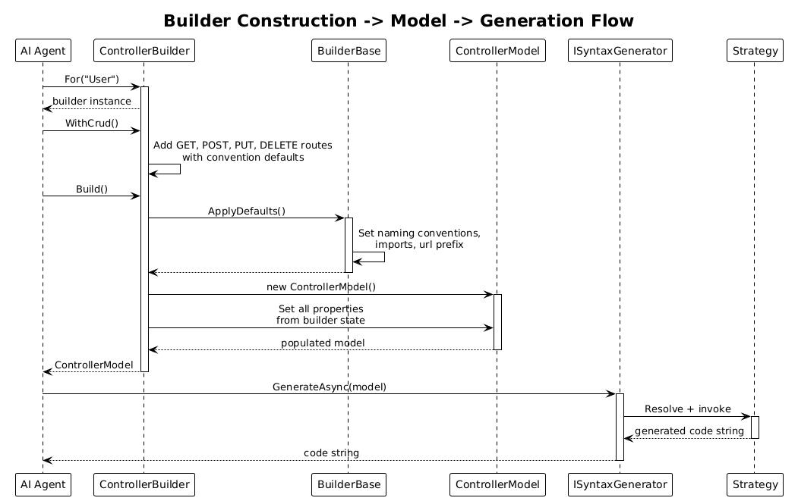

# Builder / Fluent APIs — Detailed Design

**Feature:** 13-builder-fluent-apis
**Status:** Draft
**Priority Action:** #3 from Architecture Audit
**Impact:** Token savings, Agent usability

---

## 1. Overview

### Problem

The CodeGenerator framework's core value proposition is saving tokens for AI agents. However, constructing syntax models currently requires verbose C# object initializers that can approach the token cost of writing the target code directly. For example, building a Flask `ControllerModel` with 4 CRUD routes requires specifying each route's path, HTTP methods, handler name, and body individually -- easily 40+ lines of C# to generate a 30-line Python file.

```csharp
// Current: ~45 tokens to construct a Flask controller with 4 routes
var controller = new ControllerModel("user") {
    UrlPrefix = "/api/users",
    Routes = [
        new ControllerRouteModel {
            Path = "/",
            Methods = ["GET"],
            HandlerName = "get_users",
            Body = "return jsonify(user_schema.dump(User.query.all(), many=True))"
        },
        new ControllerRouteModel {
            Path = "/<int:id>",
            Methods = ["GET"],
            HandlerName = "get_user",
            Body = "user = User.query.get_or_404(id)\nreturn jsonify(user_schema.dump(user))"
        },
        new ControllerRouteModel {
            Path = "/",
            Methods = ["POST"],
            HandlerName = "create_user",
            Body = "data = request.get_json()\nuser = user_schema.load(data)\ndb.session.add(user)\ndb.session.commit()\nreturn jsonify(user_schema.dump(user)), 201"
        },
        new ControllerRouteModel {
            Path = "/<int:id>",
            Methods = ["DELETE"],
            HandlerName = "delete_user",
            Body = "user = User.query.get_or_404(id)\ndb.session.delete(user)\ndb.session.commit()\nreturn '', 204"
        }
    ],
    Imports = [
        new ImportModel("flask", "Blueprint, request, jsonify"),
        new ImportModel("models", "User, db"),
        new ImportModel("schemas", "UserSchema")
    ],
    SchemaInstances = [
        new ControllerInstanceModel { VariableName = "user_schema", ClassName = "UserSchema" }
    ]
};
```

### Solution

Add a builder/fluent API layer with aggressive convention-based defaults. Each builder compresses model construction to the minimum information an agent must provide -- typically just a name and a high-level intent.

```csharp
// Target: ~8 tokens for the same result
var controller = FlaskControllerBuilder.For("User")
    .WithCrud()
    .Build();
```

The `WithCrud()` method auto-generates all 4 CRUD routes with correct paths, HTTP methods, handler names, request/response bodies, imports, and schema instances -- all derived from the entity name "User" using naming conventions.

### Token Savings Rationale

| Scenario | Current (tokens) | With Builders (tokens) | Reduction |
|----------|----------------:|----------------------:|----------:|
| Flask CRUD controller (4 routes) | ~280 | ~30 | ~89% |
| DotNet entity with 5 properties | ~180 | ~60 | ~67% |
| React component with 3 props + hooks | ~150 | ~40 | ~73% |
| Playwright page object (5 locators, 3 actions) | ~220 | ~70 | ~68% |
| Full Flask project (model + controller + schema) | ~500 | ~80 | ~84% |

The largest savings come from high-level convenience methods (`WithCrud`, `ForEntity`) that encode domain-specific conventions. Even without those, the fluent chaining syntax saves ~30-40% by eliminating boilerplate list initialization, nested object constructors, and property setters.

### Actors

| Actor | Description |
|-------|-------------|
| **AI Agent** | Constructs models via builder fluent APIs to minimize token usage |
| **Developer** | Extends builders with framework-specific convenience methods |
| **Host Application** | Resolves builders from DI or constructs them directly via static factory methods |

### Scope

This design covers builder classes for all 8 framework modules. Each builder lives in its respective NuGet package (e.g., `FlaskControllerBuilder` in `CodeGenerator.Flask`). The shared `BuilderBase<TModel, TBuilder>` abstract class lives in `CodeGenerator.Core`.

---

## 2. Architecture

### 2.1 C4 Context Diagram

Shows how the builder layer fits between the AI agent and the generation engine.



### 2.2 C4 Container Diagram

The builder layer as a set of containers within each CodeGenerator package.



### 2.3 C4 Component Diagram

Builder components within each module and their relationship to the shared base.



---

## 3. Component Details

### 3.1 Builder Base (`CodeGenerator.Core`)

**Namespace:** `CodeGenerator.Core.Builders`

**Key classes:**

- `IBuilder<T>` -- interface with a single `Build()` method returning `T`
- `BuilderBase<TModel, TBuilder>` -- abstract generic base providing fluent chaining infrastructure

**Design:**

```csharp
public interface IBuilder<T>
{
    T Build();
}

public abstract class BuilderBase<TModel, TBuilder> : IBuilder<TModel>
    where TBuilder : BuilderBase<TModel, TBuilder>
{
    protected TModel _model;

    protected BuilderBase(TModel model)
    {
        _model = model;
    }

    public TModel Build()
    {
        ApplyDefaults();
        Validate();
        return _model;
    }

    /// <summary>
    /// Apply convention-based defaults before returning the model.
    /// Called automatically by Build().
    /// </summary>
    protected virtual void ApplyDefaults() { }

    /// <summary>
    /// Validate the model before returning. Throws if invalid.
    /// </summary>
    protected virtual void Validate() { }

    /// <summary>
    /// Returns this as TBuilder for fluent chaining.
    /// </summary>
    protected TBuilder Self => (TBuilder)this;
}
```

The curiously recurring template pattern (CRTP) via `TBuilder` ensures that all fluent methods return the concrete builder type, not the base class. This allows framework-specific methods to chain naturally without casting.

**Convention defaults engine:**

`ApplyDefaults()` is the extension point where each builder fills in missing values using naming conventions. For example, `FlaskControllerBuilder.ApplyDefaults()` derives `UrlPrefix` from the entity name if not explicitly set, generates import statements based on which features were requested, and creates schema instance variables from the model name.

### 3.2 DotNet Builders (`CodeGenerator.DotNet`)

**Namespace:** `CodeGenerator.DotNet.Builders`

#### ClassBuilder

Builds `ClassModel` instances. Provides fluent methods for the most common class construction patterns.

```csharp
public class ClassBuilder : BuilderBase<ClassModel, ClassBuilder>
{
    private ClassBuilder(string name) : base(new ClassModel(name)) { }

    public static ClassBuilder For(string name) => new(name);

    public ClassBuilder Public() { _model.AccessModifier = AccessModifier.Public; return Self; }
    public ClassBuilder Internal() { _model.AccessModifier = AccessModifier.Internal; return Self; }
    public ClassBuilder Sealed() { _model.Sealed = true; return Self; }
    public ClassBuilder Static() { _model.Static = true; return Self; }

    public ClassBuilder WithProperty(string name, string type)
    {
        _model.Properties.Add(new PropertyModel { Name = name, Type = new TypeModel(type) });
        return Self;
    }

    public ClassBuilder WithMethod(string name, string returnType = "void",
        params (string name, string type)[] parameters)
    {
        var method = new MethodModel { Name = name, ReturnType = new TypeModel(returnType) };
        foreach (var (pName, pType) in parameters)
            method.Params.Add(new ParamModel { Name = pName, Type = new TypeModel(pType) });
        _model.AddMethod(method);
        return Self;
    }

    public ClassBuilder WithField(string name, string type)
    {
        _model.Fields.Add(new FieldModel { Name = name, Type = new TypeModel(type) });
        return Self;
    }

    public ClassBuilder WithBaseClass(string name) { _model.BaseClass = name; return Self; }

    public ClassBuilder WithAttribute(string name)
    {
        _model.Attributes.Add(new AttributeModel { Name = name });
        return Self;
    }

    public ClassBuilder Implements(string interfaceName)
    {
        _model.Implements.Add(new InterfaceModel(interfaceName));
        return Self;
    }

    protected override void ApplyDefaults()
    {
        // Default to Public if not explicitly set
        if (_model.AccessModifier == default)
            _model.AccessModifier = AccessModifier.Public;
    }
}
```

#### ControllerBuilder

Builds `ControllerModel` instances. The `WithCrud()` convenience method auto-generates all 5 standard REST routes (GET all, GET by ID, POST, PUT, DELETE).

```csharp
public class ControllerBuilder : BuilderBase<ControllerModel, ControllerBuilder>
{
    private readonly INamingConventionConverter _naming;
    private readonly ClassModel _entity;

    private ControllerBuilder(INamingConventionConverter naming, ClassModel entity)
        : base(new ControllerModel(naming, entity))
    {
        _naming = naming;
        _entity = entity;
    }

    public static ControllerBuilder For(INamingConventionConverter naming, ClassModel entity)
        => new(naming, entity);

    public ControllerBuilder WithCrud() => Self; // Already has CRUD from ControllerModel constructor

    public ControllerBuilder WithRoute(RouteType routeType)
    {
        // Add specific route type
        return Self;
    }
}
```

#### EntityBuilder

Builds `EntityModel` with common property patterns.

```csharp
public class EntityBuilder : BuilderBase<EntityModel, EntityBuilder>
{
    private EntityBuilder(string name) : base(new EntityModel(name)) { }

    public static EntityBuilder For(string name) => new(name);

    public EntityBuilder WithProperty(string name, string type)
    {
        _model.Properties.Add(new PropertyModel { Name = name, Type = new TypeModel(type) });
        return Self;
    }

    public EntityBuilder WithKey(string name = "Id", string type = "Guid")
    {
        _model.Properties.Insert(0, new PropertyModel { Name = name, Type = new TypeModel(type) });
        return Self;
    }

    public EntityBuilder WithTimestamps()
    {
        _model.Properties.Add(new PropertyModel { Name = "CreatedAt", Type = new TypeModel("DateTime") });
        _model.Properties.Add(new PropertyModel { Name = "UpdatedAt", Type = new TypeModel("DateTime") });
        return Self;
    }
}
```

### 3.3 Python Builders (`CodeGenerator.Python`)

**Namespace:** `CodeGenerator.Python.Builders`

#### ClassBuilder

```csharp
public class ClassBuilder : BuilderBase<ClassModel, ClassBuilder>
{
    private ClassBuilder(string name) : base(new ClassModel(name)) { }

    public static ClassBuilder For(string name) => new(name);

    public ClassBuilder WithBase(string baseName)
    {
        _model.Bases.Add(baseName);
        return Self;
    }

    public ClassBuilder WithMethod(string name, string parameters = "", string body = "pass")
    {
        _model.Methods.Add(new MethodModel(name) { Parameters = parameters, Body = body });
        return Self;
    }

    public ClassBuilder WithProperty(string name, string type = "str")
    {
        _model.Properties.Add(new PropertyModel { Name = name, Type = type });
        return Self;
    }

    public ClassBuilder WithDecorator(string decorator)
    {
        _model.Decorators.Add(new DecoratorModel(decorator));
        return Self;
    }

    public ClassBuilder WithImport(string module, string? names = null)
    {
        _model.Imports.Add(new ImportModel(module, names));
        return Self;
    }
}
```

#### FunctionBuilder

```csharp
public class FunctionBuilder : BuilderBase<FunctionModel, FunctionBuilder>
{
    private FunctionBuilder(string name) : base(new FunctionModel(name)) { }

    public static FunctionBuilder For(string name) => new(name);

    public FunctionBuilder WithParam(string name, string? type = null) { /* ... */ return Self; }
    public FunctionBuilder WithBody(string body) { /* ... */ return Self; }
    public FunctionBuilder WithDecorator(string decorator) { /* ... */ return Self; }
    public FunctionBuilder WithReturn(string type) { /* ... */ return Self; }
    public FunctionBuilder Async() { /* ... */ return Self; }
}
```

### 3.4 Flask Builders (`CodeGenerator.Flask`)

**Namespace:** `CodeGenerator.Flask.Builders`

#### ControllerBuilder

The highest-value builder. `WithCrud(modelName)` generates all 4 CRUD routes with correct Flask/SQLAlchemy patterns, imports, and schema instances.

```csharp
public class ControllerBuilder : BuilderBase<ControllerModel, ControllerBuilder>
{
    private string? _entityName;

    private ControllerBuilder(string name) : base(new ControllerModel(name)) { }

    public static ControllerBuilder For(string name) => new(name);

    public ControllerBuilder WithCrud(string? modelName = null)
    {
        _entityName = modelName ?? _model.Name;
        var snake = ToSnakeCase(_entityName);
        var plural = Pluralize(snake);

        _model.Routes.AddRange([
            new ControllerRouteModel {
                Path = "/", Methods = ["GET"], HandlerName = $"get_{plural}",
                Body = $"return jsonify({snake}_schema.dump({_entityName}.query.all(), many=True))"
            },
            new ControllerRouteModel {
                Path = "/<int:id>", Methods = ["GET"], HandlerName = $"get_{snake}",
                Body = $"{snake} = {_entityName}.query.get_or_404(id)\nreturn jsonify({snake}_schema.dump({snake}))"
            },
            new ControllerRouteModel {
                Path = "/", Methods = ["POST"], HandlerName = $"create_{snake}",
                Body = $"data = request.get_json()\n{snake} = {snake}_schema.load(data)\ndb.session.add({snake})\ndb.session.commit()\nreturn jsonify({snake}_schema.dump({snake})), 201"
            },
            new ControllerRouteModel {
                Path = "/<int:id>", Methods = ["DELETE"], HandlerName = $"delete_{snake}",
                Body = $"{snake} = {_entityName}.query.get_or_404(id)\ndb.session.delete({snake})\ndb.session.commit()\nreturn '', 204"
            }
        ]);

        return Self;
    }

    public ControllerBuilder WithRoute(string path, string method, string handlerName, string body)
    {
        _model.Routes.Add(new ControllerRouteModel {
            Path = path, Methods = [method], HandlerName = handlerName, Body = body
        });
        return Self;
    }

    public ControllerBuilder WithMiddleware(string decorator)
    {
        _model.MiddlewareDecorators.Add(decorator);
        return Self;
    }

    public ControllerBuilder WithService(string variableName, string className)
    {
        _model.ServiceInstances.Add(new ControllerInstanceModel {
            VariableName = variableName, ClassName = className
        });
        return Self;
    }

    public ControllerBuilder WithUrlPrefix(string prefix)
    {
        _model.UrlPrefix = prefix;
        return Self;
    }

    protected override void ApplyDefaults()
    {
        if (_model.UrlPrefix == null && _entityName != null)
            _model.UrlPrefix = $"/api/{Pluralize(ToSnakeCase(_entityName))}";

        if (_entityName != null)
        {
            _model.Imports.Add(new ImportModel("flask", "Blueprint, request, jsonify"));
            _model.Imports.Add(new ImportModel("models", $"{_entityName}, db"));
            _model.Imports.Add(new ImportModel("schemas", $"{_entityName}Schema"));
            _model.SchemaInstances.Add(new ControllerInstanceModel {
                VariableName = $"{ToSnakeCase(_entityName)}_schema",
                ClassName = $"{_entityName}Schema"
            });
        }
    }
}
```

#### ModelBuilder

Builds Flask/SQLAlchemy `ModelModel` instances with column and relationship helpers.

```csharp
public class ModelBuilder : BuilderBase<ModelModel, ModelBuilder>
{
    private ModelBuilder(string name) : base(new ModelModel(name)) { }

    public static ModelBuilder For(string name) => new(name);

    public ModelBuilder WithColumn(string name, string type, bool nullable = true)
    {
        _model.Columns.Add(new ColumnModel(name, type) { Nullable = nullable });
        return Self;
    }

    public ModelBuilder WithPrimaryKey(string name = "id", string type = "db.Integer")
    {
        _model.Columns.Insert(0, new ColumnModel(name, type) {
            PrimaryKey = true, Nullable = false, Autoincrement = true
        });
        return Self;
    }

    public ModelBuilder WithForeignKey(string name, string reference)
    {
        _model.Columns.Add(new ColumnModel(name, "db.Integer") { ForeignKey = reference });
        return Self;
    }

    public ModelBuilder WithRelationship(string name, string target, string? backRef = null)
    {
        _model.Relationships.Add(new RelationshipModel {
            Name = name, Target = target, BackRef = backRef
        });
        return Self;
    }

    public ModelBuilder WithUuid() { _model.HasUuidMixin = true; return Self; }
    public ModelBuilder WithTimestamps() { _model.HasTimestampMixin = true; return Self; }

    public ModelBuilder WithTableName(string tableName)
    {
        _model.TableName = tableName;
        return Self;
    }
}
```

### 3.5 React Builders (`CodeGenerator.React`)

**Namespace:** `CodeGenerator.React.Builders`

#### ComponentBuilder

```csharp
public class ComponentBuilder : BuilderBase<ComponentModel, ComponentBuilder>
{
    private ComponentBuilder(string name) : base(new ComponentModel(name)) { }

    public static ComponentBuilder For(string name) => new(name);

    public ComponentBuilder WithProp(string name, string type)
    {
        _model.Props.Add(new PropertyModel { Name = name, Type = type });
        return Self;
    }

    public ComponentBuilder WithHook(string hookExpression)
    {
        _model.Hooks.Add(hookExpression);
        return Self;
    }

    public ComponentBuilder WithChildren() { _model.IncludeChildren = true; return Self; }
    public ComponentBuilder AsClient() { _model.IsClient = true; return Self; }
    public ComponentBuilder AsDefault() { _model.ExportDefault = true; return Self; }
    public ComponentBuilder AsForwardRef() { _model.ComponentStyle = "forwardRef"; return Self; }
    public ComponentBuilder AsFc() { _model.ComponentStyle = "fc"; return Self; }
    public ComponentBuilder AsArrow() { _model.ComponentStyle = "arrow"; return Self; }

    public ComponentBuilder WithBody(string jsx)
    {
        _model.BodyContent = jsx;
        return Self;
    }

    public ComponentBuilder WithImport(string module, string? names = null)
    {
        _model.Imports.Add(new ImportModel { Module = module, Names = names });
        return Self;
    }

    public ComponentBuilder WithMemo() { _model.UseMemo = true; return Self; }
    public ComponentBuilder SpreadProps() { _model.SpreadProps = true; return Self; }
}
```

#### StoreBuilder

```csharp
public class StoreBuilder : BuilderBase<StoreModel, StoreBuilder>
{
    private StoreBuilder(string name) : base(new StoreModel(name)) { }

    public static StoreBuilder For(string name) => new(name);

    public StoreBuilder WithState(string name, string type, string? defaultValue = null)
    {
        _model.StateProperties.Add(new PropertyModel { Name = name, Type = type });
        return Self;
    }

    public StoreBuilder WithAction(string name, string? implementation = null, string? signature = null)
    {
        _model.Actions.Add(name);
        if (implementation != null) _model.ActionImplementations[name] = implementation;
        if (signature != null) _model.ActionSignatures[name] = signature;
        return Self;
    }

    public StoreBuilder ForEntity(string entityName)
    {
        _model.EntityName = entityName;
        _model.IncludeAsyncState = true;
        return Self;
    }
}
```

#### ApiClientBuilder

```csharp
public class ApiClientBuilder : BuilderBase<ApiClientModel, ApiClientBuilder>
{
    private string? _entityName;

    private ApiClientBuilder(string name) : base(new ApiClientModel(name)) { }

    public static ApiClientBuilder For(string name) => new(name);

    public ApiClientBuilder WithBaseUrl(string url) { _model.BaseUrl = url; return Self; }

    public ApiClientBuilder WithMethod(string name, string httpMethod, string route,
        string responseType = "any", string? requestBodyType = null)
    {
        _model.Methods.Add(new ApiClientMethodModel {
            Name = name, HttpMethod = httpMethod, Route = route,
            ResponseType = responseType, RequestBodyType = requestBodyType
        });
        return Self;
    }

    public ApiClientBuilder ForEntity(string name)
    {
        _entityName = name;
        var plural = Pluralize(ToCamelCase(name));
        _model.BaseUrl = $"/api/{plural}";
        _model.Methods.AddRange([
            new ApiClientMethodModel { Name = $"getAll{name}s", HttpMethod = "GET", Route = "/", ResponseType = $"{name}[]" },
            new ApiClientMethodModel { Name = $"get{name}ById", HttpMethod = "GET", Route = "/:id", ResponseType = name },
            new ApiClientMethodModel { Name = $"create{name}", HttpMethod = "POST", Route = "/", ResponseType = name, RequestBodyType = $"Create{name}Request" },
            new ApiClientMethodModel { Name = $"update{name}", HttpMethod = "PUT", Route = "/:id", ResponseType = name, RequestBodyType = $"Update{name}Request" },
            new ApiClientMethodModel { Name = $"delete{name}", HttpMethod = "DELETE", Route = "/:id", ResponseType = "void" }
        ]);
        return Self;
    }

    public ApiClientBuilder WithAuth() { _model.IncludeAuthInterceptor = true; return Self; }
    public ApiClientBuilder WithSharedInstance(string importPath = "./apiClient")
    {
        _model.UseSharedInstance = true;
        _model.SharedInstanceImport = importPath;
        return Self;
    }
    public ApiClientBuilder AsObject() { _model.ExportStyle = "object"; return Self; }
    public ApiClientBuilder WrapInTryCatch() { _model.WrapInTryCatch = true; return Self; }
}
```

### 3.6 Angular Builders (`CodeGenerator.Angular`)

**Namespace:** `CodeGenerator.Angular.Builders`

#### WorkspaceBuilder

```csharp
public class WorkspaceBuilder : BuilderBase<WorkspaceModel, WorkspaceBuilder>
{
    private WorkspaceBuilder(string name, string version, string rootDir)
        : base(new WorkspaceModel(name, version, rootDir)) { }

    public static WorkspaceBuilder For(string name, string rootDir, string version = "18.0.0")
        => new(name, version, rootDir);

    public WorkspaceBuilder WithProject(ProjectModel project)
    {
        _model.Projects.Add(project);
        return Self;
    }

    public WorkspaceBuilder WithProject(string name, string type = "application")
    {
        _model.Projects.Add(new ProjectModel { Name = name });
        return Self;
    }
}
```

### 3.7 ReactNative Builders (`CodeGenerator.ReactNative`)

**Namespace:** `CodeGenerator.ReactNative.Builders`

#### ScreenBuilder

```csharp
public class ScreenBuilder : BuilderBase<ScreenModel, ScreenBuilder>
{
    private ScreenBuilder(string name) : base(new ScreenModel(name)) { }

    public static ScreenBuilder For(string name) => new(name);

    public ScreenBuilder WithProp(string name, string type)
    {
        _model.Props.Add(new PropertyModel { Name = name, Type = type });
        return Self;
    }

    public ScreenBuilder WithHook(string hookExpr) { _model.Hooks.Add(hookExpr); return Self; }

    public ScreenBuilder WithNavParam(string name, string type)
    {
        _model.NavigationParams.Add(new PropertyModel { Name = name, Type = type });
        return Self;
    }
}
```

#### NavigationBuilder

```csharp
public class NavigationBuilder : BuilderBase<NavigationModel, NavigationBuilder>
{
    private NavigationBuilder(string name) : base(new NavigationModel(name)) { }

    public static NavigationBuilder For(string name) => new(name);

    public NavigationBuilder WithScreen(string screenName)
    {
        _model.Screens.Add(screenName);
        return Self;
    }

    public NavigationBuilder AsStack() { _model.NavigatorType = "stack"; return Self; }
    public NavigationBuilder AsTab() { _model.NavigatorType = "tab"; return Self; }
    public NavigationBuilder AsDrawer() { _model.NavigatorType = "drawer"; return Self; }
}
```

### 3.8 Playwright Builders (`CodeGenerator.Playwright`)

**Namespace:** `CodeGenerator.Playwright.Builders`

#### PageObjectBuilder

```csharp
public class PageObjectBuilder : BuilderBase<PageObjectModel, PageObjectBuilder>
{
    private PageObjectBuilder(string name, string path) : base(new PageObjectModel(name, path)) { }

    public static PageObjectBuilder For(string name, string path) => new(name, path);

    public PageObjectBuilder WithLocator(string name, string selector)
    {
        _model.Locators.Add(new LocatorModel { Name = name, Selector = selector });
        return Self;
    }

    public PageObjectBuilder WithAction(string name, string @params, string body)
    {
        _model.Actions.Add(new PageActionModel(name, @params, body));
        return Self;
    }

    public PageObjectBuilder WithQuery(string name, string returnType, string body)
    {
        _model.Queries.Add(new PageQueryModel(name, returnType, body));
        return Self;
    }
}
```

#### TestSpecBuilder

```csharp
public class TestSpecBuilder : BuilderBase<TestSpecModel, TestSpecBuilder>
{
    private TestSpecBuilder(string name, string pageObjectType)
        : base(new TestSpecModel(name, pageObjectType)) { }

    public static TestSpecBuilder For(string name, string pageObjectType) => new(name, pageObjectType);

    public TestSpecBuilder WithSetup(string action) { _model.SetupActions.Add(action); return Self; }

    public TestSpecBuilder WithTest(string description,
        List<string>? arrange = null, List<string>? act = null, List<string>? assert = null)
    {
        _model.Tests.Add(new TestCaseModel(
            description, arrange ?? [], act ?? [], assert ?? []));
        return Self;
    }
}
```

### 3.9 Detox Builders (`CodeGenerator.Detox`)

**Namespace:** `CodeGenerator.Detox.Builders`

#### PageObjectBuilder

```csharp
public class PageObjectBuilder : BuilderBase<PageObjectModel, PageObjectBuilder>
{
    private PageObjectBuilder(string name) : base(new PageObjectModel(name)) { }

    public static PageObjectBuilder For(string name) => new(name);

    public PageObjectBuilder WithTestId(string name, string testId)
    {
        _model.TestIds.Add(new PropertyModel { Name = name, TestId = testId });
        return Self;
    }

    public PageObjectBuilder WithInteraction(string name, string @params, string body)
    {
        _model.Interactions.Add(new InteractionModel(name, @params, body));
        return Self;
    }

    public PageObjectBuilder WithCombinedAction(string name, string @params, List<string> steps)
    {
        _model.CombinedActions.Add(new CombinedActionModel(name, @params, steps));
        return Self;
    }

    public PageObjectBuilder WithQuery(string name, string @params, string body)
    {
        _model.QueryHelpers.Add(new QueryHelperModel(name, @params, body));
        return Self;
    }
}
```

#### TestSpecBuilder

```csharp
public class TestSpecBuilder : BuilderBase<TestSpecModel, TestSpecBuilder>
{
    private TestSpecBuilder(string name, string pageObjectType)
        : base(new TestSpecModel(name, pageObjectType)) { }

    public static TestSpecBuilder For(string name, string pageObjectType) => new(name, pageObjectType);

    public TestSpecBuilder WithTest(string description, List<string> steps)
    {
        _model.Tests.Add(new TestModel(description, steps));
        return Self;
    }
}
```

---

## 4. Data Model

### 4.1 Builder Class Hierarchy



### 4.2 Entity Descriptions

| Entity | Package | Description |
|--------|---------|-------------|
| `IBuilder<T>` | Core | Single-method interface: `Build()` returns `T` |
| `BuilderBase<TModel, TBuilder>` | Core | Abstract base with CRTP for fluent chaining. Calls `ApplyDefaults()` then `Validate()` on `Build()` |
| `ClassBuilder` | DotNet | Builds `ClassModel` with property, method, field, attribute helpers |
| `ControllerBuilder` | DotNet | Builds `ControllerModel` with CRUD route convenience |
| `EntityBuilder` | DotNet | Builds `EntityModel` with key and timestamp patterns |
| `ClassBuilder` | Python | Builds Python `ClassModel` with base class, method, decorator helpers |
| `FunctionBuilder` | Python | Builds `FunctionModel` with param, body, decorator, async helpers |
| `ControllerBuilder` | Flask | Builds Flask `ControllerModel` with `WithCrud()` for full REST scaffolding |
| `ModelBuilder` | Flask | Builds SQLAlchemy `ModelModel` with column, relationship, mixin helpers |
| `ComponentBuilder` | React | Builds `ComponentModel` with prop, hook, style, body helpers |
| `StoreBuilder` | React | Builds zustand `StoreModel` with state/action helpers and `ForEntity()` |
| `ApiClientBuilder` | React | Builds axios `ApiClientModel` with `ForEntity()` CRUD methods |
| `WorkspaceBuilder` | Angular | Builds `WorkspaceModel` with project registration |
| `ScreenBuilder` | ReactNative | Builds `ScreenModel` with navigation param helpers |
| `NavigationBuilder` | ReactNative | Builds `NavigationModel` with screen registration and navigator type |
| `PageObjectBuilder` | Playwright | Builds `PageObjectModel` with locator, action, query helpers |
| `TestSpecBuilder` | Playwright | Builds `TestSpecModel` with test case and setup helpers |
| `PageObjectBuilder` | Detox | Builds `PageObjectModel` with test ID, interaction, combined action helpers |
| `TestSpecBuilder` | Detox | Builds `TestSpecModel` with step-based test case helpers |

---

## 5. Key Workflows

### 5.1 Builder Construction to Generation Flow

An AI agent constructs a model via the builder's fluent API, then passes the built model to the generation engine.



**Steps:**

1. Agent calls `ControllerBuilder.For("User")` -- static factory returns a new builder instance with the entity name.
2. Agent calls `.WithCrud()` -- builder populates route list with 4 CRUD routes using naming conventions derived from "User".
3. Agent calls `.Build()`:
   a. `ApplyDefaults()` fills in `UrlPrefix`, `Imports`, and `SchemaInstances` from the entity name.
   b. `Validate()` checks that the model has at least one route and a non-empty name.
   c. Returns the fully-populated `ControllerModel`.
4. Agent passes the model to `ISyntaxGenerator.GenerateAsync(model)`.
5. The generation engine resolves the matching strategy and produces the final Flask controller Python code.

### 5.2 Combining Multiple Builders

For full-project scaffolding, builders can be composed:

```csharp
// Flask project with model + controller + schema in ~10 lines
var model = FlaskModelBuilder.For("User")
    .WithColumn("username", "db.String(80)")
    .WithColumn("email", "db.String(120)")
    .WithUuid()
    .WithTimestamps()
    .Build();

var controller = FlaskControllerBuilder.For("User")
    .WithCrud()
    .Build();

// Pass both to artifact generator
await artifactGenerator.GenerateAsync(model);
await artifactGenerator.GenerateAsync(controller);
```

### 5.3 Mixing Builder and Manual Construction

Builders do not replace object initializers -- they complement them. Agents can use builders for common patterns and fall back to direct model construction for edge cases:

```csharp
// Use builder for the common part
var component = ComponentBuilder.For("UserProfile")
    .WithProp("userId", "string")
    .WithHook("const user = useUser(props.userId)")
    .Build();

// Manually tweak the model for an edge case
component.RefElementType = "HTMLFormElement";
component.BodyContent = "<form ref={ref}>{/* custom layout */}</form>";
```

---

## 6. API Contracts

### 6.1 DotNet

```csharp
// Entity with GUID key and timestamps
var entity = EntityBuilder.For("Product")
    .WithKey()  // defaults: Id, Guid
    .WithProperty("Name", "string")
    .WithProperty("Price", "decimal")
    .WithTimestamps()
    .Build();

// Controller for the entity
var controller = ControllerBuilder.For(namingConverter, entity)
    .WithCrud()
    .Build();

// Sealed DTO class
var dto = ClassBuilder.For("ProductDto")
    .Sealed()
    .WithProperty("Name", "string")
    .WithProperty("Price", "decimal")
    .Build();
```

### 6.2 Python

```csharp
// Dataclass-style Python class
var model = PythonClassBuilder.For("UserProfile")
    .WithBase("BaseModel")
    .WithDecorator("@dataclass")
    .WithProperty("name", "str")
    .WithProperty("email", "str")
    .WithProperty("age", "int")
    .Build();
```

### 6.3 Flask

```csharp
// Full CRUD controller -- 3 lines instead of 45+
var controller = FlaskControllerBuilder.For("User")
    .WithCrud()
    .Build();

// SQLAlchemy model
var model = FlaskModelBuilder.For("User")
    .WithPrimaryKey()
    .WithColumn("username", "db.String(80)", nullable: false)
    .WithColumn("email", "db.String(120)", nullable: false)
    .WithUuid()
    .WithTimestamps()
    .Build();
```

### 6.4 React

```csharp
// Component with hooks
var component = ComponentBuilder.For("UserList")
    .AsClient()
    .WithProp("limit", "number")
    .WithHook("const { data, isLoading } = useUsers(props.limit)")
    .WithBody("<ul>{data?.map(u => <li key={u.id}>{u.name}</li>)}</ul>")
    .Build();

// Store with entity CRUD
var store = StoreBuilder.For("userStore")
    .ForEntity("User")
    .Build();

// API client with full CRUD
var api = ApiClientBuilder.For("userApi")
    .ForEntity("User")
    .WithAuth()
    .Build();
```

### 6.5 Angular

```csharp
var workspace = WorkspaceBuilder.For("my-app", "/projects")
    .WithProject("frontend")
    .WithProject("shared-lib")
    .Build();
```

### 6.6 ReactNative

```csharp
var screen = ScreenBuilder.For("UserDetail")
    .WithNavParam("userId", "string")
    .WithHook("const user = useUser(route.params.userId)")
    .Build();

var nav = NavigationBuilder.For("MainNav")
    .AsTab()
    .WithScreen("Home")
    .WithScreen("Profile")
    .WithScreen("Settings")
    .Build();
```

### 6.7 Playwright

```csharp
var loginPage = PageObjectBuilder.For("LoginPage", "/login")
    .WithLocator("emailInput", "[data-testid='email']")
    .WithLocator("passwordInput", "[data-testid='password']")
    .WithLocator("submitButton", "[data-testid='submit']")
    .WithAction("login", "email: string, password: string",
        "await this.emailInput.fill(email);\nawait this.passwordInput.fill(password);\nawait this.submitButton.click();")
    .WithQuery("getErrorMessage", "string",
        "return await this.page.locator('.error').textContent() ?? '';")
    .Build();

var loginTests = PlaywrightTestSpecBuilder.For("Login Tests", "LoginPage")
    .WithSetup("await page.goto('/login')")
    .WithTest("should login with valid credentials",
        arrange: ["const loginPage = new LoginPage(page)"],
        act: ["await loginPage.login('user@test.com', 'password123')"],
        assert: ["await expect(page).toHaveURL('/dashboard')"])
    .Build();
```

### 6.8 Detox

```csharp
var loginPage = DetoxPageObjectBuilder.For("LoginPage")
    .WithTestId("emailInput", "login-email-input")
    .WithTestId("passwordInput", "login-password-input")
    .WithTestId("submitButton", "login-submit-button")
    .WithInteraction("typeEmail", "email: string",
        "await element(by.id('login-email-input')).typeText(email);")
    .WithCombinedAction("login", "email: string, password: string",
        ["await this.typeEmail(email);",
         "await element(by.id('login-password-input')).typeText(password);",
         "await element(by.id('login-submit-button')).tap();"])
    .Build();

var loginTests = DetoxTestSpecBuilder.For("Login Tests", "LoginPage")
    .WithTest("should login successfully",
        ["await loginPage.login('user@test.com', 'pass123');",
         "await expect(element(by.id('dashboard'))).toBeVisible();"])
    .Build();
```

---

## 7. Token Comparison

### 7.1 Flask CRUD Controller

**Before (object initializer):**

```csharp
var controller = new ControllerModel("user") {
    UrlPrefix = "/api/users",
    Routes = [
        new ControllerRouteModel {
            Path = "/", Methods = ["GET"], HandlerName = "get_users",
            Body = "return jsonify(user_schema.dump(User.query.all(), many=True))"
        },
        new ControllerRouteModel {
            Path = "/<int:id>", Methods = ["GET"], HandlerName = "get_user",
            Body = "user = User.query.get_or_404(id)\nreturn jsonify(user_schema.dump(user))"
        },
        new ControllerRouteModel {
            Path = "/", Methods = ["POST"], HandlerName = "create_user",
            Body = "data = request.get_json()\nuser = user_schema.load(data)\n" +
                   "db.session.add(user)\ndb.session.commit()\n" +
                   "return jsonify(user_schema.dump(user)), 201"
        },
        new ControllerRouteModel {
            Path = "/<int:id>", Methods = ["DELETE"], HandlerName = "delete_user",
            Body = "user = User.query.get_or_404(id)\ndb.session.delete(user)\n" +
                   "db.session.commit()\nreturn '', 204"
        }
    ],
    Imports = [
        new ImportModel("flask", "Blueprint, request, jsonify"),
        new ImportModel("models", "User, db"),
        new ImportModel("schemas", "UserSchema")
    ],
    SchemaInstances = [
        new ControllerInstanceModel { VariableName = "user_schema", ClassName = "UserSchema" }
    ]
};
```

**Approximate tokens:** ~280

**After (builder):**

```csharp
var controller = FlaskControllerBuilder.For("User")
    .WithCrud()
    .Build();
```

**Approximate tokens:** ~25

**Reduction: ~91%**

### 7.2 React Component with Hooks

**Before:**

```csharp
var component = new ComponentModel("UserList") {
    IsClient = true,
    Props = [
        new PropertyModel { Name = "limit", Type = "number" },
        new PropertyModel { Name = "onSelect", Type = "(user: User) => void" }
    ],
    Hooks = [
        "const { data, isLoading } = useUsers(props.limit)",
        "const [selected, setSelected] = useState<User | null>(null)"
    ],
    Imports = [
        new ImportModel { Module = "react", Names = "useState" },
        new ImportModel { Module = "./hooks", Names = "useUsers" }
    ],
    BodyContent = "<ul>{data?.map(u => <li key={u.id}>{u.name}</li>)}</ul>"
};
```

**Approximate tokens:** ~160

**After:**

```csharp
var component = ComponentBuilder.For("UserList")
    .AsClient()
    .WithProp("limit", "number")
    .WithProp("onSelect", "(user: User) => void")
    .WithHook("const { data, isLoading } = useUsers(props.limit)")
    .WithHook("const [selected, setSelected] = useState<User | null>(null)")
    .WithImport("react", "useState")
    .WithImport("./hooks", "useUsers")
    .WithBody("<ul>{data?.map(u => <li key={u.id}>{u.name}</li>)}</ul>")
    .Build();
```

**Approximate tokens:** ~120

**Reduction: ~25%** (low-level builders save less; the big wins come from high-level convenience methods)

### 7.3 Playwright Page Object

**Before:**

```csharp
var page = new PageObjectModel("LoginPage", "/login") {
    Locators = [
        new LocatorModel { Name = "emailInput", Selector = "[data-testid='email']" },
        new LocatorModel { Name = "passwordInput", Selector = "[data-testid='password']" },
        new LocatorModel { Name = "submitButton", Selector = "[data-testid='submit']" }
    ],
    Actions = [
        new PageActionModel("login", "email: string, password: string",
            "await this.emailInput.fill(email);\n" +
            "await this.passwordInput.fill(password);\n" +
            "await this.submitButton.click();")
    ]
};
```

**Approximate tokens:** ~140

**After:**

```csharp
var page = PageObjectBuilder.For("LoginPage", "/login")
    .WithLocator("emailInput", "[data-testid='email']")
    .WithLocator("passwordInput", "[data-testid='password']")
    .WithLocator("submitButton", "[data-testid='submit']")
    .WithAction("login", "email: string, password: string",
        "await this.emailInput.fill(email);\n" +
        "await this.passwordInput.fill(password);\n" +
        "await this.submitButton.click();")
    .Build();
```

**Approximate tokens:** ~100

**Reduction: ~29%** (structural savings from eliminating nested constructors and list initializers)

---

## 8. Implementation Plan

### Phase 1: Core Infrastructure

1. Add `IBuilder<T>` interface and `BuilderBase<TModel, TBuilder>` abstract class to `CodeGenerator.Core`
2. Add naming convention helper methods accessible to all builders (wrapping `INamingConventionConverter`)

### Phase 2: High-Value Builders (largest token savings)

3. `CodeGenerator.Flask`: `ControllerBuilder` with `WithCrud()`, `ModelBuilder` with column/relationship helpers
4. `CodeGenerator.React`: `ComponentBuilder`, `StoreBuilder` with `ForEntity()`, `ApiClientBuilder` with `ForEntity()`
5. `CodeGenerator.DotNet`: `ClassBuilder`, `EntityBuilder`, `ControllerBuilder`

### Phase 3: Remaining Frameworks

6. `CodeGenerator.Python`: `ClassBuilder`, `FunctionBuilder`
7. `CodeGenerator.Angular`: `WorkspaceBuilder`, `ProjectBuilder`
8. `CodeGenerator.ReactNative`: `ScreenBuilder`, `NavigationBuilder`
9. `CodeGenerator.Playwright`: `PageObjectBuilder`, `TestSpecBuilder`
10. `CodeGenerator.Detox`: `PageObjectBuilder`, `TestSpecBuilder`

### Phase 4: Documentation and Testing

11. Unit tests for each builder -- verify `Build()` produces correct model state
12. Update SKILL.md with builder API examples for all frameworks
13. Add builder usage examples to package READMEs

---

## 9. Design Decisions

| Decision | Rationale |
|----------|-----------|
| **Static factory methods (`For`) instead of public constructors** | Reads more naturally in fluent chains and allows overloaded entry points without constructor ambiguity |
| **CRTP (`BuilderBase<TModel, TBuilder>`) instead of simple inheritance** | Ensures fluent methods return the concrete builder type, preventing cast-back-to-base issues |
| **Builders produce existing model classes, not new types** | Zero breaking changes -- existing strategies and generators work unchanged |
| **`ApplyDefaults()` called in `Build()`, not in constructor** | Allows defaults to depend on the full accumulated builder state, not just initial values |
| **Builders live in their respective framework packages** | No new NuGet packages needed; builders ship with the models they construct |
| **Private constructors + static factory** | Prevents instantiation without the factory, ensuring consistent entry point for discoverability |

---

## 10. Open Questions

| # | Question | Context |
|---|----------|---------|
| 1 | Should builders be registered in DI, or only used via static factory methods? | DI registration would allow injecting `INamingConventionConverter` automatically. Static factories are simpler but require passing dependencies manually for DotNet builders that need naming services. |
| 2 | Should `WithCrud()` be customizable (e.g., `WithCrud(exclude: RouteType.Delete)`)? | Some entities should not be deletable. An exclusion parameter adds flexibility at minor token cost. |
| 3 | Should builders support `Clone()` for creating variations from a common base? | Pattern: build a base config, clone it, customize per variant. Adds complexity but saves tokens for repetitive multi-model construction. |
| 4 | Should `Validate()` throw or return a result object? | Throwing is simpler for agents (fail fast). A result object allows agents to inspect and self-correct. Priority Action #2 (model validation) may inform this decision. |
| 5 | Should high-level convenience methods (e.g., `WithCrud`) be in the builder or as extension methods? | Extension methods allow adding new conventions without modifying the builder class. But they are harder for agents to discover. |
| 6 | Should there be a `ProjectBuilder` that composes multiple builders for full-project scaffolding? | E.g., `FlaskProjectBuilder.For("MyApp").WithEntity("User", e => e.WithColumn(...)).Build()` could generate model + controller + schema + tests in one call. Very high token savings but complex design. |
