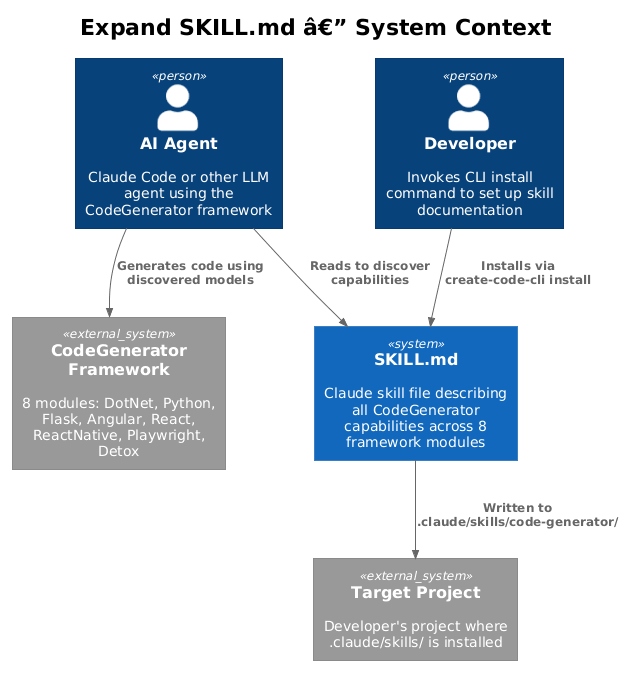
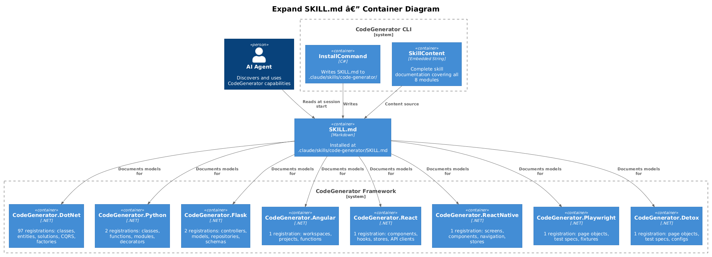
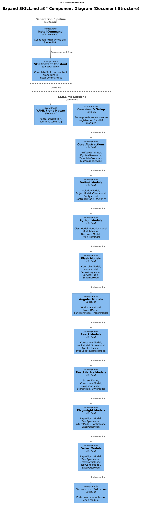
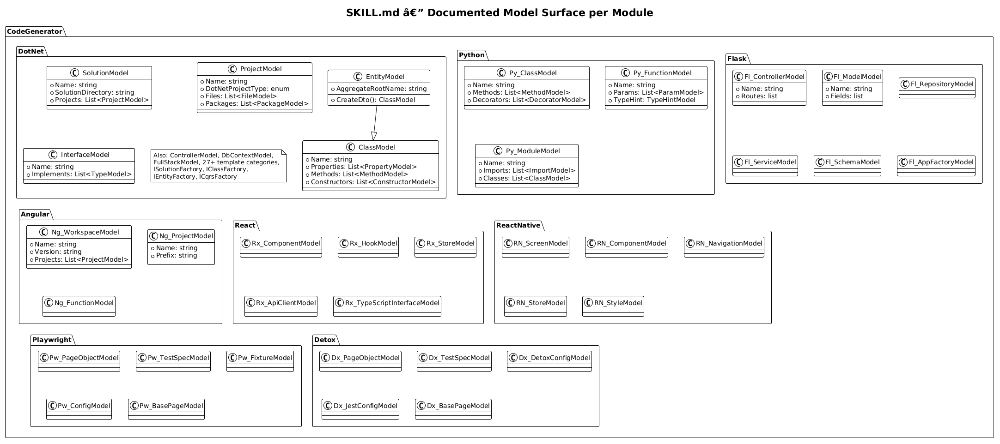
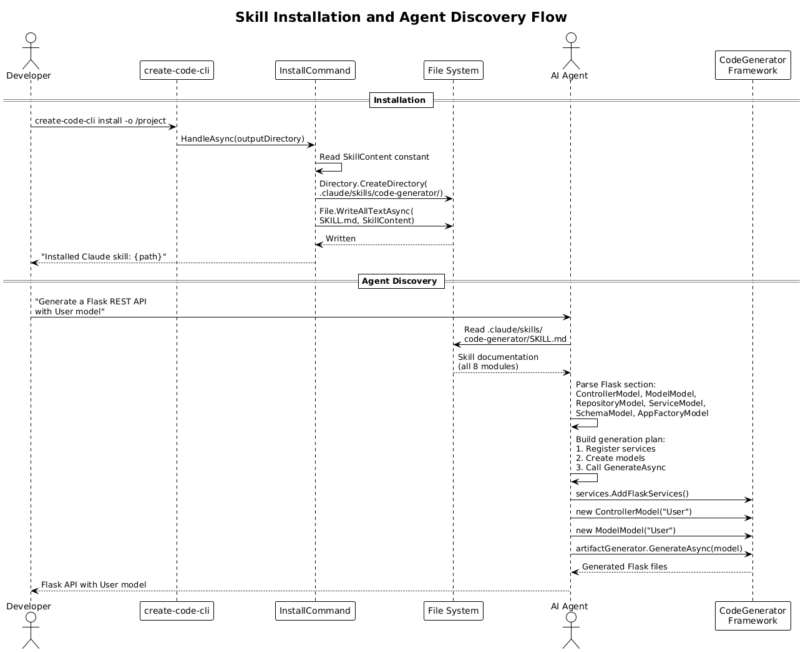

# Expand SKILL.md Documentation — Detailed Design

**Feature:** 14-expand-skill-documentation
**Status:** Implemented
**Priority Action:** #4 from Architecture Audit — "Expand SKILL.md"

---

## 1. Overview

The CodeGenerator framework contains 8 language/framework modules (DotNet, Python, Flask, Angular, React, ReactNative, Playwright, Detox) with 105+ DI registrations. The current SKILL.md file — installed by `create-code-cli install` — documents only the DotNet and Angular modules. An AI agent cannot use what it does not know exists. The remaining 6 modules (Python, Flask, React, ReactNative, Playwright, Detox) are invisible to any agent relying on the skill file for capability discovery.

### Purpose

Expand SKILL.md to comprehensively document all 8 framework modules so that an AI agent can discover and correctly use every model, factory, and service registration in the framework.

### Actors

| Actor | Description |
|-------|-------------|
| **AI Agent** | Claude Code or other LLM that reads SKILL.md to discover CodeGenerator capabilities |
| **Developer** | Runs `create-code-cli install` to deploy the skill file into a project |
| **Maintainer** | Updates SKILL.md content in `InstallCommand.cs` when models change |

### Scope

This design covers:
- The expanded content and structure of SKILL.md
- Per-module documentation templates
- The install pipeline (how the skill file is generated and deployed)
- Agent discovery patterns (how agents find and use the documentation)

Out of scope: runtime code changes to the framework modules themselves.

---

## 2. Architecture

### 2.1 C4 Context Diagram

Shows how the AI agent, developer, skill file, and framework interact.



### 2.2 C4 Container Diagram

The CLI, embedded skill content, installed file, and the 8 framework modules.



### 2.3 C4 Component Diagram

Internal structure of SKILL.md sections and the generation pipeline.



---

## 3. Component Details

### 3.1 SKILL.md Overall Structure

The expanded SKILL.md follows this section order:

| # | Section | Purpose |
|---|---------|---------|
| 0 | YAML Front Matter | `name`, `description`, `user-invocable` metadata |
| 1 | Overview | One-paragraph description of the framework |
| 2 | Package References | NuGet package XML for all 8 modules |
| 3 | Service Registration | `Add*Services()` calls for all 8 modules |
| 4 | Core Abstractions | `IArtifactGenerator`, `ISyntaxGenerator`, `ITemplateProcessor`, `ICommandService` |
| 5 | DotNet Models | Full existing DotNet section (SolutionModel through factories) |
| 6 | Python Models | ClassModel, FunctionModel, MethodModel, ModuleModel, ImportModel, DecoratorModel, TypeHintModel, ProjectModel |
| 7 | Flask Models | ControllerModel, ModelModel, RepositoryModel, ServiceModel, SchemaModel, MiddlewareModel, AppFactoryModel, ProjectModel |
| 8 | Angular Models | Existing Angular section (WorkspaceModel, ProjectModel, FunctionModel, ImportModel) |
| 9 | React Models | ComponentModel, HookModel, StoreModel, ApiClientModel, TypeScriptInterfaceModel, ProjectModel |
| 10 | ReactNative Models | ScreenModel, ComponentModel, NavigationModel, StoreModel, StyleModel, ProjectModel |
| 11 | Playwright Models | PageObjectModel, TestSpecModel, FixtureModel, ConfigModel, BasePageModel, ProjectModel |
| 12 | Detox Models | PageObjectModel, TestSpecModel, DetoxConfigModel, JestConfigModel, BasePageModel, ProjectModel |
| 13 | Generation Patterns | End-to-end examples per module |

### 3.2 YAML Front Matter

The `description` field must be updated to reflect all 8 modules:

```yaml
---
name: code-generator
description: Generate code using CodeGenerator — DotNet, Python, Flask, Angular, React, ReactNative, Playwright, and Detox modules
user-invocable: true
---
```

### 3.3 Service Registration Section

Must document all 8 registration methods so agents know how to wire up DI:

```csharp
services.AddCoreServices(typeof(Program).Assembly);
services.AddDotNetServices();
services.AddAngularServices();
services.AddPythonServices();
services.AddFlaskServices();
services.AddReactServices();
services.AddReactNativeServices();
services.AddPlaywrightServices();
services.AddDetoxServices();
```

### 3.4 Per-Module Section Content

Each module section must document every model with:
1. **Namespace** — the `using` statement
2. **Constructor** — how to instantiate the model
3. **Key Properties** — the properties the agent must set to produce useful output
4. **Usage Example** — a complete code block showing model creation
5. **Generated Output Snippet** — what the generated file looks like (where applicable)

### 3.5 Embedding in InstallCommand.cs

The entire SKILL.md content lives as a `const string SkillContent` in `src/CodeGenerator.Cli/Commands/InstallCommand.cs`. The install handler writes it verbatim to disk:

```
.claude/skills/code-generator/SKILL.md
```

Because the content is a C# verbatim string (`@"..."`), all double quotes in the Markdown must be escaped as `""`.

---

## 4. Documentation Strategy

### 4.1 Model Documentation Template

Every model documented in SKILL.md must follow this standardized template:

```markdown
### {ModelName}

{One-sentence purpose.}

\```{language}
using {Namespace};

var model = new {ModelName}({constructor args});
// Key properties:
//   model.{Prop1}  -> {description}
//   model.{Prop2}  -> {description}
//   ...
\```
```

For models with many properties, group them with inline comments. For models that generate files, include a brief "Generates:" comment showing the output shape.

### 4.2 What to Include per Model

| Element | Include? | Rationale |
|---------|----------|-----------|
| Namespace / `using` | Yes | Agent must know the import |
| Constructor signature | Yes | Agent must know required args |
| Key properties (settable) | Yes | Agent must know what to configure |
| Read-only / computed properties | Only if path-like | Agents need to know output paths |
| Methods (public API) | Yes, if model has builder methods | e.g., `CreateDto()`, `AddMethod()` |
| Inheritance | Only if it affects usage | e.g., EntityModel extends ClassModel |
| Generated output snippet | Yes, for leaf models | Helps agent verify correctness |
| Internal/private members | No | Not useful for agent consumers |

### 4.3 What to Include per Factory

| Element | Include? | Rationale |
|---------|----------|-----------|
| Interface name | Yes | Agent resolves from DI by interface |
| Namespace / `using` | Yes | Agent must know the import |
| Factory methods | Yes, with signatures | Agent must know available creation methods |
| Return type | Yes | Agent must know what it gets back |
| DI resolution example | Yes | Show `GetRequiredService<IFactory>()` pattern |

### 4.4 Module-Specific Documentation Requirements

#### DotNet (97 registrations)
- Already documented: SolutionModel, ProjectModel, ClassModel, EntityModel, InterfaceModel, MethodModel, PropertyModel, FieldModel, ConstructorModel, TypeModel, ContentFileModel, CodeFileModel, factories
- Still needed: ControllerModel, DbContextModel, FullStackModel, template categories (27+ embedded Liquid templates), IEntityFactory, IControllerFactory, additional ICqrsFactory methods

#### Python (2 registrations)
- Document all syntax models: ClassModel, FunctionModel, MethodModel, ModuleModel, ImportModel, DecoratorModel, TypeHintModel, ParamModel, PropertyModel
- Document ProjectModel artifact
- Show end-to-end example: create a Python module with a class, decorators, and type hints

#### Flask (2 registrations)
- Document all syntax models: ControllerModel, ModelModel (SQLAlchemy), RepositoryModel, BaseRepositoryModel, ServiceModel, SchemaModel (Marshmallow), MiddlewareModel, AppFactoryModel, ConfigModel, DockerfileModel, EnvModel, TestModel, ImportModel
- Show end-to-end example: create a Flask REST API with model, controller, and repository

#### Angular (1 registration)
- Already documented: WorkspaceModel, ProjectModel, FunctionModel, ImportModel
- Verify completeness; add TypeScriptTypeModel if present in source

#### React (1 registration)
- Document: ComponentModel, HookModel, StoreModel (Zustand), ApiClientModel, TypeScriptInterfaceModel, TypeScriptTypeModel, FunctionModel, ImportModel, PropertyModel, DockerfileModel, EnvModel, TestModel, WorkspaceModel, ProjectModel
- Show end-to-end example: create a React component with a hook and store

#### ReactNative (1 registration)
- Document: ScreenModel, ComponentModel, NavigationModel, StoreModel, StyleModel, HookModel, ImportModel, PropertyModel, TypeScriptTypeModel, ProjectModel
- Show end-to-end example: create a screen with navigation and store

#### Playwright (1 registration)
- Document: PageObjectModel, TestSpecModel, FixtureModel, ConfigModel, BasePageModel, LocatorModel, ImportModel, PropertyModel, ProjectModel
- Show end-to-end example: create a page object with locators and a test spec

#### Detox (1 registration)
- Document: PageObjectModel, TestSpecModel, DetoxConfigModel, JestConfigModel, BasePageModel, ImportModel, PropertyModel, ProjectModel
- Show end-to-end example: create a Detox page object and test spec

---

## 5. Data Model

### 5.1 Model Surface per Module



### 5.2 Model Counts

| Module | Syntax Models | Artifact Models | Factories | Total Surfaces to Document |
|--------|--------------|-----------------|-----------|---------------------------|
| DotNet | 15+ | 8+ | 6+ | ~30 |
| Python | 8 | 1 | 0 | 9 |
| Flask | 13 | 1 | 0 | 14 |
| Angular | 3 | 2 | 0 | 5 |
| React | 11 | 3 | 0 | 14 |
| ReactNative | 8 | 2 | 0 | 10 |
| Playwright | 7 | 1 | 0 | 8 |
| Detox | 6 | 1 | 0 | 7 |
| **Total** | **71+** | **19+** | **6+** | **~97** |

---

## 6. Key Workflows

### 6.1 Skill Installation Flow

The developer runs the CLI install command, which writes the complete SKILL.md to disk. The agent reads it at session start.



**Steps:**
1. Developer runs `create-code-cli install -o /path/to/project`.
2. `InstallCommand.HandleAsync` computes the skill directory: `{outputDir}/.claude/skills/code-generator/`.
3. `Directory.CreateDirectory` ensures the path exists.
4. `File.WriteAllTextAsync` writes the `SkillContent` constant to `SKILL.md`.
5. Logger confirms installation.

### 6.2 Agent Discovery Flow

1. Agent session starts. Claude Code reads `.claude/skills/code-generator/SKILL.md`.
2. Agent parses the YAML front matter to identify this as the `code-generator` skill.
3. When the user requests code generation, the agent searches the skill file for the relevant module section.
4. The agent reads model constructors, properties, and usage examples.
5. The agent writes code that instantiates models and calls `IArtifactGenerator.GenerateAsync()`.

### 6.3 Skill Content Update Flow (Maintainer)

1. Maintainer modifies a model class in a framework module (e.g., adds a property to `FlaskControllerModel`).
2. Maintainer updates the `SkillContent` constant in `src/CodeGenerator.Cli/Commands/InstallCommand.cs`.
3. Maintainer rebuilds and publishes the `create-code-cli` tool.
4. Developers re-run `create-code-cli install` to get the updated skill file.

---

## 7. Template Design

### 7.1 Standard Model Entry

Every model entry in SKILL.md follows this format:

```
### {ModelName}

{One-sentence description of what this model represents.}

\```csharp
using {Full.Namespace};

var model = new {ModelName}({required constructor parameters});
// Key properties:
//   model.Property1  -> "{description or default value}"
//   model.Property2  -> "{description or default value}"
\```
```

### 7.2 Standard Factory Entry

```
### I{Name}Factory

\```csharp
using {Full.Namespace};

var factory = serviceProvider.GetRequiredService<I{Name}Factory>();
var result = await factory.Create{Method}({parameters});
// Returns: {ReturnType}
\```
```

### 7.3 Standard End-to-End Example

Each module section ends with a complete generation pattern:

```
## {Module} Generation Pattern

\```csharp
// 1. Register services
services.AddCoreServices(typeof(Program).Assembly);
services.Add{Module}Services();

// 2. Create models
var model = new {TopLevelModel}({args});
// ... configure model ...

// 3. Generate
await artifactGenerator.GenerateAsync(model);
\```
```

### 7.4 Section Header Convention

Each module section uses an H2 header with the module name:

```
## Python Models
## Flask Models
## React Models
## ReactNative Models
## Playwright Models
## Detox Models
```

This keeps the table of contents scannable for both agents and humans.

---

## 8. Implementation Plan

### Phase 1: Source Audit (read-only)

For each of the 6 undocumented modules, read every `*Model.cs` file under `Syntax/` and `Artifacts/` to catalog:
- Constructor parameters
- Public properties (name, type, default)
- Public methods
- Inheritance relationships

### Phase 2: Draft Module Sections

Write documentation for each module following the template in Section 7. The order of modules in SKILL.md should match the NuGet package listing:

1. DotNet (expand existing)
2. Python (new)
3. Flask (new)
4. Angular (existing, verify)
5. React (new)
6. ReactNative (new)
7. Playwright (new)
8. Detox (new)

### Phase 3: Update InstallCommand.cs

Replace the `SkillContent` constant in `src/CodeGenerator.Cli/Commands/InstallCommand.cs` with the expanded content. Remember to escape all `"` as `""` within the verbatim string.

### Phase 4: Update Package References and Service Registration

Expand the Package References section to list all 8 NuGet packages. Expand the Service Registration section to show all 8 `Add*Services()` calls.

### Phase 5: Validation

- Verify every `*Model.cs` in the source has a corresponding entry in SKILL.md.
- Verify every `Add*Services()` method is documented.
- Verify all code examples compile against current APIs.
- Re-run `create-code-cli install` and confirm the output.

---

## 9. Size Considerations

The current SKILL.md is approximately 430 lines / 14 KB. The expanded version is estimated at:

| Module | Estimated Lines |
|--------|----------------|
| Header + Setup | 80 |
| Core Abstractions | 60 |
| DotNet (existing + expansion) | 350 |
| Python | 120 |
| Flask | 160 |
| Angular (existing) | 60 |
| React | 140 |
| ReactNative | 120 |
| Playwright | 100 |
| Detox | 90 |
| Generation Patterns | 120 |
| **Total** | **~1,400 lines** |

This is well within the size limits for a Claude skill file. Agents benefit from comprehensive documentation; there is no practical penalty for a larger skill file.

---

## 10. Security Considerations

| Concern | Mitigation |
|---------|------------|
| **Sensitive paths in examples** | All examples use placeholder paths like `outputDirectory`, never real system paths |
| **API keys / secrets** | SKILL.md contains no secrets; it documents public API surfaces only |
| **String injection in SkillContent** | The content is a compile-time constant, not user-supplied input |

---

## 11. Open Questions

| # | Question | Context |
|---|----------|---------|
| 1 | Should SKILL.md be split into per-module files (e.g., `SKILL-dotnet.md`, `SKILL-flask.md`) to reduce context window usage for agents that only need one module? | A single file is simpler to install and maintain, but a large file consumes tokens even when only one module is relevant. |
| 2 | Should the install command dynamically generate SKILL.md from source reflection instead of maintaining a static string? | Reflection-based generation would stay in sync automatically but adds complexity and may produce less polished documentation. |
| 3 | Should generated output snippets (showing what the generated file looks like) be included for every model, or only for the most complex ones? | Output snippets help agents verify correctness but increase file size. |
| 4 | Should the YAML front matter include a `version` field to help agents detect stale skill files? | Would help agents warn developers when their skill file is outdated. |
| 5 | How should DotNet template categories (27+ embedded Liquid templates) be documented — exhaustive list, or grouped by purpose (CQRS, DDD, API, etc.)? | Exhaustive is more discoverable; grouped is more scannable. |
