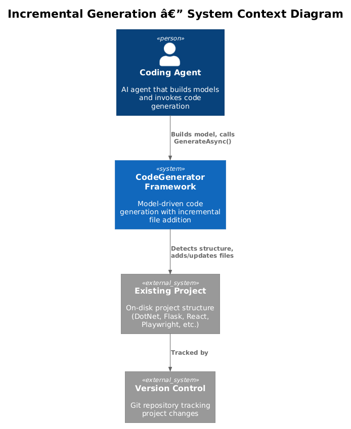
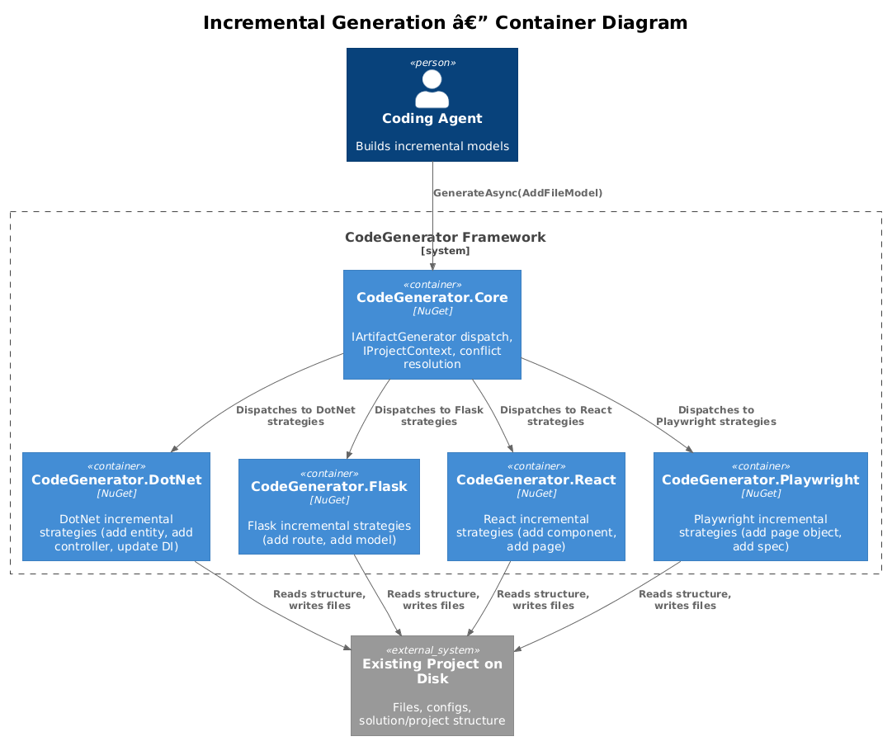
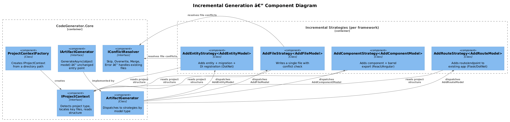
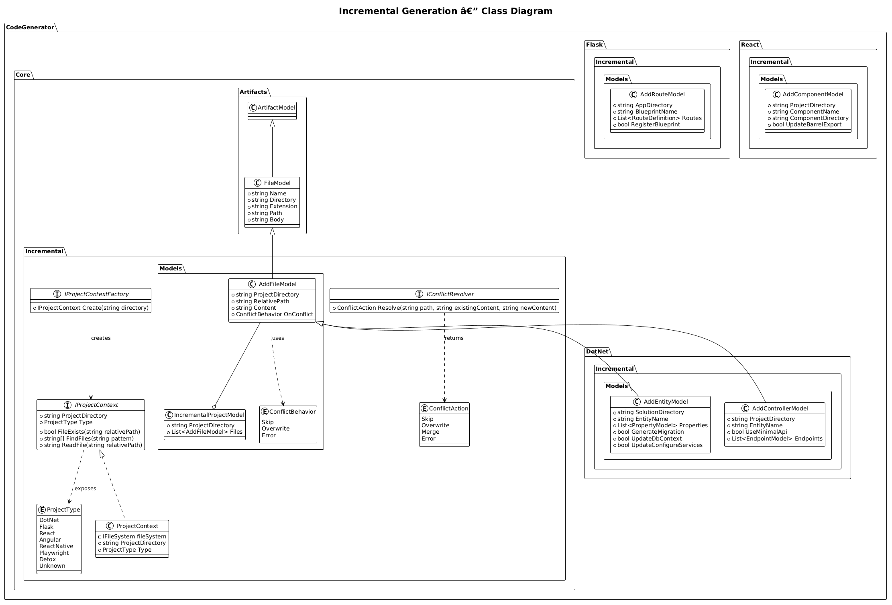
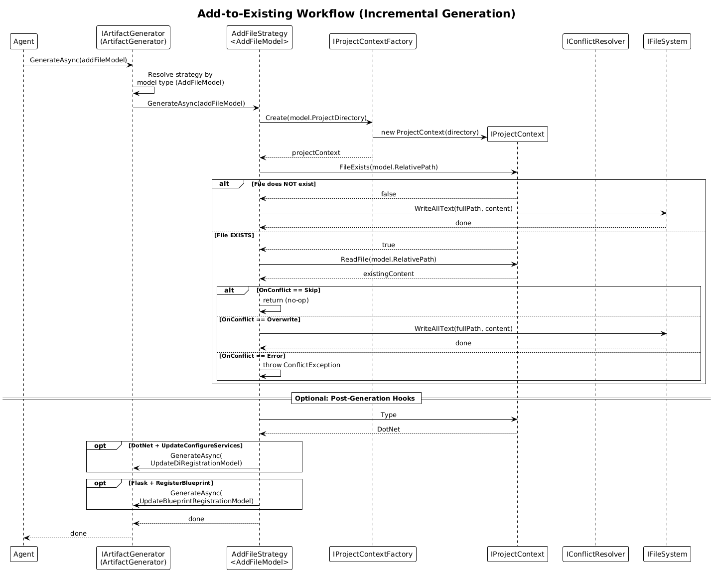

# Incremental Generation — Detailed Design

**Feature:** 15-incremental-generation
**Status:** Draft
**Requirements:** Architecture Audit Priority Action #5 — "Add incremental generation"
**Prerequisites:** None (can be implemented on current Core; benefits from #1 Extract Abstractions if done first)

---

## 1. Overview

### Problem Statement

The CodeGenerator framework is currently optimized for full project scaffolding — "create a brand new project from scratch." However, the most frequent real-world agent workflow is **adding a single artifact to an existing project**: a new endpoint, a new model class, a new test file, a new component.

Today there is no general-purpose API for this. An agent that needs to add a controller to an existing Flask app must either:

1. Write the file manually (no token savings from the generator), or
2. Re-scaffold the entire project (destructive, impractical)

### Existing Partial Support

DotNet has limited incremental support:

- `DependencyInjectionService.Add()` — appends a service registration to an existing `ConfigureServices.cs`
- `ApiProjectEnsureArtifactGenerationStrategy` — checks for existing files before writing, installs missing packages, adds project references

These patterns work but are ad-hoc and not generalized across frameworks.

### Goal

Add an **incremental mode** to the framework where models can target an existing project directory. Strategies detect the existing structure and add files without re-scaffolding. This applies across all seven framework modules.

### Scaffolding vs. Incremental — Side by Side

| Aspect | Scaffolding (current) | Incremental (new) |
|---|---|---|
| **Input** | Full project model (name, entities, config) | Single-file or single-entity model + target directory |
| **Output** | Complete project on disk | One or more new files + targeted updates to existing files |
| **Prerequisite** | Empty or non-existent directory | Existing project with known structure |
| **Shell commands** | `dotnet new`, `npm init`, `pip install`, etc. | `dotnet add package`, `dotnet ef migrations add`, etc. (only when needed) |
| **Conflict risk** | None (fresh directory) | Must handle existing files |
| **Token cost for agent** | High (full project model) | Low (single file/entity model) |

---

## 2. Architecture

### 2.1 C4 Context Diagram

Shows how an agent interacts with the CodeGenerator framework to add files to an existing project.



### 2.2 C4 Container Diagram

How incremental generation fits into the existing package structure. Each framework package gains incremental strategies alongside its existing scaffolding strategies.



### 2.3 C4 Component Diagram

The new components introduced for incremental generation: `IProjectContext` for detecting existing structure, `IConflictResolver` for handling file collisions, and per-framework incremental strategies.



---

## 3. Component Details

### 3.1 IProjectContext

**Package:** `CodeGenerator.Core.Incremental`
**Responsibility:** Provide a read-only view of an existing project's structure so that incremental strategies can make informed decisions about where to place files and what registrations to update.

**Interface:**

```csharp
public interface IProjectContext
{
    string ProjectDirectory { get; }
    ProjectType Type { get; }
    bool FileExists(string relativePath);
    string[] FindFiles(string pattern);
    string ReadFile(string relativePath);
}
```

**Key behaviors:**

- `Type` is detected by scanning for marker files: `*.csproj`/`*.sln` = DotNet, `app.py`/`wsgi.py` = Flask, `package.json` with `react` dependency = React, `playwright.config.ts` = Playwright, etc.
- `FindFiles` wraps `Directory.GetFiles` with the project directory as root, returning relative paths.
- `ReadFile` returns file content as a string for strategies that need to parse existing code (e.g., to find where to insert a DI registration).

**Why not reuse `IFileProvider`?** The existing `IFileProvider` has a single method `Get(searchPattern, directory, depth)` that returns a single string. `IProjectContext` provides a richer, project-scoped API. `IProjectContext` implementations may delegate to `IFileProvider` internally.

### 3.2 IProjectContextFactory

**Package:** `CodeGenerator.Core.Incremental`
**Responsibility:** Create an `IProjectContext` from a directory path. Registered as a singleton in DI.

```csharp
public interface IProjectContextFactory
{
    IProjectContext Create(string directory);
}
```

The factory scans the target directory for marker files and returns a `ProjectContext` with the correct `ProjectType`. If no known project type is detected, `ProjectType.Unknown` is returned and strategies can still operate on raw file paths.

### 3.3 IConflictResolver

**Package:** `CodeGenerator.Core.Incremental`
**Responsibility:** Decide what to do when an incremental strategy needs to write a file that already exists.

```csharp
public interface IConflictResolver
{
    ConflictAction Resolve(string path, string existingContent, string newContent);
}
```

**Default implementation:** `DefaultConflictResolver` delegates to the `ConflictBehavior` property on the model:

| ConflictBehavior | Action |
|---|---|
| `Skip` | Return `ConflictAction.Skip` — do not write |
| `Overwrite` | Return `ConflictAction.Overwrite` — replace file |
| `Error` | Return `ConflictAction.Error` — throw `FileConflictException` |

**Extensibility:** Custom `IConflictResolver` implementations can be registered to support merge strategies (e.g., appending routes to an existing Flask blueprint file rather than replacing it).

### 3.4 Incremental Strategies

Incremental strategies are standard `IArtifactGenerationStrategy<T>` implementations. They differ from scaffolding strategies in that they:

1. Accept models that include a `ProjectDirectory` pointing to an existing project
2. Use `IProjectContext` to read existing structure before writing
3. Use `IConflictResolver` to handle file collisions
4. May trigger follow-up `GenerateAsync` calls for registration updates

**Framework-specific incremental strategies:**

| Framework | Strategy | Model | Behavior |
|---|---|---|---|
| **Core** | `AddFileStrategy` | `AddFileModel` | Write a single file with conflict resolution |
| **DotNet** | `AddEntityStrategy` | `AddEntityModel` | Generate entity class, update DbContext, add migration, update ConfigureServices |
| **DotNet** | `AddControllerStrategy` | `AddControllerModel` | Generate controller/minimal API endpoint, update DI |
| **Flask** | `AddRouteStrategy` | `AddRouteModel` | Generate blueprint file, register with Flask app |
| **React** | `AddComponentStrategy` | `AddComponentModel` | Generate component file, update barrel export (index.ts) |
| **Angular** | `AddComponentStrategy` | `AddAngularComponentModel` | Generate component + template + spec, update module declarations |
| **Playwright** | `AddPageObjectStrategy` | `AddPageObjectModel` | Generate page object class, update fixtures |
| **Detox** | `AddTestStrategy` | `AddDetoxTestModel` | Generate test file in correct describe block |

### 3.5 AddFileStrategy (Core)

The simplest incremental strategy. It serves as both a usable strategy for raw file addition and a reference implementation for framework-specific strategies.

**Flow:**

1. Receive `AddFileModel` with `ProjectDirectory`, `RelativePath`, `Content`, `OnConflict`
2. Create `IProjectContext` via factory
3. Check if file exists at `RelativePath`
4. If no conflict, write file
5. If conflict, delegate to `IConflictResolver`
6. Log result

This strategy has `GetPriority() => 0` so that framework-specific strategies (which return higher priorities) take precedence when they can handle the model.

---

## 4. Data Model

### 4.1 Class Diagram



### 4.2 Core Models

#### AddFileModel

The fundamental incremental model. All framework-specific incremental models extend this.

```csharp
namespace CodeGenerator.Core.Incremental.Models;

public class AddFileModel : FileModel
{
    public AddFileModel(
        string projectDirectory,
        string relativePath,
        string content,
        ConflictBehavior onConflict = ConflictBehavior.Error)
        : base(
            Path.GetFileNameWithoutExtension(relativePath),
            Path.Combine(projectDirectory, Path.GetDirectoryName(relativePath) ?? ""),
            Path.GetExtension(relativePath))
    {
        ProjectDirectory = projectDirectory;
        RelativePath = relativePath;
        Content = content;
        OnConflict = onConflict;
    }

    public string ProjectDirectory { get; }
    public string RelativePath { get; }
    public string Content { get; }
    public ConflictBehavior OnConflict { get; }
}
```

#### IncrementalProjectModel

Batches multiple file additions into a single generation call.

```csharp
namespace CodeGenerator.Core.Incremental.Models;

public class IncrementalProjectModel
{
    public string ProjectDirectory { get; set; }
    public List<AddFileModel> Files { get; set; } = [];
}
```

### 4.3 DotNet Incremental Models

#### AddEntityModel

```csharp
namespace CodeGenerator.DotNet.Incremental.Models;

public class AddEntityModel : AddFileModel
{
    public string SolutionDirectory { get; set; }
    public string EntityName { get; set; }
    public List<PropertyModel> Properties { get; set; } = [];
    public bool GenerateMigration { get; set; } = true;
    public bool UpdateDbContext { get; set; } = true;
    public bool UpdateConfigureServices { get; set; } = true;
}
```

**Generated outputs:**

1. `{CoreProject}/Models/{EntityName}.cs` — entity class
2. `{CoreProject}/Models/{EntityName}Dto.cs` — DTO class
3. `{InfraProject}/Data/{DbContext}.cs` — updated with new `DbSet<>`
4. `{InfraProject}/Migrations/...` — EF migration (via `dotnet ef migrations add`)
5. `{ApiProject}/ConfigureServices.cs` — updated DI registration

#### AddControllerModel

```csharp
namespace CodeGenerator.DotNet.Incremental.Models;

public class AddControllerModel : AddFileModel
{
    public string EntityName { get; set; }
    public bool UseMinimalApi { get; set; }
    public List<EndpointModel> Endpoints { get; set; } = [];
}
```

### 4.4 Flask Incremental Models

#### AddRouteModel

```csharp
namespace CodeGenerator.Flask.Incremental.Models;

public class AddRouteModel
{
    public string AppDirectory { get; set; }
    public string BlueprintName { get; set; }
    public List<RouteDefinition> Routes { get; set; } = [];
    public bool RegisterBlueprint { get; set; } = true;
}
```

**Generated outputs:**

1. `{AppDirectory}/routes/{blueprint_name}.py` — blueprint file with route handlers
2. `{AppDirectory}/app.py` — updated to register the new blueprint (if `RegisterBlueprint` is true)

### 4.5 React / Angular Incremental Models

#### AddComponentModel

```csharp
namespace CodeGenerator.React.Incremental.Models;

public class AddComponentModel
{
    public string ProjectDirectory { get; set; }
    public string ComponentName { get; set; }
    public string ComponentDirectory { get; set; }
    public bool UpdateBarrelExport { get; set; } = true;
}
```

**Generated outputs:**

1. `{ComponentDirectory}/{ComponentName}.tsx` — component file
2. `{ComponentDirectory}/index.ts` — barrel export updated (if `UpdateBarrelExport` is true)

---

## 5. Key Workflows

### 5.1 Add a Single File (Any Framework)



**Steps:**

1. Agent constructs `AddFileModel` with target `ProjectDirectory`, `RelativePath`, and `Content`
2. Agent calls `IArtifactGenerator.GenerateAsync(addFileModel)`
3. `ArtifactGenerator` dispatches to `AddFileStrategy` (or a higher-priority framework-specific strategy)
4. Strategy creates `IProjectContext` to inspect the target directory
5. Strategy checks if file already exists at `RelativePath`
6. If no conflict: write file to disk
7. If conflict: apply `OnConflict` behavior (Skip, Overwrite, or Error)

### 5.2 Add an Entity to Existing DotNet Solution

**Steps:**

1. Agent constructs `AddEntityModel` with `SolutionDirectory`, `EntityName`, `Properties`
2. Agent calls `IArtifactGenerator.GenerateAsync(addEntityModel)`
3. `AddEntityStrategy` creates `IProjectContext` for the solution directory
4. Strategy locates the Core project (by convention: `{Name}.Core.csproj`)
5. Strategy generates entity class using existing `ISyntaxGenerator` with a `ClassModel`
6. Strategy generates DTO class
7. Strategy locates the Infrastructure project and its `DbContext` file
8. Strategy reads `DbContext`, appends `public DbSet<Entity> Entities { get; set; }` property
9. If `GenerateMigration`: runs `dotnet ef migrations add Add{EntityName}` via `ICommandService`
10. If `UpdateConfigureServices`: delegates to existing `DependencyInjectionService.Add()` for any new service registrations
11. Strategy locates the API project
12. Optionally generates a controller or minimal API endpoint

### 5.3 Add a Route to Existing Flask App

**Steps:**

1. Agent constructs `AddRouteModel` with `AppDirectory`, `BlueprintName`, `Routes`
2. Agent calls `IArtifactGenerator.GenerateAsync(addRouteModel)`
3. `AddRouteStrategy` creates `IProjectContext` for the app directory
4. Strategy checks if `routes/{blueprint_name}.py` exists
5. If not: generates new blueprint file from template
6. If exists: reads file, appends new route functions before the last line
7. If `RegisterBlueprint`: reads `app.py`, checks if blueprint is already registered, appends `app.register_blueprint()` if missing

### 5.4 Add a Component to Existing React Project

**Steps:**

1. Agent constructs `AddComponentModel` with `ProjectDirectory`, `ComponentName`, `ComponentDirectory`
2. Agent calls `IArtifactGenerator.GenerateAsync(addComponentModel)`
3. `AddComponentStrategy` creates `IProjectContext`
4. Strategy generates `{ComponentName}.tsx` using `ISyntaxGenerator`
5. If `UpdateBarrelExport`: reads or creates `index.ts` in the component directory, appends `export { ComponentName } from './ComponentName';`

---

## 6. API Contracts

### 6.1 Core — Generic File Addition

```csharp
// Add a single file to any project
await generator.GenerateAsync(new AddFileModel(
    projectDirectory: "/path/to/existing/project",
    relativePath: "src/utils/helpers.ts",
    content: "export function formatDate(d: Date): string { ... }",
    onConflict: ConflictBehavior.Skip));

// Batch-add multiple files
await generator.GenerateAsync(new IncrementalProjectModel
{
    ProjectDirectory = "/path/to/existing/project",
    Files = [
        new AddFileModel(...),
        new AddFileModel(...),
    ]
});
```

### 6.2 DotNet — Add Entity

```csharp
await generator.GenerateAsync(new AddEntityModel
{
    SolutionDirectory = "/path/to/solution",
    EntityName = "Product",
    Properties = [
        new PropertyModel { Name = "Name", Type = "string" },
        new PropertyModel { Name = "Price", Type = "decimal" },
    ],
    GenerateMigration = true,
    UpdateDbContext = true,
    UpdateConfigureServices = true
});
```

### 6.3 DotNet — Add Controller

```csharp
await generator.GenerateAsync(new AddControllerModel
{
    ProjectDirectory = "/path/to/api/project",
    EntityName = "Product",
    UseMinimalApi = false,
    Endpoints = [
        new EndpointModel { Method = "GET", Route = "/api/products" },
        new EndpointModel { Method = "POST", Route = "/api/products" },
        new EndpointModel { Method = "GET", Route = "/api/products/{id}" },
    ]
});
```

### 6.4 Flask — Add Route

```csharp
await generator.GenerateAsync(new AddRouteModel
{
    AppDirectory = "/path/to/flask/app",
    BlueprintName = "products",
    Routes = [
        new RouteDefinition { Path = "/products", Methods = ["GET"], HandlerName = "list_products" },
        new RouteDefinition { Path = "/products", Methods = ["POST"], HandlerName = "create_product" },
    ],
    RegisterBlueprint = true
});
```

### 6.5 React — Add Component

```csharp
await generator.GenerateAsync(new AddComponentModel
{
    ProjectDirectory = "/path/to/react/app",
    ComponentName = "ProductCard",
    ComponentDirectory = "src/components/ProductCard",
    UpdateBarrelExport = true
});
```

### 6.6 Playwright — Add Page Object

```csharp
await generator.GenerateAsync(new AddPageObjectModel
{
    ProjectDirectory = "/path/to/playwright/project",
    PageObjectName = "ProductsPage",
    BaseUrl = "/products",
    Selectors = [
        new SelectorModel { Name = "searchInput", Selector = "[data-testid='search']" },
        new SelectorModel { Name = "productList", Selector = ".product-grid" },
    ]
});
```

---

## 7. DI Registration

Incremental services are registered via the existing `AddCoreServices` extension method. No new assembly scanning is needed since incremental strategies implement `IArtifactGenerationStrategy<T>` and are auto-discovered.

New singleton registrations in Core:

```csharp
services.AddSingleton<IProjectContextFactory, ProjectContextFactory>();
services.AddSingleton<IConflictResolver, DefaultConflictResolver>();
```

Framework packages register their own incremental strategies automatically via the existing assembly-scanning mechanism in `ConfigureServices`.

---

## 8. Migration Path from Existing Patterns

### 8.1 DependencyInjectionService

The existing `DependencyInjectionService.Add()` method (which appends to `ConfigureServices.cs`) becomes an internal implementation detail of `AddEntityStrategy` and `AddControllerStrategy`. The public API surface shifts from calling `DependencyInjectionService` directly to passing `UpdateConfigureServices = true` on the model.

### 8.2 ApiProjectEnsureArtifactGenerationStrategy

The existing "Ensure" strategies in DotNet already follow the incremental pattern (check-before-write, install missing packages). These become the reference implementation for the generalized pattern. Over time they can be refactored to use `IProjectContext` instead of direct `IFileSystem`/`IFileProvider` calls.

### 8.3 Backward Compatibility

All existing scaffolding models and strategies remain unchanged. Incremental models are new types, so existing `CanHandle` filters will not match them. No breaking changes.

---

## 9. Open Questions

| # | Question | Options | Recommendation |
|---|---|---|---|
| 1 | **Where should `IProjectContext` live?** | (a) `CodeGenerator.Core.Incremental` namespace in Core, (b) New `CodeGenerator.Abstractions` package | (a) for now; move to Abstractions if/when Priority Action #1 is done |
| 2 | **Should `AddFileModel` extend `FileModel` or be independent?** | (a) Extend `FileModel` to reuse existing file-writing strategies, (b) New base class | (a) — leverages existing `Body`/`Path` infrastructure |
| 3 | **How should merge conflicts be handled for structured files?** | (a) Simple append (current DI service approach), (b) AST-level merge with Roslyn/tree-sitter, (c) Template-based insertion points | (a) for v1, with (c) as a future enhancement |
| 4 | **Should incremental strategies run validation before writing?** | (a) No validation (current behavior), (b) Validate model before generation | (b) — aligns with Priority Action #2 (model validation); incremental models should validate that `ProjectDirectory` exists and has the expected structure |
| 5 | **Should there be a dry-run mode for incremental operations?** | (a) Separate concern (Priority Action #7), (b) Built into incremental from the start | (b) — incremental operations modify existing projects so preview is especially valuable; `AddFileModel.DryRun` returns planned changes without writing |
| 6 | **How to detect project type reliably across OS?** | (a) Marker file heuristics, (b) Explicit `ProjectType` on model | Both — auto-detect by default, allow explicit override via model property |
| 7 | **Should batch operations be transactional?** | (a) Best-effort (write what you can), (b) All-or-nothing with rollback | (a) for v1 — rollback across file writes and shell commands is complex; log failures clearly |
