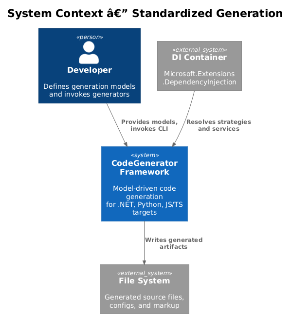
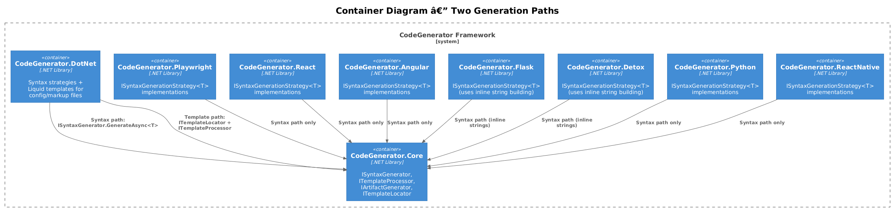
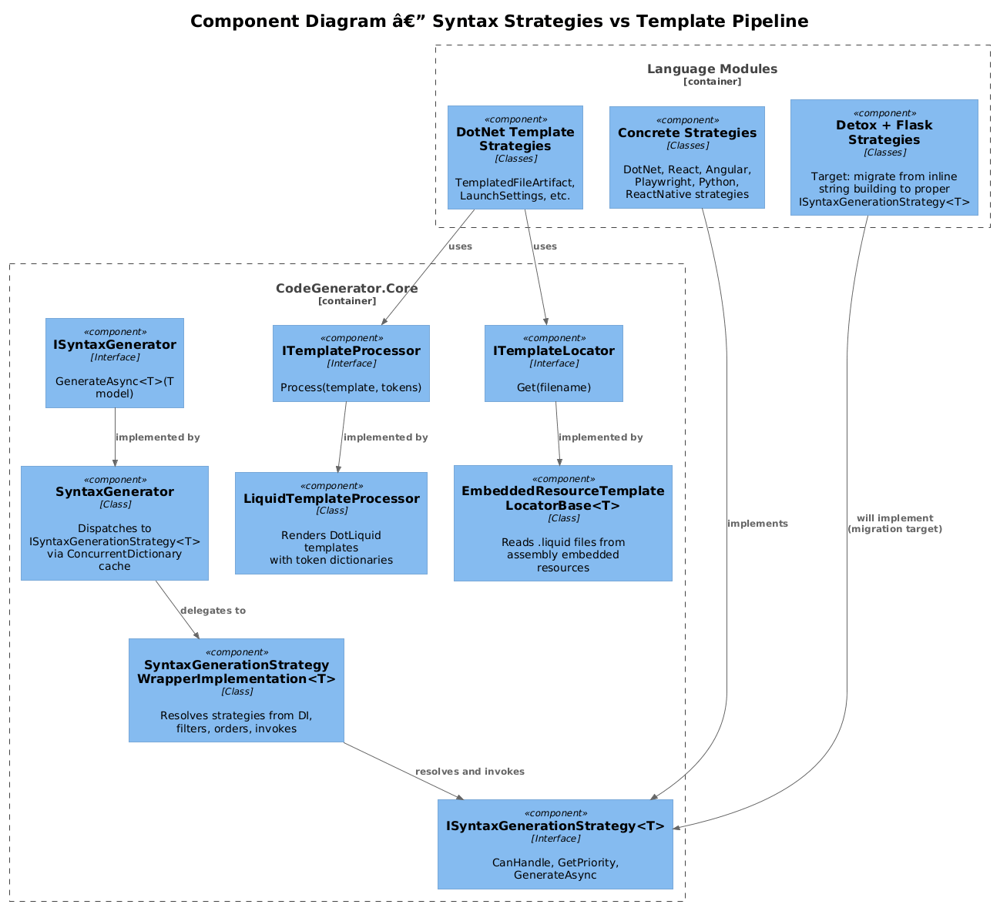
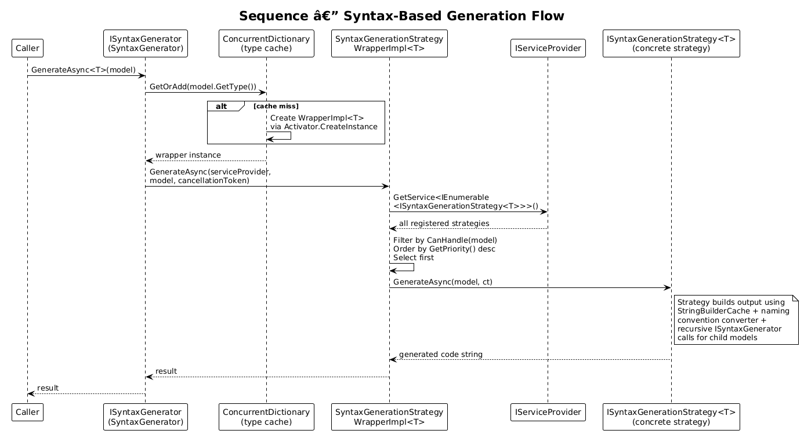
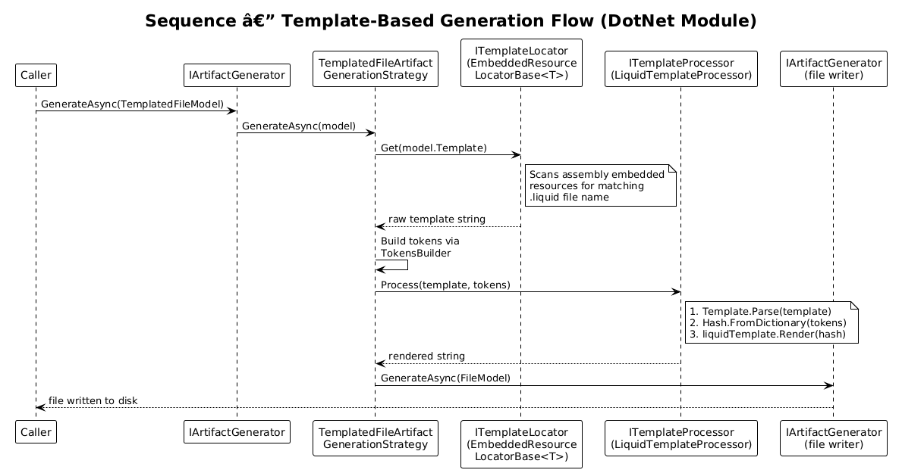
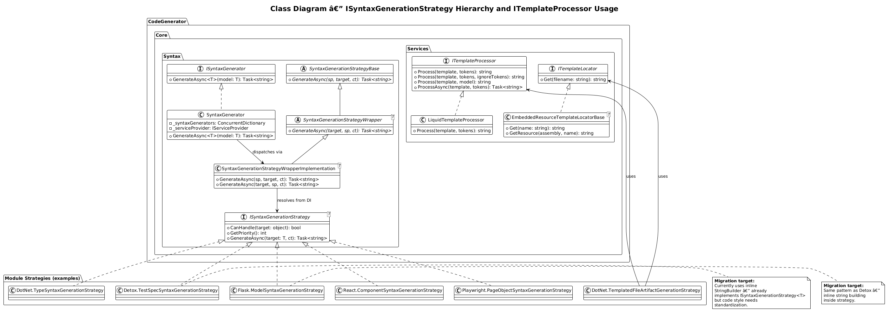

# Standardize Generation Approach — Detailed Design

**Feature:** 16-standardize-generation (Priority Action #6)
**Status:** Draft
**Date:** 2026-04-03

---

## 1. Overview

The CodeGenerator framework currently uses three distinct code-generation techniques across its modules: programmatic syntax strategies (`ISyntaxGenerationStrategy<T>`), DotLiquid template rendering (`ITemplateProcessor` + `ITemplateLocator`), and inline string concatenation (raw `StringBuilder` usage without structured patterns). This inconsistency increases onboarding friction, complicates cross-module refactoring, and makes it difficult to enforce quality standards uniformly.

### Goal

Standardize on exactly **two** generation approaches:

1. **Syntax strategies** (`ISyntaxGenerator` / `ISyntaxGenerationStrategy<T>`) for all source code generation — programmatic, composable, testable.
2. **Liquid templates** (`ITemplateProcessor` / `ITemplateLocator` / `EmbeddedResourceTemplateLocatorBase<T>`) for configuration files, markup, and other declarative artifacts that benefit from non-developer editability.

Eliminate ad-hoc inline string building by migrating Detox and Flask strategies to use the established `ISyntaxGenerationStrategy<T>` pattern with `StringBuilderCache`, `INamingConventionConverter`, and recursive `ISyntaxGenerator` calls for child models.

### Actors

| Actor | Description |
|-------|-------------|
| **Framework Developer** | Implements new `ISyntaxGenerationStrategy<T>` or template-based strategies |
| **Module Maintainer** | Migrates existing inline string building to the standardized pattern |
| **Host Application** | CLI or service that registers services and invokes generators |

### Scope

This design covers:
- Decision criteria for choosing syntax strategies vs. Liquid templates
- Current state audit of all modules
- Migration plan for Detox and Flask modules
- Standardized coding patterns for strategy implementations

Out of scope: changes to the Core dispatch engine itself (`SyntaxGenerator`, `ArtifactGenerator`), new template engine integrations, or changes to the DI registration patterns.

---

## 2. Architecture

### 2.1 C4 Context Diagram

Shows the CodeGenerator framework in its system landscape.



### 2.2 C4 Container Diagram

The two generation paths (syntax and template) across all modules.



### 2.3 C4 Component Diagram

Internal components: syntax strategy dispatch vs. template rendering pipeline.



---

## 3. Component Details

### 3.1 Decision Matrix — When to Use Each Approach

| Criterion | Syntax Strategy | Liquid Template |
|-----------|----------------|-----------------|
| **Output type** | Source code (.cs, .ts, .py, .tsx, .jsx) | Config/markup (.json, .xml, .yaml, .csproj, .html) |
| **Logic complexity** | High — conditionals, loops, recursive composition | Low — token substitution, simple loops |
| **Composability** | Strategies call `ISyntaxGenerator.GenerateAsync` for child models | Templates use Liquid `` and `` |
| **Testability** | Unit-test each strategy with model input/string output | Test template + tokens = expected output |
| **Editability** | Requires C# knowledge | Non-developers can edit `.liquid` files |
| **Naming conventions** | Uses `INamingConventionConverter` programmatically | Tokens pre-computed by `TokensBuilder` |
| **Performance** | Direct string building via `StringBuilderCache` | DotLiquid parse + render overhead |
| **When to prefer** | Code with branching logic, type-dependent output, nested structures | Static structure with variable placeholders |

**Rule of thumb:** If the output requires more than 2 conditional branches or recursive sub-generation, use a syntax strategy. If it is mostly static text with token holes, use a Liquid template.

### 3.2 Syntax Strategy Standard Pattern

Every syntax strategy implementation MUST follow this pattern:

```csharp
public class ExampleSyntaxGenerationStrategy : ISyntaxGenerationStrategy<ExampleModel>
{
    private readonly ILogger<ExampleSyntaxGenerationStrategy> logger;
    private readonly INamingConventionConverter namingConventionConverter;
    private readonly ISyntaxGenerator syntaxGenerator;

    public ExampleSyntaxGenerationStrategy(
        ISyntaxGenerator syntaxGenerator,
        INamingConventionConverter namingConventionConverter,
        ILogger<ExampleSyntaxGenerationStrategy> logger)
    {
        this.logger = logger ?? throw new ArgumentNullException(nameof(logger));
        this.namingConventionConverter = namingConventionConverter
            ?? throw new ArgumentNullException(nameof(namingConventionConverter));
        this.syntaxGenerator = syntaxGenerator
            ?? throw new ArgumentNullException(nameof(syntaxGenerator));
    }

    public async Task<string> GenerateAsync(
        ExampleModel model, CancellationToken cancellationToken)
    {
        logger.LogInformation("Generating syntax for {0}.", model);

        var builder = StringBuilderCache.Acquire();

        // 1. Imports — delegate to ISyntaxGenerator for child models
        foreach (var import in model.Imports)
        {
            builder.AppendLine(await syntaxGenerator.GenerateAsync(import));
        }

        // 2. Body — use INamingConventionConverter, not raw string manipulation
        var name = namingConventionConverter.Convert(
            NamingConvention.PascalCase, model.Name);
        builder.AppendLine($"export class {name}" + " {");

        // 3. Indentation — use .Indent(level, spacesPerLevel)
        builder.AppendLine("// body".Indent(1, 2));

        builder.AppendLine("}");

        return StringBuilderCache.GetStringAndRelease(builder);
    }
}
```

**Required conventions:**
- Use `StringBuilderCache.Acquire()` / `GetStringAndRelease()` for all string assembly
- Inject `ISyntaxGenerator` for recursive child-model generation
- Inject `INamingConventionConverter` for all naming transformations
- Inject `ILogger<T>` and log at `Information` level on entry
- Use `.Indent(level, spacesPerLevel)` extension for indentation
- Null-guard all constructor parameters

### 3.3 Template Pipeline Standard Pattern

For configuration and markup files, use the established DotNet template pipeline:

1. Create a `.liquid` template as an embedded resource in the module assembly
2. Implement or reuse `EmbeddedResourceTemplateLocatorBase<T>` to locate the template
3. Build tokens via `TokensBuilder`
4. Render via `ITemplateProcessor.Process(template, tokens)`

---

## 4. Current State Audit

### 4.1 Module-by-Module Generation Approach

| Module | Generation Approach | Strategy Interface | Uses Templates | Uses Inline String Building | Strategy Count | Status |
|--------|--------------------|--------------------|----------------|-----------------------------|----------------|--------|
| **CodeGenerator.Core** | Syntax strategies | `ISyntaxGenerationStrategy<T>` | No | No | 1 (DockerCompose) | Conformant |
| **CodeGenerator.DotNet** | Syntax strategies + Liquid templates | `ISyntaxGenerationStrategy<T>` | Yes (.liquid embedded resources) | No | ~40+ | Conformant |
| **CodeGenerator.Playwright** | Syntax strategies | `ISyntaxGenerationStrategy<T>` | No | Moderate (StringBuilder in strategies) | 6 | Conformant |
| **CodeGenerator.React** | Syntax strategies | `ISyntaxGenerationStrategy<T>` | No | Moderate (StringBuilder in strategies) | 11 | Conformant |
| **CodeGenerator.ReactNative** | Syntax strategies | `ISyntaxGenerationStrategy<T>` | No | Moderate (StringBuilder in strategies) | 7 | Conformant |
| **CodeGenerator.Angular** | Syntax strategies | `ISyntaxGenerationStrategy<T>` | No | Moderate (StringBuilder in strategies) | 3 | Conformant |
| **CodeGenerator.Python** | Syntax strategies | `ISyntaxGenerationStrategy<T>` | No | Moderate (StringBuilder in strategies) | 5 | Conformant |
| **CodeGenerator.Detox** | Syntax strategies (informal) | `ISyntaxGenerationStrategy<T>` | No | **Heavy** (inline concatenation) | 6 | **Needs migration** |
| **CodeGenerator.Flask** | Syntax strategies (informal) | `ISyntaxGenerationStrategy<T>` | No | **Heavy** (inline concatenation) | 12 | **Needs migration** |

### 4.2 Key Findings

1. **Detox and Flask** already implement `ISyntaxGenerationStrategy<T>` — they are registered in DI and dispatched correctly. The problem is internal: their strategy bodies use raw `StringBuilder` string building with hardcoded format strings instead of delegating child-model generation to `ISyntaxGenerator` and using `INamingConventionConverter` consistently.

2. **Playwright, React, ReactNative, Angular, Python** all use `StringBuilder` via `StringBuilderCache` inside their strategies, which is the correct pattern. They also delegate import generation to `ISyntaxGenerator.GenerateAsync(import)` and use `INamingConventionConverter`. These modules are already conformant.

3. **DotNet** is the only module that uses both paths: syntax strategies for C# code generation and Liquid templates for configuration files (launch settings, project files, etc.). This is the intended dual-path model.

4. **No module** currently uses Liquid templates for source code generation, which is correct — templates should remain reserved for config/markup.

---

## 5. Target State

### 5.1 Standardized Approach Per Generation Type

| Generation Type | Approach | Modules Using It |
|----------------|----------|------------------|
| Source code (.cs, .py, .ts, .tsx, .jsx, .spec.ts) | `ISyntaxGenerationStrategy<T>` via `ISyntaxGenerator` | All modules |
| Config/markup (.json, .xml, .yaml, .csproj, .sln) | `ITemplateProcessor` + `ITemplateLocator` + `.liquid` templates | DotNet (primarily), any module that generates config files |
| Dockerfile, docker-compose.yml | `ISyntaxGenerationStrategy<T>` (low-complexity but benefits from programmatic conditionals) | Core, Flask, React |

### 5.2 Post-Migration Module Conformance

| Module | Syntax Strategies | Template Pipeline | Inline String Concat | Conformant |
|--------|-------------------|-------------------|---------------------|------------|
| Core | Yes | No | No | Yes |
| DotNet | Yes | Yes | No | Yes |
| Playwright | Yes | No | No | Yes |
| React | Yes | No | No | Yes |
| ReactNative | Yes | No | No | Yes |
| Angular | Yes | No | No | Yes |
| Python | Yes | No | No | Yes |
| **Detox** | **Yes (migrated)** | No | **No (eliminated)** | **Yes** |
| **Flask** | **Yes (migrated)** | No | **No (eliminated)** | **Yes** |

---

## 6. Key Workflows

### 6.1 Syntax-Based Generation



**Flow:**
1. Caller invokes `ISyntaxGenerator.GenerateAsync<T>(model)`
2. `SyntaxGenerator` looks up or creates a `SyntaxGenerationStrategyWrapperImplementation<T>` in its `ConcurrentDictionary` cache
3. The wrapper resolves all `ISyntaxGenerationStrategy<T>` implementations from the DI container
4. It filters by `CanHandle(model)`, orders by `GetPriority()` descending, and selects the first match
5. The selected strategy builds the output string using `StringBuilderCache`, `INamingConventionConverter`, and recursive `ISyntaxGenerator` calls for child models
6. The generated string is returned to the caller

### 6.2 Template-Based Generation



**Flow:**
1. Caller invokes `IArtifactGenerator.GenerateAsync(TemplatedFileModel)`
2. `TemplatedFileArtifactGenerationStrategy` calls `ITemplateLocator.Get(filename)` to load the `.liquid` template from assembly embedded resources
3. Tokens are built via `TokensBuilder` (includes naming convention variants)
4. `ITemplateProcessor.Process(template, tokens)` parses the DotLiquid template and renders it with the token hash
5. The rendered string is set as the file body and written to disk via `IArtifactGenerator`

---

## 7. Migration Steps

### 7.1 Detox Module Migration

The Detox module has 6 strategies that need internal refactoring. They already implement `ISyntaxGenerationStrategy<T>` and are registered in DI — the migration is purely about internal code quality.

**Files to migrate:**

| File | Current Issue | Migration Action |
|------|--------------|-----------------|
| `TestSpecSyntaxGenerationStrategy.cs` | Inline string interpolation for imports, describe blocks, test cases | Delegate import generation to `ISyntaxGenerator.GenerateAsync(import)` (already partially done); ensure all naming goes through `INamingConventionConverter` |
| `PageObjectSyntaxGenerationStrategy.cs` | Hardcoded string patterns for class structure | Standardize to use `.Indent()` consistently; null-guard `syntaxGenerator` in constructor |
| `BasePageSyntaxGenerationStrategy.cs` | Inline class body construction | Apply standard pattern with `StringBuilderCache` |
| `DetoxConfigSyntaxGenerationStrategy.cs` | Config output built as inline JSON strings | Evaluate: if purely declarative, consider moving to a `.liquid` template; otherwise standardize string building |
| `JestConfigSyntaxGenerationStrategy.cs` | Config output built inline | Same evaluation as DetoxConfig |
| `ImportSyntaxGenerationStrategy.cs` | Simple import line generation | Already minimal; verify naming convention usage |

**Steps:**
1. For each strategy, verify constructor injects `ISyntaxGenerator`, `INamingConventionConverter`, and `ILogger<T>`
2. Add null guards for all constructor parameters (some are missing, e.g., `syntaxGenerator` in `TestSpecSyntaxGenerationStrategy`)
3. Ensure all naming transformations use `INamingConventionConverter` (no raw `ToLower()` or manual casing)
4. Delegate child-model rendering to `ISyntaxGenerator.GenerateAsync()` instead of inline string interpolation
5. Use `.Indent(level, spacesPerLevel)` extension for all indentation
6. For `DetoxConfigSyntaxGenerationStrategy` and `JestConfigSyntaxGenerationStrategy`: evaluate whether the output is purely declarative JSON — if so, create `.liquid` templates as embedded resources and switch to the template pipeline

### 7.2 Flask Module Migration

The Flask module has 12 strategies. Like Detox, they implement `ISyntaxGenerationStrategy<T>` but use verbose inline string building internally.

**Files to migrate:**

| File | Current Issue | Migration Action |
|------|--------------|-----------------|
| `ModelSyntaxGenerationStrategy.cs` | 250-line method with deeply nested conditionals building Python class definitions | Break into smaller helper methods; ensure all naming goes through converter |
| `ControllerSyntaxGenerationStrategy.cs` | Inline route/endpoint building | Standardize to delegate sub-structures to child strategies |
| `ServiceSyntaxGenerationStrategy.cs` | Inline service class building | Apply standard pattern |
| `RepositorySyntaxGenerationStrategy.cs` | Inline repository class building | Apply standard pattern |
| `BaseRepositorySyntaxGenerationStrategy.cs` | Base repository pattern inline | Apply standard pattern |
| `SchemaSyntaxGenerationStrategy.cs` | Marshmallow schema building inline | Apply standard pattern |
| `AppFactorySyntaxGenerationStrategy.cs` | Flask app factory inline | Evaluate for template pipeline (mostly boilerplate) |
| `ConfigSyntaxGenerationStrategy.cs` | Config class building | Evaluate for template pipeline |
| `MiddlewareSyntaxGenerationStrategy.cs` | Middleware building inline | Apply standard pattern |
| `AuthMiddlewareSyntaxGenerationStrategy.cs` | Auth middleware inline | Apply standard pattern |
| `CorsMiddlewareSyntaxGenerationStrategy.cs` | CORS middleware inline | Apply standard pattern |
| `ImportSyntaxGenerationStrategy.cs` | Import line generation | Already minimal; verify naming convention usage |

**Steps:**
1. Same constructor standardization as Detox (inject all three services, null-guard)
2. For `ModelSyntaxGenerationStrategy`: extract column-definition building and relationship-definition building into private helper methods to reduce method length
3. For `AppFactorySyntaxGenerationStrategy` and `ConfigSyntaxGenerationStrategy`: evaluate whether the output is boilerplate-heavy enough to warrant `.liquid` templates
4. For all strategies: ensure `INamingConventionConverter` is used instead of manual string manipulation for naming
5. Add unit tests for each migrated strategy (input model produces expected output string)

### 7.3 Migration Execution Order

| Phase | Module | Effort | Risk |
|-------|--------|--------|------|
| Phase 1 | Detox `ImportSyntaxGenerationStrategy` | Low | Low |
| Phase 1 | Flask `ImportSyntaxGenerationStrategy` | Low | Low |
| Phase 2 | Detox `BasePageSyntaxGenerationStrategy` | Low | Low |
| Phase 2 | Detox `PageObjectSyntaxGenerationStrategy` | Medium | Low |
| Phase 2 | Detox `TestSpecSyntaxGenerationStrategy` | Medium | Low |
| Phase 3 | Detox `DetoxConfigSyntaxGenerationStrategy` | Medium | Medium (may switch to template) |
| Phase 3 | Detox `JestConfigSyntaxGenerationStrategy` | Medium | Medium (may switch to template) |
| Phase 4 | Flask `ControllerSyntaxGenerationStrategy` | Medium | Low |
| Phase 4 | Flask `ServiceSyntaxGenerationStrategy` | Medium | Low |
| Phase 4 | Flask `RepositorySyntaxGenerationStrategy` | Medium | Low |
| Phase 4 | Flask `BaseRepositorySyntaxGenerationStrategy` | Medium | Low |
| Phase 5 | Flask `ModelSyntaxGenerationStrategy` | High | Medium (complex logic) |
| Phase 5 | Flask `SchemaSyntaxGenerationStrategy` | Medium | Low |
| Phase 6 | Flask `MiddlewareSyntaxGenerationStrategy` | Low | Low |
| Phase 6 | Flask `AuthMiddlewareSyntaxGenerationStrategy` | Low | Low |
| Phase 6 | Flask `CorsMiddlewareSyntaxGenerationStrategy` | Low | Low |
| Phase 7 | Flask `AppFactorySyntaxGenerationStrategy` | Medium | Medium (may switch to template) |
| Phase 7 | Flask `ConfigSyntaxGenerationStrategy` | Medium | Medium (may switch to template) |

---

## 8. Class Diagram

Full class hierarchy showing the strategy dispatch mechanism and template pipeline.



---

## 9. Validation Criteria

### 9.1 Per-Strategy Checklist

Each migrated strategy must satisfy:

- [ ] Constructor injects `ISyntaxGenerator`, `INamingConventionConverter`, `ILogger<T>`
- [ ] All constructor parameters are null-guarded
- [ ] `StringBuilderCache.Acquire()` / `GetStringAndRelease()` used for string assembly
- [ ] All naming transformations go through `INamingConventionConverter`
- [ ] Child-model generation delegates to `ISyntaxGenerator.GenerateAsync()`
- [ ] Indentation uses `.Indent(level, spacesPerLevel)` extension
- [ ] `ILogger.LogInformation` called on method entry
- [ ] Unit test exists with at least one model-to-output assertion

### 9.2 Module-Level Acceptance

- [ ] All Detox strategies pass the per-strategy checklist
- [ ] All Flask strategies pass the per-strategy checklist
- [ ] No raw string concatenation (`+ "string"` or `$"..."` without converter) for identifiers
- [ ] Existing generated output is unchanged (regression test)
- [ ] Config strategies that switched to Liquid templates have corresponding `.liquid` embedded resource files

---

## 10. Open Questions

| # | Question | Owner | Status |
|---|----------|-------|--------|
| 1 | Should `DetoxConfigSyntaxGenerationStrategy` and `JestConfigSyntaxGenerationStrategy` move to Liquid templates? Their output is JSON-like config. | Module maintainer | Open |
| 2 | Should `Flask.AppFactorySyntaxGenerationStrategy` move to a Liquid template? The Flask app factory is mostly boilerplate with token substitution. | Module maintainer | Open |
| 3 | Should `Flask.ConfigSyntaxGenerationStrategy` move to a Liquid template? Python config classes are mostly static with variable values. | Module maintainer | Open |
| 4 | Should we introduce a shared `SyntaxGenerationStrategyBase<T>` abstract class that pre-wires the three standard dependencies (`ISyntaxGenerator`, `INamingConventionConverter`, `ILogger<T>`) to reduce boilerplate across all modules? | Architecture team | Open |
| 5 | Should we add an analyzer or code review rule to prevent new strategies from using raw string concatenation for identifiers? | Architecture team | Open |
| 6 | For Dockerfile and docker-compose generation, should we keep them as syntax strategies or move them to Liquid templates given they are mostly declarative? | Architecture team | Open |
