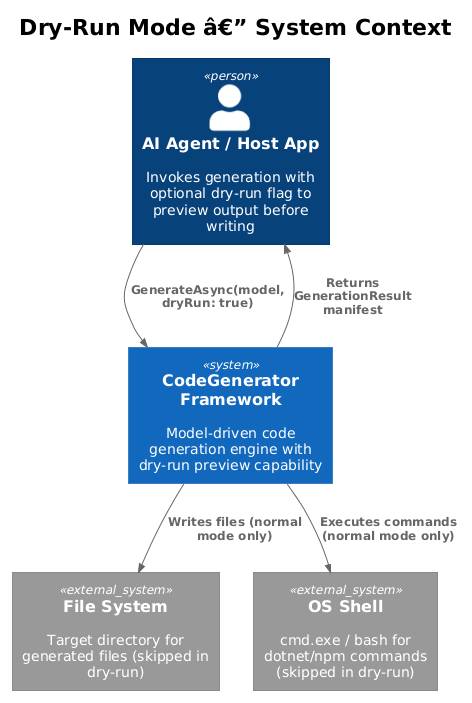
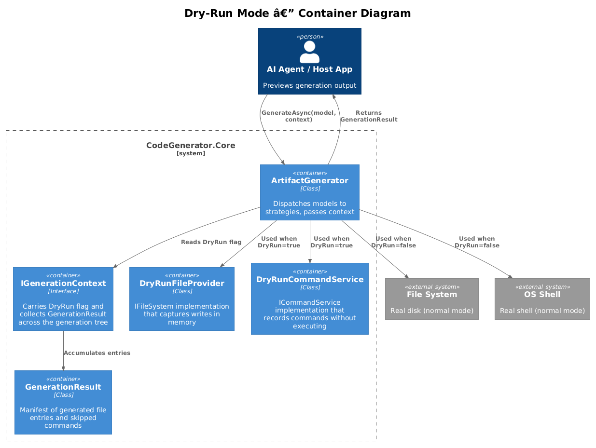
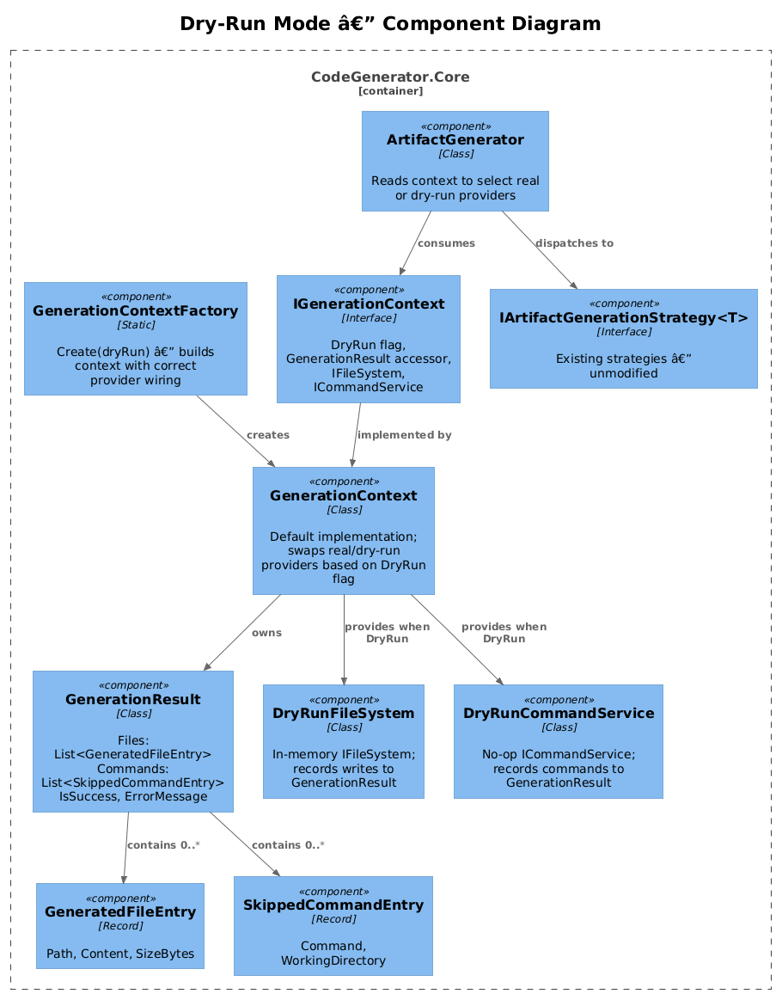
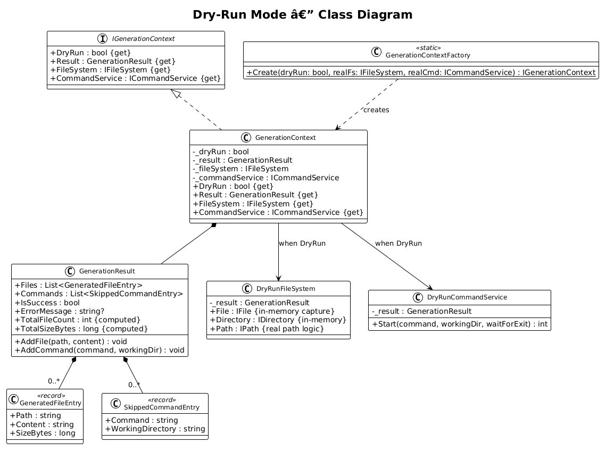
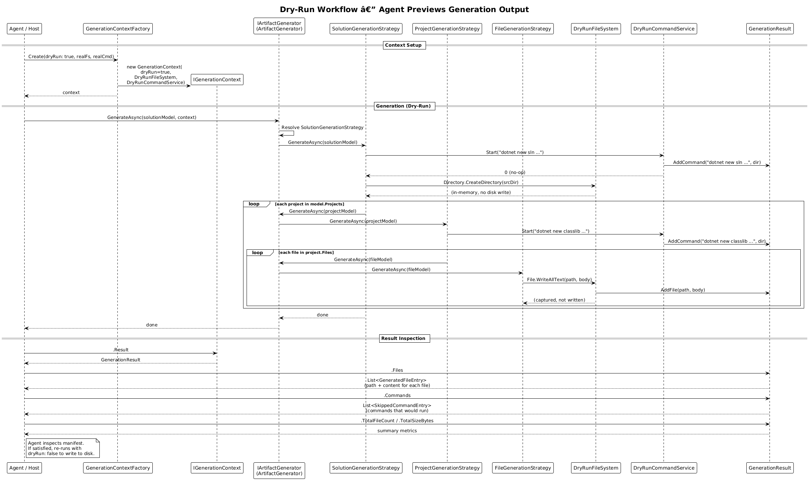

# Dry-Run Mode — Detailed Design

**Feature:** 17-dry-run-mode (Priority Action #7)
**Status:** Implemented
**Requirements:** Architecture Audit — Priority Action #7: "Add Dry-Run Mode"

---

## 1. Overview

The CodeGenerator framework currently writes files to disk and executes shell commands as an inseparable side-effect of generation. There is no way for an AI agent or host application to preview what _would_ be generated before committing to actual file system mutations.

### Problem

- `IArtifactGenerator.GenerateAsync(object model)` returns `Task` (void). The caller has no visibility into what files were created or what commands were run.
- Strategies like `FileGenerationStrategy` call `IFileSystem.File.WriteAllText()` directly. `ProjectGenerationStrategy` and `SolutionGenerationStrategy` run `dotnet new`, `dotnet add package`, and other shell commands via `ICommandService.Start()`.
- An agent that wants to inspect output before writing must currently run the full generation, accept all side-effects, and then examine the file system after the fact.

### Goal

Add a dry-run/preview mode where:

1. File content is generated but **not** written to disk.
2. Shell commands are **not** executed.
3. A structured manifest of "would-be-generated" files (paths + content) and "would-be-executed" commands is returned.
4. Agents can inspect the manifest, then choose to re-run in normal mode to commit the output.

### Actors

| Actor | Description |
|-------|-------------|
| **AI Agent** | Invokes generation with `dryRun: true` to preview output before committing |
| **Host Application** | CLI or service that creates a `GenerationContext` and passes it through the generation pipeline |
| **Developer** | Implements strategies that remain unmodified; dry-run behavior is transparent |

### Scope

This design covers changes to `CodeGenerator.Core` (new interfaces, context, result types, dry-run providers) and the DI wiring changes needed to make dry-run mode available. Existing strategy implementations in `.DotNet`, `.React`, `.Angular`, etc. require **no modifications** — the dry-run behavior is injected beneath them via the file system and command service abstractions they already depend on.

### Design Principles

- **Zero strategy changes.** Existing `IArtifactGenerationStrategy<T>` implementations must not need modification. Dry-run is achieved by swapping the infrastructure they depend on.
- **Opt-in.** Dry-run is activated by the caller via a context flag. The default behavior (write to disk, run commands) is unchanged.
- **Full fidelity.** The dry-run manifest must contain the exact same file paths and content that normal mode would produce. Only the side-effects (disk I/O, process execution) are suppressed.
- **Composable.** The `IGenerationContext` travels through the entire generation tree (solution -> project -> file) so that nested `GenerateAsync` calls all participate in the same dry-run session.

---

## 2. Architecture

### 2.1 C4 Context Diagram

Shows how the dry-run capability fits into the system landscape. In dry-run mode, the file system and OS shell are not touched.



### 2.2 C4 Container Diagram

The logical containers involved in dry-run mode and how they relate to the existing generation engine.



### 2.3 C4 Component Diagram

Internal components: the `IGenerationContext` interface, dry-run provider implementations, and the `GenerationResult` manifest.



---

## 3. Component Details

### 3.1 IGenerationContext

- **Responsibility:** Carry the dry-run flag and provide access to the correct `IFileSystem` and `ICommandService` implementations for the current generation session. Owns the `GenerationResult` that accumulates output.
- **Namespace:** `CodeGenerator.Core.Artifacts.Abstractions`
- **Key members:**
  - `bool DryRun { get; }` — whether this session suppresses side-effects
  - `GenerationResult Result { get; }` — the manifest being built
  - `IFileSystem FileSystem { get; }` — real or dry-run file system
  - `ICommandService CommandService { get; }` — real or dry-run command service
- **Lifetime:** One instance per generation invocation. Created by the caller (agent/host) or by `GenerationContextFactory`. Passed through the generation tree via an updated `GenerateAsync` overload.

### 3.2 GenerationContext

- **Responsibility:** Default implementation of `IGenerationContext`. Constructed with either real or dry-run providers depending on the `dryRun` flag.
- **Namespace:** `CodeGenerator.Core.Artifacts`
- **Construction:**
  - When `dryRun: false` — wraps the real `IFileSystem` and `ICommandService` from DI. `Result` still accumulates entries (useful for logging/auditing even in normal mode).
  - When `dryRun: true` — wraps `DryRunFileSystem` and `DryRunCommandService` instances that capture output in memory.

### 3.3 GenerationContextFactory

- **Responsibility:** Static factory that creates a properly wired `IGenerationContext`.
- **Namespace:** `CodeGenerator.Core.Artifacts`
- **API:**
  ```csharp
  public static class GenerationContextFactory
  {
      public static IGenerationContext Create(
          bool dryRun,
          IFileSystem realFileSystem,
          ICommandService realCommandService);
  }
  ```
- **Behavior:** When `dryRun` is true, creates `DryRunFileSystem` and `DryRunCommandService` backed by a shared `GenerationResult`. When false, uses the provided real implementations.

### 3.4 GenerationResult

- **Responsibility:** Immutable-after-generation manifest of all files that were (or would be) generated and all commands that were (or would be) executed.
- **Namespace:** `CodeGenerator.Core.Artifacts`
- **Key members:**
  - `List<GeneratedFileEntry> Files` — all file writes captured during generation
  - `List<SkippedCommandEntry> Commands` — all shell commands that were recorded (dry-run) or executed (normal)
  - `bool IsSuccess` — whether generation completed without errors
  - `string? ErrorMessage` — error detail if `IsSuccess` is false
  - `int TotalFileCount` — computed: `Files.Count`
  - `long TotalSizeBytes` — computed: sum of `Files.Select(f => f.SizeBytes)`
  - `void AddFile(string path, string content)` — thread-safe append
  - `void AddCommand(string command, string workingDirectory)` — thread-safe append
- **Thread safety:** `Files` and `Commands` are backed by `ConcurrentBag<T>` or use a lock, since strategies could theoretically run concurrently in future versions.

### 3.5 GeneratedFileEntry

- **Responsibility:** Represent a single file that was generated.
- **Type:** `record`
- **Members:**
  - `string Path` — full file path
  - `string Content` — file body (the string that would be written)
  - `long SizeBytes` — `Encoding.UTF8.GetByteCount(Content)`

### 3.6 SkippedCommandEntry

- **Responsibility:** Represent a shell command that was recorded but not executed (dry-run) or was executed (normal mode, for auditing).
- **Type:** `record`
- **Members:**
  - `string Command` — the command string (e.g., `"dotnet new classlib --framework net9.0 --no-restore"`)
  - `string WorkingDirectory` — the directory in which the command would run

### 3.7 DryRunFileSystem

- **Responsibility:** An `IFileSystem` implementation (from `System.IO.Abstractions`) that intercepts file writes and directory creation, recording them into `GenerationResult` without touching disk.
- **Namespace:** `CodeGenerator.Core.Services`
- **Behavior:**
  - `File.WriteAllText(path, content)` — calls `result.AddFile(path, content)` instead of writing to disk.
  - `Directory.CreateDirectory(path)` — no-op (returns a mock `IDirectoryInfo`). Tracked paths are recorded so that `Directory.Exists()` returns true for directories "created" during the dry run.
  - `Directory.Exists(path)` — returns true for paths created during this session (prevents strategies from failing on missing directory checks).
  - `File.Exists(path)` — returns false (no pre-existing files in dry-run context).
  - `Path.*` — delegates to the real `System.IO.Path` implementation (path computation is side-effect-free and must produce correct results).
- **Implementation note:** Extends `MockFileSystem` from `System.IO.Abstractions.TestingHelpers` or provides a minimal custom implementation wrapping only the methods the framework actually calls.

### 3.8 DryRunCommandService

- **Responsibility:** An `ICommandService` implementation that records commands without executing them.
- **Namespace:** `CodeGenerator.Core.Services`
- **Behavior:**
  - `Start(command, workingDirectory, waitForExit)` — calls `result.AddCommand(command, workingDirectory)` and returns `0` (success).
- **Relationship to existing `NoOpCommandService`:** The existing `NoOpCommandService` already returns 0 without executing. `DryRunCommandService` extends this pattern by also _recording_ the command into `GenerationResult`. It can either extend `NoOpCommandService` or be a standalone class.

---

## 4. Data Model

### 4.1 Class Diagram



### 4.2 Entity Descriptions

| Entity | Description |
|--------|-------------|
| `IGenerationContext` | Interface carrying the DryRun flag, result manifest, and provider accessors for the current generation session |
| `GenerationContext` | Default implementation; wires real or dry-run providers based on the DryRun flag |
| `GenerationContextFactory` | Static factory for creating correctly wired `IGenerationContext` instances |
| `GenerationResult` | Manifest collecting all generated file entries and recorded commands; provides summary metrics |
| `GeneratedFileEntry` | Immutable record for a single generated file: path, content, and computed size |
| `SkippedCommandEntry` | Immutable record for a single shell command: command string and working directory |
| `DryRunFileSystem` | In-memory `IFileSystem` that captures writes into `GenerationResult` |
| `DryRunCommandService` | No-op `ICommandService` that records commands into `GenerationResult` |

---

## 5. Key Workflows

### 5.1 Dry-Run Workflow

An agent requests a preview of generation output. The full generation tree executes, but all file writes and command executions are captured in memory rather than applied to disk.



**Steps:**

1. Agent calls `GenerationContextFactory.Create(dryRun: true, realFs, realCmd)`.
2. Factory creates a `GenerationContext` with `DryRunFileSystem` and `DryRunCommandService`, both backed by a shared `GenerationResult`.
3. Agent calls `IArtifactGenerator.GenerateAsync(solutionModel, context)`.
4. `ArtifactGenerator` dispatches to `SolutionGenerationStrategy`.
5. `SolutionGenerationStrategy` calls `ICommandService.Start("dotnet new sln ...")` — the `DryRunCommandService` records the command and returns 0.
6. Strategy calls `IFileSystem.Directory.CreateDirectory(...)` — `DryRunFileSystem` tracks the directory in memory.
7. Strategy iterates child projects, calling `IArtifactGenerator.GenerateAsync(projectModel)` for each.
8. `ProjectGenerationStrategy` records its `dotnet new`, `dotnet add package` commands via `DryRunCommandService`.
9. For each file in the project, `FileGenerationStrategy` calls `IFileSystem.File.WriteAllText(path, body)` — `DryRunFileSystem` captures the path and content into `GenerationResult.Files`.
10. Generation completes. Agent reads `context.Result` to inspect the manifest.

### 5.2 Normal (Non-Dry-Run) Workflow

The default behavior is unchanged. When `dryRun: false`, `GenerationContext` wraps the real `IFileSystem` and `ICommandService`. Optionally, the result manifest is still populated for auditing/logging purposes (the real `IFileSystem` wrapper can call `result.AddFile()` after writing to disk).

### 5.3 Result Inspection

After dry-run generation completes, the agent inspects the result:

```csharp
var context = GenerationContextFactory.Create(dryRun: true, fileSystem, commandService);
await artifactGenerator.GenerateAsync(solutionModel, context);

var result = context.Result;

// Inspect file manifest
foreach (var file in result.Files)
{
    Console.WriteLine($"{file.Path} ({file.SizeBytes} bytes)");
    // file.Content contains the full file body
}

// Inspect command manifest
foreach (var cmd in result.Commands)
{
    Console.WriteLine($"[{cmd.WorkingDirectory}] {cmd.Command}");
}

// Summary
Console.WriteLine($"Total: {result.TotalFileCount} files, {result.TotalSizeBytes} bytes");
Console.WriteLine($"Commands: {result.Commands.Count}");
```

If the agent is satisfied, it re-invokes with `dryRun: false` to commit the generation to disk.

---

## 6. API Contracts

### 6.1 Updated IArtifactGenerator

The existing `GenerateAsync(object model)` signature is preserved for backward compatibility. A new overload accepts `IGenerationContext`:

```csharp
public interface IArtifactGenerator
{
    // Existing — uses default (non-dry-run) context
    Task GenerateAsync(object model);

    // New — accepts explicit context for dry-run support
    Task<GenerationResult> GenerateAsync(object model, IGenerationContext context);
}
```

The parameterless overload internally creates a default `GenerationContext` with `dryRun: false` and the real DI-provided `IFileSystem` and `ICommandService`, preserving full backward compatibility.

### 6.2 Strategy Access to Context

Strategies currently receive their `IFileSystem` and `ICommandService` via constructor injection. To make dry-run transparent, two approaches are possible:

**Option A: Ambient context via DI scope (recommended).** When dry-run is requested, the caller creates a new DI scope and registers the dry-run providers as scoped overrides. Strategies resolve `IFileSystem` and `ICommandService` from DI as they do today, but get the dry-run implementations. No strategy code changes needed.

```csharp
// In ArtifactGenerator.GenerateAsync(model, context):
if (context.DryRun)
{
    using var scope = _serviceProvider.CreateScope();
    scope.ServiceProvider.Replace<IFileSystem>(context.FileSystem);
    scope.ServiceProvider.Replace<ICommandService>(context.CommandService);
    // dispatch to strategy using scoped provider
}
```

**Option B: Context propagation.** Register `IGenerationContext` in DI. Strategies that need to differentiate behavior can optionally inject it. However, since the goal is zero strategy changes, Option A is preferred.

### 6.3 Agent Invocation Pattern

```csharp
// 1. Create dry-run context
var context = GenerationContextFactory.Create(
    dryRun: true,
    realFs: serviceProvider.GetRequiredService<IFileSystem>(),
    realCmd: serviceProvider.GetRequiredService<ICommandService>());

// 2. Run generation in preview mode
var result = await artifactGenerator.GenerateAsync(solutionModel, context);

// 3. Inspect result
if (result.IsSuccess && result.TotalFileCount > 0)
{
    // Show manifest to user or apply heuristics
    foreach (var file in result.Files)
    {
        // file.Path, file.Content, file.SizeBytes
    }
}

// 4. If approved, run for real
await artifactGenerator.GenerateAsync(solutionModel);
```

### 6.4 CLI Integration

The CLI (`CodeGenerator.Cli`) can expose a `--dry-run` flag on generation commands:

```
codegen create microservice --name OrderService --dry-run
```

Output would list the file manifest and command manifest to stdout rather than writing to disk.

---

## 7. DI Registration

### 7.1 Normal Mode (unchanged)

```csharp
services.AddSingleton<ICommandService, CommandService>();
services.AddSingleton<IFileSystem, FileSystem>();
services.AddCoreServices(assembly);
```

### 7.2 Dry-Run Scoped Override

When `GenerateAsync(model, context)` is called with `context.DryRun == true`, the `ArtifactGenerator` creates a child `IServiceScope` and overrides the relevant registrations:

```csharp
services.AddScoped<IGenerationContext>();  // registered once at startup
```

At dry-run time, a scoped `IServiceProvider` is built with:
- `IFileSystem` -> `context.FileSystem` (the `DryRunFileSystem`)
- `ICommandService` -> `context.CommandService` (the `DryRunCommandService`)
- `IGenerationContext` -> `context`

All strategy resolution within that scope receives the dry-run providers.

---

## 8. Limitations and Edge Cases

| Case | Handling |
|------|----------|
| **Strategies that read files they previously wrote** | `DryRunFileSystem` maintains an in-memory file store. Files "written" during dry-run are readable by subsequent strategy calls within the same session. |
| **Strategies that read pre-existing files from disk** | `DryRunFileSystem.Path` delegates to real path logic. For reads of files not written during the session, the dry-run file system falls through to the real file system (read-only passthrough). |
| **Commands that produce files** (e.g., `dotnet new classlib` creates a `.csproj`) | In dry-run mode, these commands do not execute, so the `.csproj` file will not exist. Strategies like `ProjectGenerationStrategy` that read the generated `.csproj` (e.g., to add `<NoWarn>`) will need a synthetic placeholder. See Open Question #1. |
| **Strategy ordering depends on file system state** | Strategies that check `File.Exists()` or `Directory.Exists()` to decide behavior may behave differently in dry-run mode. The `DryRunFileSystem` mitigates this by tracking created paths, but cannot reproduce all real file system state. |
| **Concurrent generation** | `GenerationResult` uses thread-safe collections. Multiple strategies can add entries concurrently without corruption. |

---

## 9. Testing Strategy

| Test Type | Description |
|-----------|-------------|
| **Unit: DryRunFileSystem** | Verify that `WriteAllText` captures content in `GenerationResult.Files`. Verify `Directory.CreateDirectory` makes `Directory.Exists` return true. Verify `Path.Combine` delegates correctly. |
| **Unit: DryRunCommandService** | Verify that `Start` records the command in `GenerationResult.Commands` and returns 0. |
| **Unit: GenerationContextFactory** | Verify that `Create(true, ...)` produces a context with dry-run providers. Verify `Create(false, ...)` uses real providers. |
| **Unit: GenerationResult** | Verify `AddFile` / `AddCommand` are thread-safe. Verify computed properties (`TotalFileCount`, `TotalSizeBytes`). |
| **Integration: Full dry-run** | Create a solution model, run `GenerateAsync` with dry-run context, verify the manifest contains expected files and commands, and verify **no files were written to disk**. |
| **Integration: Normal then dry-run comparison** | Run the same model in normal mode and dry-run mode. Compare file paths and content; they should match (excluding command-generated artifacts). |

---

## 10. Open Questions

| # | Question | Context |
|---|----------|---------|
| 1 | How should strategies that depend on command-generated artifacts (e.g., `ProjectGenerationStrategy` reads the `.csproj` created by `dotnet new`) work in dry-run mode? | Options: (a) provide synthetic placeholder files for known `dotnet new` templates, (b) skip post-command file reads in dry-run and record partial output, (c) generate the `.csproj` content in-process without shelling out. |
| 2 | Should `GenerationResult` also be populated in normal (non-dry-run) mode for auditing? | Populating it adds a small overhead but enables logging and post-generation reports. Could be opt-in via a `GenerationContext.TrackResults` flag. |
| 3 | Should the `DryRunFileSystem` fall through to the real file system for reads of pre-existing files, or should it be fully isolated? | Fully isolated is safer (no disk access at all in dry-run) but may cause strategies to fail if they read config files, templates, etc. from disk. Read-passthrough is pragmatic but less "pure". |
| 4 | Should dry-run results be serializable to JSON for agent consumption? | Agents may prefer a JSON manifest over in-process object access. A `GenerationResult.ToJson()` method or a `JsonConverter` could support this. |
| 5 | Should `IArtifactGenerationStrategy<T>.GenerateAsync` signature change to accept `IGenerationContext`, or should context remain ambient via DI? | Passing context explicitly is more testable but requires changes to all strategy implementations. Ambient via DI (Option A in section 6.2) avoids strategy changes entirely. |
| 6 | Should there be a "partial dry-run" mode where files are generated but commands are still skipped? | Some agents may want to write files but skip `dotnet new` / `npm install`. This could be a separate flag on `IGenerationContext` (e.g., `SkipCommands`). |
