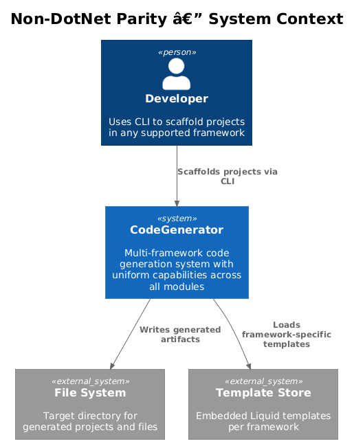
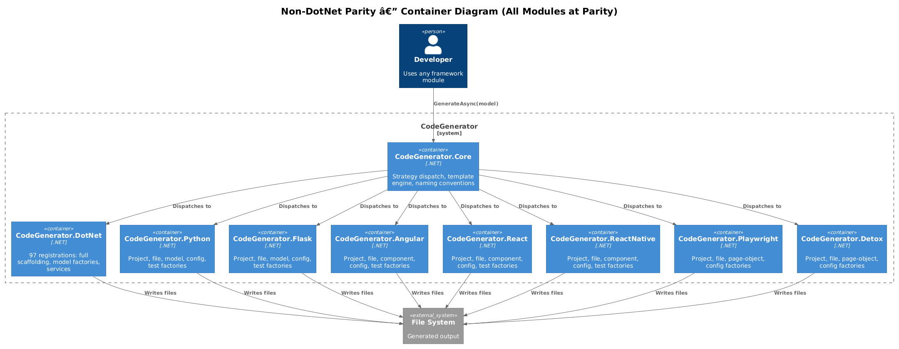
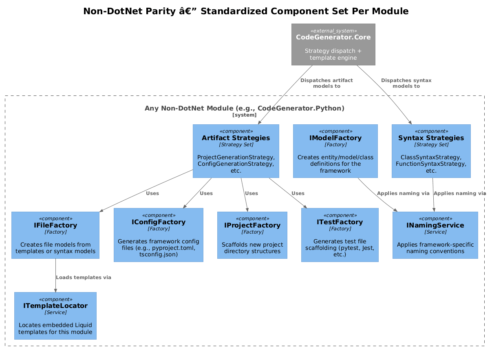
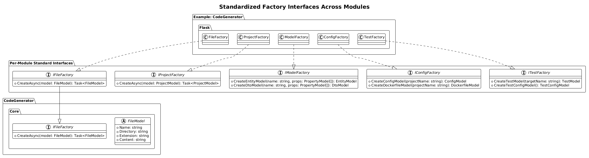
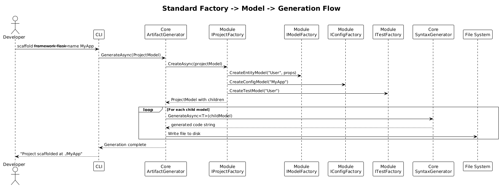

# Bring Non-DotNet Modules to Parity — Detailed Design

**Feature:** 18-non-dotnet-parity (Priority Action #8)
**Status:** Implemented
**Date:** 2026-04-03

---

## 1. Overview

The CodeGenerator framework supports eight language/framework modules. Today there is massive asymmetry between DotNet (97 service registrations, 27+ template categories, full clean-architecture scaffolding) and every other module (1-2 registrations each). This design defines a **minimum capability matrix** every module must satisfy, performs a per-module gap analysis, and lays out a phased implementation plan to bring all non-DotNet modules up to a consistent baseline.

### Problem Statement

A developer choosing any supported framework should have a comparable experience: scaffold a project, generate models/entities, produce config files, and create test stubs. Today, only the DotNet module delivers this. The remaining seven modules offer little beyond bare file and project creation, forcing users to hand-write boilerplate that the generator should handle.

### Goals

1. Define a **minimum capability matrix** applicable to all modules.
2. Identify the concrete gaps in each non-DotNet module.
3. Establish a **standardized factory pattern** so every module exposes the same set of core interfaces.
4. Prioritize implementation by highest-value modules first.
5. Ensure the work is additive -- existing strategies and registrations remain intact.

### Non-Goals

- Reaching full DotNet-level depth (97 registrations) for every module. The target is a solid, useful baseline.
- Rewriting the Core dispatch engine (covered by design 01).
- Adding new language modules beyond the existing eight.

### Actors

| Actor | Description |
|-------|-------------|
| **Developer** | Uses the CLI or host application to scaffold projects in any supported framework |
| **Module Contributor** | Implements new strategies and factories inside a specific module |
| **Core Engine** | `CodeGenerator.Core` -- dispatches models to the correct module strategies |

---

## 2. Architecture

### 2.1 C4 Context Diagram

Shows the developer interacting with the CodeGenerator system uniformly across all frameworks.



### 2.2 C4 Container Diagram

All eight modules at parity, each receiving dispatched models from Core.



### 2.3 C4 Component Diagram

The standardized component set that every non-DotNet module must implement.



---

## 3. Minimum Capability Matrix

Every module must implement at least the capabilities marked **Required** below. Capabilities marked **Conditional** apply only when the framework naturally supports them.

| # | Capability | Description | DotNet | Python | Flask | Angular | React | ReactNative | Playwright | Detox |
|---|-----------|-------------|--------|--------|-------|---------|-------|-------------|------------|-------|
| C1 | **Project scaffolding** | Create a runnable project structure with correct directory layout, package manifest, and entry point | Full | Basic | Basic | Basic | Basic | Basic | Basic | Basic |
| C2 | **File generation** | Generate individual files from models via artifact strategies | Full | Yes | Yes | Yes | Yes | Yes | Yes | Yes |
| C3 | **Model/entity factory** | Create entity/model/class definitions with properties and types | 15+ factories | None | None | None | None | None | None | None |
| C4 | **DTO/view-model factory** | Create data-transfer or view-model variants of entities | Yes | None | None | None | None | None | N/A | N/A |
| C5 | **Config generation** | Generate framework config files (linting, build, environment) | Yes | Partial | Partial | Partial | Partial | None | Partial | Partial |
| C6 | **Test generation** | Generate test file scaffolding matching the framework test runner | Yes | None | None | None | Has TestModel | None | Has TestSpec | Has TestSpec |
| C7 | **Template locator** | Module-specific embedded Liquid template discovery | Yes | None | None | None | None | None | None | None |
| C8 | **Naming service** | Apply framework-idiomatic naming (snake_case for Python, PascalCase for C#, kebab-case for Angular) | Yes | None | None | None | None | None | None | None |
| C9 | **Service layer** | Higher-level orchestration services (e.g., DDD service, CQRS service) | 40+ | None | None | None | None | None | None | None |
| C10 | **Dockerfile generation** | Produce a Dockerfile for the framework | Yes | None | Yes (syntax model exists) | None | Yes (syntax model exists) | None | None | None |

### Required vs Conditional

| Capability | Required for All? | Notes |
|-----------|-------------------|-------|
| C1 Project scaffolding | **Required** | Every module already has basic; needs enhancement |
| C2 File generation | **Required** | Already present in all modules |
| C3 Model/entity factory | **Required** | Core value-add -- generate domain models |
| C4 DTO/view-model factory | Conditional | Only for modules with typed data layers (Python, Flask, Angular, React) |
| C5 Config generation | **Required** | Every framework has config files |
| C6 Test generation | **Required** | Every framework has a test runner |
| C7 Template locator | **Required** | Enables Liquid template-based generation |
| C8 Naming service | **Required** | Each language has distinct conventions |
| C9 Service layer | Conditional | Only for backend modules (Flask, Python) -- frontend modules use simpler patterns |
| C10 Dockerfile generation | Conditional | Applicable to deployable modules (Python, Flask, React, Angular) |

---

## 4. Gap Analysis

### 4.1 Current State Summary

| Module | Registrations | Artifact Strategies | Syntax Strategies | Templates | Factories |
|--------|--------------|--------------------|--------------------|-----------|-----------|
| **DotNet** | 97 | 27+ categories | 40+ models | Embedded Liquid | IFileFactory, IProjectFactory, ISolutionFactory, IEntityFactory, IClassFactory, IControllerFactory, ICqrsFactory, IMethodFactory, IPropertyFactory, INamespaceFactory, ISyntaxUnitFactory, IRouteHandlerFactory, IExpressionFactory, ITypeFactory |
| **Python** | 2 | ProjectGenerationStrategy, RequirementsGenerationStrategy, VirtualEnvironmentGenerationStrategy | ClassSyntax, DecoratorSyntax, FunctionSyntax, ImportSyntax, MethodSyntax, ModuleSyntax | None | IFileFactory, IProjectFactory |
| **Flask** | 2 | ProjectGenerationStrategy, BlueprintGenerationStrategy | AppFactorySyntax, ControllerSyntax, ModelSyntax, RepositorySyntax, SchemaSyntax, ServiceSyntax, ConfigSyntax, DockerfileSyntax, EnvSyntax, AuthMiddlewareSyntax, CorsMiddlewareSyntax, TestSyntax | None | IFileFactory, IProjectFactory |
| **Angular** | 1 | ProjectGenerationStrategy, WorkspaceGenerationStrategy | FunctionSyntax, ImportSyntax, TypeScriptTypeSyntax, AngularWorkspaceSyntax, NgHttpServiceSyntax | None | IFileFactory (IProjectFactory defined but not registered) |
| **React** | 1 | ProjectGenerationStrategy, WorkspaceGenerationStrategy | ComponentSyntax, HookSyntax, StoreSyntax, RouterSyntax, ApiClientSyntax, TestSyntax, DockerfileSyntax, EnvSyntax, ImportSyntax, FunctionSyntax, ErrorBoundarySyntax, ContextProviderSyntax, TypeScriptInterfaceSyntax, TypeScriptTypeSyntax | None | IFileFactory (IProjectFactory defined but not registered) |
| **ReactNative** | 1 | ProjectGenerationStrategy | ComponentSyntax, ScreenSyntax, NavigationSyntax, StoreSyntax, StyleSyntax, HookSyntax, ImportSyntax, TypeScriptTypeSyntax | None | IFileFactory (IProjectFactory defined but not registered) |
| **Playwright** | 1 | ProjectGenerationStrategy | PageObjectSyntax, TestSpecSyntax, FixtureSyntax, BasePageSyntax, ConfigSyntax, ImportSyntax | None | IFileFactory (IProjectFactory defined but not registered) |
| **Detox** | 1 | ProjectGenerationStrategy | PageObjectSyntax, TestSpecSyntax, BasePageSyntax, DetoxConfigSyntax, JestConfigSyntax, ImportSyntax | None | IFileFactory (IProjectFactory defined but not registered) |

### 4.2 Per-Module Gap Details

#### Python

| Gap | Current State | Target State | Work Required |
|-----|--------------|--------------|---------------|
| IModelFactory | None | Create `ClassModel` instances with typed properties | New interface + implementation |
| IConfigFactory | None | Generate `pyproject.toml`, `.flake8`, `mypy.ini` | New interface + implementation + templates |
| ITestFactory | None | Generate `pytest` test stubs | New interface + implementation + templates |
| ITemplateLocator | None | Embedded Liquid templates for Python files | Add `EmbeddedResourceTemplateLocatorBase<AssemblyMarker>` |
| INamingService | None | Apply `snake_case` to identifiers, `PascalCase` to classes | New service wrapping `NamingConventionConverter` |
| Config generation | Only `requirements.txt` via RequirementsGenerationStrategy | Full config suite | New strategies + models |
| IProjectFactory registration | Registered | Enhanced with model/config/test sub-generation | Extend existing factory |

#### Flask

| Gap | Current State | Target State | Work Required |
|-----|--------------|--------------|---------------|
| IModelFactory | Has `ModelModel` + `ModelSyntaxGenerationStrategy` but no factory | Factory to compose SQLAlchemy models from property lists | New interface + implementation |
| IConfigFactory | Has `ConfigModel` + `ConfigSyntaxGenerationStrategy` | Factory to produce full config set | New interface + implementation |
| ITestFactory | Has `TestModel` + `TestSyntaxGenerationStrategy` | Factory to produce pytest test stubs per entity | New interface + implementation |
| ITemplateLocator | None | Embedded Liquid templates | Add template locator registration |
| INamingService | None | `snake_case` for Python/Flask identifiers | New service |
| IServiceFactory | Has `ServiceModel` syntax strategy | Factory to orchestrate service + repository + schema generation per entity | New interface + implementation |

#### Angular

| Gap | Current State | Target State | Work Required |
|-----|--------------|--------------|---------------|
| IProjectFactory | Defined but **not registered** in DI | Register and enhance | Fix registration + extend |
| IModelFactory | None | Generate TypeScript interfaces from entity definitions | New interface + implementation |
| IConfigFactory | None | Generate `tsconfig.json`, `angular.json`, `.eslintrc`, `karma.conf` | New interface + implementation + templates |
| ITestFactory | None | Generate Jasmine/Jest test stubs per component/service | New interface + implementation + templates |
| ITemplateLocator | None | Embedded Liquid templates | Add template locator |
| INamingService | None | `kebab-case` for files, `PascalCase` for classes, `camelCase` for members | New service |
| IComponentFactory | None | Orchestrate component + template + style + spec file generation | New interface |

#### React

| Gap | Current State | Target State | Work Required |
|-----|--------------|--------------|---------------|
| IProjectFactory | Defined but **not registered** in DI | Register and enhance | Fix registration + extend |
| IModelFactory | Has `TypeScriptInterfaceModel` syntax strategy | Factory to compose TS interfaces from entity definitions | New interface + implementation |
| IConfigFactory | None | Generate `vite.config.ts`, `tsconfig.json`, `.eslintrc` | New interface + implementation + templates |
| ITestFactory | Has `TestModel` + `TestSyntaxGenerationStrategy` | Factory to produce Vitest/Jest test stubs per component | New interface + implementation |
| ITemplateLocator | None | Embedded Liquid templates | Add template locator |
| INamingService | None | `PascalCase` for components, `camelCase` for hooks/utils | New service |

#### ReactNative

| Gap | Current State | Target State | Work Required |
|-----|--------------|--------------|---------------|
| IProjectFactory | Defined but **not registered** in DI | Register and enhance | Fix registration + extend |
| IModelFactory | None | Generate TypeScript types for domain models | New interface + implementation |
| IConfigFactory | None | Generate `metro.config.js`, `babel.config.js`, `tsconfig.json` | New interface + implementation + templates |
| ITestFactory | None | Generate Jest test stubs per screen/component | New interface + implementation + templates |
| ITemplateLocator | None | Embedded Liquid templates | Add template locator |
| INamingService | None | `PascalCase` for components/screens, `camelCase` for hooks | New service |

#### Playwright

| Gap | Current State | Target State | Work Required |
|-----|--------------|--------------|---------------|
| IProjectFactory | Defined but **not registered** in DI | Register | Fix registration |
| IConfigFactory | Has `ConfigModel` + strategy | Factory to compose full Playwright config | New interface + implementation |
| ITestFactory | Has `TestSpecModel` + `FixtureModel` + strategies | Factory to orchestrate page-object + test-spec pairs | New interface + implementation |
| ITemplateLocator | None | Embedded Liquid templates | Add template locator |
| INamingService | None | `kebab-case` for files, `camelCase` for members | New service |

#### Detox

| Gap | Current State | Target State | Work Required |
|-----|--------------|--------------|---------------|
| IProjectFactory | Defined but **not registered** in DI | Register | Fix registration |
| IConfigFactory | Has `DetoxConfigModel` + `JestConfigModel` + strategies | Factory to compose full config set | New interface + implementation |
| ITestFactory | Has `TestSpecModel` + strategy | Factory to orchestrate page-object + test-spec pairs | New interface + implementation |
| ITemplateLocator | None | Embedded Liquid templates | Add template locator |
| INamingService | None | `camelCase` for members, `PascalCase` for page objects | New service |

---

## 5. Component Details

### 5.1 Standardized Factory Interfaces

Each module should expose these factory interfaces within its `Artifacts` namespace. Not every module needs every interface (see the Required/Conditional table in Section 3), but the signatures should be consistent.



#### IFileFactory (already exists in all modules)

```csharp
public interface IFileFactory
{
    Task<FileModel> CreateAsync(FileModel model);
}
```

#### IProjectFactory (exists in most, missing registration in some)

```csharp
public interface IProjectFactory
{
    Task<ProjectModel> CreateAsync(ProjectModel model);
}
```

#### IModelFactory (new -- per module)

```csharp
public interface IModelFactory
{
    // Framework-specific entity/class/interface model creation
    EntityModel CreateEntityModel(string name, IEnumerable<PropertyModel> properties);
    DtoModel CreateDtoModel(string name, IEnumerable<PropertyModel> properties);
}
```

**Per-module variants:**
- **Python**: Creates `ClassModel` with type hints and `__init__` method
- **Flask**: Creates `ModelModel` (SQLAlchemy) + `SchemaModel` (Marshmallow)
- **Angular/React/ReactNative**: Creates `TypeScriptInterfaceModel` or `TypeScriptTypeModel`
- **Playwright/Detox**: Creates `PageObjectModel` from locator definitions

#### IConfigFactory (new -- per module)

```csharp
public interface IConfigFactory
{
    ConfigModel CreateConfigModel(string projectName);
    DockerfileModel CreateDockerfileModel(string projectName); // conditional
}
```

**Per-module config targets:**

| Module | Config Files |
|--------|-------------|
| Python | `pyproject.toml`, `setup.cfg`, `.flake8`, `mypy.ini` |
| Flask | `config.py`, `.env`, `Dockerfile`, `docker-compose.yml` |
| Angular | `angular.json`, `tsconfig.json`, `.eslintrc.json`, `karma.conf.js` |
| React | `vite.config.ts`, `tsconfig.json`, `.eslintrc.json` |
| ReactNative | `metro.config.js`, `babel.config.js`, `tsconfig.json` |
| Playwright | `playwright.config.ts` |
| Detox | `.detoxrc.js`, `jest.config.js` |

#### ITestFactory (new -- per module)

```csharp
public interface ITestFactory
{
    TestModel CreateTestModel(string targetName);
    TestConfigModel CreateTestConfigModel();
}
```

**Per-module test runners:**

| Module | Test Runner | Test Pattern |
|--------|------------|--------------|
| Python | pytest | `test_<name>.py` with fixtures |
| Flask | pytest | `test_<name>.py` with app fixture and client |
| Angular | Jasmine/Jest | `<name>.spec.ts` |
| React | Vitest/Jest | `<name>.test.tsx` |
| ReactNative | Jest | `<name>.test.tsx` |
| Playwright | Playwright Test | `<name>.spec.ts` with page objects |
| Detox | Jest + Detox | `<name>.e2e.ts` with page objects |

### 5.2 Template Locator Registration

Every module must register an `ITemplateLocator` backed by `EmbeddedResourceTemplateLocatorBase<AssemblyMarker>`. This requires:

1. Adding an `AssemblyMarker.cs` file to the module (empty class).
2. Creating a `Templates/` directory with embedded `.liquid` files.
3. Registering in `ConfigureServices`:

```csharp
services.AddSingleton<ITemplateLocator,
    EmbeddedResourceTemplateLocatorBase<AssemblyMarker>>();
```

### 5.3 Naming Service

Each module needs a thin wrapper that delegates to `INamingConventionConverter` from Core, applying the module's preferred casing:

| Module | File Naming | Class/Type Naming | Member Naming |
|--------|------------|-------------------|---------------|
| Python | `snake_case.py` | `PascalCase` | `snake_case` |
| Flask | `snake_case.py` | `PascalCase` | `snake_case` |
| Angular | `kebab-case.component.ts` | `PascalCase` | `camelCase` |
| React | `PascalCase.tsx` | `PascalCase` | `camelCase` |
| ReactNative | `PascalCase.tsx` | `PascalCase` | `camelCase` |
| Playwright | `kebab-case.spec.ts` | `PascalCase` | `camelCase` |
| Detox | `kebab-case.e2e.ts` | `PascalCase` | `camelCase` |

---

## 6. Key Workflows

### 6.1 Standardized Factory Pattern

The following sequence diagram shows the uniform flow that every module should follow when scaffolding a project with entities.



### 6.2 Registration Pattern

Every module's `ConfigureServices` should follow this standard shape after parity work is complete:

```csharp
public static void Add{Module}Services(this IServiceCollection services)
{
    // Factories (minimum set)
    services.AddSingleton<IFileFactory, FileFactory>();
    services.AddSingleton<IProjectFactory, ProjectFactory>();
    services.AddSingleton<IModelFactory, ModelFactory>();
    services.AddSingleton<IConfigFactory, ConfigFactory>();
    services.AddSingleton<ITestFactory, TestFactory>();

    // Services
    services.AddSingleton<ITemplateLocator,
        EmbeddedResourceTemplateLocatorBase<AssemblyMarker>>();
    services.AddSingleton<INamingService, NamingService>();

    // Strategy scanning (already present)
    services.AddArifactGenerator(typeof(ProjectModel).Assembly);
    services.AddSyntaxGenerator(typeof(ProjectModel).Assembly);
}
```

This brings the minimum registration count per module from 1-2 to approximately 7-9, still far below DotNet's 97 but covering the essential capability matrix.

### 6.3 Adding an Entity to Any Module

1. CLI receives `add entity --name Order --module flask --properties "id:int, name:str, total:float"`.
2. Core parses arguments and creates a generic `EntityDefinition`.
3. Core dispatches to the module's `IModelFactory.CreateEntityModel()`.
4. The factory returns a module-specific model (e.g., `ModelModel` for Flask with SQLAlchemy column types).
5. Core dispatches the model to `IArtifactGenerator.GenerateAsync()`.
6. The module's `ModelSyntaxGenerationStrategy` renders the code.
7. The module's `ITestFactory.CreateTestModel()` creates a companion test stub.
8. Both files are written to disk.

---

## 7. Implementation Priority

### 7.1 Module Priority Order

Modules are prioritized by community demand, existing strategy richness (leverage), and architectural impact.

| Priority | Module | Rationale |
|----------|--------|-----------|
| **P1** | **Flask** | Richest existing syntax strategies (14 strategies), has models/repos/services/schemas -- closest to parity already |
| **P2** | **React** | Rich syntax strategies (14 strategies), popular frontend framework, has test model |
| **P3** | **Python** | Foundation for Flask; shares naming conventions; 6 syntax strategies |
| **P4** | **Angular** | Popular enterprise frontend; 5 syntax strategies |
| **P5** | **ReactNative** | Shares patterns with React; 8 syntax strategies |
| **P6** | **Playwright** | Test-focused module; 6 syntax strategies already have config + test-spec |
| **P7** | **Detox** | Test-focused module; 6 syntax strategies; similar to Playwright |

### 7.2 Capability Priority Order

Within each module, implement capabilities in this order:

| Step | Capability | Why First |
|------|-----------|-----------|
| 1 | Fix missing `IProjectFactory` registration | Zero-cost fix, unblocks project scaffolding |
| 2 | Add `ITemplateLocator` + `AssemblyMarker` | Unblocks template-based generation |
| 3 | Add `IModelFactory` | Core value-add for entity generation |
| 4 | Add `IConfigFactory` | Produces runnable projects |
| 5 | Add `ITestFactory` | Produces testable projects |
| 6 | Add `INamingService` | Quality-of-life for generated code |
| 7 | Add `IServiceFactory` (backend modules only) | Orchestration for service-layer scaffolding |

---

## 8. Effort Estimates

Relative sizing using T-shirt sizes. One "S" is approximately 1-2 days of implementation.

| Module | Fix Registrations | Template Locator | Model Factory | Config Factory | Test Factory | Naming Service | Total |
|--------|------------------|-----------------|---------------|----------------|--------------|----------------|-------|
| **Flask** | S | S | M | M | M | S | **L** |
| **React** | S | S | M | M | S | S | **L** |
| **Python** | -- (already done) | S | M | M | M | S | **L** |
| **Angular** | S | S | M | M | M | S | **L** |
| **ReactNative** | S | S | M | M | M | S | **L** |
| **Playwright** | S | S | S | S | S | S | **M** |
| **Detox** | S | S | S | S | S | S | **M** |

**Total estimated effort:** 5L + 2M = approximately 30-40 developer-days.

### Sizing Key

| Size | Effort | Description |
|------|--------|-------------|
| S | 1-2 days | Simple registration fix, thin wrapper, or single template |
| M | 3-5 days | New interface + implementation + 2-4 templates + tests |
| L | 8-12 days | Full factory suite for a module (all capabilities) |

---

## 9. Risk Analysis

| Risk | Impact | Likelihood | Mitigation |
|------|--------|------------|------------|
| Model factory interfaces diverge across modules | High | Medium | Define shared base interfaces in `CodeGenerator.Core.Artifacts.Abstractions` |
| Template maintenance burden (7 modules x N templates) | Medium | High | Use Liquid template inheritance; share common snippets |
| Breaking changes to existing strategies | High | Low | All work is additive -- new registrations alongside existing ones |
| Naming service edge cases per language | Low | Medium | Comprehensive unit tests for each language's naming rules |
| Scope creep toward DotNet-level depth | Medium | High | Strict adherence to the minimum capability matrix; defer service-layer depth |

---

## 10. Open Questions

| # | Question | Owner | Status |
|---|----------|-------|--------|
| 1 | Should `IModelFactory` be a single interface in Core or per-module with a shared base? | Architecture | Open |
| 2 | Should template files be `.liquid` embedded resources or filesystem files loaded at runtime? | Architecture | Leaning embedded (matches DotNet pattern) |
| 3 | Should Playwright and Detox get `IModelFactory` (for page objects) or only `ITestFactory`? | Product | Open |
| 4 | Should the CLI expose a uniform `add entity` command across all modules or module-specific commands? | Product | Open |
| 5 | What is the minimum set of config files per framework to consider "config generation" complete? | Engineering | Open -- proposed lists in Section 5.1 |
| 6 | Should `INamingService` live in Core (parameterized by convention) or in each module? | Architecture | Open |
| 7 | How do we handle modules where DI registration exists but the factory class is incomplete (Angular, React, ReactNative)? | Engineering | Open -- needs code audit |

---

## 11. Appendix: Current Registration Counts

For reference, the exact registrations per module as of the current codebase:

```
DotNet:      97 registrations (AddDotNetServices)
Python:       2 registrations (IFileFactory, IProjectFactory)
Flask:        2 registrations (IFileFactory, IProjectFactory)
ReactNative:  1+2 (IFileFactory + IProjectFactory defined but IProjectFactory registered)
Angular:      1 registration  (IFileFactory only -- IProjectFactory defined but NOT registered)
React:        1 registration  (IFileFactory only -- IProjectFactory defined but NOT registered)
Playwright:   1+2 (IFileFactory + IProjectFactory registered)
Detox:        1+2 (IFileFactory + IProjectFactory registered)
```

**Note:** Angular, React, and ReactNative all define `IProjectFactory` and `ProjectFactory` classes in their `Artifacts` namespace but Angular and React do not register them in their `ConfigureServices`. This is a bug that should be fixed as the first step of parity work.
