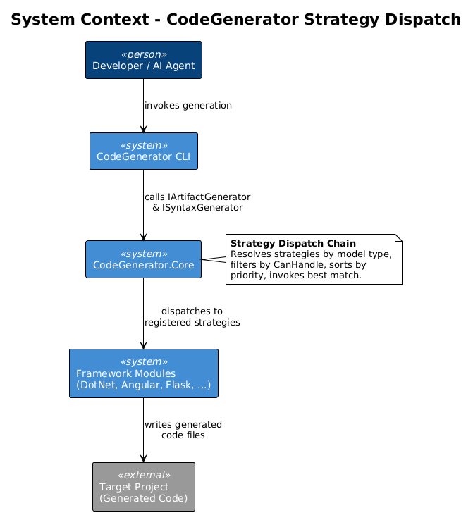
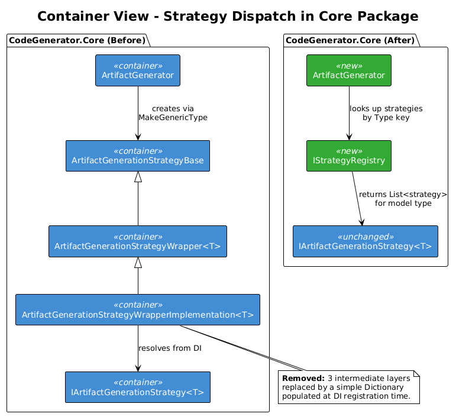
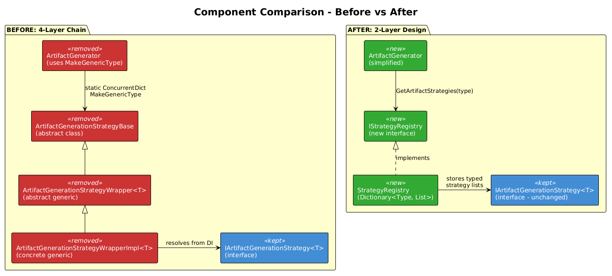
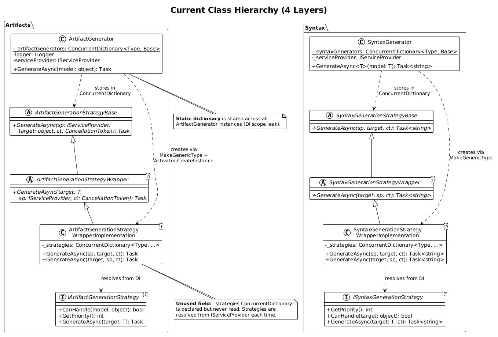
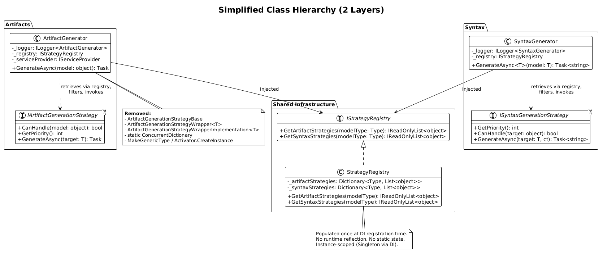
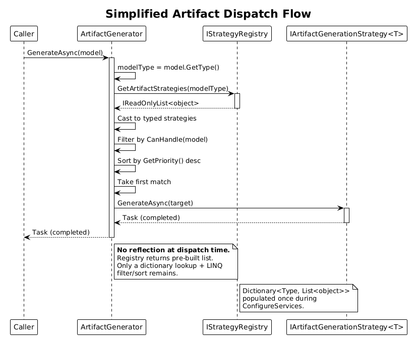

# Detailed Design: Simplify Strategy Wrapper Chain

| Field          | Value                                      |
|----------------|--------------------------------------------|
| **Priority**   | #9 (Architecture Audit)                    |
| **Status**     | Draft                                      |
| **Author**     | Quinntyne Brown                            |
| **Created**    | 2026-04-03                                 |
| **Package**    | `CodeGenerator.Core`                       |

---

## 1. Overview

### 1.1 Problem Statement

The strategy dispatch mechanism in `CodeGenerator.Core` uses a 4-layer abstraction chain to route generation requests from `ArtifactGenerator`/`SyntaxGenerator` to the correct `IArtifactGenerationStrategy<T>`/`ISyntaxGenerationStrategy<T>` implementation. This chain exists on both the Artifact and Syntax sides, totaling 8 classes for what is fundamentally a dictionary lookup plus a LINQ filter.

The 4 layers on the Artifact side are:

| Layer | Type | Role |
|-------|------|------|
| 1 | `IArtifactGenerationStrategy<T>` | Interface that concrete strategies implement |
| 2 | `ArtifactGenerationStrategyBase` | Abstract base with `GenerateAsync(IServiceProvider, object, CancellationToken)` |
| 3 | `ArtifactGenerationStrategyWrapper<T>` | Generic abstract adding `GenerateAsync(T, IServiceProvider, CancellationToken)` |
| 4 | `ArtifactGenerationStrategyWrapperImplementation<T>` | Concrete generic that resolves strategies from DI, filters, sorts, invokes |

The Syntax side mirrors this exactly with `SyntaxGenerationStrategyBase`, `SyntaxGenerationStrategyWrapper<T>`, and `SyntaxGenerationStrategyWrapperImplementation<T>`.

**Specific problems:**

1. **Runtime reflection** -- `ArtifactGenerator.GenerateAsync` calls `typeof(...).MakeGenericType(targetType)` followed by `Activator.CreateInstance(wrapperType)` to construct the wrapper. This happens on first access per model type, adding latency and making the code harder to debug.

2. **Static shared state** -- Both `ArtifactGenerator` and `SyntaxGenerator` use `static readonly ConcurrentDictionary` fields to cache wrappers. Because the field is static, all DI-resolved instances share the same dictionary, creating a hidden coupling across scopes.

3. **Unused fields** -- Both `ArtifactGenerationStrategyWrapperImplementation<T>` and `SyntaxGenerationStrategyWrapperImplementation<T>` declare a `_strategies` `ConcurrentDictionary` field that is never read. Strategies are resolved from `IServiceProvider` on every call instead.

4. **Comprehension overhead** -- 4 layers of abstraction (interface, abstract base, generic wrapper, concrete wrapper implementation) makes the dispatch path difficult to follow when debugging. A developer stepping through `GenerateAsync` must traverse 3 class boundaries before reaching the actual strategy selection logic.

### 1.2 Goal

Collapse the 4-layer chain down to 2 layers:

- **Layer 1:** `IArtifactGenerationStrategy<T>` / `ISyntaxGenerationStrategy<T>` (unchanged)
- **Layer 2:** `ArtifactGenerator` / `SyntaxGenerator` (simplified, uses a registry)

Introduce an `IStrategyRegistry` populated at DI registration time that maps `Type -> List<strategy>`, replacing the runtime reflection with a simple dictionary lookup.

### 1.3 Success Criteria

- `ArtifactGenerationStrategyBase`, `ArtifactGenerationStrategyWrapper<T>`, and `ArtifactGenerationStrategyWrapperImplementation<T>` are deleted (3 files)
- `SyntaxGenerationStrategyBase`, `SyntaxGenerationStrategyWrapper<T>`, and `SyntaxGenerationStrategyWrapperImplementation<T>` are deleted (3 files)
- No calls to `MakeGenericType` or `Activator.CreateInstance` remain in strategy dispatch
- No `static ConcurrentDictionary` fields remain in generators
- All 31 artifact strategies and 119 syntax strategies continue to function without modification
- All existing tests pass
- Dispatch performance is equal or better (dictionary lookup vs reflection + concurrent dictionary)

### 1.4 Scope

**In scope:**
- `ArtifactGenerator`, `SyntaxGenerator`, and all wrapper/base classes in `CodeGenerator.Core`
- `ConfigureServices.cs` in `CodeGenerator.Core` (DI registration)
- New `IStrategyRegistry` / `StrategyRegistry` types

**Out of scope:**
- Concrete strategy implementations (31 artifact + 119 syntax strategies) -- these implement the interface directly and require no changes
- `ConfigureServices.cs` in framework modules (DotNet, Angular, Flask, etc.) -- these call `AddArifactGenerator` / `AddSyntaxGenerator` which will be updated internally
- Extract-to-Abstractions work (Priority Action #1) -- orthogonal refactor

---

## 2. Architecture

### 2.1 System Context



The CodeGenerator CLI invokes `IArtifactGenerator.GenerateAsync(model)` passing a model object. The Core package dispatches to the correct strategy registered by a framework module (DotNet, Angular, Flask, etc.). The strategy writes generated code to the target project on disk.

### 2.2 Container View



**Before:** `ArtifactGenerator` uses `MakeGenericType` + `Activator.CreateInstance` to create a `WrapperImplementation<T>` at runtime, caches it in a static `ConcurrentDictionary`, then the wrapper resolves `IEnumerable<IArtifactGenerationStrategy<T>>` from `IServiceProvider`.

**After:** `ArtifactGenerator` calls `IStrategyRegistry.GetArtifactStrategies(modelType)` which returns a pre-built list. No reflection, no static state.

### 2.3 Component View



The component diagram contrasts the before (4 layers with reflection) and after (2 layers with registry) side by side. The three intermediate classes (`StrategyBase`, `Wrapper<T>`, `WrapperImplementation<T>`) are eliminated entirely.

---

## 3. Current State Analysis

### 3.1 Artifact Dispatch Chain

The current dispatch path when `ArtifactGenerator.GenerateAsync(model)` is called:

```
ArtifactGenerator.GenerateAsync(object model)
  |
  +-- _artifactGenerators.GetOrAdd(model.GetType(), targetType => {
  |       // REFLECTION: construct generic wrapper at runtime
  |       var wrapperType = typeof(ArtifactGenerationStrategyWrapperImplementation<>)
  |                             .MakeGenericType(targetType);
  |       var wrapper = Activator.CreateInstance(wrapperType);
  |       return (ArtifactGenerationStrategyBase)wrapper;
  |   })
  |
  +-- handler.GenerateAsync(serviceProvider, model, cancellationToken)
        |
        +-- [ArtifactGenerationStrategyWrapperImplementation<T>]
            |
            +-- override GenerateAsync(IServiceProvider, object, CT)
            |     // Cast object -> T, delegate to typed overload
            |     => GenerateAsync((T)target, serviceProvider, ct)
            |
            +-- override GenerateAsync(T, IServiceProvider, CT)
                  |
                  +-- serviceProvider.GetRequiredService<IEnumerable<IArtifactGenerationStrategy<T>>>()
                  +-- .Where(x => x.CanHandle(target))
                  +-- .OrderByDescending(x => x.GetPriority())
                  +-- .First()
                  +-- handler.GenerateAsync(target)
```

**Key files (current):**

| File | Path |
|------|------|
| `IArtifactGenerationStrategy<T>` | `src/CodeGenerator.Core/Artifacts/Abstractions/IArtifactGenerationStrategy.cs` |
| `ArtifactGenerationStrategyBase` | `src/CodeGenerator.Core/Artifacts/Abstractions/ArtifactGenerationStrategyBase.cs` |
| `ArtifactGenerationStrategyWrapper<T>` | `src/CodeGenerator.Core/Artifacts/Abstractions/ArtifactGenerationStrategyWrapper.cs` |
| `ArtifactGenerationStrategyWrapperImplementation<T>` | `src/CodeGenerator.Core/Artifacts/Abstractions/SyntaxGenerationStrategyWrapperImplementation.cs` |
| `ArtifactGenerator` | `src/CodeGenerator.Core/Artifacts/Abstractions/ArtifactGenerator.cs` |

### 3.2 Syntax Dispatch Chain

The Syntax side is structurally identical. `SyntaxGenerator.GenerateAsync<T>(model)` uses the same `MakeGenericType` + `Activator.CreateInstance` pattern to create `SyntaxGenerationStrategyWrapperImplementation<T>`, cached in a static `ConcurrentDictionary`.

**Key files (current):**

| File | Path |
|------|------|
| `ISyntaxGenerationStrategy<T>` | `src/CodeGenerator.Core/Syntax/ISyntaxGenerationStrategy.cs` |
| `SyntaxGenerationStrategyBase` | `src/CodeGenerator.Core/Syntax/SyntaxGenerationStrategyBase.cs` |
| `SyntaxGenerationStrategyWrapper<T>` | `src/CodeGenerator.Core/Syntax/SyntaxGenerationStrategyWrapper.cs` |
| `SyntaxGenerationStrategyWrapperImplementation<T>` | `src/CodeGenerator.Core/Syntax/SyntaxGenerationStrategyWrapperImplementation.cs` |
| `SyntaxGenerator` | `src/CodeGenerator.Core/Syntax/SyntaxGenerator.cs` |

### 3.3 DI Registration (Current)

`ConfigureServices.AddArifactGenerator(assembly)` already scans the assembly for types implementing `IArtifactGenerationStrategy<>` and registers each as a singleton against its closed generic interface. The wrapper layer then resolves these via `serviceProvider.GetRequiredService<IEnumerable<IArtifactGenerationStrategy<T>>>()`.

The scan-and-register logic is sound -- the problem is that the wrapper layer exists purely to bridge the gap between the non-generic `ArtifactGenerator.GenerateAsync(object)` signature and the generic `IArtifactGenerationStrategy<T>.GenerateAsync(T)` signature. A registry can bridge this gap without reflection.

### 3.4 Bug: Unused `_strategies` Field

Both `ArtifactGenerationStrategyWrapperImplementation<T>` and `SyntaxGenerationStrategyWrapperImplementation<T>` declare:

```csharp
private readonly ConcurrentDictionary<Type, IEnumerable<IArtifactGenerationStrategy<T>>> _strategies = [];
```

This field is never read. The strategies are resolved fresh from `IServiceProvider` on every call to `GenerateAsync`. This is dead code that suggests an earlier caching design was abandoned without cleanup.

---

## 4. Target State

### 4.1 Class Diagram: Before



### 4.2 Class Diagram: After



### 4.3 Two-Layer Design

After the refactor, the type hierarchy is:

**Artifact side:**
- `IArtifactGenerationStrategy<T>` -- unchanged, still implemented by all 31 concrete strategies
- `ArtifactGenerator` -- simplified, injects `IStrategyRegistry`, no reflection

**Syntax side:**
- `ISyntaxGenerationStrategy<T>` -- unchanged, still implemented by all 119 concrete strategies
- `SyntaxGenerator` -- simplified, injects `IStrategyRegistry`, no reflection

**Shared:**
- `IStrategyRegistry` -- new interface for type-to-strategy lookup
- `StrategyRegistry` -- implementation backed by `Dictionary<Type, List<object>>`

---

## 5. Component Details

### 5.1 IStrategyRegistry

```csharp
namespace CodeGenerator.Core;

public interface IStrategyRegistry
{
    IReadOnlyList<object> GetArtifactStrategies(Type modelType);
    IReadOnlyList<object> GetSyntaxStrategies(Type modelType);
}
```

The registry returns `object` because the caller (`ArtifactGenerator`) receives an untyped `object model` and needs to work with strategies without knowing `T` at compile time. The strategies are stored as their concrete instances but returned as `object` for the generator to cast dynamically. This is the same cast that `WrapperImplementation<T>` currently performs with `(T)target`.

### 5.2 StrategyRegistry

```csharp
namespace CodeGenerator.Core;

public class StrategyRegistry : IStrategyRegistry
{
    private readonly Dictionary<Type, List<object>> _artifactStrategies = new();
    private readonly Dictionary<Type, List<object>> _syntaxStrategies = new();

    public void RegisterArtifactStrategy(Type modelType, object strategy)
    {
        if (!_artifactStrategies.TryGetValue(modelType, out var list))
        {
            list = new List<object>();
            _artifactStrategies[modelType] = list;
        }
        list.Add(strategy);
    }

    public void RegisterSyntaxStrategy(Type modelType, object strategy)
    {
        if (!_syntaxStrategies.TryGetValue(modelType, out var list))
        {
            list = new List<object>();
            _syntaxStrategies[modelType] = list;
        }
        list.Add(strategy);
    }

    public IReadOnlyList<object> GetArtifactStrategies(Type modelType)
    {
        return _artifactStrategies.TryGetValue(modelType, out var list)
            ? list.AsReadOnly()
            : Array.Empty<object>();
    }

    public IReadOnlyList<object> GetSyntaxStrategies(Type modelType)
    {
        return _syntaxStrategies.TryGetValue(modelType, out var list)
            ? list.AsReadOnly()
            : Array.Empty<object>();
    }
}
```

The registry is populated once during DI setup and is immutable after construction. It is registered as a singleton.

### 5.3 Simplified ArtifactGenerator

```csharp
namespace CodeGenerator.Core.Artifacts.Abstractions;

public class ArtifactGenerator : IArtifactGenerator
{
    private readonly ILogger<ArtifactGenerator> _logger;
    private readonly IStrategyRegistry _registry;

    public ArtifactGenerator(
        ILogger<ArtifactGenerator> logger,
        IStrategyRegistry registry)
    {
        _logger = logger ?? throw new ArgumentNullException(nameof(logger));
        _registry = registry ?? throw new ArgumentNullException(nameof(registry));
    }

    public async Task GenerateAsync(object model)
    {
        _logger.LogInformation("Generating artifact for model. {type}", model.GetType());

        var strategies = _registry.GetArtifactStrategies(model.GetType());

        if (strategies.Count == 0)
        {
            throw new InvalidOperationException(
                $"No artifact generation strategy registered for {model.GetType().Name}");
        }

        // Use dynamic dispatch to call the typed GenerateAsync.
        // The strategy's CanHandle and GetPriority are defined on
        // the interface with default implementations, accessible
        // via the IArtifactGenerationStrategy<T> interface.
        object? bestStrategy = null;
        int bestPriority = int.MinValue;

        foreach (var strategy in strategies)
        {
            // CanHandle and GetPriority are default interface methods
            // on IArtifactGenerationStrategy<T>. We invoke them via
            // a shared non-generic helper or via dynamic.
            if (strategy is ICanHandleStrategy canHandle
                && canHandle.CanHandle(model)
                && canHandle.GetPriority() > bestPriority)
            {
                bestStrategy = strategy;
                bestPriority = canHandle.GetPriority();
            }
        }

        if (bestStrategy is null)
        {
            throw new InvalidOperationException(
                $"No artifact generation strategy can handle model of type {model.GetType().Name}");
        }

        await InvokeGenerateAsync(bestStrategy, model);
    }

    private static async Task InvokeGenerateAsync(object strategy, object model)
    {
        // Use cached delegate or dynamic invoke for GenerateAsync(T)
        var generateMethod = strategy.GetType()
            .GetMethod(nameof(IArtifactGenerationStrategy<object>.GenerateAsync),
                       new[] { model.GetType() });

        if (generateMethod is null)
        {
            throw new InvalidOperationException(
                $"Strategy {strategy.GetType().Name} does not have GenerateAsync({model.GetType().Name})");
        }

        var task = (Task)generateMethod.Invoke(strategy, new[] { model })!;
        await task;
    }
}
```

**Note on reflection trade-off:** The `InvokeGenerateAsync` helper still uses reflection to call the typed `GenerateAsync(T)` method because the generator receives an untyped `object model`. However, this is a single `MethodInfo.Invoke` call -- far simpler than the current `MakeGenericType` + `Activator.CreateInstance` + 3-layer delegation. The method info can be cached per type for zero-reflection dispatch after first call. See Section 5.5 for the optimized version with cached delegates.

### 5.4 Non-Generic Helper Interface

To avoid reflection for `CanHandle` and `GetPriority`, introduce a non-generic base interface:

```csharp
namespace CodeGenerator.Core;

public interface ICanHandleStrategy
{
    bool CanHandle(object model);
    int GetPriority();
}
```

Update `IArtifactGenerationStrategy<T>` to extend it:

```csharp
public interface IArtifactGenerationStrategy<T> : ICanHandleStrategy
{
    bool ICanHandleStrategy.CanHandle(object model) => model is T;
    int ICanHandleStrategy.GetPriority() => 1;

    Task GenerateAsync(T target);
}
```

Similarly for `ISyntaxGenerationStrategy<T>`:

```csharp
public interface ISyntaxGenerationStrategy<T> : ICanHandleStrategy
{
    bool ICanHandleStrategy.CanHandle(object target) => target is T;
    int ICanHandleStrategy.GetPriority() => 1;

    Task<string> GenerateAsync(T target, CancellationToken cancellationToken);
}
```

Because the existing `CanHandle` and `GetPriority` are already default interface methods with the same signatures, adding the `ICanHandleStrategy` base is a **binary-compatible** change. Existing strategy implementations that do not override these methods continue to work. Implementations that do override them continue to work because explicit interface implementation takes precedence.

### 5.5 Cached Delegate Optimization

To eliminate all reflection from the dispatch hot path, cache a `Func<object, Task>` per model type:

```csharp
private readonly ConcurrentDictionary<Type, Func<object, object, Task>> _invokers = new();

private async Task InvokeGenerateAsync(object strategy, object model)
{
    var invoker = _invokers.GetOrAdd(model.GetType(), static modelType =>
    {
        // Build: (strategy, model) => ((IArtifactGenerationStrategy<T>)strategy).GenerateAsync((T)model)
        var strategyParam = Expression.Parameter(typeof(object), "strategy");
        var modelParam = Expression.Parameter(typeof(object), "model");

        var interfaceType = typeof(IArtifactGenerationStrategy<>).MakeGenericType(modelType);
        var generateMethod = interfaceType.GetMethod("GenerateAsync", new[] { modelType })!;

        var call = Expression.Call(
            Expression.Convert(strategyParam, interfaceType),
            generateMethod,
            Expression.Convert(modelParam, modelType));

        return Expression.Lambda<Func<object, object, Task>>(call, strategyParam, modelParam).Compile();
    });

    await invoker(strategy, model);
}
```

This uses `MakeGenericType` once per model type (at delegate compilation time), then all subsequent calls are zero-reflection. The `ConcurrentDictionary` here is an **instance** field (not static), avoiding the shared-state issue.

### 5.6 Simplified SyntaxGenerator

```csharp
namespace CodeGenerator.Core.Syntax;

public class SyntaxGenerator : ISyntaxGenerator
{
    private readonly IStrategyRegistry _registry;

    public SyntaxGenerator(IStrategyRegistry registry)
    {
        _registry = registry ?? throw new ArgumentNullException(nameof(registry));
    }

    public async Task<string> GenerateAsync<T>(T model)
    {
        // SyntaxGenerator already has the generic type parameter T,
        // so it can resolve and invoke strategies without reflection.
        var strategies = _registry.GetSyntaxStrategies(typeof(T));

        // Fall back to runtime type if T is a base class
        if (strategies.Count == 0 && model!.GetType() != typeof(T))
        {
            strategies = _registry.GetSyntaxStrategies(model.GetType());
        }

        var typed = strategies
            .OfType<ISyntaxGenerationStrategy<T>>()
            .Where(x => x.CanHandle(model!))
            .OrderByDescending(x => x.GetPriority())
            .FirstOrDefault();

        if (typed is null)
        {
            throw new InvalidOperationException(
                $"No syntax generation strategy found for {typeof(T).Name}");
        }

        return await typed.GenerateAsync(model!, default);
    }
}
```

Because `SyntaxGenerator.GenerateAsync<T>` already has the type parameter `T`, it can cast strategies to `ISyntaxGenerationStrategy<T>` directly. No reflection is needed at all on the Syntax side.

### 5.7 Updated DI Registration

```csharp
public static class ConfigureServices
{
    public static void AddCoreServices(this IServiceCollection services, Assembly assembly)
    {
        services.AddSingleton<IUserInputService, UserInputService>();
        services.AddSingleton<IObjectCache, ObjectCache>();

        // Create the registry and populate it
        var registry = new StrategyRegistry();
        services.AddSingleton<IStrategyRegistry>(registry);

        RegisterArtifactStrategies(services, registry, assembly);
        RegisterSyntaxStrategies(services, registry, assembly);

        services.AddSingleton<IArtifactGenerator, ArtifactGenerator>();
        services.AddSingleton<ISyntaxGenerator, SyntaxGenerator>();
    }

    private static void RegisterArtifactStrategies(
        IServiceCollection services,
        StrategyRegistry registry,
        Assembly assembly)
    {
        var interfaceType = typeof(IArtifactGenerationStrategy<>);

        var implementations = assembly.GetTypes()
            .Where(type =>
                !type.IsAbstract &&
                type.GetInterfaces().Any(i =>
                    i.IsGenericType &&
                    i.GetGenericTypeDefinition() == interfaceType))
            .ToList();

        foreach (var implType in implementations)
        {
            // Create the singleton instance
            // (will be resolved properly after DI container is built)
            foreach (var iface in implType.GetInterfaces())
            {
                if (iface.IsGenericType && iface.GetGenericTypeDefinition() == interfaceType)
                {
                    var modelType = iface.GetGenericArguments()[0];
                    services.AddSingleton(iface, implType);

                    // Register a post-build action to populate the registry
                    // See Section 5.8 for the deferred registration approach
                }
            }
        }
    }

    // Similar for RegisterSyntaxStrategies
}
```

### 5.8 Deferred Registry Population

Because strategy instances may have constructor dependencies that require the full DI container, the registry cannot be populated during `ConfigureServices`. Instead, use a hosted service or a factory pattern:

```csharp
public static void AddCoreServices(this IServiceCollection services, Assembly assembly)
{
    services.AddSingleton<IUserInputService, UserInputService>();
    services.AddSingleton<IObjectCache, ObjectCache>();

    // Register strategy types (as before)
    RegisterStrategyTypes(services, assembly);

    // Register the registry as a factory that resolves strategies on first access
    services.AddSingleton<IStrategyRegistry>(sp =>
    {
        var registry = new StrategyRegistry();
        PopulateArtifactStrategies(registry, sp, assembly);
        PopulateSyntaxStrategies(registry, sp, assembly);
        return registry;
    });

    services.AddSingleton<IArtifactGenerator, ArtifactGenerator>();
    services.AddSingleton<ISyntaxGenerator, SyntaxGenerator>();
}

private static void PopulateArtifactStrategies(
    StrategyRegistry registry,
    IServiceProvider sp,
    Assembly assembly)
{
    var interfaceType = typeof(IArtifactGenerationStrategy<>);

    var implTypes = assembly.GetTypes()
        .Where(type =>
            !type.IsAbstract &&
            type.GetInterfaces().Any(i =>
                i.IsGenericType &&
                i.GetGenericTypeDefinition() == interfaceType));

    foreach (var implType in implTypes)
    {
        foreach (var iface in implType.GetInterfaces())
        {
            if (iface.IsGenericType && iface.GetGenericTypeDefinition() == interfaceType)
            {
                var modelType = iface.GetGenericArguments()[0];
                var strategies = sp.GetServices(iface);

                foreach (var strategy in strategies)
                {
                    if (strategy is not null)
                    {
                        registry.RegisterArtifactStrategy(modelType, strategy);
                    }
                }
            }
        }
    }
}
```

The `IServiceProvider` factory lambda runs once on first resolution. Because `IStrategyRegistry` is a singleton, this happens exactly once during application startup.

---

## 6. Data Model

### 6.1 Types Removed (6 files)

| Type | File | Lines |
|------|------|-------|
| `ArtifactGenerationStrategyBase` | `Core/Artifacts/Abstractions/ArtifactGenerationStrategyBase.cs` | 9 |
| `ArtifactGenerationStrategyWrapper<T>` | `Core/Artifacts/Abstractions/ArtifactGenerationStrategyWrapper.cs` | 9 |
| `ArtifactGenerationStrategyWrapperImplementation<T>` | `Core/Artifacts/Abstractions/SyntaxGenerationStrategyWrapperImplementation.cs` | 29 |
| `SyntaxGenerationStrategyBase` | `Core/Syntax/SyntaxGenerationStrategyBase.cs` | 9 |
| `SyntaxGenerationStrategyWrapper<T>` | `Core/Syntax/SyntaxGenerationStrategyWrapper.cs` | 9 |
| `SyntaxGenerationStrategyWrapperImplementation<T>` | `Core/Syntax/SyntaxGenerationStrategyWrapperImplementation.cs` | 29 |

### 6.2 Types Added (3 files)

| Type | File | Purpose |
|------|------|---------|
| `ICanHandleStrategy` | `Core/ICanHandleStrategy.cs` | Non-generic base for CanHandle/GetPriority |
| `IStrategyRegistry` | `Core/IStrategyRegistry.cs` | Registry interface |
| `StrategyRegistry` | `Core/StrategyRegistry.cs` | Dictionary-backed implementation |

### 6.3 Types Modified (5 files)

| Type | File | Change |
|------|------|--------|
| `IArtifactGenerationStrategy<T>` | `Core/Artifacts/Abstractions/IArtifactGenerationStrategy.cs` | Add `: ICanHandleStrategy` |
| `ISyntaxGenerationStrategy<T>` | `Core/Syntax/ISyntaxGenerationStrategy.cs` | Add `: ICanHandleStrategy` |
| `ArtifactGenerator` | `Core/Artifacts/Abstractions/ArtifactGenerator.cs` | Replace reflection with registry |
| `SyntaxGenerator` | `Core/Syntax/SyntaxGenerator.cs` | Replace reflection with registry |
| `ConfigureServices` | `Core/ConfigureServices.cs` | Populate registry during DI setup |

### 6.4 Net Impact

- **Files removed:** 6
- **Files added:** 3
- **Files modified:** 5
- **Net file change:** -3
- **Estimated lines removed:** ~94
- **Estimated lines added:** ~120
- **Concrete strategies affected:** 0 (all 150 strategies remain unchanged)

---

## 7. Key Workflows

### 7.1 Simplified Dispatch Flow



**Simplified Artifact dispatch (after):**

```
ArtifactGenerator.GenerateAsync(object model)
  |
  +-- registry.GetArtifactStrategies(model.GetType())
  |     // Dictionary<Type, List<object>> lookup -- O(1)
  |
  +-- foreach strategy: cast to ICanHandleStrategy
  |     // filter by CanHandle(model), find max priority
  |
  +-- cachedInvoker(bestStrategy, model)
        // Compiled Expression<Func<object, object, Task>>
        // Zero reflection after first call per type
```

Compare to the current flow:

```
ArtifactGenerator.GenerateAsync(object model)
  |
  +-- ConcurrentDictionary.GetOrAdd(type, ...)
  |     +-- MakeGenericType(targetType)          // REFLECTION
  |     +-- Activator.CreateInstance(wrapperType) // REFLECTION
  |
  +-- wrapper.GenerateAsync(serviceProvider, model, ct)
        |
        +-- (T)target                            // cast in Wrapper
        +-- GenerateAsync(T, serviceProvider, ct)
              |
              +-- serviceProvider.GetRequiredService<IEnumerable<...>>()
              +-- .Where(CanHandle).OrderBy(Priority).First()
              +-- handler.GenerateAsync(target)
```

### 7.2 DI Registration Flow

```
Host.CreateApplicationBuilder()
  |
  +-- services.AddCoreServices(assembly)
  |     +-- RegisterStrategyTypes(services, assembly)
  |     |     // Scan assembly, register IArtifactGenerationStrategy<T>
  |     |     // and ISyntaxGenerationStrategy<T> as singletons
  |     |
  |     +-- services.AddSingleton<IStrategyRegistry>(sp => {
  |     |     var registry = new StrategyRegistry();
  |     |     PopulateArtifactStrategies(registry, sp, assembly);
  |     |     PopulateSyntaxStrategies(registry, sp, assembly);
  |     |     return registry;
  |     |   })
  |     |
  |     +-- services.AddSingleton<IArtifactGenerator, ArtifactGenerator>()
  |     +-- services.AddSingleton<ISyntaxGenerator, SyntaxGenerator>()
  |
  +-- services.AddDotNetServices()
  |     +-- services.AddSyntaxGenerator(dotnetAssembly)
  |     +-- services.AddArifactGenerator(dotnetAssembly)
  |           // These still scan and register strategies,
  |           // but the registry factory will pick them up
```

### 7.3 Multi-Assembly Registration

The current design calls `AddArifactGenerator` / `AddSyntaxGenerator` per framework assembly (Core, DotNet, Angular, etc.). The registry factory must collect strategies from **all** registered assemblies.

**Approach:** Track registered assemblies in a `List<Assembly>` stored in `IServiceCollection` via a marker service, then iterate all of them when building the registry:

```csharp
// Internal marker to track assemblies
internal class StrategyAssemblyTracker
{
    public List<Assembly> Assemblies { get; } = new();
}

public static void AddArifactGenerator(this IServiceCollection services, Assembly assembly)
{
    // Register strategy types as before
    // ...

    // Track the assembly
    var tracker = services
        .Where(d => d.ServiceType == typeof(StrategyAssemblyTracker))
        .Select(d => (StrategyAssemblyTracker)d.ImplementationInstance!)
        .FirstOrDefault();

    if (tracker is null)
    {
        tracker = new StrategyAssemblyTracker();
        services.AddSingleton(tracker);
    }

    if (!tracker.Assemblies.Contains(assembly))
    {
        tracker.Assemblies.Add(assembly);
    }
}
```

The registry factory then uses the tracker to find all assemblies:

```csharp
services.AddSingleton<IStrategyRegistry>(sp =>
{
    var tracker = sp.GetRequiredService<StrategyAssemblyTracker>();
    var registry = new StrategyRegistry();

    foreach (var assembly in tracker.Assemblies)
    {
        PopulateArtifactStrategies(registry, sp, assembly);
        PopulateSyntaxStrategies(registry, sp, assembly);
    }

    return registry;
});
```

---

## 8. Migration Strategy

### 8.1 Backward Compatibility

**Zero breaking changes for strategy implementors.** All 150 concrete strategy classes implement `IArtifactGenerationStrategy<T>` or `ISyntaxGenerationStrategy<T>` directly. These interfaces are unchanged (the new `ICanHandleStrategy` base uses explicit interface implementation with default methods, so existing overrides continue to work).

**Breaking change for anyone extending the wrapper classes.** If any external code subclasses `ArtifactGenerationStrategyBase`, `ArtifactGenerationStrategyWrapper<T>`, or `SyntaxGenerationStrategyBase`, `SyntaxGenerationStrategyWrapper<T>`, those types will no longer exist. A grep of the codebase confirms no external references exist -- these types are only used internally by the `WrapperImplementation` classes.

### 8.2 Migration Steps

1. **Add new types** -- Create `ICanHandleStrategy`, `IStrategyRegistry`, `StrategyRegistry`
2. **Update interfaces** -- Add `: ICanHandleStrategy` to `IArtifactGenerationStrategy<T>` and `ISyntaxGenerationStrategy<T>`
3. **Update generators** -- Rewrite `ArtifactGenerator` and `SyntaxGenerator` to use registry
4. **Update DI registration** -- Modify `ConfigureServices` to populate registry
5. **Delete wrapper chain** -- Remove the 6 files listed in Section 6.1
6. **Build and test** -- Verify all projects compile and all tests pass
7. **Clean up** -- Remove any remaining references to deleted types

### 8.3 Rollback Plan

If issues are discovered after merge:

- All changes are in `CodeGenerator.Core` only
- A `git revert` of the merge commit restores the 4-layer chain
- No external package consumers are affected (strategies are unchanged)

---

## 9. Open Questions

| # | Question | Proposed Answer | Status |
|---|----------|-----------------|--------|
| 1 | Should the registry support runtime strategy registration (after DI build)? | No. Strategies are static and known at assembly scan time. Making the registry mutable adds thread-safety complexity for no practical benefit. | Proposed |
| 2 | Should we cache the `CanHandle` + `GetPriority` filter result per model type? | Defer. The filter runs over a small list (typically 1-3 strategies per type). Caching adds complexity and risks stale state if strategies have conditional `CanHandle` logic. | Proposed |
| 3 | Should `SyntaxGenerator.GenerateAsync<T>` fall back to runtime type when `T` is a base class? | Yes. The current wrapper already does a runtime `(T)target` cast. The registry lookup by `typeof(T)` may miss strategies registered against a derived type. Include a fallback to `model.GetType()`. | Proposed |
| 4 | Should the `InvokeGenerateAsync` delegate cache be static or instance-scoped? | Instance-scoped (instance `ConcurrentDictionary`). This avoids the same static shared-state issue we are removing. The per-instance cost is negligible since `ArtifactGenerator` is a singleton. | Proposed |
| 5 | Should this refactor be done before or after Priority Action #1 (Extract Abstractions)? | After. If Abstractions is extracted first, the interfaces (`IArtifactGenerationStrategy<T>`, `ISyntaxGenerationStrategy<T>`) move to the Abstractions package. This refactor should target wherever those interfaces end up. | Proposed |
| 6 | Can we eliminate the `object model` signature on `IArtifactGenerator` to avoid the untyped dispatch entirely? | Out of scope. The callers pass `object` because the model type is determined at runtime from configuration. A fully generic pipeline would require a larger architectural change. | Deferred |
