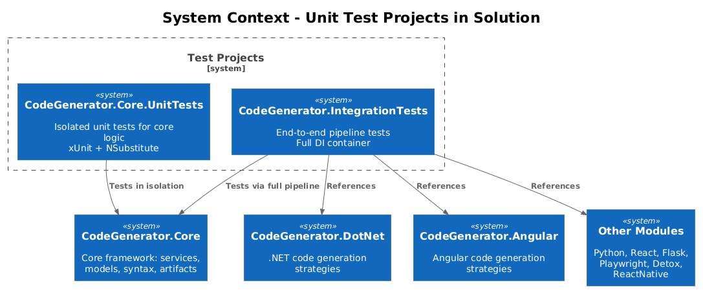
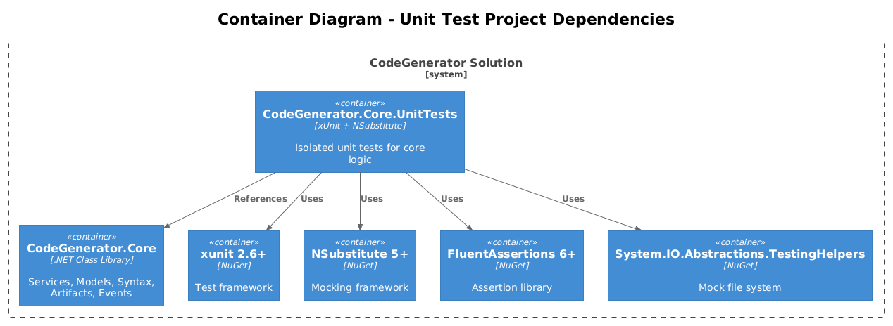
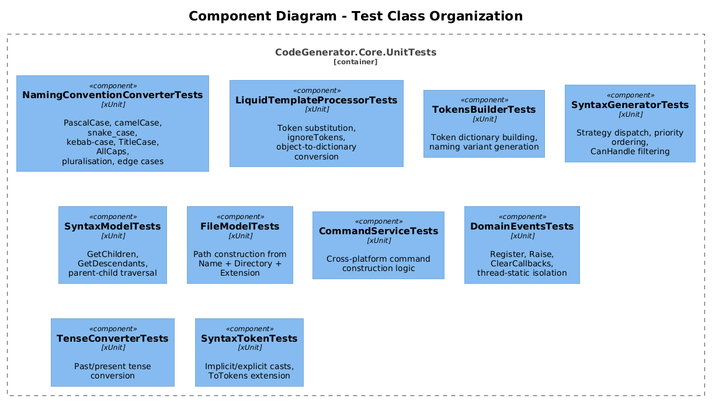
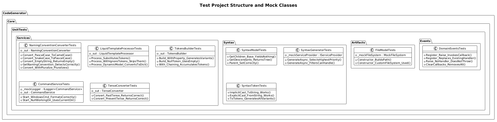
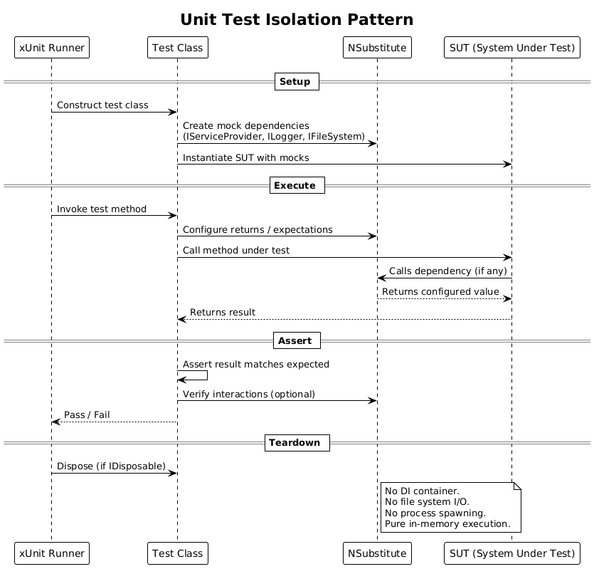

# Priority Action #10: Add Unit Tests for Core Logic

| Field | Value |
|-------|-------|
| **Status** | Implemented |
| **Priority** | 10 of 10 |
| **Effort** | Medium (3-5 days) |
| **Target Frameworks** | net8.0, net9.0 |
| **Test Framework** | xUnit 2.6+ |
| **Mocking Framework** | NSubstitute 5+ |
| **Assertion Library** | FluentAssertions 6+ |

---

## 1. Overview

The CodeGenerator framework currently has **only integration tests** in `tests/CodeGenerator.IntegrationTests/`. These tests boot the entire DI container, register all module strategies (DotNet, Angular, Python, React, Flask, Playwright, Detox, ReactNative), and exercise the full generation pipeline through `ISyntaxGenerator`. While valuable for end-to-end confidence, they provide no isolation for individual components, making failures hard to diagnose and introducing unnecessary coupling between unrelated modules.

This design introduces a new `CodeGenerator.Core.UnitTests` project containing isolated, fast, deterministic unit tests for nine core components:

1. **NamingConventionConverter** -- naming-case conversion and pluralization
2. **LiquidTemplateProcessor** -- Liquid template token substitution
3. **TokensBuilder** -- token dictionary construction with naming variants
4. **SyntaxGenerator / ArtifactGenerator** -- strategy dispatch (priority, CanHandle)
5. **SyntaxModel** -- tree traversal (GetChildren, GetDescendants)
6. **FileModel** -- file-path construction
7. **CommandService** -- cross-platform process construction
8. **DomainEvents** -- static event register/raise system
9. **TenseConverter** -- verb tense conversion via SimpleNLG

### Goals

- Achieve at least **80% line coverage** on `CodeGenerator.Core` services and models.
- Keep every test under **100 ms** with zero external I/O.
- Establish patterns (base classes, helpers, naming conventions) that module-level unit tests can reuse later.
- Run in CI on both `net8.0` and `net9.0` with no platform-specific failures.

### Non-Goals

- Testing module-specific strategies (DotNet, Angular, etc.) -- those belong in future per-module test projects.
- Replacing the existing integration tests -- they remain for pipeline-level confidence.
- Achieving 100% coverage on internal/private helpers that are only reachable through public API.

---

## 2. Architecture

### 2.1 System Context

How the new unit test project fits alongside the existing integration test project within the solution.



**Source:** [`diagrams/c4_context.puml`](diagrams/c4_context.puml)

### 2.2 Container Diagram

Dependencies of the unit test project -- only `CodeGenerator.Core` plus test infrastructure packages. No module projects referenced.



**Source:** [`diagrams/c4_container.puml`](diagrams/c4_container.puml)

### 2.3 Component Diagram

Test class organization by the component under test.



**Source:** [`diagrams/c4_component.puml`](diagrams/c4_component.puml)

---

## 3. Test Strategy

### 3.1 Unit vs Integration Boundary

| Aspect | Unit Tests (new) | Integration Tests (existing) |
|--------|-----------------|----------------------------|
| **Scope** | Single class, one method | Full pipeline through DI container |
| **Dependencies** | Mocked or none | Real implementations, all modules |
| **Speed** | < 100 ms per test | Seconds per test |
| **DI Container** | Never used | Full `ServiceCollection` with all modules |
| **File System** | `MockFileSystem` from `System.IO.Abstractions.TestingHelpers` | Real file system |
| **External Processes** | Never spawned | May spawn `cmd.exe` / `bash` |
| **Failure Diagnosis** | Pinpoints exact class and method | Requires debugging through pipeline |

### 3.2 What to Test at the Unit Level

Components with **pure logic** or **minimal dependencies** that can be constructed directly:

- `NamingConventionConverter` -- all static and instance methods, no dependencies
- `LiquidTemplateProcessor` -- depends only on DotLiquid (deterministic library)
- `TokensBuilder` -- depends on `SyntaxToken.ToTokens()`, both are pure
- `SyntaxModel` / `ArtifactModel` -- POCO tree traversal, no dependencies
- `FileModel` -- constructor logic, mockable via `IFileSystem`
- `DomainEvents` -- static class with `[ThreadStatic]` field, fully deterministic
- `SyntaxToken` -- record with implicit/explicit cast operators
- `TenseConverter` -- depends on SimpleNLG (deterministic library)

Components requiring **mock injection**:

- `CommandService` -- needs `ILogger<CommandService>`, process construction is testable without spawning
- `SyntaxGenerator` -- needs `IServiceProvider` to resolve `ISyntaxGenerationStrategy<T>` collections
- `ArtifactGenerator` -- needs `IServiceProvider` and `ILogger<ArtifactGenerator>`

### 3.3 What Stays at Integration Level

- Full pipeline: model in, generated code out
- Strategy registration correctness (do all modules register their strategies?)
- Template file loading from embedded resources
- Cross-module interactions

---

## 4. Component Details

### 4.1 Test Project Structure

```
tests/
  CodeGenerator.Core.UnitTests/
    CodeGenerator.Core.UnitTests.csproj
    Services/
      NamingConventionConverterTests.cs
      LiquidTemplateProcessorTests.cs
      TokensBuilderTests.cs
      CommandServiceTests.cs
      TenseConverterTests.cs
    Syntax/
      SyntaxModelTests.cs
      SyntaxGeneratorTests.cs
      SyntaxTokenTests.cs
      SyntaxExtensionsTests.cs
    Artifacts/
      FileModelTests.cs
      ArtifactGeneratorTests.cs
      ArtifactModelTests.cs
    Events/
      DomainEventsTests.cs
    Helpers/
      TestStrategyFactory.cs
```

### 4.2 Project File

```xml
<Project Sdk="Microsoft.NET.Sdk">
  <PropertyGroup>
    <TargetFrameworks>net8.0;net9.0</TargetFrameworks>
    <ImplicitUsings>enable</ImplicitUsings>
    <Nullable>enable</Nullable>
    <LangVersion>latest</LangVersion>
    <IsPackable>false</IsPackable>
    <IsTestProject>true</IsTestProject>
  </PropertyGroup>

  <ItemGroup>
    <PackageReference Include="Microsoft.NET.Test.Sdk" Version="17.8.0" />
    <PackageReference Include="xunit" Version="2.6.2" />
    <PackageReference Include="xunit.runner.visualstudio" Version="2.5.4" />
    <PackageReference Include="NSubstitute" Version="5.1.0" />
    <PackageReference Include="FluentAssertions" Version="6.12.0" />
    <PackageReference Include="System.IO.Abstractions.TestingHelpers" Version="19.2.51" />
    <PackageReference Include="Microsoft.Extensions.Logging" Version="9.0.0" />
    <PackageReference Include="Microsoft.Extensions.DependencyInjection" Version="9.0.0" />
  </ItemGroup>

  <ItemGroup>
    <ProjectReference Include="..\..\src\CodeGenerator.Core\CodeGenerator.Core.csproj" />
  </ItemGroup>
</Project>
```

Key point: **only `CodeGenerator.Core` is referenced**. No module projects. This enforces the isolation boundary.

### 4.3 Test Categories (xUnit Traits)

```csharp
[Trait("Category", "Unit")]           // All tests in this project
[Trait("Component", "NamingConverter")]  // Per-component filtering
[Trait("Component", "TemplateProcessor")]
[Trait("Component", "TokensBuilder")]
[Trait("Component", "SyntaxGenerator")]
[Trait("Component", "SyntaxModel")]
[Trait("Component", "FileModel")]
[Trait("Component", "CommandService")]
[Trait("Component", "DomainEvents")]
[Trait("Component", "TenseConverter")]
```

### 4.4 Coverage Targets

| Component | Target | Rationale |
|-----------|--------|-----------|
| NamingConventionConverter | 95% | Pure logic, all branches reachable |
| LiquidTemplateProcessor | 85% | Async methods throw NotImplementedException (excluded) |
| TokensBuilder | 90% | Fluent builder, straightforward |
| SyntaxGenerator | 80% | Strategy dispatch requires mock wiring |
| SyntaxModel | 95% | Simple tree traversal |
| FileModel | 95% | Constructor-only logic |
| CommandService | 70% | Process.Start() not callable in unit tests; test construction only |
| DomainEvents | 95% | Static class, fully testable |
| TenseConverter | 85% | Depends on SimpleNLG library edge cases |
| **Overall Core** | **80%+** | |

---

## 5. Test Plan

### 5.1 NamingConventionConverter

#### 5.1.1 Convert -- PascalCase output

| # | Given | When | Then |
|---|-------|------|------|
| 1 | Input `"orderItem"` (camelCase) | `Convert(PascalCase, "orderItem")` | Returns `"OrderItem"` |
| 2 | Input `"order-item"` (kebab) | `Convert(PascalCase, "order-item")` | Returns `"OrderItem"` |
| 3 | Input `"order_item"` (snake) | `Convert(PascalCase, "order_item")` | Returns `"OrderItem"` |
| 4 | Input `"order item"` (title) | `Convert(PascalCase, "order item")` | Returns `"OrderItem"` |
| 5 | Input `""` (empty) | `Convert(PascalCase, "")` | Returns `""` |
| 6 | Input `null` | `Convert(PascalCase, null)` | Returns `""` |

#### 5.1.2 Convert -- CamelCase output

| # | Given | When | Then |
|---|-------|------|------|
| 7 | Input `"OrderItem"` (PascalCase) | `Convert(CamelCase, "OrderItem")` | Returns `"orderItem"` |
| 8 | Input `"ORDER_ITEM"` (AllCaps) | `Convert(CamelCase, "ORDER_ITEM")` | Returns `"orderItem"` |
| 9 | Input `"order-item"` (kebab) | `Convert(CamelCase, "order-item")` | Returns `"orderItem"` |

#### 5.1.3 Convert -- SnakeCase output

| # | Given | When | Then |
|---|-------|------|------|
| 10 | Input `"OrderItem"` | `Convert(SnakeCase, "OrderItem")` | Returns `"order-item"` |
| 11 | Input `"orderItem"` | `Convert(SnakeCase, "orderItem")` | Returns `"order-item"` |

#### 5.1.4 Convert -- AllCaps output

| # | Given | When | Then |
|---|-------|------|------|
| 12 | Input `"OrderItem"` | `Convert(AllCaps, "OrderItem")` | Returns `"ORDER_ITEM"` |

#### 5.1.5 Convert -- KebobCase output

| # | Given | When | Then |
|---|-------|------|------|
| 13 | Input `"OrderItem"` | `Convert(KebobCase, "OrderItem")` | Returns `"order_item"` |
| 14 | Input `"_privateField"` | `Convert(KebobCase, "_privateField")` | Preserves leading underscore |

#### 5.1.6 Convert -- TitleCase output

| # | Given | When | Then |
|---|-------|------|------|
| 15 | Input `"orderItem"` | `Convert(TitleCase, "orderItem")` | Returns `"Order Item"` |

#### 5.1.7 Convert -- Pluralization

| # | Given | When | Then |
|---|-------|------|------|
| 16 | Input `"Order"`, pluralize=true | `Convert(PascalCase, "Order", true)` | Returns `"Orders"` |
| 17 | Input `"Orders"`, pluralize=false | `Convert(PascalCase, "Orders", false)` | Returns `"Order"` |
| 18 | Input `"Person"`, pluralize=true | `Convert(PascalCase, "Person", true)` | Returns `"People"` |

#### 5.1.8 GetNamingConvention -- Detection

| # | Given | When | Then |
|---|-------|------|------|
| 19 | Input `"orderItem"` | `GetNamingConvention("orderItem")` | Returns `CamelCase` |
| 20 | Input `"OrderItem"` | `GetNamingConvention("OrderItem")` | Returns `PascalCase` |
| 21 | Input `"order-item"` | `GetNamingConvention("order-item")` | Returns `SnakeCase` |
| 22 | Input `""` | `GetNamingConvention("")` | Returns `None` |
| 23 | Input `null` | `GetNamingConvention(null)` | Returns `None` |
| 24 | Input `"Order Item"` | `GetNamingConvention("Order Item")` | Returns `TitleCase` |

#### 5.1.9 Static helpers

| # | Given | When | Then |
|---|-------|------|------|
| 25 | Input `"OrderItem"` | `CamelCase("OrderItem")` | Returns `"orderItem"` |
| 26 | Input `"OrderItem"` | `PascalCaseToTitleCase("OrderItem")` | Returns `"Order Item"` |
| 27 | Input `""` | `PascalCaseToTitleCase("")` | Returns `""` |
| 28 | Input `"order_item"` | `SnakeCaseToPascalCase("order_item")` | Returns `"OrderItem"` |

---

### 5.2 LiquidTemplateProcessor

| # | Given | When | Then |
|---|-------|------|------|
| 29 | Template `"Hello {{ name }}"`, tokens `{name: "World"}` | `Process(template, tokens)` | Returns `"Hello World"` |
| 30 | Template `"{{ a }} and {{ b }}"`, tokens `{a: "X", b: "Y"}` | `Process(template, tokens)` | Returns `"X and Y"` |
| 31 | Template with `{{ secret }}`, ignoreTokens `["secret"]` | `Process(template, tokens, ["secret"])` | `{{ secret }}` is not replaced |
| 32 | Template with no tokens | `Process(template, {})` | Returns template verbatim (minus Liquid markers) |
| 33 | Dynamic model with string properties | `Process(template, model)` | Converts model to dictionary, substitutes |
| 34 | Dynamic model with `List<string>` property | `Process(template, model)` | List is accessible in Liquid iteration |
| 35 | Invalid Liquid syntax in template | `Process(template, tokens)` | DotLiquid handles gracefully or throws |

---

### 5.3 TokensBuilder

| # | Given | When | Then |
|---|-------|------|------|
| 36 | `With("Entity", "Order")` | `Build()` | Dictionary contains keys: `Entity`, `entityPascalCase`, `entityCamelCase`, `entitySnakeCase`, etc. |
| 37 | `With("Entity", (SyntaxToken)null)` | `Build()` | Uses empty string, no NullReferenceException |
| 38 | `With("A", "X").With("B", "Y")` | `Build()` | Dictionary contains variants for both A and B |
| 39 | Property name with underscore prefix `"m_Name"` | `Build()` | Prefix stripped per `propertyName.Substring(IndexOf('_') + 1)` |

---

### 5.4 SyntaxGenerator (Strategy Dispatch)

| # | Given | When | Then |
|---|-------|------|------|
| 40 | Two strategies for same type, priorities 1 and 10 | `GenerateAsync(model)` | Strategy with priority 10 is selected |
| 41 | Two strategies, only one returns `CanHandle(model)=true` | `GenerateAsync(model)` | The CanHandle=true strategy is selected |
| 42 | No registered strategy for model type | `GenerateAsync(model)` | Throws `InvalidOperationException` |
| 43 | Strategy returns expected string | `GenerateAsync(model)` | Returns that string |

---

### 5.5 SyntaxModel (Tree Traversal)

| # | Given | When | Then |
|---|-------|------|------|
| 44 | Base `SyntaxModel` instance | `GetChildren()` | Yields empty sequence |
| 45 | Base `SyntaxModel` instance | `GetDescendants()` | Returns list containing only itself |
| 46 | Custom subclass overriding `GetChildren` with 2 children | `GetDescendants()` | Returns 3 items (self + 2 children) |
| 47 | Three-level tree (root -> child -> grandchild) | `GetDescendants()` on root | Returns all 3 nodes |
| 48 | Model with `Parent` set | Access `model.Parent` | Returns the assigned parent |
| 49 | Model with null children mixed in `GetChildren` override | `GetDescendants()` | Null children are skipped |

---

### 5.6 FileModel

| # | Given | When | Then |
|---|-------|------|------|
| 50 | Name=`"Order"`, Dir=`"C:\\src"`, Ext=`".cs"` | Construct `FileModel` | `Path` = `"C:\\src\\Order.cs"` |
| 51 | Name=`"index"`, Dir=`"/app/src"`, Ext=`".ts"` | Construct `FileModel` | `Path` = `"/app/src/index.ts"` |
| 52 | Custom `MockFileSystem` injected | Construct `FileModel` | Uses mock file system for path combination |
| 53 | Default (no IFileSystem argument) | Construct `FileModel` | Falls back to real `FileSystem` |

---

### 5.7 CommandService

| # | Given | When | Then |
|---|-------|------|------|
| 54 | Constructed with mock `ILogger` | Instantiation | No exceptions |
| 55 | `null` logger passed to constructor | Instantiation | Throws `ArgumentNullException` |

> **Note:** `Start()` spawns real processes and cannot be unit-tested safely. The cross-platform branching logic (`IsUnix()`, `UnixBash()`, `WindowsCmd()`) uses private methods. To unit-test command construction, a refactoring (extract `BuildProcessStartInfo`) is recommended as a follow-up. For now, the constructor guard and logger injection are tested.

---

### 5.8 DomainEvents

| # | Given | When | Then |
|---|-------|------|------|
| 56 | Register a callback for `CustomEvent` | `Raise(new CustomEvent())` | Callback is invoked |
| 57 | Register two callbacks for same type | `Raise(event)` | Second registration replaces first |
| 58 | No handler registered | `Raise(event)` | Does not throw |
| 59 | Register a handler, then `ClearCallbacks()` | `Raise(event)` | Callback is NOT invoked |
| 60 | Register handler for type A, raise type B | `Raise(new B())` | Type A handler is not invoked |

---

### 5.9 TenseConverter

| # | Given | When | Then |
|---|-------|------|------|
| 61 | Verb `"create"`, pastTense=true | `Convert("create", true)` | Returns `"Created"` (sentence-cased, no period) |
| 62 | Verb `"create"`, pastTense=false | `Convert("create", false)` | Returns `"Create"` or `"Creates"` |
| 63 | Verb `"delete"`, pastTense=true | `Convert("delete", true)` | Returns `"Deleted"` |
| 64 | Irregular verb `"run"`, pastTense=true | `Convert("run", true)` | Returns `"Ran"` |

---

### 5.10 SyntaxToken and SyntaxExtensions

| # | Given | When | Then |
|---|-------|------|------|
| 65 | `SyntaxToken("Order")` | Implicit cast to `string` | Returns `"Order"` |
| 66 | `(SyntaxToken)"Order"` | Explicit cast from string | Creates `SyntaxToken` with Value `"Order"` |
| 67 | `token.ToTokens("Entity")` | Call extension | Dictionary has 8 keys (raw + 7 variants) |
| 68 | `token.PascalCase()` | Call extension | Returns PascalCase of token value |
| 69 | `token.CamelCasePlural()` | Call extension | Returns pluralized camelCase |

---

## 6. Data Model

### Test Project Structure



**Source:** [`diagrams/class_diagram.puml`](diagrams/class_diagram.puml)

---

## 7. Key Workflows

### 7.1 Unit Test Isolation Pattern

Every unit test follows the same pattern: construct the SUT with mocked (or no) dependencies, invoke a single method, and assert the result. No DI container is involved.



**Source:** [`diagrams/sequence_test_execution.puml`](diagrams/sequence_test_execution.puml)

### 7.2 CI Integration

```yaml
# Extend existing CI pipeline
- name: Run Unit Tests
  run: dotnet test tests/CodeGenerator.Core.UnitTests --configuration Release --logger "trx;LogFileName=unit-tests.trx"

- name: Run Integration Tests
  run: dotnet test tests/CodeGenerator.IntegrationTests --configuration Release --logger "trx;LogFileName=integration-tests.trx"
```

Unit tests run first (fast feedback). Integration tests run second. Both must pass for CI to be green.

### 7.3 Local Development Workflow

```bash
# Run only unit tests (fast, < 5 seconds)
dotnet test tests/CodeGenerator.Core.UnitTests

# Run only a specific component
dotnet test tests/CodeGenerator.Core.UnitTests --filter "Component=NamingConverter"

# Run everything
dotnet test
```

---

## 8. Mocking Strategy

### 8.1 What to Mock

| Dependency | Where Used | Mock With |
|-----------|-----------|-----------|
| `IServiceProvider` | `SyntaxGenerator`, `ArtifactGenerator` | NSubstitute -- configure `GetService<IEnumerable<ISyntaxGenerationStrategy<T>>>()` to return test strategy lists |
| `ILogger<T>` | `CommandService`, `ArtifactGenerator` | `NSubstitute.Substitute.For<ILogger<T>>()` -- verify log calls or just satisfy constructor |
| `IFileSystem` | `FileModel` | `System.IO.Abstractions.TestingHelpers.MockFileSystem` -- control path combining behavior |
| `IFileProvider` | Not used in core unit tests | Only needed in integration/module tests |
| `ICommandService` | Not used in core unit tests (it IS the SUT) | Would be mocked in consumers |

### 8.2 What NOT to Mock

- `NamingConventionConverter` -- pure logic, no dependencies, test directly
- `LiquidTemplateProcessor` -- DotLiquid is deterministic, test with real library
- `TokensBuilder` -- pure builder, test directly
- `SyntaxModel` / `ArtifactModel` -- POCOs, test directly
- `DomainEvents` -- static class, test directly (use `ClearCallbacks()` in teardown)
- `TenseConverter` -- SimpleNLG is deterministic, test with real library
- `SyntaxToken` -- record type, test directly

### 8.3 Test Strategy Helpers

For `SyntaxGenerator` and `ArtifactGenerator` tests, create a `TestStrategyFactory` helper:

```csharp
// Helpers/TestStrategyFactory.cs
internal static class TestStrategyFactory
{
    internal static ISyntaxGenerationStrategy<T> Create<T>(
        int priority = 1,
        bool canHandle = true,
        string result = "")
    {
        var strategy = Substitute.For<ISyntaxGenerationStrategy<T>>();
        strategy.GetPriority().Returns(priority);
        strategy.CanHandle(Arg.Any<object>()).Returns(canHandle);
        strategy.GenerateAsync(Arg.Any<T>(), Arg.Any<CancellationToken>())
            .Returns(Task.FromResult(result));
        return strategy;
    }
}
```

### 8.4 DomainEvents Isolation

Because `DomainEvents` uses `[ThreadStatic]` storage, each test must call `DomainEvents.ClearCallbacks()` in setup/teardown to avoid cross-test contamination:

```csharp
public class DomainEventsTests : IDisposable
{
    public DomainEventsTests()
    {
        DomainEvents.ClearCallbacks();
    }

    public void Dispose()
    {
        DomainEvents.ClearCallbacks();
    }
}
```

---

## 9. Implementation Sequence

| Phase | Tasks | Est. |
|-------|-------|------|
| **Phase 1** | Create project, add to solution, write `NamingConventionConverterTests` (28 tests) | 1 day |
| **Phase 2** | `LiquidTemplateProcessorTests`, `TokensBuilderTests`, `SyntaxTokenTests` (18 tests) | 1 day |
| **Phase 3** | `SyntaxModelTests`, `FileModelTests`, `ArtifactModelTests` (10 tests) | 0.5 day |
| **Phase 4** | `DomainEventsTests`, `TenseConverterTests`, `CommandServiceTests` (12 tests) | 0.5 day |
| **Phase 5** | `SyntaxGeneratorTests`, `ArtifactGeneratorTests` with mock wiring (5 tests) | 1 day |
| **Phase 6** | CI integration, coverage reporting, documentation | 0.5 day |

**Total: ~69 test cases across 13 test classes.**

---

## 10. Open Questions

| # | Question | Impact | Proposed Resolution |
|---|----------|--------|-------------------|
| 1 | Should `CommandService` private methods (`UnixBash`, `WindowsCmd`) be refactored to be testable? | Medium -- currently untestable command construction logic | Extract a `BuildProcessStartInfo(string arguments, string workingDirectory)` method that returns `ProcessStartInfo` without starting a process. Test that method. |
| 2 | Should `NamingConvention.KebobCase` be renamed to `KebabCase` (fixing the typo)? | Low -- cosmetic but affects public API | Defer to a separate PR with an `[Obsolete]` alias for backward compatibility. |
| 3 | Should `LiquidTemplateProcessor.ProcessAsync` methods be implemented or removed? | Low -- they all throw `NotImplementedException` | Remove or implement in a separate PR. Exclude from coverage. |
| 4 | Is `ArtifactModel.GetDescendants` correct? It iterates `children` while adding to `children`, which may cause infinite recursion. | High -- potential bug | Investigate and fix as part of Phase 3. The `SyntaxModel.GetDescendants` iterates `syntax.GetChildren()` which is correct; `ArtifactModel` iterates the accumulator list which is a bug. |
| 5 | Should we adopt `coverlet` for code coverage collection in CI? | Medium -- needed for coverage gates | Add `coverlet.collector` NuGet package and `--collect:"XPlat Code Coverage"` to `dotnet test` invocation. |
| 6 | Should we use `[Theory]` with `[InlineData]` for parameterized naming tests or separate `[Fact]` methods? | Low -- style preference | Use `[Theory]`/`[InlineData]` for conversion tables (tests 1-18) and `[Fact]` for edge cases. |
| 7 | Should the `SyntaxGenerationStrategyWrapperImplementation<T>` static `ConcurrentDictionary` cache be cleared between tests? | Medium -- shared static state | Create a test helper that resets the cache via reflection, or accept that the cache is additive and harmless in tests. |
