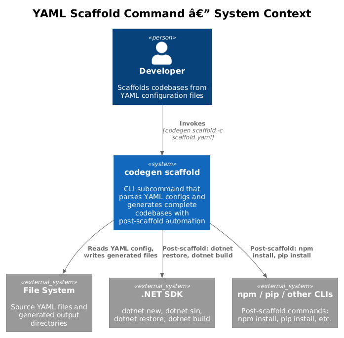
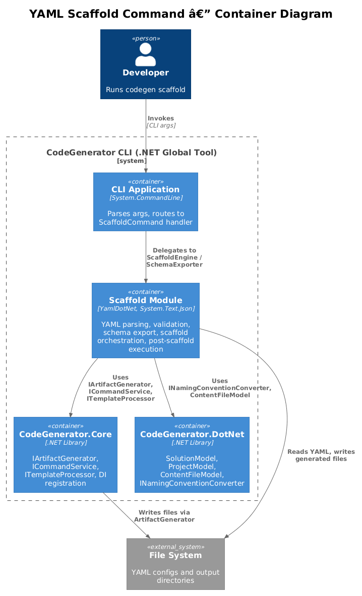
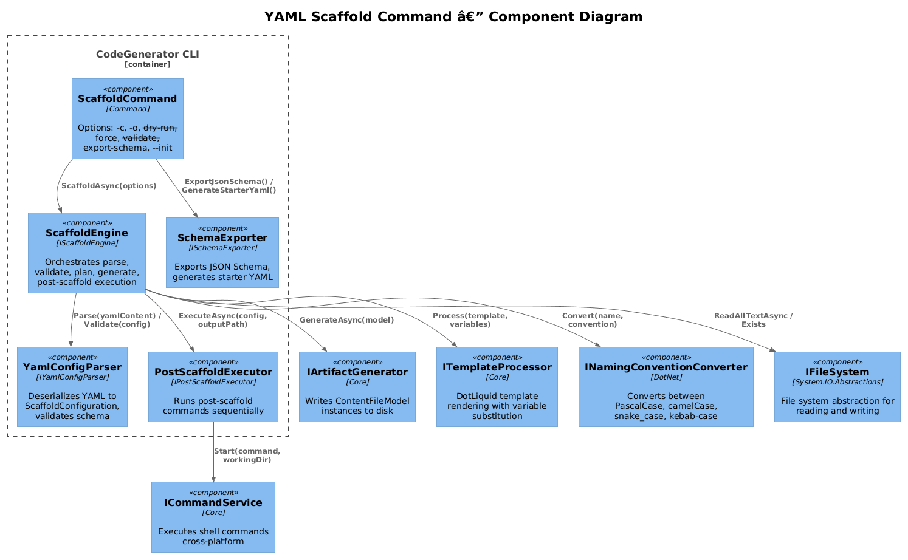
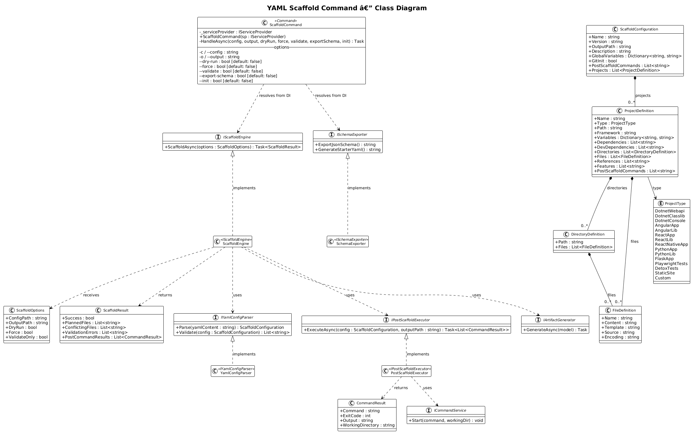
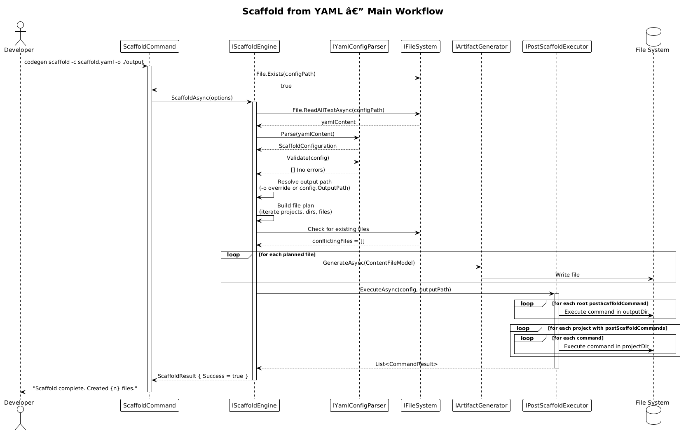
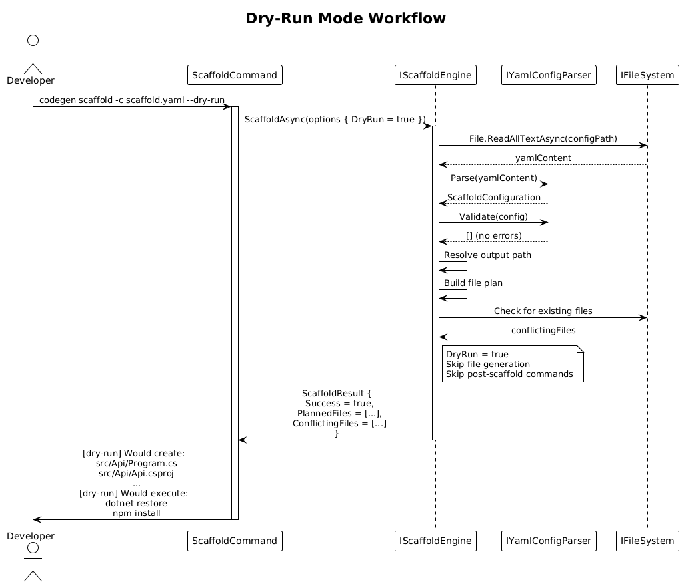
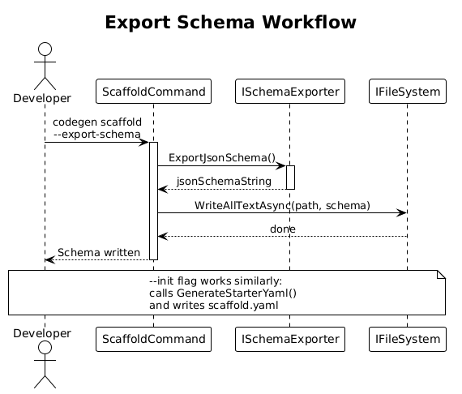

# YAML Scaffold CLI Command — Detailed Design

## 1. Overview

The `scaffold` command is a subcommand of `CreateCodeGeneratorCommand` that accepts a YAML configuration file and generates an entire codebase from its declarative description. It parses the YAML into a `ScaffoldConfiguration` model, validates the configuration against a schema, orchestrates file generation through the existing `IArtifactGenerator` pipeline, and executes post-scaffold commands upon completion. Supporting modes include dry-run (preview without writing), validate-only (schema check), force (overwrite conflicts), JSON Schema export, and starter YAML generation.

**Actors:** Developer — invokes `codegen scaffold -c ./scaffold.yaml` from a terminal to generate a codebase from a YAML configuration file.

**Scope:** The `ScaffoldCommand`, its supporting services (`IScaffoldEngine`, `IYamlConfigParser`, `ISchemaExporter`, `IPostScaffoldExecutor`), and their integration with the existing CodeGenerator.Core and CodeGenerator.DotNet services. This covers requirements **FR-19.1**, **FR-19.10**, and **FR-19.11** from [L2-YamlScaffolding.md](../../specs/L2-YamlScaffolding.md).

## 2. Architecture

### 2.1 C4 Context Diagram

Shows the scaffold command in its broader ecosystem — the developer, file system, .NET SDK, and external package managers invoked by post-scaffold commands.



The developer invokes `codegen scaffold -c scaffold.yaml`. The CLI reads the YAML file from the file system, generates the described codebase to the output directory, and optionally executes post-scaffold commands that may invoke the .NET SDK, npm, pip, or other CLI tools.

### 2.2 C4 Container Diagram

Shows the internal containers: the CLI application layer, CodeGenerator.Core, CodeGenerator.DotNet, and the new Scaffold module.



| Container | Technology | Responsibility |
|-----------|------------|----------------|
| CLI Application | System.CommandLine 2.0 | Arg parsing, command routing, handler orchestration |
| Scaffold Module | YamlDotNet, System.Text.Json | YAML parsing, schema validation, scaffold orchestration, post-scaffold execution |
| CodeGenerator.Core | .NET 9.0 Library | `IArtifactGenerator` (file writing), `ICommandService` (shell execution), `ITemplateProcessor` (DotLiquid rendering) |
| CodeGenerator.DotNet | .NET 9.0 Library | `SolutionModel`, `ProjectModel`, `ContentFileModel`, factories, DI services |

### 2.3 C4 Component Diagram

Shows the internal components within the Scaffold module and their interactions with core services.



## 3. Component Details

### 3.1 ScaffoldCommand — Subcommand (FR-19.1)

- **Responsibility:** Parses CLI arguments, resolves services from DI, and delegates to `IScaffoldEngine` or `ISchemaExporter` based on the flags provided.
- **Base Class:** `System.CommandLine.Command`
- **Command Name:** `scaffold`
- **Description:** `"Scaffolds a codebase from a YAML configuration file"`
- **Options:**

| Option | Aliases | Type | Required | Default | Traces To |
|--------|---------|------|----------|---------|-----------|
| Config | `-c`, `--config` | `string` | No* | — | FR-19.1 AC1 |
| Output | `-o`, `--output` | `string` | No | — | FR-19.1 AC2 |
| DryRun | `--dry-run` | `bool` | No | `false` | FR-19.1 AC4 |
| Force | `--force` | `bool` | No | `false` | FR-19.1 AC5 |
| Validate | `--validate` | `bool` | No | `false` | FR-19.1 AC6 |
| ExportSchema | `--export-schema` | `bool` | No | `false` | FR-19.11 AC1 |
| Init | `--init` | `bool` | No | `false` | FR-19.11 AC4 |

*`--config` is required unless `--export-schema` or `--init` is specified.

- **Dependencies:** `IScaffoldEngine`, `ISchemaExporter` (resolved from `IServiceProvider`)
- **Parent Command:** Added as a subcommand of `CreateCodeGeneratorCommand` in its constructor
- **Handler Flow:** See Section 5.1 for the main scaffold workflow.

### 3.2 IScaffoldEngine / ScaffoldEngine — Orchestrator

- **Responsibility:** Orchestrates the full scaffold pipeline: parse YAML, validate, plan files, generate artifacts, execute post-scaffold commands. Serves as the single entry point for all scaffold operations.
- **Interface:**

```csharp
public interface IScaffoldEngine
{
    Task<ScaffoldResult> ScaffoldAsync(ScaffoldOptions options);
}
```

- **ScaffoldOptions:**

| Property | Type | Description |
|----------|------|-------------|
| ConfigPath | `string` | Absolute path to the YAML configuration file |
| OutputPath | `string?` | Override for the YAML `outputPath` (from `-o`) |
| DryRun | `bool` | If true, plan files but do not write |
| Force | `bool` | If true, overwrite existing files |
| ValidateOnly | `bool` | If true, validate YAML and return without generating |

- **ScaffoldResult:**

| Property | Type | Description |
|----------|------|-------------|
| Success | `bool` | Whether the operation completed without errors |
| PlannedFiles | `List<string>` | Relative paths of files that would be / were created |
| ConflictingFiles | `List<string>` | Files that already exist and would be overwritten |
| ValidationErrors | `List<string>` | Schema or semantic validation errors |
| PostCommandResults | `List<CommandResult>` | Results of post-scaffold command execution |

- **Dependencies:** `IYamlConfigParser`, `IArtifactGenerator`, `ITemplateProcessor`, `INamingConventionConverter`, `IFileSystem`, `IPostScaffoldExecutor`, `ILogger<ScaffoldEngine>`
- **Behavior:**
  1. Read the YAML file from disk via `IFileSystem`
  2. Parse via `IYamlConfigParser` into `ScaffoldConfiguration`
  3. Validate the configuration (required fields, valid enums, reference integrity)
  4. If `ValidateOnly`, return validation result
  5. Build a file plan (list of paths and content)
  6. Check for conflicts (existing files without `--force`)
  7. If `DryRun`, return the plan without writing
  8. Generate files via `IArtifactGenerator`
  9. Execute post-scaffold commands via `IPostScaffoldExecutor`
  10. Return `ScaffoldResult`

### 3.3 IYamlConfigParser / YamlConfigParser

- **Responsibility:** Deserializes a YAML string into a strongly-typed `ScaffoldConfiguration` object graph. Handles YamlDotNet deserialization, type coercion, and parse error reporting.
- **Interface:**

```csharp
public interface IYamlConfigParser
{
    ScaffoldConfiguration Parse(string yamlContent);
    List<string> Validate(ScaffoldConfiguration config);
}
```

- **Dependencies:** YamlDotNet `IDeserializer` (configured with `NamingConvention = CamelCaseNamingConvention`)
- **Error Handling:** Wraps `YamlException` into user-friendly error messages with line/column information.

### 3.4 ISchemaExporter / SchemaExporter (FR-19.11)

- **Responsibility:** Generates a JSON Schema document describing the YAML configuration structure, and generates a starter YAML file with inline documentation.
- **Interface:**

```csharp
public interface ISchemaExporter
{
    string ExportJsonSchema();
    string GenerateStarterYaml();
}
```

- **ExportJsonSchema:** Uses `System.Text.Json` schema generation (or manual construction) to produce a JSON Schema that covers all properties of `ScaffoldConfiguration`, including enums, required fields, and descriptions. Output is suitable for YAML editor autocompletion (e.g., VS Code YAML extension with `$schema` reference).
- **GenerateStarterYaml:** Produces a minimal, commented `scaffold.yaml` with all top-level and commonly used properties documented inline.
- **Dependencies:** None (stateless, operates on the `ScaffoldConfiguration` type metadata)

### 3.5 IPostScaffoldExecutor / PostScaffoldExecutor (FR-19.10)

- **Responsibility:** Executes shell commands defined in `postScaffoldCommands` at both the root and project levels after file generation completes.
- **Interface:**

```csharp
public interface IPostScaffoldExecutor
{
    Task<List<CommandResult>> ExecuteAsync(
        ScaffoldConfiguration config,
        string resolvedOutputPath);
}
```

- **Dependencies:** `ICommandService` (from CodeGenerator.Core), `ILogger<PostScaffoldExecutor>`
- **Behavior:**
  1. Execute root-level `postScaffoldCommands` sequentially in the output directory
  2. For each project with `postScaffoldCommands`, execute sequentially in that project's resolved directory
  3. On command failure (non-zero exit code): log the error, record it in results, continue with remaining commands
  4. Return all results so the caller can determine overall success/failure
- **CommandResult:**

| Property | Type | Description |
|----------|------|-------------|
| Command | `string` | The shell command that was executed |
| ExitCode | `int` | Process exit code |
| Output | `string` | Combined stdout/stderr |
| WorkingDirectory | `string` | Directory the command ran in |

## 4. Data Model

### 4.1 Class Diagram



### 4.2 Entity Descriptions

| Class | Responsibility |
|-------|----------------|
| `ScaffoldCommand` | CLI command. Holds options (`-c`, `-o`, `--dry-run`, `--force`, `--validate`, `--export-schema`, `--init`). Delegates to `IScaffoldEngine` or `ISchemaExporter`. |
| `ScaffoldConfiguration` | Root YAML model. Contains `name`, `version`, `outputPath`, `description`, `globalVariables`, `gitInit`, `postScaffoldCommands`, and `projects` list. |
| `ProjectDefinition` | A single project within the configuration. Contains `name`, `type`, `path`, `framework`, `variables`, `dependencies`, `directories`, `files`, `references`, `features`, `postScaffoldCommands`. |
| `DirectoryDefinition` | A directory to create, with optional nested `files`. |
| `FileDefinition` | A file to generate. Requires `name` and one of `content`, `template`, or `source`. Optional `encoding`. |
| `IScaffoldEngine` | Orchestrates parse, validate, plan, generate, and post-scaffold execution. |
| `IYamlConfigParser` | Parses YAML string to `ScaffoldConfiguration`. Validates the model. |
| `ISchemaExporter` | Exports JSON Schema. Generates starter YAML. |
| `IPostScaffoldExecutor` | Runs post-scaffold commands via `ICommandService`. |

**Relationships:**
- `ScaffoldCommand` depends on `IScaffoldEngine` and `ISchemaExporter` (resolved from DI)
- `IScaffoldEngine` depends on `IYamlConfigParser`, `IArtifactGenerator`, `ITemplateProcessor`, `IFileSystem`, `IPostScaffoldExecutor`
- `ScaffoldConfiguration` contains a list of `ProjectDefinition` (composition)
- `ProjectDefinition` contains lists of `DirectoryDefinition` and `FileDefinition` (composition)
- `DirectoryDefinition` contains an optional list of `FileDefinition` (composition)

## 5. Key Workflows

### 5.1 Scaffold from YAML (FR-19.1 AC1, AC2)

When the developer runs `codegen scaffold -c ./scaffold.yaml -o ./output`:



**Step-by-step:**

1. **Parse arguments** -- System.CommandLine parses `-c`, `-o` and invokes `ScaffoldCommand.HandleAsync`.
2. **Validate file exists** -- Check that the config file exists. If not, return error "Configuration file not found: {path}" with exit code 1 (FR-19.1 AC3).
3. **Read YAML** -- Read the file content via `IFileSystem.File.ReadAllTextAsync()`.
4. **Parse YAML** -- `IYamlConfigParser.Parse()` deserializes into `ScaffoldConfiguration`.
5. **Validate configuration** -- `IYamlConfigParser.Validate()` checks required fields, valid enums, reference integrity. If errors, report and exit.
6. **Resolve output path** -- Use `-o` override if provided, otherwise use `ScaffoldConfiguration.OutputPath`, defaulting to current directory.
7. **Build file plan** -- Iterate projects, directories, and files to build the complete list of artifacts to generate.
8. **Check conflicts** -- Compare planned files against existing files on disk.
9. **Generate files** -- For each file: resolve content (inline, template, or source copy), apply template substitution with merged variables, write via `IArtifactGenerator.GenerateAsync()`.
10. **Execute post-scaffold commands** -- Delegate to `IPostScaffoldExecutor.ExecuteAsync()`.
11. **Report result** -- Log files created, commands executed, and any warnings.

### 5.2 Dry-Run Mode (FR-19.1 AC4)

When the developer runs `codegen scaffold -c ./scaffold.yaml --dry-run`:



**Step-by-step:**

1. **Parse and validate** -- Same as steps 1-6 of the main workflow.
2. **Build file plan** -- Same as step 7.
3. **Print plan** -- Output the list of files and directories that would be created, one per line.
4. **List post-scaffold commands** -- Print each command that would be executed, prefixed with `[dry-run]`.
5. **Exit** -- Return exit code 0 without writing any files or executing any commands.

### 5.3 Validate-Only Mode (FR-19.1 AC6)

1. Parse arguments, read YAML, parse into `ScaffoldConfiguration`.
2. Run `IYamlConfigParser.Validate()`.
3. If errors: print each error and exit with code 1.
4. If valid: print "Configuration is valid" and exit with code 0.

### 5.4 Export Schema / Init Starter YAML (FR-19.11)

When the developer runs `codegen scaffold --export-schema` or `codegen scaffold --init`:



**Step-by-step (--export-schema):**

1. **Resolve exporter** -- Get `ISchemaExporter` from DI.
2. **Generate schema** -- Call `ISchemaExporter.ExportJsonSchema()`.
3. **Output** -- If `-o` is specified, write to file. Otherwise, write to stdout.

**Step-by-step (--init):**

1. **Resolve exporter** -- Get `ISchemaExporter` from DI.
2. **Generate starter** -- Call `ISchemaExporter.GenerateStarterYaml()`.
3. **Write file** -- Write `scaffold.yaml` to the current directory (or `-o` path).

### 5.5 Post-Scaffold Command Execution (FR-19.10)

1. After all files are generated, `IScaffoldEngine` calls `IPostScaffoldExecutor.ExecuteAsync()`.
2. Root-level `postScaffoldCommands` execute first, sequentially, in the output directory.
3. Project-level `postScaffoldCommands` execute next, per project, in each project's resolved directory.
4. If a command fails (non-zero exit code), the error is logged and recorded, but execution continues with the remaining commands.
5. If any command failed, the overall scaffold result returns exit code 1 with a summary of failures.

## 6. CLI Contracts

### 6.1 Command Reference

```
codegen scaffold [options]

Options:
  -c, --config <path>          Path to YAML configuration file (required unless --export-schema or --init)
  -o, --output <path>          Override output directory (overrides YAML outputPath)
  --dry-run                    List files that would be created without writing [default: false]
  --force                      Overwrite existing files [default: false]
  --validate                   Validate YAML configuration only [default: false]
  --export-schema              Export JSON Schema for the YAML configuration to stdout
  --init                       Generate a starter scaffold.yaml in the current directory
```

### 6.2 Exit Codes

| Code | Meaning |
|------|---------|
| 0 | Success |
| 1 | Error: file not found, validation failure, conflict without `--force`, or post-scaffold command failure |

### 6.3 Example Invocations

```bash
# Scaffold a codebase from YAML
codegen scaffold -c ./scaffold.yaml

# Scaffold with output override
codegen scaffold -c ./scaffold.yaml -o /custom/path

# Preview what would be generated
codegen scaffold -c ./scaffold.yaml --dry-run

# Validate configuration without generating
codegen scaffold -c ./scaffold.yaml --validate

# Overwrite existing files
codegen scaffold -c ./scaffold.yaml --force

# Export JSON Schema for editor tooling
codegen scaffold --export-schema > scaffold-schema.json
codegen scaffold --export-schema -o scaffold-schema.json

# Generate a starter YAML configuration
codegen scaffold --init
```

## 7. Security Considerations

- **YAML parsing safety** -- YamlDotNet is configured with safe deserialization (no arbitrary type instantiation). The deserializer uses explicit type mappings to `ScaffoldConfiguration` and its children. YAML tags that attempt to reference .NET types are rejected.
- **Command injection via postScaffoldCommands** -- The `postScaffoldCommands` list allows arbitrary shell commands. This is an intentional design choice (the YAML file is authored by the developer running the tool), but the following mitigations apply:
  - Commands are logged before execution so the developer can see what runs.
  - In `--dry-run` mode, commands are listed but never executed.
  - The `--validate` mode does not execute commands.
  - The documentation will advise developers to review YAML files from untrusted sources before scaffolding.
- **File path traversal** -- File and directory paths in the YAML configuration are resolved relative to the output directory. The scaffold engine shall validate that resolved paths do not escape the output directory (e.g., `../../etc/passwd`). Paths containing `..` segments that resolve outside the output root shall be rejected with an error.
- **No secrets or credentials** -- The scaffold command does not handle authentication tokens or secrets. Template variables may contain sensitive values if the developer chooses, but these are stored in the developer's local YAML file, not transmitted anywhere.
- **Large file generation** -- No limit is imposed on the number of files or their size. Extremely large configurations could consume significant disk space. The `--dry-run` flag provides a preview mechanism.

## 8. Test Strategy

### 8.1 Unit Tests -- YamlConfigParser

| Test | Traces To |
|------|-----------|
| `[Fact] // Traces to: FR-19.1 - AC1` Parse valid YAML with all required fields returns populated ScaffoldConfiguration | FR-19.1 AC1 |
| `[Fact] // Traces to: FR-19.8 - AC1` Parse YAML missing required `name` property returns validation error | FR-19.8 AC1 |
| `[Fact] // Traces to: FR-19.8 - AC2` Parse YAML with invalid project type returns validation error | FR-19.8 AC2 |
| `[Fact] // Traces to: FR-19.8 - AC3` Validate YAML with reference to non-existent project returns error | FR-19.8 AC3 |
| `[Fact] // Traces to: FR-19.8 - AC4` Validate YAML with duplicate project names returns error | FR-19.8 AC4 |
| `[Fact]` Parse YAML with optional fields omitted returns defaults (outputPath = ".", gitInit = false) | FR-19.2 AC2 |
| `[Fact]` Parse malformed YAML returns error with line/column information | — |
| `[Fact]` Parse YAML with type coercion (string "true" to bool) succeeds | — |

### 8.2 Unit Tests -- SchemaExporter

| Test | Traces To |
|------|-----------|
| `[Fact] // Traces to: FR-19.11 - AC1` ExportJsonSchema returns valid JSON with $schema property | FR-19.11 AC1 |
| `[Fact] // Traces to: FR-19.11 - AC3` ExportJsonSchema includes all ScaffoldConfiguration properties | FR-19.11 AC3 |
| `[Fact] // Traces to: FR-19.11 - AC3` ExportJsonSchema includes enum values for project type | FR-19.11 AC3 |
| `[Fact] // Traces to: FR-19.11 - AC4` GenerateStarterYaml returns valid YAML with comments | FR-19.11 AC4 |
| `[Fact]` GenerateStarterYaml output is parseable by YamlConfigParser | — |

### 8.3 Unit Tests -- ScaffoldEngine

| Test | Traces To |
|------|-----------|
| `[Fact] // Traces to: FR-19.1 - AC3` ScaffoldAsync with non-existent config file returns error "Configuration file not found: {path}" | FR-19.1 AC3 |
| `[Fact] // Traces to: FR-19.1 - AC4` ScaffoldAsync with DryRun produces plan but does not write files | FR-19.1 AC4 |
| `[Fact] // Traces to: FR-19.1 - AC5` ScaffoldAsync without Force detects conflicts and refuses to overwrite | FR-19.1 AC5 |
| `[Fact] // Traces to: FR-19.1 - AC5` ScaffoldAsync with Force overwrites existing files | FR-19.1 AC5 |
| `[Fact] // Traces to: FR-19.1 - AC2` ScaffoldAsync with OutputPath override uses override instead of YAML outputPath | FR-19.1 AC2 |
| `[Fact] // Traces to: FR-19.1 - AC6` ScaffoldAsync with ValidateOnly validates and returns without generating files | FR-19.1 AC6 |
| `[Fact]` ScaffoldAsync resolves template variables using merged global and project variables | FR-19.2 AC3 |
| `[Fact]` ScaffoldAsync rejects file paths that traverse outside output directory | — |

### 8.4 Unit Tests -- PostScaffoldExecutor

| Test | Traces To |
|------|-----------|
| `[Fact] // Traces to: FR-19.10 - AC1` ExecuteAsync runs root-level commands in output directory | FR-19.10 AC1 |
| `[Fact] // Traces to: FR-19.10 - AC2` ExecuteAsync runs project-level commands in project directory | FR-19.10 AC2 |
| `[Fact] // Traces to: FR-19.10 - AC3` ExecuteAsync continues on command failure and reports error | FR-19.10 AC3 |
| `[Fact] // Traces to: FR-19.10 - AC4` ExecuteAsync with DryRun lists commands without executing | FR-19.10 AC4 |

### 8.5 Integration Tests

| Test | Traces To |
|------|-----------|
| `[Fact] // Traces to: FR-19.1 - AC1` Scaffold minimal YAML config and verify file system output matches plan | FR-19.1 AC1 |
| `[Fact] // Traces to: FR-19.10 - AC1` Scaffold with postScaffoldCommands and verify commands executed | FR-19.10 AC1 |
| `[Fact] // Traces to: FR-19.11 - AC2` Export schema to file and verify file contents are valid JSON Schema | FR-19.11 AC2 |
| `[Fact] // Traces to: FR-19.11 - AC4` Init starter YAML and verify file is parseable and valid | FR-19.11 AC4 |
| `[Fact]` End-to-end scaffold of multi-project YAML (dotnet-webapi + react-app) verifies all projects created | FR-19.9 AC2 |

## 9. Open Questions

1. **YamlDotNet version and vulnerability policy** -- Which version of YamlDotNet should be adopted? Should it be pinned or float? Are there known deserialization vulnerabilities to mitigate?
2. **Schema generation approach** -- Should the JSON Schema be generated at build time from `ScaffoldConfiguration` attributes (e.g., using `JsonSchemaExporter` in .NET 9), or maintained as a static resource? Build-time generation ensures the schema stays in sync with the model but adds build complexity.
3. **Post-scaffold command timeout** -- Should post-scaffold commands have a configurable timeout? Long-running commands (e.g., `npm install`) could hang indefinitely. A default timeout of 5 minutes with a YAML-level override (`timeout` property on each command) may be appropriate.
4. **Template resolution** -- When a file definition specifies `template: "dotnet-controller"`, how is the template resolved? Should there be a built-in template registry, a search path, or should all templates be external files?
5. **Incremental scaffolding** -- Should the scaffold command support re-running on an existing codebase to add new projects or update existing ones? This would require diffing the current state against the YAML config, which is significantly more complex than the initial scaffold.
