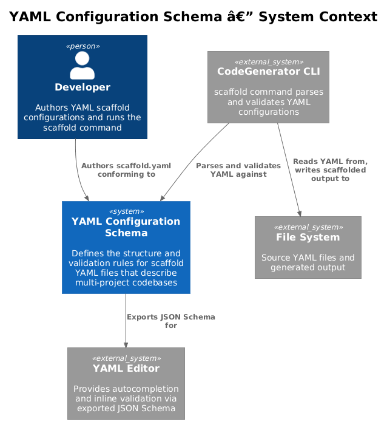
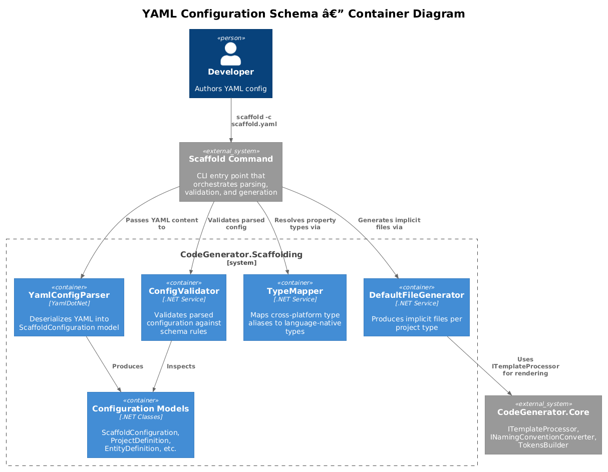
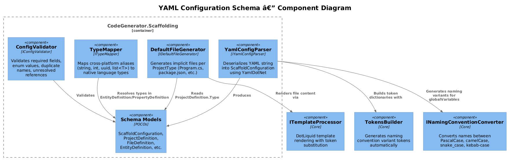
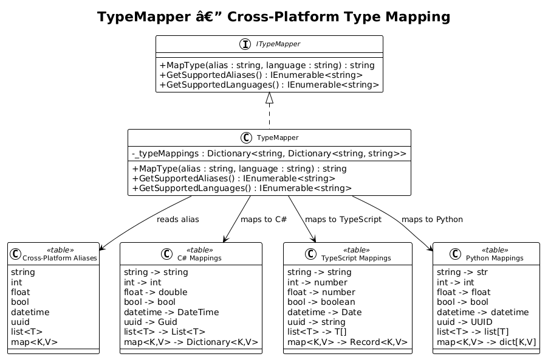
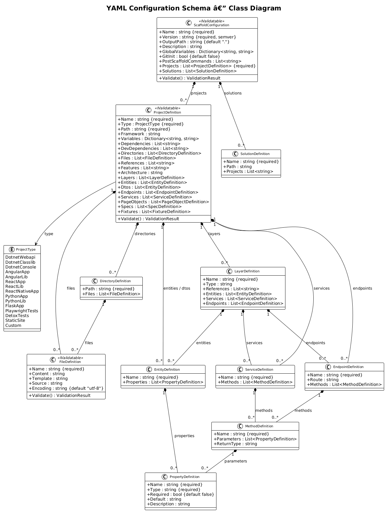
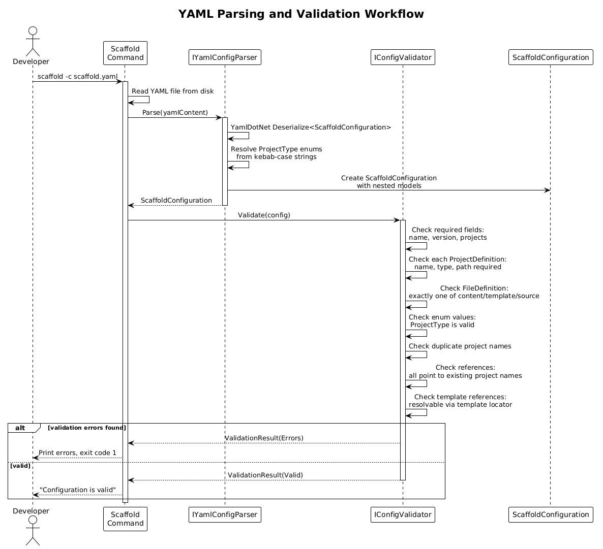
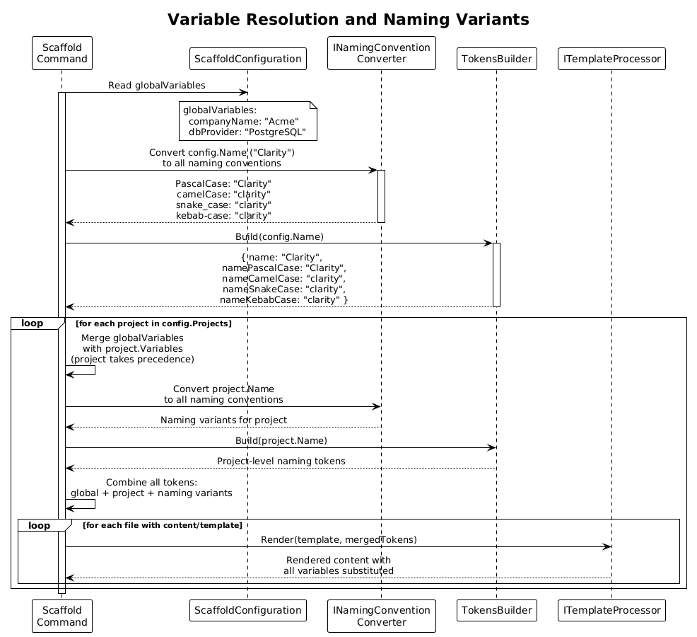
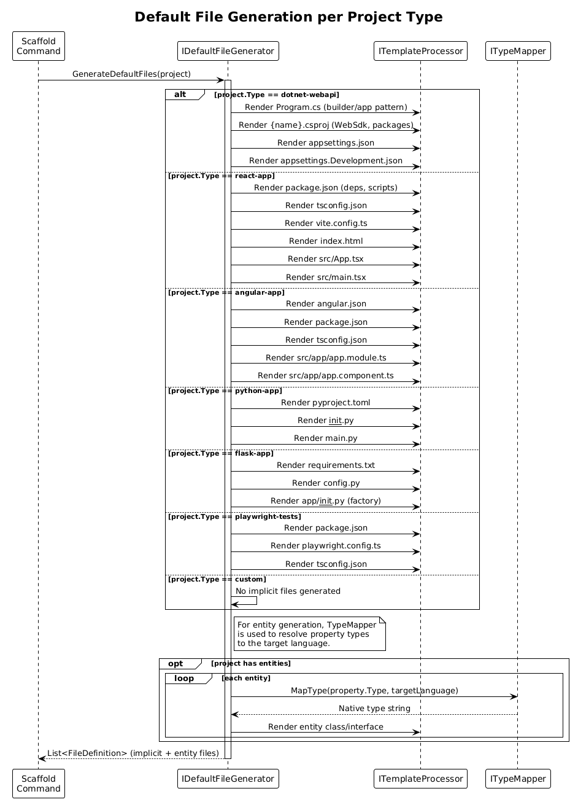

# YAML Configuration Schema — Detailed Design

## 1. Overview

The YAML Configuration Schema defines the structure and validation rules for scaffold configuration files used by the CodeGenerator's `scaffold` command. A scaffold YAML file describes an entire multi-project codebase — including .NET backends, React/Angular frontends, Python services, and test projects — in a single, technology-agnostic declaration.

**Why it exists:** The CodeGenerator framework follows a token-saving workflow: requirements --> design --> scaffold --> fill logic. The YAML schema is the bridge between design and scaffold — it lets a developer (or an AI agent) express the full structure of a production codebase in a compact, declarative format. The scaffold command then materializes that structure into real files, projects, and solutions, leaving only business logic to be filled in.

**Actors:** Developer or AI agent — authors a `scaffold.yaml` file conforming to this schema.

**Scope:** The configuration model classes, validation logic, type mapping, and default file generation. This covers requirements **FR-19.2** (root structure), **FR-19.3** (project definition), **FR-19.4** (directory and file definitions), and **FR-19.8** (schema validation) from [L2-YamlScaffolding.md](../../specs/L2-YamlScaffolding.md).

## 2. Architecture

### 2.1 C4 Context Diagram

Shows the YAML Configuration Schema in its broader ecosystem — the developer, the scaffold CLI command, YAML editors, and the file system.



The developer authors a `scaffold.yaml` file conforming to the schema. The scaffold CLI command parses and validates the YAML against the schema, then generates the described codebase. The schema can also be exported as JSON Schema for editor autocompletion.

### 2.2 C4 Container Diagram

Shows the internal containers: the parser, validator, type mapper, default file generator, and configuration models.



| Container | Technology | Responsibility |
|-----------|------------|----------------|
| YamlConfigParser | YamlDotNet | Deserializes YAML into `ScaffoldConfiguration` model graph |
| ConfigValidator | .NET Service | Validates parsed configuration: required fields, enum values, duplicates, references |
| TypeMapper | .NET Service | Maps cross-platform type aliases (`string`, `int`, `uuid`, `list<T>`) to language-native types |
| DefaultFileGenerator | .NET Service | Produces implicit files per project type (e.g., `dotnet-webapi` produces Program.cs, .csproj) |
| Configuration Models | .NET POCOs | `ScaffoldConfiguration`, `ProjectDefinition`, `FileDefinition`, `EntityDefinition`, etc. |

### 2.3 C4 Component Diagram

Shows the internal components and their interactions with CodeGenerator.Core services.



## 3. Component Details

### 3.1 ScaffoldConfiguration — Root Model (FR-19.2)

- **Responsibility:** Root of the configuration model hierarchy. Represents a complete scaffold declaration.
- **Implements:** `IValidatable`
- **Required Properties:**

| Property | Type | Description | Traces To |
|----------|------|-------------|-----------|
| `Name` | `string` | Codebase name. Naming convention variants are auto-generated. | FR-19.2 AC1, AC4 |
| `Version` | `string` | Semantic version (e.g., `1.0.0`). | FR-19.2 AC1 |
| `Projects` | `List<ProjectDefinition>` | One or more project definitions. | FR-19.2 AC1 |

- **Optional Properties:**

| Property | Type | Default | Description | Traces To |
|----------|------|---------|-------------|-----------|
| `OutputPath` | `string` | `"."` | Root output directory. | FR-19.2 AC2 |
| `Description` | `string` | `null` | Human-readable description. | FR-19.2 AC2 |
| `GlobalVariables` | `Dictionary<string, string>` | empty | Key-value pairs for template substitution across all projects. | FR-19.2 AC2, AC3 |
| `GitInit` | `bool` | `false` | Whether to run `git init` after scaffolding. | FR-19.2 AC2 |
| `PostScaffoldCommands` | `List<string>` | empty | Shell commands to execute after scaffolding. | FR-19.2 AC2 |
| `Solutions` | `List<SolutionDefinition>` | empty | .NET solution files to generate with project groupings. | FR-19.9 |

- **Validation Rules:**
  - `Name` must be non-empty.
  - `Version` must be valid semver.
  - `Projects` must contain at least one entry.
  - No duplicate project names across the `Projects` list.

### 3.2 ProjectDefinition — Project Model (FR-19.3)

- **Responsibility:** Describes a single deployable or packageable unit within the codebase.
- **Implements:** `IValidatable`
- **Required Properties:**

| Property | Type | Description | Traces To |
|----------|------|-------------|-----------|
| `Name` | `string` | Project name. Naming variants auto-generated. | FR-19.3 AC1 |
| `Type` | `ProjectType` | Technology/framework type. Determines implicit files. | FR-19.3 AC1 |
| `Path` | `string` | Relative path from `OutputPath`. | FR-19.3 AC1 |

- **Optional Properties:**

| Property | Type | Default | Description | Traces To |
|----------|------|---------|-------------|-----------|
| `Framework` | `string` | `null` | Target framework (e.g., `net9.0`, `node20`). | FR-19.3 AC2 |
| `Variables` | `Dictionary<string, string>` | empty | Project-level variables, merged with global (project wins). | FR-19.3 AC2 |
| `Dependencies` | `List<string>` | empty | Package dependencies. | FR-19.3 AC2 |
| `DevDependencies` | `List<string>` | empty | Development-only dependencies. | FR-19.3 AC2 |
| `Directories` | `List<DirectoryDefinition>` | empty | Explicit directory structure. | FR-19.3 AC2 |
| `Files` | `List<FileDefinition>` | empty | Explicit file definitions. | FR-19.3 AC2 |
| `References` | `List<string>` | empty | Other project names for inter-project references. | FR-19.3 AC2 |
| `Features` | `List<string>` | empty | Feature toggles (e.g., `authentication`, `swagger`). | FR-19.3 AC2 |
| `Architecture` | `string` | `null` | Architecture pattern (`clean-architecture`, `vertical-slices`). | FR-19.5 |
| `Layers` | `List<LayerDefinition>` | empty | Architectural layer definitions. | FR-19.5 |
| `Entities` | `List<EntityDefinition>` | empty | Entity/model class definitions. | FR-19.6 |
| `Dtos` | `List<EntityDefinition>` | empty | DTO/request/response class definitions. | FR-19.6 |
| `Endpoints` | `List<EndpointDefinition>` | empty | Route handler/controller definitions. | FR-19.5 |
| `Services` | `List<ServiceDefinition>` | empty | Service interface/implementation definitions. | FR-19.5 |
| `PageObjects` | `List<PageObjectDefinition>` | empty | Page Object Model definitions (test projects). | FR-19.7 |
| `Specs` | `List<SpecDefinition>` | empty | Test spec file definitions. | FR-19.7 |
| `Fixtures` | `List<FixtureDefinition>` | empty | Test fixture definitions. | FR-19.7 |

- **Validation Rules:**
  - `Name` must be non-empty.
  - `Type` must be a valid `ProjectType` enum value.
  - `Path` must be non-empty and must not contain path traversal sequences (`..`).
  - All entries in `References` must correspond to a project name defined elsewhere in the configuration.

### 3.3 DirectoryDefinition (FR-19.4)

- **Responsibility:** Describes a directory to create within a project, optionally containing file definitions.

| Property | Type | Required | Description | Traces To |
|----------|------|----------|-------------|-----------|
| `Path` | `string` | Yes | Directory path relative to project path. Nested directories created recursively. | FR-19.4 AC1 |
| `Files` | `List<FileDefinition>` | No | Files to create within this directory. | FR-19.4 AC2 |

### 3.4 FileDefinition (FR-19.4)

- **Responsibility:** Describes a single file to create. Exactly one of `Content`, `Template`, or `Source` must be specified.
- **Implements:** `IValidatable`

| Property | Type | Required | Description | Traces To |
|----------|------|----------|-------------|-----------|
| `Name` | `string` | Yes | File name including extension. | FR-19.4 AC3 |
| `Content` | `string` | One of three | Inline string content with optional template variables. | FR-19.4 AC3, AC4 |
| `Template` | `string` | One of three | Name of an embedded or external template. | FR-19.4 AC3, AC5 |
| `Source` | `string` | One of three | Path to a file to copy verbatim (no template processing). | FR-19.4 AC3, AC6 |
| `Encoding` | `string` | No | File encoding. Default: `utf-8`. | FR-19.4 AC7 |

- **Validation Rules:**
  - `Name` must be non-empty.
  - Exactly one of `Content`, `Template`, or `Source` must be non-null.
  - `Name` must not contain path traversal sequences (`..`).

### 3.5 EntityDefinition (FR-19.6)

- **Responsibility:** Describes a data entity or model class that will be generated as a stub class in the target language.

| Property | Type | Required | Description | Traces To |
|----------|------|----------|-------------|-----------|
| `Name` | `string` | Yes | Entity class name. | FR-19.6 AC1 |
| `Properties` | `List<PropertyDefinition>` | No | Property/field definitions using cross-platform type aliases. | FR-19.6 AC1 |

### 3.6 PropertyDefinition (FR-19.6)

- **Responsibility:** Describes a single property on an entity or DTO.

| Property | Type | Required | Default | Description | Traces To |
|----------|------|----------|---------|-------------|-----------|
| `Name` | `string` | Yes | — | Property name. | FR-19.6 AC1 |
| `Type` | `string` | Yes | — | Cross-platform type alias (see TypeMapper). | FR-19.6 AC5 |
| `Required` | `bool` | No | `false` | Whether the property is required/non-nullable. | FR-19.6 AC1 |
| `Default` | `string` | No | `null` | Default value expression. | FR-19.6 AC1 |
| `Description` | `string` | No | `null` | Documentation comment for the property. | FR-19.6 AC1 |

### 3.7 LayerDefinition (FR-19.5)

- **Responsibility:** Describes an architectural layer within a project.

| Property | Type | Required | Description | Traces To |
|----------|------|----------|-------------|-----------|
| `Name` | `string` | Yes | Layer name (e.g., "Domain", "Application", "Infrastructure"). | FR-19.5 AC3 |
| `Type` | `string` | No | Layer type descriptor. | FR-19.5 AC3 |
| `References` | `List<string>` | No | Other layer names this layer depends on. | FR-19.5 AC3 |
| `Entities` | `List<EntityDefinition>` | No | Entities belonging to this layer. | FR-19.5 AC4 |
| `Services` | `List<ServiceDefinition>` | No | Services belonging to this layer. | FR-19.5 AC5 |
| `Endpoints` | `List<EndpointDefinition>` | No | Endpoints/controllers belonging to this layer. | FR-19.5 AC6 |

### 3.8 ProjectType Enum (FR-19.3)

Defines the supported project types. Each value determines which implicit files are generated by `DefaultFileGenerator`.

| YAML Value | Enum Value | Implicit Files | Traces To |
|------------|------------|----------------|-----------|
| `dotnet-webapi` | `DotnetWebapi` | Program.cs, .csproj (WebSdk), appsettings.json, appsettings.Development.json | FR-19.3 AC3 |
| `dotnet-classlib` | `DotnetClasslib` | .csproj (ClassLib Sdk) | FR-19.3 AC1 |
| `dotnet-console` | `DotnetConsole` | Program.cs, .csproj (ConsoleApp) | FR-19.3 AC1 |
| `angular-app` | `AngularApp` | angular.json, package.json, tsconfig.json, src/app/ | FR-19.3 AC5 |
| `angular-lib` | `AngularLib` | angular.json, package.json, tsconfig.json | FR-19.3 AC1 |
| `react-app` | `ReactApp` | package.json, tsconfig.json, vite.config.ts, index.html, src/App.tsx, src/main.tsx | FR-19.3 AC4 |
| `react-lib` | `ReactLib` | package.json, tsconfig.json | FR-19.3 AC1 |
| `react-native-app` | `ReactNativeApp` | package.json, tsconfig.json, app.json | FR-19.3 AC1 |
| `python-app` | `PythonApp` | pyproject.toml, __init__.py, main.py | FR-19.3 AC6 |
| `python-lib` | `PythonLib` | pyproject.toml, __init__.py | FR-19.3 AC1 |
| `flask-app` | `FlaskApp` | requirements.txt, config.py, app/__init__.py (factory) | FR-19.3 AC7 |
| `playwright-tests` | `PlaywrightTests` | package.json, playwright.config.ts, tsconfig.json, pages/, specs/, fixtures/ | FR-19.3 AC8 |
| `detox-tests` | `DetoxTests` | package.json, .detoxrc.js, tsconfig.json | FR-19.3 AC1 |
| `static-site` | `StaticSite` | index.html, style.css | FR-19.3 AC1 |
| `custom` | `Custom` | No implicit files — only explicit directories/files | FR-19.3 AC9 |

YAML values use kebab-case. The parser maps these to PascalCase enum values during deserialization.

### 3.9 IConfigValidator / ConfigValidator (FR-19.8)

- **Responsibility:** Validates a parsed `ScaffoldConfiguration` against all schema rules and returns a `ValidationResult` with collected errors and warnings.
- **Interface:**

```csharp
public interface IConfigValidator
{
    ValidationResult Validate(ScaffoldConfiguration config);
}
```

- **Validation Rules:**

| Rule | Error Message | Traces To |
|------|---------------|-----------|
| Missing required `name` | `"Required property 'name' is missing at path '/'"` | FR-19.8 AC1 |
| Missing required `version` | `"Required property 'version' is missing at path '/'"` | FR-19.8 AC1 |
| Missing required `projects` | `"Required property 'projects' is missing at path '/'"` | FR-19.8 AC1 |
| Invalid `type` enum value | `"'{value}' is not a valid project type. Valid types are: dotnet-webapi, dotnet-classlib, ..."` | FR-19.8 AC2 |
| Unresolved project reference | `"Project reference '{name}' not found in configuration"` | FR-19.8 AC3 |
| Duplicate project name | `"Duplicate project name '{name}'"` | FR-19.8 AC4 |
| Unresolved template reference | `"Template '{name}' not found"` | FR-19.8 AC5 |
| FileDefinition has none of content/template/source | `"File '{name}' must specify exactly one of: content, template, source"` | FR-19.4 AC3 |
| FileDefinition has multiple of content/template/source | `"File '{name}' must specify exactly one of: content, template, source"` | FR-19.4 AC3 |

- **Dependencies:** `ITemplateLocator` (to verify template references exist).
- **DI Registration:** Singleton via `AddScaffoldingServices()`.

### 3.10 ITypeMapper / TypeMapper (FR-19.6)

- **Responsibility:** Maps cross-platform type aliases to language-native types. Used when generating entity/DTO classes for different target languages.
- **Interface:**

```csharp
public interface ITypeMapper
{
    string MapType(string alias, string targetLanguage);
    IEnumerable<string> GetSupportedAliases();
    IEnumerable<string> GetSupportedLanguages();
}
```

- **Type Mapping Table:**

| Alias | C# | TypeScript | Python |
|-------|-----|------------|--------|
| `string` | `string` | `string` | `str` |
| `int` | `int` | `number` | `int` |
| `float` | `double` | `number` | `float` |
| `bool` | `bool` | `boolean` | `bool` |
| `datetime` | `DateTime` | `Date` | `datetime` |
| `uuid` | `Guid` | `string` | `UUID` |
| `list<T>` | `List<T>` | `T[]` | `list[T]` |
| `map<K,V>` | `Dictionary<K,V>` | `Record<K,V>` | `dict[K,V]` |

- **Generic Type Handling:** The `list<T>` and `map<K,V>` aliases contain inner type parameters. `TypeMapper` recursively resolves `T`, `K`, and `V` against the mapping table before composing the final type string.
- **DI Registration:** Singleton via `AddScaffoldingServices()`.



### 3.11 IDefaultFileGenerator / DefaultFileGenerator (FR-19.3)

- **Responsibility:** Given a `ProjectDefinition`, generates the list of implicit `FileDefinition` instances that are standard for the project's `ProjectType`. For `custom` projects, no implicit files are produced.
- **Interface:**

```csharp
public interface IDefaultFileGenerator
{
    List<FileDefinition> GenerateDefaultFiles(ProjectDefinition project);
}
```

- **Behavior:** Uses `ITemplateProcessor` to render embedded resource templates with the project's merged variable context. Each project type has a registered set of template names (e.g., `dotnet-webapi` maps to `program-cs.liquid`, `csproj-webapi.liquid`, `appsettings.liquid`).
- **Dependencies:** `ITemplateProcessor`, `EmbeddedResourceTemplateLocatorBase<T>`, `ITypeMapper` (for entity generation within default files).
- **DI Registration:** Singleton via `AddScaffoldingServices()`.

## 4. Data Model

### 4.1 Class Diagram



### 4.2 Entity Descriptions

| Class | Implements | Responsibility |
|-------|------------|----------------|
| `ScaffoldConfiguration` | `IValidatable` | Root model. Contains metadata, global variables, project list, and solution definitions. |
| `ProjectDefinition` | `IValidatable` | Single project unit. Holds type, path, variables, files, entities, layers, services, endpoints, and test definitions. |
| `DirectoryDefinition` | — | Directory to create with optional nested file definitions. |
| `FileDefinition` | `IValidatable` | Single file to create via inline content, template rendering, or verbatim copy. |
| `EntityDefinition` | — | Data entity with typed properties. Used for class/interface generation across languages. |
| `PropertyDefinition` | — | Single property with cross-platform type alias, nullability, and default value. |
| `LayerDefinition` | — | Architectural layer grouping entities, services, and endpoints. |
| `SolutionDefinition` | — | .NET solution file definition with project references. |
| `ServiceDefinition` | — | Service interface/implementation with method signatures. |
| `EndpointDefinition` | — | Controller/route handler with HTTP method stubs. |
| `MethodDefinition` | — | Method signature with parameters and return type. |
| `ProjectType` | `enum` | 15-value enum covering .NET, Angular, React, Python, Flask, Playwright, Detox, and custom types. |

**Relationships:**
- `ScaffoldConfiguration` contains `0..*` `ProjectDefinition` (required, at least one) and `0..*` `SolutionDefinition`.
- `ProjectDefinition` contains `0..*` of `DirectoryDefinition`, `FileDefinition`, `EntityDefinition`, `LayerDefinition`, `ServiceDefinition`, `EndpointDefinition`.
- `DirectoryDefinition` contains `0..*` `FileDefinition`.
- `EntityDefinition` contains `0..*` `PropertyDefinition`.
- `LayerDefinition` contains `0..*` of `EntityDefinition`, `ServiceDefinition`, `EndpointDefinition`.
- `ServiceDefinition` and `EndpointDefinition` each contain `0..*` `MethodDefinition`.
- `MethodDefinition` contains `0..*` `PropertyDefinition` (as parameters).

## 5. Key Workflows

### 5.1 YAML Parsing to ScaffoldConfiguration (FR-19.2, FR-19.8)

When the scaffold command receives a YAML file, it is parsed and validated before any file generation occurs.



**Step-by-step:**

1. **Read YAML** — The scaffold command reads the YAML file from disk as a string.
2. **Deserialize** — `YamlConfigParser` uses YamlDotNet to deserialize the YAML string into a `ScaffoldConfiguration` object graph. Kebab-case `type` values (e.g., `dotnet-webapi`) are mapped to `ProjectType` enum values during deserialization.
3. **Validate** — `ConfigValidator` inspects the entire model graph:
   - Checks required fields (`name`, `version`, `projects` at root; `name`, `type`, `path` per project).
   - Validates `ProjectType` enum values.
   - Detects duplicate project names.
   - Verifies all `references` entries resolve to existing project names.
   - Verifies all `template` references are resolvable.
   - Validates `FileDefinition` has exactly one of `content`/`template`/`source`.
4. **Return result** — If validation errors exist, they are reported to the user and the command exits with code 1. If valid, the `ScaffoldConfiguration` is passed to the generation pipeline.

### 5.2 Schema Validation with Error Collection (FR-19.8)

`ConfigValidator` collects all validation errors in a single pass rather than failing on the first error. This allows the developer to fix multiple issues at once.

The validator traverses the model hierarchy depth-first:
1. Validate `ScaffoldConfiguration` root properties.
2. For each `ProjectDefinition`, validate required fields and enum values.
3. For each `FileDefinition` (both top-level and within directories), validate the content/template/source constraint.
4. For each `References` entry, check cross-reference integrity.
5. Aggregate all errors into a single `ValidationResult`.

### 5.3 Variable Resolution (FR-19.2 AC3, AC4)

Variables flow from global to project scope, with automatic naming convention variants.



**Step-by-step:**

1. **Read global variables** — `ScaffoldConfiguration.GlobalVariables` provides the base variable dictionary.
2. **Generate root naming variants** — `TokensBuilder` generates naming convention variants for `ScaffoldConfiguration.Name`:
   - `{{ name }}` — original value
   - `{{ namePascalCase }}` — PascalCase
   - `{{ nameCamelCase }}` — camelCase
   - `{{ nameSnakeCase }}` — snake_case
   - `{{ nameKebabCase }}` — kebab-case
3. **Merge per project** — For each project, `ProjectDefinition.Variables` are merged with global variables. Project-level values take precedence over global values with the same key.
4. **Generate project naming variants** — `TokensBuilder` generates naming variants for `ProjectDefinition.Name` (e.g., `{{ projectName }}`, `{{ projectNamePascalCase }}`).
5. **Combine all tokens** — The final token dictionary for each project includes: global variables + project variables + root naming variants + project naming variants.
6. **Render templates** — `ITemplateProcessor` substitutes all `{{ variable }}` references in file content and templates using the combined token dictionary.

### 5.4 Default File Generation per Project Type (FR-19.3)

Each `ProjectType` has a set of implicit files that are generated automatically unless the type is `custom`.



**Step-by-step:**

1. **Determine project type** — `DefaultFileGenerator` reads `ProjectDefinition.Type`.
2. **Select template set** — Based on the type, a predefined set of embedded resource templates is selected (e.g., `dotnet-webapi` selects `program-cs.liquid`, `csproj-webapi.liquid`, `appsettings.liquid`, `appsettings-dev.liquid`).
3. **Render each template** — Each template is rendered via `ITemplateProcessor` with the project's merged variable context.
4. **Generate entity files** — If the project has `Entities`, each entity is rendered as a class/interface in the target language. `TypeMapper` converts cross-platform type aliases to language-native types.
5. **Return file list** — The generated `FileDefinition` instances are combined with any explicitly defined files from the YAML configuration.

### 5.5 Cross-Platform Type Mapping (FR-19.6)

When generating entity classes, the `TypeMapper` resolves cross-platform type aliases to the appropriate native types based on the target language (determined by `ProjectType`).

The mapping from `ProjectType` to target language:
- `DotnetWebapi`, `DotnetClasslib`, `DotnetConsole` --> `csharp`
- `AngularApp`, `AngularLib`, `ReactApp`, `ReactLib`, `ReactNativeApp`, `PlaywrightTests` --> `typescript`
- `PythonApp`, `PythonLib`, `FlaskApp` --> `python`

For generic types like `list<T>` and `map<K,V>`, the mapper recursively resolves inner type parameters. For example, `list<uuid>` in a C# context becomes `List<Guid>`, while in TypeScript it becomes `string[]`.

## 6. Example YAML

The following example describes a production-style codebase with a .NET API backend, a React SPA frontend, and Playwright end-to-end tests:

```yaml
name: Clarity
version: 1.0.0
description: Task management platform with .NET API, React SPA, and E2E tests
outputPath: ./output
gitInit: true

globalVariables:
  companyName: Contoso
  dbProvider: PostgreSQL

solutions:
  - name: Clarity
    path: .
    projects:
      - Clarity.Api
      - Clarity.Domain
      - Clarity.Infrastructure

projects:
  # --- .NET Backend ---
  - name: Clarity.Api
    type: dotnet-webapi
    path: src/Clarity.Api
    framework: net9.0
    dependencies:
      - Microsoft.EntityFrameworkCore:9.0.0
      - Npgsql.EntityFrameworkCore.PostgreSQL:9.0.0
    references:
      - Clarity.Domain
      - Clarity.Infrastructure
    features:
      - swagger
      - health-checks
    endpoints:
      - name: TasksController
        route: /api/tasks
        methods:
          - name: GetAll
            returnType: list<Task>
          - name: GetById
            parameters:
              - name: id
                type: uuid
            returnType: Task
          - name: Create
            parameters:
              - name: request
                type: CreateTaskRequest

  - name: Clarity.Domain
    type: dotnet-classlib
    path: src/Clarity.Domain
    framework: net9.0
    entities:
      - name: Task
        properties:
          - name: Id
            type: uuid
            required: true
          - name: Title
            type: string
            required: true
          - name: Description
            type: string
          - name: DueDate
            type: datetime
          - name: IsCompleted
            type: bool
            default: "false"
          - name: Tags
            type: list<string>
          - name: Metadata
            type: map<string,string>

  - name: Clarity.Infrastructure
    type: dotnet-classlib
    path: src/Clarity.Infrastructure
    framework: net9.0
    references:
      - Clarity.Domain
    dependencies:
      - Microsoft.EntityFrameworkCore:9.0.0
    services:
      - name: TaskRepository
        methods:
          - name: GetAllAsync
            returnType: list<Task>
          - name: GetByIdAsync
            parameters:
              - name: id
                type: uuid
            returnType: Task
          - name: AddAsync
            parameters:
              - name: entity
                type: Task

  # --- React Frontend ---
  - name: clarity-spa
    type: react-app
    path: src/clarity-spa
    framework: node20
    dependencies:
      - react:18.3.0
      - react-dom:18.3.0
      - axios:1.7.0
      - react-router-dom:6.23.0
    devDependencies:
      - typescript:5.4.0
      - vite:5.2.0
      - "@types/react:18.3.0"
    variables:
      apiBaseUrl: http://localhost:5000
    directories:
      - path: src/components
        files:
          - name: TaskList.tsx
            template: react-component
          - name: TaskForm.tsx
            template: react-component
      - path: src/services
        files:
          - name: api.ts
            content: |
              import axios from 'axios';
              export const apiClient = axios.create({
                baseURL: '{{ apiBaseUrl }}',
              });

  # --- E2E Tests ---
  - name: clarity-e2e
    type: playwright-tests
    path: tests/clarity-e2e
    dependencies:
      - "@playwright/test:1.44.0"
    pageObjects:
      - name: TaskListPage
        locators:
          - name: taskRow
            strategy: GetByTestId
            selector: task-row
          - name: addButton
            strategy: GetByRole
            selector: button, { name: 'Add Task' }
    specs:
      - name: task-management
        tests:
          - name: should display task list
          - name: should create a new task
          - name: should mark task as completed

postScaffoldCommands:
  - dotnet restore
  - cd src/clarity-spa && npm install
  - cd tests/clarity-e2e && npm install
```

## 7. Security Considerations

- **YAML deserialization safety** — The parser uses YamlDotNet's `Deserializer` configured to deserialize into known model types only. No arbitrary type instantiation is permitted. The `!!` YAML tag for type specification is not supported, preventing deserialization attacks.
- **Path traversal in file definitions** — `FileDefinition.Name`, `DirectoryDefinition.Path`, and `ProjectDefinition.Path` are validated to reject path traversal sequences (`..`). The `ConfigValidator` reports an error if any path component attempts to escape the output directory boundary.
- **Post-scaffold command injection** — Commands in `PostScaffoldCommands` are executed via `ICommandService.Start()`. The YAML file is a developer-authored artifact (not user input from an untrusted source), so command injection risk is limited to the trust boundary of the YAML author. The `--dry-run` flag allows reviewing commands before execution.
- **File encoding** — The `Encoding` property on `FileDefinition` is validated against a whitelist of supported encodings (`utf-8`, `utf-16`, `ascii`, `iso-8859-1`) to prevent unexpected behavior from exotic encoding names.
- **Template resolution** — Template references are resolved only from registered template locators (embedded resources or configured directories). Arbitrary file system paths are not accepted as template references.

## 8. Test Strategy

### 8.1 Unit Tests — ScaffoldConfiguration Parsing (FR-19.2)

| Test | Description | Traces To |
|------|-------------|-----------|
| `Parse_ValidYaml_ReturnsScaffoldConfiguration` | Valid YAML with all required fields produces correct model. | FR-19.2 AC1 |
| `Parse_OptionalFields_DefaultsApplied` | Missing optional fields default to expected values (outputPath=`.`, gitInit=false). | FR-19.2 AC2 |
| `Parse_GlobalVariables_AvailableInModel` | globalVariables map is parsed and accessible. | FR-19.2 AC3 |
| `Parse_NamingVariants_AutoGenerated` | Root name "Clarity" produces PascalCase/camelCase/snake_case/kebab-case variants. | FR-19.2 AC4 |
| `Parse_RoundTrip_ModelToYamlAndBack` | Serialize a model to YAML and re-parse; result matches original. | FR-19.2 |
| `Parse_ProjectType_KebabToEnum` | YAML `type: dotnet-webapi` maps to `ProjectType.DotnetWebapi`. | FR-19.3 AC1 |

### 8.2 Unit Tests — ConfigValidator (FR-19.8)

| Test | Description | Traces To |
|------|-------------|-----------|
| `Validate_MissingName_ReturnsError` | Config without `name` reports `"Required property 'name' is missing at path '/'"`. | FR-19.8 AC1 |
| `Validate_MissingVersion_ReturnsError` | Config without `version` reports appropriate error. | FR-19.8 AC1 |
| `Validate_MissingProjects_ReturnsError` | Config without `projects` reports appropriate error. | FR-19.8 AC1 |
| `Validate_InvalidProjectType_ReturnsError` | Project with `type: java-app` reports the invalid type error with valid types list. | FR-19.8 AC2 |
| `Validate_UnresolvedReference_ReturnsError` | Reference to non-existent project name reports appropriate error. | FR-19.8 AC3 |
| `Validate_DuplicateProjectName_ReturnsError` | Two projects with same name reports duplicate error. | FR-19.8 AC4 |
| `Validate_UnresolvedTemplate_ReturnsError` | File with `template` referencing non-existent template reports error. | FR-19.8 AC5 |
| `Validate_ValidConfig_ReturnsNoErrors` | Fully valid config returns empty error list. | FR-19.8 AC6 |
| `Validate_FileNoContentSource_ReturnsError` | File with none of content/template/source reports error. | FR-19.4 AC3 |
| `Validate_FileMultipleSources_ReturnsError` | File with both content and template reports error. | FR-19.4 AC3 |
| `Validate_PathTraversal_ReturnsError` | Path containing `..` reports security error. | Security |

### 8.3 Unit Tests — TypeMapper (FR-19.6)

| Test | Description | Traces To |
|------|-------------|-----------|
| `MapType_String_CSharp_ReturnsString` | `string` in C# context returns `string`. | FR-19.6 AC5 |
| `MapType_Int_TypeScript_ReturnsNumber` | `int` in TypeScript context returns `number`. | FR-19.6 AC5 |
| `MapType_Uuid_CSharp_ReturnsGuid` | `uuid` in C# context returns `Guid`. | FR-19.6 AC5 |
| `MapType_Uuid_TypeScript_ReturnsString` | `uuid` in TypeScript context returns `string`. | FR-19.6 AC5 |
| `MapType_DateTime_Python_ReturnsDatetime` | `datetime` in Python context returns `datetime`. | FR-19.6 AC5 |
| `MapType_ListOfUuid_CSharp_ReturnsListGuid` | `list<uuid>` in C# context returns `List<Guid>`. | FR-19.6 AC5 |
| `MapType_MapStringInt_TypeScript_ReturnsRecord` | `map<string,int>` in TypeScript returns `Record<string,number>`. | FR-19.6 AC5 |
| `MapType_UnknownAlias_ReturnsPassthrough` | Unknown type alias is returned as-is (e.g., `CustomType` stays `CustomType`). | FR-19.6 |

### 8.4 Unit Tests — DefaultFileGenerator (FR-19.3)

| Test | Description | Traces To |
|------|-------------|-----------|
| `Generate_DotnetWebapi_ProducesExpectedFiles` | dotnet-webapi project produces Program.cs, .csproj, appsettings.json, appsettings.Development.json. | FR-19.3 AC3 |
| `Generate_ReactApp_ProducesExpectedFiles` | react-app project produces package.json, tsconfig.json, vite.config.ts, index.html, App.tsx, main.tsx. | FR-19.3 AC4 |
| `Generate_AngularApp_ProducesExpectedFiles` | angular-app project produces angular.json, package.json, tsconfig.json, app module/component. | FR-19.3 AC5 |
| `Generate_PythonApp_ProducesExpectedFiles` | python-app project produces pyproject.toml, __init__.py, main.py. | FR-19.3 AC6 |
| `Generate_FlaskApp_ProducesExpectedFiles` | flask-app project produces requirements.txt, config.py, app/__init__.py. | FR-19.3 AC7 |
| `Generate_PlaywrightTests_ProducesExpectedFiles` | playwright-tests project produces package.json, playwright.config.ts, tsconfig.json. | FR-19.3 AC8 |
| `Generate_Custom_ProducesNoFiles` | custom project produces zero implicit files. | FR-19.3 AC9 |

### 8.5 Unit Tests — Variable Resolution (FR-19.2 AC3, AC4)

| Test | Description | Traces To |
|------|-------------|-----------|
| `Resolve_GlobalVariables_AvailableInAllProjects` | Global variable `companyName` is accessible in every project's template context. | FR-19.2 AC3 |
| `Resolve_ProjectOverridesGlobal_ProjectWins` | Project variable with same key as global variable takes precedence. | FR-19.3 AC2 |
| `Resolve_NamingVariants_AllCasesGenerated` | Root name "MyApp" produces `myApp`, `my_app`, `my-app`, `MyApp` variants. | FR-19.2 AC4 |
| `Resolve_ProjectNamingVariants_Generated` | Project name "Clarity.Api" produces project-level naming variants. | FR-19.3 |

### 8.6 Integration Tests

| Test | Description | Traces To |
|------|-------------|-----------|
| `ParseAndValidate_FullMultiProjectYaml_ProducesValidModel` | Parse the full example YAML (section 6) and validate the complete model graph: 5 projects, correct types, entities with properties, endpoints, page objects, inter-project references. | FR-19.2, FR-19.3, FR-19.4, FR-19.8 |
| `ParseAndValidate_InvalidYaml_CollectsAllErrors` | Parse YAML with multiple errors (missing name, invalid type, duplicate project); all errors are collected in a single pass. | FR-19.8 |

## 9. Open Questions

1. **Custom project type extensibility** — Should the `ProjectType` enum be extensible via plugins, or is the fixed set of 15 types sufficient? Custom types could be supported via a `customType` string property with a user-provided template directory.
2. **Schema versioning** — The `version` field is for the codebase version, not the schema version. Should there be a separate `schemaVersion` field to handle breaking schema changes across CodeGenerator releases?
3. **Conditional sections** — Should the schema support conditional blocks (e.g., generate certain files only when a feature flag is enabled)? This could be handled via DotLiquid `` blocks in templates, but explicit YAML-level conditionals might be cleaner.
4. **Variable type safety** — Currently all variables are `string` values. Should the schema support typed variables (numbers, booleans, lists) for more expressive template logic?
5. **Remote templates** — Should the `template` property support URLs (e.g., `template: https://templates.example.com/react-component.liquid`) in addition to embedded resources and local paths?
