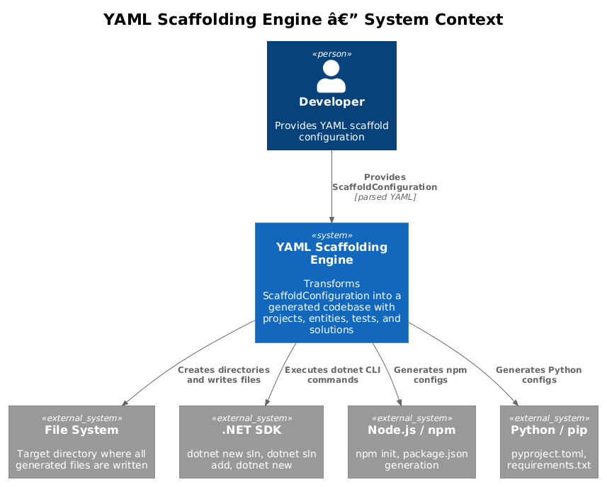
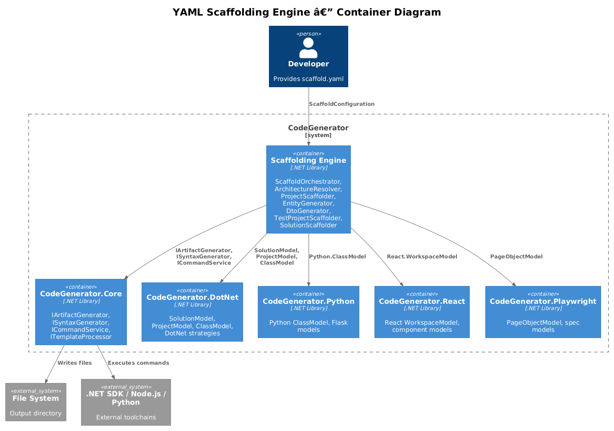
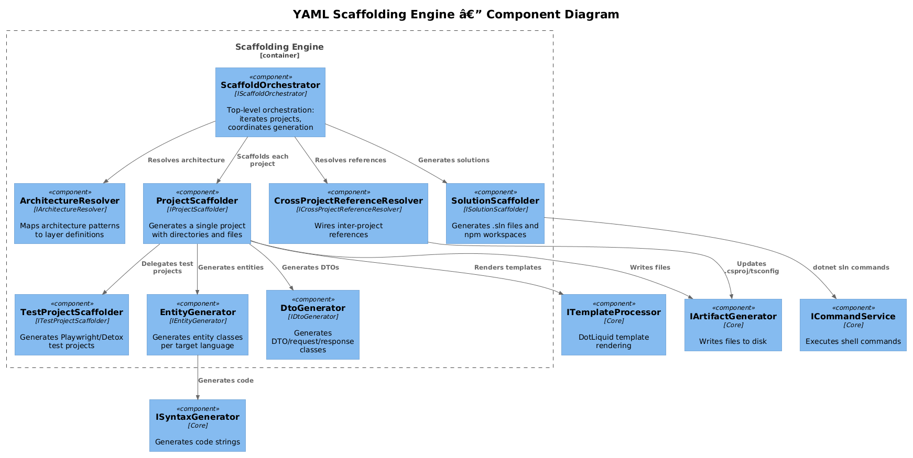
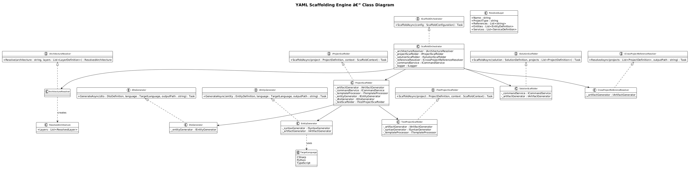
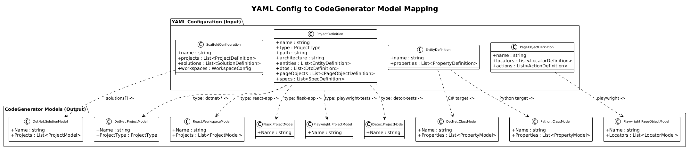
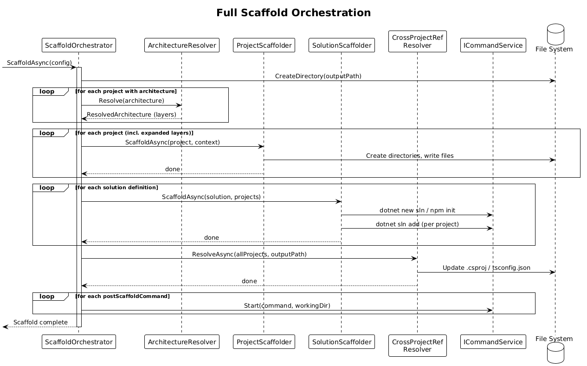
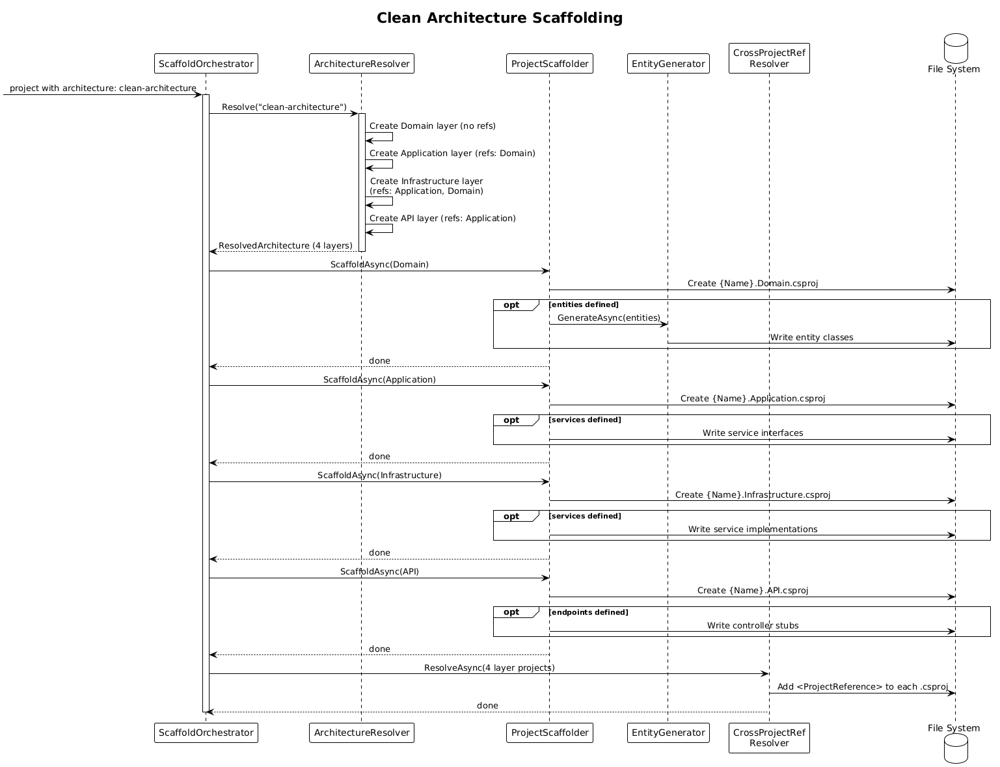
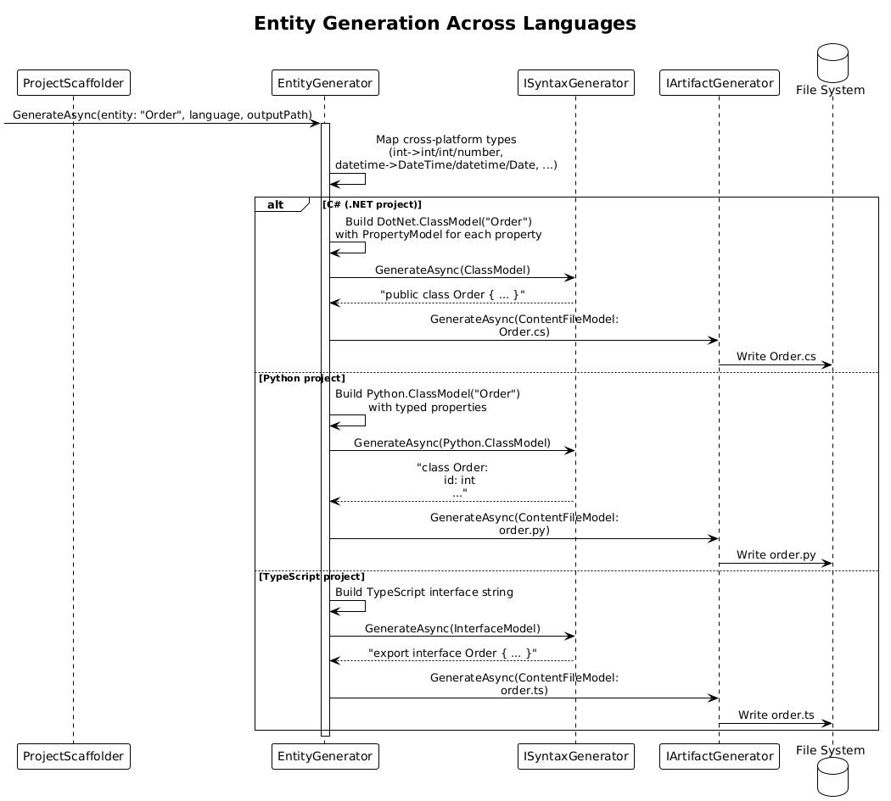
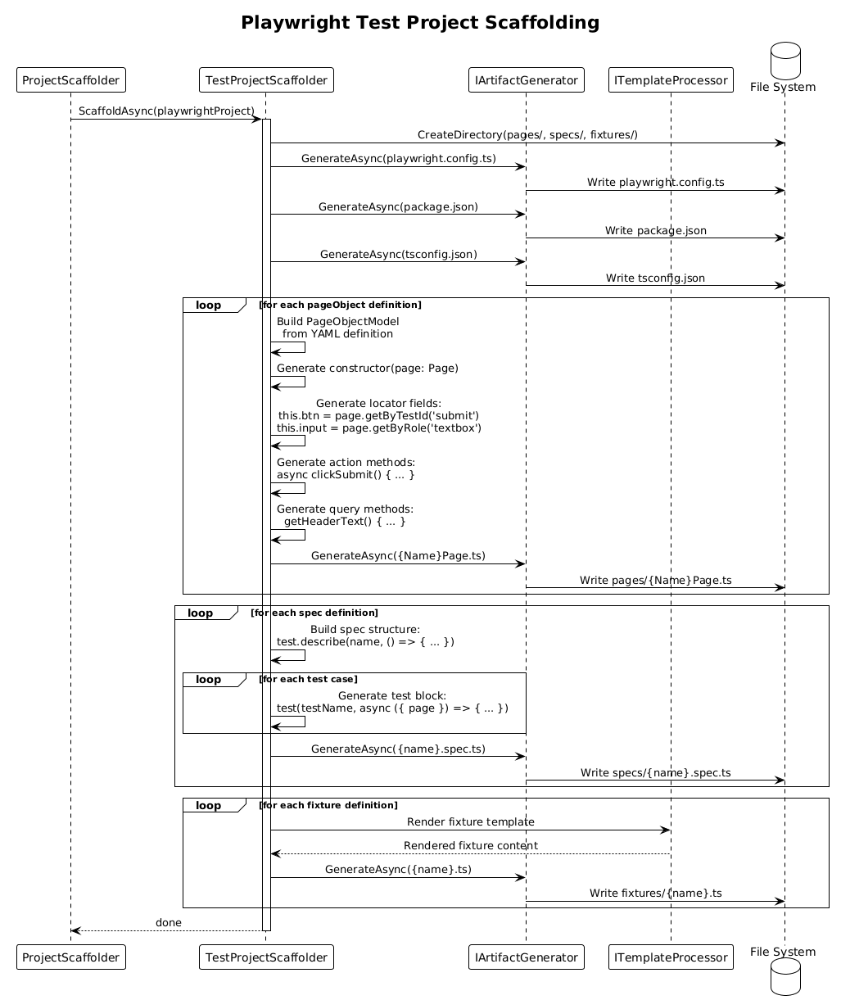

# YAML Scaffolding Engine -- Detailed Design

## 1. Overview

The YAML Scaffolding Engine transforms a parsed `ScaffoldConfiguration` (produced by the YAML Configuration Schema parser, design #22) into a fully generated codebase. It orchestrates directory creation, file generation, entity/DTO scaffolding, test project setup, solution file creation, and cross-project reference wiring across multiple languages and frameworks.

**Actors:** Developer -- invokes the `scaffold` command which delegates to the engine after parsing and validating the YAML configuration.

**Scope:** The generation engine itself. This covers requirements **FR-19.5** (architecture patterns and layers), **FR-19.6** (entities, models, and DTOs), **FR-19.7** (testing configuration with page objects and specs), and **FR-19.9** (multi-solution and monorepo support).

## 2. Architecture

### 2.1 C4 Context Diagram

Shows the scaffolding engine in its broader ecosystem -- the developer, the YAML configuration, file system, and external toolchains.

The developer provides a YAML configuration file. The scaffold CLI command parses and validates it, then hands the resulting `ScaffoldConfiguration` to the engine. The engine writes files to disk, invokes .NET SDK / Node.js / Python toolchains as needed, and produces the complete codebase.

### 2.2 C4 Container Diagram

Shows the internal containers: the scaffolding engine, CodeGenerator.Core, and the language-specific code generation libraries.

| Container | Technology | Responsibility |
|-----------|------------|----------------|
| Scaffolding Engine | .NET 9.0 Library | Orchestration, architecture resolution, project/entity/DTO/test scaffolding, solution generation |
| CodeGenerator.Core | .NET 9.0 Library | `IArtifactGenerator`, `ISyntaxGenerator`, `ICommandService`, `ITemplateProcessor`, DI registration |
| CodeGenerator.DotNet | .NET 9.0 Library | `SolutionModel`, `ProjectModel`, `ClassModel`, DotNet-specific strategies |
| CodeGenerator.Python | .NET 9.0 Library | Python `ClassModel`, Flask models, Python-specific strategies |
| CodeGenerator.React | .NET 9.0 Library | React `WorkspaceModel`, component models |
| CodeGenerator.Angular | .NET 9.0 Library | Angular `WorkspaceModel`, module/component models |
| CodeGenerator.Playwright | .NET 9.0 Library | Playwright `ProjectModel`, `PageObjectModel`, spec models |
| CodeGenerator.Detox | .NET 9.0 Library | Detox `ProjectModel`, page object models |

### 2.3 C4 Component Diagram

Shows the internal components within the scaffolding engine and their interactions with core services.

## 3. Component Details

### 3.1 IScaffoldOrchestrator / ScaffoldOrchestrator

- **Responsibility:** Top-level orchestration. Receives a `ScaffoldConfiguration`, iterates over projects, resolves architecture patterns, delegates to sub-scaffolders, and coordinates solution/workspace generation.
- **Dependencies:** `IArchitectureResolver`, `IProjectScaffolder`, `ISolutionScaffolder`, `ICrossProjectReferenceResolver`, `ILogger<ScaffoldOrchestrator>`
- **Flow:**
  1. Create the root output directory
  2. For each project definition, resolve architecture (if specified) into concrete layer projects
  3. Delegate each project to `IProjectScaffolder`
  4. Delegate solution definitions to `ISolutionScaffolder`
  5. Resolve cross-project references via `ICrossProjectReferenceResolver`
  6. Execute post-scaffold commands (FR-19.10)

### 3.2 IArchitectureResolver / ArchitectureResolver

- **Responsibility:** Maps an `architecture` property value to a list of layer definitions with inter-layer references.
- **Dependencies:** None (pure mapping logic)
- **Mappings:**

| Architecture Value | Generated Layers | Inter-Layer References |
|--------------------|-----------------|----------------------|
| `clean-architecture` | Domain, Application, Infrastructure, API | API -> Application -> Domain; Infrastructure -> Application -> Domain |
| `vertical-slices` | Single project with Features/ directory per feature | N/A (intra-project) |
| Custom `layers` list | As defined in YAML | As defined in `references` property |

- **Output:** `ResolvedArchitecture` containing a list of `ResolvedLayer` objects, each specifying name, project type, directories, and references.

### 3.3 IProjectScaffolder / ProjectScaffolder

- **Responsibility:** Generates a single project: creates directories, generates default/implicit files based on project type, renders custom templates, and delegates entity generation.
- **Dependencies:** `IArtifactGenerator`, `ICommandService`, `ITemplateProcessor`, `IEntityGenerator`, `IDtoGenerator`, `ITestProjectScaffolder`
- **Type-Specific Behavior:**

| Project Type | Implicit Files Generated |
|-------------|------------------------|
| `dotnet-webapi` | `.csproj`, `Program.cs`, `appsettings.json`, `appsettings.Development.json` |
| `dotnet-classlib` | `.csproj` with library defaults |
| `react-app` | `package.json`, `tsconfig.json`, `vite.config.ts`, `index.html`, `src/App.tsx`, `src/main.tsx` |
| `angular-app` | `angular.json`, `package.json`, `tsconfig.json`, `src/` with app module |
| `flask-app` | `requirements.txt`, `config.py`, app factory, application package |
| `python-app` | `pyproject.toml`, `__init__.py`, `main.py` |
| `playwright-tests` | Delegates to `ITestProjectScaffolder` |
| `detox-tests` | Delegates to `ITestProjectScaffolder` |
| `custom` | None (only explicit `directories` and `files`) |

- **Flow:**
  1. Create project directory at `{outputPath}/{project.path}`
  2. Generate implicit files for the project type
  3. Create explicit directories from `directories` list
  4. Generate explicit files from `files` list (with template processing)
  5. If `entities` are defined, delegate to `IEntityGenerator`
  6. If `dtos` are defined, delegate to `IDtoGenerator`
  7. If project type is test type, delegate to `ITestProjectScaffolder`

### 3.4 IEntityGenerator / EntityGenerator

- **Responsibility:** Generates entity/model classes per target language using `ISyntaxGenerator` and the existing `ClassModel` infrastructure.
- **Dependencies:** `ISyntaxGenerator`, `IArtifactGenerator`
- **Language Mapping:**

| Target Language | Model Used | Output |
|----------------|-----------|--------|
| C# (.NET projects) | `DotNet.ClassModel` | `public class {Name} { public {Type} {Prop} { get; set; } }` |
| Python | `Python.ClassModel` | `class {Name}: {prop}: {type}` with type hints |
| TypeScript (React/Angular) | TypeScript interface via `ISyntaxGenerator` | `export interface {Name} { {prop}: {type}; }` |

- **Type Mapping:** Cross-platform type aliases are resolved to native types:

| Alias | C# | Python | TypeScript |
|-------|-----|--------|------------|
| `string` | `string` | `str` | `string` |
| `int` | `int` | `int` | `number` |
| `float` | `double` | `float` | `number` |
| `bool` | `bool` | `bool` | `boolean` |
| `datetime` | `DateTime` | `datetime` | `Date` |
| `uuid` | `Guid` | `UUID` | `string` |
| `list<T>` | `List<T>` | `list[T]` | `T[]` |
| `map<K,V>` | `Dictionary<K,V>` | `dict[K,V]` | `Record<K,V>` |

### 3.5 IDtoGenerator / DtoGenerator

- **Responsibility:** Generates DTO, request, and response classes from entity definitions with a subset of properties.
- **Dependencies:** `IEntityGenerator` (reuses the same language-aware class generation)
- **Behavior:** For each DTO definition, creates a class/interface containing only the specified properties. Naming convention appends the DTO suffix (e.g., `CreateOrderRequest`, `OrderResponse`).

### 3.6 ITestProjectScaffolder / TestProjectScaffolder

- **Responsibility:** Generates Playwright and Detox test projects with page objects, specs, and fixtures from YAML configuration.
- **Dependencies:** `IArtifactGenerator`, `ISyntaxGenerator`, `ITemplateProcessor`
- **Playwright Output:**

| YAML Config | Generated Output |
|------------|-----------------|
| `pageObjects[].name` | `pages/{Name}Page.ts` with Page Object class |
| `pageObjects[].locators[]` | Locator fields: `this.{name} = page.{strategy}('{selector}')` |
| `pageObjects[].actions[]` | Action methods with `await` calls |
| `pageObjects[].queries[]` | Query methods returning locator values |
| `specs[].name` | `specs/{name}.spec.ts` with `describe`/`test` blocks |
| `fixtures[]` | `fixtures/{name}.ts` with type definitions |

- **Detox Output:**

| YAML Config | Generated Output |
|------------|-----------------|
| `pageObjects[].name` | `pages/{Name}Page.ts` with testID-based selectors |
| `pageObjects[].locators[]` | `element(by.id('{selector}'))` fields |
| `specs[].name` | `specs/{name}.test.ts` with `describe`/`it` blocks |

### 3.7 ISolutionScaffolder / SolutionScaffolder

- **Responsibility:** Generates .sln/.slnx files and npm workspace configurations.
- **Dependencies:** `ICommandService`, `IArtifactGenerator`
- **Behavior:**
  - For .NET solutions: executes `dotnet new sln -n {name}` (or `slnx`), then `dotnet sln add` for each referenced project
  - For npm workspaces: generates root `package.json` with `"workspaces"` array listing project paths
  - For monorepos with mixed types: generates both .sln and root package.json as needed

### 3.8 ICrossProjectReferenceResolver

- **Responsibility:** Resolves inter-project references after all projects have been scaffolded.
- **Dependencies:** `IArtifactGenerator` (to update generated files)
- **Reference Types:**

| Source Type | Target Type | Reference Mechanism |
|------------|------------|-------------------|
| .NET project | .NET project | `<ProjectReference Include="..\..\{path}\{name}.csproj" />` in .csproj |
| TypeScript project | TypeScript project | `"paths": { "@{name}/*": ["../{path}/src/*"] }` in tsconfig.json |
| React app | Shared lib | Path alias in tsconfig.json + vite resolve alias |

## 4. Data Model

### 4.1 Class Diagram

### 4.2 Model Mapping Diagram

Shows how YAML configuration elements map to existing CodeGenerator models.

### 4.3 Entity Descriptions

| Class | Responsibility |
|-------|---------------|
| `ScaffoldOrchestrator` | Top-level orchestration of the entire scaffold process |
| `ArchitectureResolver` | Maps architecture pattern names to layer definitions |
| `ProjectScaffolder` | Generates a single project with all its files and structures |
| `EntityGenerator` | Generates entity/model classes using ISyntaxGenerator |
| `DtoGenerator` | Generates DTO classes from entity definitions |
| `TestProjectScaffolder` | Generates Playwright/Detox test projects with page objects |
| `SolutionScaffolder` | Generates .sln files and npm workspace configs |
| `CrossProjectReferenceResolver` | Wires inter-project references in .csproj and tsconfig |

### 4.4 Relationships

- `ScaffoldOrchestrator` depends on `ArchitectureResolver`, `ProjectScaffolder`, `SolutionScaffolder`, `CrossProjectReferenceResolver`
- `ProjectScaffolder` depends on `EntityGenerator`, `DtoGenerator`, `TestProjectScaffolder`
- `EntityGenerator` depends on `ISyntaxGenerator` (dispatches to language-specific strategies)
- `DtoGenerator` depends on `EntityGenerator` (reuses class generation)
- `SolutionScaffolder` depends on `ICommandService` (for dotnet sln commands)
- All scaffolders depend on `IArtifactGenerator` (for file writing)

## 5. Key Workflows

### 5.1 Full Scaffold Orchestration (End to End)

When the developer runs `codegen scaffold -c ./scaffold.yaml`:

**Step-by-step:**

1. **Receive configuration** -- `ScaffoldOrchestrator` receives a validated `ScaffoldConfiguration`.
2. **Create root directory** -- Creates the output directory at `{outputPath}`.
3. **Resolve architectures** -- For each project with an `architecture` property, calls `ArchitectureResolver.Resolve()` to expand into layer projects.
4. **Scaffold projects** -- Iterates all projects (including expanded layers), calling `ProjectScaffolder.ScaffoldAsync()` for each.
5. **Generate solutions** -- Calls `SolutionScaffolder.ScaffoldAsync()` for each solution definition.
6. **Generate workspaces** -- If workspace configuration exists, generates root package.json with workspaces.
7. **Resolve references** -- Calls `CrossProjectReferenceResolver.ResolveAsync()` to wire all inter-project references.
8. **Execute post-scaffold commands** -- Runs global and per-project post-scaffold commands via `ICommandService`.

### 5.2 Clean Architecture Scaffolding (FR-19.5)

When a project specifies `architecture: clean-architecture`:

**Step-by-step:**

1. **Input** -- `ArchitectureResolver` receives a project definition with `architecture: clean-architecture`.
2. **Resolve layers** -- Produces four layer projects: Domain, Application, Infrastructure, API.
3. **Set references** -- Domain has no references. Application references Domain. Infrastructure references Application and Domain. API references Application.
4. **Generate entities** -- If the project defines entities, they are placed in the Domain layer.
5. **Generate services** -- Service interfaces go to Application layer; implementations go to Infrastructure layer.
6. **Generate endpoints** -- Controller/endpoint stubs go to the API layer.
7. **Wire references** -- `CrossProjectReferenceResolver` adds `<ProjectReference>` entries to each layer's .csproj.

### 5.3 Entity Generation Across Languages (FR-19.6)

When entities are defined in the YAML configuration:

**Step-by-step:**

1. **Receive entity definition** -- `EntityGenerator` receives an `EntityDefinition` with name and properties.
2. **Detect target language** -- Determines the language from the parent project's type (e.g., `dotnet-webapi` -> C#, `flask-app` -> Python, `react-app` -> TypeScript).
3. **Map types** -- Converts cross-platform type aliases to native types for the target language.
4. **Build model** -- Creates the appropriate model: `DotNet.ClassModel` for C#, `Python.ClassModel` for Python, or constructs a TypeScript interface string.
5. **Generate via ISyntaxGenerator** -- Dispatches the model to `ISyntaxGenerator` which routes to the correct `ISyntaxGenerationStrategy<T>`.
6. **Write file** -- `IArtifactGenerator` writes the generated file to the entity's target directory.

### 5.4 Playwright Test Project Scaffolding (FR-19.7)

When a `playwright-tests` project defines page objects and specs:

**Step-by-step:**

1. **Create project structure** -- `TestProjectScaffolder` creates `pages/`, `specs/`, `fixtures/` directories.
2. **Generate config** -- Writes `playwright.config.ts`, `package.json`, `tsconfig.json`.
3. **Generate page objects** -- For each `pageObjects` entry:
   - Creates `{Name}Page.ts` in `pages/`
   - Generates constructor with `Page` parameter
   - Generates locator fields using the specified strategy (`getByTestId`, `getByRole`, `getByLabel`, `locator`)
   - Generates action methods (e.g., `async clickSubmit()`)
   - Generates query methods (e.g., `getHeaderText()`)
4. **Generate specs** -- For each `specs` entry:
   - Creates `{name}.spec.ts` in `specs/`
   - Generates `test.describe('{name}', ...)` block
   - Generates `test('{testName}', ...)` stubs for each test case
5. **Generate fixtures** -- For each `fixtures` entry:
   - Creates `{name}.ts` in `fixtures/` with exported type definitions

### 5.5 Multi-Solution Generation (FR-19.9)

When the configuration defines multiple solutions:

**Step-by-step:**

1. **Iterate solutions** -- `SolutionScaffolder` processes each entry in the `solutions` list.
2. **Create .sln** -- Executes `dotnet new sln -n {name}` in the solution's path.
3. **Add projects** -- For each project referenced by the solution, executes `dotnet sln add {projectPath}`.
4. **Handle .slnx** -- If .slnx format is requested, uses `dotnet new slnx` instead.

### 5.6 Monorepo/Workspace Generation (FR-19.9)

When the configuration defines npm workspaces:

**Step-by-step:**

1. **Create root package.json** -- `SolutionScaffolder` generates a root `package.json` with:
   - `"name": "{configName}"`
   - `"private": true`
   - `"workspaces": ["{project1.path}", "{project2.path}", ...]`
2. **Configure tsconfig paths** -- If TypeScript projects reference each other, generates a root `tsconfig.json` with path aliases.
3. **Wire references** -- `CrossProjectReferenceResolver` updates each project's `tsconfig.json` with appropriate `paths` entries pointing to sibling packages.

## 6. Mapping to Existing Models

The scaffolding engine maps YAML project types to existing CodeGenerator models:

| YAML Project Type | CodeGenerator Model | Package |
|-------------------|-------------------|---------|
| `dotnet-webapi` | `DotNet.ProjectModel` (WebApi) | CodeGenerator.DotNet |
| `dotnet-classlib` | `DotNet.ProjectModel` (ClassLib) | CodeGenerator.DotNet |
| `dotnet-console` | `DotNet.ProjectModel` (Console) | CodeGenerator.DotNet |
| `angular-app` | `Angular.WorkspaceModel` | CodeGenerator.Angular |
| `angular-lib` | `Angular.ProjectModel` | CodeGenerator.Angular |
| `react-app` | `React.WorkspaceModel` | CodeGenerator.React |
| `react-lib` | `React.WorkspaceModel` (library mode) | CodeGenerator.React |
| `react-native-app` | `ReactNative.ProjectModel` | CodeGenerator.ReactNative |
| `flask-app` | `Flask.ProjectModel` | CodeGenerator.Flask |
| `python-app` | `Python.ProjectModel` | CodeGenerator.Python |
| `python-lib` | `Python.ProjectModel` (library mode) | CodeGenerator.Python |
| `playwright-tests` | `Playwright.ProjectModel` | CodeGenerator.Playwright |
| `detox-tests` | `Detox.ProjectModel` | CodeGenerator.Detox |
| `custom` | `ContentFileModel` (files only) | CodeGenerator.Core |
| Entity definitions | `DotNet.ClassModel` / `Python.ClassModel` / TS interface | Per target language |
| DTO definitions | Same as entity, with property subset | Per target language |
| Page objects | `Playwright.PageObjectModel` / `Detox.PageObjectModel` | Per test framework |
| Solution definitions | `DotNet.SolutionModel` | CodeGenerator.DotNet |

## 7. Security Considerations

- **File path traversal** -- Entity, project, and file paths from YAML configuration must be validated to prevent directory traversal attacks (e.g., `../../../etc/passwd`). All paths must be resolved relative to the output directory and validated to remain within it. The engine should reject any path containing `..` segments that escape the output root.
- **Arbitrary command execution** -- `postScaffoldCommands` (FR-19.10) allow arbitrary shell command execution. The engine should log all commands before execution. In future iterations, consider an allowlist of permitted commands or a confirmation prompt. Commands are executed via `ICommandService` which provides working directory isolation.
- **Template injection** -- User-provided template variables are passed through `ITemplateProcessor` (DotLiquid). DotLiquid uses a safe-by-default model that restricts access to object properties, mitigating code injection through template variables.
- **Sensitive file content** -- Inline `content` in YAML files could contain credentials. The engine does not inspect or redact file contents. Developers are responsible for not embedding secrets in scaffold configurations.

## 8. Test Strategy

### 8.1 Unit Tests

| Test | Requirement | Description |
|------|------------|-------------|
| `ArchitectureResolver_CleanArchitecture_ProducesFourLayers` | FR-19.5.1 | Verify `clean-architecture` resolves to Domain, Application, Infrastructure, API layers |
| `ArchitectureResolver_VerticalSlices_ProducesFeaturesDir` | FR-19.5.2 | Verify `vertical-slices` resolves to a Features/ directory structure |
| `ArchitectureResolver_CustomLayers_RespectsDefinition` | FR-19.5.3 | Verify custom `layers` list produces matching layer projects |
| `EntityGenerator_CSharp_GeneratesClassWithProperties` | FR-19.6.1 | Same entity definition produces valid C# class with typed properties |
| `EntityGenerator_Python_GeneratesClassWithTypeHints` | FR-19.6.2 | Same entity definition produces valid Python class with type hints |
| `EntityGenerator_TypeScript_GeneratesInterfaceWithProperties` | FR-19.6.3 | Same entity definition produces valid TypeScript interface |
| `EntityGenerator_TypeMapping_MapsAliasesToNativeTypes` | FR-19.6.5 | Cross-platform type aliases (int, datetime, uuid, list) map correctly per language |
| `DtoGenerator_SubsetProperties_GeneratesCorrectClass` | FR-19.6.4 | DTO with subset of entity properties generates correct class |
| `DtoGenerator_TypeMapping_MatchesEntityTypes` | FR-19.6.5 | DTO property types are mapped consistently with entity types |
| `TestProjectScaffolder_Playwright_GeneratesPageObjects` | FR-19.7.1 | Page object classes with locators, actions, queries are generated |
| `TestProjectScaffolder_Playwright_LocatorStrategies` | FR-19.7.2 | GetByTestId, GetByRole, GetByLabel, Locator strategies generate correct code |
| `TestProjectScaffolder_Playwright_GeneratesSpecs` | FR-19.7.3 | Spec files with describe/test blocks are generated |
| `TestProjectScaffolder_Detox_GeneratesPageObjects` | FR-19.7.4 | Detox page objects with testID selectors are generated |
| `TestProjectScaffolder_Fixtures_GeneratesTypeDefinitions` | FR-19.7.5 | Fixture files with type definitions are generated |
| `SolutionScaffolder_DotNet_CreatesSlnWithRefs` | FR-19.9.1 | .sln file is created with project references for listed projects |
| `SolutionScaffolder_DotNet_SlnxFormat` | FR-19.9.1 | .slnx file is created when slnx format is requested |
| `SolutionScaffolder_Npm_CreatesWorkspaceConfig` | FR-19.9.3 | Root package.json with workspaces array is generated |
| `CrossProjectReferenceResolver_DotNet_AddsProjectReference` | FR-19.9.4 | ProjectReference entries are added to .csproj files |
| `CrossProjectReferenceResolver_TypeScript_AddsTsConfigPaths` | FR-19.9.4 | Path aliases are configured in tsconfig.json |

### 8.2 Integration Tests

| Test | Requirements | Description |
|------|-------------|-------------|
| `Scaffold_MultiProject_FullConfig` | FR-19.5, FR-19.6, FR-19.7, FR-19.9 | Scaffold a complete configuration with `dotnet-webapi` + `react-app` + `playwright-tests`. Verify: all expected directories exist; all expected files exist with correct content; .sln file references all .NET projects; package.json has correct dependencies; tsconfig.json has correct path aliases; page object files contain correct locators. |
| `Scaffold_CleanArchitecture_FourLayers` | FR-19.5.1, FR-19.9.4 | Scaffold a `dotnet-webapi` with `architecture: clean-architecture`. Verify: 4 layer projects generated (Domain, Application, Infrastructure, API); inter-project references are correct in each .csproj; entities are placed in Domain layer. |
| `Scaffold_EntitiesAcrossLanguages` | FR-19.6.1, FR-19.6.2, FR-19.6.3 | Define same entity across .NET, Python, and TypeScript projects. Verify each produces correct output in its native language with proper type mapping. |
| `Scaffold_PlaywrightTestProject` | FR-19.7.1, FR-19.7.2, FR-19.7.3, FR-19.7.5 | Scaffold a `playwright-tests` project with page objects, specs, and fixtures. Verify page objects have correct locators, specs have describe/test structure, fixtures have type exports. |
| `Scaffold_MonorepoWorkspace` | FR-19.9.3, FR-19.9.4 | Scaffold a monorepo with npm workspaces (react-app + react-lib). Verify root package.json has workspaces config and tsconfig paths are wired correctly. |
| `Scaffold_MixedSolutions` | FR-19.9.1, FR-19.9.2 | Scaffold a configuration with multiple .NET solutions and a React app. Verify each .sln contains correct project set and all projects coexist in output directory. |

### 8.3 Test Naming Convention

All test names follow the pattern `{Component}_{Scenario}_{ExpectedOutcome}` and include a `[Trait("Requirement", "FR-19.X")]` attribute to trace back to the L2 requirement.

## 9. Open Questions

1. **Architecture extensibility** -- Should developers be able to register custom architecture patterns beyond `clean-architecture` and `vertical-slices`? If so, should this be plugin-based or configuration-driven?
2. **Incremental scaffolding** -- If a project already exists (e.g., Domain layer already scaffolded), should the engine merge new entities into it or skip the project entirely? This intersects with FR-19.1.5 (the `--force` flag).
3. **Entity relationship generation** -- The current design generates standalone entity classes. Should the engine also generate navigation properties and foreign keys based on relationship definitions in the YAML?
4. **Template override precedence** -- When a project type defines implicit files (e.g., `dotnet-webapi` generates `Program.cs`) and the YAML also defines a `files` entry for `Program.cs`, which takes precedence? The current design favors explicit YAML definitions.
5. **Cross-language references** -- How should references between a .NET backend and a TypeScript frontend be handled? Currently, only same-ecosystem references are supported (.NET-to-.NET, TS-to-TS).
