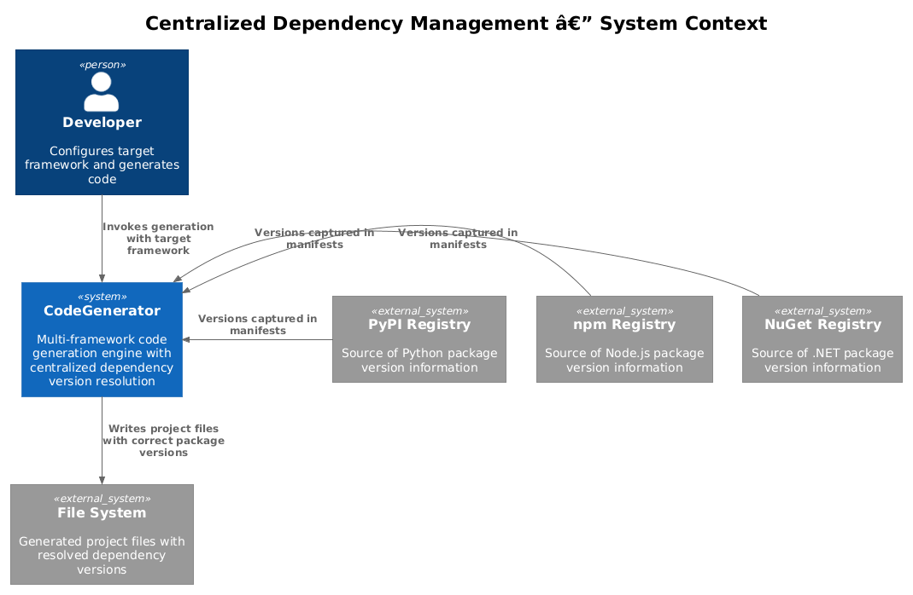
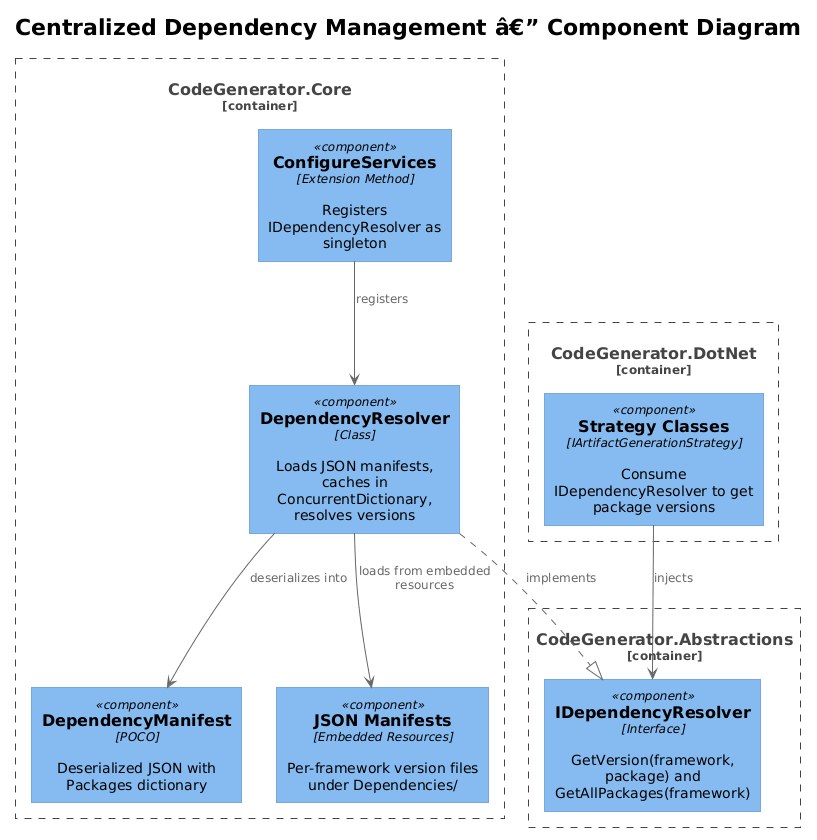
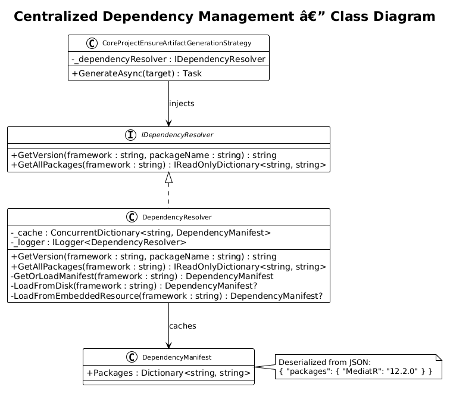
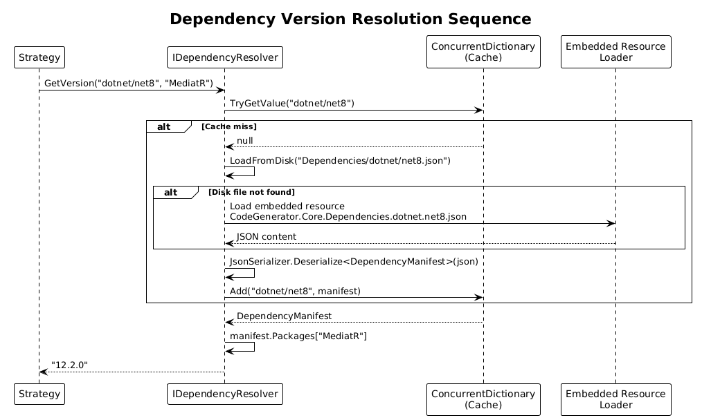

# Centralized Dependency Management -- Detailed Design

**Status:** Proposed

## 1. Overview

Dependency versions are currently hard-coded across strategy classes (e.g., `MediatR 12.0.0` in `ConsoleMicroserviceArtifactGenerationStrategy`, `EntityFrameworkCore 8.0.0` in `CoreProjectEnsureArtifactGenerationStrategy`, `jest 28.1.3` and unversioned `zustand`/`axios`/`tailwindcss` in React strategies). This makes version bumps error-prone and prevents users from targeting different framework versions without modifying strategy source code.

This design introduces a centralized `IDependencyResolver` service backed by per-framework JSON manifests. Strategies inject the resolver and request package versions by name and framework target, eliminating scattered hard-coded strings.

**Actors:** Strategy classes (consumers), framework manifest authors (maintainers), DI container (wiring).

**Scope:** New `IDependencyResolver` interface in `CodeGenerator.Abstractions`, `DependencyResolver` implementation in `CodeGenerator.Core`, JSON manifest files as embedded resources, and integration points in existing strategy classes.

## 2. Architecture

### 2.1 C4 Context Diagram

Shows the dependency resolver in the broader CodeGenerator ecosystem.



The developer configures a target framework (e.g., `dotnet/net8`). Strategy classes request package versions from the resolver, which loads the appropriate JSON manifest.

### 2.2 C4 Component Diagram

Shows the components within CodeGenerator.Core and CodeGenerator.Abstractions that participate in dependency resolution.



| Component | Project | Responsibility |
|-----------|---------|----------------|
| `IDependencyResolver` | CodeGenerator.Abstractions | Interface for resolving package versions by name and framework target |
| `DependencyResolver` | CodeGenerator.Core | Loads JSON manifests, caches results, returns version strings |
| `DependencyManifest` | CodeGenerator.Core | POCO model deserialized from manifest JSON |
| JSON Manifests | CodeGenerator.Core (embedded) | Per-framework version files under `Dependencies/` |
| Strategy Classes | CodeGenerator.DotNet, .React, etc. | Consumers that replace hard-coded versions with resolver calls |

### 2.3 Class Diagram



## 3. Component Details

### 3.1 IDependencyResolver

```csharp
// File: src/CodeGenerator.Abstractions/Services/IDependencyResolver.cs
namespace CodeGenerator.Core.Services;

public interface IDependencyResolver
{
    string GetVersion(string framework, string packageName);
    IReadOnlyDictionary<string, string> GetAllPackages(string framework);
}
```

- `GetVersion("dotnet/net8", "MediatR")` returns `"12.2.0"`.
- `GetAllPackages("react/v18")` returns the full dictionary for that manifest.
- Throws `KeyNotFoundException` if the package is not found in the manifest.

### 3.2 DependencyManifest

```csharp
// File: src/CodeGenerator.Core/Dependencies/DependencyManifest.cs
namespace CodeGenerator.Core.Dependencies;

public class DependencyManifest
{
    public Dictionary<string, string> Packages { get; set; } = new();
}
```

Deserialized directly from JSON via `System.Text.Json`.

### 3.3 DependencyResolver

```csharp
// File: src/CodeGenerator.Core/Dependencies/DependencyResolver.cs
namespace CodeGenerator.Core.Dependencies;

public class DependencyResolver : IDependencyResolver
{
    private readonly ConcurrentDictionary<string, DependencyManifest> _cache = new();
    private readonly ILogger<DependencyResolver> _logger;

    public DependencyResolver(ILogger<DependencyResolver> logger) { ... }

    public string GetVersion(string framework, string packageName)
    {
        var manifest = GetOrLoadManifest(framework);
        if (!manifest.Packages.TryGetValue(packageName, out var version))
            throw new KeyNotFoundException($"Package '{packageName}' not found in manifest '{framework}'.");
        return version;
    }

    public IReadOnlyDictionary<string, string> GetAllPackages(string framework)
    {
        return GetOrLoadManifest(framework).Packages;
    }

    private DependencyManifest GetOrLoadManifest(string framework)
    {
        return _cache.GetOrAdd(framework, key =>
        {
            // 1. Try disk path: Dependencies/{framework}.json
            // 2. Fallback: embedded resource CodeGenerator.Core.Dependencies.{normalized}.json
            // 3. Throw if neither exists
        });
    }
}
```

**Loading priority:**
1. Disk file at `Dependencies/{framework}.json` relative to the executing assembly location. This allows user overrides.
2. Embedded resource `CodeGenerator.Core.Dependencies.{framework-with-dots}.json` compiled into `CodeGenerator.Core.dll`.
3. If neither is found, throws `FileNotFoundException` with the attempted paths.

### 3.4 JSON Manifest Format

Each manifest file is a simple JSON object. Example for `dotnet/net8.json`:

```json
{
  "packages": {
    "MediatR": "12.2.0",
    "Microsoft.EntityFrameworkCore": "8.0.4",
    "Microsoft.EntityFrameworkCore.SqlServer": "8.0.4",
    "FluentValidation": "11.9.0",
    "Swashbuckle.AspNetCore": "6.5.0",
    "Microsoft.AspNetCore.Authentication.JwtBearer": "8.0.4"
  }
}
```

**Manifest files to create:**

| File Path | Key Packages |
|-----------|-------------|
| `Dependencies/dotnet/net8.json` | MediatR, EF Core 8.x, FluentValidation, Swashbuckle |
| `Dependencies/dotnet/net9.json` | MediatR, EF Core 9.x, FluentValidation, Swashbuckle |
| `Dependencies/react/v18.json` | react, zustand, axios, tailwindcss, jest, @testing-library/react |
| `Dependencies/angular/v17.json` | @angular/core, @angular/router, rxjs, zone.js |
| `Dependencies/python/3.12.json` | pytest, mypy, black, pydantic |
| `Dependencies/flask/3.0.json` | Flask, Flask-SQLAlchemy, Flask-Migrate, marshmallow |

All manifest files are embedded as resources in `CodeGenerator.Core.csproj`:

```xml
<ItemGroup>
  <EmbeddedResource Include="Dependencies/**/*.json" />
</ItemGroup>
```

### 3.5 DI Registration

In `CodeGenerator.Core.ConfigureServices`:

```csharp
services.AddSingleton<IDependencyResolver, DependencyResolver>();
```

Registered as singleton because the resolver caches manifests in a `ConcurrentDictionary` and is thread-safe.

### 3.6 Strategy Integration

Existing strategies replace hard-coded versions with resolver calls. Example migration in `CoreProjectEnsureArtifactGenerationStrategy`:

**Before:**
```csharp
new PackageReference("Microsoft.EntityFrameworkCore", "8.0.0")
```

**After:**
```csharp
new PackageReference(
    "Microsoft.EntityFrameworkCore",
    _dependencyResolver.GetVersion("dotnet/net8", "Microsoft.EntityFrameworkCore"))
```

The strategy receives `IDependencyResolver` via constructor injection. The framework target string (e.g., `"dotnet/net8"`) comes from the generation context or model being processed.

## 4. Sequence Diagram -- Version Resolution



## 5. Migration Plan

1. Add `IDependencyResolver` to `CodeGenerator.Abstractions`.
2. Add `DependencyManifest`, `DependencyResolver`, and JSON manifests to `CodeGenerator.Core`.
3. Register in `ConfigureServices`.
4. Update `CoreProjectEnsureArtifactGenerationStrategy` and `ConsoleMicroserviceArtifactGenerationStrategy` in `CodeGenerator.DotNet` as initial consumers.
5. Update React/Angular/Flask strategies to use resolver instead of hard-coded strings.
6. Add unit tests for manifest loading, caching, and fallback behavior.

## 6. Testing Strategy

| Test | Validates |
|------|-----------|
| `DependencyResolver_LoadsEmbeddedManifest` | Embedded resource fallback works |
| `DependencyResolver_DiskOverridesEmbedded` | Disk file takes priority over embedded |
| `DependencyResolver_CachesManifest` | Second call does not reload |
| `DependencyResolver_ThrowsOnMissingPackage` | `KeyNotFoundException` for unknown package |
| `DependencyResolver_ThrowsOnMissingManifest` | `FileNotFoundException` for unknown framework |
| `Strategy_UsesDependencyResolver` | Integration test verifying strategy output contains resolved version |
