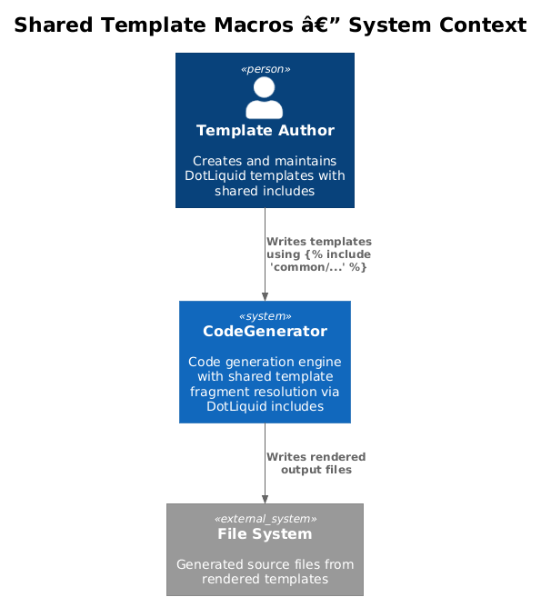
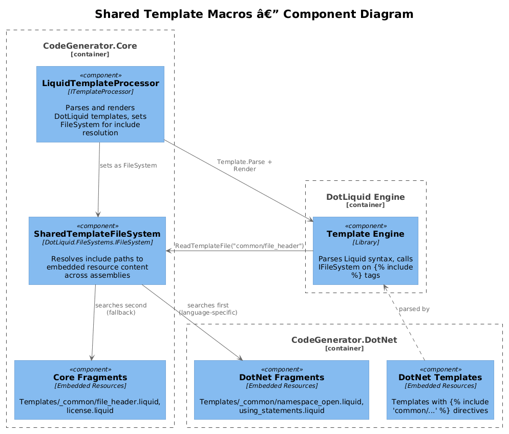
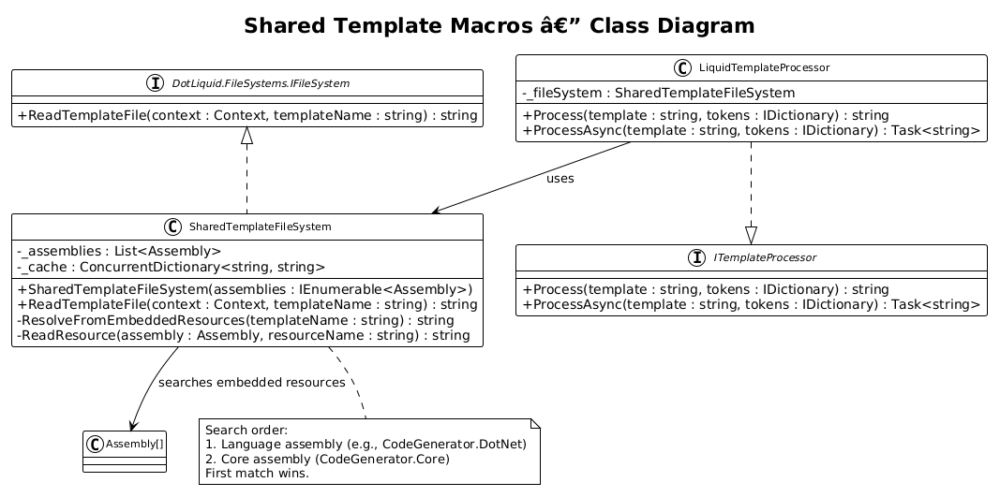
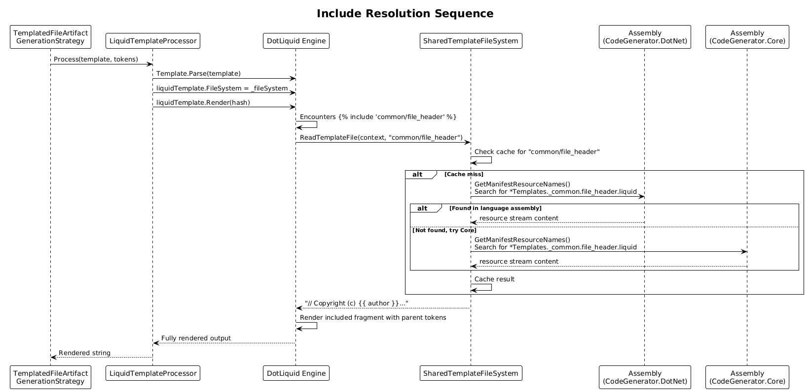

# Shared Template Macros -- Detailed Design

**Status:** Implemented

## 1. Overview

DotLiquid templates across CodeGenerator.DotNet, CodeGenerator.React, CodeGenerator.Angular, and other language assemblies contain duplicated boilerplate fragments -- copyright headers, namespace declarations, import statements, and common structural patterns. When these fragments change, every template must be updated individually.

This design introduces a `SharedTemplateFileSystem` that implements the DotLiquid `IFileSystem` interface to resolve `` tags from embedded resources across assemblies. Shared fragments live in a `Templates/_common/` directory within each language assembly, and a cross-assembly common set lives in `CodeGenerator.Core`. The file system is registered in the `LiquidTemplateProcessor` constructor.

**Actors:** Template authors (create/maintain fragments), `LiquidTemplateProcessor` (renders templates with includes), DotLiquid engine (calls `IFileSystem` on `` tags).

**Scope:** New `SharedTemplateFileSystem` class in `CodeGenerator.Core`, shared template fragments, and registration in `LiquidTemplateProcessor`.

## 2. Architecture

### 2.1 C4 Context Diagram



Template authors write DotLiquid templates that use `` syntax. The DotLiquid engine resolves include paths through the `SharedTemplateFileSystem`, which searches embedded resources across registered assemblies.

### 2.2 C4 Component Diagram



| Component | Project | Responsibility |
|-----------|---------|----------------|
| `SharedTemplateFileSystem` | CodeGenerator.Core | Implements `DotLiquid.FileSystems.IFileSystem`, resolves include paths to embedded resource content |
| `LiquidTemplateProcessor` | CodeGenerator.Core | Registers `SharedTemplateFileSystem` as the DotLiquid file system before parsing templates |
| Common Fragments | CodeGenerator.Core | `Templates/_common/` embedded resources: `file_header.liquid`, `license.liquid` |
| Language Fragments | CodeGenerator.DotNet, .React, etc. | `Templates/_common/` embedded resources: `namespace_open.liquid`, `using_statements.liquid`, `import_statements.liquid` |

### 2.3 Class Diagram



## 3. Component Details

### 3.1 SharedTemplateFileSystem

```csharp
// File: src/CodeGenerator.Core/Services/SharedTemplateFileSystem.cs
namespace CodeGenerator.Core.Services;

using DotLiquid.FileSystems;

public class SharedTemplateFileSystem : IFileSystem
{
    private readonly List<Assembly> _assemblies;
    private readonly ConcurrentDictionary<string, string> _cache = new();

    public SharedTemplateFileSystem(IEnumerable<Assembly> assemblies)
    {
        _assemblies = assemblies.ToList();
    }

    public string ReadTemplateFile(Context context, string templateName)
    {
        // templateName arrives as e.g. "common/file_header" from 
        return _cache.GetOrAdd(templateName, key => ResolveFromEmbeddedResources(key));
    }

    private string ResolveFromEmbeddedResources(string templateName)
    {
        // Convert "common/file_header" to resource suffix "Templates._common.file_header.liquid"
        var resourceSuffix = "Templates._common." +
            templateName.Replace("common/", "").Replace("/", ".") + ".liquid";

        foreach (var assembly in _assemblies)
        {
            var match = assembly.GetManifestResourceNames()
                .FirstOrDefault(r => r.EndsWith(resourceSuffix));
            if (match != null)
                return ReadResource(assembly, match);
        }

        throw new FileNotFoundException(
            $"Include template '{templateName}' not found in any registered assembly.");
    }
}
```

**Assembly search order:**
1. Language-specific assembly (e.g., `CodeGenerator.DotNet`) -- allows language-specific overrides.
2. `CodeGenerator.Core` -- provides cross-language defaults.

The order is controlled by how assemblies are registered. Each language project's `ConfigureServices` adds its own assembly first, followed by the core assembly.

### 3.2 LiquidTemplateProcessor Modification

The `LiquidTemplateProcessor` constructor sets the DotLiquid file system:

```csharp
public class LiquidTemplateProcessor : ITemplateProcessor
{
    private readonly SharedTemplateFileSystem _fileSystem;

    public LiquidTemplateProcessor(SharedTemplateFileSystem fileSystem)
    {
        _fileSystem = fileSystem;
    }

    public string Process(string template, IDictionary<string, object> tokens)
    {
        var hash = Hash.FromDictionary(tokens);
        var liquidTemplate = Template.Parse(template);
        liquidTemplate.FileSystem = _fileSystem;
        return liquidTemplate.Render(hash);
    }

    // ... other overloads similarly updated
}
```

The key change is setting `liquidTemplate.FileSystem = _fileSystem` before calling `Render`, which tells DotLiquid where to resolve `` tags.

### 3.3 Shared Fragment Files

Fragments are `.liquid` files embedded as resources. They use standard DotLiquid syntax and can reference tokens passed from the parent template.

**Core fragments (`CodeGenerator.Core/Templates/_common/`):**

| Fragment | Content |
|----------|---------|
| `file_header.liquid` | `// Copyright (c) {{ author }}. All Rights Reserved.`<br>`// Licensed under the MIT License.` |
| `license.liquid` | Full MIT license text with `{{ year }}` and `{{ author }}` tokens |

**DotNet fragments (`CodeGenerator.DotNet/Templates/_common/`):**

| Fragment | Content |
|----------|---------|
| `namespace_open.liquid` | `namespace {{ namespace }};` |
| `using_statements.liquid` | Common using directives with conditional blocks |

**React fragments (`CodeGenerator.React/Templates/_common/`):**

| Fragment | Content |
|----------|---------|
| `import_statements.liquid` | Common React import patterns |
| `file_header.liquid` | JS-style copyright comment (overrides Core version) |

**Flask fragments (`CodeGenerator.Flask/Templates/_common/`):**

| Fragment | Content |
|----------|---------|
| `import_statements.liquid` | Common Flask/Python import patterns |

### 3.4 Template Usage Example

A DotNet template before and after:

**Before (`Controller.liquid`):**
```liquid
// Copyright (c) {{ SolutionNamespace }}. All Rights Reserved.
// Licensed under the MIT License.

namespace {{ namespace }};

using MediatR;
using Microsoft.AspNetCore.Mvc;
// ... rest of template
```

**After (`Controller.liquid`):**
```liquid




using MediatR;
using Microsoft.AspNetCore.Mvc;
// ... rest of template
```

### 3.5 DI Registration

In `CodeGenerator.Core.ConfigureServices`:

```csharp
services.AddSingleton<SharedTemplateFileSystem>(sp =>
{
    var assemblies = AppDomain.CurrentDomain.GetAssemblies()
        .Where(a => a.GetName().Name?.StartsWith("CodeGenerator") == true)
        .ToList();
    return new SharedTemplateFileSystem(assemblies);
});
```

### 3.6 Embedded Resource Configuration

Each project `.csproj` that contains shared fragments adds:

```xml
<ItemGroup>
  <EmbeddedResource Include="Templates\_common\**\*.liquid" />
</ItemGroup>
```

## 4. Sequence Diagram -- Include Resolution



## 5. Migration Plan

1. Add `SharedTemplateFileSystem` to `CodeGenerator.Core`.
2. Create `Templates/_common/file_header.liquid` and `Templates/_common/license.liquid` in `CodeGenerator.Core`.
3. Modify `LiquidTemplateProcessor` to accept and use `SharedTemplateFileSystem`.
4. Register `SharedTemplateFileSystem` in `ConfigureServices`.
5. Create language-specific fragments in `CodeGenerator.DotNet`, `.React`, `.Angular`, `.Flask`, `.Python`.
6. Update `.csproj` files to embed the new `.liquid` resources.
7. Migrate one template per language project to use `` as validation.
8. Progressively migrate remaining templates.

## 6. Testing Strategy

| Test | Validates |
|------|-----------|
| `SharedTemplateFileSystem_ResolvesFromCore` | Core assembly fragments are found |
| `SharedTemplateFileSystem_LanguageOverridesCore` | Language-specific fragment takes precedence |
| `SharedTemplateFileSystem_CachesResults` | Second lookup uses cache |
| `SharedTemplateFileSystem_ThrowsOnMissing` | `FileNotFoundException` for unknown include |
| `LiquidTemplateProcessor_RendersInclude` | End-to-end: template with `` produces correct output |
| `Template_BackwardCompatible` | Templates without includes still render correctly |
