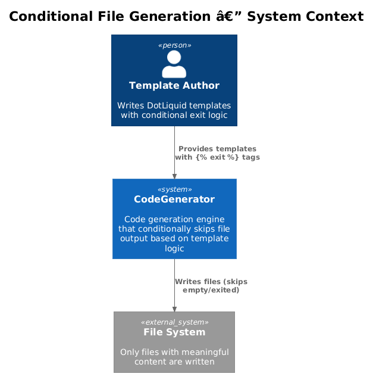
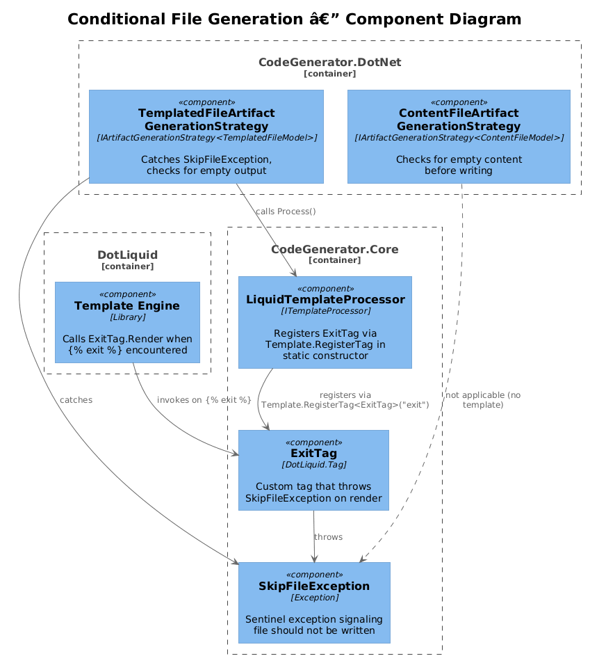
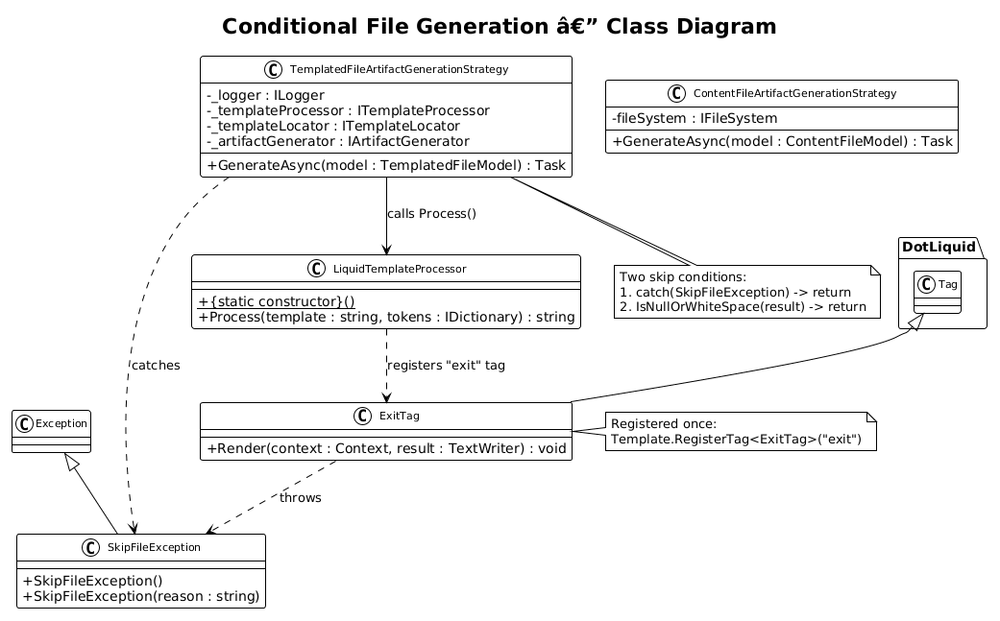
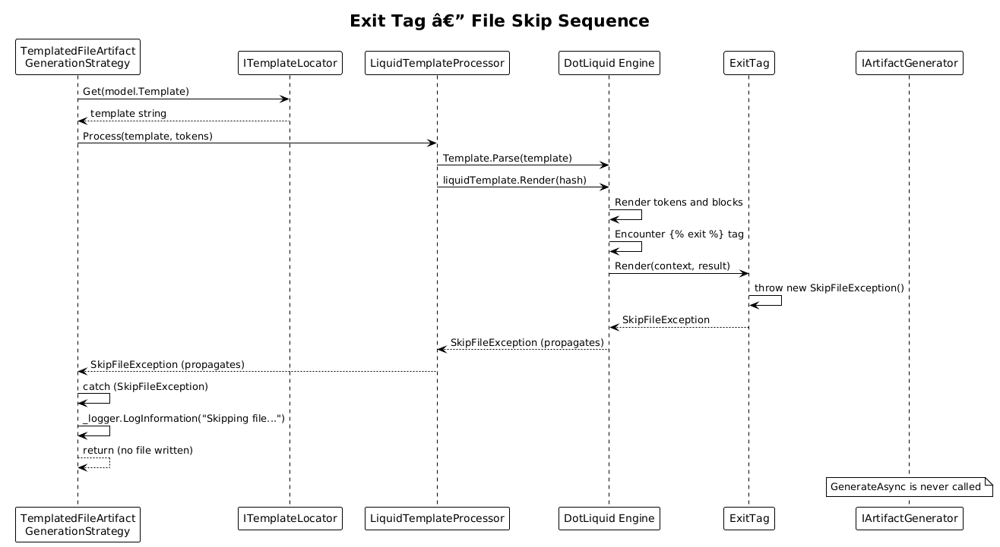

# Conditional File Generation -- Detailed Design

**Status:** Proposed

## 1. Overview

Currently, every template that runs produces an output file, even when the template's logic determines that no file should be generated for a particular model. Templates have no way to signal "skip this file" -- they can only produce empty output, which still results in an empty file being written to disk.

This design adds two mechanisms for conditional file generation:

1. **Explicit skip:** A custom DotLiquid `` tag that throws a `SkipFileException`, caught by artifact generation strategies to suppress file output.
2. **Implicit skip:** Strategies detect when a rendered template produces empty or whitespace-only content and suppress the file write automatically.

**Actors:** Template authors (use `` in templates), `TemplatedFileArtifactGenerationStrategy` and `ContentFileArtifactGenerationStrategy` (catch exceptions and check output).

**Scope:** New `ExitTag` and `SkipFileException` classes in `CodeGenerator.Core`, modifications to `TemplatedFileArtifactGenerationStrategy` in `CodeGenerator.DotNet` and `ContentFileArtifactGenerationStrategy` in `CodeGenerator.DotNet`.

## 2. Architecture

### 2.1 C4 Context Diagram



Template authors write conditional templates. When a template decides it should not produce output, it uses `` or renders to empty content. The generation strategy detects this and skips writing the file.

### 2.2 C4 Component Diagram



| Component | Project | Responsibility |
|-----------|---------|----------------|
| `ExitTag` | CodeGenerator.Core | Custom DotLiquid tag that throws `SkipFileException` when rendered |
| `SkipFileException` | CodeGenerator.Core | Sentinel exception signaling file generation should be skipped |
| `TemplatedFileArtifactGenerationStrategy` | CodeGenerator.DotNet | Catches `SkipFileException` and checks for empty output |
| `ContentFileArtifactGenerationStrategy` | CodeGenerator.DotNet | Checks for empty content before writing |
| `LiquidTemplateProcessor` | CodeGenerator.Core | Registers the `exit` tag with DotLiquid |

### 2.3 Class Diagram



## 3. Component Details

### 3.1 SkipFileException

```csharp
// File: src/CodeGenerator.Core/Artifacts/SkipFileException.cs
namespace CodeGenerator.Core.Artifacts;

public class SkipFileException : Exception
{
    public SkipFileException()
        : base("Template signaled to skip file generation.") { }

    public SkipFileException(string reason)
        : base(reason) { }
}
```

This is a simple sentinel exception. It carries no complex state -- its type alone signals the intent.

### 3.2 ExitTag

```csharp
// File: src/CodeGenerator.Core/Liquid/ExitTag.cs
namespace CodeGenerator.Core.Liquid;

using DotLiquid;

public class ExitTag : Tag
{
    public override void Render(Context context, TextWriter result)
    {
        throw new SkipFileException();
    }
}
```

DotLiquid tags extend `DotLiquid.Tag` and override `Render`. When the DotLiquid engine encounters `` during rendering, it calls `ExitTag.Render`, which throws `SkipFileException`. The exception propagates up through `Template.Render` to the calling strategy.

### 3.3 Tag Registration

Registration happens once in a static constructor or module initializer in `LiquidTemplateProcessor`:

```csharp
// Added to: src/CodeGenerator.Core/Services/LiquidTemplateProcessor.cs
public class LiquidTemplateProcessor : ITemplateProcessor
{
    static LiquidTemplateProcessor()
    {
        Template.RegisterTag<ExitTag>("exit");
    }

    // ... existing methods unchanged
}
```

`Template.RegisterTag` is a global DotLiquid registration. The static constructor ensures it runs exactly once before any template processing.

### 3.4 TemplatedFileArtifactGenerationStrategy Modification

```csharp
// Modified: src/CodeGenerator.DotNet/Artifacts/Files/Strategies/TemplatedFileArtifactGenerationStrategy.cs
public async Task GenerateAsync(TemplatedFileModel model)
{
    _logger.LogInformation("Generating artifact for {0}.", model);

    var template = _templateLocator.Get(model.Template);

    var tokens = new TokensBuilder()
        .With("SolutionNamespace", _solutionNamespaceProvider.Get(model.Directory))
        .Build();

    foreach (var token in tokens)
    {
        try { model.Tokens.Add(token.Key, token.Value); }
        catch { }
    }

    string result;
    try
    {
        result = _templateProcessor.Process(template, model.Tokens);
    }
    catch (SkipFileException ex)
    {
        _logger.LogInformation("Skipping file {Name}: {Reason}", model.Name, ex.Message);
        return;
    }

    // Implicit skip: empty or whitespace-only output
    if (string.IsNullOrWhiteSpace(result))
    {
        _logger.LogInformation("Skipping file {Name}: rendered output is empty.", model.Name);
        return;
    }

    model.Body = string.Join(Environment.NewLine, result);

    await _artifactGenerator.GenerateAsync(new FileModel(model.Name, model.Directory, model.Extension)
    {
        Body = model.Body,
    });
}
```

Two guard conditions:
1. `catch (SkipFileException)` -- explicit skip via `` tag.
2. `string.IsNullOrWhiteSpace(result)` -- implicit skip when all conditional blocks produced no content.

### 3.5 ContentFileArtifactGenerationStrategy Modification

```csharp
// Modified: src/CodeGenerator.DotNet/Artifacts/Files/Strategies/ContentFileArtifactGenerationStrategy.cs
public async Task GenerateAsync(ContentFileModel model)
{
    if (string.IsNullOrWhiteSpace(model.Content))
    {
        return; // Suppress empty file writes
    }

    var directory = fileSystem.Path.GetDirectoryName(model.Path);
    if (!string.IsNullOrEmpty(directory) && !fileSystem.Directory.Exists(directory))
    {
        fileSystem.Directory.CreateDirectory(directory);
    }

    fileSystem.File.WriteAllText(model.Path, model.Content);
}
```

`ContentFileModel` does not go through DotLiquid, so only the implicit empty-check applies.

### 3.6 Template Usage Example

A template that conditionally generates a DbContext only when entities exist:

```liquid

// Copyright (c) {{ SolutionNamespace }}. All Rights Reserved.
using Microsoft.EntityFrameworkCore;

namespace {{ namespace }};

public class {{ DbContextName }} : DbContext
{
    
    public DbSet<{{ entity.Name }}> {{ entity.PluralName }} { get; set; }
    
}
```

If `entities` is an empty list, `` fires and no file is written.

## 4. Sequence Diagram -- Exit Tag Flow



## 5. Edge Cases

| Scenario | Behavior |
|----------|----------|
| `` inside a `` loop | Exception propagates immediately; partial output discarded |
| `` inside an `` block | Only fires when the branch is taken |
| Template renders to only whitespace/newlines | File suppressed (implicit skip) |
| Template renders to a single comment line | File IS generated (not whitespace-only) |
| `` in an included fragment | Exception propagates up through the include |

## 6. Migration Plan

1. Add `SkipFileException` to `CodeGenerator.Core.Artifacts`.
2. Add `ExitTag` to `CodeGenerator.Core.Liquid`.
3. Register `exit` tag in `LiquidTemplateProcessor` static constructor.
4. Modify `TemplatedFileArtifactGenerationStrategy` to catch `SkipFileException` and check for empty output.
5. Modify `ContentFileArtifactGenerationStrategy` to check for empty content.
6. Add `` to templates that currently generate unnecessary empty files.

## 7. Testing Strategy

| Test | Validates |
|------|-----------|
| `ExitTag_ThrowsSkipFileException` | Tag renders and throws correctly |
| `Strategy_SkipsOnExitTag` | No file written when `` fires |
| `Strategy_SkipsOnEmptyOutput` | No file written when template renders to whitespace |
| `Strategy_WritesNonEmptyOutput` | Normal templates still produce files |
| `ExitTag_InConditional_OnlyFiresWhenTrue` | `` does not skip |
| `ExitTag_InInclude_Propagates` | Exit in included fragment skips the parent file |
