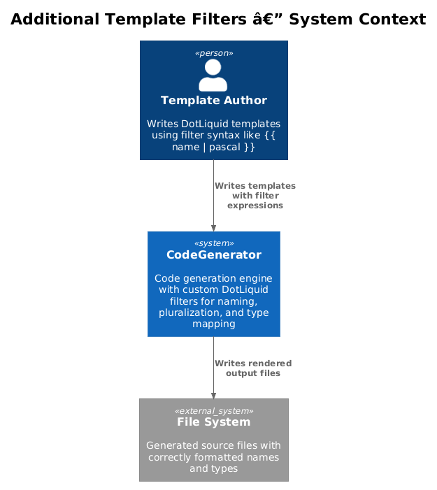
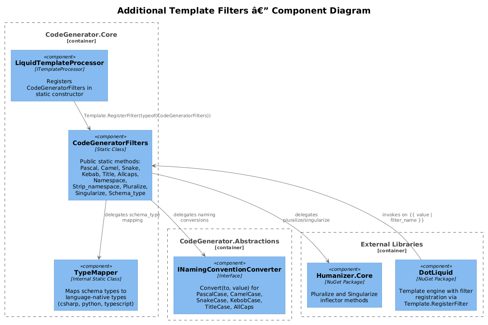
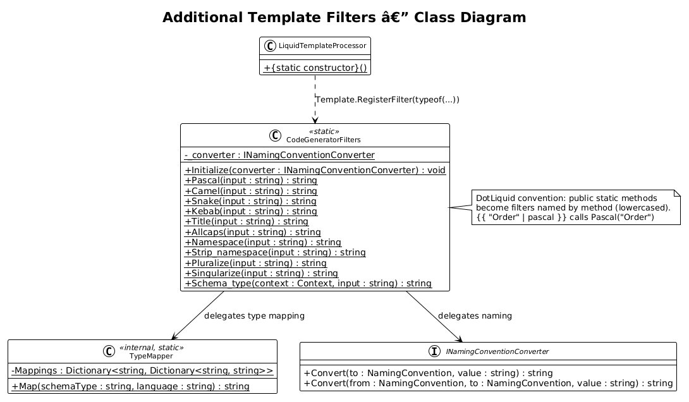
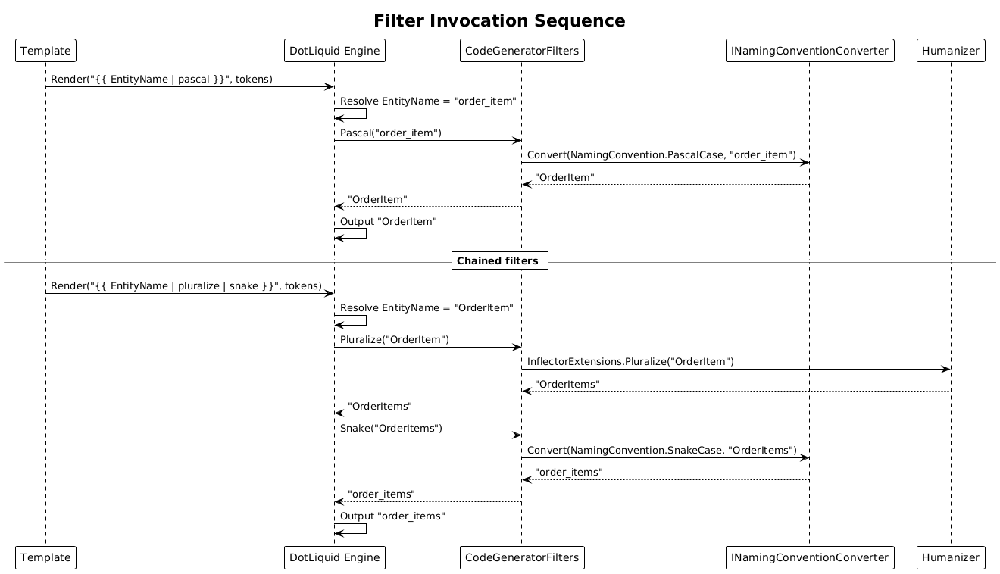

# Additional Template Filters -- Detailed Design

**Status:** Proposed

## 1. Overview

DotLiquid templates in CodeGenerator currently rely on the `TokensBuilder` to pre-compute 8 naming variants per token (PascalCase, camelCase, snake_case, etc.) before rendering. This means every token must be expanded upfront, inflating the token dictionary and requiring template authors to know the exact suffixed key names (e.g., `{{ EntityNamePascalCase }}`, `{{ entityNameCamelCase }}`).

This design adds custom DotLiquid filters that perform naming conversions, pluralization, and type mapping at render time. Template authors can write `{{ name | pascal }}` or `{{ name | pluralize }}` instead of relying on pre-computed variants. Filters are registered globally via `Template.RegisterFilter` in the `LiquidTemplateProcessor` static constructor.

**Actors:** Template authors (use filter syntax in templates), `LiquidTemplateProcessor` (registers filters), `INamingConventionConverter` (provides conversion logic).

**Scope:** New `CodeGeneratorFilters` static class in `CodeGenerator.Core`, filter registration in `LiquidTemplateProcessor`, and optional Humanizer dependency for pluralization.

## 2. Architecture

### 2.1 C4 Context Diagram



Template authors write DotLiquid templates using filter syntax like `{{ name | pascal }}`. The DotLiquid engine invokes the registered filter methods, which delegate to existing `INamingConventionConverter` and new utility methods.

### 2.2 C4 Component Diagram



| Component | Project | Responsibility |
|-----------|---------|----------------|
| `CodeGeneratorFilters` | CodeGenerator.Core | Static class with public static methods matching DotLiquid filter convention |
| `LiquidTemplateProcessor` | CodeGenerator.Core | Registers `CodeGeneratorFilters` via `Template.RegisterFilter` in static constructor |
| `INamingConventionConverter` | CodeGenerator.Abstractions | Existing interface for naming convention conversion (6 conventions) |
| `NamingConventionConverter` | CodeGenerator.Core | Existing implementation used by filter methods |

### 2.3 Class Diagram



## 3. Component Details

### 3.1 CodeGeneratorFilters

```csharp
// File: src/CodeGenerator.Core/Liquid/CodeGeneratorFilters.cs
namespace CodeGenerator.Core.Liquid;

public static class CodeGeneratorFilters
{
    // Initialized once via a static setter called from ConfigureServices
    private static INamingConventionConverter _converter;

    public static void Initialize(INamingConventionConverter converter)
    {
        _converter = converter;
    }

    // --- Naming convention filters ---

    public static string Pascal(string input)
        => _converter.Convert(NamingConvention.PascalCase, input);

    public static string Camel(string input)
        => _converter.Convert(NamingConvention.CamelCase, input);

    public static string Snake(string input)
        => _converter.Convert(NamingConvention.SnakeCase, input);

    public static string Kebab(string input)
        => _converter.Convert(NamingConvention.KebobCase, input);

    public static string Title(string input)
        => _converter.Convert(NamingConvention.TitleCase, input);

    public static string Allcaps(string input)
        => _converter.Convert(NamingConvention.AllCaps, input);

    // --- String manipulation filters ---

    public static string Namespace(string input)
    {
        // Extract namespace: "MyApp.Models.Order" -> "MyApp.Models"
        var lastDot = input.LastIndexOf('.');
        return lastDot > 0 ? input[..lastDot] : string.Empty;
    }

    public static string Strip_namespace(string input)
    {
        // Get last segment: "MyApp.Models.Order" -> "Order"
        var lastDot = input.LastIndexOf('.');
        return lastDot >= 0 ? input[(lastDot + 1)..] : input;
    }

    // --- Pluralization filters ---

    public static string Pluralize(string input)
        => Humanizer.InflectorExtensions.Pluralize(input, inputIsKnownToBeSingular: false);

    public static string Singularize(string input)
        => Humanizer.InflectorExtensions.Singularize(input, inputIsKnownToBePlural: false);

    // --- Type mapping filter ---

    public static string Schema_type(Context context, string input)
    {
        // Reads "language" from the template context to determine target type system
        var language = context["language"]?.ToString() ?? "csharp";
        return TypeMapper.Map(input, language);
    }
}
```

**DotLiquid filter convention:** DotLiquid discovers public static methods on a registered filter class. The method name (lowercased) becomes the filter name. The first parameter is the piped input value. An optional `Context` parameter (must be the first parameter) gives access to template variables.

### 3.2 Filter Reference

| Filter | Template Usage | Example Input | Example Output |
|--------|---------------|---------------|----------------|
| `pascal` | `{{ name \| pascal }}` | `"order_item"` | `"OrderItem"` |
| `camel` | `{{ name \| camel }}` | `"OrderItem"` | `"orderItem"` |
| `snake` | `{{ name \| snake }}` | `"OrderItem"` | `"order_item"` |
| `kebab` | `{{ name \| kebab }}` | `"OrderItem"` | `"order-item"` |
| `title` | `{{ name \| title }}` | `"order_item"` | `"Order Item"` |
| `allcaps` | `{{ name \| allcaps }}` | `"OrderItem"` | `"ORDER_ITEM"` |
| `namespace` | `{{ qualifiedName \| namespace }}` | `"MyApp.Models.Order"` | `"MyApp.Models"` |
| `strip_namespace` | `{{ qualifiedName \| strip_namespace }}` | `"MyApp.Models.Order"` | `"Order"` |
| `pluralize` | `{{ name \| pluralize }}` | `"Order"` | `"Orders"` |
| `singularize` | `{{ name \| singularize }}` | `"Orders"` | `"Order"` |
| `schema_type` | `{{ type \| schema_type }}` | `"string"` (language=python) | `"str"` |

### 3.3 TypeMapper

A simple internal static class for the `schema_type` filter:

```csharp
// File: src/CodeGenerator.Core/Liquid/TypeMapper.cs
namespace CodeGenerator.Core.Liquid;

internal static class TypeMapper
{
    private static readonly Dictionary<string, Dictionary<string, string>> Mappings = new()
    {
        ["csharp"] = new()
        {
            ["string"] = "string", ["int"] = "int", ["float"] = "double",
            ["bool"] = "bool", ["datetime"] = "DateTime", ["uuid"] = "Guid",
        },
        ["python"] = new()
        {
            ["string"] = "str", ["int"] = "int", ["float"] = "float",
            ["bool"] = "bool", ["datetime"] = "datetime", ["uuid"] = "UUID",
        },
        ["typescript"] = new()
        {
            ["string"] = "string", ["int"] = "number", ["float"] = "number",
            ["bool"] = "boolean", ["datetime"] = "Date", ["uuid"] = "string",
        },
    };

    public static string Map(string schemaType, string language)
    {
        if (Mappings.TryGetValue(language.ToLowerInvariant(), out var langMap)
            && langMap.TryGetValue(schemaType.ToLowerInvariant(), out var nativeType))
            return nativeType;

        return schemaType; // Pass through unmapped types
    }
}
```

### 3.4 Filter Registration

Registration happens in the `LiquidTemplateProcessor` static constructor:

```csharp
// Modified: src/CodeGenerator.Core/Services/LiquidTemplateProcessor.cs
public class LiquidTemplateProcessor : ITemplateProcessor
{
    static LiquidTemplateProcessor()
    {
        Template.RegisterFilter(typeof(CodeGeneratorFilters));
    }

    // ... existing methods unchanged
}
```

The `INamingConventionConverter` dependency is initialized during DI setup:

```csharp
// In ConfigureServices:
services.AddSingleton<LiquidTemplateProcessor>(sp =>
{
    var converter = sp.GetRequiredService<INamingConventionConverter>();
    CodeGeneratorFilters.Initialize(converter);
    return new LiquidTemplateProcessor();
});
```

### 3.5 Humanizer Dependency

The `pluralize` and `singularize` filters require the Humanizer NuGet package:

```xml
<!-- Added to CodeGenerator.Core.csproj -->
<PackageReference Include="Humanizer.Core" Version="2.14.1" />
```

Humanizer.Core is a lightweight package (~100KB) with no transitive dependencies beyond .NET itself. Only `Humanizer.InflectorExtensions` is used.

### 3.6 Template Usage Example

**Before (using pre-computed tokens):**
```liquid
using Microsoft.EntityFrameworkCore;

namespace {{ SolutionNamespacePascalCase }}.Infrastructure;

public class {{ EntityNamePascalCase }}Configuration : IEntityTypeConfiguration<{{ EntityNamePascalCase }}>
{
    public void Configure(EntityTypeBuilder<{{ EntityNamePascalCase }}> builder)
    {
        builder.ToTable("{{ EntityNameSnakeCase }}");
        builder.HasKey(x => x.{{ EntityNamePascalCase }}Id);
    }
}
```

**After (using filters):**
```liquid
using Microsoft.EntityFrameworkCore;

namespace {{ SolutionNamespace | pascal }}.Infrastructure;

public class {{ EntityName | pascal }}Configuration : IEntityTypeConfiguration<{{ EntityName | pascal }}>
{
    public void Configure(EntityTypeBuilder<{{ EntityName | pascal }}> builder)
    {
        builder.ToTable("{{ EntityName | snake }}");
        builder.HasKey(x => x.{{ EntityName | pascal }}Id);
    }
}
```

Filters can be chained: `{{ EntityName | pluralize | snake }}` produces `"order_items"` from `"OrderItem"`.

## 4. Sequence Diagram -- Filter Invocation



## 5. Backward Compatibility

Filters are purely additive. Existing templates that use pre-computed token names (e.g., `{{ EntityNamePascalCase }}`) continue to work unchanged because the `TokensBuilder` still generates those keys. Templates can gradually migrate to filter syntax at the author's convenience.

## 6. Migration Plan

1. Add `Humanizer.Core` package reference to `CodeGenerator.Core.csproj`.
2. Add `CodeGeneratorFilters` to `CodeGenerator.Core.Liquid`.
3. Add `TypeMapper` to `CodeGenerator.Core.Liquid`.
4. Register filter in `LiquidTemplateProcessor` static constructor.
5. Initialize `CodeGeneratorFilters` with `INamingConventionConverter` in `ConfigureServices`.
6. Add unit tests for each filter method.
7. Migrate templates incrementally (no big-bang rewrite needed).

## 7. Testing Strategy

| Test | Validates |
|------|-----------|
| `Pascal_ConvertsSnakeCase` | `"order_item"` -> `"OrderItem"` |
| `Camel_ConvertsPascalCase` | `"OrderItem"` -> `"orderItem"` |
| `Snake_ConvertsPascalCase` | `"OrderItem"` -> `"order_item"` |
| `Kebab_ConvertsPascalCase` | `"OrderItem"` -> `"order-item"` |
| `Namespace_ExtractsParent` | `"A.B.C"` -> `"A.B"` |
| `StripNamespace_GetsLastSegment` | `"A.B.C"` -> `"C"` |
| `Pluralize_StandardNoun` | `"Order"` -> `"Orders"` |
| `Singularize_StandardNoun` | `"Orders"` -> `"Order"` |
| `SchemaType_MapsToLanguage` | `"uuid"` + `"csharp"` -> `"Guid"` |
| `SchemaType_PassesUnknownThrough` | `"CustomType"` -> `"CustomType"` |
| `FilterChaining_Works` | `{{ "Order" \| pluralize \| snake }}` -> `"orders"` |
| `TemplateRender_WithFilters` | End-to-end template rendering with filter syntax |
