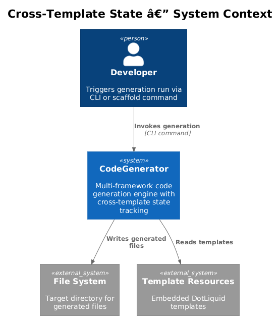
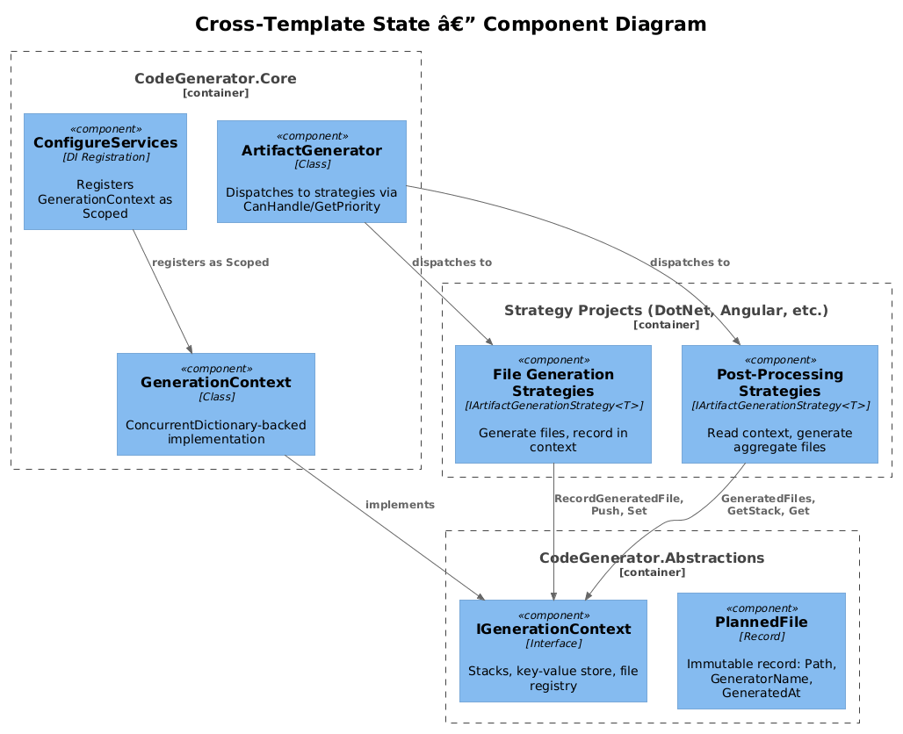
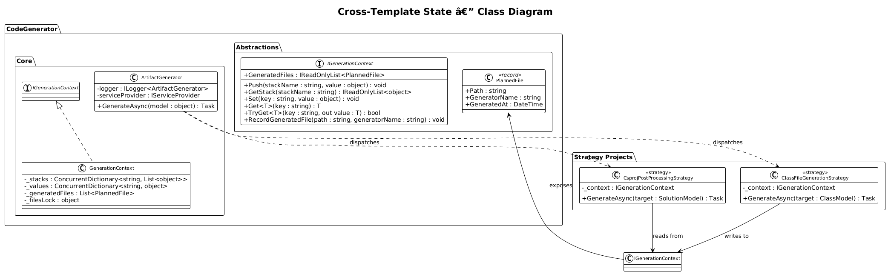
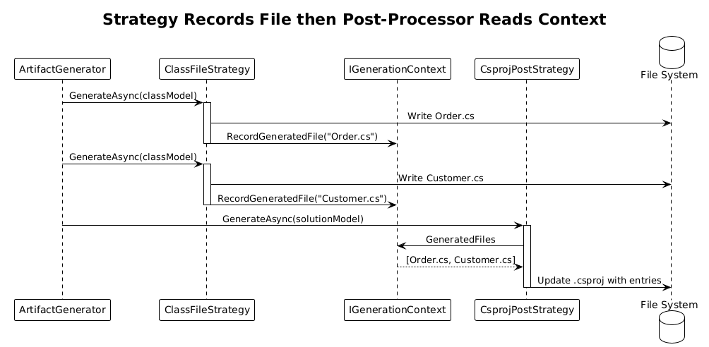
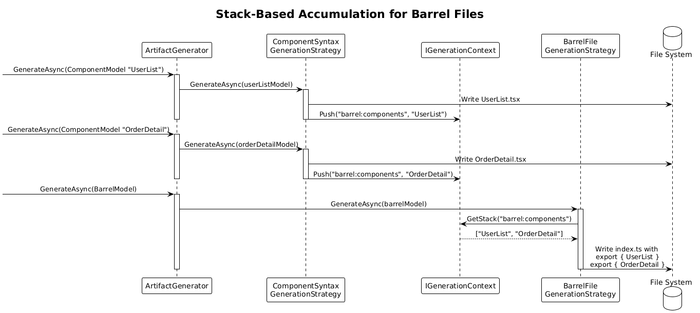

# Cross-Template State / Generation Context -- Detailed Design

**Status:** Implemented

## 1. Overview

The Cross-Template State feature introduces `IGenerationContext`, a scoped container that persists state across template renders within a single generation session. Currently, artifact generation strategies operate in isolation -- each strategy generates its output without awareness of what other strategies have produced. This makes it impossible to generate aggregate files (e.g., `.csproj` item groups, `package.json` dependency lists, barrel/index files) that depend on knowing which files were created during the session.

`IGenerationContext` solves this by providing a shared, per-session state container with named stacks, key-value storage, and a generated-file registry. Strategies can record files they produce, push values onto named stacks, and post-processing strategies can read that accumulated state to generate aggregate outputs.

**Origin:** Pattern 6 from xregistry/codegen -- cross-template state management.

**Actors:** Artifact generation strategies that need cross-file awareness; post-processing strategies that generate aggregate files.

**Scope:** The `IGenerationContext` interface (in Abstractions), its `GenerationContext` implementation (in Core), integration with `ArtifactGenerator`, and DI registration as a scoped service.

## 2. Architecture

### 2.1 C4 Context Diagram

Shows `IGenerationContext` in the broader CodeGenerator ecosystem.



The developer triggers a generation run. The `ArtifactGenerator` orchestrates strategy dispatch. Each strategy receives the `IGenerationContext` via constructor injection and uses it to record generated files and share state. Post-processing strategies read the accumulated context to produce aggregate outputs.

### 2.2 C4 Component Diagram

Shows the internal components and their interactions.



| Component | Project | Responsibility |
|-----------|---------|----------------|
| `IGenerationContext` | CodeGenerator.Abstractions | Interface defining stacks, key-value store, and file registry |
| `GenerationContext` | CodeGenerator.Core | Thread-safe implementation using `ConcurrentDictionary` |
| `PlannedFile` | CodeGenerator.Abstractions | Record representing a file generated during the session |
| `ArtifactGenerator` | CodeGenerator.Core | Orchestrator that creates/manages the context scope |
| Strategy implementations | DotNet, Angular, React, etc. | Consumers that read/write context state |

### 2.3 Class Diagram



## 3. Component Details

### 3.1 IGenerationContext

**Location:** `src/CodeGenerator.Abstractions/Services/IGenerationContext.cs`

```csharp
namespace CodeGenerator.Core.Services;

public interface IGenerationContext
{
    void Push(string stackName, object value);
    IReadOnlyList<object> GetStack(string stackName);
    void Set(string key, object value);
    T Get<T>(string key);
    bool TryGet<T>(string key, out T value);
    IReadOnlyList<PlannedFile> GeneratedFiles { get; }
    void RecordGeneratedFile(string path, string generatorName);
}
```

- **`Push` / `GetStack`** -- Named stacks allow strategies to accumulate ordered lists of values. For example, a stack named `"csproj:PackageReferences"` could collect NuGet references across multiple strategies.
- **`Set` / `Get<T>` / `TryGet<T>`** -- Key-value store for arbitrary cross-strategy communication. Keys are strings; values are typed on retrieval. `Get<T>` throws `KeyNotFoundException` if the key is missing. `TryGet<T>` returns false.
- **`GeneratedFiles`** -- Read-only list of all files recorded during this generation session.
- **`RecordGeneratedFile`** -- Records a file path and the name of the strategy that generated it.

### 3.2 PlannedFile

**Location:** `src/CodeGenerator.Abstractions/Services/PlannedFile.cs`

```csharp
namespace CodeGenerator.Core.Services;

public record PlannedFile(string Path, string GeneratorName, DateTime GeneratedAt);
```

Immutable record capturing when and by whom a file was generated.

### 3.3 GenerationContext

**Location:** `src/CodeGenerator.Core/Services/GenerationContext.cs`

```csharp
namespace CodeGenerator.Core.Services;

public class GenerationContext : IGenerationContext
{
    private readonly ConcurrentDictionary<string, List<object>> _stacks = new();
    private readonly ConcurrentDictionary<string, object> _values = new();
    private readonly List<PlannedFile> _generatedFiles = new();
    private readonly object _filesLock = new();

    public void Push(string stackName, object value)
    {
        var stack = _stacks.GetOrAdd(stackName, _ => new List<object>());
        lock (stack) { stack.Add(value); }
    }

    public IReadOnlyList<object> GetStack(string stackName)
    {
        return _stacks.TryGetValue(stackName, out var stack)
            ? stack.AsReadOnly()
            : Array.Empty<object>();
    }

    public void Set(string key, object value) => _values[key] = value;

    public T Get<T>(string key)
    {
        if (_values.TryGetValue(key, out var value))
            return (T)value;
        throw new KeyNotFoundException($"Generation context key '{key}' not found.");
    }

    public bool TryGet<T>(string key, out T value)
    {
        if (_values.TryGetValue(key, out var raw) && raw is T typed)
        {
            value = typed;
            return true;
        }
        value = default!;
        return false;
    }

    public IReadOnlyList<PlannedFile> GeneratedFiles
    {
        get { lock (_filesLock) { return _generatedFiles.ToList().AsReadOnly(); } }
    }

    public void RecordGeneratedFile(string path, string generatorName)
    {
        lock (_filesLock)
        {
            _generatedFiles.Add(new PlannedFile(path, generatorName, DateTime.UtcNow));
        }
    }
}
```

**Thread safety:** `ConcurrentDictionary` for stacks and values; explicit lock for the generated files list since `List<T>` is not thread-safe. Individual stacks are locked on write because the `List<object>` values inside the `ConcurrentDictionary` are also not thread-safe.

### 3.4 DI Registration

**Location:** `src/CodeGenerator.Core/ConfigureServices.cs`

```csharp
services.AddScoped<IGenerationContext, GenerationContext>();
```

Registered as **Scoped** -- not Singleton. Each generation run (e.g., each CLI invocation or each scaffold operation) gets a fresh context. This prevents state leakage between runs. The CLI host creates a scope per command execution; the scaffold engine creates a scope per scaffold run.

### 3.5 Integration with ArtifactGenerator

`ArtifactGenerator` does not directly reference `IGenerationContext`. Instead, individual strategies receive the context via constructor injection:

```csharp
public class CsprojPostProcessingStrategy : IArtifactGenerationStrategy<SolutionModel>
{
    private readonly IGenerationContext _context;

    public CsprojPostProcessingStrategy(IGenerationContext context)
    {
        _context = context;
    }

    public int GetPriority() => 0; // Runs after higher-priority strategies

    public async Task GenerateAsync(SolutionModel target)
    {
        var generatedFiles = _context.GeneratedFiles;
        // Use generatedFiles to update .csproj ItemGroup entries
    }
}
```

## 4. Key Workflows

### 4.1 Strategy Records File, Post-Processor Reads Context

The primary workflow: a generation strategy produces a file and records it, then a post-processing strategy reads the accumulated file list.



**Step-by-step:**

1. **ArtifactGenerator dispatches** -- `ArtifactGenerator.GenerateAsync()` is called for a `ClassModel`. It resolves to `ClassFileGenerationStrategy`.
2. **Strategy generates file** -- `ClassFileGenerationStrategy` renders the class file using `ITemplateProcessor` and writes it to disk.
3. **Strategy records file** -- Calls `_context.RecordGeneratedFile("src/Domain/Order.cs", "ClassFileGenerationStrategy")`.
4. **More strategies execute** -- Additional models are processed. Each recording strategy calls `RecordGeneratedFile`.
5. **Post-processor dispatched** -- `ArtifactGenerator.GenerateAsync()` is called for a `SolutionModel`. It resolves to `CsprojPostProcessingStrategy`.
6. **Post-processor reads context** -- `CsprojPostProcessingStrategy` reads `_context.GeneratedFiles` to discover all `.cs` files generated in the session.
7. **Post-processor generates aggregate** -- Updates the `.csproj` file with `<Compile Include="..." />` entries for each discovered file.

### 4.2 Stack-Based Accumulation for Barrel Files



**Step-by-step:**

1. **Component strategy generates** -- `ComponentSyntaxGenerationStrategy` generates `UserList.tsx`. Pushes `"UserList"` onto the `"barrel:components"` stack.
2. **Another component generates** -- `ComponentSyntaxGenerationStrategy` generates `OrderDetail.tsx`. Pushes `"OrderDetail"` onto the same stack.
3. **Barrel file strategy runs** -- `BarrelFileGenerationStrategy` reads `_context.GetStack("barrel:components")` and generates `index.ts` with `export { UserList } from './UserList'; export { OrderDetail } from './OrderDetail';`.

## 5. Error Handling

- **`Get<T>` with missing key** -- Throws `KeyNotFoundException` with descriptive message including the key name. Strategies should use `TryGet<T>` when the key may not exist.
- **Type mismatch on `Get<T>`** -- Throws `InvalidCastException`. Strategies are responsible for using consistent types per key.
- **Null values** -- `Set(key, null)` is permitted. `TryGet<T>` returns false for null when `T` is a value type.

## 6. Testing Strategy

| Test Case | Method | Expectation |
|-----------|--------|-------------|
| Push/GetStack round-trip | `Push("s", 1); Push("s", 2); GetStack("s")` | Returns `[1, 2]` in order |
| GetStack for missing name | `GetStack("nonexistent")` | Returns empty list |
| Set/Get round-trip | `Set("k", "v"); Get<string>("k")` | Returns `"v"` |
| Get missing key | `Get<string>("missing")` | Throws `KeyNotFoundException` |
| TryGet missing key | `TryGet<string>("missing", out var v)` | Returns false, v is default |
| RecordGeneratedFile | `RecordGeneratedFile("a.cs", "S1")` | `GeneratedFiles` contains entry |
| Thread safety | Parallel Push from 100 tasks | All values present, no exceptions |
| Scoped isolation | Two scopes, each Set same key | Values independent per scope |

## 7. File Manifest

| File | Project | Description |
|------|---------|-------------|
| `Services/IGenerationContext.cs` | CodeGenerator.Abstractions | Interface |
| `Services/PlannedFile.cs` | CodeGenerator.Abstractions | File record type |
| `Services/GenerationContext.cs` | CodeGenerator.Core | Implementation |
| `ConfigureServices.cs` | CodeGenerator.Core | Add `AddScoped` registration |
