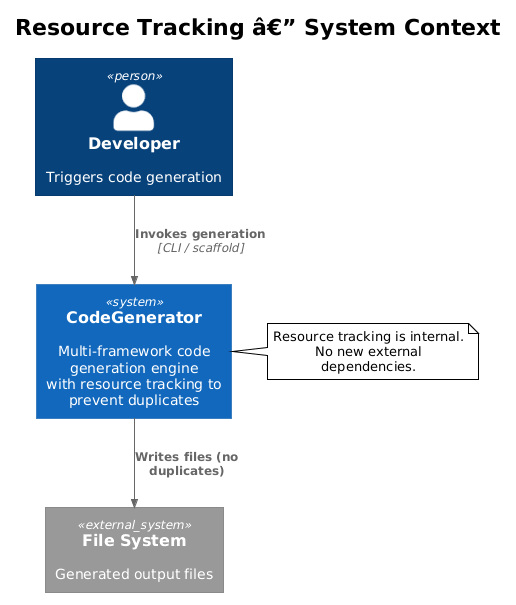
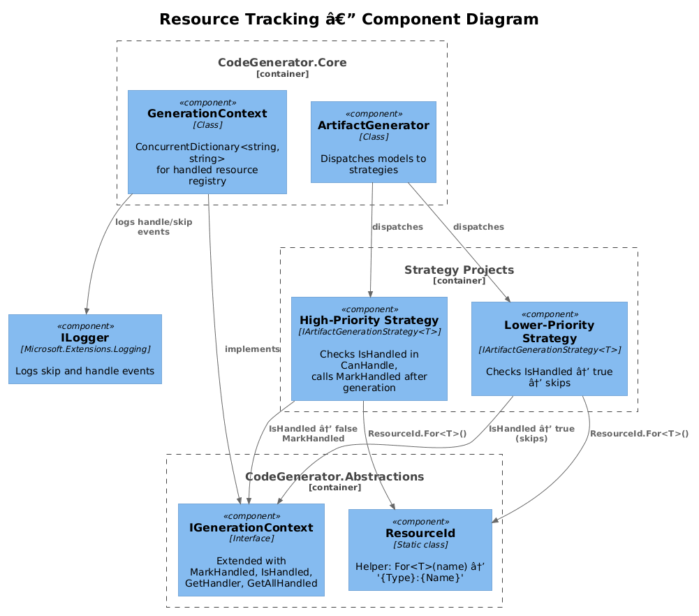
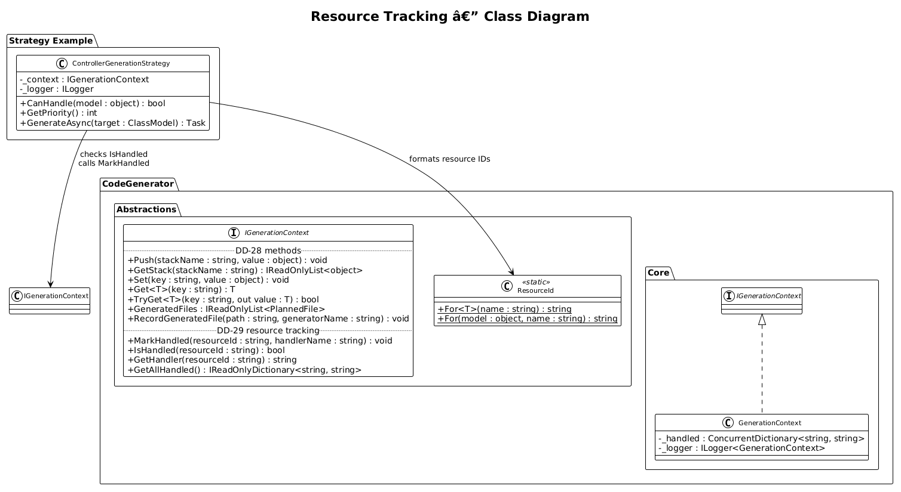
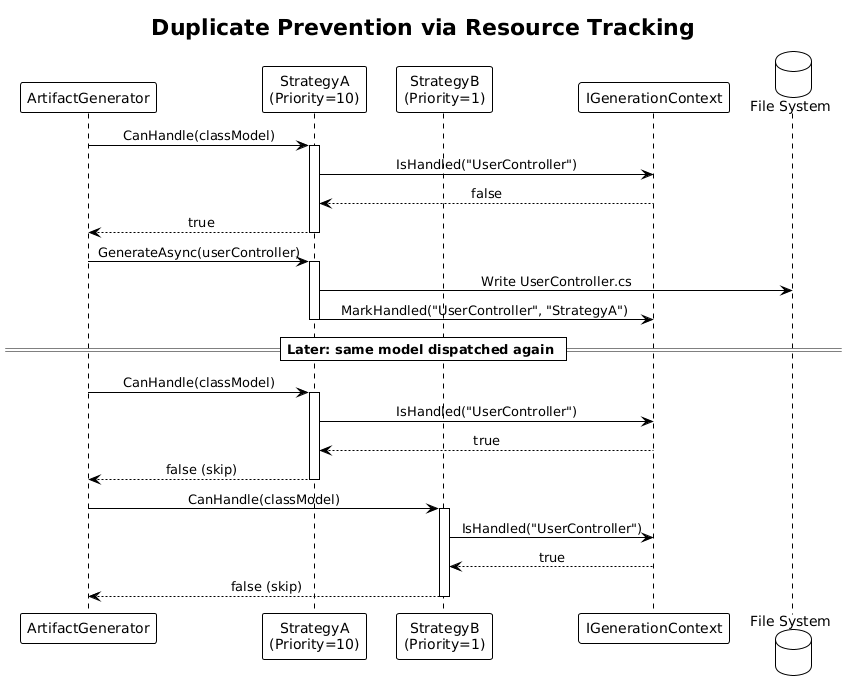
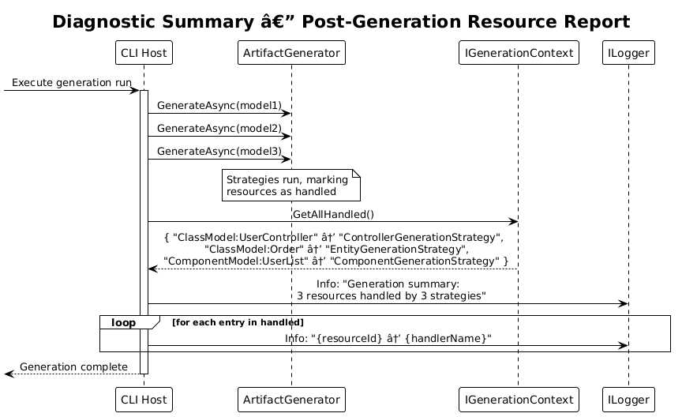

# Resource Tracking -- Detailed Design

**Status:** Proposed

**Depends on:** DD-28 (Cross-Template State / Generation Context)

## 1. Overview

Resource Tracking prevents duplicate generation when multiple strategies could handle the same model element. In the current system, when `ArtifactGenerator` dispatches a model, it selects the highest-priority strategy via `CanHandle()` + `GetPriority()`. However, in scenarios where multiple generation passes occur over the same model set -- or where strategies at equal priority levels exist -- the same model element may be processed more than once, producing duplicate or conflicting files.

This design extends `IGenerationContext` (from DD-28) with resource tracking methods. Strategies mark model elements as "handled" after processing, and subsequent strategies check this registry before claiming a model. The system also provides traceability: for any resource, you can query which strategy handled it.

**Origin:** Pattern 13 from xregistry/codegen -- resource tracking to prevent duplicate generation.

**Actors:** Artifact generation strategies and syntax generation strategies that participate in multi-pass generation.

**Scope:** Extension of `IGenerationContext` with `MarkHandled`, `IsHandled`, `GetHandler`, and `GetAllHandled` methods. Integration into strategy `CanHandle()` implementations. Logging of skipped resources.

## 2. Architecture

### 2.1 C4 Context Diagram



The resource tracking system operates entirely within the CodeGenerator engine. It adds no new external dependencies. The developer triggers generation as before; the difference is internal: strategies now coordinate through the `IGenerationContext` to avoid duplicate work.

### 2.2 C4 Component Diagram



| Component | Project | Responsibility |
|-----------|---------|----------------|
| `IGenerationContext` | CodeGenerator.Abstractions | Extended with resource tracking methods |
| `GenerationContext` | CodeGenerator.Core | Implements tracking via `ConcurrentDictionary<string, string>` |
| Strategy implementations | DotNet, Angular, etc. | Call `IsHandled` in `CanHandle`, `MarkHandled` after generation |
| `ILogger` | Microsoft.Extensions.Logging | Logs when resources are skipped |

### 2.3 Class Diagram



## 3. Component Details

### 3.1 IGenerationContext Extensions

**Location:** `src/CodeGenerator.Abstractions/Services/IGenerationContext.cs` (extends DD-28 interface)

The following methods are added to the existing `IGenerationContext` interface:

```csharp
public interface IGenerationContext
{
    // ... existing DD-28 methods ...

    void MarkHandled(string resourceId, string handlerName);
    bool IsHandled(string resourceId);
    string GetHandler(string resourceId);
    IReadOnlyDictionary<string, string> GetAllHandled();
}
```

- **`MarkHandled(resourceId, handlerName)`** -- Records that the resource identified by `resourceId` has been processed by `handlerName`. If the resource is already marked, throws `InvalidOperationException` (a resource should not be handled twice).
- **`IsHandled(resourceId)`** -- Returns true if the resource has been marked as handled.
- **`GetHandler(resourceId)`** -- Returns the name of the strategy that handled the resource. Throws `KeyNotFoundException` if the resource has not been handled.
- **`GetAllHandled()`** -- Returns a read-only snapshot of all handled resources and their handlers. Useful for diagnostics and logging.

### 3.2 Resource ID Format

Resource IDs follow the convention `{ModelType}:{ModelName}`:

| Model Type | Example Resource ID |
|-----------|-------------------|
| `ClassModel` | `ClassModel:UserController` |
| `InterfaceModel` | `InterfaceModel:IOrderRepository` |
| `ComponentModel` | `ComponentModel:UserList` |
| `PageObjectModel` | `PageObjectModel:LoginPage` |
| `SolutionModel` | `SolutionModel:MyApp` |

A static helper method provides consistent formatting:

```csharp
// In CodeGenerator.Abstractions/Services/ResourceId.cs
namespace CodeGenerator.Core.Services;

public static class ResourceId
{
    public static string For<T>(string name) => $"{typeof(T).Name}:{name}";
    public static string For(object model, string name) => $"{model.GetType().Name}:{name}";
}
```

### 3.3 GenerationContext Implementation

**Location:** `src/CodeGenerator.Core/Services/GenerationContext.cs` (extends DD-28 implementation)

```csharp
public class GenerationContext : IGenerationContext
{
    // ... existing DD-28 fields ...
    private readonly ConcurrentDictionary<string, string> _handled = new();
    private readonly ILogger<GenerationContext> _logger;

    public GenerationContext(ILogger<GenerationContext> logger)
    {
        _logger = logger;
    }

    public void MarkHandled(string resourceId, string handlerName)
    {
        if (!_handled.TryAdd(resourceId, handlerName))
        {
            throw new InvalidOperationException(
                $"Resource '{resourceId}' is already handled by '{_handled[resourceId]}'.");
        }

        _logger.LogDebug("Resource '{ResourceId}' marked as handled by '{Handler}'.",
            resourceId, handlerName);
    }

    public bool IsHandled(string resourceId) => _handled.ContainsKey(resourceId);

    public string GetHandler(string resourceId)
    {
        if (_handled.TryGetValue(resourceId, out var handler))
            return handler;
        throw new KeyNotFoundException($"Resource '{resourceId}' has not been handled.");
    }

    public IReadOnlyDictionary<string, string> GetAllHandled()
        => new Dictionary<string, string>(_handled);
}
```

### 3.4 Strategy Integration Pattern

Strategies integrate resource tracking in two places: `CanHandle()` and `GenerateAsync()`.

```csharp
public class ControllerGenerationStrategy : IArtifactGenerationStrategy<ClassModel>
{
    private readonly IGenerationContext _context;
    private readonly ILogger<ControllerGenerationStrategy> _logger;

    public ControllerGenerationStrategy(
        IGenerationContext context,
        ILogger<ControllerGenerationStrategy> logger)
    {
        _context = context;
        _logger = logger;
    }

    public bool CanHandle(object model)
    {
        if (model is not ClassModel classModel)
            return false;

        var resourceId = ResourceId.For<ClassModel>(classModel.Name);

        if (_context.IsHandled(resourceId))
        {
            _logger.LogInformation(
                "Skipping '{ResourceId}': already handled by '{Handler}'.",
                resourceId, _context.GetHandler(resourceId));
            return false;
        }

        return classModel.Name.EndsWith("Controller");
    }

    public int GetPriority() => 10;

    public async Task GenerateAsync(ClassModel target)
    {
        var resourceId = ResourceId.For<ClassModel>(target.Name);

        // ... generate the controller file ...

        _context.MarkHandled(resourceId, nameof(ControllerGenerationStrategy));
        _context.RecordGeneratedFile(
            $"src/Controllers/{target.Name}.cs",
            nameof(ControllerGenerationStrategy));
    }
}
```

### 3.5 Logging

Resource tracking produces log entries at two levels:

| Level | Event | Message |
|-------|-------|---------|
| Debug | Resource marked handled | `Resource 'ClassModel:UserController' marked as handled by 'ControllerGenerationStrategy'.` |
| Information | Resource skipped | `Skipping 'ClassModel:UserController': already handled by 'ControllerGenerationStrategy'.` |
| Error | Double-handle attempt | `Resource 'ClassModel:UserController' is already handled by 'ControllerGenerationStrategy'.` (thrown as exception) |

## 4. Key Workflows

### 4.1 Strategy A Handles, Strategy B Skips

The primary workflow where two strategies could both handle the same model, but resource tracking prevents duplication.



**Step-by-step:**

1. **ArtifactGenerator dispatches ClassModel** -- `ArtifactGenerator.GenerateAsync()` is called with a `ClassModel` named `UserController`.
2. **Strategy A checks CanHandle** -- `ControllerGenerationStrategy.CanHandle()` is called. It checks `_context.IsHandled("ClassModel:UserController")` -- returns false.
3. **Strategy A claims the model** -- `CanHandle()` returns true. `ArtifactGenerator` selects this strategy (highest priority that can handle).
4. **Strategy A generates** -- `GenerateAsync(userController)` runs. It produces the controller file.
5. **Strategy A marks handled** -- Calls `_context.MarkHandled("ClassModel:UserController", "ControllerGenerationStrategy")`.
6. **Second pass or lower-priority strategy** -- Later, `GenericClassGenerationStrategy.CanHandle()` is called for the same model.
7. **Strategy B checks IsHandled** -- `_context.IsHandled("ClassModel:UserController")` returns true.
8. **Strategy B skips** -- `CanHandle()` returns false. Logs: `"Skipping 'ClassModel:UserController': already handled by 'ControllerGenerationStrategy'."`.

### 4.2 Diagnostic Summary

At the end of a generation run, the host can query `GetAllHandled()` for a summary:



**Step-by-step:**

1. **Generation completes** -- All strategies have run.
2. **Host queries context** -- Calls `_context.GetAllHandled()` to retrieve the full resource-to-handler map.
3. **Host logs summary** -- Iterates the dictionary and logs each resource and its handler.

## 5. Error Handling

- **Double MarkHandled** -- Throws `InvalidOperationException`. This indicates a logic error: a strategy should always check `IsHandled` before processing. The exception message includes both the resource ID and the original handler name.
- **GetHandler for unhandled resource** -- Throws `KeyNotFoundException`. Use `IsHandled` to check first.
- **Race condition** -- `ConcurrentDictionary.TryAdd` is atomic, so two strategies racing to mark the same resource will have exactly one succeed and one throw.

## 6. Testing Strategy

| Test Case | Method | Expectation |
|-----------|--------|-------------|
| MarkHandled + IsHandled | `MarkHandled("A:B", "S1"); IsHandled("A:B")` | Returns true |
| IsHandled when not marked | `IsHandled("A:B")` | Returns false |
| GetHandler returns handler name | `MarkHandled("A:B", "S1"); GetHandler("A:B")` | Returns `"S1"` |
| GetHandler for unhandled | `GetHandler("A:B")` | Throws `KeyNotFoundException` |
| Double MarkHandled throws | `MarkHandled("A:B", "S1"); MarkHandled("A:B", "S2")` | Throws `InvalidOperationException` |
| GetAllHandled returns snapshot | Mark 3 resources, call `GetAllHandled()` | Dictionary with 3 entries |
| ResourceId.For<T> formatting | `ResourceId.For<ClassModel>("Foo")` | Returns `"ClassModel:Foo"` |
| CanHandle returns false when handled | Set up context with handled resource, call strategy `CanHandle` | Returns false |

## 7. File Manifest

| File | Project | Description |
|------|---------|-------------|
| `Services/IGenerationContext.cs` | CodeGenerator.Abstractions | Add `MarkHandled`, `IsHandled`, `GetHandler`, `GetAllHandled` |
| `Services/ResourceId.cs` | CodeGenerator.Abstractions | Static helper for resource ID formatting |
| `Services/GenerationContext.cs` | CodeGenerator.Core | Implement tracking with `ConcurrentDictionary<string, string>` |
