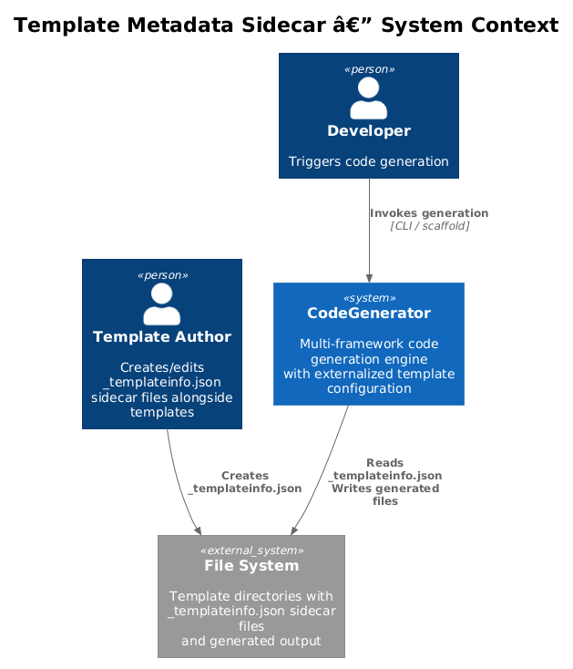
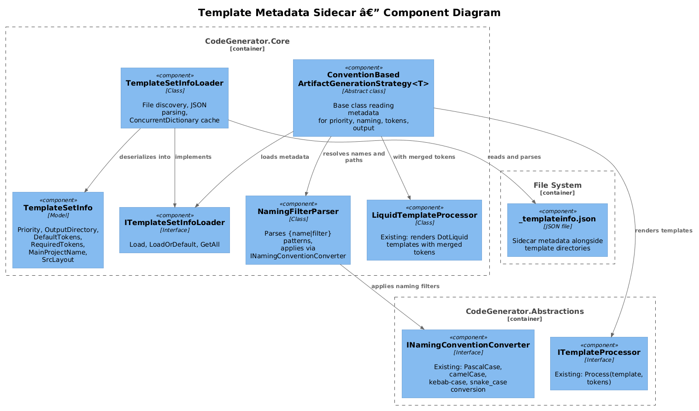
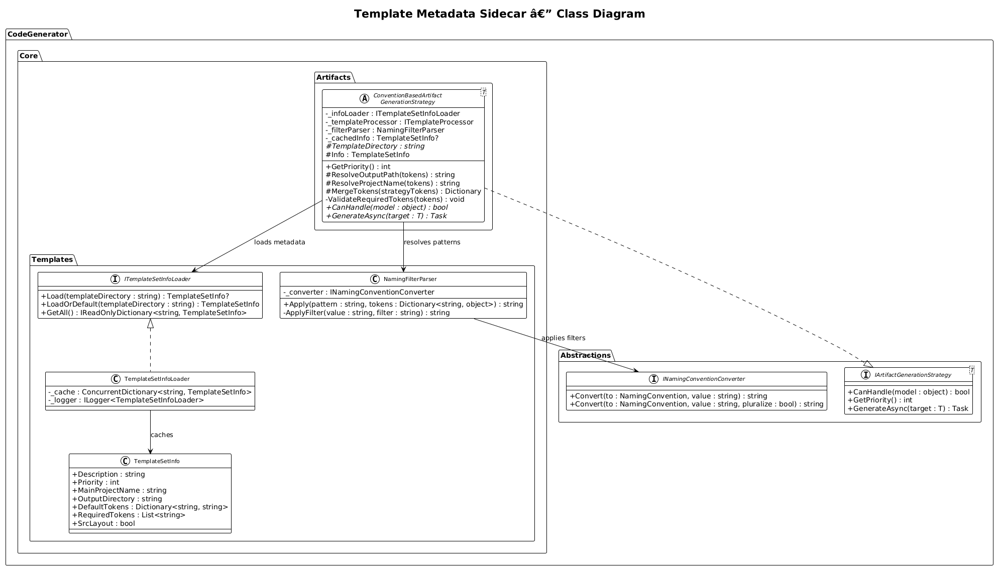
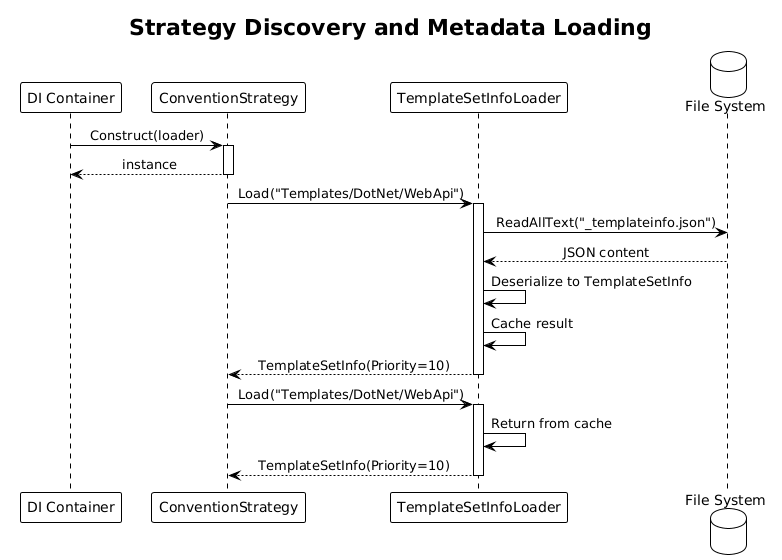
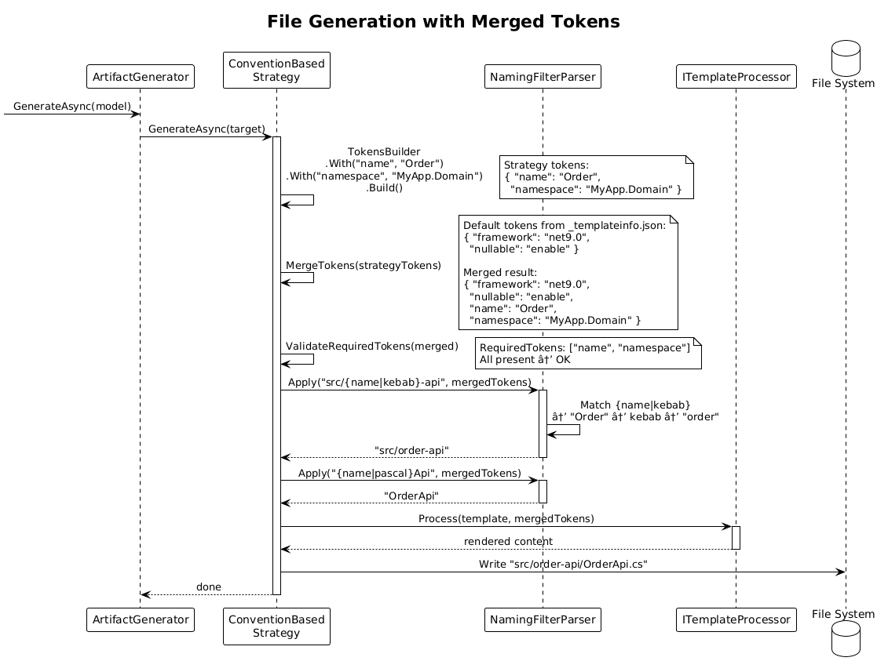

# Template Metadata Sidecar -- Detailed Design

**Status:** Proposed

## 1. Overview

The Template Metadata Sidecar feature enables template configuration without recompilation. Currently, template behavior (priority, output directory, default tokens, naming conventions) is hardcoded in strategy classes. Changing any of these requires modifying C# code, recompiling, and redeploying. This creates friction for template authors who want to adjust generation behavior without touching the codebase.

This design introduces `_templateinfo.json` sidecar files that sit alongside template directories. A `TemplateSetInfo` model captures metadata like priority, output directory patterns, default tokens, required tokens, and naming filter chains. An `ITemplateSetInfoLoader` service discovers, parses, and caches these files at strategy discovery time. Strategies read the cached metadata to determine their behavior at render time.

**Origin:** Pattern 3 from xregistry/codegen -- template metadata sidecar files.

**Actors:** Template authors who configure generation behavior via JSON; artifact generation strategies that consume the metadata.

**Scope:** The `TemplateSetInfo` model, `ITemplateSetInfoLoader` interface and `TemplateSetInfoLoader` implementation (in Core), naming filter parser, integration with convention-based strategies, and caching.

## 2. Architecture

### 2.1 C4 Context Diagram



The template author creates or edits `_templateinfo.json` files alongside template directories. At strategy discovery time, the `TemplateSetInfoLoader` reads these files and caches the parsed metadata. During generation, strategies consult the cached metadata for priority, naming, tokens, and output paths.

### 2.2 C4 Component Diagram



| Component | Project | Responsibility |
|-----------|---------|----------------|
| `TemplateSetInfo` | CodeGenerator.Core | Model class for `_templateinfo.json` content |
| `ITemplateSetInfoLoader` | CodeGenerator.Core | Interface for discovering and loading sidecar files |
| `TemplateSetInfoLoader` | CodeGenerator.Core | Implementation with file discovery and caching |
| `NamingFilterParser` | CodeGenerator.Core | Parses `{name\|pascal}` filter chains into converter calls |
| `INamingConventionConverter` | CodeGenerator.Abstractions | Existing service used by the filter parser |
| `ConventionBasedArtifactGenerationStrategy` | CodeGenerator.Core | New base class that reads metadata for priority/naming/output |
| `LiquidTemplateProcessor` | CodeGenerator.Core | Existing service; receives merged tokens |

### 2.3 Class Diagram



## 3. Component Details

### 3.1 TemplateSetInfo

**Location:** `src/CodeGenerator.Core/Templates/TemplateSetInfo.cs`

```csharp
namespace CodeGenerator.Core.Templates;

public class TemplateSetInfo
{
    public string Description { get; set; } = string.Empty;
    public int Priority { get; set; } = 1;
    public string MainProjectName { get; set; } = string.Empty;
    public string OutputDirectory { get; set; } = string.Empty;
    public Dictionary<string, string> DefaultTokens { get; set; } = new();
    public List<string> RequiredTokens { get; set; } = new();
    public bool SrcLayout { get; set; }
}
```

**Field descriptions:**

| Field | Type | Description |
|-------|------|-------------|
| `Description` | string | Human-readable description of the template set |
| `Priority` | int | Strategy priority (higher = selected first). Default 1. |
| `MainProjectName` | string | Naming pattern with filters, e.g. `"{name\|pascal}Api"` |
| `OutputDirectory` | string | Output path pattern, e.g. `"src/{name\|kebab}"` |
| `DefaultTokens` | Dictionary | Token key-value pairs merged into template tokens at render time |
| `RequiredTokens` | List | Token keys that must be present; generation fails if missing |
| `SrcLayout` | bool | If true, generates into a `src/` subdirectory |

### 3.2 Example `_templateinfo.json`

```json
{
  "description": "ASP.NET Core Web API with CQRS pattern",
  "priority": 10,
  "mainProjectName": "{name|pascal}Api",
  "outputDirectory": "src/{name|kebab}-api",
  "defaultTokens": {
    "framework": "net9.0",
    "nullable": "enable",
    "implicitUsings": "enable"
  },
  "requiredTokens": ["name", "namespace"],
  "srcLayout": true
}
```

### 3.3 ITemplateSetInfoLoader / TemplateSetInfoLoader

**Location:**
- `src/CodeGenerator.Core/Templates/ITemplateSetInfoLoader.cs`
- `src/CodeGenerator.Core/Templates/TemplateSetInfoLoader.cs`

```csharp
namespace CodeGenerator.Core.Templates;

public interface ITemplateSetInfoLoader
{
    TemplateSetInfo? Load(string templateDirectory);
    TemplateSetInfo LoadOrDefault(string templateDirectory);
    IReadOnlyDictionary<string, TemplateSetInfo> GetAll();
}
```

```csharp
namespace CodeGenerator.Core.Templates;

public class TemplateSetInfoLoader : ITemplateSetInfoLoader
{
    private const string SidecarFileName = "_templateinfo.json";
    private readonly ConcurrentDictionary<string, TemplateSetInfo> _cache = new();
    private readonly ILogger<TemplateSetInfoLoader> _logger;

    public TemplateSetInfoLoader(ILogger<TemplateSetInfoLoader> logger)
    {
        _logger = logger;
    }

    public TemplateSetInfo? Load(string templateDirectory)
    {
        return _cache.GetOrAdd(templateDirectory, dir =>
        {
            var path = Path.Combine(dir, SidecarFileName);

            if (!File.Exists(path))
            {
                _logger.LogDebug(
                    "No {File} found in '{Dir}'.", SidecarFileName, dir);
                return null!;
            }

            var json = File.ReadAllText(path);
            var info = JsonSerializer.Deserialize<TemplateSetInfo>(json,
                new JsonSerializerOptions { PropertyNameCamelCase = true })
                ?? new TemplateSetInfo();

            _logger.LogInformation(
                "Loaded template metadata from '{Path}': priority={Priority}",
                path, info.Priority);

            return info;
        });
    }

    public TemplateSetInfo LoadOrDefault(string templateDirectory)
        => Load(templateDirectory) ?? new TemplateSetInfo();

    public IReadOnlyDictionary<string, TemplateSetInfo> GetAll()
        => new Dictionary<string, TemplateSetInfo>(_cache
            .Where(kv => kv.Value != null!));
}
```

**Caching:** The `ConcurrentDictionary` ensures each directory is read at most once. The cache persists for the lifetime of the service (registered as Singleton).

**DI Registration:** `src/CodeGenerator.Core/ConfigureServices.cs`

```csharp
services.AddSingleton<ITemplateSetInfoLoader, TemplateSetInfoLoader>();
```

### 3.4 NamingFilterParser

**Location:** `src/CodeGenerator.Core/Templates/NamingFilterParser.cs`

Parses naming filter expressions like `{name|pascal}`, `{name|camel}`, `{name|kebab}`, `{name|snake}`, `{name|pascal|plural}` and applies them using the existing `INamingConventionConverter`.

```csharp
namespace CodeGenerator.Core.Templates;

public class NamingFilterParser
{
    private readonly INamingConventionConverter _converter;

    public NamingFilterParser(INamingConventionConverter converter)
    {
        _converter = converter;
    }

    public string Apply(string pattern, Dictionary<string, object> tokens)
    {
        return Regex.Replace(pattern, @"\{(\w+)(\|[\w|]+)?\}", match =>
        {
            var tokenName = match.Groups[1].Value;
            var filterChain = match.Groups[2].Success
                ? match.Groups[2].Value.TrimStart('|').Split('|')
                : Array.Empty<string>();

            if (!tokens.TryGetValue(tokenName, out var rawValue))
                return match.Value; // Leave unresolved tokens as-is

            var value = rawValue?.ToString() ?? string.Empty;

            foreach (var filter in filterChain)
            {
                value = ApplyFilter(value, filter);
            }

            return value;
        });
    }

    private string ApplyFilter(string value, string filter)
    {
        return filter.ToLowerInvariant() switch
        {
            "pascal" => _converter.Convert(NamingConvention.PascalCase, value),
            "camel" => _converter.Convert(NamingConvention.CamelCase, value),
            "kebab" => _converter.Convert(NamingConvention.KebabCase, value),
            "snake" => _converter.Convert(NamingConvention.SnakeCase, value),
            "plural" => _converter.Convert(NamingConvention.PascalCase, value, pluralize: true),
            "lower" => value.ToLowerInvariant(),
            "upper" => value.ToUpperInvariant(),
            _ => value
        };
    }
}
```

**Filter chain:** Filters are applied left to right. `{name|pascal|plural}` first converts to PascalCase, then pluralizes. The `NamingConvention` enum values map directly to `INamingConventionConverter.Convert()` calls.

### 3.5 ConventionBasedArtifactGenerationStrategy

**Location:** `src/CodeGenerator.Core/Artifacts/ConventionBasedArtifactGenerationStrategy.cs`

A new abstract base class that reads `_templateinfo.json` metadata to drive priority, naming, and output path decisions:

```csharp
namespace CodeGenerator.Core.Artifacts;

public abstract class ConventionBasedArtifactGenerationStrategy<T>
    : IArtifactGenerationStrategy<T>
{
    private readonly ITemplateSetInfoLoader _infoLoader;
    private readonly ITemplateProcessor _templateProcessor;
    private readonly NamingFilterParser _filterParser;
    private TemplateSetInfo? _cachedInfo;

    protected ConventionBasedArtifactGenerationStrategy(
        ITemplateSetInfoLoader infoLoader,
        ITemplateProcessor templateProcessor,
        NamingFilterParser filterParser)
    {
        _infoLoader = infoLoader;
        _templateProcessor = templateProcessor;
        _filterParser = filterParser;
    }

    protected abstract string TemplateDirectory { get; }

    protected TemplateSetInfo Info
        => _cachedInfo ??= _infoLoader.LoadOrDefault(TemplateDirectory);

    public virtual int GetPriority() => Info.Priority;

    protected string ResolveOutputPath(Dictionary<string, object> tokens)
    {
        var dir = _filterParser.Apply(Info.OutputDirectory, tokens);
        return Info.SrcLayout ? Path.Combine("src", dir) : dir;
    }

    protected string ResolveProjectName(Dictionary<string, object> tokens)
        => _filterParser.Apply(Info.MainProjectName, tokens);

    protected Dictionary<string, object> MergeTokens(
        Dictionary<string, object> strategyTokens)
    {
        var merged = new Dictionary<string, object>(Info.DefaultTokens
            .ToDictionary(kv => kv.Key, kv => (object)kv.Value));

        foreach (var kv in strategyTokens)
            merged[kv.Key] = kv.Value;

        ValidateRequiredTokens(merged);
        return merged;
    }

    private void ValidateRequiredTokens(Dictionary<string, object> tokens)
    {
        var missing = Info.RequiredTokens
            .Where(r => !tokens.ContainsKey(r))
            .ToList();

        if (missing.Count > 0)
        {
            throw new InvalidOperationException(
                $"Missing required tokens for template '{TemplateDirectory}': " +
                string.Join(", ", missing));
        }
    }

    public abstract bool CanHandle(object model);
    public abstract Task GenerateAsync(T target);
}
```

**Token merge order:** Default tokens from `_templateinfo.json` are loaded first, then strategy-provided tokens overwrite them. This allows sidecar files to set sensible defaults while strategies can override specific values.

### 3.6 Token Merge and Render Flow

When a `ConventionBasedArtifactGenerationStrategy` generates a file:

1. **Load metadata** -- `Info` property lazy-loads `_templateinfo.json` via `ITemplateSetInfoLoader`.
2. **Build strategy tokens** -- Strategy builds tokens using `TokensBuilder`.
3. **Merge tokens** -- `MergeTokens()` combines default tokens from metadata with strategy tokens. Strategy tokens take precedence.
4. **Validate** -- `ValidateRequiredTokens()` checks all `RequiredTokens` are present. Throws if any are missing.
5. **Resolve output path** -- `ResolveOutputPath()` applies naming filters to `OutputDirectory`.
6. **Render template** -- `ITemplateProcessor.Process()` renders the DotLiquid template with the merged tokens.
7. **Write file** -- Output is written to the resolved path.

## 4. Key Workflows

### 4.1 Strategy Discovery and Metadata Loading



**Step-by-step:**

1. **DI container builds strategies** -- `ConfigureServices` registers all `IArtifactGenerationStrategy<T>` implementations via assembly scanning.
2. **Strategy constructor runs** -- `ConventionBasedArtifactGenerationStrategy` constructor receives `ITemplateSetInfoLoader`.
3. **First `GetPriority()` call** -- `ArtifactGenerator` calls `GetPriority()` during strategy selection. This triggers lazy loading of `_templateinfo.json` via `Info` property.
4. **Loader checks cache** -- `TemplateSetInfoLoader.Load()` checks `_cache`. On first call, reads and parses the JSON file.
5. **Metadata cached** -- Subsequent calls for the same directory return the cached `TemplateSetInfo`.
6. **Priority returned** -- The `Priority` value from the sidecar file is returned to `ArtifactGenerator` for strategy ordering.

### 4.2 File Generation with Merged Tokens



**Step-by-step:**

1. **ArtifactGenerator dispatches** -- Calls `GenerateAsync()` on the selected strategy.
2. **Strategy builds tokens** -- Uses `TokensBuilder` to create strategy-specific tokens (e.g., class name, namespace).
3. **Strategy calls MergeTokens** -- Default tokens from `_templateinfo.json` are merged with strategy tokens.
4. **Required tokens validated** -- If `namespace` is in `RequiredTokens` but not in merged tokens, throws `InvalidOperationException`.
5. **Output path resolved** -- `ResolveOutputPath()` applies filters: `"src/{name|kebab}-api"` with `name="Order"` becomes `"src/order-api"`.
6. **Template rendered** -- `ITemplateProcessor.Process()` renders the DotLiquid template with merged tokens.
7. **File written** -- Output written to the resolved path.

## 5. Naming Filter Reference

| Filter | Input | Output | NamingConvention |
|--------|-------|--------|-----------------|
| `pascal` | `order-item` | `OrderItem` | `PascalCase` |
| `camel` | `OrderItem` | `orderItem` | `CamelCase` |
| `kebab` | `OrderItem` | `order-item` | `KebabCase` |
| `snake` | `OrderItem` | `order_item` | `SnakeCase` |
| `plural` | `Order` | `Orders` | PascalCase + pluralize |
| `lower` | `OrderItem` | `orderitem` | N/A (string op) |
| `upper` | `OrderItem` | `ORDERITEM` | N/A (string op) |

**Chaining:** `{name|snake|upper}` with `name="OrderItem"` produces `ORDER_ITEM`.

## 6. Error Handling

| Scenario | Behavior |
|----------|----------|
| `_templateinfo.json` not found | `Load()` returns null; `LoadOrDefault()` returns `new TemplateSetInfo()` with defaults |
| Invalid JSON | `JsonSerializer.Deserialize` throws `JsonException`; propagated to caller |
| Missing required token | `ValidateRequiredTokens` throws `InvalidOperationException` listing missing token names |
| Unresolved filter token | Left as-is in the output string (e.g., `{unknown|pascal}` remains literal) |
| Unknown filter name | Value returned unchanged; no error |

## 7. Testing Strategy

| Test Case | Method | Expectation |
|-----------|--------|-------------|
| Load valid JSON | Create temp dir with `_templateinfo.json`, call `Load()` | Returns populated `TemplateSetInfo` |
| Load missing file | Call `Load()` on empty dir | Returns null |
| LoadOrDefault missing file | Call `LoadOrDefault()` on empty dir | Returns default `TemplateSetInfo` |
| Cache hit | Call `Load()` twice for same dir | File read only once |
| NamingFilterParser `{name\|pascal}` | `Apply("{name\|pascal}", { "name": "order-item" })` | `"OrderItem"` |
| NamingFilterParser chain | `Apply("{name\|snake\|upper}", { "name": "OrderItem" })` | `"ORDER_ITEM"` |
| NamingFilterParser unresolved | `Apply("{unknown\|pascal}", {})` | `"{unknown\|pascal}"` |
| MergeTokens precedence | Default `{ "a": "1" }`, strategy `{ "a": "2" }` | Merged `{ "a": "2" }` |
| Required tokens missing | `RequiredTokens: ["ns"]`, tokens: `{}` | Throws `InvalidOperationException` |
| GetPriority from metadata | Sidecar `priority: 10` | `GetPriority()` returns 10 |

## 8. File Manifest

| File | Project | Description |
|------|---------|-------------|
| `Templates/TemplateSetInfo.cs` | CodeGenerator.Core | Model class for sidecar metadata |
| `Templates/ITemplateSetInfoLoader.cs` | CodeGenerator.Core | Interface for loading sidecar files |
| `Templates/TemplateSetInfoLoader.cs` | CodeGenerator.Core | Implementation with caching |
| `Templates/NamingFilterParser.cs` | CodeGenerator.Core | Parses and applies `{name\|filter}` patterns |
| `Artifacts/ConventionBasedArtifactGenerationStrategy.cs` | CodeGenerator.Core | Base class consuming metadata |
| `ConfigureServices.cs` | CodeGenerator.Core | Register `ITemplateSetInfoLoader` as Singleton |
| `_templateinfo.json` | Template directories | Sidecar files (one per template set) |
