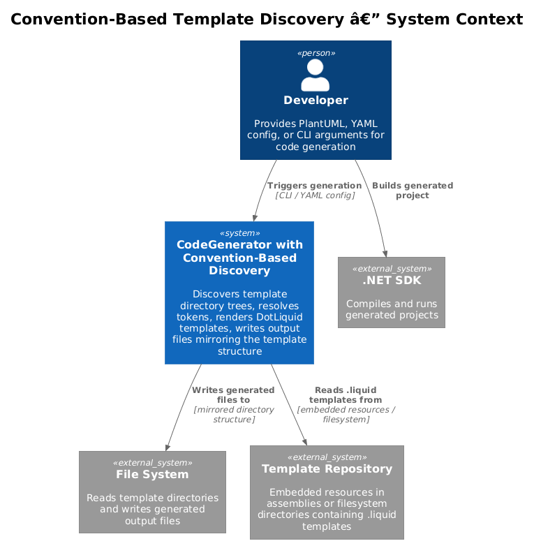
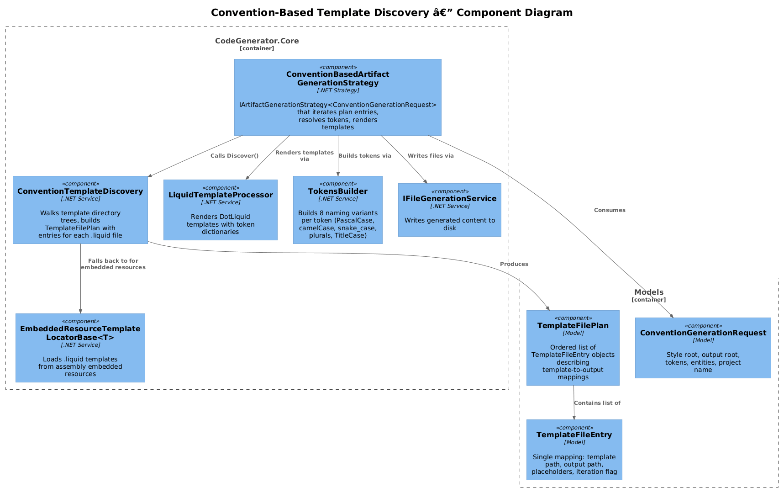
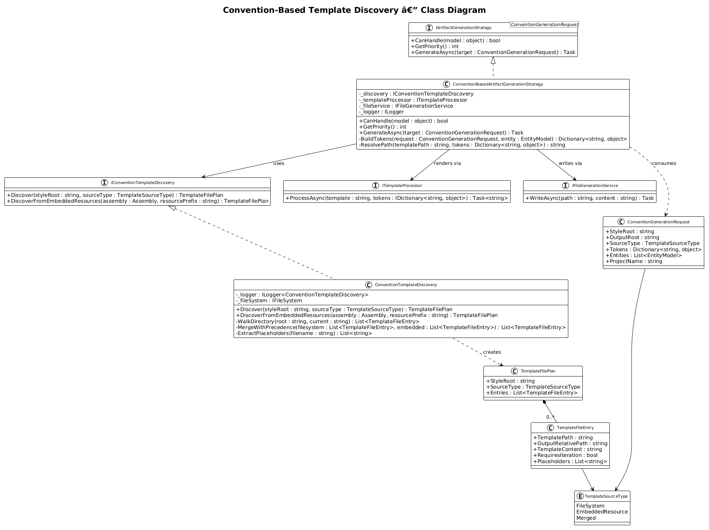
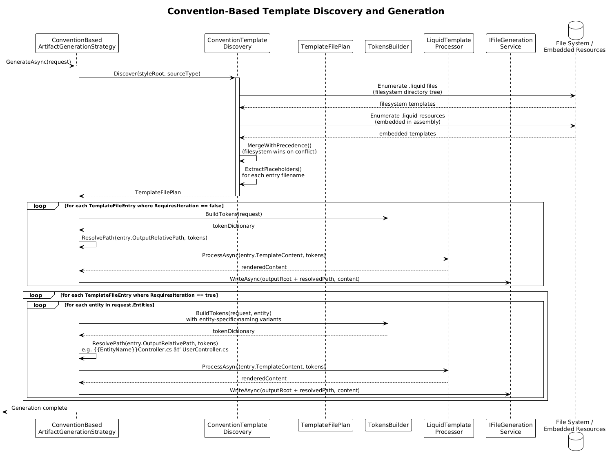
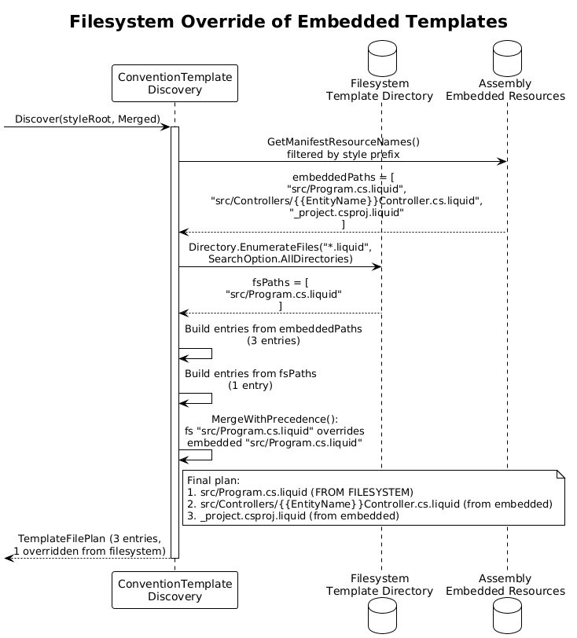

# Convention-Based Template Discovery -- Detailed Design

**Status:** Implemented

## 1. Overview

Convention-Based Template Discovery eliminates the need for individual strategy classes per generated file. Instead, a template directory tree mirrors the desired output project structure. Each `.liquid` file in the tree becomes an output file at the corresponding relative path, with the `.liquid` extension stripped. Token placeholders in both file paths and file contents are resolved during generation.

This pattern (inspired by xregistry/codegen Pattern 1) drastically reduces boilerplate: adding a new file to a project style requires only placing a `.liquid` template in the correct directory -- no new C# strategy class, no DI registration.

**Actors:** Developer -- provides a PlantUML or YAML configuration that triggers code generation using a convention-based template style.

**Scope:** The discovery mechanism, the convention-based generation strategy, and integration with the existing `IArtifactGenerationStrategy<T>` pipeline. Existing hand-coded strategies remain for complex Roslyn-powered generation.

## 2. Architecture

### 2.1 C4 Context Diagram

Shows the convention-based template discovery system in its broader ecosystem.



The developer provides input (PlantUML, YAML scaffold config, or CLI arguments). The CodeGenerator CLI delegates to the generation engine, which uses convention-based template discovery to walk template directory trees, resolve tokens, render templates via DotLiquid, and write output files to disk.

### 2.2 C4 Component Diagram

Shows the internal components of the convention-based template discovery system and their interactions.



| Component | Responsibility |
|-----------|----------------|
| `IConventionTemplateDiscovery` | Walks a template directory tree and builds a `TemplateFilePlan` |
| `ConventionTemplateDiscovery` | Implementation supporting both filesystem and embedded resource templates |
| `ConventionBasedArtifactGenerationStrategy` | `IArtifactGenerationStrategy<T>` that processes discovered template trees |
| `TemplateFilePlan` | Ordered list of `TemplateFileEntry` objects describing input/output path pairs |
| `ITemplateProcessor` (existing) | DotLiquid rendering via `LiquidTemplateProcessor` |
| `TokensBuilder` (existing) | Generates 8 naming variants per token (PascalCase, camelCase, snake_case, plurals, TitleCase) |
| `EmbeddedResourceTemplateLocatorBase<T>` (existing) | Loads templates from assembly embedded resources |

## 3. Component Details

### 3.1 IConventionTemplateDiscovery / ConventionTemplateDiscovery

**Namespace:** `CodeGenerator.Core.Templates`

```csharp
public interface IConventionTemplateDiscovery
{
    TemplateFilePlan Discover(string styleRoot, TemplateSourceType sourceType);
    TemplateFilePlan DiscoverFromEmbeddedResources(Assembly assembly, string resourcePrefix);
}
```

- **Responsibility:** Walks a template directory tree rooted at `styleRoot` and produces a `TemplateFilePlan`. Each `.liquid` file found becomes a `TemplateFileEntry` with its relative path (minus the `.liquid` extension) as the output path.
- **Dependencies:** `IFileSystem` (for filesystem templates), `Assembly` reflection (for embedded resources), `ILogger<ConventionTemplateDiscovery>`
- **Resolution rules:**
  1. Recursively enumerate all files ending in `.liquid` under the style root
  2. Compute the relative path from the style root to each template file
  3. Strip the `.liquid` extension to produce the output relative path
  4. Preserve directory structure: `src/Controllers/{{EntityName}}Controller.cs.liquid` becomes output path `src/Controllers/{{EntityName}}Controller.cs`
  5. Files prefixed with `_` (e.g., `_project.csproj.liquid`) are treated as project-root files with the underscore stripped
- **Filesystem vs. embedded resource precedence:** When both sources contain a template at the same relative path, the filesystem version wins. This allows developers to override built-in templates by placing files in a local `Templates/` directory.

### 3.2 TemplateFilePlan / TemplateFileEntry

**Namespace:** `CodeGenerator.Core.Templates`

```csharp
public class TemplateFilePlan
{
    public string StyleRoot { get; set; }
    public TemplateSourceType SourceType { get; set; }
    public List<TemplateFileEntry> Entries { get; set; } = new();
}

public class TemplateFileEntry
{
    public string TemplatePath { get; set; }        // relative path to .liquid file
    public string OutputRelativePath { get; set; }  // relative output path (no .liquid)
    public string TemplateContent { get; set; }     // loaded template content
    public bool RequiresIteration { get; set; }     // true if path contains {{EntityName}}
    public List<string> Placeholders { get; set; }  // extracted {{token}} names from filename
}

public enum TemplateSourceType
{
    FileSystem,
    EmbeddedResource,
    Merged  // filesystem overrides + embedded resource fallbacks
}
```

### 3.3 ConventionBasedArtifactGenerationStrategy

**Namespace:** `CodeGenerator.Core.Templates`

```csharp
public class ConventionBasedArtifactGenerationStrategy : IArtifactGenerationStrategy<ConventionGenerationRequest>
{
    private readonly IConventionTemplateDiscovery _discovery;
    private readonly ITemplateProcessor _templateProcessor;
    private readonly IFileGenerationService _fileService;
    private readonly ILogger<ConventionBasedArtifactGenerationStrategy> _logger;

    public bool CanHandle(object model) => model is ConventionGenerationRequest;
    public int GetPriority() => 0; // lowest priority -- hand-coded strategies take precedence

    public async Task GenerateAsync(ConventionGenerationRequest target)
    {
        var plan = _discovery.Discover(target.StyleRoot, target.SourceType);

        foreach (var entry in plan.Entries)
        {
            if (entry.RequiresIteration)
            {
                foreach (var entity in target.Entities)
                {
                    var tokens = BuildTokens(target, entity);
                    var outputPath = ResolvePath(entry.OutputRelativePath, tokens);
                    var content = await _templateProcessor.ProcessAsync(entry.TemplateContent, tokens);
                    await _fileService.WriteAsync(Path.Combine(target.OutputRoot, outputPath), content);
                }
            }
            else
            {
                var tokens = BuildTokens(target);
                var outputPath = ResolvePath(entry.OutputRelativePath, tokens);
                var content = await _templateProcessor.ProcessAsync(entry.TemplateContent, tokens);
                await _fileService.WriteAsync(Path.Combine(target.OutputRoot, outputPath), content);
            }
        }
    }
}
```

- **Integration with existing strategies:** This strategy has priority `0`, meaning hand-coded strategies (priority `1` or higher) always take precedence when their `CanHandle()` returns true. This allows Roslyn-based strategies to handle complex generation while the convention strategy covers simple template-to-file mappings.
- **ConventionGenerationRequest model:**

```csharp
public class ConventionGenerationRequest
{
    public string StyleRoot { get; set; }
    public string OutputRoot { get; set; }
    public TemplateSourceType SourceType { get; set; }
    public Dictionary<string, object> Tokens { get; set; }
    public List<EntityModel> Entities { get; set; }
    public string ProjectName { get; set; }
}
```

### 3.4 Template Directory Structure

The template tree mirrors the output project structure:

```
Templates/
  styles/
    dotnet-webapi/
      src/
        Program.cs.liquid
        appsettings.json.liquid
        Controllers/
          {{EntityName}}Controller.cs.liquid
        Models/
          {{EntityName}}.cs.liquid
      _project.csproj.liquid
    react-app/
      src/
        App.tsx.liquid
        components/
          {{EntityName}}List.tsx.liquid
      package.json.liquid
      tsconfig.json.liquid
```

**Naming conventions:**
- `{{EntityName}}` in a filename triggers per-entity iteration
- `_` prefix on root files (e.g., `_project.csproj.liquid`) is stripped; the file is placed at the project root
- All other directory nesting is preserved verbatim

## 4. Data Model

### 4.1 Class Diagram



### 4.2 Entity Descriptions

| Class | Responsibility |
|-------|---------------|
| `IConventionTemplateDiscovery` | Interface for walking template trees and building file plans |
| `ConventionTemplateDiscovery` | Implementation supporting filesystem and embedded resource templates |
| `ConventionBasedArtifactGenerationStrategy` | Strategy that processes convention-discovered templates |
| `TemplateFilePlan` | Container for discovered template entries |
| `TemplateFileEntry` | Single template-to-output mapping with metadata |
| `ConventionGenerationRequest` | Input model carrying style root, tokens, entities, and output path |

### 4.3 Relationships

- `ConventionBasedArtifactGenerationStrategy` depends on `IConventionTemplateDiscovery` and `ITemplateProcessor`
- `ConventionTemplateDiscovery` produces `TemplateFilePlan` containing `TemplateFileEntry` objects
- `ConventionBasedArtifactGenerationStrategy` consumes `ConventionGenerationRequest` which carries `TokensBuilder`-generated tokens
- Existing `IArtifactGenerationStrategy<T>` implementations coexist; the convention strategy is additive

## 5. Key Workflows

### 5.1 Template Discovery and Generation (End to End)

When the developer triggers generation for a convention-based style:



**Step-by-step:**

1. **Receive request** -- `ConventionBasedArtifactGenerationStrategy` receives a `ConventionGenerationRequest` specifying the style root, output root, tokens, and entity list.
2. **Discover templates** -- Calls `IConventionTemplateDiscovery.Discover()` which walks the style directory tree.
3. **Build file plan** -- For each `.liquid` file found, creates a `TemplateFileEntry` with the template content, relative output path, and extracted placeholders.
4. **Check filesystem override** -- If both filesystem and embedded resource templates exist at the same path, the filesystem version is used.
5. **Process non-iterated entries** -- For entries without `{{EntityName}}` in the path, resolves tokens in the output path, renders the template via `ITemplateProcessor.ProcessAsync()`, and writes the file.
6. **Process iterated entries** -- For entries with `{{EntityName}}`, iterates over the entity collection. For each entity, builds entity-specific tokens via `TokensBuilder`, resolves the output path, renders the template, and writes the file.
7. **Complete** -- All files written to the output directory with the mirrored structure.

### 5.2 Filesystem Override of Embedded Templates

When a developer wants to customize a built-in template:



**Step-by-step:**

1. **Discover embedded resources** -- `ConventionTemplateDiscovery` enumerates all `.liquid` embedded resources under the style prefix.
2. **Discover filesystem templates** -- Enumerates all `.liquid` files under the filesystem style directory.
3. **Merge with precedence** -- For each relative path, if a filesystem template exists, it replaces the embedded resource template. Otherwise, the embedded resource template is kept.
4. **Return merged plan** -- The `TemplateFilePlan` contains entries from both sources, with filesystem overrides applied.

## 6. DI Registration

```csharp
// In CodeGenerator.Core ConfigureServices
services.AddSingleton<IConventionTemplateDiscovery, ConventionTemplateDiscovery>();
services.AddSingleton<IArtifactGenerationStrategy<ConventionGenerationRequest>,
    ConventionBasedArtifactGenerationStrategy>();
```

The strategy is auto-discovered via assembly scanning alongside existing strategies. Its `GetPriority()` of `0` ensures it runs only when no higher-priority strategy handles the model.

## 7. Security Considerations

- **Path traversal** -- Template paths from the filesystem must be validated to remain within the style root. Paths containing `..` segments that escape the style root are rejected with a `TemplateDiscoveryException`.
- **Template injection** -- All template content is processed through `LiquidTemplateProcessor` which uses DotLiquid's safe-by-default model. Custom tags and filters are not exposed to template content unless explicitly registered.
- **Filesystem access** -- The discovery service reads template files from disk. The template root directory must be validated to exist and be within an expected location.

## 8. Test Strategy

### 8.1 Unit Tests

| Test | Description |
|------|-------------|
| `ConventionTemplateDiscovery_WalksDirectoryTree_ReturnsAllLiquidFiles` | Verify all `.liquid` files in a directory tree are discovered |
| `ConventionTemplateDiscovery_StripsLiquidExtension_CorrectOutputPath` | Verify `.liquid` extension is removed from output paths |
| `ConventionTemplateDiscovery_UnderscorePrefix_StrippedFromRootFiles` | Verify `_project.csproj.liquid` becomes `project.csproj` |
| `ConventionTemplateDiscovery_PreservesDirectoryNesting_InOutputPaths` | Verify `src/Controllers/Foo.cs.liquid` maps to `src/Controllers/Foo.cs` |
| `ConventionTemplateDiscovery_FilesystemOverridesEmbedded_WhenBothExist` | Verify filesystem templates take precedence over embedded resources |
| `ConventionTemplateDiscovery_DetectsEntityNamePlaceholder_SetsRequiresIteration` | Verify `{{EntityName}}` in filename sets `RequiresIteration = true` |
| `ConventionBasedStrategy_NonIteratedEntry_WritesOneFile` | Verify a template without `{{EntityName}}` produces exactly one output file |
| `ConventionBasedStrategy_IteratedEntry_WritesPerEntity` | Verify a template with `{{EntityName}}` produces one file per entity |
| `ConventionBasedStrategy_TokensResolvedInPath_CorrectOutputFilename` | Verify `{{EntityName}}Controller.cs` resolves to `UserController.cs` |
| `ConventionBasedStrategy_TokensResolvedInContent_CorrectOutput` | Verify DotLiquid tokens in template content are replaced |
| `ConventionBasedStrategy_Priority0_LowerThanHandCodedStrategies` | Verify `GetPriority()` returns 0 |

### 8.2 Integration Tests

| Test | Description |
|------|-------------|
| `ConventionGeneration_DotNetWebApi_ProducesExpectedFiles` | Given a `dotnet-webapi` template tree and 3 entities, verify all expected files exist at correct paths with correct content |
| `ConventionGeneration_ReactApp_ProducesExpectedFiles` | Given a `react-app` template tree, verify package.json, tsconfig.json, App.tsx, and per-entity components are generated |
| `ConventionGeneration_FilesystemOverride_CustomTemplateUsed` | Place a custom `Program.cs.liquid` on filesystem alongside embedded defaults; verify the custom version is rendered |

## 9. Open Questions

1. **Glob patterns for selective generation** -- Should the discovery support glob include/exclude patterns (e.g., skip `**/Tests/**` unless testing is enabled)?
2. **Template caching** -- Should discovered `TemplateFilePlan` objects be cached for repeated generation runs, or rebuilt each time?
3. **Non-liquid files** -- Should non-`.liquid` files in the template tree be copied verbatim to the output (e.g., static assets like images)?
4. **Ordering guarantees** -- Should templates be processed in a deterministic order (alphabetical, depth-first), and does ordering matter for generation correctness?
