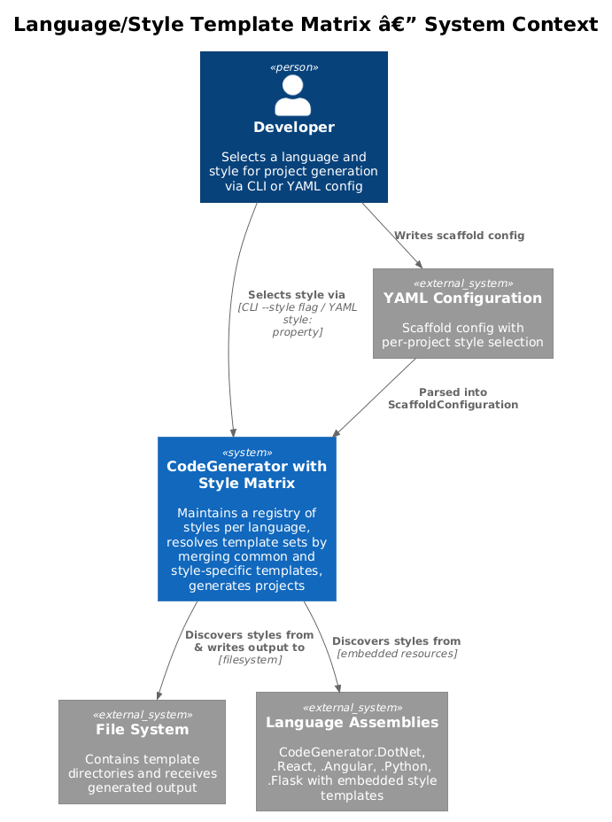
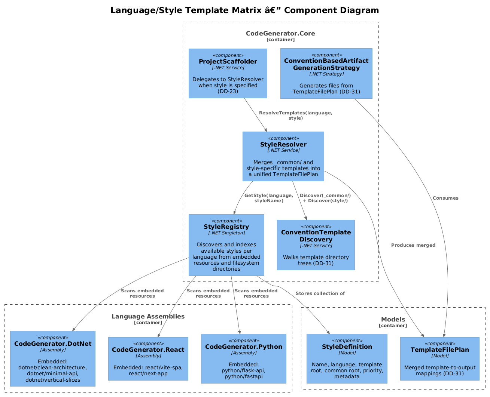
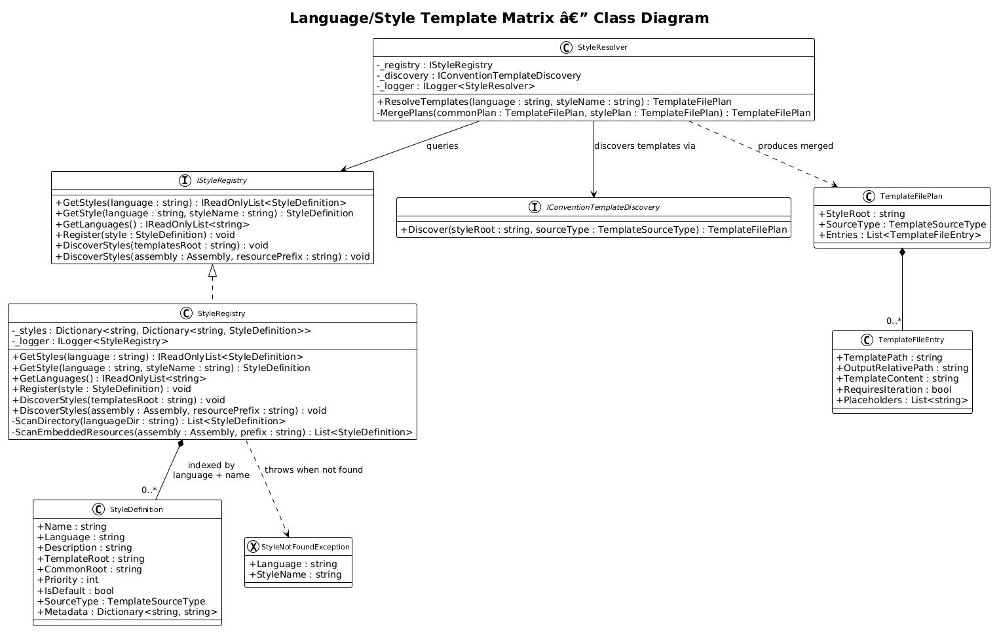
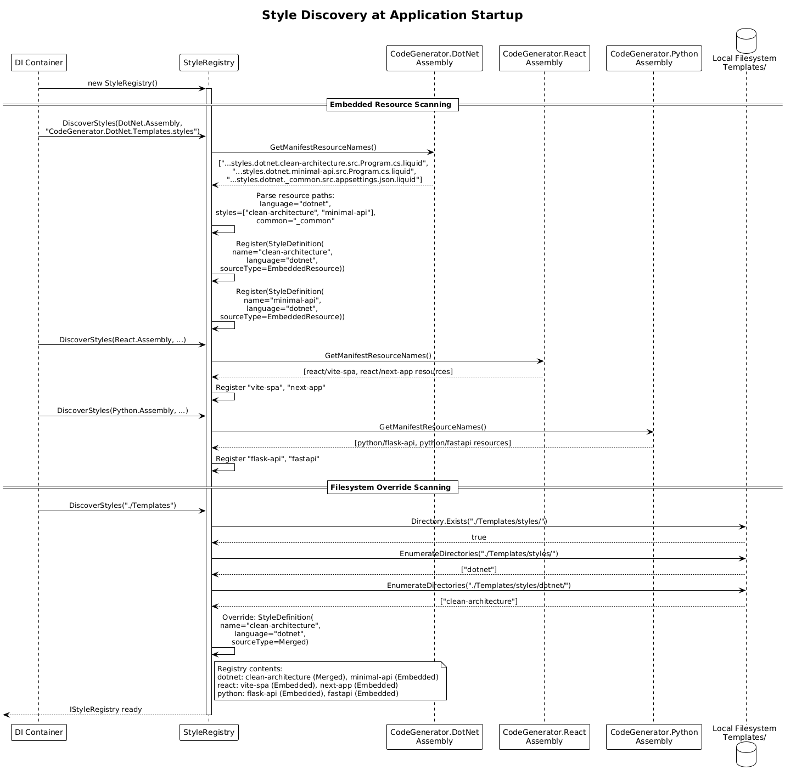
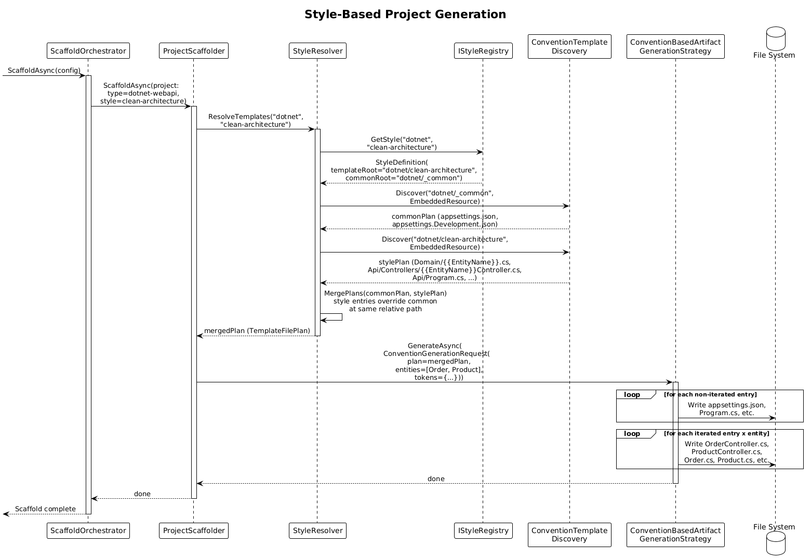

# Language/Style Template Matrix -- Detailed Design

**Status:** Implemented

## 1. Overview

The Language/Style Template Matrix introduces a **style** dimension within each language module. Today, each language assembly (CodeGenerator.DotNet, CodeGenerator.React, etc.) produces a single output shape. This design allows multiple project styles per language -- for example, .NET could offer `clean-architecture`, `minimal-api`, and `vertical-slices` styles, while React could offer `vite-spa` and `next-app` styles.

Styles are organized as named subdirectories within a language's `Templates/styles/` tree. A shared `_common/` directory per language provides templates inherited by all styles. Users select a style via CLI option (`--style clean-architecture`) or YAML configuration (`style: clean-architecture`).

**Actors:** Developer -- selects a language and style when generating a project or scaffold configuration.

**Scope:** The `IStyleRegistry`, `StyleDefinition` model, style resolution, integration with convention-based template discovery (DD-31), and integration with YAML scaffolding (DD-21/22/23).

## 2. Architecture

### 2.1 C4 Context Diagram

Shows the style registry system in the broader CodeGenerator ecosystem.



The developer selects a language and style via CLI or YAML configuration. The CodeGenerator resolves the style, discovers the template set using convention-based discovery (DD-31), and generates the project with the selected style's structure.

### 2.2 C4 Component Diagram

Shows the internal components of the language/style template matrix.



| Component | Responsibility |
|-----------|----------------|
| `IStyleRegistry` | Discovers and registers available styles per language |
| `StyleRegistry` | Implementation that scans template directories and embedded resources |
| `StyleDefinition` | Model describing a single style: name, language, template root, priority |
| `StyleResolver` | Merges `_common/` templates with style-specific templates |
| `IConventionTemplateDiscovery` (DD-31) | Walks the resolved template tree |
| `ScaffoldOrchestrator` (DD-23) | Delegates to style resolution during project scaffolding |

## 3. Component Details

### 3.1 IStyleRegistry / StyleRegistry

**Namespace:** `CodeGenerator.Core.Templates`

```csharp
public interface IStyleRegistry
{
    IReadOnlyList<StyleDefinition> GetStyles(string language);
    StyleDefinition GetStyle(string language, string styleName);
    IReadOnlyList<string> GetLanguages();
    void Register(StyleDefinition style);
    void DiscoverStyles(string templatesRoot);
    void DiscoverStyles(Assembly assembly, string resourcePrefix);
}
```

- **Responsibility:** Maintains a registry of all available styles across all languages. Styles are discovered at startup from both filesystem directories and embedded resources.
- **Dependencies:** `ILogger<StyleRegistry>`, `IFileSystem`
- **Discovery rules:**
  1. Scan `Templates/styles/{language}/` directories
  2. Each subdirectory (excluding `_common/`) becomes a style
  3. `_common/` is not a style itself but is inherited by all styles in that language
  4. Embedded resources with the pattern `Templates.styles.{language}.{style}.` are also discovered
  5. Filesystem styles override embedded resource styles with the same name

### 3.2 StyleDefinition

**Namespace:** `CodeGenerator.Core.Templates`

```csharp
public class StyleDefinition
{
    public string Name { get; set; }              // e.g., "clean-architecture"
    public string Language { get; set; }           // e.g., "dotnet"
    public string Description { get; set; }        // human-readable description
    public string TemplateRoot { get; set; }       // absolute path to style template dir
    public string CommonRoot { get; set; }         // absolute path to _common/ dir (nullable)
    public int Priority { get; set; }              // for ordering when multiple styles match
    public bool IsDefault { get; set; }            // true if this is the default style for its language
    public TemplateSourceType SourceType { get; set; }  // FileSystem, EmbeddedResource, or Merged
    public Dictionary<string, string> Metadata { get; set; } = new();
}
```

### 3.3 StyleResolver

**Namespace:** `CodeGenerator.Core.Templates`

```csharp
public class StyleResolver
{
    private readonly IStyleRegistry _registry;
    private readonly IConventionTemplateDiscovery _discovery;

    public TemplateFilePlan ResolveTemplates(string language, string styleName)
    {
        var style = _registry.GetStyle(language, styleName);

        // Discover _common/ templates
        TemplateFilePlan commonPlan = null;
        if (!string.IsNullOrEmpty(style.CommonRoot))
        {
            commonPlan = _discovery.Discover(style.CommonRoot, style.SourceType);
        }

        // Discover style-specific templates
        var stylePlan = _discovery.Discover(style.TemplateRoot, style.SourceType);

        // Merge: style-specific templates override _common/ templates at same path
        return MergePlans(commonPlan, stylePlan);
    }
}
```

- **Merge precedence:** Style-specific templates override `_common/` templates when both exist at the same relative path. This allows `_common/` to define defaults that individual styles can selectively replace.

### 3.4 Template Directory Structure

```
Templates/
  styles/
    dotnet/
      _common/                         # shared across all .NET styles
        src/
          appsettings.json.liquid
          appsettings.Development.json.liquid
      clean-architecture/              # 4-layer DDD style
        src/
          Domain/
            {{EntityName}}.cs.liquid
          Application/
            Services/
              I{{EntityName}}Service.cs.liquid
          Infrastructure/
            Persistence/
              {{EntityName}}Repository.cs.liquid
          Api/
            Controllers/
              {{EntityName}}Controller.cs.liquid
            Program.cs.liquid
        _solution.sln.liquid
      minimal-api/                     # single-project minimal API
        src/
          Program.cs.liquid
          Endpoints/
            {{EntityName}}Endpoints.cs.liquid
        _project.csproj.liquid
      vertical-slices/                 # feature-folder style
        src/
          Features/
            {{EntityName}}/
              {{EntityName}}Controller.cs.liquid
              {{EntityName}}Service.cs.liquid
              {{EntityName}}.cs.liquid
        _project.csproj.liquid
    react/
      _common/
        public/
          index.html.liquid
        tsconfig.json.liquid
      vite-spa/
        src/
          App.tsx.liquid
          main.tsx.liquid
          components/
            {{EntityName}}List.tsx.liquid
        package.json.liquid
        vite.config.ts.liquid
      next-app/
        src/
          app/
            layout.tsx.liquid
            page.tsx.liquid
            {{entityName}}/
              page.tsx.liquid
        package.json.liquid
        next.config.js.liquid
    python/
      _common/
        requirements.txt.liquid
      flask-api/
        app/
          __init__.py.liquid
          models/
            {{entity_name}}.py.liquid
          routes/
            {{entity_name}}_routes.py.liquid
        config.py.liquid
      fastapi/
        app/
          main.py.liquid
          models/
            {{entity_name}}.py.liquid
          routers/
            {{entity_name}}_router.py.liquid
```

### 3.5 Integration with YAML Scaffolding (DD-21/22/23)

The YAML scaffold configuration gains a `style` property per project:

```yaml
projects:
  - name: MyApi
    type: dotnet-webapi
    style: clean-architecture    # NEW: selects the style
    path: src/MyApi
    entities:
      - name: Order
        properties:
          - name: Id
            type: uuid
          - name: Total
            type: float

  - name: MyFrontend
    type: react-app
    style: vite-spa              # NEW
    path: src/MyFrontend
```

When `style` is specified, the `ProjectScaffolder` (DD-23) delegates to `StyleResolver` instead of using hard-coded implicit file generation. When `style` is omitted, the existing behavior is preserved for backward compatibility.

### 3.6 Integration with CLI

```bash
# Generate with explicit style
codegen generate --language dotnet --style clean-architecture --input models.puml

# List available styles
codegen styles list
codegen styles list --language dotnet

# Show style details
codegen styles info dotnet/clean-architecture
```

### 3.7 ScaffoldProjectType Mapping

The existing `ScaffoldProjectType` enum maps to default styles:

| ScaffoldProjectType | Language | Default Style |
|---------------------|----------|---------------|
| `dotnet-webapi` | dotnet | `minimal-api` |
| `dotnet-classlib` | dotnet | (no style -- classlib has no convention templates) |
| `react-app` | react | `vite-spa` |
| `angular-app` | angular | `standalone` |
| `flask-app` | python | `flask-api` |
| `python-app` | python | `fastapi` |

## 4. Data Model

### 4.1 Class Diagram



### 4.2 Entity Descriptions

| Class | Responsibility |
|-------|---------------|
| `IStyleRegistry` | Interface for discovering and querying available styles |
| `StyleRegistry` | Implementation that scans directories and embedded resources |
| `StyleDefinition` | Model describing a style with name, language, template root, metadata |
| `StyleResolver` | Merges `_common/` and style-specific templates into a unified plan |
| `TemplateFilePlan` (DD-31) | Output of style resolution: ordered template-to-output mappings |

### 4.3 Relationships

- `StyleRegistry` contains a collection of `StyleDefinition` objects indexed by language and name
- `StyleResolver` depends on `IStyleRegistry` and `IConventionTemplateDiscovery` (DD-31)
- `ProjectScaffolder` (DD-23) delegates to `StyleResolver` when a `style` property is present
- `ConventionBasedArtifactGenerationStrategy` (DD-31) consumes the `TemplateFilePlan` produced by `StyleResolver`

## 5. Key Workflows

### 5.1 Style Discovery at Startup

When the CodeGenerator application starts:



**Step-by-step:**

1. **DI container builds** -- `StyleRegistry` is registered as a singleton.
2. **Scan embedded resources** -- For each loaded language assembly (CodeGenerator.DotNet, .React, .Angular, etc.), scans embedded resources matching `Templates.styles.{language}.{style}` patterns.
3. **Scan filesystem** -- If a local `Templates/` directory exists, scans for `styles/{language}/{style}/` directories.
4. **Register styles** -- Each discovered style is wrapped in a `StyleDefinition` and registered. Filesystem styles override embedded resource styles at the same language/name combination.
5. **Registry ready** -- The `IStyleRegistry` is fully populated and available for injection.

### 5.2 Style-Based Project Generation

When a developer scaffolds a project with a specified style:



**Step-by-step:**

1. **Parse configuration** -- `ScaffoldOrchestrator` receives a `ScaffoldConfiguration` where a project specifies `style: clean-architecture`.
2. **Resolve style** -- `ProjectScaffolder` calls `StyleResolver.ResolveTemplates("dotnet", "clean-architecture")`.
3. **Discover _common/** -- `StyleResolver` calls `IConventionTemplateDiscovery.Discover()` on the `_common/` directory to get shared templates.
4. **Discover style** -- Calls `Discover()` on the `clean-architecture/` directory to get style-specific templates.
5. **Merge plans** -- Style-specific templates override `_common/` templates at the same relative path.
6. **Generate** -- The merged `TemplateFilePlan` is passed to `ConventionBasedArtifactGenerationStrategy` for rendering and file output.

## 6. DI Registration

```csharp
// In CodeGenerator.Core ConfigureServices
services.AddSingleton<IStyleRegistry>(sp =>
{
    var registry = new StyleRegistry(sp.GetRequiredService<ILogger<StyleRegistry>>());

    // Discover from each language assembly's embedded resources
    registry.DiscoverStyles(typeof(DotNetMarker).Assembly, "CodeGenerator.DotNet.Templates.styles");
    registry.DiscoverStyles(typeof(ReactMarker).Assembly, "CodeGenerator.React.Templates.styles");
    registry.DiscoverStyles(typeof(AngularMarker).Assembly, "CodeGenerator.Angular.Templates.styles");
    registry.DiscoverStyles(typeof(PythonMarker).Assembly, "CodeGenerator.Python.Templates.styles");
    registry.DiscoverStyles(typeof(FlaskMarker).Assembly, "CodeGenerator.Flask.Templates.styles");

    // Discover from filesystem (overrides embedded)
    var localTemplatesDir = Path.Combine(AppContext.BaseDirectory, "Templates");
    if (Directory.Exists(localTemplatesDir))
    {
        registry.DiscoverStyles(localTemplatesDir);
    }

    return registry;
});

services.AddSingleton<StyleResolver>();
```

## 7. Security Considerations

- **Style name validation** -- Style names from user input (CLI or YAML) must be validated against the registry. Arbitrary strings must not be used to construct filesystem paths directly.
- **Template directory traversal** -- Same protections as DD-31: template paths must remain within the style root.
- **Untrusted template directories** -- Filesystem template overrides mean a local `Templates/` directory can inject arbitrary templates. This is by design (developer-controlled), but should be documented as a trust boundary.

## 8. Test Strategy

### 8.1 Unit Tests

| Test | Description |
|------|-------------|
| `StyleRegistry_DiscoverStyles_FindsAllLanguages` | Verify scanning a directory with `dotnet/`, `react/`, `python/` subdirs discovers 3 languages |
| `StyleRegistry_DiscoverStyles_FindsStylesPerLanguage` | Verify `dotnet/clean-architecture/`, `dotnet/minimal-api/` discovers 2 styles under "dotnet" |
| `StyleRegistry_ExcludesCommon_FromStyleList` | Verify `_common/` is not listed as a style |
| `StyleRegistry_FilesystemOverridesEmbedded_SameStyleName` | Verify filesystem style replaces embedded resource style |
| `StyleRegistry_GetStyle_ThrowsForUnknownStyle` | Verify `GetStyle("dotnet", "nonexistent")` throws `StyleNotFoundException` |
| `StyleResolver_MergesCommonAndStyle_StyleWins` | Verify style-specific template overrides `_common/` template at same path |
| `StyleResolver_InheritsCommon_WhenStyleLacksFile` | Verify `_common/appsettings.json.liquid` is included when style doesn't override it |
| `StyleResolver_NoCommon_StyleOnlyPlan` | Verify style with no `_common/` directory produces a plan from style templates only |
| `ProjectScaffolder_StyleSpecified_DelegatesToStyleResolver` | Verify `ProjectScaffolder` calls `StyleResolver` when YAML has `style:` |
| `ProjectScaffolder_StyleOmitted_UsesLegacyBehavior` | Verify backward compatibility when no `style:` is specified |

### 8.2 Integration Tests

| Test | Description |
|------|-------------|
| `Scaffold_DotNetCleanArchitecture_ProducesFourLayers` | Scaffold with `style: clean-architecture` and verify Domain, Application, Infrastructure, Api directories exist with expected files |
| `Scaffold_ReactViteSpa_ProducesViteConfig` | Scaffold with `style: vite-spa` and verify `vite.config.ts`, `package.json`, component files |
| `Scaffold_StyleWithCommonInheritance_MergesCorrectly` | Define a style that overrides one `_common/` file; verify overridden file uses style version, non-overridden files use `_common/` |
| `CLI_StylesList_ShowsAllRegistered` | Run `codegen styles list` and verify output contains all registered styles |

## 9. Open Questions

1. **Style composition** -- Should a style be able to extend another style (e.g., `clean-architecture-cqrs` extends `clean-architecture`)? This adds complexity but enables DRY style definitions.
2. **Style versioning** -- Should styles carry a version number to allow migration between style versions?
3. **Style validation** -- Should the registry validate that a style's template tree is well-formed (e.g., contains at least one `.liquid` file) at discovery time?
4. **Per-entity style variation** -- Should different entities within the same project be able to use different template subsets (e.g., aggregate roots get different templates than value objects)?
5. **Community styles** -- Should there be a mechanism for installing third-party styles from a package registry (similar to npm or NuGet)?
