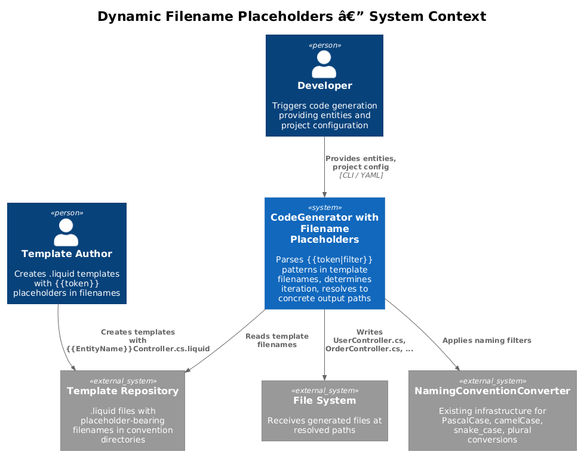
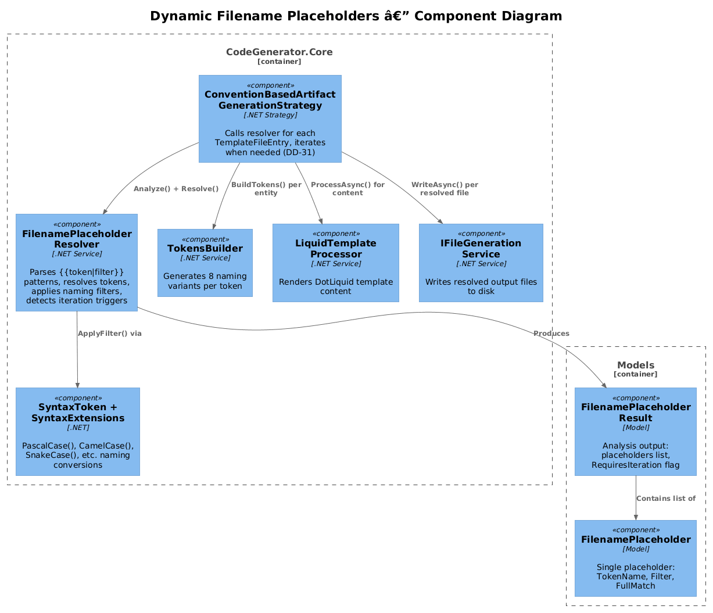
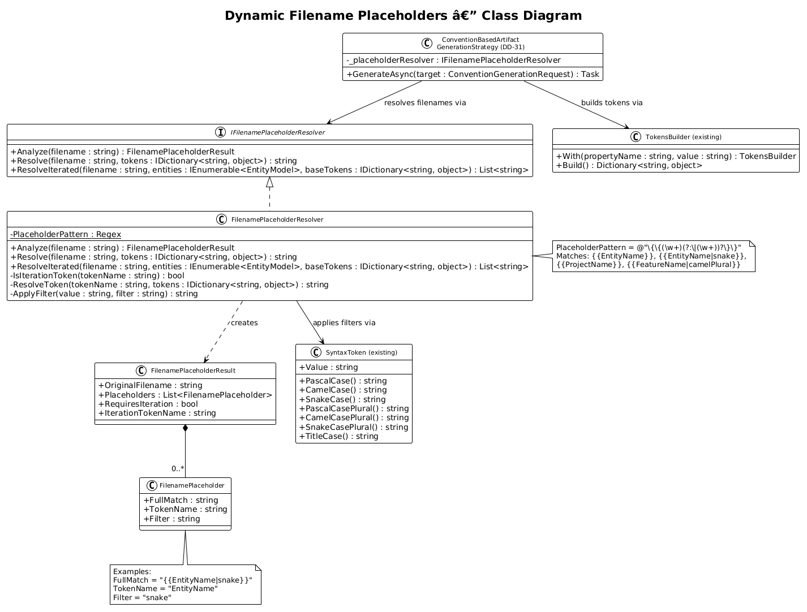
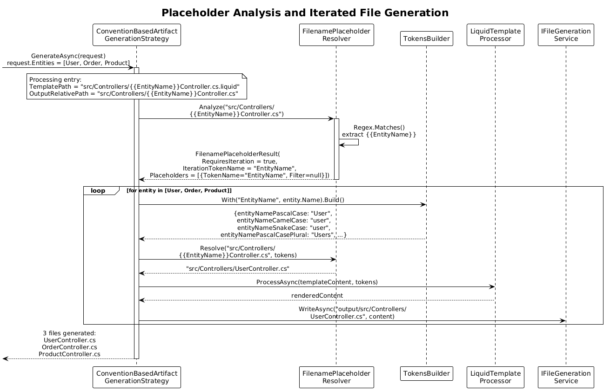
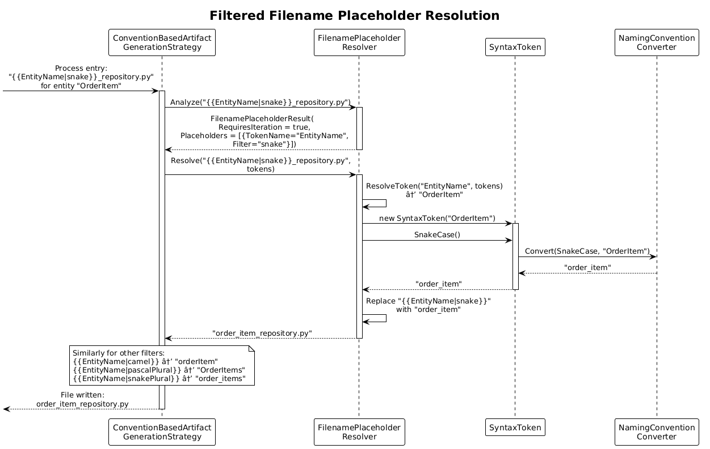

# Dynamic Filename Placeholders -- Detailed Design

**Status:** Proposed

## 1. Overview

Dynamic Filename Placeholders enable template filenames to contain `{{token}}` expansion macros that are resolved at generation time. When a filename contains `{{EntityName}}`, the template is iterated once per entity, producing a separate output file for each. When a filename contains `{{ProjectName}}`, it is resolved once to the project name. Naming filters (e.g., `{{EntityName|snake}}`) allow the output filename to use a different casing convention than the default PascalCase.

This pattern (inspired by xregistry/codegen Pattern 4) works in conjunction with DD-31 (Convention-Based Template Discovery) to make template filenames self-describing: the filename itself encodes what the output file should be named and whether iteration is required.

**Actors:** Template Author -- creates `.liquid` template files with placeholder-bearing filenames. Developer -- triggers generation that resolves placeholders.

**Scope:** The `IFilenamePlaceholderResolver` interface, the `FilenameTokenPattern` regex engine, integration with `ConventionBasedArtifactGenerationStrategy` (DD-31), and the iteration logic that expands entity-bearing filenames into multiple output files.

## 2. Architecture

### 2.1 C4 Context Diagram

Shows the filename placeholder resolution system in the broader generation pipeline.



The template author creates `.liquid` files whose filenames contain `{{token}}` placeholders. During generation, the placeholder resolver parses these filenames, determines whether iteration is needed, resolves tokens from the `TokensBuilder`-generated dictionary, and produces concrete output filenames.

### 2.2 C4 Component Diagram

Shows the internal components involved in filename placeholder resolution.



| Component | Responsibility |
|-----------|----------------|
| `IFilenamePlaceholderResolver` | Parses `{{token}}` placeholders in filenames, resolves from token dictionary |
| `FilenamePlaceholderResolver` | Implementation with regex extraction, filter application, iteration detection |
| `FilenameTokenPattern` | Compiled regex for extracting `{{token\|filter}}` patterns |
| `IFilenamePlaceholderFilter` | Interface for naming convention filters (snake, camel, pascal, etc.) |
| `ConventionBasedArtifactGenerationStrategy` (DD-31) | Calls resolver during file plan execution |
| `TokensBuilder` (existing) | Generates 8 naming variants per token |

## 3. Component Details

### 3.1 IFilenamePlaceholderResolver / FilenamePlaceholderResolver

**Namespace:** `CodeGenerator.Core.Templates`

```csharp
public interface IFilenamePlaceholderResolver
{
    FilenamePlaceholderResult Analyze(string filename);
    string Resolve(string filename, IDictionary<string, object> tokens);
    List<string> ResolveIterated(string filename, IEnumerable<EntityModel> entities,
        IDictionary<string, object> baseTokens);
}
```

```csharp
public class FilenamePlaceholderResolver : IFilenamePlaceholderResolver
{
    private static readonly Regex PlaceholderPattern =
        new(@"\{\{(\w+)(?:\|(\w+))?\}\}", RegexOptions.Compiled);

    public FilenamePlaceholderResult Analyze(string filename)
    {
        var matches = PlaceholderPattern.Matches(filename);
        var placeholders = new List<FilenamePlaceholder>();
        var requiresIteration = false;

        foreach (Match match in matches)
        {
            var tokenName = match.Groups[1].Value;
            var filter = match.Groups[2].Success ? match.Groups[2].Value : null;

            placeholders.Add(new FilenamePlaceholder
            {
                FullMatch = match.Value,
                TokenName = tokenName,
                Filter = filter
            });

            if (IsIterationToken(tokenName))
            {
                requiresIteration = true;
            }
        }

        return new FilenamePlaceholderResult
        {
            OriginalFilename = filename,
            Placeholders = placeholders,
            RequiresIteration = requiresIteration
        };
    }

    public string Resolve(string filename, IDictionary<string, object> tokens)
    {
        return PlaceholderPattern.Replace(filename, match =>
        {
            var tokenName = match.Groups[1].Value;
            var filter = match.Groups[2].Success ? match.Groups[2].Value : null;
            var value = ResolveToken(tokenName, tokens);
            return ApplyFilter(value, filter);
        });
    }

    private bool IsIterationToken(string tokenName)
        => tokenName is "EntityName" or "FeatureName";

    private string ResolveToken(string tokenName, IDictionary<string, object> tokens)
    {
        // Map placeholder names to TokensBuilder key conventions
        var key = tokenName switch
        {
            "EntityName" => "entityNamePascalCase",
            "ProjectName" => "projectNamePascalCase",
            "FeatureName" => "featureNamePascalCase",
            _ => tokenName  // custom tokens used as-is
        };
        return tokens.TryGetValue(key, out var val) ? val.ToString() : tokenName;
    }

    private string ApplyFilter(string value, string filter)
    {
        // Delegates to SyntaxToken naming convention methods
        if (filter == null) return value;
        var token = new SyntaxToken(value);
        return filter switch
        {
            "pascal" => token.PascalCase(),
            "camel" => token.CamelCase(),
            "snake" => token.SnakeCase(),
            "pascalPlural" => token.PascalCasePlural(),
            "camelPlural" => token.CamelCasePlural(),
            "snakePlural" => token.SnakeCasePlural(),
            "title" => token.TitleCase(),
            _ => value
        };
    }
}
```

- **Responsibility:** Parses placeholder patterns from filenames, determines if the file requires per-entity iteration, resolves placeholders using the token dictionary, and applies naming convention filters.
- **Dependencies:** `SyntaxToken` and `SyntaxExtensions` (existing) for naming convention conversion.
- **Filter integration:** Filters reuse the existing `NamingConventionConverter` infrastructure via `SyntaxToken` extension methods, ensuring consistency with the 8 naming variants already generated by `TokensBuilder`.

### 3.2 FilenamePlaceholderResult / FilenamePlaceholder

**Namespace:** `CodeGenerator.Core.Templates`

```csharp
public class FilenamePlaceholderResult
{
    public string OriginalFilename { get; set; }
    public List<FilenamePlaceholder> Placeholders { get; set; } = new();
    public bool RequiresIteration { get; set; }
    public string IterationTokenName { get; set; }  // e.g., "EntityName"
}

public class FilenamePlaceholder
{
    public string FullMatch { get; set; }       // e.g., "{{EntityName|snake}}"
    public string TokenName { get; set; }        // e.g., "EntityName"
    public string Filter { get; set; }           // e.g., "snake" (nullable)
}
```

### 3.3 Supported Placeholders

| Placeholder | Token Key | Iteration | Description |
|-------------|-----------|-----------|-------------|
| `{{EntityName}}` | `entityNamePascalCase` | Yes | Entity name in PascalCase (default) |
| `{{EntityName\|snake}}` | `entityNameSnakeCase` | Yes | Entity name in snake_case |
| `{{EntityName\|camel}}` | `entityNameCamelCase` | Yes | Entity name in camelCase |
| `{{EntityName\|pascalPlural}}` | `entityNamePascalCasePlural` | Yes | Pluralized entity name |
| `{{ProjectName}}` | `projectNamePascalCase` | No | Project name (resolved once) |
| `{{FeatureName}}` | `featureNamePascalCase` | Yes | Feature name for vertical-slice styles |
| Custom `{{MyToken}}` | `MyToken` | No | Looked up directly in token dictionary |

### 3.4 Filename Resolution Examples

| Template Filename | Entity/Token | Resolved Filename |
|-------------------|-------------|-------------------|
| `{{EntityName}}Controller.cs.liquid` | User | `UserController.cs` |
| `{{EntityName}}Controller.cs.liquid` | OrderItem | `OrderItemController.cs` |
| `{{EntityName\|snake}}_repository.py.liquid` | OrderItem | `order_item_repository.py` |
| `{{EntityName\|camel}}Service.ts.liquid` | OrderItem | `orderItemService.ts` |
| `{{EntityName\|pascalPlural}}Controller.cs.liquid` | Order | `OrdersController.cs` |
| `{{ProjectName}}.csproj.liquid` | MyApp (project) | `MyApp.csproj` |
| `I{{EntityName}}Repository.cs.liquid` | User | `IUserRepository.cs` |

### 3.5 Iteration Logic

When `FilenamePlaceholderResult.RequiresIteration` is true, the `ConventionBasedArtifactGenerationStrategy` (DD-31) iterates over the appropriate collection:

```csharp
// Inside ConventionBasedArtifactGenerationStrategy.GenerateAsync()
var analysis = _placeholderResolver.Analyze(entry.OutputRelativePath);

if (analysis.RequiresIteration)
{
    var collection = analysis.IterationTokenName switch
    {
        "EntityName" => request.Entities,
        "FeatureName" => request.Features,
        _ => throw new InvalidOperationException($"Unknown iteration token: {analysis.IterationTokenName}")
    };

    foreach (var item in collection)
    {
        var tokens = BuildTokens(request, item);
        var resolvedPath = _placeholderResolver.Resolve(entry.OutputRelativePath, tokens);
        var content = await _templateProcessor.ProcessAsync(entry.TemplateContent, tokens);
        await _fileService.WriteAsync(Path.Combine(request.OutputRoot, resolvedPath), content);
    }
}
else
{
    var tokens = BuildTokens(request);
    var resolvedPath = _placeholderResolver.Resolve(entry.OutputRelativePath, tokens);
    var content = await _templateProcessor.ProcessAsync(entry.TemplateContent, tokens);
    await _fileService.WriteAsync(Path.Combine(request.OutputRoot, resolvedPath), content);
}
```

### 3.6 Directory-Level Placeholders

Placeholders can also appear in directory path segments:

```
Features/
  {{EntityName}}/
    {{EntityName}}Controller.cs.liquid
    {{EntityName}}Service.cs.liquid
    {{EntityName}}.cs.liquid
```

When the path `Features/{{EntityName}}/{{EntityName}}Controller.cs.liquid` is resolved for entity `Order`, the output becomes `Features/Order/OrderController.cs`. The resolver processes the entire relative path, not just the filename.

## 4. Data Model

### 4.1 Class Diagram



### 4.2 Entity Descriptions

| Class | Responsibility |
|-------|---------------|
| `IFilenamePlaceholderResolver` | Interface for analyzing and resolving filename placeholders |
| `FilenamePlaceholderResolver` | Implementation with regex extraction, filter application, iteration detection |
| `FilenamePlaceholderResult` | Analysis result: list of placeholders, iteration flag |
| `FilenamePlaceholder` | Single placeholder: token name, filter, full match string |
| `FilenameTokenPattern` | Compiled regex constant `\{\{(\w+)(?:\|(\w+))?\}\}` |

### 4.3 Relationships

- `FilenamePlaceholderResolver` produces `FilenamePlaceholderResult` containing `FilenamePlaceholder` objects
- `FilenamePlaceholderResolver` uses `SyntaxToken` and `SyntaxExtensions` for filter application
- `ConventionBasedArtifactGenerationStrategy` (DD-31) depends on `IFilenamePlaceholderResolver` for path resolution
- `TemplateFileEntry` (DD-31) stores the `FilenamePlaceholderResult` after analysis

## 5. Key Workflows

### 5.1 Placeholder Analysis and Iterated Generation

When a template file with entity placeholders is processed:



**Step-by-step:**

1. **Analyze filename** -- `ConventionBasedArtifactGenerationStrategy` calls `IFilenamePlaceholderResolver.Analyze()` on the template's `OutputRelativePath` (e.g., `src/Controllers/{{EntityName}}Controller.cs`).
2. **Extract placeholders** -- The regex extracts `{{EntityName}}` with no filter. The result sets `RequiresIteration = true` and `IterationTokenName = "EntityName"`.
3. **Iterate entities** -- The strategy loops over the entity collection (e.g., `[User, Order, Product]`).
4. **Build entity tokens** -- For each entity, `TokensBuilder` generates 8 naming variants: `entityNamePascalCase = "User"`, `entityNameCamelCase = "user"`, `entityNameSnakeCase = "user"`, etc.
5. **Resolve filename** -- `IFilenamePlaceholderResolver.Resolve()` replaces `{{EntityName}}` with the PascalCase value, producing `src/Controllers/UserController.cs`.
6. **Render template** -- `ITemplateProcessor.ProcessAsync()` renders the template content with the same token dictionary.
7. **Write file** -- The rendered content is written to the resolved path.
8. **Repeat** -- Steps 4-7 repeat for each entity, producing `UserController.cs`, `OrderController.cs`, `ProductController.cs`.

### 5.2 Filtered Filename Resolution

When a template filename uses a naming filter:



**Step-by-step:**

1. **Analyze filename** -- The resolver analyzes `{{EntityName|snake}}_repository.py` and extracts placeholder `EntityName` with filter `snake`.
2. **Resolve with filter** -- For entity `OrderItem`, the resolver:
   - Looks up the token value: `"OrderItem"`
   - Creates a `SyntaxToken("OrderItem")`
   - Applies the `snake` filter via `SyntaxToken.SnakeCase()` which returns `"order_item"`
   - Produces output filename: `order_item_repository.py`
3. **Render and write** -- Template content is rendered and written to the resolved path.

## 6. DI Registration

```csharp
// In CodeGenerator.Core ConfigureServices
services.AddSingleton<IFilenamePlaceholderResolver, FilenamePlaceholderResolver>();
```

The resolver is injected into `ConventionBasedArtifactGenerationStrategy` alongside the existing `ITemplateProcessor` and `IConventionTemplateDiscovery` dependencies.

## 7. Security Considerations

- **Path injection** -- Placeholder values derived from entity names could theoretically contain path separators or `..` sequences if entity names are not validated. Entity names must be validated to contain only alphanumeric characters and underscores before being used in filename resolution. The `NamingConventionConverter` already strips non-alphanumeric characters during conversion.
- **Regex denial of service** -- The `FilenameTokenPattern` regex is simple and non-backtracking, with no risk of catastrophic backtracking. It is compiled once and reused.
- **Filter injection** -- Unknown filter names are silently ignored (the value is returned unmodified). This prevents errors from typos but could lead to unexpected filenames. Consider logging a warning for unknown filters.

## 8. Test Strategy

### 8.1 Unit Tests

| Test | Description |
|------|-------------|
| `Analyze_NoPlaceholders_EmptyResult` | Verify `Program.cs` returns empty placeholder list and `RequiresIteration = false` |
| `Analyze_EntityNamePlaceholder_RequiresIteration` | Verify `{{EntityName}}Controller.cs` sets `RequiresIteration = true` |
| `Analyze_ProjectNamePlaceholder_NoIteration` | Verify `{{ProjectName}}.csproj` sets `RequiresIteration = false` |
| `Analyze_MultiPlaceholders_AllExtracted` | Verify `{{EntityName}}{{ProjectName}}.cs` extracts both placeholders |
| `Analyze_FilteredPlaceholder_FilterExtracted` | Verify `{{EntityName\|snake}}` extracts filter `"snake"` |
| `Resolve_EntityName_PascalCaseDefault` | Verify `{{EntityName}}Controller.cs` with entity `User` resolves to `UserController.cs` |
| `Resolve_EntityName_SnakeFilter` | Verify `{{EntityName\|snake}}_repo.py` with entity `OrderItem` resolves to `order_item_repo.py` |
| `Resolve_EntityName_CamelFilter` | Verify `{{EntityName\|camel}}Service.ts` with entity `OrderItem` resolves to `orderItemService.ts` |
| `Resolve_EntityName_PascalPluralFilter` | Verify `{{EntityName\|pascalPlural}}Controller.cs` with entity `Order` resolves to `OrdersController.cs` |
| `Resolve_ProjectName_ResolvedOnce` | Verify `{{ProjectName}}.csproj` with project `MyApp` resolves to `MyApp.csproj` |
| `Resolve_DirectoryPlaceholder_FullPathResolved` | Verify `Features/{{EntityName}}/{{EntityName}}.cs` resolves to `Features/User/User.cs` |
| `Resolve_UnknownFilter_ReturnsUnfiltered` | Verify `{{EntityName\|bogus}}` returns the raw PascalCase value |
| `Resolve_UnknownToken_ReturnsTokenName` | Verify `{{UnknownToken}}` returns `"UnknownToken"` as literal |
| `Resolve_InterfacePrefix_CorrectPlacement` | Verify `I{{EntityName}}Repository.cs` resolves to `IUserRepository.cs` |
| `ResolveIterated_ThreeEntities_ThreeFilenames` | Verify iteration over 3 entities produces 3 resolved filenames |

### 8.2 Integration Tests

| Test | Description |
|------|-------------|
| `ConventionGeneration_EntityPlaceholders_ProducesPerEntityFiles` | Given templates with `{{EntityName}}` and 3 entities, verify 3 output files per template |
| `ConventionGeneration_SnakeFilter_PythonFilenames` | Given `{{EntityName\|snake}}_model.py` and entities, verify snake_case filenames |
| `ConventionGeneration_DirectoryPlaceholders_NestedOutput` | Given `Features/{{EntityName}}/` structure, verify per-entity subdirectories |
| `ConventionGeneration_MixedPlaceholders_CorrectResolution` | Template with both `{{ProjectName}}` and `{{EntityName}}` resolves both correctly |

## 9. Open Questions

1. **Multiple iteration tokens** -- What happens if a filename contains both `{{EntityName}}` and `{{FeatureName}}`? Should this produce a cross-product (entities x features) or be rejected as invalid?
2. **Custom iteration tokens** -- Should template authors be able to define custom iteration tokens beyond `EntityName` and `FeatureName` (e.g., `{{ServiceName}}` iterating over a services collection)?
3. **Conditional filenames** -- Should there be a mechanism to conditionally skip a file based on token values (e.g., only generate `{{EntityName}}Controller.cs` if the entity has the `aggregate` stereotype)?
4. **Escaping placeholders** -- If a literal `{{` is needed in a filename (unlikely but possible), how should it be escaped? Consider `\{\{` or a different delimiter.
