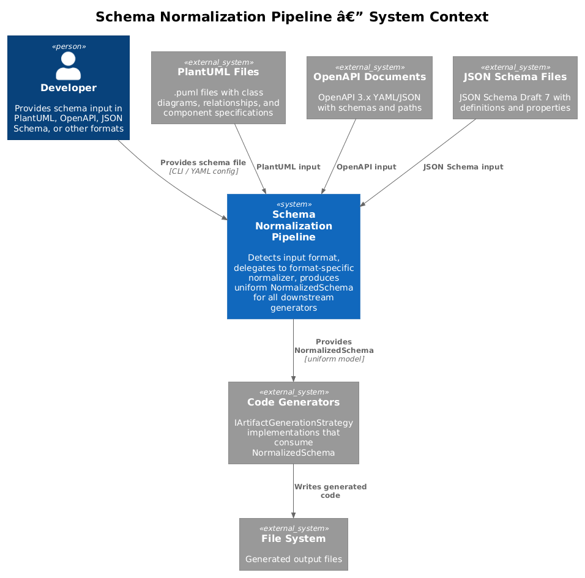
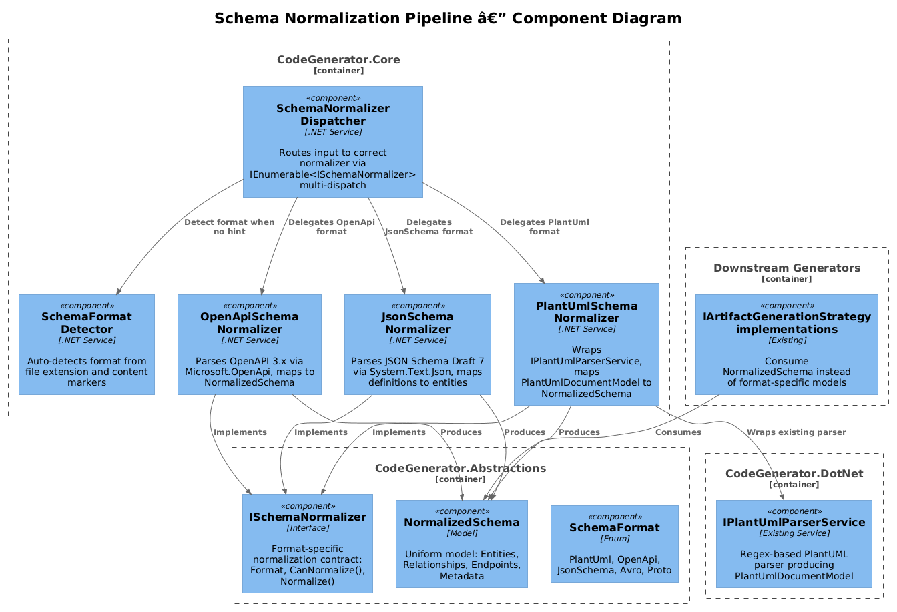
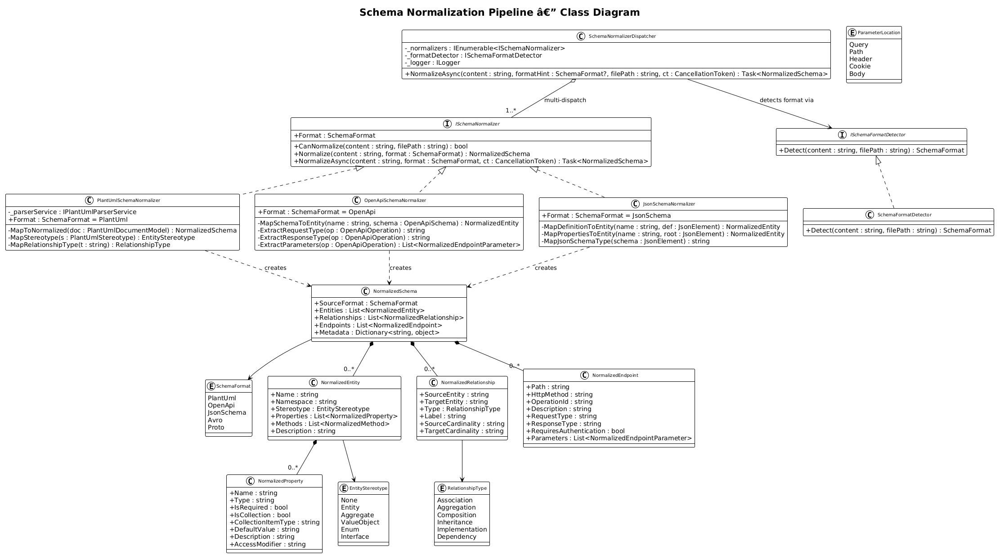
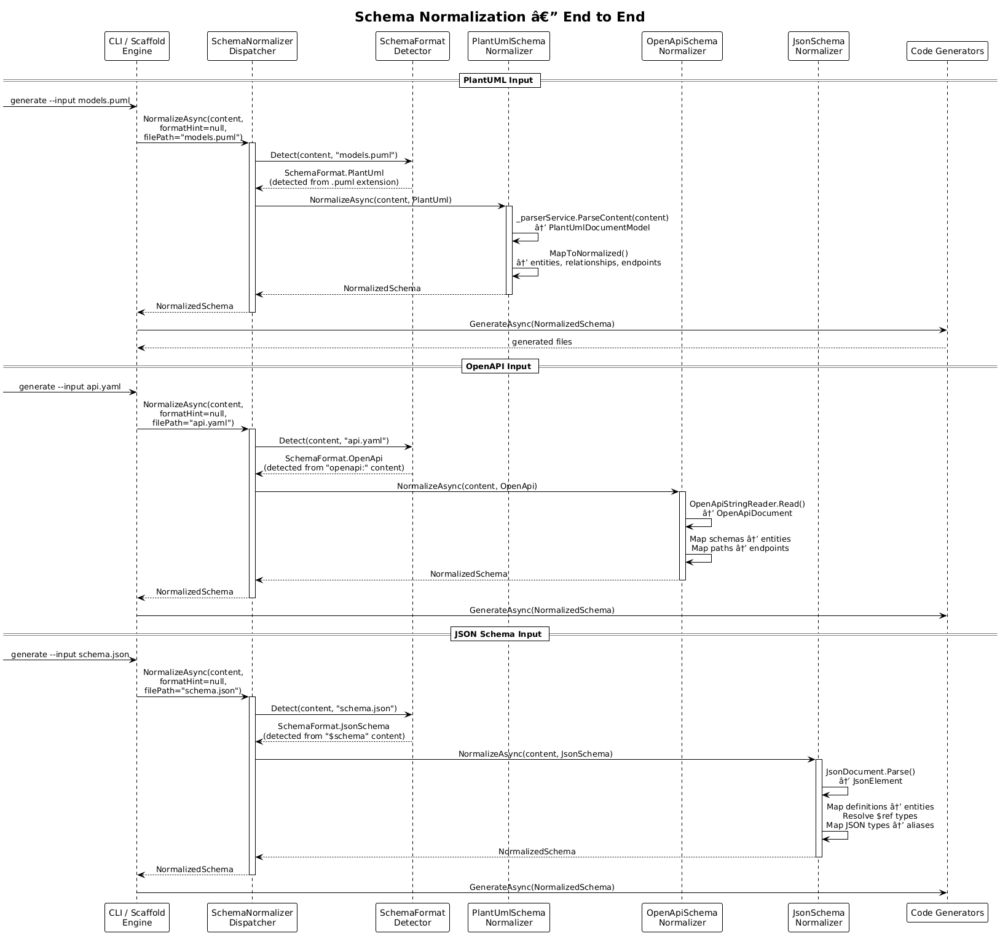
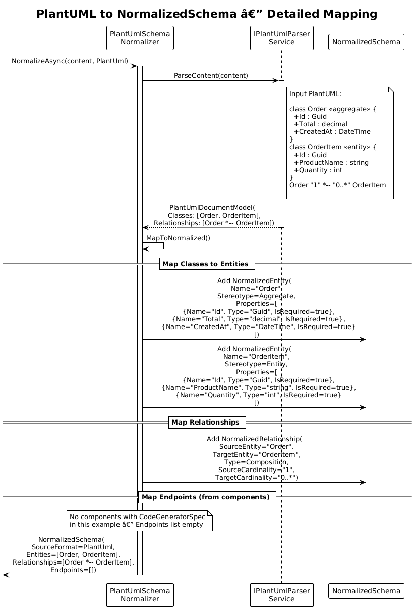

# Schema Normalization Pipeline -- Detailed Design

**Status:** Implemented

## 1. Overview

The Schema Normalization Pipeline introduces a uniform intermediate representation (`NormalizedSchema`) that all input formats are converted to before code generation. Today, the CodeGenerator has format-specific parsers -- `IPlantUmlParserService` produces `PlantUmlDocumentModel`/`PlantUmlClassModel`, and `OpenApiDocumentGenerationStrategy` produces Roslyn-based C# from OpenAPI. Downstream generators are tightly coupled to these format-specific models.

This design (inspired by xregistry/codegen Pattern 14) adds an `ISchemaNormalizer` abstraction with format-specific implementations. Each normalizer converts its input format into a shared `NormalizedSchema`. Generators then consume `NormalizedSchema` exclusively, decoupling input parsing from output generation and making it trivial to add new input formats (JSON Schema, Avro, Protobuf) without modifying any generator.

**Actors:** Developer -- provides input in any supported schema format. Generator strategies -- consume the normalized output.

**Scope:** The `ISchemaNormalizer` interface, `SchemaNormalizerDispatcher`, format-specific normalizers (`PlantUmlSchemaNormalizer`, `OpenApiSchemaNormalizer`, `JsonSchemaNormalizer`), the `NormalizedSchema` model hierarchy, and the migration path for existing generators.

## 2. Architecture

### 2.1 C4 Context Diagram

Shows the schema normalization pipeline in the broader CodeGenerator ecosystem.



The developer provides schema input in PlantUML, OpenAPI, JSON Schema, or other formats. The normalization pipeline detects the format, delegates to the appropriate normalizer, and produces a `NormalizedSchema`. All downstream code generators consume this uniform model regardless of the original input format.

### 2.2 C4 Component Diagram

Shows the internal components of the normalization pipeline.



| Component | Responsibility |
|-----------|----------------|
| `ISchemaNormalizer` | Interface for format-specific normalization |
| `SchemaNormalizerDispatcher` | Routes input to the correct normalizer based on detected format |
| `PlantUmlSchemaNormalizer` | Wraps `IPlantUmlParserService`, converts `PlantUmlDocumentModel` to `NormalizedSchema` |
| `OpenApiSchemaNormalizer` | Parses OpenAPI 3.x YAML/JSON into `NormalizedSchema` |
| `JsonSchemaNormalizer` | Parses JSON Schema Draft 7 into entities |
| `SchemaFormatDetector` | Auto-detects input format from content or file extension |
| `NormalizedSchema` | Uniform model: entities, relationships, endpoints, metadata |

## 3. Component Details

### 3.1 ISchemaNormalizer

**Namespace:** `CodeGenerator.Abstractions.Schema`

```csharp
public interface ISchemaNormalizer
{
    SchemaFormat Format { get; }
    bool CanNormalize(string content, string filePath = null);
    NormalizedSchema Normalize(string content, SchemaFormat format);
    Task<NormalizedSchema> NormalizeAsync(string content, SchemaFormat format,
        CancellationToken cancellationToken = default);
}
```

- **Responsibility:** Converts a schema document in a specific format into the uniform `NormalizedSchema` model.
- **Registration:** Each normalizer is registered as `ISchemaNormalizer` in the DI container. `SchemaNormalizerDispatcher` receives `IEnumerable<ISchemaNormalizer>` for multi-strategy dispatch (consistent with the existing pattern used by `IArtifactGenerationStrategy<T>`).

### 3.2 SchemaNormalizerDispatcher

**Namespace:** `CodeGenerator.Core.Schema`

```csharp
public class SchemaNormalizerDispatcher
{
    private readonly IEnumerable<ISchemaNormalizer> _normalizers;
    private readonly ISchemaFormatDetector _formatDetector;
    private readonly ILogger<SchemaNormalizerDispatcher> _logger;

    public async Task<NormalizedSchema> NormalizeAsync(string content, SchemaFormat? formatHint = null,
        string filePath = null, CancellationToken cancellationToken = default)
    {
        var format = formatHint ?? _formatDetector.Detect(content, filePath);

        var normalizer = _normalizers.FirstOrDefault(n => n.Format == format)
            ?? throw new UnsupportedSchemaFormatException(format);

        _logger.LogInformation("Normalizing {Format} schema using {Normalizer}",
            format, normalizer.GetType().Name);

        return await normalizer.NormalizeAsync(content, format, cancellationToken);
    }
}
```

### 3.3 SchemaFormatDetector

**Namespace:** `CodeGenerator.Core.Schema`

```csharp
public interface ISchemaFormatDetector
{
    SchemaFormat Detect(string content, string filePath = null);
}

public class SchemaFormatDetector : ISchemaFormatDetector
{
    public SchemaFormat Detect(string content, string filePath = null)
    {
        // 1. File extension detection
        if (!string.IsNullOrEmpty(filePath))
        {
            var ext = Path.GetExtension(filePath).ToLowerInvariant();
            if (ext == ".puml" || ext == ".plantuml") return SchemaFormat.PlantUml;
            if (ext == ".proto") return SchemaFormat.Proto;
            if (ext == ".avsc") return SchemaFormat.Avro;
        }

        // 2. Content-based detection
        var trimmed = content.TrimStart();
        if (trimmed.StartsWith("@startuml")) return SchemaFormat.PlantUml;
        if (trimmed.Contains("\"openapi\"") || trimmed.Contains("openapi:")) return SchemaFormat.OpenApi;
        if (trimmed.Contains("\"$schema\"") && trimmed.Contains("json-schema.org")) return SchemaFormat.JsonSchema;
        if (trimmed.StartsWith("syntax = \"proto")) return SchemaFormat.Proto;

        throw new SchemaFormatDetectionException("Unable to detect schema format from content or file path.");
    }
}
```

### 3.4 PlantUmlSchemaNormalizer

**Namespace:** `CodeGenerator.Core.Schema.Normalizers`

```csharp
public class PlantUmlSchemaNormalizer : ISchemaNormalizer
{
    private readonly IPlantUmlParserService _parserService;

    public SchemaFormat Format => SchemaFormat.PlantUml;

    public bool CanNormalize(string content, string filePath = null)
        => content.TrimStart().StartsWith("@startuml");

    public async Task<NormalizedSchema> NormalizeAsync(string content, SchemaFormat format,
        CancellationToken cancellationToken = default)
    {
        var document = _parserService.ParseContent(content);
        return MapToNormalized(document);
    }

    private NormalizedSchema MapToNormalized(PlantUmlDocumentModel document)
    {
        var schema = new NormalizedSchema
        {
            SourceFormat = SchemaFormat.PlantUml,
            Metadata = new Dictionary<string, object>
            {
                ["title"] = document.Title ?? string.Empty
            }
        };

        // Map classes to entities
        foreach (var cls in document.Classes)
        {
            schema.Entities.Add(new NormalizedEntity
            {
                Name = cls.Name,
                Namespace = cls.Namespace,
                Stereotype = MapStereotype(cls.Stereotype),
                Properties = cls.Properties.Select(p => new NormalizedProperty
                {
                    Name = p.Name,
                    Type = p.Type,
                    IsRequired = !p.IsNullable,
                    AccessModifier = p.AccessModifier
                }).ToList()
            });
        }

        // Map relationships
        foreach (var rel in document.Relationships)
        {
            schema.Relationships.Add(new NormalizedRelationship
            {
                SourceEntity = rel.Source,
                TargetEntity = rel.Target,
                Type = MapRelationshipType(rel.Type),
                Label = rel.Label
            });
        }

        // Map components with CodeGeneratorSpec to endpoints
        foreach (var comp in document.Components.Where(c => c.CodeGeneratorSpec != null))
        {
            foreach (var gen in comp.CodeGeneratorSpec.CodeGenerators)
            {
                schema.Endpoints.Add(new NormalizedEndpoint
                {
                    Path = $"{comp.CodeGeneratorSpec.Route}/{gen.Path}",
                    HttpMethod = gen.HttpVerb,
                    Description = gen.Description,
                    RequestType = gen.RequestType,
                    ResponseType = gen.ResponseType,
                    RequiresAuthentication = comp.CodeGeneratorSpec.AuthenticationRequired
                });
            }
        }

        return schema;
    }
}
```

### 3.5 OpenApiSchemaNormalizer

**Namespace:** `CodeGenerator.Core.Schema.Normalizers`

```csharp
public class OpenApiSchemaNormalizer : ISchemaNormalizer
{
    public SchemaFormat Format => SchemaFormat.OpenApi;

    public async Task<NormalizedSchema> NormalizeAsync(string content, SchemaFormat format,
        CancellationToken cancellationToken = default)
    {
        var openApiDoc = new OpenApiStringReader().Read(content, out var diagnostic);
        var schema = new NormalizedSchema { SourceFormat = SchemaFormat.OpenApi };

        // Map schemas to entities
        foreach (var (name, schemaObj) in openApiDoc.Components.Schemas)
        {
            schema.Entities.Add(MapSchemaToEntity(name, schemaObj));
        }

        // Map paths to endpoints
        foreach (var (path, pathItem) in openApiDoc.Paths)
        {
            foreach (var (method, operation) in pathItem.Operations)
            {
                schema.Endpoints.Add(new NormalizedEndpoint
                {
                    Path = path,
                    HttpMethod = method.ToString().ToUpperInvariant(),
                    OperationId = operation.OperationId,
                    Description = operation.Summary ?? operation.Description,
                    RequestType = ExtractRequestType(operation),
                    ResponseType = ExtractResponseType(operation),
                    Parameters = ExtractParameters(operation)
                });
            }
        }

        return schema;
    }
}
```

### 3.6 JsonSchemaNormalizer

**Namespace:** `CodeGenerator.Core.Schema.Normalizers`

```csharp
public class JsonSchemaNormalizer : ISchemaNormalizer
{
    public SchemaFormat Format => SchemaFormat.JsonSchema;

    public async Task<NormalizedSchema> NormalizeAsync(string content, SchemaFormat format,
        CancellationToken cancellationToken = default)
    {
        var jsonDoc = JsonDocument.Parse(content);
        var root = jsonDoc.RootElement;
        var schema = new NormalizedSchema { SourceFormat = SchemaFormat.JsonSchema };

        // Root object becomes primary entity
        if (root.TryGetProperty("title", out var title))
        {
            schema.Metadata["title"] = title.GetString();
        }

        // Map definitions/properties to entities
        if (root.TryGetProperty("definitions", out var definitions) ||
            root.TryGetProperty("$defs", out definitions))
        {
            foreach (var def in definitions.EnumerateObject())
            {
                schema.Entities.Add(MapDefinitionToEntity(def.Name, def.Value));
            }
        }

        // Root-level properties become the primary entity if named
        if (root.TryGetProperty("properties", out var props) && title.ValueKind == JsonValueKind.String)
        {
            schema.Entities.Add(MapPropertiesToEntity(title.GetString(), root));
        }

        return schema;
    }

    private NormalizedEntity MapDefinitionToEntity(string name, JsonElement definition)
    {
        var entity = new NormalizedEntity { Name = name };

        if (definition.TryGetProperty("properties", out var props))
        {
            var required = definition.TryGetProperty("required", out var reqArray)
                ? reqArray.EnumerateArray().Select(r => r.GetString()).ToHashSet()
                : new HashSet<string>();

            foreach (var prop in props.EnumerateObject())
            {
                entity.Properties.Add(new NormalizedProperty
                {
                    Name = prop.Name,
                    Type = MapJsonSchemaType(prop.Value),
                    IsRequired = required.Contains(prop.Name),
                    Description = prop.Value.TryGetProperty("description", out var desc)
                        ? desc.GetString() : null
                });
            }
        }

        return entity;
    }

    private string MapJsonSchemaType(JsonElement schema)
    {
        if (schema.TryGetProperty("$ref", out var refVal))
        {
            var refPath = refVal.GetString();
            return refPath.Split('/').Last();  // #/definitions/Order → Order
        }

        var type = schema.TryGetProperty("type", out var t) ? t.GetString() : "string";
        var format = schema.TryGetProperty("format", out var f) ? f.GetString() : null;

        return (type, format) switch
        {
            ("string", "date-time") => "datetime",
            ("string", "uuid") => "uuid",
            ("string", "date") => "datetime",
            ("string", _) => "string",
            ("integer", _) => "int",
            ("number", _) => "float",
            ("boolean", _) => "bool",
            ("array", _) => schema.TryGetProperty("items", out var items)
                ? $"list<{MapJsonSchemaType(items)}>" : "list<string>",
            _ => "string"
        };
    }
}
```

### 3.7 NormalizedSchema Model Hierarchy

**Namespace:** `CodeGenerator.Abstractions.Schema`

```csharp
public enum SchemaFormat { PlantUml, OpenApi, JsonSchema, Avro, Proto }

public class NormalizedSchema
{
    public SchemaFormat SourceFormat { get; set; }
    public List<NormalizedEntity> Entities { get; set; } = new();
    public List<NormalizedRelationship> Relationships { get; set; } = new();
    public List<NormalizedEndpoint> Endpoints { get; set; } = new();
    public Dictionary<string, object> Metadata { get; set; } = new();
}

public class NormalizedEntity
{
    public string Name { get; set; }
    public string Namespace { get; set; }
    public EntityStereotype Stereotype { get; set; } = EntityStereotype.None;
    public List<NormalizedProperty> Properties { get; set; } = new();
    public List<NormalizedMethod> Methods { get; set; } = new();
    public string Description { get; set; }
}

public enum EntityStereotype { None, Entity, Aggregate, ValueObject, Enum, Interface }

public class NormalizedProperty
{
    public string Name { get; set; }
    public string Type { get; set; }           // Cross-platform type alias (string, int, uuid, etc.)
    public bool IsRequired { get; set; }
    public bool IsCollection { get; set; }
    public string CollectionItemType { get; set; }
    public string DefaultValue { get; set; }
    public string Description { get; set; }
    public string AccessModifier { get; set; }
}

public class NormalizedMethod
{
    public string Name { get; set; }
    public string ReturnType { get; set; }
    public List<NormalizedParameter> Parameters { get; set; } = new();
    public string AccessModifier { get; set; }
}

public class NormalizedParameter
{
    public string Name { get; set; }
    public string Type { get; set; }
}

public class NormalizedRelationship
{
    public string SourceEntity { get; set; }
    public string TargetEntity { get; set; }
    public RelationshipType Type { get; set; }
    public string Label { get; set; }
    public string SourceCardinality { get; set; }
    public string TargetCardinality { get; set; }
}

public enum RelationshipType { Association, Aggregation, Composition, Inheritance, Implementation, Dependency }

public class NormalizedEndpoint
{
    public string Path { get; set; }
    public string HttpMethod { get; set; }
    public string OperationId { get; set; }
    public string Description { get; set; }
    public string RequestType { get; set; }
    public string ResponseType { get; set; }
    public bool RequiresAuthentication { get; set; }
    public List<NormalizedEndpointParameter> Parameters { get; set; } = new();
}

public class NormalizedEndpointParameter
{
    public string Name { get; set; }
    public string Type { get; set; }
    public ParameterLocation Location { get; set; }
    public bool IsRequired { get; set; }
}

public enum ParameterLocation { Query, Path, Header, Cookie, Body }
```

### 3.8 Type Alias System

`NormalizedProperty.Type` uses cross-platform type aliases that downstream generators map to native types. This reuses the same type mapping table established in DD-23:

| Alias | C# | Python | TypeScript | JSON Schema |
|-------|-----|--------|------------|-------------|
| `string` | `string` | `str` | `string` | `"type": "string"` |
| `int` | `int` | `int` | `number` | `"type": "integer"` |
| `float` | `double` | `float` | `number` | `"type": "number"` |
| `bool` | `bool` | `bool` | `boolean` | `"type": "boolean"` |
| `datetime` | `DateTime` | `datetime` | `Date` | `"type": "string", "format": "date-time"` |
| `uuid` | `Guid` | `UUID` | `string` | `"type": "string", "format": "uuid"` |
| `list<T>` | `List<T>` | `list[T]` | `T[]` | `"type": "array", "items": {...}` |
| `map<K,V>` | `Dictionary<K,V>` | `dict[K,V]` | `Record<K,V>` | `"type": "object", "additionalProperties": {...}` |

## 4. Data Model

### 4.1 Class Diagram



### 4.2 Entity Descriptions

| Class | Responsibility |
|-------|---------------|
| `ISchemaNormalizer` | Interface for format-specific schema normalization |
| `SchemaNormalizerDispatcher` | Routes input to correct normalizer by format |
| `ISchemaFormatDetector` | Detects input format from content or file extension |
| `PlantUmlSchemaNormalizer` | Converts `PlantUmlDocumentModel` to `NormalizedSchema` |
| `OpenApiSchemaNormalizer` | Converts OpenAPI 3.x to `NormalizedSchema` |
| `JsonSchemaNormalizer` | Converts JSON Schema Draft 7 to `NormalizedSchema` |
| `NormalizedSchema` | Uniform intermediate model: entities, relationships, endpoints |
| `NormalizedEntity` | Entity with name, stereotype, properties, methods |
| `NormalizedRelationship` | Relationship between two entities |
| `NormalizedEndpoint` | HTTP endpoint with method, path, request/response types |

### 4.3 Relationships

- `SchemaNormalizerDispatcher` receives `IEnumerable<ISchemaNormalizer>` via DI (multi-strategy dispatch)
- `SchemaNormalizerDispatcher` depends on `ISchemaFormatDetector` for auto-detection
- `PlantUmlSchemaNormalizer` wraps the existing `IPlantUmlParserService` from `CodeGenerator.DotNet`
- `OpenApiSchemaNormalizer` uses `Microsoft.OpenApi.Readers` for parsing
- `JsonSchemaNormalizer` uses `System.Text.Json` for parsing
- All normalizers produce `NormalizedSchema` which is consumed by downstream generators
- Existing generators (`IArtifactGenerationStrategy<T>`) migrate to accept `NormalizedSchema` instead of format-specific models

## 5. Key Workflows

### 5.1 Schema Normalization (End to End)

When a developer provides a schema file for code generation:



**Step-by-step:**

1. **Receive input** -- The CLI or scaffold engine receives a schema file path or inline content.
2. **Detect format** -- `SchemaFormatDetector` examines the file extension and content markers to determine the format (e.g., `.puml` or `@startuml` marker indicates PlantUML).
3. **Dispatch to normalizer** -- `SchemaNormalizerDispatcher` selects the `ISchemaNormalizer` whose `Format` property matches the detected format.
4. **Parse and normalize** -- The selected normalizer parses the input using its format-specific parser and maps the result to `NormalizedSchema`.
5. **Return uniform model** -- The `NormalizedSchema` contains entities, relationships, and endpoints in a format-agnostic representation.
6. **Generate code** -- Downstream generators consume the `NormalizedSchema`. Entity names and types are in cross-platform aliases, ready for language-specific type mapping.

### 5.2 PlantUML to NormalizedSchema Mapping

When PlantUML input is provided:



**Step-by-step:**

1. **Parse PlantUML** -- `PlantUmlSchemaNormalizer` delegates to the existing `IPlantUmlParserService.ParseContent()` method, producing a `PlantUmlDocumentModel`.
2. **Map classes** -- Each `PlantUmlClassModel` becomes a `NormalizedEntity`. Properties are mapped 1:1 with type names preserved as-is (PlantUML types are already close to the cross-platform aliases).
3. **Map stereotypes** -- `PlantUmlStereotype.Aggregate` maps to `EntityStereotype.Aggregate`, `PlantUmlStereotype.Entity` to `EntityStereotype.Entity`, etc.
4. **Map relationships** -- `PlantUmlRelationshipModel` entries become `NormalizedRelationship` entries with source, target, and type.
5. **Map endpoints** -- `PlantUmlComponentModel` entries with `CodeGeneratorSpec` are expanded into `NormalizedEndpoint` entries (one per HTTP verb/path combination).
6. **Return schema** -- The complete `NormalizedSchema` is returned to the dispatcher.

## 6. DI Registration

```csharp
// In CodeGenerator.Abstractions (interface only)
// ISchemaNormalizer, NormalizedSchema, SchemaFormat -- all defined here

// In CodeGenerator.Core ConfigureServices
services.AddSingleton<ISchemaFormatDetector, SchemaFormatDetector>();
services.AddSingleton<SchemaNormalizerDispatcher>();
services.AddSingleton<ISchemaNormalizer, PlantUmlSchemaNormalizer>();
services.AddSingleton<ISchemaNormalizer, OpenApiSchemaNormalizer>();
services.AddSingleton<ISchemaNormalizer, JsonSchemaNormalizer>();
```

New normalizers (Avro, Proto) are added by implementing `ISchemaNormalizer` and registering as singletons. The dispatcher discovers them automatically via `IEnumerable<ISchemaNormalizer>`.

## 7. Migration Path

Existing generators that consume `PlantUmlDocumentModel` or `PlantUmlClassModel` directly must be migrated to consume `NormalizedSchema`. The migration is incremental:

1. **Phase 1:** Add the normalization layer alongside existing parsers. Generators that already work continue unchanged.
2. **Phase 2:** New generators are written against `NormalizedSchema` exclusively.
3. **Phase 3:** Existing generators are migrated one at a time. The `PlantUmlSchemaNormalizer` ensures that PlantUML input produces the same entities/relationships/endpoints, so migration is a refactor (same behavior, different model).
4. **Phase 4:** Once all generators consume `NormalizedSchema`, the direct `PlantUmlDocumentModel` dependency is removed from downstream generators (the parser service itself remains as an internal implementation detail of `PlantUmlSchemaNormalizer`).

## 8. Security Considerations

- **Input validation** -- Schema content from external sources must be validated before parsing. JSON Schema and OpenAPI parsers should enforce size limits to prevent denial-of-service via extremely large schemas.
- **Circular references** -- JSON Schema `$ref` can create circular references. The `JsonSchemaNormalizer` must detect and break cycles (e.g., max depth of 10 for `$ref` resolution).
- **Code injection via schema** -- Entity names, property names, and type names from schema input become identifiers in generated code. The `NamingConventionConverter` strips non-alphanumeric characters, but names should be additionally validated to be legal identifiers in all target languages.
- **External references** -- JSON Schema and OpenAPI support `$ref` pointing to external URLs. The normalizers must not fetch external references by default. An opt-in flag can enable external resolution when trusted.

## 9. Test Strategy

### 9.1 Unit Tests

| Test | Description |
|------|-------------|
| `SchemaFormatDetector_PlantUml_DetectedByExtension` | Verify `.puml` file extension returns `SchemaFormat.PlantUml` |
| `SchemaFormatDetector_PlantUml_DetectedByContent` | Verify `@startuml` content marker returns `SchemaFormat.PlantUml` |
| `SchemaFormatDetector_OpenApi_DetectedByContent` | Verify `"openapi": "3.0"` content returns `SchemaFormat.OpenApi` |
| `SchemaFormatDetector_JsonSchema_DetectedByContent` | Verify `"$schema": "https://json-schema.org/..."` returns `SchemaFormat.JsonSchema` |
| `SchemaFormatDetector_UnknownFormat_Throws` | Verify unrecognizable content throws `SchemaFormatDetectionException` |
| `PlantUmlNormalizer_ClassWithProperties_MapsToEntity` | Verify `PlantUmlClassModel` with properties becomes `NormalizedEntity` |
| `PlantUmlNormalizer_AggregateStereotype_MapsCorrectly` | Verify `PlantUmlStereotype.Aggregate` maps to `EntityStereotype.Aggregate` |
| `PlantUmlNormalizer_Relationships_Mapped` | Verify `PlantUmlRelationshipModel` becomes `NormalizedRelationship` |
| `PlantUmlNormalizer_ComponentEndpoints_Mapped` | Verify `PlantUmlComponentModel` with `CodeGeneratorSpec` becomes `NormalizedEndpoint` entries |
| `OpenApiNormalizer_Schemas_MapToEntities` | Verify OpenAPI component schemas become `NormalizedEntity` objects |
| `OpenApiNormalizer_Paths_MapToEndpoints` | Verify OpenAPI paths/operations become `NormalizedEndpoint` objects |
| `OpenApiNormalizer_ParameterLocations_MappedCorrectly` | Verify query, path, header parameters map to `ParameterLocation` |
| `JsonSchemaNormalizer_Definitions_MapToEntities` | Verify JSON Schema `definitions` become `NormalizedEntity` objects |
| `JsonSchemaNormalizer_RequiredProperties_MarkedCorrectly` | Verify `required` array maps to `NormalizedProperty.IsRequired` |
| `JsonSchemaNormalizer_TypeMapping_CorrectAliases` | Verify JSON Schema types map to cross-platform aliases (integer->int, number->float) |
| `JsonSchemaNormalizer_RefTypes_ResolvedToEntityNames` | Verify `$ref: "#/definitions/Order"` resolves to type `"Order"` |
| `JsonSchemaNormalizer_ArrayTypes_MappedToList` | Verify `"type": "array"` maps to `list<ItemType>` |
| `Dispatcher_RoutesToCorrectNormalizer_ByFormat` | Verify dispatcher selects `PlantUmlSchemaNormalizer` for `SchemaFormat.PlantUml` |
| `Dispatcher_UnsupportedFormat_Throws` | Verify unknown format throws `UnsupportedSchemaFormatException` |
| `Dispatcher_AutoDetectsFormat_WhenNoHint` | Verify dispatcher delegates to `SchemaFormatDetector` when no format hint provided |

### 9.2 Integration Tests

| Test | Description |
|------|-------------|
| `Normalize_PlantUmlFile_ProducesExpectedEntities` | Parse a real `.puml` file with classes, relationships, and components; verify all map to `NormalizedSchema` correctly |
| `Normalize_OpenApiYaml_ProducesExpectedEntitiesAndEndpoints` | Parse a real OpenAPI 3.0 YAML; verify schemas become entities and paths become endpoints |
| `Normalize_JsonSchema_ProducesExpectedEntities` | Parse a real JSON Schema with definitions; verify all definitions become entities with correct properties and types |
| `Normalize_ThenGenerate_PlantUmlRoundtrip` | Normalize a PlantUML file, pass `NormalizedSchema` to a generator, and verify output matches pre-normalization generation (regression) |
| `Normalize_MultiFormat_SameEntities` | Define the same "Order" entity in PlantUML, OpenAPI, and JSON Schema; normalize all three; verify the resulting `NormalizedEntity` objects are semantically equivalent |

## 10. Open Questions

1. **Lossless roundtrip** -- Should `NormalizedSchema` preserve enough information to reconstruct the original format? This would enable format conversion (e.g., PlantUML to OpenAPI).
2. **Enum handling** -- PlantUML enums are represented as `PlantUmlEnumModel`. Should `NormalizedEntity` with `Stereotype = Enum` have a `Values` list, or should a separate `NormalizedEnum` class be introduced?
3. **Inheritance** -- PlantUML supports class inheritance. Should `NormalizedEntity` model this via a `BaseEntity` property, or should inheritance be represented only as a `NormalizedRelationship` of type `Inheritance`?
4. **Validation** -- Should `NormalizedSchema` validate itself after construction (e.g., ensure all relationship source/target entity names exist in the entities list)?
5. **Avro and Protobuf timeline** -- These formats are declared in `SchemaFormat` but have no normalizer implementation. Should they be deferred to a future design, or should stub implementations be included now?
