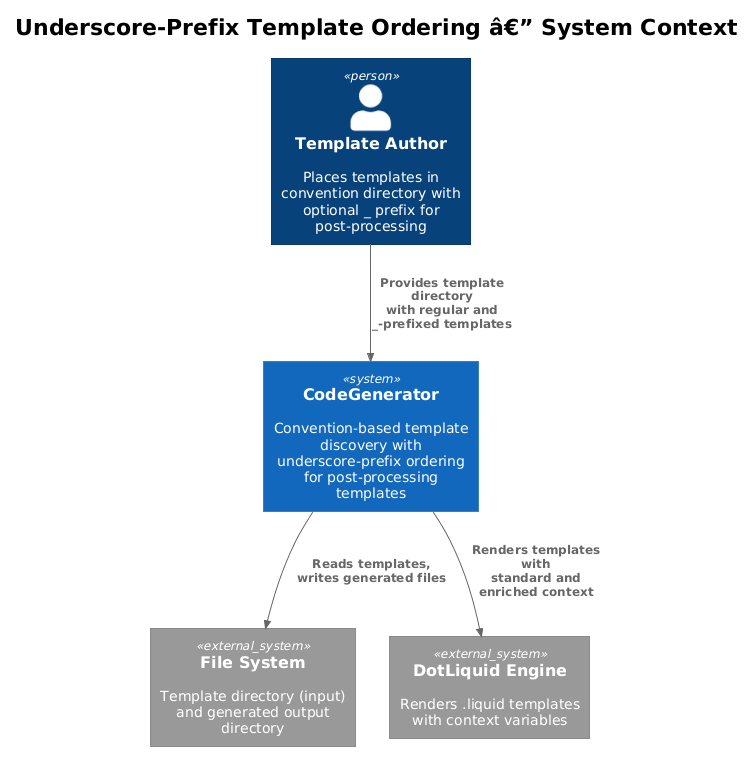
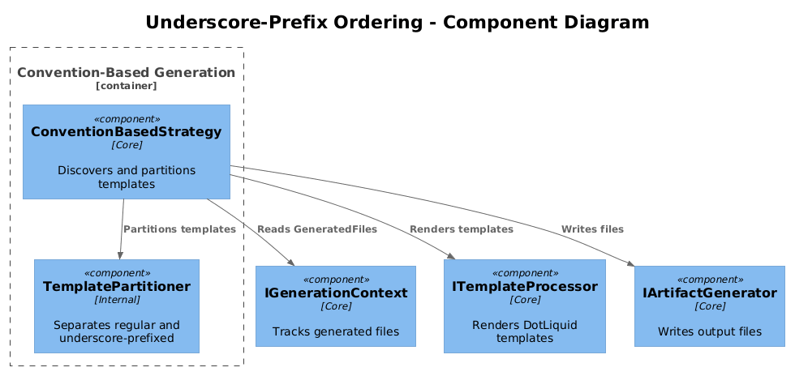
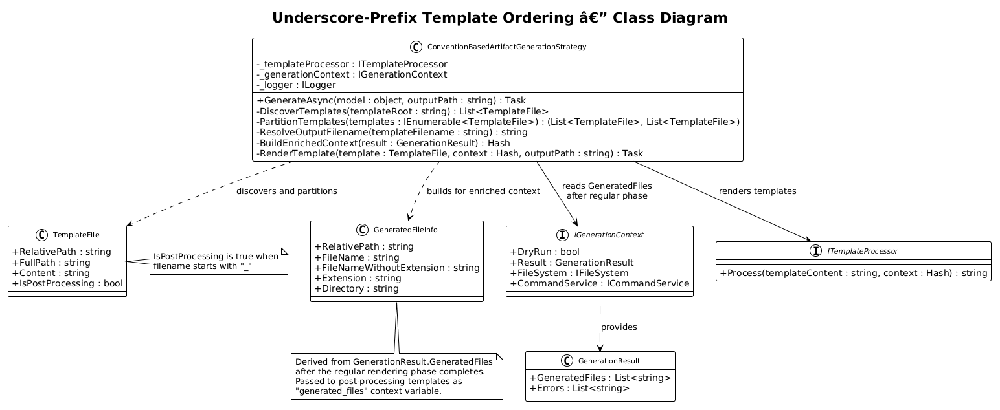
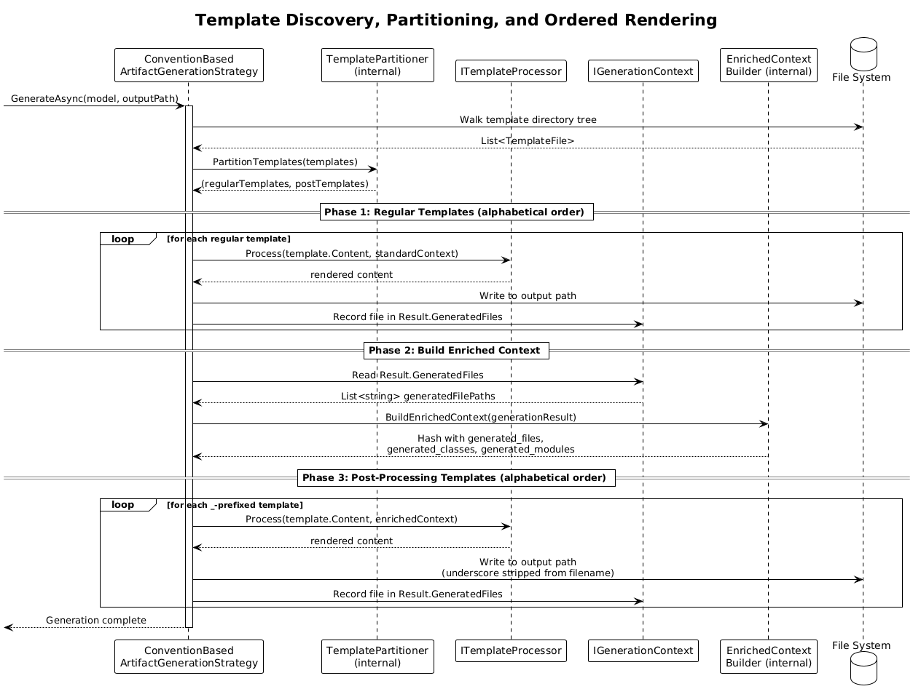
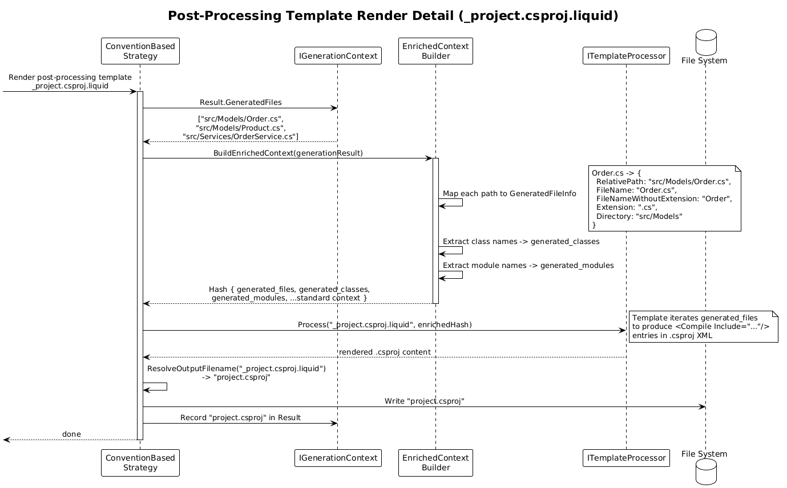

# Underscore-Prefix Template Ordering -- Detailed Design

**Status:** Implemented
**Depends on:** [DD-31 Convention-Based Template Discovery](../31-convention-based-template-discovery/README.md), [DD-28 Cross-Template State](../28-cross-template-state/README.md)
**Pattern source:** [Pattern 5 -- Underscore-Prefix Ordering](../../xregistry-codegen-patterns.md#pattern-5-underscore-prefix-ordering-for-post-processing)

## 1. Overview

Templates prefixed with `_` are rendered AFTER all regular templates within a convention-based template directory. Post-processing templates receive an enriched context that includes `IGenerationContext.GeneratedFiles`, enabling them to produce aggregation artifacts such as `.csproj` files listing all generated classes or barrel `index.ts` files re-exporting all modules.

**Actors:** Template author -- places `_`-prefixed templates in the convention directory to indicate post-processing order.

**Scope:** Ordering and context-enrichment logic within `ConventionBasedArtifactGenerationStrategy`. No new interfaces are introduced; the behaviour is entirely internal to the convention-based strategy.

## 2. Architecture

### 2.1 C4 Context Diagram

Shows the underscore-prefix ordering feature in the broader CodeGenerator ecosystem.



The developer authors templates in a convention-based directory tree. Regular templates produce source files. Post-processing (`_`-prefixed) templates run after all regular templates and can reference the full list of generated files.

### 2.2 C4 Component Diagram

Shows the internal components involved in template partitioning and ordered rendering.



| Component | Responsibility |
|-----------|----------------|
| `ConventionBasedArtifactGenerationStrategy` | Discovers templates, partitions into regular and post-processing, renders in order |
| `TemplatePartitioner` | Separates discovered template paths into regular and `_`-prefixed groups |
| `IGenerationContext` | Accumulates `GeneratedFiles` during regular-phase rendering |
| `ITemplateProcessor` (LiquidTemplateProcessor) | Renders DotLiquid templates with the provided context variables |

### 2.3 Class Diagram



## 3. Component Details

### 3.1 Template Partitioning Logic

The partitioning logic lives as a private method inside `ConventionBasedArtifactGenerationStrategy`. No new public interface is needed.

```csharp
// Inside ConventionBasedArtifactGenerationStrategy
private (IReadOnlyList<TemplateFile> Regular, IReadOnlyList<TemplateFile> PostProcessing)
    PartitionTemplates(IEnumerable<TemplateFile> templates)
{
    var regular = new List<TemplateFile>();
    var post = new List<TemplateFile>();

    foreach (var template in templates)
    {
        if (Path.GetFileName(template.RelativePath).StartsWith("_"))
            post.Add(template);
        else
            regular.Add(template);
    }

    regular.Sort((a, b) => string.Compare(a.RelativePath, b.RelativePath, StringComparison.Ordinal));
    post.Sort((a, b) => string.Compare(a.RelativePath, b.RelativePath, StringComparison.Ordinal));

    return (regular, post);
}
```

**Rules:**

| Condition | Classification |
|-----------|---------------|
| Filename starts with `_` (e.g., `_project.csproj.liquid`) | Post-processing template |
| Filename does not start with `_` | Regular template |
| Directory name starts with `_` | NOT treated specially -- only the filename matters |

### 3.2 Output Filename for Post-Processing Templates

The leading `_` is stripped from the output filename:

| Template Path | Output Path |
|---------------|-------------|
| `src/Models/Order.cs.liquid` | `src/Models/Order.cs` |
| `_project.csproj.liquid` | `project.csproj` |
| `src/_index.ts.liquid` | `src/index.ts` |
| `_package.json.liquid` | `package.json` |

```csharp
private string ResolveOutputFilename(string templateFilename)
{
    var name = Path.GetFileName(templateFilename);

    // Strip .liquid extension
    if (name.EndsWith(".liquid", StringComparison.OrdinalIgnoreCase))
        name = name[..^".liquid".Length];

    // Strip leading underscore for post-processing templates
    if (name.StartsWith("_"))
        name = name[1..];

    return name;
}
```

### 3.3 Enriched Render Context for Post-Processing Templates

Post-processing templates receive all standard context variables plus:

| Variable | Type | Description |
|----------|------|-------------|
| `generated_files` | `List<GeneratedFileInfo>` | All files produced during the regular rendering phase |
| `generated_classes` | `List<string>` | Class names extracted from generated `.cs` files |
| `generated_modules` | `List<string>` | Module names extracted from generated `.ts` files |

```csharp
public class GeneratedFileInfo
{
    public string RelativePath { get; set; }    // e.g., "src/Models/Order.cs"
    public string FileName { get; set; }         // e.g., "Order.cs"
    public string FileNameWithoutExtension { get; set; } // e.g., "Order"
    public string Extension { get; set; }        // e.g., ".cs"
    public string Directory { get; set; }        // e.g., "src/Models"
}
```

These are populated from `IGenerationContext.Result.GeneratedFiles` after the regular phase completes.

### 3.4 Sorting Guarantees

The full rendering order is:

1. **Regular templates** -- sorted alphabetically by `RelativePath` (ordinal comparison)
2. **Post-processing templates** -- sorted alphabetically by `RelativePath` (ordinal comparison)

Within each group, alphabetical ordering ensures deterministic output. Template authors can use numeric prefixes for fine-grained control within a group:

```
src/01_Model.cs.liquid        # regular, renders first
src/02_Controller.cs.liquid   # regular, renders second
_01_project.csproj.liquid     # post, renders third (still post-processing due to leading _)
_02_readme.md.liquid          # post, renders fourth
```

### 3.5 Example Use Cases

**Use case 1: `.csproj` that includes all generated `.cs` files**

Template: `_project.csproj.liquid`

```xml
<Project Sdk="Microsoft.NET.Sdk">
  <PropertyGroup>
    <TargetFramework>net9.0</TargetFramework>
  </PropertyGroup>
  <ItemGroup>
    
    <Compile Include="{{ file.RelativePath }}" />
    
  </ItemGroup>
</Project>
```

**Use case 2: TypeScript barrel file**

Template: `src/_index.ts.liquid`

```typescript

export * from './{{ file.FileNameWithoutExtension }}';

```

**Use case 3: `package.json` with script entries per generated file**

Template: `_package.json.liquid`

```json
{
  "name": "{{ project_name }}",
  "version": "1.0.0",
  "main": "src/index.ts",
  "scripts": {
    "build": "tsc",
    "test": "jest"
  }
}
```

## 4. Data Model

### 4.1 Class Diagram


### 4.2 Entity Descriptions

| Class | Responsibility |
|-------|---------------|
| `ConventionBasedArtifactGenerationStrategy` | Discovers, partitions, and renders templates in order |
| `TemplateFile` | Represents a discovered template with its relative path and content |
| `GeneratedFileInfo` | Metadata about a file produced during the regular rendering phase |
| `IGenerationContext` | Existing interface -- provides `Result.GeneratedFiles` for post-processing enrichment |
| `ITemplateProcessor` | Existing interface -- renders DotLiquid templates |

### 4.3 Relationships

- `ConventionBasedArtifactGenerationStrategy` uses `TemplateFile` instances discovered from the template directory
- `ConventionBasedArtifactGenerationStrategy` reads `IGenerationContext.Result` to build `GeneratedFileInfo` list
- `ConventionBasedArtifactGenerationStrategy` delegates rendering to `ITemplateProcessor`
- `GeneratedFileInfo` is derived from `GenerationResult.GeneratedFiles` entries

## 5. Key Workflows

### 5.1 Template Discovery, Partitioning, and Ordered Rendering

When `ConventionBasedArtifactGenerationStrategy.GenerateAsync()` is invoked:



**Step-by-step:**

1. **Discover templates** -- Walk the convention-based template directory tree and collect all `.liquid` files as `TemplateFile` instances.
2. **Partition** -- Call `PartitionTemplates()` to separate into regular and post-processing lists based on whether the filename starts with `_`.
3. **Sort each group** -- Sort regular templates alphabetically by `RelativePath`. Sort post-processing templates alphabetically by `RelativePath`.
4. **Render regular templates** -- Iterate the regular list. For each template:
   - Resolve the output path (strip `.liquid` extension, map template-relative path to output-relative path).
   - Render via `ITemplateProcessor.Process()` with the standard context.
   - Write the output file via `IGenerationContext.FileSystem`.
   - Record the file in `IGenerationContext.Result`.
5. **Build enriched context** -- After all regular templates are rendered, build the `generated_files` list from `IGenerationContext.Result.GeneratedFiles`.
6. **Render post-processing templates** -- Iterate the post-processing list. For each template:
   - Resolve the output path (strip `.liquid` extension, strip leading `_` from filename).
   - Merge the enriched context (`generated_files`, `generated_classes`, `generated_modules`) into the render context.
   - Render via `ITemplateProcessor.Process()`.
   - Write the output file via `IGenerationContext.FileSystem`.
   - Record the file in `IGenerationContext.Result`.

### 5.2 Post-Processing Template with Generated Files Context

Detailed sequence for rendering a single `_project.csproj.liquid` template:



**Step-by-step:**

1. **Strategy reads GenerationResult** -- After regular rendering, reads `context.Result.GeneratedFiles` to get the list of all files written so far.
2. **Build GeneratedFileInfo list** -- Maps each generated file path into a `GeneratedFileInfo` with `RelativePath`, `FileName`, `Extension`, `Directory`.
3. **Create enriched Hash** -- Creates a DotLiquid `Hash` containing the standard model context plus `generated_files`, `generated_classes`, `generated_modules`.
4. **Render template** -- Calls `ITemplateProcessor.Process("_project.csproj.liquid", enrichedHash)`.
5. **Write output** -- Writes the rendered content to `project.csproj` (underscore stripped).

## 6. Integration with Existing Systems

### 6.1 No New Interfaces

This feature does not introduce new interfaces or abstract types. All logic is encapsulated in `ConventionBasedArtifactGenerationStrategy` (from DD-31).

### 6.2 Dependency on DD-28 (Cross-Template State)

The enriched context depends on `IGenerationContext.Result.GeneratedFiles` being populated during the regular rendering phase. This is provided by the cross-template state mechanism from DD-28. The existing `GenerationResult` class in `CodeGenerator.Core.Artifacts` already tracks generated files.

### 6.3 Dependency on DD-31 (Convention-Based Template Discovery)

The underscore-prefix ordering only applies within the convention-based template discovery mode. Strategy-based generation (using `IArtifactGenerationStrategy<T>` with `GetPriority()`) continues to use its own ordering mechanism.

### 6.4 Backward Compatibility

- Existing embedded-resource templates are unaffected
- Existing strategy priority ordering is unaffected
- Templates without `_` prefix behave identically to before
- The `_` convention only activates within convention-based template directories

## 7. Error Handling

| Scenario | Behaviour |
|----------|-----------|
| No regular templates found | Post-processing templates receive empty `generated_files` list |
| Post-processing template references undefined variable | DotLiquid renders empty string (standard Liquid behaviour) |
| Template render fails | Error logged, generation continues with remaining templates, error added to `GenerationResult` |
| Circular dependency (post template generates file consumed by another post template) | Not supported -- post templates all see the same snapshot from regular phase |
