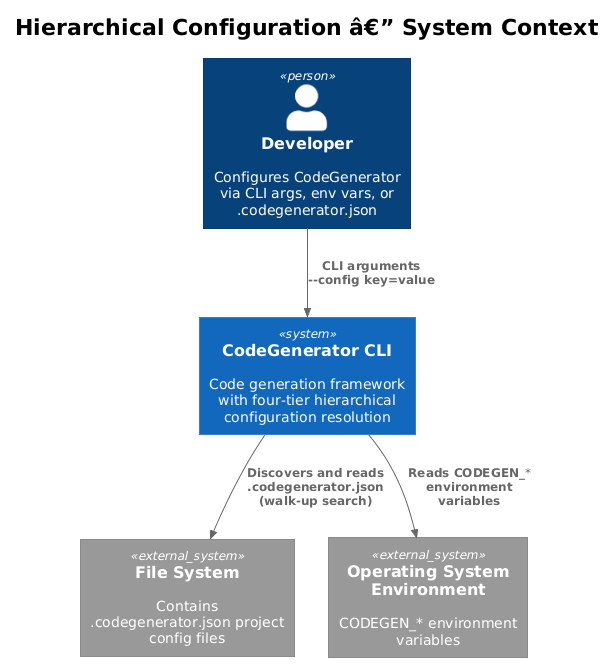
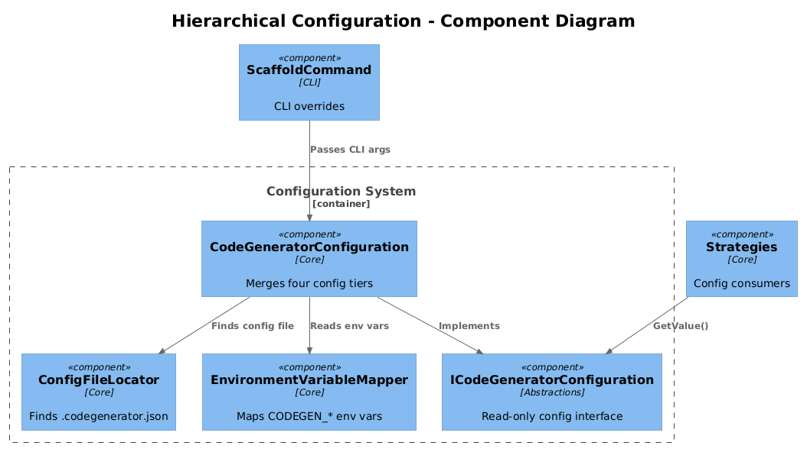
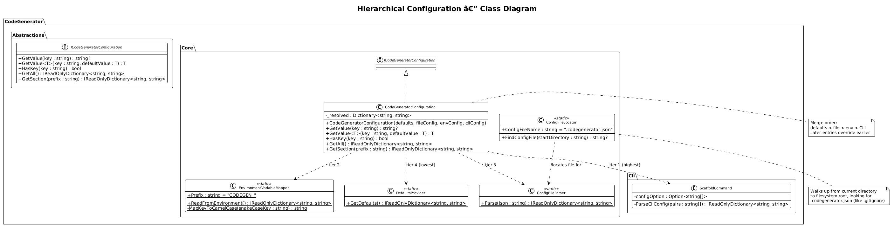
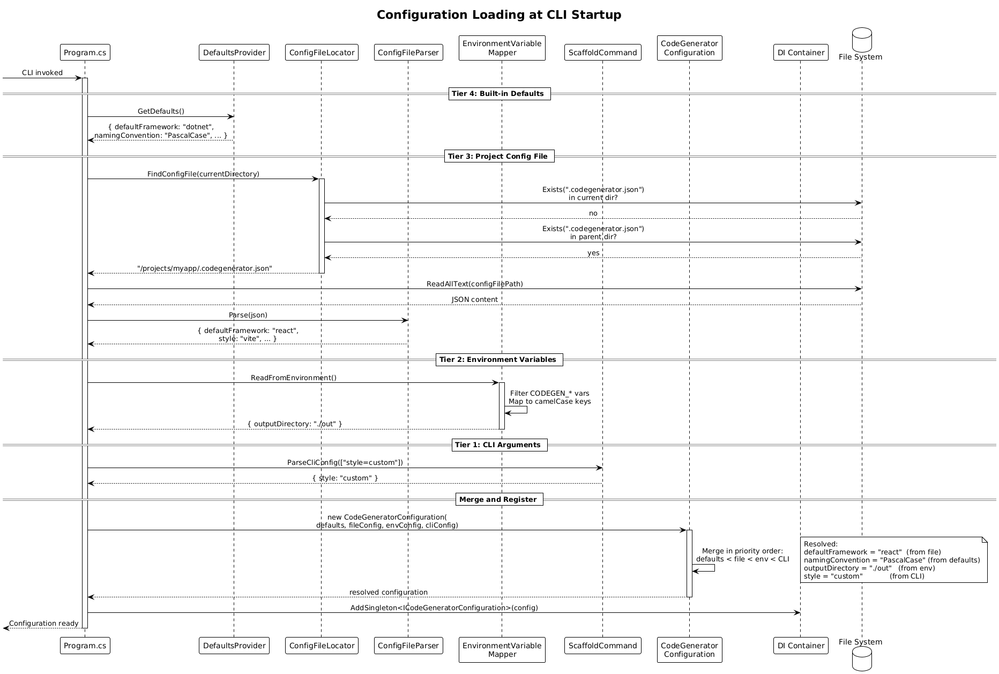
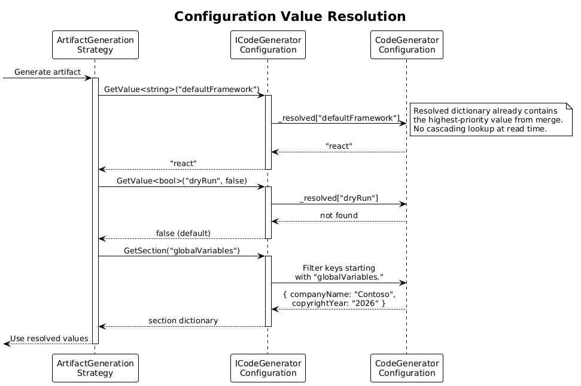
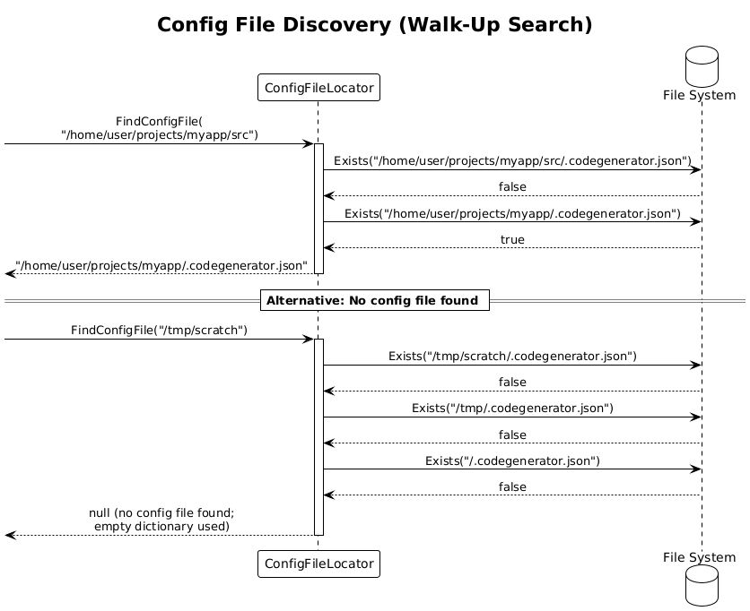

# Hierarchical Configuration -- Detailed Design

**Status:** Implemented
**Pattern source:** [Pattern 11 -- Hierarchical Configuration](../../xregistry-codegen-patterns.md#pattern-11-hierarchical-configuration-cli--env--file--defaults)

## 1. Overview

Introduces a four-tier priority-based configuration resolution system for CodeGenerator. Settings are resolved from multiple sources with a clear precedence order:

```
1. CLI arguments        (highest priority)
2. Environment variables (CODEGEN_*)
3. Project config file   (.codegenerator.json)
4. Built-in defaults     (lowest priority)
```

Higher-priority sources override lower-priority ones on a per-key basis. The resolved configuration is available throughout the application via `ICodeGeneratorConfiguration`, registered as a singleton in DI.

**Actors:** Developer -- configures generation preferences via CLI flags, environment variables, or a `.codegenerator.json` file.

**Scope:** Configuration loading, merging, and DI registration. This design covers the `ICodeGeneratorConfiguration` interface in Abstractions, the `CodeGeneratorConfiguration` implementation in Core, config file discovery, environment variable mapping, and CLI integration.

## 2. Architecture

### 2.1 C4 Context Diagram

Shows the hierarchical configuration system in the broader CodeGenerator ecosystem.



The developer can set configuration via CLI arguments, environment variables, or a `.codegenerator.json` file. The configuration system merges all sources and provides a unified view to the generation engine.

### 2.2 C4 Component Diagram

Shows the internal components involved in configuration resolution.



| Component | Responsibility |
|-----------|----------------|
| `ICodeGeneratorConfiguration` | Read-only interface exposing resolved configuration values |
| `CodeGeneratorConfiguration` | Merges four tiers of configuration into a single resolved dictionary |
| `ConfigFileLocator` | Walks up from the current directory to find `.codegenerator.json` |
| `EnvironmentVariableMapper` | Maps `CODEGEN_*` environment variables to configuration keys |
| `DefaultsProvider` | Supplies built-in default values for all known configuration keys |

### 2.3 Class Diagram



## 3. Component Details

### 3.1 ICodeGeneratorConfiguration (Abstractions)

Defined in `CodeGenerator.Abstractions` to keep the dependency lightweight.

**File:** `src/CodeGenerator.Abstractions/Configuration/ICodeGeneratorConfiguration.cs`

```csharp
namespace CodeGenerator.Core.Configuration;

public interface ICodeGeneratorConfiguration
{
    string? GetValue(string key);
    T GetValue<T>(string key, T defaultValue = default);
    bool HasKey(string key);
    IReadOnlyDictionary<string, string> GetAll();
    IReadOnlyDictionary<string, string> GetSection(string prefix);
}
```

### 3.2 CodeGeneratorConfiguration (Core)

**File:** `src/CodeGenerator.Core/Configuration/CodeGeneratorConfiguration.cs`

```csharp
namespace CodeGenerator.Core.Configuration;

public class CodeGeneratorConfiguration : ICodeGeneratorConfiguration
{
    private readonly Dictionary<string, string> _resolved = new(StringComparer.OrdinalIgnoreCase);

    public CodeGeneratorConfiguration(
        IReadOnlyDictionary<string, string> defaults,
        IReadOnlyDictionary<string, string> fileConfig,
        IReadOnlyDictionary<string, string> envConfig,
        IReadOnlyDictionary<string, string> cliConfig)
    {
        // Merge in priority order: defaults < file < env < CLI
        foreach (var kvp in defaults) _resolved[kvp.Key] = kvp.Value;
        foreach (var kvp in fileConfig) _resolved[kvp.Key] = kvp.Value;
        foreach (var kvp in envConfig) _resolved[kvp.Key] = kvp.Value;
        foreach (var kvp in cliConfig) _resolved[kvp.Key] = kvp.Value;
    }

    public string? GetValue(string key)
        => _resolved.TryGetValue(key, out var value) ? value : null;

    public T GetValue<T>(string key, T defaultValue = default)
    {
        if (!_resolved.TryGetValue(key, out var raw)) return defaultValue;
        return (T)Convert.ChangeType(raw, typeof(T));
    }

    public bool HasKey(string key) => _resolved.ContainsKey(key);

    public IReadOnlyDictionary<string, string> GetAll() => _resolved;

    public IReadOnlyDictionary<string, string> GetSection(string prefix)
        => _resolved
            .Where(kvp => kvp.Key.StartsWith(prefix + ".", StringComparison.OrdinalIgnoreCase))
            .ToDictionary(
                kvp => kvp.Key[(prefix.Length + 1)..],
                kvp => kvp.Value,
                StringComparer.OrdinalIgnoreCase);
}
```

### 3.3 ConfigFileLocator

**File:** `src/CodeGenerator.Core/Configuration/ConfigFileLocator.cs`

Walks up from the current directory to find `.codegenerator.json`, similar to how Git discovers `.gitignore`.

```csharp
namespace CodeGenerator.Core.Configuration;

public static class ConfigFileLocator
{
    public const string ConfigFileName = ".codegenerator.json";

    public static string? FindConfigFile(string startDirectory)
    {
        var dir = new DirectoryInfo(startDirectory);
        while (dir != null)
        {
            var candidate = Path.Combine(dir.FullName, ConfigFileName);
            if (File.Exists(candidate))
                return candidate;
            dir = dir.Parent;
        }
        return null;
    }
}
```

### 3.4 EnvironmentVariableMapper

**File:** `src/CodeGenerator.Core/Configuration/EnvironmentVariableMapper.cs`

Maps environment variables with the `CODEGEN_` prefix to configuration keys using the convention `CODEGEN_SOME_KEY` -> `someKey` (camelCase).

```csharp
namespace CodeGenerator.Core.Configuration;

public static class EnvironmentVariableMapper
{
    public const string Prefix = "CODEGEN_";

    public static IReadOnlyDictionary<string, string> ReadFromEnvironment()
    {
        var result = new Dictionary<string, string>(StringComparer.OrdinalIgnoreCase);
        foreach (DictionaryEntry entry in Environment.GetEnvironmentVariables())
        {
            var key = entry.Key?.ToString();
            if (key != null && key.StartsWith(Prefix, StringComparison.OrdinalIgnoreCase))
            {
                var configKey = MapKeyToCamelCase(key[Prefix.Length..]);
                result[configKey] = entry.Value?.ToString() ?? string.Empty;
            }
        }
        return result;
    }

    private static string MapKeyToCamelCase(string snakeCaseKey)
    {
        // SOME_KEY -> someKey
        var parts = snakeCaseKey.Split('_', StringSplitOptions.RemoveEmptyEntries);
        if (parts.Length == 0) return string.Empty;
        return parts[0].ToLowerInvariant()
            + string.Concat(parts.Skip(1).Select(p =>
                char.ToUpperInvariant(p[0]) + p[1..].ToLowerInvariant()));
    }
}
```

### 3.5 DefaultsProvider

**File:** `src/CodeGenerator.Core/Configuration/DefaultsProvider.cs`

```csharp
namespace CodeGenerator.Core.Configuration;

public static class DefaultsProvider
{
    public static IReadOnlyDictionary<string, string> GetDefaults() => new Dictionary<string, string>(StringComparer.OrdinalIgnoreCase)
    {
        ["defaultFramework"] = "dotnet",
        ["namingConvention"] = "PascalCase",
        ["outputDirectory"] = ".",
        ["style"] = "default",
        ["templateEngine"] = "liquid",
        ["dryRun"] = "false",
        ["force"] = "false",
        ["verbosity"] = "normal",
    };
}
```

### 3.6 `.codegenerator.json` Schema

The project config file uses the following JSON schema:

```json
{
  "$schema": "https://json-schema.org/draft/2020-12/schema",
  "$id": "codegenerator-config",
  "title": "CodeGenerator Configuration",
  "type": "object",
  "properties": {
    "defaultFramework": {
      "type": "string",
      "enum": ["dotnet", "python", "react", "angular", "flask", "reactnative", "playwright", "detox"],
      "description": "Default target framework when not specified per-project"
    },
    "namingConvention": {
      "type": "string",
      "enum": ["PascalCase", "camelCase", "snake_case", "kebab-case"],
      "description": "Default naming convention for generated identifiers"
    },
    "outputDirectory": {
      "type": "string",
      "description": "Default output directory relative to config file location"
    },
    "style": {
      "type": "string",
      "description": "Template style to use (maps to template directory under language/style hierarchy)"
    },
    "globalVariables": {
      "type": "object",
      "additionalProperties": { "type": "string" },
      "description": "Key-value pairs injected into all template contexts"
    },
    "verbosity": {
      "type": "string",
      "enum": ["quiet", "normal", "verbose"],
      "description": "Logging verbosity level"
    }
  },
  "additionalProperties": false
}
```

**Example `.codegenerator.json`:**

```json
{
  "defaultFramework": "dotnet",
  "namingConvention": "PascalCase",
  "outputDirectory": "./generated",
  "style": "clean-architecture",
  "globalVariables": {
    "companyName": "Contoso",
    "copyrightYear": "2026"
  }
}
```

### 3.7 Environment Variable Mapping

| Environment Variable | Config Key | Example Value |
|---------------------|------------|---------------|
| `CODEGEN_DEFAULT_FRAMEWORK` | `defaultFramework` | `dotnet` |
| `CODEGEN_NAMING_CONVENTION` | `namingConvention` | `PascalCase` |
| `CODEGEN_OUTPUT_DIRECTORY` | `outputDirectory` | `./generated` |
| `CODEGEN_STYLE` | `style` | `clean-architecture` |
| `CODEGEN_VERBOSITY` | `verbosity` | `verbose` |
| `CODEGEN_DRY_RUN` | `dryRun` | `true` |

### 3.8 CLI Integration

A `--config` option is added to CLI commands that accepts `key=value` pairs:

```bash
codegen scaffold -c ./scaffold.yaml --config defaultFramework=react --config style=vite
```

**Implementation in `ScaffoldCommand`:**

```csharp
var configOption = new Option<string[]>(
    aliases: ["--config", "-C"],
    description: "Override configuration values (key=value)")
{
    AllowMultipleArgumentsPerToken = true,
};

// Parse key=value pairs into dictionary
private static IReadOnlyDictionary<string, string> ParseCliConfig(string[] pairs)
{
    var result = new Dictionary<string, string>(StringComparer.OrdinalIgnoreCase);
    foreach (var pair in pairs ?? [])
    {
        var eqIndex = pair.IndexOf('=');
        if (eqIndex > 0)
        {
            result[pair[..eqIndex].Trim()] = pair[(eqIndex + 1)..].Trim();
        }
    }
    return result;
}
```

### 3.9 DI Registration

**File:** `src/CodeGenerator.Cli/Program.cs` (modified)

```csharp
// Load configuration from all four tiers
var defaults = DefaultsProvider.GetDefaults();
var configFilePath = ConfigFileLocator.FindConfigFile(Directory.GetCurrentDirectory());
var fileConfig = configFilePath != null
    ? ConfigFileParser.Parse(File.ReadAllText(configFilePath))
    : new Dictionary<string, string>();
var envConfig = EnvironmentVariableMapper.ReadFromEnvironment();
// CLI config is injected later after argument parsing

services.AddSingleton<ICodeGeneratorConfiguration>(sp =>
    new CodeGeneratorConfiguration(defaults, fileConfig, envConfig, cliConfig));
```

### 3.10 ConfigFileParser

**File:** `src/CodeGenerator.Core/Configuration/ConfigFileParser.cs`

Parses `.codegenerator.json` into a flat key-value dictionary. Nested `globalVariables` are flattened with a dot separator.

```csharp
namespace CodeGenerator.Core.Configuration;

public static class ConfigFileParser
{
    public static IReadOnlyDictionary<string, string> Parse(string json)
    {
        var result = new Dictionary<string, string>(StringComparer.OrdinalIgnoreCase);
        using var doc = JsonDocument.Parse(json);

        foreach (var property in doc.RootElement.EnumerateObject())
        {
            if (property.Value.ValueKind == JsonValueKind.Object)
            {
                // Flatten nested objects: globalVariables.companyName
                foreach (var nested in property.Value.EnumerateObject())
                {
                    result[$"{property.Name}.{nested.Name}"] = nested.Value.ToString();
                }
            }
            else
            {
                result[property.Name] = property.Value.ToString();
            }
        }

        return result;
    }
}
```

## 4. Data Model

### 4.1 Class Diagram


### 4.2 Entity Descriptions

| Class | Responsibility |
|-------|---------------|
| `ICodeGeneratorConfiguration` | Read-only interface for accessing resolved configuration values |
| `CodeGeneratorConfiguration` | Merges four configuration tiers into a single resolved dictionary |
| `ConfigFileLocator` | Walks directory tree upward to find `.codegenerator.json` |
| `ConfigFileParser` | Parses `.codegenerator.json` JSON into flat key-value dictionary |
| `EnvironmentVariableMapper` | Reads `CODEGEN_*` environment variables and maps to camelCase keys |
| `DefaultsProvider` | Supplies built-in default values for all known configuration keys |

### 4.3 Relationships

- `CodeGeneratorConfiguration` receives dictionaries from `DefaultsProvider`, `ConfigFileParser`, `EnvironmentVariableMapper`, and CLI parsing
- `CodeGeneratorConfiguration` implements `ICodeGeneratorConfiguration`
- `ConfigFileLocator` is used at startup to find the config file path
- `ConfigFileParser` parses the JSON content located by `ConfigFileLocator`
- All generation strategies and services depend on `ICodeGeneratorConfiguration` via DI

## 5. Key Workflows

### 5.1 Configuration Loading at Startup

When the CLI is invoked:



**Step-by-step:**

1. **Load defaults** -- `DefaultsProvider.GetDefaults()` returns the built-in default dictionary.
2. **Find config file** -- `ConfigFileLocator.FindConfigFile(currentDirectory)` walks up the directory tree looking for `.codegenerator.json`.
3. **Parse config file** -- If found, `ConfigFileParser.Parse(json)` reads and flattens the JSON content into a key-value dictionary. If not found, an empty dictionary is used.
4. **Read environment** -- `EnvironmentVariableMapper.ReadFromEnvironment()` reads all `CODEGEN_*` variables and maps them to camelCase keys.
5. **Parse CLI args** -- The command handler parses `--config key=value` pairs into a dictionary.
6. **Merge and register** -- `CodeGeneratorConfiguration` is constructed with all four dictionaries, merging in priority order (defaults < file < env < CLI). Registered as a singleton in the DI container.

### 5.2 Configuration Value Resolution

When a component requests a configuration value:



**Step-by-step:**

1. **Component calls** `configuration.GetValue<string>("defaultFramework")`.
2. **Lookup** -- `CodeGeneratorConfiguration` checks the merged `_resolved` dictionary.
3. **Return** -- Returns the value from the highest-priority source that set it. For example, if the CLI set `defaultFramework=react`, that wins over the `.codegenerator.json` value of `dotnet`.

### 5.3 Config File Discovery (Walk-Up)



**Step-by-step:**

1. **Start** at `currentDirectory` (e.g., `/home/user/projects/myapp/src`).
2. **Check** for `.codegenerator.json` in `/home/user/projects/myapp/src` -- not found.
3. **Walk up** to `/home/user/projects/myapp` -- found `.codegenerator.json`.
4. **Return** the full path `/home/user/projects/myapp/.codegenerator.json`.

If no config file is found up to the filesystem root, return `null` and use an empty dictionary.

## 6. Integration with Existing Systems

### 6.1 Relationship to Existing IConfiguration

CodeGenerator currently uses `Microsoft.Extensions.Configuration.IConfiguration` built from `ConfigurationBuilder().AddEnvironmentVariables()` in `Program.cs`. The new `ICodeGeneratorConfiguration` is a separate, domain-specific interface that does not replace `IConfiguration`. Both can coexist:

- `IConfiguration` continues to handle .NET-standard settings (logging, host configuration)
- `ICodeGeneratorConfiguration` handles CodeGenerator-specific generation settings with the four-tier priority model

### 6.2 Template Context Injection

`ICodeGeneratorConfiguration.GetSection("globalVariables")` returns all global variables, which can be injected into the DotLiquid template context:

```csharp
// In template rendering code
var globals = _configuration.GetSection("globalVariables");
foreach (var kvp in globals)
{
    templateContext[kvp.Key] = kvp.Value;
}
```

### 6.3 Relationship to DD-37 (Input Validation)

The `.codegenerator.json` file can be validated against its JSON Schema (defined in DD-37) before parsing. This is optional and activated by the `--validate` flag.

## 7. Error Handling

| Scenario | Behaviour |
|----------|-----------|
| `.codegenerator.json` not found | Empty file config dictionary; defaults and env/CLI still apply |
| `.codegenerator.json` contains invalid JSON | `ConfigFileParser` throws `JsonException`; CLI reports error and exits |
| Unknown key in `.codegenerator.json` | Ignored (stored but no built-in consumer); warning logged |
| `CODEGEN_*` variable with empty value | Stored as empty string; overrides lower-priority sources |
| `--config` with malformed `key=value` | Pair is skipped; warning logged |
| Type conversion failure in `GetValue<T>` | `InvalidCastException` thrown; caller should use try/catch or provide default |
