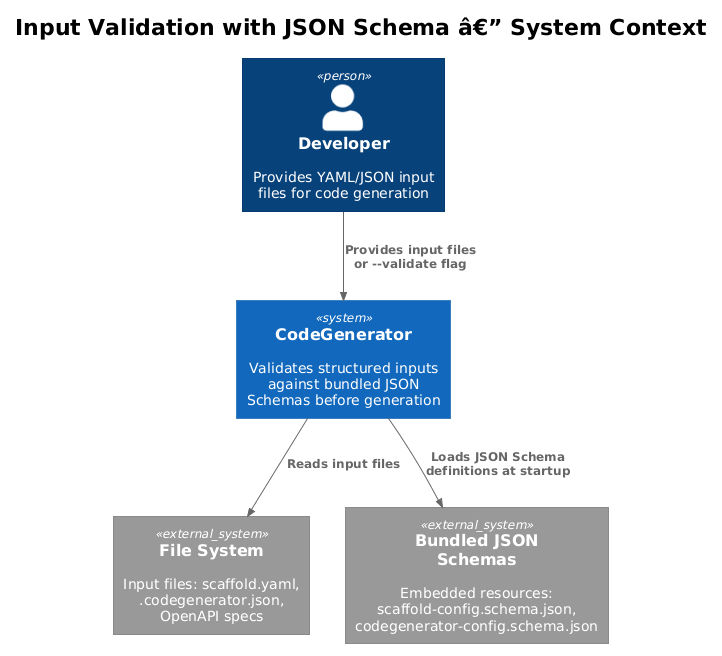
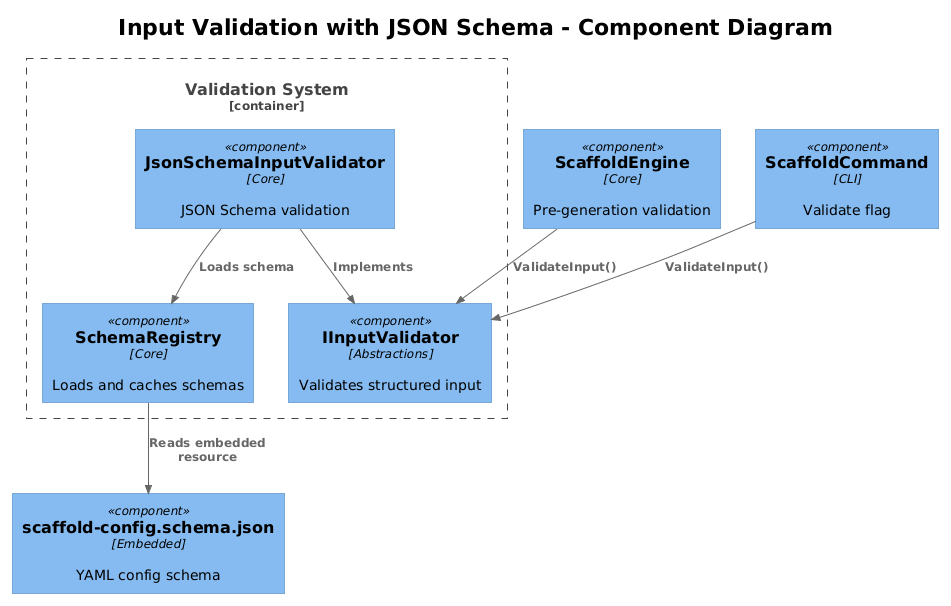
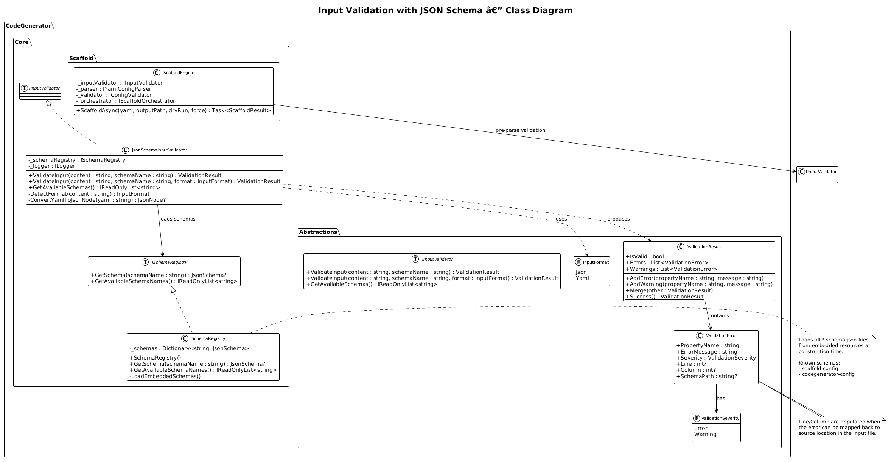
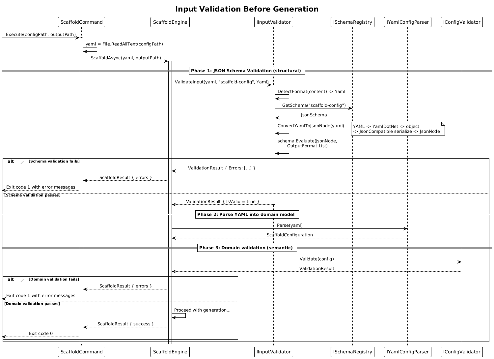
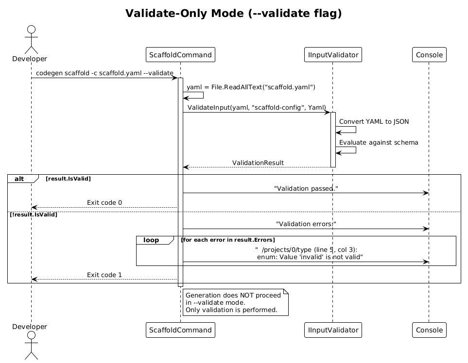
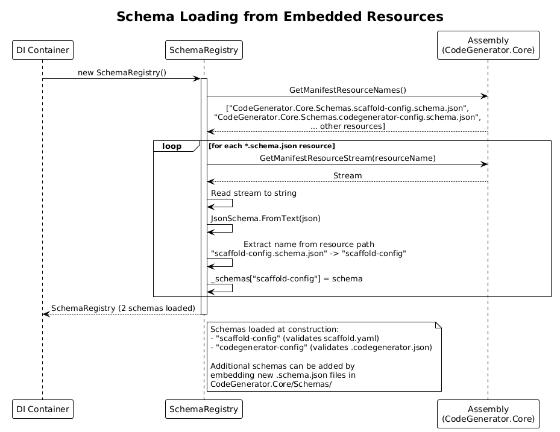

# Input Validation with JSON Schema -- Detailed Design

**Status:** Implemented
**Depends on:** [DD-22 YAML Configuration Schema](../22-yaml-configuration-schema/README.md), [DD-36 Hierarchical Configuration](../36-hierarchical-configuration/README.md)
**Pattern source:** [Pattern 12 -- Input Validation with JSON Schema](../../xregistry-codegen-patterns.md#pattern-12-input-validation-with-json-schema)

## 1. Overview

Validates structured input files (YAML scaffold configurations, `.codegenerator.json` project configs, OpenAPI specs) against bundled JSON Schema definitions before generation begins. Validation catches structural errors, missing required fields, and invalid values early, producing `ValidationResult` with line/column error locations.

**Actors:** Developer -- provides input files that are validated before the generation pipeline runs.

**Scope:** The `IInputValidator` interface in Abstractions, the `JsonSchemaInputValidator` implementation in Core, bundled JSON Schema files as embedded resources, and integration hooks in the scaffold engine and CLI `--validate` flag.

## 2. Architecture

### 2.1 C4 Context Diagram

Shows the input validation system in the broader CodeGenerator ecosystem.



The developer provides input files (YAML configs, JSON configs). The input validation system loads the appropriate JSON Schema, validates the input, and returns structured errors/warnings before generation proceeds.

### 2.2 C4 Component Diagram

Shows the internal components involved in JSON Schema validation.



| Component | Responsibility |
|-----------|----------------|
| `IInputValidator` | Interface for validating input content against a named schema |
| `JsonSchemaInputValidator` | Implementation using JsonSchema.Net for validation |
| `SchemaRegistry` | Loads and caches bundled JSON Schema files from embedded resources |
| `ScaffoldEngine` | Pre-generation validation hook (existing, extended) |
| `ScaffoldCommand` | `--validate` flag triggers validation-only mode (existing, enhanced) |

### 2.3 Class Diagram



## 3. Component Details

### 3.1 IInputValidator (Abstractions)

**File:** `src/CodeGenerator.Abstractions/Validation/IInputValidator.cs`

```csharp
namespace CodeGenerator.Core.Validation;

public interface IInputValidator
{
    ValidationResult ValidateInput(string content, string schemaName);
    ValidationResult ValidateInput(string content, string schemaName, InputFormat format);
    IReadOnlyList<string> GetAvailableSchemas();
}

public enum InputFormat
{
    Json,
    Yaml,
}
```

The `schemaName` parameter identifies which bundled schema to validate against (e.g., `"scaffold-config"`, `"codegenerator-config"`).

### 3.2 JsonSchemaInputValidator (Core)

**File:** `src/CodeGenerator.Core/Validation/JsonSchemaInputValidator.cs`

```csharp
using System.Text.Json;
using System.Text.Json.Nodes;
using Json.Schema;

namespace CodeGenerator.Core.Validation;

public class JsonSchemaInputValidator : IInputValidator
{
    private readonly ISchemaRegistry _schemaRegistry;
    private readonly ILogger<JsonSchemaInputValidator> _logger;

    public JsonSchemaInputValidator(
        ISchemaRegistry schemaRegistry,
        ILogger<JsonSchemaInputValidator> logger)
    {
        _schemaRegistry = schemaRegistry;
        _logger = logger;
    }

    public ValidationResult ValidateInput(string content, string schemaName)
    {
        return ValidateInput(content, schemaName, DetectFormat(content));
    }

    public ValidationResult ValidateInput(string content, string schemaName, InputFormat format)
    {
        var result = new ValidationResult();

        // Load schema
        var schema = _schemaRegistry.GetSchema(schemaName);
        if (schema == null)
        {
            result.AddError("schema", $"Unknown schema: '{schemaName}'");
            return result;
        }

        // Convert YAML to JSON if needed
        JsonNode? jsonNode;
        try
        {
            jsonNode = format == InputFormat.Yaml
                ? ConvertYamlToJsonNode(content)
                : JsonNode.Parse(content);
        }
        catch (Exception ex)
        {
            result.AddError("input", $"Failed to parse input: {ex.Message}");
            return result;
        }

        // Validate against schema
        var evaluationOptions = new EvaluationOptions
        {
            OutputFormat = OutputFormat.List,
        };

        var evaluation = schema.Evaluate(jsonNode, evaluationOptions);

        if (!evaluation.IsValid)
        {
            foreach (var detail in evaluation.Details)
            {
                if (!detail.IsValid && detail.Errors != null)
                {
                    foreach (var error in detail.Errors)
                    {
                        var path = detail.InstanceLocation?.ToString() ?? "unknown";
                        result.AddError(path, $"{error.Key}: {error.Value}");
                    }
                }
            }
        }

        return result;
    }

    public IReadOnlyList<string> GetAvailableSchemas()
        => _schemaRegistry.GetAvailableSchemaNames();

    private static InputFormat DetectFormat(string content)
    {
        var trimmed = content.TrimStart();
        return trimmed.StartsWith('{') || trimmed.StartsWith('[')
            ? InputFormat.Json
            : InputFormat.Yaml;
    }

    private static JsonNode? ConvertYamlToJsonNode(string yaml)
    {
        // Use YamlDotNet to deserialize YAML, then serialize to JSON
        var deserializer = new YamlDotNet.Serialization.DeserializerBuilder().Build();
        var yamlObject = deserializer.Deserialize<object>(yaml);
        var serializer = new YamlDotNet.Serialization.SerializerBuilder()
            .JsonCompatible()
            .Build();
        var json = serializer.Serialize(yamlObject);
        return JsonNode.Parse(json);
    }
}
```

### 3.3 ISchemaRegistry / SchemaRegistry

**File:** `src/CodeGenerator.Core/Validation/ISchemaRegistry.cs`

```csharp
namespace CodeGenerator.Core.Validation;

public interface ISchemaRegistry
{
    JsonSchema? GetSchema(string schemaName);
    IReadOnlyList<string> GetAvailableSchemaNames();
}
```

**File:** `src/CodeGenerator.Core/Validation/SchemaRegistry.cs`

```csharp
using System.Reflection;
using System.Text.Json;
using Json.Schema;

namespace CodeGenerator.Core.Validation;

public class SchemaRegistry : ISchemaRegistry
{
    private readonly Dictionary<string, JsonSchema> _schemas = new(StringComparer.OrdinalIgnoreCase);

    public SchemaRegistry()
    {
        LoadEmbeddedSchemas();
    }

    public JsonSchema? GetSchema(string schemaName)
        => _schemas.TryGetValue(schemaName, out var schema) ? schema : null;

    public IReadOnlyList<string> GetAvailableSchemaNames()
        => _schemas.Keys.ToList();

    private void LoadEmbeddedSchemas()
    {
        var assembly = Assembly.GetExecutingAssembly();
        var prefix = "CodeGenerator.Core.Schemas.";

        foreach (var resourceName in assembly.GetManifestResourceNames())
        {
            if (!resourceName.StartsWith(prefix) || !resourceName.EndsWith(".schema.json"))
                continue;

            using var stream = assembly.GetManifestResourceStream(resourceName);
            if (stream == null) continue;

            using var reader = new StreamReader(stream);
            var json = reader.ReadToEnd();
            var schema = JsonSchema.FromText(json);

            // Extract schema name: "CodeGenerator.Core.Schemas.scaffold-config.schema.json" -> "scaffold-config"
            var name = resourceName[prefix.Length..^".schema.json".Length];
            _schemas[name] = schema;
        }
    }
}
```

### 3.4 Bundled JSON Schema Files

Schemas are embedded resources in `CodeGenerator.Core`:

**File:** `src/CodeGenerator.Core/Schemas/scaffold-config.schema.json`

Validates the YAML scaffold configuration (from DD-22). Key validations:

| Property | Rule |
|----------|------|
| `name` | Required, non-empty string |
| `projects` | Required, non-empty array |
| `projects[].name` | Required string |
| `projects[].type` | Required, enum of known project types |
| `projects[].path` | Required string |
| `entities[].name` | Required string |
| `entities[].properties` | Required, non-empty array |
| `architecture` | Optional, enum of known patterns |

**File:** `src/CodeGenerator.Core/Schemas/codegenerator-config.schema.json`

Validates the `.codegenerator.json` project config file (from DD-36). Key validations:

| Property | Rule |
|----------|------|
| `defaultFramework` | Optional, enum of known frameworks |
| `namingConvention` | Optional, enum: PascalCase, camelCase, snake_case, kebab-case |
| `outputDirectory` | Optional, string |
| `style` | Optional, string |
| `globalVariables` | Optional, object with string values only |
| `verbosity` | Optional, enum: quiet, normal, verbose |

### 3.5 Extended ValidationResult with Line/Column Locations

The existing `ValidationResult` and `ValidationError` classes in `CodeGenerator.Abstractions.Validation` are extended:

**File:** `src/CodeGenerator.Abstractions/Validation/ValidationError.cs` (extended)

```csharp
namespace CodeGenerator.Core.Validation;

public class ValidationError
{
    public string PropertyName { get; set; } = string.Empty;
    public string ErrorMessage { get; set; } = string.Empty;
    public ValidationSeverity Severity { get; set; }

    // New: line/column location for input validation errors
    public int? Line { get; set; }
    public int? Column { get; set; }
    public string? SchemaPath { get; set; }
}
```

The `Line` and `Column` fields are populated when the error can be mapped back to a source location in the input file. For JSON, this uses `JsonDocument` position tracking. For YAML, the YAML parser provides line/column information.

### 3.6 Integration with ScaffoldEngine

The existing `ScaffoldEngine` already has a validation step via `IConfigValidator`. JSON Schema validation is added as a pre-validation step:

**File:** `src/CodeGenerator.Core/Scaffold/Services/ScaffoldEngine.cs` (modified)

```csharp
public async Task<ScaffoldResult> ScaffoldAsync(
    string yaml, string outputPath, bool dryRun = false, bool force = false)
{
    var result = new ScaffoldResult();

    // NEW: JSON Schema validation before parsing
    var schemaValidation = _inputValidator.ValidateInput(yaml, "scaffold-config", InputFormat.Yaml);
    if (!schemaValidation.IsValid)
    {
        result.ValidationResult.Merge(schemaValidation);
        return result;
    }

    // Existing: parse and validate
    ScaffoldConfiguration config;
    try
    {
        config = _parser.Parse(yaml);
    }
    catch (ScaffoldParseException ex)
    {
        result.ValidationResult.AddError("yaml", ex.Message);
        return result;
    }

    var validationResult = _validator.Validate(config);
    // ... rest of existing code
}
```

### 3.7 CLI `--validate` Flag Enhancement

The existing `--validate` flag on `ScaffoldCommand` (from DD-21) is enhanced to use JSON Schema validation:

```csharp
if (validate)
{
    var yaml = File.ReadAllText(configPath);
    var result = inputValidator.ValidateInput(yaml, "scaffold-config", InputFormat.Yaml);

    if (result.IsValid)
    {
        console.WriteLine("Validation passed.");
    }
    else
    {
        console.WriteLine("Validation errors:");
        foreach (var error in result.Errors)
        {
            var location = error.Line.HasValue
                ? $" (line {error.Line}, col {error.Column})"
                : string.Empty;
            console.WriteLine($"  {error.PropertyName}{location}: {error.ErrorMessage}");
        }
    }
    return result.IsValid ? 0 : 1;
}
```

### 3.8 DI Registration

**File:** `src/CodeGenerator.Core/ServiceCollectionExtensions.cs` (modified)

```csharp
services.AddSingleton<ISchemaRegistry, SchemaRegistry>();
services.AddSingleton<IInputValidator, JsonSchemaInputValidator>();
```

## 4. Data Model

### 4.1 Class Diagram


### 4.2 Entity Descriptions

| Class | Responsibility |
|-------|---------------|
| `IInputValidator` | Interface for validating input content against a named JSON Schema |
| `JsonSchemaInputValidator` | Implementation using JsonSchema.Net; handles JSON and YAML inputs |
| `ISchemaRegistry` | Interface for loading and caching JSON Schema definitions |
| `SchemaRegistry` | Loads schemas from embedded resources at construction time |
| `ValidationResult` | Existing class; carries errors and warnings with optional line/column locations |
| `ValidationError` | Extended with `Line`, `Column`, `SchemaPath` fields |
| `InputFormat` | Enum: `Json`, `Yaml` |

### 4.3 Relationships

- `JsonSchemaInputValidator` depends on `ISchemaRegistry` to load schemas
- `JsonSchemaInputValidator` produces `ValidationResult` instances
- `SchemaRegistry` loads `JsonSchema` objects from embedded resources in `CodeGenerator.Core`
- `ScaffoldEngine` depends on `IInputValidator` for pre-parse validation
- `ScaffoldCommand` depends on `IInputValidator` for the `--validate` flag

## 5. Key Workflows

### 5.1 Input Validation Before Generation

When the developer runs `codegen scaffold -c ./scaffold.yaml`:



**Step-by-step:**

1. **Read input** -- CLI reads the YAML file content.
2. **Detect format** -- `JsonSchemaInputValidator.DetectFormat()` determines the input is YAML (does not start with `{` or `[`).
3. **Load schema** -- `SchemaRegistry.GetSchema("scaffold-config")` returns the cached `JsonSchema` for scaffold configurations.
4. **Convert YAML to JSON** -- `ConvertYamlToJsonNode()` uses YamlDotNet to parse the YAML and serialize to a `JsonNode`.
5. **Evaluate** -- `JsonSchema.Evaluate()` validates the JSON node against the schema with `OutputFormat.List` for detailed error reporting.
6. **Map errors** -- Each evaluation detail that is not valid is mapped to a `ValidationError` with `PropertyName` set to the JSON Pointer path (e.g., `/projects/0/type`).
7. **Return result** -- `ValidationResult` is returned. If valid, generation proceeds. If invalid, errors are reported and generation stops.

### 5.2 Validate-Only Mode (--validate flag)

When the developer runs `codegen scaffold -c ./scaffold.yaml --validate`:



**Step-by-step:**

1. **Parse CLI** -- `ScaffoldCommand` detects the `--validate` flag.
2. **Read file** -- Reads the YAML configuration file.
3. **Validate** -- Calls `IInputValidator.ValidateInput(yaml, "scaffold-config", InputFormat.Yaml)`.
4. **Report** -- Outputs validation results to the console with error locations.
5. **Exit** -- Returns exit code 0 (valid) or 1 (invalid). Generation does not proceed.

### 5.3 Schema Loading from Embedded Resources

When `SchemaRegistry` is constructed:



**Step-by-step:**

1. **Enumerate resources** -- `Assembly.GetExecutingAssembly().GetManifestResourceNames()` lists all embedded resources.
2. **Filter** -- Select resources matching `CodeGenerator.Core.Schemas.*.schema.json`.
3. **Load each schema** -- For each matching resource:
   - Read the stream content as a string.
   - Parse with `JsonSchema.FromText(json)`.
   - Extract the schema name from the resource name (e.g., `scaffold-config`).
   - Cache in the `_schemas` dictionary.
4. **Ready** -- All schemas are loaded and available via `GetSchema(name)`.

## 6. Integration with Existing Systems

### 6.1 Relationship to IConfigValidator

The existing `IConfigValidator` in `CodeGenerator.Core.Scaffold.Services` performs domain-level validation on a parsed `ScaffoldConfiguration` object (e.g., checking that referenced projects exist, architecture patterns are valid). JSON Schema validation is a complementary earlier step that catches structural errors before parsing even occurs.

```
Input file -> JSON Schema validation (structure) -> Parsing -> IConfigValidator (domain logic) -> Generation
```

### 6.2 Relationship to IValidatable

The existing `IValidatable` interface validates model objects after construction. `IInputValidator` validates raw input content before parsing into models. They operate at different layers:

| Layer | Interface | Validates |
|-------|-----------|-----------|
| Input | `IInputValidator` | Raw YAML/JSON content against JSON Schema |
| Model | `IConfigValidator` | Parsed `ScaffoldConfiguration` domain rules |
| Syntax | `IValidatable` | Code generation model objects (ClassModel, etc.) |

### 6.3 Relationship to DD-36 (Hierarchical Configuration)

The `.codegenerator.json` config file introduced in DD-36 can be validated against the `codegenerator-config` schema:

```csharp
var configJson = File.ReadAllText(configFilePath);
var result = inputValidator.ValidateInput(configJson, "codegenerator-config");
if (!result.IsValid)
{
    logger.LogWarning("Config file has validation warnings: {Errors}",
        string.Join("; ", result.Errors.Select(e => e.ErrorMessage)));
}
```

### 6.4 NuGet Dependency

This design uses `JsonSchema.Net` (by Greg Dennis) as the JSON Schema validation library:

```xml
<PackageReference Include="JsonSchema.Net" Version="7.*" />
```

`JsonSchema.Net` supports JSON Schema Draft 2020-12, is actively maintained, and uses `System.Text.Json` natively (no Newtonsoft.Json dependency).

## 7. Error Handling

| Scenario | Behaviour |
|----------|-----------|
| Unknown schema name | `ValidationResult` with error: "Unknown schema: '{name}'" |
| Malformed JSON input | `ValidationResult` with error: "Failed to parse input: {details}" |
| Malformed YAML input | `ValidationResult` with error from YamlDotNet parser |
| Schema validation fails | One `ValidationError` per schema violation with JSON Pointer path |
| Embedded schema resource missing | `SchemaRegistry` logs warning at construction; `GetSchema()` returns null |
| Extra properties in input (when `additionalProperties: false`) | Validation error listing the unexpected property |
| Missing required property | Validation error: "required: Property 'name' is required" with instance path |
