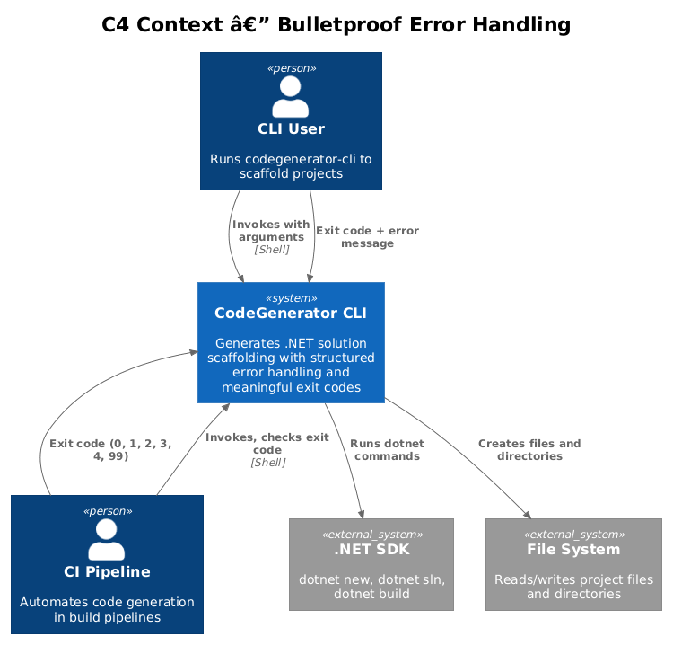
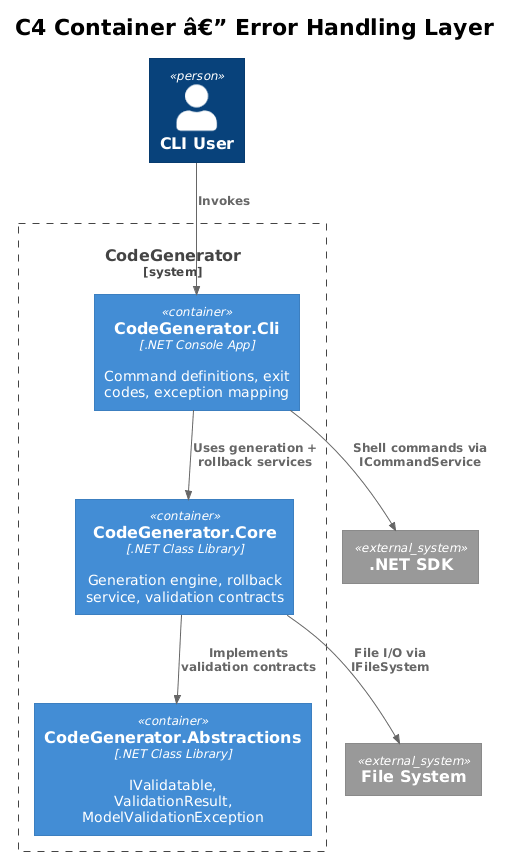
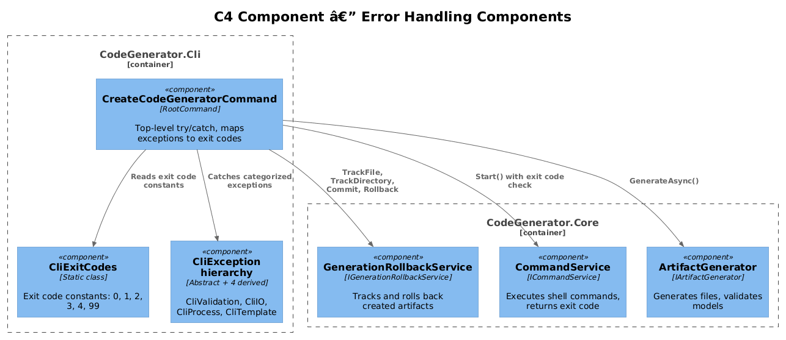
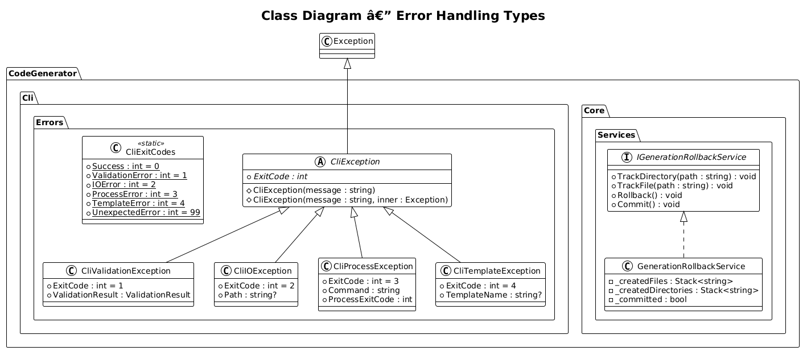
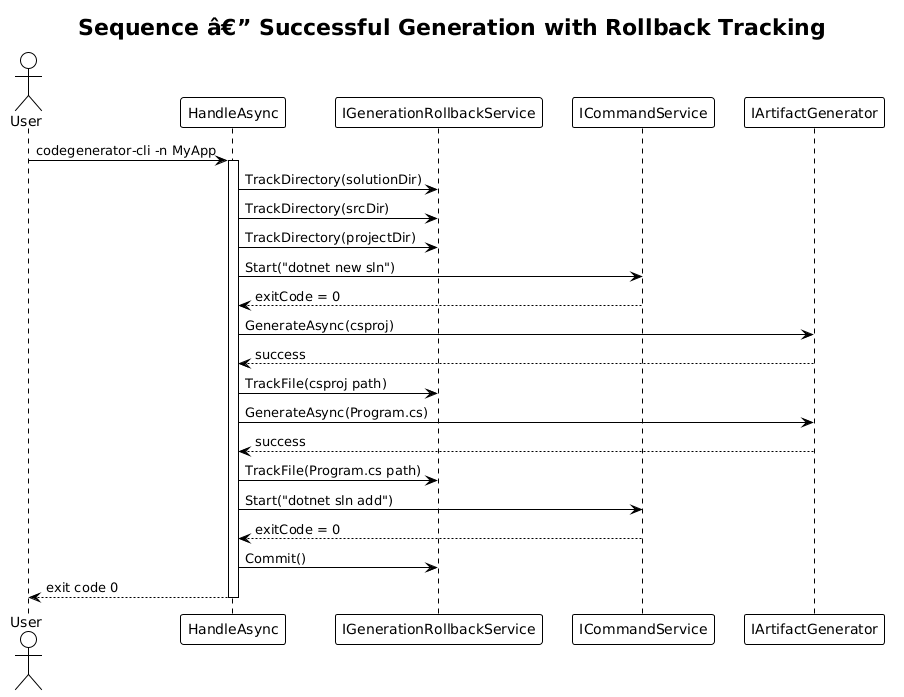
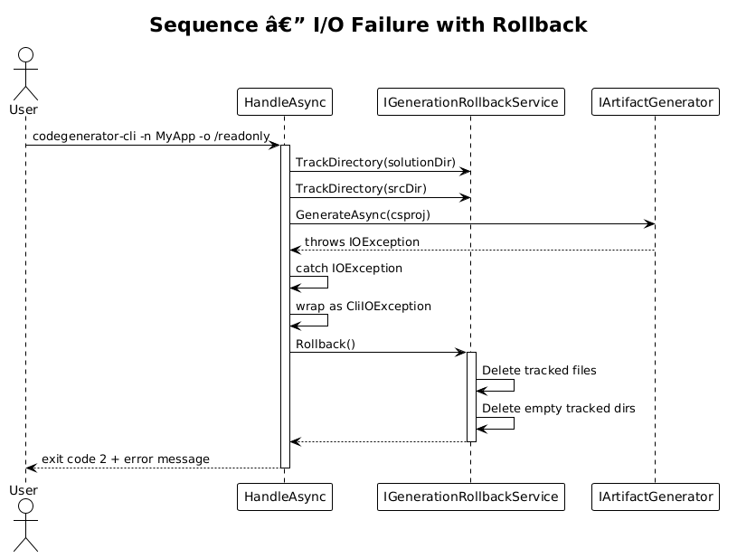
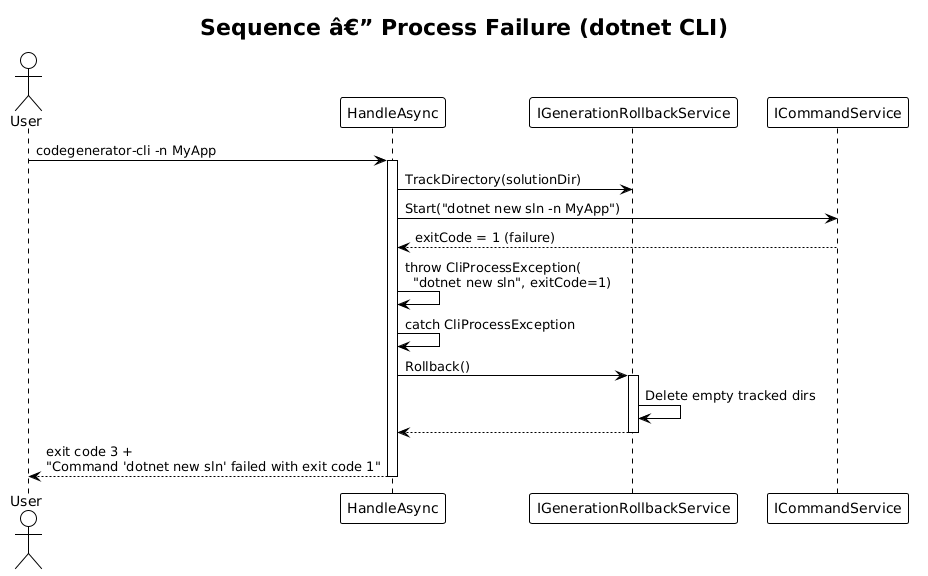

# Bulletproof Error Handling — Detailed Design

**Feature:** 38-bulletproof-error-handling (CLI Vision 1.1)
**Status:** Proposed
**Context:** The CLI currently has no structured error handling. Exceptions from file I/O, shell commands, and template rendering propagate as unhandled exceptions with raw stack traces, providing no useful feedback to users and leaving partially generated output on disk.

---

## 1. Overview

### Problem

- **No categorized errors:** All failures surface as generic exceptions with stack traces. Users cannot distinguish a permission error from a template syntax error.
- **No meaningful exit codes:** The CLI always exits with 0 (success) or 1 (unhandled exception). CI pipelines and scripts cannot react to specific failure categories.
- **No rollback:** When generation fails mid-way, partially created directories and files are left on disk. Users must manually clean up before retrying.
- **No pre-flight checks:** The CLI does not validate that the output directory is writable or that the solution name is valid before starting generation, wasting time on doomed runs.

### Goal

Wrap every file I/O, shell command, and generation step in structured error handling with categorized exceptions, meaningful exit codes, and automatic rollback of partial output on failure.

### Actors

| Actor | Description |
|-------|-------------|
| **CLI User** | Runs the `codegenerator-cli` command and expects clear error messages and clean exit codes |
| **CI Pipeline** | Invokes the CLI in automation; needs exit codes to branch on failure type |
| **Developer** | Extends the CLI with new commands; needs a consistent error handling pattern |

### Scope

- `CliExitCodes` static class with well-defined exit code constants
- `CliException` hierarchy: `CliValidationException`, `CliIOException`, `CliProcessException`, `CliTemplateException`
- `GenerationRollbackService` that tracks and rolls back created files/directories on failure
- Error handling middleware wrapping `HandleAsync`
- Integration with existing `ICommandService.Start()` return codes

### Out of Scope

- User-interactive prompts for overwrite confirmation (covered in a separate feature)
- Retry logic for transient I/O failures
- Telemetry or error reporting to external services

---

## 2. Architecture

### 2.1 C4 Context Diagram

Shows how the CLI user interacts with the tool and receives structured error feedback.



### 2.2 C4 Container Diagram

The error handling layer spans the CLI and Core packages, with the CLI defining exit codes and exception mapping, and Core providing the rollback service.



### 2.3 C4 Component Diagram

Internal error handling components and their relationships within the CLI and Core assemblies.



---

## 3. Component Details

### 3.1 CliExitCodes

**Location:** `CodeGenerator.Cli.Errors`

```csharp
public static class CliExitCodes
{
    public const int Success = 0;
    public const int ValidationError = 1;
    public const int IOError = 2;
    public const int ProcessError = 3;
    public const int TemplateError = 4;
    public const int UnexpectedError = 99;
}
```

Each constant maps to a specific failure category. Scripts and CI pipelines can switch on the exit code to determine the failure type without parsing stderr.

### 3.2 CliException Hierarchy

**Location:** `CodeGenerator.Cli.Errors`

```csharp
public abstract class CliException : Exception
{
    public abstract int ExitCode { get; }

    protected CliException(string message) : base(message) { }
    protected CliException(string message, Exception inner) : base(message, inner) { }
}

public class CliValidationException : CliException
{
    public override int ExitCode => CliExitCodes.ValidationError;
    public ValidationResult ValidationResult { get; }

    public CliValidationException(ValidationResult result)
        : base(FormatErrors(result))
    {
        ValidationResult = result;
    }

    private static string FormatErrors(ValidationResult result)
        => string.Join("; ", result.Errors.Select(e => $"{e.PropertyName}: {e.ErrorMessage}"));
}

public class CliIOException : CliException
{
    public override int ExitCode => CliExitCodes.IOError;
    public string? Path { get; }

    public CliIOException(string message, string? path = null, Exception? inner = null)
        : base(message, inner!)
    {
        Path = path;
    }
}

public class CliProcessException : CliException
{
    public override int ExitCode => CliExitCodes.ProcessError;
    public string Command { get; }
    public int ProcessExitCode { get; }

    public CliProcessException(string command, int processExitCode)
        : base($"Command '{command}' failed with exit code {processExitCode}")
    {
        Command = command;
        ProcessExitCode = processExitCode;
    }
}

public class CliTemplateException : CliException
{
    public override int ExitCode => CliExitCodes.TemplateError;
    public string? TemplateName { get; }

    public CliTemplateException(string message, string? templateName = null, Exception? inner = null)
        : base(message, inner!)
    {
        TemplateName = templateName;
    }
}
```

**Design rationale:** Each exception carries its own `ExitCode`, so the top-level handler simply reads `ex.ExitCode` rather than using a type-switch. The `CliException` base class is abstract, forcing all categorized errors to declare a category.

### 3.3 GenerationRollbackService

**Location:** `CodeGenerator.Core.Services`

```csharp
public interface IGenerationRollbackService
{
    void TrackDirectory(string path);
    void TrackFile(string path);
    void Rollback();
    void Commit();
}

public class GenerationRollbackService : IGenerationRollbackService
{
    private readonly Stack<string> _createdFiles = new();
    private readonly Stack<string> _createdDirectories = new();
    private readonly IFileSystem _fileSystem;
    private readonly ILogger<GenerationRollbackService> _logger;
    private bool _committed;

    public GenerationRollbackService(IFileSystem fileSystem, ILogger<GenerationRollbackService> logger)
    {
        _fileSystem = fileSystem;
        _logger = logger;
    }

    public void TrackDirectory(string path)
    {
        _createdDirectories.Push(path);
    }

    public void TrackFile(string path)
    {
        _createdFiles.Push(path);
    }

    public void Rollback()
    {
        if (_committed) return;

        foreach (var file in _createdFiles)
        {
            if (_fileSystem.File.Exists(file))
            {
                _fileSystem.File.Delete(file);
                _logger.LogDebug("Rolled back file: {Path}", file);
            }
        }

        // Delete directories in reverse creation order (deepest first)
        foreach (var dir in _createdDirectories)
        {
            if (_fileSystem.Directory.Exists(dir) && !_fileSystem.Directory.EnumerateFileSystemEntries(dir).Any())
            {
                _fileSystem.Directory.Delete(dir);
                _logger.LogDebug("Rolled back directory: {Path}", dir);
            }
        }
    }

    public void Commit()
    {
        _committed = true;
        _createdFiles.Clear();
        _createdDirectories.Clear();
    }
}
```

**Key behaviors:**
- Files are deleted first, then directories (in reverse creation order via `Stack<T>`).
- Directories are only deleted if empty, preventing accidental deletion of pre-existing content.
- `Commit()` clears the tracking lists, signaling that generation completed successfully.
- The service uses `IFileSystem` for testability.

### 3.4 Error Handling in HandleAsync

**Location:** `CodeGenerator.Cli.Commands.CreateCodeGeneratorCommand`

The existing `HandleAsync` method is wrapped in a try/catch that maps exceptions to exit codes:

```csharp
private async Task<int> HandleAsync(string name, string outputDirectory, string framework, bool slnx, string? localSourceRoot)
{
    var logger = _serviceProvider.GetRequiredService<ILogger<CreateCodeGeneratorCommand>>();
    var rollback = _serviceProvider.GetRequiredService<IGenerationRollbackService>();

    try
    {
        // Pre-flight validation (Feature 39)
        // ... generation steps, each wrapped with rollback tracking ...

        rollback.Commit();
        return CliExitCodes.Success;
    }
    catch (CliException ex)
    {
        logger.LogError("{Message}", ex.Message);
        rollback.Rollback();
        return ex.ExitCode;
    }
    catch (ModelValidationException ex)
    {
        logger.LogError("Model validation failed: {Message}", ex.Message);
        rollback.Rollback();
        return CliExitCodes.ValidationError;
    }
    catch (IOException ex)
    {
        logger.LogError("I/O error: {Message}", ex.Message);
        rollback.Rollback();
        return CliExitCodes.IOError;
    }
    catch (Exception ex)
    {
        logger.LogError(ex, "Unexpected error");
        rollback.Rollback();
        return CliExitCodes.UnexpectedError;
    }
}
```

### 3.5 ICommandService Integration

The existing `CommandService.Start()` returns an `int` exit code but the caller (`HandleAsync`) ignores it. The design wraps these calls:

```csharp
private void RunCommand(ICommandService commandService, string arguments, string workingDirectory)
{
    var exitCode = commandService.Start(arguments, workingDirectory);
    if (exitCode != 0)
    {
        throw new CliProcessException(arguments, exitCode);
    }
}
```

This ensures that `dotnet new sln`, `dotnet sln add`, and similar commands that fail are caught immediately rather than allowing generation to continue with a broken solution.

---

## 4. Data Model

### Class Diagram



---

## 5. Key Workflows

### 5.1 Successful Generation



### 5.2 I/O Failure with Rollback



### 5.3 Process Failure (dotnet CLI)



---

## 6. Testing Strategy

| Test | Type | Description |
|------|------|-------------|
| `CliExitCodes_Constants_HaveExpectedValues` | Unit | Verify exit code constants match specification |
| `CliValidationException_ExitCode_ReturnsOne` | Unit | Each exception type returns correct exit code |
| `RollbackService_DeletesFiles_OnRollback` | Unit | Files tracked via `TrackFile` are deleted on `Rollback()` |
| `RollbackService_SkipsNonEmptyDirs_OnRollback` | Unit | Directories with pre-existing content are not deleted |
| `RollbackService_NoOp_AfterCommit` | Unit | `Rollback()` after `Commit()` does nothing |
| `HandleAsync_ReturnsIOError_WhenDirectoryNotWritable` | Integration | Verifies exit code 2 when output path is read-only |
| `HandleAsync_ReturnsProcessError_WhenDotnetFails` | Integration | Verifies exit code 3 when `dotnet new sln` fails |
| `HandleAsync_RollsBack_OnPartialFailure` | Integration | Verifies cleanup when generation fails mid-way |

---

## 7. Open Questions

| # | Question | Impact | Proposed Resolution |
|---|----------|--------|---------------------|
| 1 | Should rollback be opt-out via a `--no-rollback` flag for debugging? | Low | Add flag in a follow-up if users request it |
| 2 | Should `CliTemplateException` include the template source for debugging? | Medium | Include template name only; full source may contain sensitive data |
| 3 | Should exit code 4 (template) be merged with 1 (validation) since template errors are arguably input errors? | Low | Keep separate; they have different remediation paths |
| 4 | How should nested/recursive generation (e.g., `FullStackFactory`) integrate with rollback tracking? | High | Pass `IGenerationRollbackService` through `GenerationContext` so nested generators can track their artifacts |
