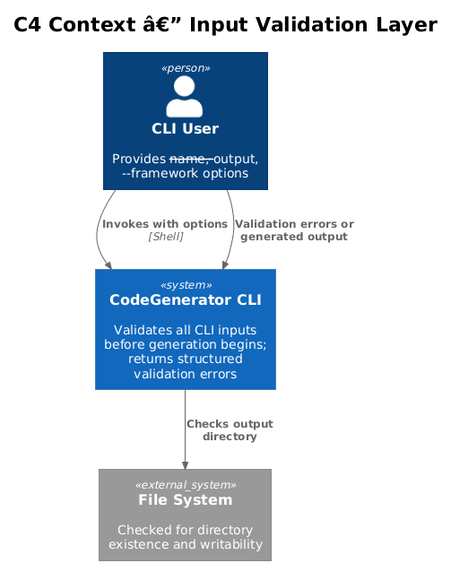
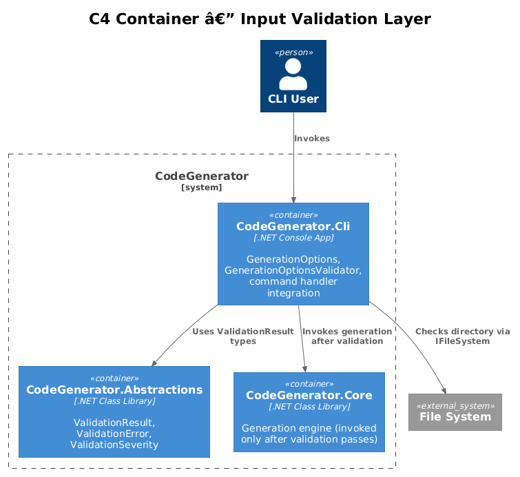
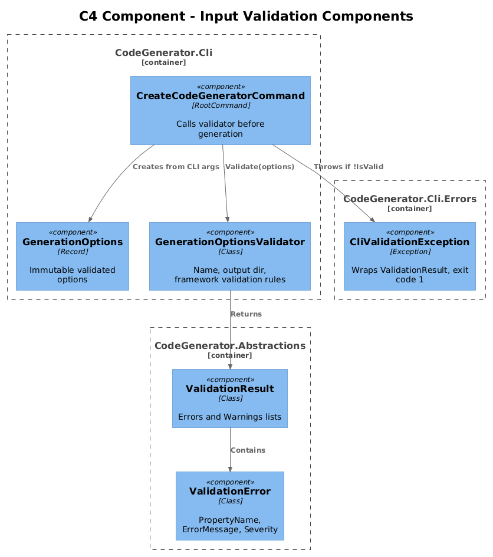
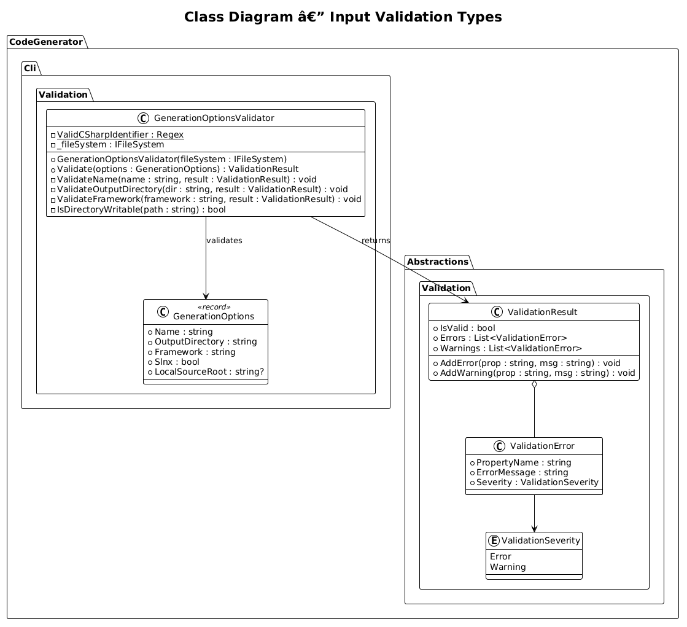
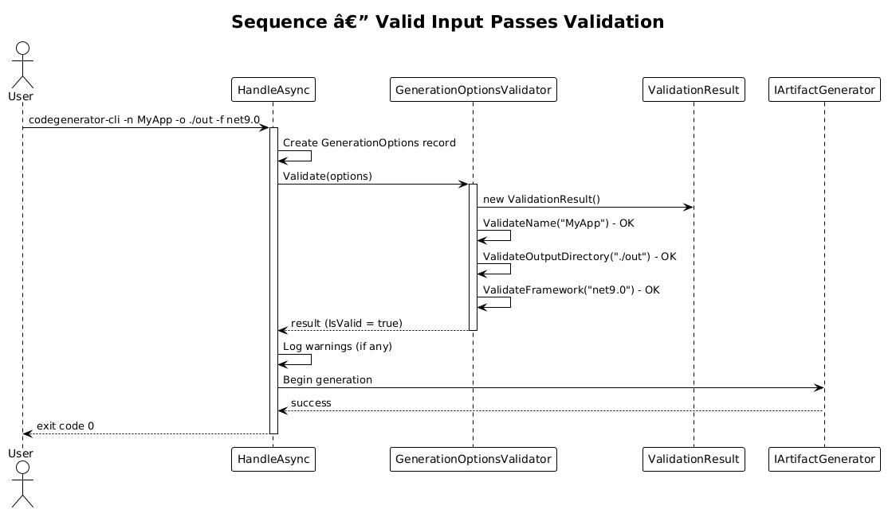
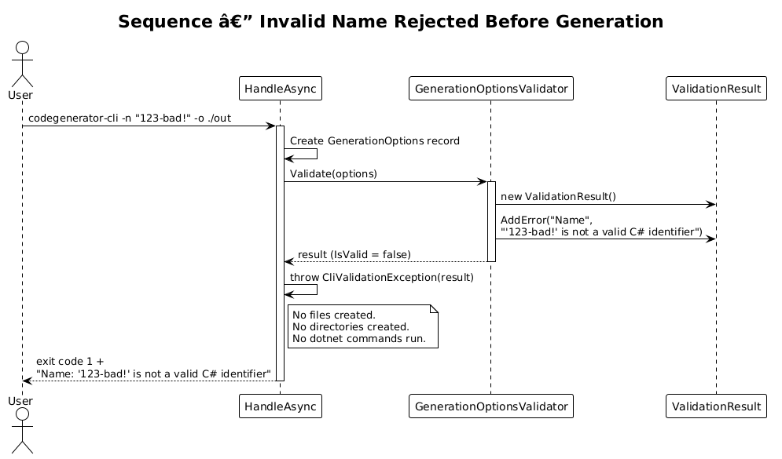
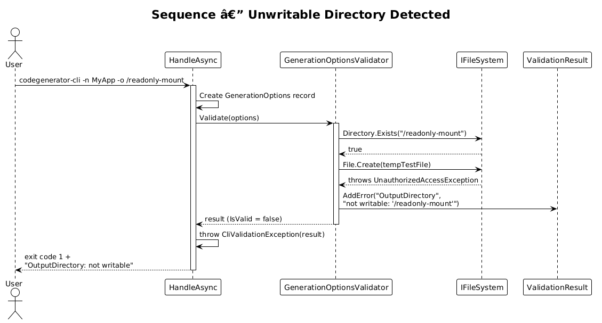

# Input Validation Layer — Detailed Design

**Feature:** 39-input-validation-layer (CLI Vision 1.2)
**Status:** Implemented
**Context:** The CLI currently accepts any string for `--name`, `--output`, and `--framework` without validation. Invalid C# identifiers in the name produce broken project files. Non-existent output directories cause cryptic I/O errors deep in generation. Invalid framework strings produce projects that fail to build.

---

## 1. Overview

### Problem

- **No name validation:** A name like `123-bad!` is accepted, producing a `.csproj` with an invalid `<RootNamespace>` and class names that do not compile.
- **No output directory check:** If the parent of `--output` does not exist, `Directory.CreateDirectory` may fail deep in generation after partial output is created.
- **No writability check:** If the output directory exists but is read-only (e.g., a mounted volume, permissions issue), the CLI fails mid-generation.
- **No framework validation:** An invalid framework string like `dotnet9` (instead of `net9.0`) produces a `.csproj` that does not build, with no error at generation time.
- **Validation happens too late:** The existing `IValidatable` system validates individual model properties at generation time, not the CLI input before generation starts.

### Goal

Add a `GenerationOptionsValidator` that validates all CLI inputs before any generation begins. Invalid input produces a clear `CliValidationException` (Feature 38) with property-level error messages and exit code 1.

### Actors

| Actor | Description |
|-------|-------------|
| **CLI User** | Provides `--name`, `--output`, `--framework` options |
| **CI Pipeline** | Passes options programmatically; needs clear validation errors |
| **Developer** | Adds new commands that reuse the validation infrastructure |

### Scope

- `GenerationOptions` record to hold validated, typed options
- `GenerationOptionsValidator` class with validation rules
- Integration point in `CreateCodeGeneratorCommand.HandleAsync` as the first step
- Connection to the existing `IValidatable`/`ValidationResult` system
- Directory existence and writability checks

### Out of Scope

- FluentValidation integration (the built-in `ValidationResult` system is sufficient)
- Interactive prompts to correct invalid input (future feature)
- Validation of `--local-source-root` paths (deferred; it is optional and advanced)

---

## 2. Architecture

### 2.1 C4 Context Diagram

Shows how user input flows through the validation layer before reaching generation.



### 2.2 C4 Container Diagram

The validation layer sits in `CodeGenerator.Cli`, using validation contracts from `CodeGenerator.Abstractions`.



### 2.3 C4 Component Diagram

Internal components: the options record, validator, and their integration with the command handler.



---

## 3. Component Details

### 3.1 GenerationOptions Record

**Location:** `CodeGenerator.Cli.Validation`

```csharp
public record GenerationOptions
{
    public required string Name { get; init; }
    public required string OutputDirectory { get; init; }
    public required string Framework { get; init; }
    public required bool Slnx { get; init; }
    public string? LocalSourceRoot { get; init; }
}
```

This record captures all validated CLI inputs in a single, immutable object. It replaces the loose parameter list in `HandleAsync`, making it easier to pass around and test.

### 3.2 GenerationOptionsValidator

**Location:** `CodeGenerator.Cli.Validation`

```csharp
public class GenerationOptionsValidator
{
    private static readonly Regex ValidCSharpIdentifier = new(
        @"^[A-Za-z_][A-Za-z0-9_.]*$",
        RegexOptions.Compiled);

    private readonly IFileSystem _fileSystem;

    public GenerationOptionsValidator(IFileSystem fileSystem)
    {
        _fileSystem = fileSystem;
    }

    public ValidationResult Validate(GenerationOptions options)
    {
        var result = new ValidationResult();

        ValidateName(options.Name, result);
        ValidateOutputDirectory(options.OutputDirectory, result);
        ValidateFramework(options.Framework, result);

        return result;
    }

    private void ValidateName(string name, ValidationResult result)
    {
        if (string.IsNullOrWhiteSpace(name))
        {
            result.AddError(nameof(GenerationOptions.Name),
                "Solution name is required.");
            return;
        }

        if (!ValidCSharpIdentifier.IsMatch(name))
        {
            result.AddError(nameof(GenerationOptions.Name),
                $"'{name}' is not a valid C# identifier. " +
                "Must start with a letter or underscore, followed by letters, digits, underscores, or dots.");
        }

        if (name.Length > 128)
        {
            result.AddWarning(nameof(GenerationOptions.Name),
                "Solution name exceeds 128 characters. This may cause issues on some file systems.");
        }
    }

    private void ValidateOutputDirectory(string outputDirectory, ValidationResult result)
    {
        var parentDir = _fileSystem.Path.GetDirectoryName(outputDirectory);

        if (!string.IsNullOrEmpty(parentDir) && !_fileSystem.Directory.Exists(parentDir))
        {
            result.AddError(nameof(GenerationOptions.OutputDirectory),
                $"Parent directory does not exist: '{parentDir}'");
            return;
        }

        if (_fileSystem.Directory.Exists(outputDirectory))
        {
            // Check writability by attempting to create a temp file
            if (!IsDirectoryWritable(outputDirectory))
            {
                result.AddError(nameof(GenerationOptions.OutputDirectory),
                    $"Output directory is not writable: '{outputDirectory}'");
            }
        }
    }

    private void ValidateFramework(string framework, ValidationResult result)
    {
        if (string.IsNullOrWhiteSpace(framework))
        {
            result.AddError(nameof(GenerationOptions.Framework),
                "Target framework is required.");
            return;
        }

        if (!framework.StartsWith("net", StringComparison.OrdinalIgnoreCase))
        {
            result.AddError(nameof(GenerationOptions.Framework),
                $"'{framework}' is not a valid target framework. " +
                "Must start with 'net' (e.g., 'net8.0', 'net9.0').");
        }
    }

    private bool IsDirectoryWritable(string path)
    {
        try
        {
            var testFile = _fileSystem.Path.Combine(path, $".codegen-write-test-{Guid.NewGuid():N}");
            using var stream = _fileSystem.File.Create(testFile);
            stream.Close();
            _fileSystem.File.Delete(testFile);
            return true;
        }
        catch (UnauthorizedAccessException)
        {
            return false;
        }
        catch (IOException)
        {
            return false;
        }
    }
}
```

**Validation rules summary:**

| Option | Rule | Severity |
|--------|------|----------|
| `Name` | Not null/empty | Error |
| `Name` | Matches `^[A-Za-z_][A-Za-z0-9_.]*$` | Error |
| `Name` | Length <= 128 | Warning |
| `OutputDirectory` | Parent directory exists | Error |
| `OutputDirectory` | Directory is writable (if exists) | Error |
| `Framework` | Not null/empty | Error |
| `Framework` | Starts with "net" | Error |

### 3.3 Integration in HandleAsync

**Location:** `CodeGenerator.Cli.Commands.CreateCodeGeneratorCommand`

Validation runs as the first step before any generation:

```csharp
private async Task<int> HandleAsync(string name, string outputDirectory, string framework, bool slnx, string? localSourceRoot)
{
    var logger = _serviceProvider.GetRequiredService<ILogger<CreateCodeGeneratorCommand>>();
    var fileSystem = _serviceProvider.GetRequiredService<IFileSystem>();
    var validator = new GenerationOptionsValidator(fileSystem);

    var options = new GenerationOptions
    {
        Name = name,
        OutputDirectory = outputDirectory,
        Framework = framework,
        Slnx = slnx,
        LocalSourceRoot = localSourceRoot,
    };

    // Step 1: Validate before any generation
    var validationResult = validator.Validate(options);

    if (!validationResult.IsValid)
    {
        throw new CliValidationException(validationResult);
    }

    foreach (var warning in validationResult.Warnings)
    {
        logger.LogWarning("{Property}: {Message}", warning.PropertyName, warning.ErrorMessage);
    }

    // Step 2: Proceed with generation using validated options
    // ... (existing generation logic, now using options record)
}
```

### 3.4 Connection to Existing Validation System

The `GenerationOptionsValidator` uses the same `ValidationResult` and `ValidationError` types from `CodeGenerator.Abstractions.Validation` that the model validation system (Feature 12) uses. This provides consistency:

- `ValidationResult` with `.Errors` and `.Warnings` lists
- `ValidationError` with `PropertyName`, `ErrorMessage`, and `Severity`
- `CliValidationException` (Feature 38) wraps the `ValidationResult` for the top-level error handler

The validator does **not** implement `IValidatable` because `GenerationOptions` is not a model passed to `ArtifactGenerator`. Instead, it is validated explicitly in the command handler before generation begins. This keeps the two validation layers separate:

1. **Input validation** (this feature): Validates CLI options before generation starts.
2. **Model validation** (Feature 12): Validates generation models at dispatch time inside `ArtifactGenerator.GenerateAsync`.

---

## 4. Data Model

### Class Diagram



---

## 5. Key Workflows

### 5.1 Valid Input



### 5.2 Invalid Name



### 5.3 Unwritable Directory



---

## 6. Testing Strategy

| Test | Type | Description |
|------|------|-------------|
| `ValidName_ReturnsSuccess` | Unit | `"MyApp"`, `"My.App"`, `"_app"` all pass |
| `InvalidName_StartsWithDigit_ReturnsError` | Unit | `"123App"` produces error on `Name` |
| `InvalidName_SpecialChars_ReturnsError` | Unit | `"My-App!"` produces error on `Name` |
| `LongName_ReturnsWarning` | Unit | 200-char name produces warning, not error |
| `OutputDir_ParentMissing_ReturnsError` | Unit | Non-existent parent directory produces error |
| `OutputDir_NotWritable_ReturnsError` | Unit | Read-only directory produces error (using `MockFileSystem`) |
| `Framework_Valid_ReturnsSuccess` | Unit | `"net8.0"`, `"net9.0"` pass |
| `Framework_Invalid_ReturnsError` | Unit | `"dotnet9"`, `""` produce errors |
| `HandleAsync_ValidationFails_ReturnsExitCode1` | Integration | Invalid options produce exit code 1 before any file I/O |

---

## 7. Open Questions

| # | Question | Impact | Proposed Resolution |
|---|----------|--------|---------------------|
| 1 | Should `--name` also be checked against C# reserved keywords (`class`, `namespace`, etc.)? | Low | Yes, add a secondary check; reserved keywords produce valid identifiers but bad project names |
| 2 | Should the writability check create a temp file, or is checking ACLs sufficient? | Medium | Temp file approach is more reliable cross-platform; ACL checking is Windows-specific |
| 3 | Should `GenerationOptionsValidator` be registered in DI or created inline? | Low | Start inline in the handler; move to DI if reused across multiple commands |
| 4 | Should validation of `--local-source-root` be added now? | Low | Defer; it is an advanced option and verifying project references exist requires reading the file system extensively |
