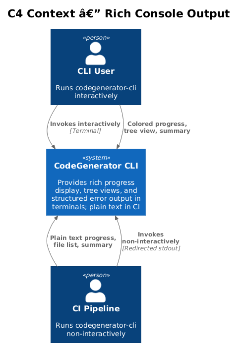
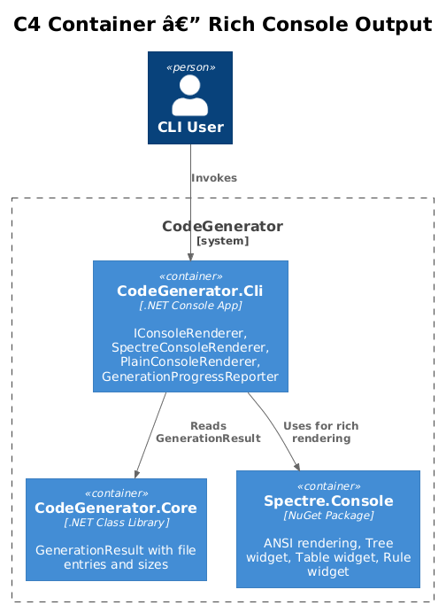
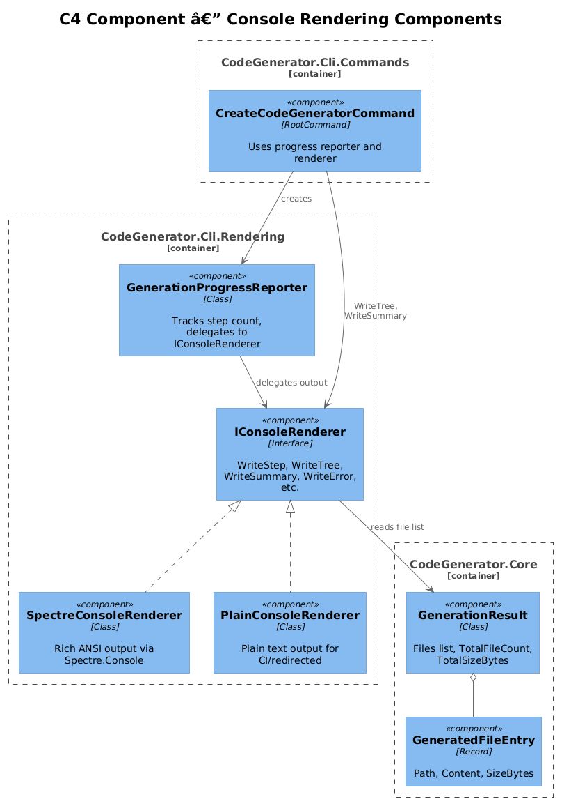
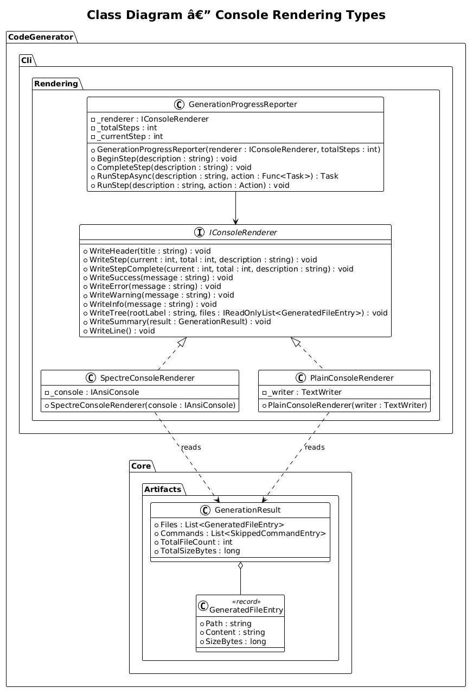
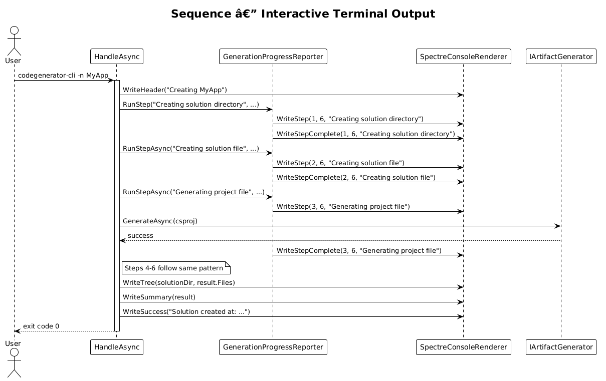
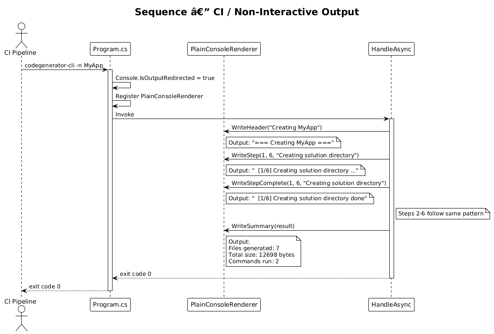
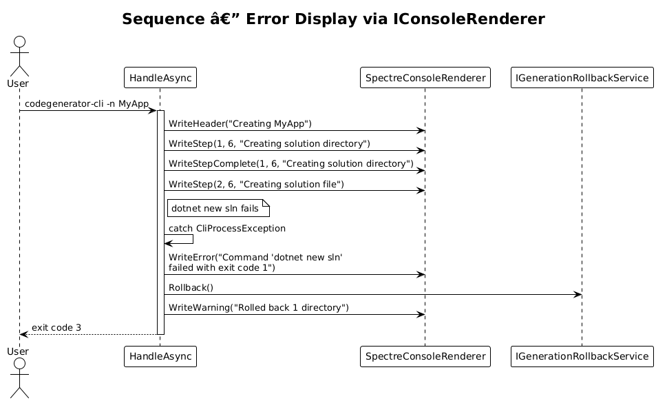

# Rich Console Output — Detailed Design

**Feature:** 40-rich-console-output (CLI Vision 1.3)
**Status:** Proposed
**Context:** The CLI currently uses `ILogger` for all output, producing flat, unstyled log lines. Users cannot easily see generation progress, distinguish errors from informational messages, or get a summary of what was generated. The output is not visually scannable.

---

## 1. Overview

### Problem

- **No progress indication:** The CLI generates multiple files and runs multiple commands, but the user sees a stream of `info:` log lines with no indication of how far along generation is or how many steps remain.
- **No structured error display:** Errors appear as the same `info:` or `fail:` log lines, with no visual distinction, color coding, or structured formatting.
- **No summary:** After generation completes, there is no file tree view, no file count, no size summary. The user must manually inspect the output directory.
- **CI-unfriendly:** Spectre.Console markup codes would pollute log files and CI output. The CLI needs a plain-text fallback for non-interactive environments.

### Goal

Replace bare `ILogger` calls with a `IConsoleRenderer` abstraction that provides rich, Spectre.Console-powered output in interactive terminals and plain text in CI/non-interactive environments. Add progress tracking with step counts, a tree view of generated output, and a file count/size summary.

### Actors

| Actor | Description |
|-------|-------------|
| **CLI User** | Runs the CLI interactively in a terminal; benefits from colors, progress, and tree views |
| **CI Pipeline** | Runs the CLI non-interactively; needs clean plain-text output without ANSI codes |
| **Developer** | Adds new generation steps; uses `IConsoleRenderer` instead of `ILogger` for user-facing output |

### Scope

- `IConsoleRenderer` interface abstracting all user-facing console output
- `SpectreConsoleRenderer` implementation using Spectre.Console
- `PlainConsoleRenderer` for non-interactive/CI environments
- `GenerationProgressReporter` for step-by-step progress display
- `GeneratedOutputTreeRenderer` for tree view of generated files
- Integration with existing `GenerationResult` (which already tracks files and sizes)
- Auto-detection of interactive vs. non-interactive terminals

### Out of Scope

- Replacing `ILogger` throughout the Core/DotNet packages (those remain internal diagnostic logs)
- Interactive prompts (e.g., overwrite confirmation) -- separate feature
- Custom themes or color configuration

---

## 2. Architecture

### 2.1 C4 Context Diagram

Shows how the CLI user receives rich console output from the tool.



### 2.2 C4 Container Diagram

The rendering layer sits in `CodeGenerator.Cli`, consuming `GenerationResult` from Core.



### 2.3 C4 Component Diagram

Internal rendering components and their relationships.



---

## 3. Component Details

### 3.1 IConsoleRenderer Interface

**Location:** `CodeGenerator.Cli.Rendering`

```csharp
public interface IConsoleRenderer
{
    void WriteHeader(string title);
    void WriteStep(int current, int total, string description);
    void WriteStepComplete(int current, int total, string description);
    void WriteSuccess(string message);
    void WriteError(string message);
    void WriteWarning(string message);
    void WriteInfo(string message);
    void WriteTree(string rootLabel, IReadOnlyList<GeneratedFileEntry> files);
    void WriteSummary(GenerationResult result);
    void WriteLine();
}
```

This interface covers all user-facing output needs: progress steps, status messages, file tree display, and generation summary. It does **not** replace `ILogger` -- diagnostic/debug logging continues to use `ILogger`. `IConsoleRenderer` is specifically for structured user-facing output.

### 3.2 SpectreConsoleRenderer

**Location:** `CodeGenerator.Cli.Rendering`

```csharp
public class SpectreConsoleRenderer : IConsoleRenderer
{
    private readonly IAnsiConsole _console;

    public SpectreConsoleRenderer(IAnsiConsole console)
    {
        _console = console;
    }

    public void WriteHeader(string title)
    {
        _console.Write(new Rule($"[bold blue]{title.EscapeMarkup()}[/]").LeftJustified());
        _console.WriteLine();
    }

    public void WriteStep(int current, int total, string description)
    {
        _console.MarkupLine($"  [dim][[{current}/{total}]][/] {description.EscapeMarkup()} ...");
    }

    public void WriteStepComplete(int current, int total, string description)
    {
        _console.MarkupLine($"  [green][[{current}/{total}]][/] {description.EscapeMarkup()} [green]done[/]");
    }

    public void WriteSuccess(string message)
    {
        _console.MarkupLine($"[green]{Emoji.Known.CheckMark} {message.EscapeMarkup()}[/]");
    }

    public void WriteError(string message)
    {
        _console.MarkupLine($"[red bold]Error:[/] [red]{message.EscapeMarkup()}[/]");
    }

    public void WriteWarning(string message)
    {
        _console.MarkupLine($"[yellow]Warning:[/] {message.EscapeMarkup()}");
    }

    public void WriteInfo(string message)
    {
        _console.MarkupLine($"  {message.EscapeMarkup()}");
    }

    public void WriteTree(string rootLabel, IReadOnlyList<GeneratedFileEntry> files)
    {
        var tree = new Tree(rootLabel.EscapeMarkup());
        var directories = new Dictionary<string, TreeNode>();

        foreach (var file in files.OrderBy(f => f.Path))
        {
            var relativePath = Path.GetRelativePath(
                Path.GetDirectoryName(files[0].Path) ?? "",
                file.Path);
            var parts = relativePath.Split(Path.DirectorySeparatorChar, Path.AltDirectorySeparatorChar);

            TreeNode parent = null;
            var currentPath = "";

            for (int i = 0; i < parts.Length - 1; i++)
            {
                currentPath = Path.Combine(currentPath, parts[i]);
                if (!directories.TryGetValue(currentPath, out var node))
                {
                    node = parent == null
                        ? tree.AddNode($"[blue]{parts[i].EscapeMarkup()}[/]")
                        : parent.AddNode($"[blue]{parts[i].EscapeMarkup()}[/]");
                    directories[currentPath] = node;
                }
                parent = node;
            }

            var fileName = parts[^1];
            if (parent != null)
                parent.AddNode($"[dim]{fileName.EscapeMarkup()}[/]");
            else
                tree.AddNode($"[dim]{fileName.EscapeMarkup()}[/]");
        }

        _console.Write(tree);
    }

    public void WriteSummary(GenerationResult result)
    {
        _console.WriteLine();
        var table = new Table().NoBorder();
        table.AddColumn("Metric");
        table.AddColumn("Value");
        table.AddRow("Files generated", result.TotalFileCount.ToString());
        table.AddRow("Total size", FormatBytes(result.TotalSizeBytes));
        table.AddRow("Commands run", result.Commands.Count.ToString());
        _console.Write(table);
    }

    public void WriteLine() => _console.WriteLine();

    private static string FormatBytes(long bytes) => bytes switch
    {
        < 1024 => $"{bytes} B",
        < 1024 * 1024 => $"{bytes / 1024.0:F1} KB",
        _ => $"{bytes / (1024.0 * 1024.0):F1} MB",
    };
}
```

### 3.3 PlainConsoleRenderer

**Location:** `CodeGenerator.Cli.Rendering`

```csharp
public class PlainConsoleRenderer : IConsoleRenderer
{
    private readonly TextWriter _writer;

    public PlainConsoleRenderer(TextWriter writer)
    {
        _writer = writer;
    }

    public void WriteHeader(string title)
    {
        _writer.WriteLine($"=== {title} ===");
        _writer.WriteLine();
    }

    public void WriteStep(int current, int total, string description)
    {
        _writer.WriteLine($"  [{current}/{total}] {description} ...");
    }

    public void WriteStepComplete(int current, int total, string description)
    {
        _writer.WriteLine($"  [{current}/{total}] {description} done");
    }

    public void WriteSuccess(string message) => _writer.WriteLine($"SUCCESS: {message}");
    public void WriteError(string message) => _writer.WriteLine($"ERROR: {message}");
    public void WriteWarning(string message) => _writer.WriteLine($"WARNING: {message}");
    public void WriteInfo(string message) => _writer.WriteLine($"  {message}");

    public void WriteTree(string rootLabel, IReadOnlyList<GeneratedFileEntry> files)
    {
        _writer.WriteLine(rootLabel);
        foreach (var file in files.OrderBy(f => f.Path))
        {
            _writer.WriteLine($"  {file.Path}");
        }
    }

    public void WriteSummary(GenerationResult result)
    {
        _writer.WriteLine();
        _writer.WriteLine($"Files generated: {result.TotalFileCount}");
        _writer.WriteLine($"Total size: {result.TotalSizeBytes} bytes");
        _writer.WriteLine($"Commands run: {result.Commands.Count}");
    }

    public void WriteLine() => _writer.WriteLine();
}
```

### 3.4 GenerationProgressReporter

**Location:** `CodeGenerator.Cli.Rendering`

```csharp
public class GenerationProgressReporter
{
    private readonly IConsoleRenderer _renderer;
    private readonly int _totalSteps;
    private int _currentStep;

    public GenerationProgressReporter(IConsoleRenderer renderer, int totalSteps)
    {
        _renderer = renderer;
        _totalSteps = totalSteps;
    }

    public void BeginStep(string description)
    {
        _currentStep++;
        _renderer.WriteStep(_currentStep, _totalSteps, description);
    }

    public void CompleteStep(string description)
    {
        _renderer.WriteStepComplete(_currentStep, _totalSteps, description);
    }

    public async Task<T> RunStepAsync<T>(string description, Func<Task<T>> action)
    {
        BeginStep(description);
        var result = await action();
        CompleteStep(description);
        return result;
    }

    public async Task RunStepAsync(string description, Func<Task> action)
    {
        BeginStep(description);
        await action();
        CompleteStep(description);
    }

    public void RunStep(string description, Action action)
    {
        BeginStep(description);
        action();
        CompleteStep(description);
    }
}
```

**Usage in HandleAsync:**

```csharp
var renderer = _serviceProvider.GetRequiredService<IConsoleRenderer>();
var progress = new GenerationProgressReporter(renderer, totalSteps: 6);

renderer.WriteHeader($"Creating {name}");

progress.RunStep("Creating solution directory", () =>
{
    Directory.CreateDirectory(solution.SolutionDirectory);
    // ...
});

await progress.RunStepAsync("Creating solution file", async () =>
{
    commandService.Start($"dotnet new sln -n {name}", solution.SolutionDirectory);
});

await progress.RunStepAsync("Generating project file", async () =>
{
    await artifactGenerator.GenerateAsync(csprojModel);
});

// ... remaining steps ...

renderer.WriteTree(solution.SolutionDirectory, result.Files);
renderer.WriteSummary(result);
renderer.WriteSuccess($"Solution created at: {solution.SolutionDirectory}");
```

**Example output (interactive terminal):**

```
── Creating MyApp ──────────────────────────────────

  [1/6] Creating solution directory ... done
  [2/6] Creating solution file ... done
  [3/6] Generating project file ... done
  [4/6] Generating source files ... done
  [5/6] Adding project to solution ... done
  [6/6] Generating install script ... done

MyApp
  src
    MyApp.Cli
      MyApp.Cli.csproj
      Program.cs
      Commands
        AppRootCommand.cs
        HelloWorldCommand.cs
        EnterpriseSolutionCommand.cs
  eng
    scripts
      install-cli.bat

Files generated  7
Total size       12.4 KB
Commands run     2

 Solution created at: C:\output\MyApp
```

### 3.5 GeneratedOutputTreeRenderer

The tree rendering logic is encapsulated within the `IConsoleRenderer.WriteTree` method rather than a separate class, because:

1. The tree building logic is tightly coupled to the rendering backend (Spectre `Tree` widget vs. plain text indentation).
2. The `GeneratedFileEntry` list from `GenerationResult` already provides all data needed.
3. A separate class would add indirection without benefit.

If tree rendering becomes more complex (e.g., showing file sizes, diff markers), it can be extracted into a dedicated `GeneratedOutputTreeRenderer` at that time.

### 3.6 DI Registration and Auto-Detection

**Location:** `CodeGenerator.Cli.Program.cs`

```csharp
// Auto-detect interactive terminal
if (Console.IsOutputRedirected || Environment.GetEnvironmentVariable("CI") != null)
{
    services.AddSingleton<IConsoleRenderer>(new PlainConsoleRenderer(Console.Out));
}
else
{
    services.AddSingleton<IConsoleRenderer>(new SpectreConsoleRenderer(AnsiConsole.Console));
}
```

Detection heuristics:
- `Console.IsOutputRedirected` -- true when piped to a file or another process
- `CI` environment variable -- set by most CI systems (GitHub Actions, Azure DevOps, Jenkins)
- A `--plain` flag could be added later for explicit override

---

## 4. Data Model

### Class Diagram



---

## 5. Key Workflows

### 5.1 Interactive Terminal Output



### 5.2 CI/Non-Interactive Output



### 5.3 Error Display



---

## 6. Testing Strategy

| Test | Type | Description |
|------|------|-------------|
| `PlainRenderer_WriteStep_FormatsCorrectly` | Unit | Verify `[1/6] description ...` format |
| `PlainRenderer_WriteSummary_ShowsCountAndSize` | Unit | Verify file count and byte count in output |
| `PlainRenderer_WriteTree_ListsAllFiles` | Unit | Verify all files appear in tree output |
| `ProgressReporter_RunStep_CallsBeginAndComplete` | Unit | Verify step count increments correctly |
| `ProgressReporter_RunStepAsync_PropagatesExceptions` | Unit | Verify exceptions are not swallowed |
| `AutoDetection_RedirectedOutput_UsesPlainRenderer` | Integration | Verify `PlainConsoleRenderer` when output is redirected |
| `AutoDetection_CIVariable_UsesPlainRenderer` | Integration | Verify `PlainConsoleRenderer` when `CI=true` |
| `SpectreRenderer_WriteTree_BuildsTreeStructure` | Integration | Verify Spectre `Tree` widget renders without exceptions |

---

## 7. Open Questions

| # | Question | Impact | Proposed Resolution |
|---|----------|--------|---------------------|
| 1 | Should `IConsoleRenderer` also handle `ILogger` integration (e.g., as an `ILoggerProvider`)? | Medium | No -- keep them separate. `ILogger` is for diagnostic logs, `IConsoleRenderer` is for user-facing output. Developers use `ILogger` internally; commands use `IConsoleRenderer` for UX. |
| 2 | Should Spectre.Console be a dependency of `CodeGenerator.Cli` only, or also Core? | Low | CLI only. Core should have no console rendering dependency. |
| 3 | Should progress display use Spectre's `AnsiConsole.Progress()` (live-updating) instead of line-by-line output? | Medium | Start with line-by-line (simpler, works in all terminals). Add live progress in a follow-up if users want it. |
| 4 | Should the `--plain` flag be added now for explicit opt-in to plain output? | Low | Defer to implementation; auto-detection covers the main use cases. |
| 5 | Should `WriteTree` compute relative paths from the solution root automatically? | Low | Yes, the renderer should accept a root path and compute relative paths internally. |
