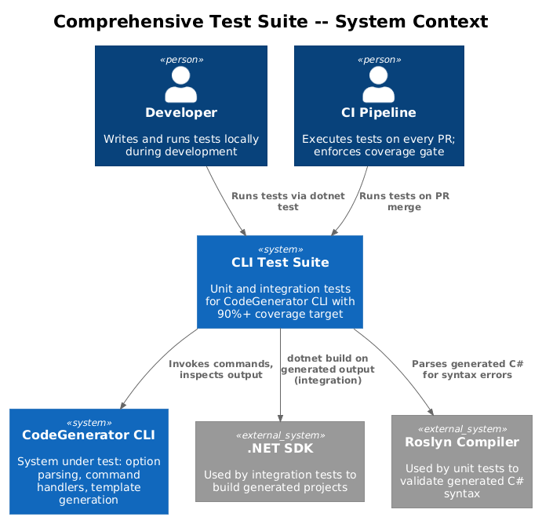
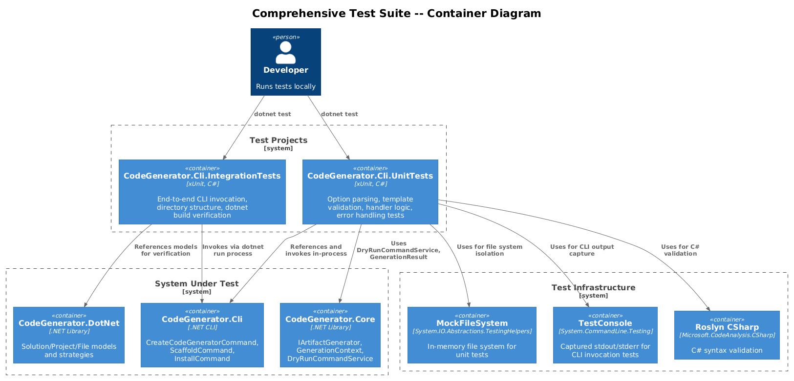
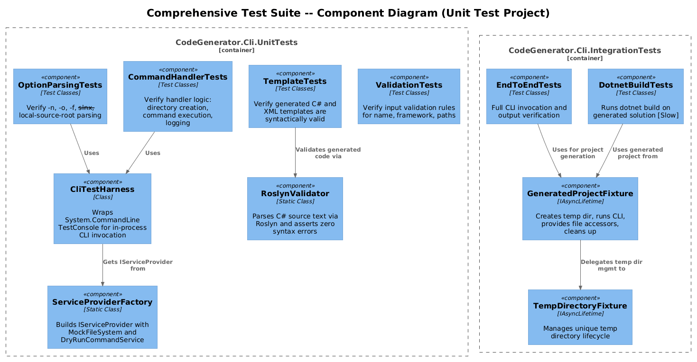
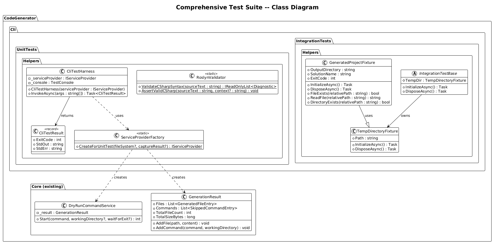
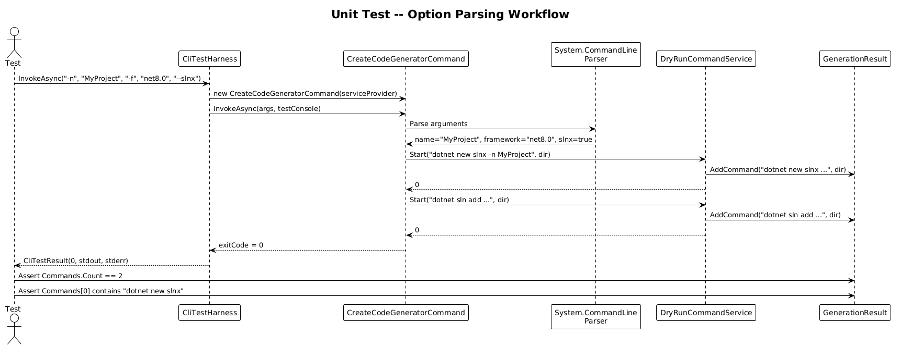
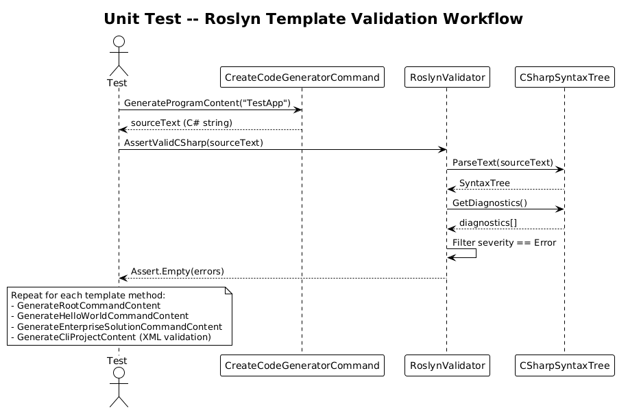
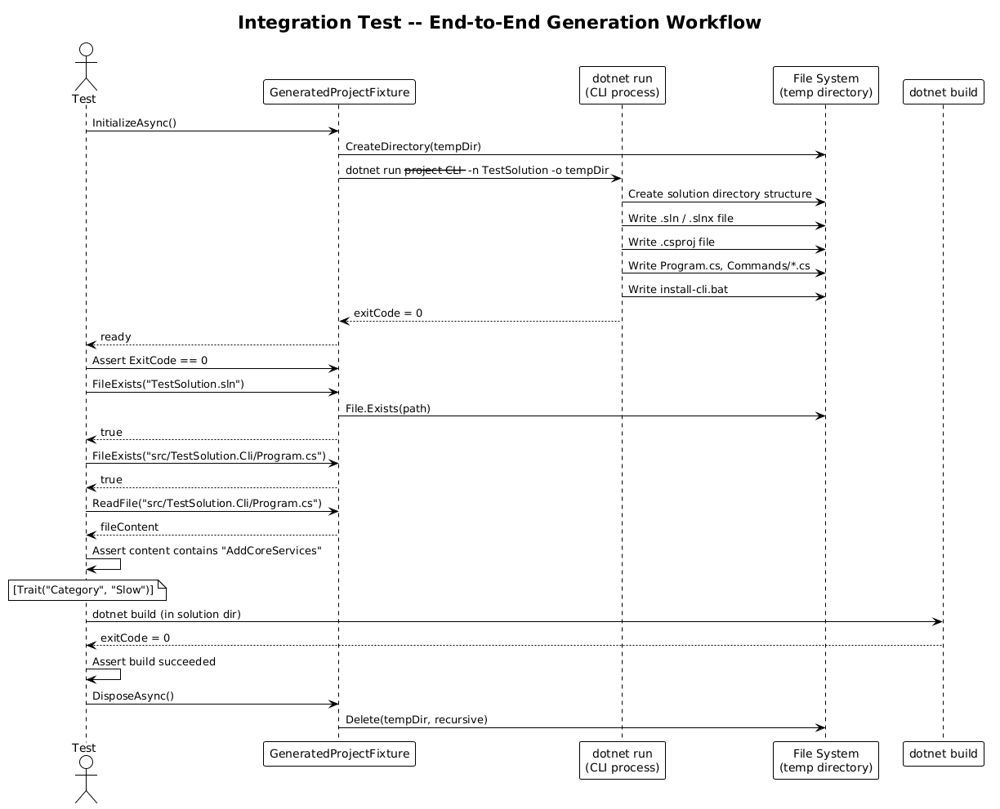
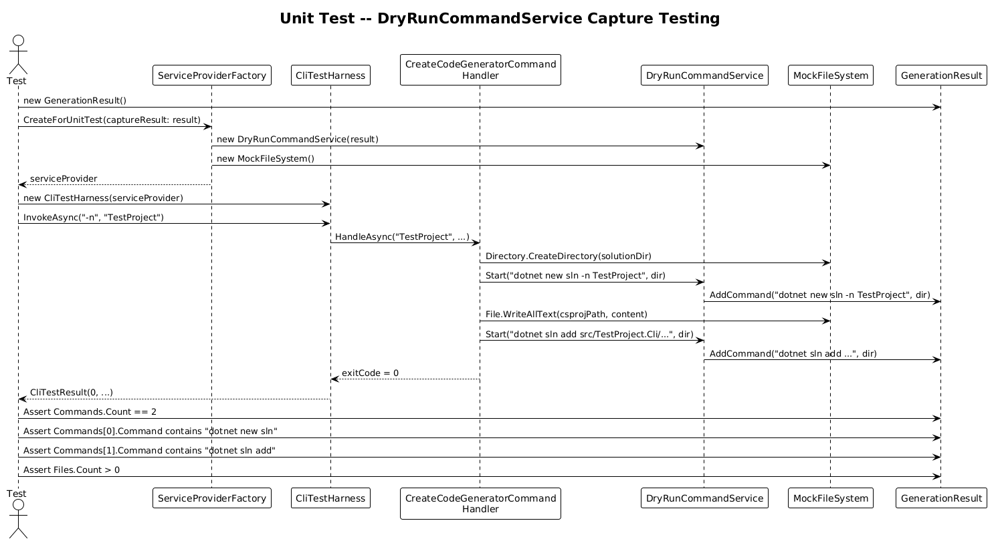

# Comprehensive Test Suite -- Detailed Design

**Feature:** 41-comprehensive-test-suite (Vision 1.4)
**Status:** Implemented
**Target:** 90%+ code coverage on CLI-specific code

---

## 1. Overview

The CodeGenerator CLI currently has unit tests for core services (`CodeGenerator.Core.UnitTests`) and a small integration test project (`CodeGenerator.IntegrationTests`), but the CLI layer itself -- option parsing, command handlers, template output validation, and end-to-end generation workflows -- has no dedicated test coverage.

### Problem

- No tests verify that System.CommandLine option parsing maps correctly to handler parameters (`-n`, `-o`, `-f`, `--slnx`, `--local-source-root`).
- Generated C# files are written to disk but never validated for syntactic correctness. A template regression could produce unparseable code.
- The `CreateCodeGeneratorCommand` handler writes to the real file system and invokes `dotnet new sln`, `dotnet sln add`, making it untestable without infrastructure mocking.
- Overwrite, invalid-input, and error-handling paths are not exercised.

### Goal

Introduce two new test projects that provide:

1. **Unit tests** for option parsing, handler logic, template output, input validation, and error handling -- all using in-memory fakes.
2. **Integration tests** that invoke the CLI end-to-end, verify directory structures and file contents, and optionally run `dotnet build` on generated output.

### Actors

| Actor | Description |
|-------|-------------|
| **Developer** | Writes and runs tests during development |
| **CI Pipeline** | Executes tests on every PR; enforces coverage gate |
| **Roslyn Validator** | Programmatic C# syntax checker used inside test assertions |

### Scope

This design covers the test project structure, test helper classes, key test case categories, temporary directory management, Roslyn-based validation, and DryRunCommandService usage patterns. It does not cover test infrastructure for non-CLI projects (Core, DotNet, Angular, etc.) which already have their own test projects.

### Design Principles

- **Isolation.** Unit tests never touch the file system or spawn processes. They use `MockFileSystem` and `DryRunCommandService`.
- **Determinism.** Integration tests use unique temporary directories and clean up after themselves.
- **Fast feedback.** Unit tests complete in under 5 seconds. Integration tests that invoke `dotnet build` are marked with `[Trait("Category", "Slow")]` so they can be excluded from inner-loop development.
- **Roslyn validation.** Every generated `.cs` file is parsed with Roslyn to assert zero diagnostics at Error severity.

---

## 2. Architecture

### 2.1 C4 Context Diagram

Shows the test projects in relation to the CLI and external tools.



### 2.2 C4 Container Diagram

The two test projects and their dependencies on the CLI, core libraries, and test infrastructure packages.



### 2.3 C4 Component Diagram

Internal components of the test infrastructure: harness, fixtures, validators, and helpers.



---

## 3. Component Details

### 3.1 Test Project Structure

```
tests/
  CodeGenerator.Cli.UnitTests/
    CodeGenerator.Cli.UnitTests.csproj
    Usings.cs
    Helpers/
      CliTestHarness.cs
      RoslynValidator.cs
      ServiceProviderFactory.cs
    Commands/
      CreateCodeGeneratorCommandTests.cs
      ScaffoldCommandTests.cs
      InstallCommandTests.cs
    OptionParsing/
      NameOptionTests.cs
      OutputOptionTests.cs
      FrameworkOptionTests.cs
      SlnxOptionTests.cs
      LocalSourceRootOptionTests.cs
    Templates/
      ProgramTemplateTests.cs
      RootCommandTemplateTests.cs
      HelloWorldCommandTemplateTests.cs
      EnterpriseSolutionCommandTemplateTests.cs
      CsprojTemplateTests.cs
    Validation/
      InputValidationTests.cs
    ErrorHandling/
      MissingRequiredOptionTests.cs
      InvalidFrameworkTests.cs

  CodeGenerator.Cli.IntegrationTests/
    CodeGenerator.Cli.IntegrationTests.csproj
    Usings.cs
    Helpers/
      GeneratedProjectFixture.cs
      TempDirectoryFixture.cs
      IntegrationTestBase.cs
    EndToEnd/
      CreateCodeGeneratorEndToEndTests.cs
      ScaffoldEndToEndTests.cs
    Verification/
      DirectoryStructureTests.cs
      FileContentTests.cs
      DotnetBuildTests.cs
    Scenarios/
      HelpOutputTests.cs
      OverwriteTests.cs
      InvalidInputTests.cs
```

### 3.2 CliTestHarness

- **Responsibility:** Wrap `System.CommandLine`'s `TestConsole` and provide a fluent API for invoking the CLI with arguments and capturing exit codes, stdout, and stderr.
- **Namespace:** `CodeGenerator.Cli.UnitTests.Helpers`
- **Key API:**

```csharp
public class CliTestHarness
{
    private readonly IServiceProvider _serviceProvider;
    private readonly TestConsole _console;

    public CliTestHarness(IServiceProvider serviceProvider)
    {
        _serviceProvider = serviceProvider;
        _console = new TestConsole();
    }

    public async Task<CliTestResult> InvokeAsync(params string[] args)
    {
        var command = new CreateCodeGeneratorCommand(_serviceProvider);
        var exitCode = await command.InvokeAsync(args, _console);
        return new CliTestResult(exitCode, _console.Out.ToString()!, _console.Error.ToString()!);
    }
}

public record CliTestResult(int ExitCode, string StdOut, string StdErr);
```

- **Usage:** Tests create a `CliTestHarness` with a test `IServiceProvider` (backed by `MockFileSystem` and `DryRunCommandService`), invoke with specific arguments, and assert on the result.

### 3.3 ServiceProviderFactory

- **Responsibility:** Build an `IServiceProvider` for unit tests with all real services except file system and command service, which are replaced with test doubles.
- **Namespace:** `CodeGenerator.Cli.UnitTests.Helpers`
- **Key API:**

```csharp
public static class ServiceProviderFactory
{
    public static IServiceProvider CreateForUnitTest(
        MockFileSystem? fileSystem = null,
        GenerationResult? captureResult = null)
    {
        var services = new ServiceCollection();
        var fs = fileSystem ?? new MockFileSystem();
        var result = captureResult ?? new GenerationResult();
        var cmdService = new DryRunCommandService(result);

        services.AddSingleton<IFileSystem>(fs);
        services.AddSingleton<ICommandService>(cmdService);
        services.AddSingleton(result);
        services.AddCoreServices(typeof(CreateCodeGeneratorCommand).Assembly);
        services.AddDotNetServices();
        // ... logging, configuration
        return services.BuildServiceProvider();
    }
}
```

### 3.4 RoslynValidator

- **Responsibility:** Parse generated C# source text using Roslyn and report any syntax or semantic errors. Used as a test assertion helper.
- **Namespace:** `CodeGenerator.Cli.UnitTests.Helpers`
- **Key API:**

```csharp
public static class RoslynValidator
{
    public static IReadOnlyList<Diagnostic> ValidateCSharpSyntax(string sourceText)
    {
        var tree = CSharpSyntaxTree.ParseText(sourceText);
        return tree.GetDiagnostics()
            .Where(d => d.Severity == DiagnosticSeverity.Error)
            .ToList();
    }

    public static void AssertValidCSharp(string sourceText, string context = "")
    {
        var errors = ValidateCSharpSyntax(sourceText);
        Assert.Empty(errors); // xUnit assertion with diagnostic detail
    }
}
```

- **Package dependency:** `Microsoft.CodeAnalysis.CSharp` (Roslyn).

### 3.5 GeneratedProjectFixture

- **Responsibility:** Manage a temporary directory for integration tests, invoke the CLI to generate a project, and provide accessors for verifying the output. Implements `IAsyncLifetime` for xUnit setup/teardown.
- **Namespace:** `CodeGenerator.Cli.IntegrationTests.Helpers`
- **Key API:**

```csharp
public class GeneratedProjectFixture : IAsyncLifetime
{
    public string OutputDirectory { get; private set; }
    public string SolutionName { get; }
    public int ExitCode { get; private set; }

    public GeneratedProjectFixture(string solutionName = "TestSolution")
    {
        SolutionName = solutionName;
        OutputDirectory = Path.Combine(Path.GetTempPath(),
            "CodeGenerator.Tests", Guid.NewGuid().ToString("N"));
    }

    public async Task InitializeAsync()
    {
        Directory.CreateDirectory(OutputDirectory);
        // Invoke CLI process
        var process = Process.Start(new ProcessStartInfo
        {
            FileName = "dotnet",
            Arguments = $"run --project <cli-project-path> -- -n {SolutionName} -o {OutputDirectory}",
            RedirectStandardOutput = true,
            RedirectStandardError = true,
        });
        await process!.WaitForExitAsync();
        ExitCode = process.ExitCode;
    }

    public async Task DisposeAsync()
    {
        if (Directory.Exists(OutputDirectory))
            Directory.Delete(OutputDirectory, recursive: true);
        await Task.CompletedTask;
    }

    public bool FileExists(string relativePath)
        => File.Exists(Path.Combine(OutputDirectory, SolutionName, relativePath));

    public string ReadFile(string relativePath)
        => File.ReadAllText(Path.Combine(OutputDirectory, SolutionName, relativePath));
}
```

### 3.6 TempDirectoryFixture

- **Responsibility:** Lightweight temporary directory helper for tests that do not need full project generation.
- **Lifetime:** Creates a unique temp directory in `InitializeAsync`, recursively deletes it in `DisposeAsync`.
- **Usage:** Integration tests that need a scratch directory inherit from `IntegrationTestBase` which provides a `TempDirectoryFixture`.

### 3.7 DryRunCommandService in Tests

The existing `DryRunCommandService` (from `CodeGenerator.Core`) is used in unit tests to:

1. **Capture commands** without spawning processes. Tests assert that the correct `dotnet new sln`, `dotnet sln add`, and other commands were recorded.
2. **Verify command arguments.** Tests inspect `GenerationResult.Commands` to confirm correct solution names, project paths, and working directories.
3. **Simulate failures.** A custom `FailingCommandService : ICommandService` can be created that returns non-zero exit codes to test error handling paths.

---

## 4. Data Model

### 4.1 Class Diagram



### 4.2 Entity Descriptions

| Entity | Description |
|--------|-------------|
| `CliTestHarness` | Wraps System.CommandLine TestConsole for invoking commands in-process with captured output |
| `CliTestResult` | Record holding exit code, stdout, and stderr from a test invocation |
| `ServiceProviderFactory` | Builds IServiceProvider with MockFileSystem and DryRunCommandService for unit tests |
| `RoslynValidator` | Static helper that parses C# with Roslyn and returns syntax errors |
| `GeneratedProjectFixture` | IAsyncLifetime fixture that generates a full project in a temp directory for integration tests |
| `TempDirectoryFixture` | Lightweight temp directory lifecycle manager |
| `IntegrationTestBase` | Base class providing common setup (temp directory, logging) for integration tests |

---

## 5. Key Workflows

### 5.1 Unit Test: Option Parsing

Verifies that System.CommandLine parses arguments correctly and maps them to handler parameters.



**Steps:**

1. Test creates a `CliTestHarness` with a mock service provider.
2. Test invokes `harness.InvokeAsync("-n", "MyProject", "-f", "net8.0", "--slnx")`.
3. `CreateCodeGeneratorCommand` parses the arguments via System.CommandLine.
4. Handler receives `name="MyProject"`, `framework="net8.0"`, `slnx=true`.
5. Handler calls `DryRunCommandService.Start()` and `MockFileSystem.File.WriteAllText()`.
6. Test asserts `ExitCode == 0` and inspects `GenerationResult.Commands` and `GenerationResult.Files`.

### 5.2 Unit Test: Roslyn Validation of Templates

Verifies that generated C# source code is syntactically valid.



**Steps:**

1. Test calls `CreateCodeGeneratorCommand.GenerateProgramContent("TestApp")` (via reflection or by making the method internal + `InternalsVisibleTo`).
2. Test passes the returned string to `RoslynValidator.AssertValidCSharp(source)`.
3. RoslynValidator parses the source with `CSharpSyntaxTree.ParseText()`.
4. Validator filters diagnostics to Error severity.
5. Test asserts zero errors.
6. Repeat for every template method: `GenerateRootCommandContent`, `GenerateHelloWorldCommandContent`, `GenerateEnterpriseSolutionCommandContent`, `GenerateCliProjectContent`.

### 5.3 Integration Test: End-to-End Generation

Verifies the full CLI pipeline produces a buildable project.



**Steps:**

1. `GeneratedProjectFixture.InitializeAsync()` creates a temp directory.
2. Fixture invokes the CLI as a `dotnet run` process with `-n TestSolution -o <tempDir>`.
3. CLI generates the solution, projects, and files on disk.
4. Test asserts `fixture.ExitCode == 0`.
5. Test asserts expected directory structure: `TestSolution/`, `TestSolution/src/TestSolution.Cli/`, `TestSolution/src/TestSolution.Cli/Commands/`.
6. Test asserts key files exist: `TestSolution.sln`, `TestSolution.Cli.csproj`, `Program.cs`, `AppRootCommand.cs`.
7. Test reads `Program.cs` and asserts it contains `AddCoreServices`.
8. (Slow) Test runs `dotnet build` in the generated solution directory and asserts exit code 0.
9. `GeneratedProjectFixture.DisposeAsync()` deletes the temp directory.

### 5.4 DryRunCommandService Capture Testing

Verifies that commands are captured without execution.



**Steps:**

1. Test creates a `GenerationResult` and a `DryRunCommandService(result)`.
2. Test registers the service in a test `IServiceProvider` via `ServiceProviderFactory`.
3. Test invokes the CLI handler with `-n TestProject`.
4. Handler calls `commandService.Start("dotnet new sln -n TestProject", workingDir)`.
5. `DryRunCommandService` records the command in `result.Commands`.
6. Handler calls `commandService.Start("dotnet sln add ...", workingDir)`.
7. `DryRunCommandService` records the second command.
8. Test asserts `result.Commands.Count == 2`.
9. Test asserts `result.Commands[0].Command` contains `"dotnet new sln"`.
10. Test asserts `result.Commands[1].Command` contains `"dotnet sln add"`.

---

## 6. Test Categories and Key Test Cases

### 6.1 Unit Tests (`CodeGenerator.Cli.UnitTests`)

| Category | Test Case | What It Verifies |
|----------|-----------|-----------------|
| **Option Parsing** | `Name_Option_Is_Required` | Invoking without `-n` returns non-zero exit code |
| **Option Parsing** | `Name_Option_Short_Alias` | `-n MyApp` maps to `name = "MyApp"` |
| **Option Parsing** | `Output_Option_Defaults_To_CurrentDirectory` | Omitting `-o` uses `Directory.GetCurrentDirectory()` |
| **Option Parsing** | `Framework_Option_Defaults_To_Net9` | Omitting `-f` uses `"net9.0"` |
| **Option Parsing** | `Slnx_Option_Defaults_To_False` | Omitting `--slnx` uses `false` |
| **Option Parsing** | `LocalSourceRoot_Option_Is_Optional` | Omitting `--local-source-root` passes `null` |
| **Templates** | `ProgramContent_Is_Valid_CSharp` | Roslyn parses output of `GenerateProgramContent` with zero errors |
| **Templates** | `RootCommandContent_Is_Valid_CSharp` | Roslyn validation on `GenerateRootCommandContent` |
| **Templates** | `CsprojContent_Is_Valid_Xml` | XML parser successfully loads `GenerateCliProjectContent` output |
| **Templates** | `ProgramContent_Contains_Expected_Usings` | Output includes `using CodeGenerator.Core;` |
| **Templates** | `ProgramContent_Uses_Correct_SolutionName` | Output contains the provided solution name in namespace references |
| **Validation** | `Empty_Name_Returns_ValidationError` | Handler or pre-handler validation rejects empty name |
| **Validation** | `Name_With_Spaces_Returns_ValidationError` | Names containing spaces are rejected |
| **Error Handling** | `CommandService_Failure_Logs_Error` | When `ICommandService.Start` returns non-zero, handler logs error |
| **Commands** | `Handler_Creates_Expected_Directories` | MockFileSystem shows expected directory creation calls |
| **Commands** | `Handler_Generates_Expected_Commands` | DryRunCommandService captures `dotnet new sln` and `dotnet sln add` |
| **Commands** | `Slnx_True_Uses_Slnx_Format` | When `--slnx` is set, command is `dotnet new slnx` |

### 6.2 Integration Tests (`CodeGenerator.Cli.IntegrationTests`)

| Category | Test Case | What It Verifies |
|----------|-----------|-----------------|
| **End-to-End** | `Create_Produces_Solution_Directory` | Output directory contains `<name>/` folder |
| **End-to-End** | `Create_Produces_Sln_File` | `<name>.sln` exists in solution root |
| **End-to-End** | `Create_Produces_Csproj_File` | `src/<name>.Cli/<name>.Cli.csproj` exists |
| **End-to-End** | `Create_Produces_Program_File` | `src/<name>.Cli/Program.cs` exists |
| **End-to-End** | `Create_Produces_Commands_Directory` | `src/<name>.Cli/Commands/` exists with expected files |
| **Verification** | `Generated_Solution_Builds_Successfully` | `dotnet build` exits with code 0 (Slow) |
| **Verification** | `Generated_Csproj_Has_PackAsTool` | `.csproj` contains `<PackAsTool>true</PackAsTool>` |
| **Verification** | `Generated_Program_Has_Correct_Structure` | `Program.cs` follows the expected top-level statement pattern |
| **Help** | `Help_Flag_Shows_Usage` | `--help` outputs usage text including option descriptions |
| **Help** | `Version_Flag_Shows_Version` | `--version` outputs a version string |
| **Overwrite** | `Existing_Directory_Without_Force_Fails` | Running twice in same directory without `--force` produces error |
| **Overwrite** | `Existing_Directory_With_Force_Succeeds` | Running with `--force` overwrites existing output |
| **Invalid Input** | `Invalid_Framework_Returns_Error` | `--framework invalid` returns non-zero exit code |
| **Invalid Input** | `Missing_Name_Returns_Error` | Omitting `-n` returns non-zero exit code and shows usage |
| **Scaffold** | `Scaffold_DryRun_Lists_Files` | `scaffold --dry-run` lists planned files without creating them |
| **Scaffold** | `Scaffold_Validate_Reports_Errors` | `scaffold --validate` with invalid YAML reports errors |

---

## 7. Open Questions

| # | Question | Context |
|---|----------|---------|
| 1 | Should `CreateCodeGeneratorCommand`'s template methods be made `internal` with `InternalsVisibleTo` for the test project, or should tests invoke the full command handler and inspect the MockFileSystem output? | Direct method testing is more granular; full handler testing is more realistic. Both approaches are complementary. |
| 2 | What is the minimum .NET SDK version required in CI for `dotnet build` integration tests? | Generated projects target `net9.0` by default. CI agents must have the .NET 9 SDK installed. |
| 3 | Should Roslyn validation extend beyond syntax to include semantic analysis (e.g., missing type references)? | Semantic analysis requires compilation references, adding complexity. Syntax-only catches most template regressions. |
| 4 | Should integration tests use `dotnet run --project` or build the CLI as a tool and invoke the binary directly? | `dotnet run` is simpler but slower. Pre-built binary is faster but requires a build step in test setup. |
| 5 | What coverage tool should be used (Coverlet, dotnet-coverage)? | Coverlet is the most common choice for .NET open-source projects and integrates with `dotnet test --collect`. |
| 6 | Should the "Slow" integration tests (dotnet build) run on every PR or only on nightly/release builds? | Running on every PR ensures correctness but adds 30-60 seconds. A `[Trait]` filter lets CI decide. |
