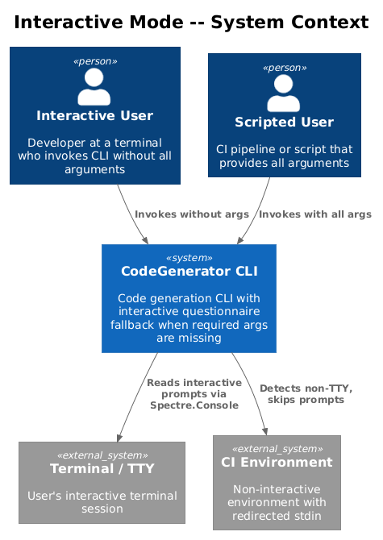
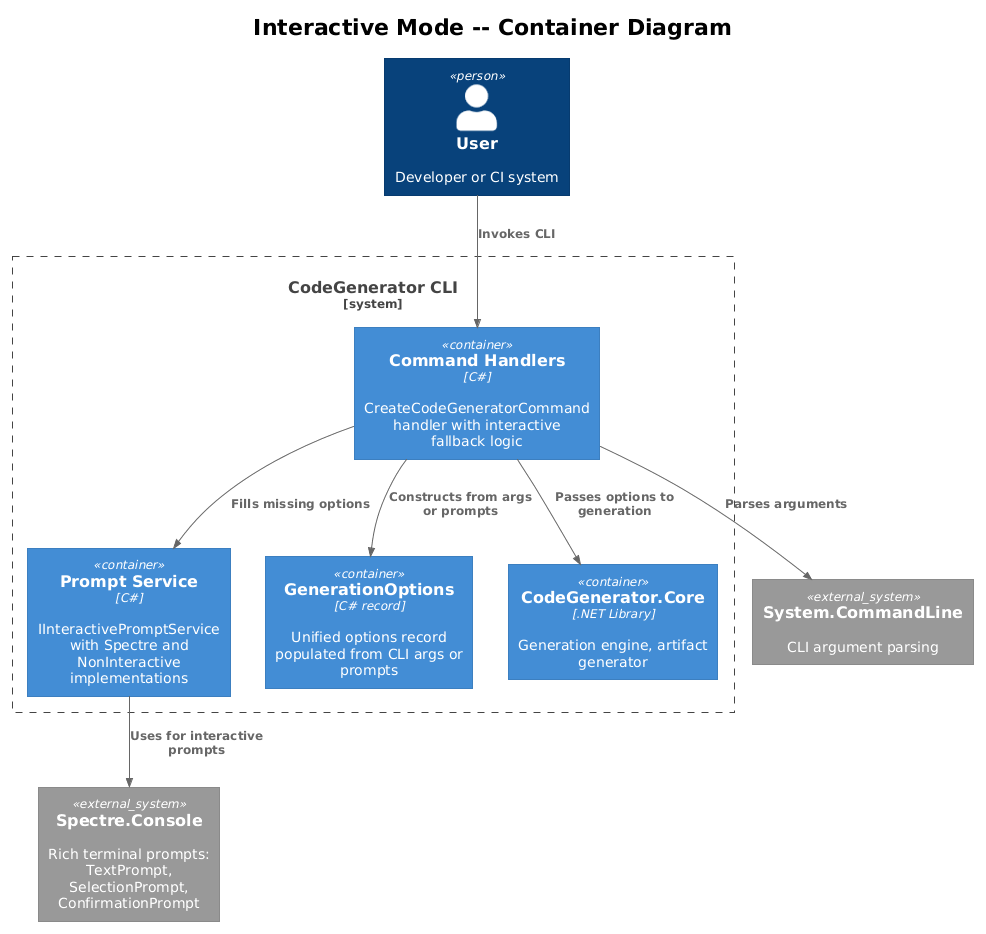
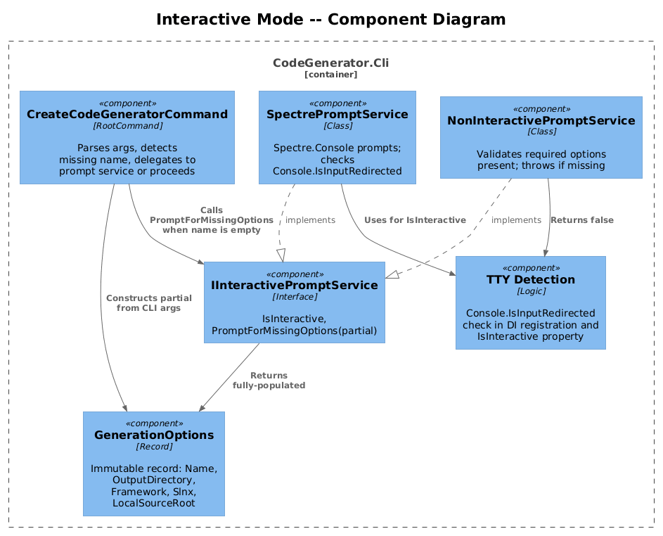
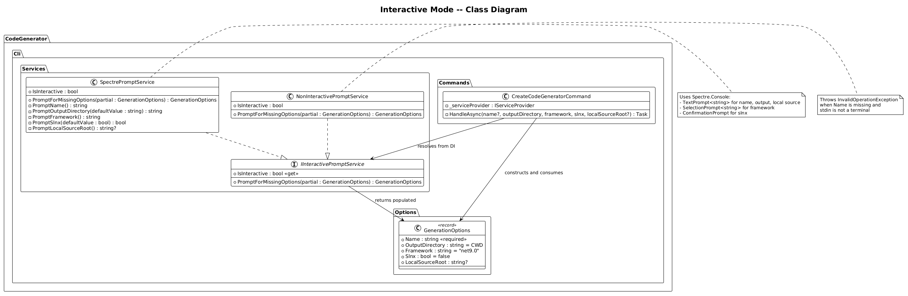
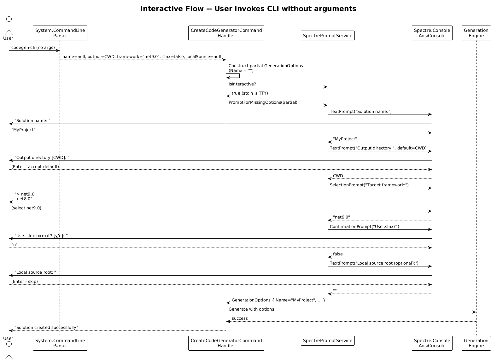
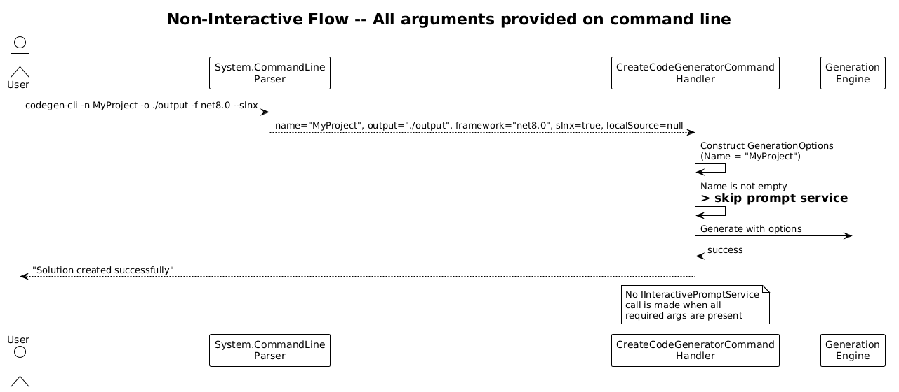
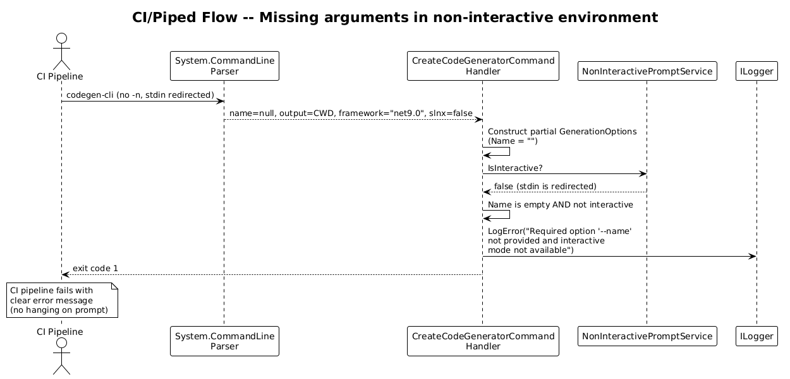

# Interactive Mode -- Detailed Design

**Feature:** 42-interactive-mode (Vision 1.5)
**Status:** Implemented
**Dependencies:** Feature 40 (Rich Console Output) for Spectre.Console integration

---

## 1. Overview

The CodeGenerator CLI currently requires all options to be passed as command-line arguments. If the required `-n/--name` option is omitted, System.CommandLine prints an error and usage text. There is no guided experience for users who are unfamiliar with the available options or who prefer a step-by-step questionnaire.

### Problem

- New users must read `--help` output or documentation to discover required and optional arguments.
- The CLI provides no interactive experience -- every invocation requires a fully-formed command string.
- In CI/CD pipelines or when stdin is piped, interactive prompts would block execution. There is no detection of terminal vs. non-terminal environments.

### Goal

When the CLI is invoked without required arguments and stdin is a terminal (TTY), enter an interactive questionnaire that prompts for:

1. Solution name (required)
2. Output directory (defaults to current directory)
3. Target framework (selection from supported values)
4. Solution format -- `.sln` vs `.slnx` (yes/no)
5. Local source root (optional path)

The interactive mode should:
- Be skipped entirely when stdin is not a terminal (piped, CI, redirected).
- Be skipped when all required arguments are already provided on the command line.
- Produce a `GenerationOptions` record that feeds into the same handler path as CLI arguments.

### Actors

| Actor | Description |
|-------|-------------|
| **Interactive User** | Developer at a terminal who invokes the CLI without arguments |
| **Scripted User** | CI pipeline or script that pipes arguments; must not be prompted |
| **CLI Handler** | Receives `GenerationOptions` from either CLI args or interactive prompts |

### Scope

This design covers the `IInteractivePromptService` abstraction, `SpectrePromptService` implementation, TTY detection, System.CommandLine middleware integration, and the `GenerationOptions` record. It does not cover interactive prompts for subcommands (`scaffold`, `install`) -- those can follow the same pattern later.

### Design Principles

- **Progressive disclosure.** Only prompt for values the user has not already provided on the command line.
- **Non-breaking.** Existing CLI invocations with all arguments continue to work identically.
- **Environment-aware.** Automatically detect non-interactive environments and fail fast with a clear error rather than hanging on a prompt.
- **Testable.** The prompt service is behind an interface, enabling unit tests with a fake implementation.

---

## 2. Architecture

### 2.1 C4 Context Diagram

Shows the interactive mode in the context of the CLI and the user's terminal.



### 2.2 C4 Container Diagram

The CLI container with the new interactive prompt service and its relationship to Spectre.Console.



### 2.3 C4 Component Diagram

Internal components: prompt service interface, implementations, TTY detector, middleware, and the `GenerationOptions` record.



---

## 3. Component Details

### 3.1 GenerationOptions

- **Responsibility:** Immutable record that holds all resolved option values for the `CreateCodeGeneratorCommand` handler. Populated from either CLI arguments or interactive prompts.
- **Namespace:** `CodeGenerator.Cli.Options`
- **Definition:**

```csharp
public record GenerationOptions
{
    public required string Name { get; init; }
    public string OutputDirectory { get; init; } = Directory.GetCurrentDirectory();
    public string Framework { get; init; } = "net9.0";
    public bool Slnx { get; init; } = false;
    public string? LocalSourceRoot { get; init; }
}
```

- **Usage:** Both the CLI argument path and the interactive prompt path produce a `GenerationOptions` instance. The handler consumes this record instead of individual parameters.

### 3.2 IInteractivePromptService

- **Responsibility:** Define the contract for collecting missing option values from the user interactively.
- **Namespace:** `CodeGenerator.Cli.Services`
- **Definition:**

```csharp
public interface IInteractivePromptService
{
    bool IsInteractive { get; }
    GenerationOptions PromptForMissingOptions(GenerationOptions partial);
}
```

- **Behavior:**
  - `IsInteractive` returns `true` when stdin is a TTY; `false` otherwise.
  - `PromptForMissingOptions` takes a partially-filled `GenerationOptions` (from CLI args) and prompts the user for any missing or default values. Returns a fully-populated record.

### 3.3 SpectrePromptService

- **Responsibility:** Implement `IInteractivePromptService` using Spectre.Console prompts.
- **Namespace:** `CodeGenerator.Cli.Services`
- **Package dependency:** `Spectre.Console` (already planned for Feature 40).
- **Prompt types used:**

| Prompt | Spectre.Console Type | When Shown |
|--------|---------------------|------------|
| Solution name | `TextPrompt<string>` with validation | When `Name` is null or empty |
| Output directory | `TextPrompt<string>` with default | Always (shows default, user can accept or change) |
| Target framework | `SelectionPrompt<string>` | Always (shows list: net8.0, net9.0) |
| Solution format | `ConfirmationPrompt` | Always ("Use .slnx format?") |
| Local source root | `TextPrompt<string?>` allowing empty | Always (optional, empty string means null) |

- **Implementation sketch:**

```csharp
public class SpectrePromptService : IInteractivePromptService
{
    public bool IsInteractive => !Console.IsInputRedirected;

    public GenerationOptions PromptForMissingOptions(GenerationOptions partial)
    {
        var name = partial.Name ?? AnsiConsole.Prompt(
            new TextPrompt<string>("Solution [green]name[/]:")
                .Validate(n => !string.IsNullOrWhiteSpace(n)
                    ? ValidationResult.Success()
                    : ValidationResult.Error("Name is required")));

        var output = AnsiConsole.Prompt(
            new TextPrompt<string>("Output [green]directory[/]:")
                .DefaultValue(partial.OutputDirectory));

        var framework = AnsiConsole.Prompt(
            new SelectionPrompt<string>()
                .Title("Target [green]framework[/]:")
                .AddChoices("net9.0", "net8.0"));

        var slnx = AnsiConsole.Confirm("Use [green].slnx[/] solution format?", partial.Slnx);

        var localSource = AnsiConsole.Prompt(
            new TextPrompt<string>("Local source root [grey](optional, press Enter to skip)[/]:")
                .AllowEmpty());

        return new GenerationOptions
        {
            Name = name,
            OutputDirectory = output,
            Framework = framework,
            Slnx = slnx,
            LocalSourceRoot = string.IsNullOrWhiteSpace(localSource) ? null : localSource,
        };
    }
}
```

### 3.4 NonInteractivePromptService

- **Responsibility:** Implementation used when stdin is not a terminal. Validates that all required options are present and throws if they are not.
- **Namespace:** `CodeGenerator.Cli.Services`
- **Behavior:**
  - `IsInteractive` always returns `false`.
  - `PromptForMissingOptions` checks that `Name` is not null/empty. If it is, throws `InvalidOperationException` with a message like `"Required option '--name' was not provided and interactive mode is not available (stdin is not a terminal)."` This prevents the CLI from hanging in CI environments.

```csharp
public class NonInteractivePromptService : IInteractivePromptService
{
    public bool IsInteractive => false;

    public GenerationOptions PromptForMissingOptions(GenerationOptions partial)
    {
        if (string.IsNullOrWhiteSpace(partial.Name))
        {
            throw new InvalidOperationException(
                "Required option '--name' was not provided and interactive mode is not available "
                + "(stdin is not a terminal). Provide all required options on the command line.");
        }

        return partial;
    }
}
```

### 3.5 TTY Detection

- **Mechanism:** `Console.IsInputRedirected` returns `true` when stdin is piped or redirected (CI, scripts, `echo | cli`). Returns `false` when stdin is an interactive terminal.
- **Location:** Checked inside `SpectrePromptService.IsInteractive` and also during DI registration to select the correct implementation.
- **Edge cases:**
  - Windows Terminal, PowerShell, cmd.exe: `IsInputRedirected == false` (interactive).
  - GitHub Actions, Azure DevOps: `IsInputRedirected == true` (non-interactive).
  - `echo "test" | codegen-cli`: `IsInputRedirected == true`.
  - Docker without `-it`: `IsInputRedirected == true`.

### 3.6 System.CommandLine Integration

Two integration approaches are considered. The recommended approach is **handler-level integration**.

**Approach A: Middleware (considered, not recommended)**

Register a `System.CommandLine` middleware that intercepts the parse result, detects missing required options, and invokes the prompt service to fill them in before the handler runs. This is complex because middleware operates on `ParseResult` and would need to mutate the parsed values.

**Approach B: Handler-level integration (recommended)**

Modify the `CreateCodeGeneratorCommand` handler to:

1. Construct a partial `GenerationOptions` from the parsed CLI arguments.
2. If the name is missing (null/empty), invoke `IInteractivePromptService.PromptForMissingOptions()`.
3. Use the fully-populated `GenerationOptions` for the rest of the handler.

This keeps System.CommandLine's `IsRequired = true` behavior intact for the non-interactive path (it will still show an error if invoked non-interactively without `--name`). For the interactive path, the `--name` option is made not required (or its validation is deferred).

**Resolution:** To make both paths work, change `IsRequired = false` on the name option and handle validation inside the handler:

```csharp
private async Task HandleAsync(string? name, string outputDirectory,
    string framework, bool slnx, string? localSourceRoot)
{
    var promptService = _serviceProvider.GetRequiredService<IInteractivePromptService>();

    var partial = new GenerationOptions
    {
        Name = name ?? string.Empty,
        OutputDirectory = outputDirectory,
        Framework = framework,
        Slnx = slnx,
        LocalSourceRoot = localSourceRoot,
    };

    GenerationOptions options;

    if (string.IsNullOrWhiteSpace(partial.Name) && promptService.IsInteractive)
    {
        options = promptService.PromptForMissingOptions(partial);
    }
    else if (string.IsNullOrWhiteSpace(partial.Name))
    {
        // Non-interactive and no name provided
        throw new InvalidOperationException("Required option '--name' was not provided.");
    }
    else
    {
        options = partial;
    }

    // Continue with options.Name, options.OutputDirectory, etc.
}
```

### 3.7 DI Registration

```csharp
// In Program.cs or a ConfigureServices extension method
if (!Console.IsInputRedirected)
{
    services.AddSingleton<IInteractivePromptService, SpectrePromptService>();
}
else
{
    services.AddSingleton<IInteractivePromptService, NonInteractivePromptService>();
}
```

---

## 4. Data Model

### 4.1 Class Diagram



### 4.2 Entity Descriptions

| Entity | Description |
|--------|-------------|
| `GenerationOptions` | Immutable record holding all resolved option values for code generation |
| `IInteractivePromptService` | Interface for collecting missing option values interactively |
| `SpectrePromptService` | Spectre.Console-based implementation with TextPrompt, SelectionPrompt, ConfirmationPrompt |
| `NonInteractivePromptService` | Non-TTY implementation that validates required options are present or throws |
| `CreateCodeGeneratorCommand` | Modified to construct GenerationOptions from args, then optionally invoke prompt service |

---

## 5. Key Workflows

### 5.1 Interactive Flow (no arguments provided)

User invokes the CLI without arguments at a terminal.



**Steps:**

1. User runs `codegen-cli` with no arguments.
2. System.CommandLine parses: `name = null`, other options get defaults.
3. Handler constructs a partial `GenerationOptions` with `Name = ""`.
4. Handler checks `promptService.IsInteractive` -- returns `true` (stdin is a TTY).
5. Handler calls `promptService.PromptForMissingOptions(partial)`.
6. `SpectrePromptService` prompts for solution name via `TextPrompt<string>`.
7. User types `"MyProject"`.
8. Service prompts for output directory with default shown.
9. User presses Enter to accept default.
10. Service prompts for framework via `SelectionPrompt` (net9.0, net8.0).
11. User selects `net9.0`.
12. Service prompts "Use .slnx format?" via `ConfirmationPrompt`.
13. User answers No.
14. Service prompts for local source root (optional).
15. User presses Enter to skip.
16. Service returns fully-populated `GenerationOptions`.
17. Handler proceeds with generation using the options.

### 5.2 Non-Interactive Flow (all arguments provided)

User invokes with all arguments -- no prompts shown.



**Steps:**

1. User runs `codegen-cli -n MyProject -o ./output -f net8.0 --slnx`.
2. System.CommandLine parses all arguments successfully.
3. Handler constructs `GenerationOptions` with all values populated.
4. Handler checks `Name` is not empty -- skips prompt service entirely.
5. Handler proceeds with generation.

### 5.3 CI/Piped Flow (missing arguments, non-interactive)

A script pipes input or runs in CI without required arguments.



**Steps:**

1. CI runs `codegen-cli` without `-n` and stdin is redirected.
2. System.CommandLine parses: `name = null`.
3. Handler constructs partial `GenerationOptions` with `Name = ""`.
4. Handler checks `promptService.IsInteractive` -- returns `false`.
5. Handler throws `InvalidOperationException` with message about missing `--name`.
6. Error is logged and CLI exits with non-zero code.
7. CI pipeline fails with a clear error message.

---

## 6. Open Questions

| # | Question | Context |
|---|----------|---------|
| 1 | Should the interactive questionnaire also run for subcommands (`scaffold`, `install`, `hello`, `enterprise-solution`) or only the root `create` command? | Starting with the root command keeps scope small. Subcommands can adopt the pattern later. |
| 2 | Should partial CLI arguments be pre-populated in the prompts (e.g., user provides `-f net8.0` but omits `-n`)? | Yes, the design supports this: `PromptForMissingOptions` receives a partial `GenerationOptions` and only prompts for missing values. |
| 3 | Should there be a `--no-interactive` flag to explicitly disable interactive mode even in a TTY? | Useful for testing and for users who want the traditional error-on-missing-args behavior. Easy to add as a boolean option. |
| 4 | Should framework choices be dynamically discovered (e.g., from installed SDKs) or hardcoded? | Hardcoded list is simpler. Dynamic discovery via `dotnet --list-sdks` is more accurate but slower. |
| 5 | How should Spectre.Console's `AnsiConsole` be abstracted for unit testing? | Spectre.Console supports `IAnsiConsole` injection. Tests can provide a `TestConsole` from Spectre.Console.Testing. |
| 6 | Should the prompt service validate input (e.g., directory exists, framework is supported) during prompting or defer to the handler? | Inline validation provides immediate feedback. The `TextPrompt.Validate()` API supports this natively. |
