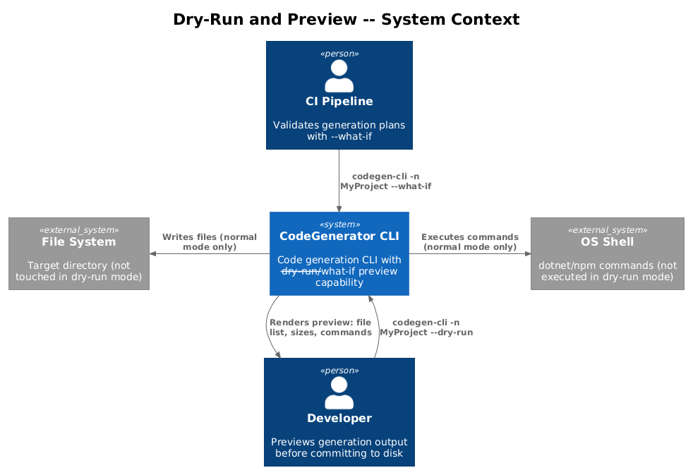
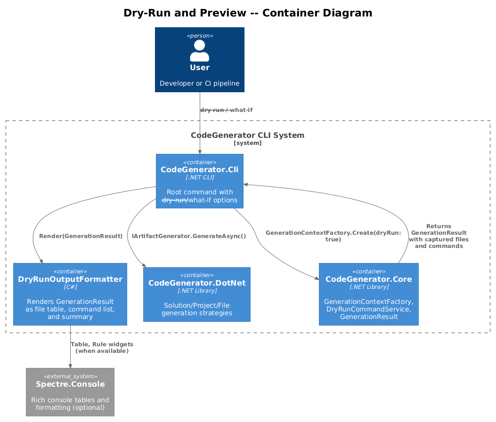
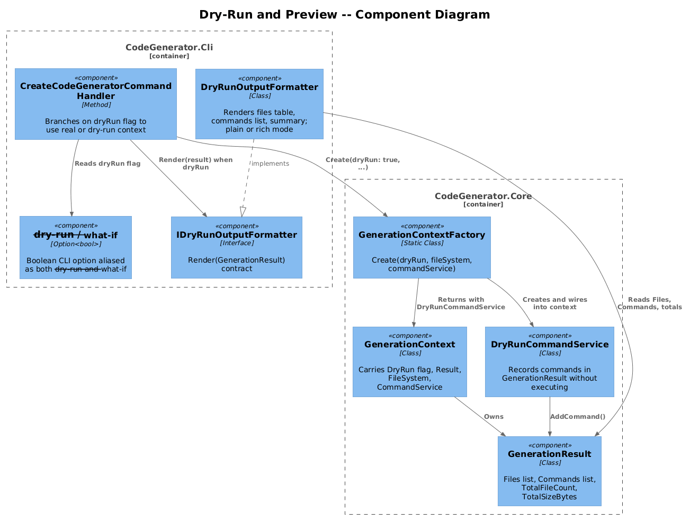
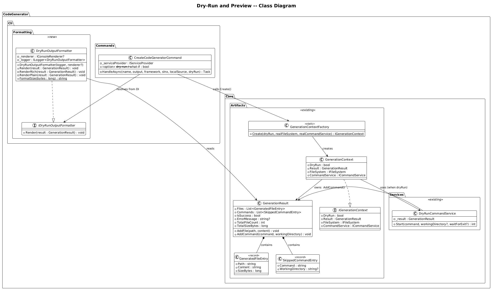
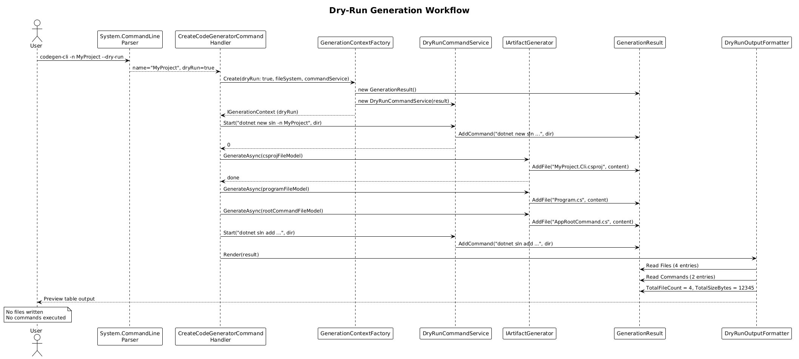
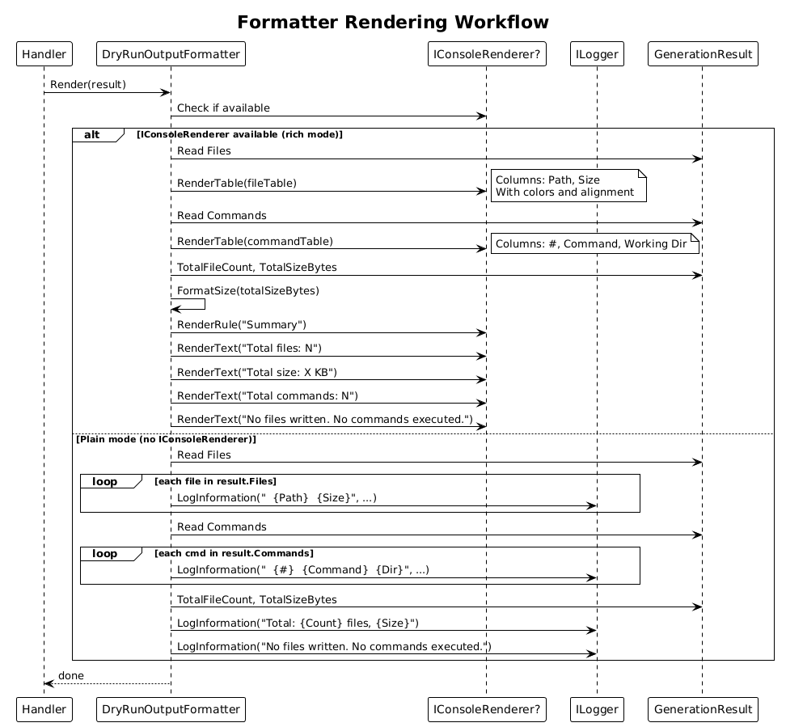

# Dry-Run and Preview -- Detailed Design

**Feature:** 43-dry-run-and-preview (Vision 1.6)
**Status:** Implemented
**Dependencies:** Feature 17 (Dry-Run Mode in Core), Feature 40 (Rich Console Output)

---

## 1. Overview

Feature 17 introduced the dry-run infrastructure in `CodeGenerator.Core` -- `GenerationContext`, `GenerationContextFactory`, `DryRunCommandService`, and `GenerationResult`. However, this capability is not yet wired into the CLI's `CreateCodeGeneratorCommand`. The `ScaffoldCommand` has its own `--dry-run` flag with a separate implementation. This feature bridges the gap by exposing `--dry-run` and `--what-if` flags on the root `CreateCodeGeneratorCommand` and rendering the preview output using a structured formatter.

### Problem

- The root command (`CreateCodeGeneratorCommand`) writes files and runs commands immediately with no preview option. Users cannot see what will be generated before committing.
- The existing `GenerationContextFactory.Create(dryRun: true, ...)` and `DryRunCommandService` in Core are fully functional but not invoked from the CLI handler.
- The `ScaffoldCommand` has a `--dry-run` flag but its preview output is minimal (just file paths via `LogInformation`). There is no structured formatting of file sizes, command lists, or summary totals.
- There is no `--what-if` alias, which is a common convention in PowerShell-style tools.

### Goal

1. Add `--dry-run` and `--what-if` option aliases to `CreateCodeGeneratorCommand`.
2. When active, use `GenerationContextFactory` to create a dry-run context with `DryRunCommandService`.
3. After generation completes, render the `GenerationResult` manifest as structured preview output showing files (with sizes), commands, and totals.
4. Integrate with the `IConsoleRenderer` from Feature 40 for rich table/tree output when available, with a plain-text fallback.

### Actors

| Actor | Description |
|-------|-------------|
| **Developer** | Runs `codegen-cli -n MyProject --dry-run` to preview output before generating |
| **CI Pipeline** | Runs with `--what-if` to validate generation plans without side-effects |
| **CLI Handler** | Creates dry-run or normal context based on the flag and renders results |

### Scope

This design covers the new CLI options, handler integration with `GenerationContextFactory`, the `DryRunOutputFormatter` component, and integration with Feature 40's `IConsoleRenderer`. It does not modify the Core dry-run infrastructure (Feature 17) which is already implemented.

### Design Principles

- **Reuse.** Leverage the existing `GenerationContextFactory`, `DryRunCommandService`, and `GenerationResult` from Core. No duplication of dry-run logic.
- **Transparent.** The same handler code path runs in both normal and dry-run modes. The only difference is the `IFileSystem` and `ICommandService` implementations injected via the context.
- **Rich output.** Preview should be informative: file paths, estimated sizes, commands with working directories, and a summary total.
- **Composable.** The formatter is a standalone component that can be reused by `ScaffoldCommand` and future commands.

---

## 2. Architecture

### 2.1 C4 Context Diagram

Shows the dry-run capability from the user's perspective.



### 2.2 C4 Container Diagram

The CLI container with the new dry-run options and formatter, building on the Core dry-run infrastructure.



### 2.3 C4 Component Diagram

Internal components: CLI options, handler branching, formatter, and integration with Core's GenerationContext.



---

## 3. Component Details

### 3.1 New CLI Options

Add `--dry-run` and `--what-if` as aliases for the same boolean option on `CreateCodeGeneratorCommand`:

```csharp
var dryRunOption = new Option<bool>(
    aliases: ["--dry-run", "--what-if"],
    description: "Preview what would be generated without writing files or running commands",
    getDefaultValue: () => false);

AddOption(dryRunOption);
```

The handler signature becomes:

```csharp
private async Task HandleAsync(string name, string outputDirectory,
    string framework, bool slnx, string? localSourceRoot, bool dryRun)
```

And the `SetHandler` call adds the new option:

```csharp
this.SetHandler(HandleAsync, nameOption, outputOption, frameworkOption,
    slnxOption, localSourceRootOption, dryRunOption);
```

### 3.2 Handler Integration with GenerationContextFactory

When `dryRun` is `true`, the handler creates a dry-run `IGenerationContext` instead of using the DI-provided real services:

```csharp
private async Task HandleAsync(string name, string outputDirectory,
    string framework, bool slnx, string? localSourceRoot, bool dryRun)
{
    var logger = _serviceProvider.GetRequiredService<ILogger<CreateCodeGeneratorCommand>>();
    var fileSystem = _serviceProvider.GetRequiredService<IFileSystem>();
    var realCommandService = _serviceProvider.GetRequiredService<ICommandService>();

    ICommandService commandService;
    GenerationResult? result = null;

    if (dryRun)
    {
        logger.LogInformation("Dry-run mode: previewing generation for '{Name}'", name);
        var context = GenerationContextFactory.Create(true, fileSystem, realCommandService);
        commandService = context.CommandService;  // DryRunCommandService
        result = context.Result;
    }
    else
    {
        commandService = realCommandService;
    }

    var artifactGenerator = _serviceProvider.GetRequiredService<IArtifactGenerator>();

    // ... existing generation logic using commandService ...
    // (Directory.CreateDirectory calls would also need to be captured;
    //  see section 3.5 for file size estimation approach)

    if (dryRun && result != null)
    {
        var formatter = _serviceProvider.GetRequiredService<IDryRunOutputFormatter>();
        formatter.Render(result);
    }
    else
    {
        logger.LogInformation("Solution created successfully at: {Path}", ...);
    }
}
```

### 3.3 IDryRunOutputFormatter

- **Responsibility:** Render a `GenerationResult` manifest as human-readable preview output.
- **Namespace:** `CodeGenerator.Cli.Formatting`
- **Interface:**

```csharp
public interface IDryRunOutputFormatter
{
    void Render(GenerationResult result);
}
```

### 3.4 DryRunOutputFormatter

- **Responsibility:** Default implementation that renders the preview to the console.
- **Namespace:** `CodeGenerator.Cli.Formatting`
- **Output format:**

```
DRY RUN PREVIEW
===============

Files that would be created (4 files, 12,345 bytes):

  Path                                                Size
  ----                                                ----
  MyProject/MyProject.sln                             1,024 B
  MyProject/src/MyProject.Cli/MyProject.Cli.csproj    2,048 B
  MyProject/src/MyProject.Cli/Program.cs              3,456 B
  MyProject/src/MyProject.Cli/Commands/AppRootCommand.cs  1,234 B

Commands that would be executed (2 commands):

  #  Command                                    Working Directory
  -  -------                                    -----------------
  1  dotnet new sln -n MyProject                MyProject/
  2  dotnet sln add src/MyProject.Cli/...       MyProject/

Summary:
  Total files:    4
  Total size:     12,345 bytes (12.1 KB)
  Total commands: 2

No files were written. No commands were executed.
```

- **Rich mode (when IConsoleRenderer is available):** If Feature 40's `IConsoleRenderer` / Spectre.Console is available, the formatter uses `Table`, `Tree`, and `Rule` widgets for a richer presentation with colors and alignment.
- **Plain mode:** When the console does not support ANSI (e.g., redirected output), falls back to the plain text format above.

### 3.5 File Size Estimation

`GenerationResult.AddFile(path, content)` already computes `Encoding.UTF8.GetByteCount(content)` and stores it in `GeneratedFileEntry.SizeBytes`. This means:

- For files generated via `IArtifactGenerator.GenerateAsync()` with `ContentFileModel`, the content string is available and the byte count is exact.
- For files generated via templates (`ITemplateProcessor`), the rendered content is captured.
- Commands like `dotnet new sln` that would create files on disk do not produce file entries in dry-run mode (since `DryRunCommandService` only records the command string). These "command-generated files" are noted in the output as "additional files created by commands (not tracked)."

**Size formatting helper:**

```csharp
internal static string FormatSize(long bytes) => bytes switch
{
    < 1024 => $"{bytes} B",
    < 1024 * 1024 => $"{bytes / 1024.0:F1} KB",
    _ => $"{bytes / (1024.0 * 1024.0):F1} MB",
};
```

### 3.6 Integration with IConsoleRenderer (Feature 40)

The `DryRunOutputFormatter` accepts an optional `IConsoleRenderer` via constructor injection. When available, it uses rich rendering:

```csharp
public class DryRunOutputFormatter : IDryRunOutputFormatter
{
    private readonly IConsoleRenderer? _renderer;
    private readonly ILogger<DryRunOutputFormatter> _logger;

    public DryRunOutputFormatter(
        ILogger<DryRunOutputFormatter> logger,
        IConsoleRenderer? renderer = null)
    {
        _logger = logger;
        _renderer = renderer;
    }

    public void Render(GenerationResult result)
    {
        if (_renderer != null)
        {
            RenderRich(result);
        }
        else
        {
            RenderPlain(result);
        }
    }
}
```

When `IConsoleRenderer` is not registered (Feature 40 not yet implemented), the formatter falls back to plain `ILogger` output.

### 3.7 Unifying with ScaffoldCommand's --dry-run

The existing `ScaffoldCommand` has its own `--dry-run` flag and inline preview rendering. Once `IDryRunOutputFormatter` is available, the scaffold handler can delegate to it:

```csharp
// In ScaffoldCommand.HandleAsync, replace:
//   logger.LogInformation("  {Action}: {Path}", file.Action, file.Path);
// With:
//   formatter.Render(scaffoldResult.ToGenerationResult());
```

This provides a consistent preview experience across all commands.

### 3.8 DI Registration

```csharp
// In AddCliServices() or Program.cs
services.AddSingleton<IDryRunOutputFormatter, DryRunOutputFormatter>();
```

---

## 4. Data Model

### 4.1 Class Diagram



### 4.2 Entity Descriptions

| Entity | Description |
|--------|-------------|
| `--dry-run / --what-if` | Boolean CLI option aliases on CreateCodeGeneratorCommand |
| `GenerationContextFactory` | (Existing, Core) Creates IGenerationContext with real or dry-run providers |
| `IGenerationContext` | (Existing, Core) Carries DryRun flag, Result, FileSystem, CommandService |
| `GenerationResult` | (Existing, Core) Manifest of files and commands captured during generation |
| `GeneratedFileEntry` | (Existing, Core) Record: Path, Content, SizeBytes |
| `SkippedCommandEntry` | (Existing, Core) Record: Command, WorkingDirectory |
| `DryRunCommandService` | (Existing, Core) Captures commands without executing |
| `IDryRunOutputFormatter` | (New, CLI) Interface for rendering GenerationResult as preview output |
| `DryRunOutputFormatter` | (New, CLI) Implementation with plain and rich rendering modes |

---

## 5. Key Workflows

### 5.1 Dry-Run Generation Workflow

User invokes the CLI with `--dry-run` to preview what would be generated.



**Steps:**

1. User runs `codegen-cli -n MyProject --dry-run`.
2. System.CommandLine parses arguments; `dryRun = true`.
3. Handler calls `GenerationContextFactory.Create(dryRun: true, fileSystem, commandService)`.
4. Factory creates `GenerationResult`, wraps it in `DryRunCommandService`, returns `IGenerationContext`.
5. Handler uses `context.CommandService` (DryRunCommandService) for all command execution.
6. Handler calls `commandService.Start("dotnet new sln -n MyProject", dir)` -- command is captured, not executed.
7. Handler calls `artifactGenerator.GenerateAsync(contentFileModel)` -- file content is captured in `context.Result.Files`.
8. Handler calls `commandService.Start("dotnet sln add ...")` -- command captured.
9. Generation loop completes.
10. Handler resolves `IDryRunOutputFormatter` and calls `formatter.Render(context.Result)`.
11. Formatter outputs file table, command table, and summary to console.
12. CLI exits with code 0.

### 5.2 Normal (Non-Dry-Run) Workflow

When `--dry-run` is not specified, the handler proceeds with real file system and command service, unchanged from current behavior. The `GenerationContextFactory` is not called, and no formatter rendering occurs.

### 5.3 What-If Alias Workflow

`--what-if` is a pure alias for `--dry-run`. Both flags set the same `bool dryRun` parameter. This provides familiarity for PowerShell users who expect `--what-if` semantics.

### 5.4 Formatter Rendering Workflow

Shows how the formatter renders the GenerationResult.



**Steps:**

1. Handler calls `formatter.Render(result)`.
2. Formatter checks if `IConsoleRenderer` is available.
3. If rich mode: creates Spectre.Console `Table` for files, `Table` for commands, `Rule` for summary.
4. If plain mode: iterates `result.Files` and `result.Commands`, writes formatted lines via `ILogger`.
5. Formatter computes `FormatSize(result.TotalSizeBytes)` for the summary.
6. Formatter outputs "No files were written. No commands were executed." confirmation.

---

## 6. Open Questions

| # | Question | Context |
|---|----------|---------|
| 1 | Should `--dry-run` also intercept `Directory.CreateDirectory` calls in the handler? | The current handler calls `Directory.CreateDirectory` directly (not through `IFileSystem`). These calls would need to be routed through `context.FileSystem.Directory.CreateDirectory` for dry-run to fully suppress side-effects. This is a handler refactor. |
| 2 | Should the dry-run output include files that would be created by captured commands (e.g., `dotnet new sln` creates a `.sln` file)? | These files are not tracked in `GenerationResult` since the commands are not executed. The formatter could note "N commands would create additional files not listed above." |
| 3 | Should `--dry-run` output be machine-readable (JSON) in addition to human-readable? | A `--dry-run --output-format json` option would be useful for CI pipelines that want to parse the manifest programmatically. |
| 4 | Should `--dry-run` set the CLI exit code to a distinct value (e.g., 2) to distinguish "dry-run completed" from "generation completed"? | Exit code 0 for both is conventional. A distinct code could help CI scripts differentiate. |
| 5 | How should the handler be refactored to use `IFileSystem` for all file system operations instead of `Directory.CreateDirectory` and `File.*`? | Currently, the handler mixes `Directory.CreateDirectory` (static System.IO) with `IArtifactGenerator` (which uses `IFileSystem`). For dry-run to be complete, all I/O should go through `IFileSystem`. |
| 6 | Should the `ScaffoldCommand` be migrated to use `IDryRunOutputFormatter` in this feature, or in a separate follow-up? | Migrating scaffold in the same feature ensures consistency. It is a small change since the formatter is already built. |
