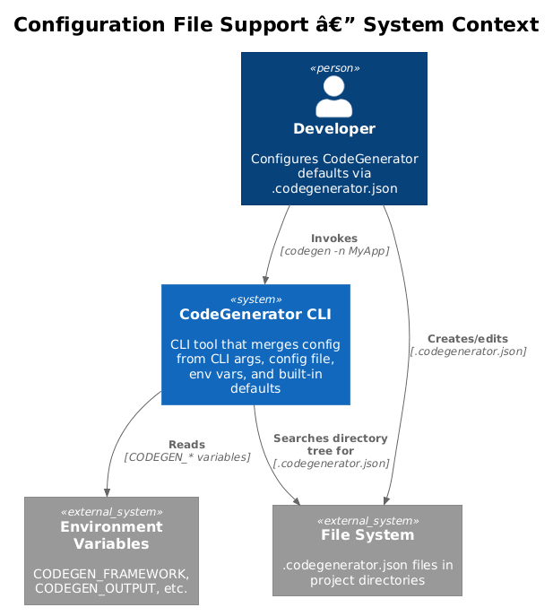
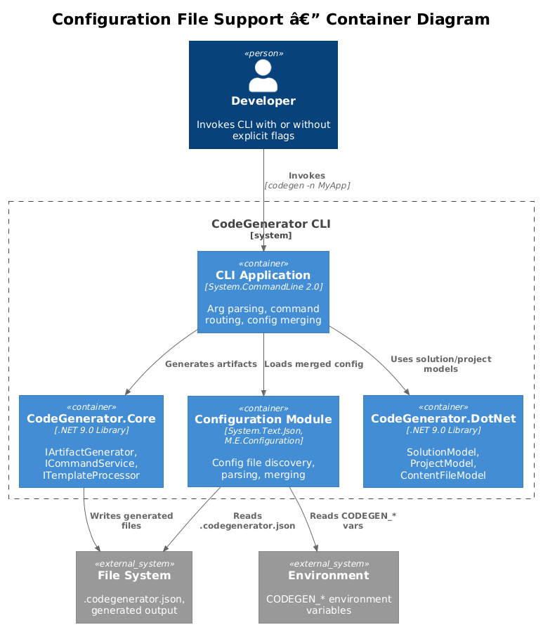
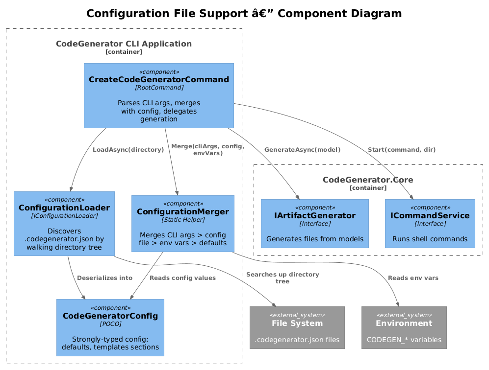
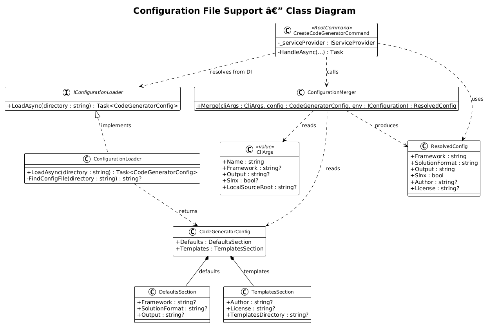
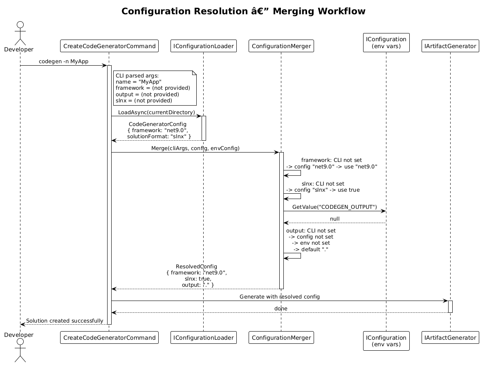
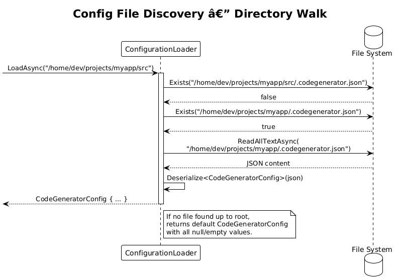

# Configuration File Support — Detailed Design

**Status:** Implemented
**Feature:** 44

## 1. Overview

This feature introduces a `.codegenerator.json` project-level configuration file that allows developers to set persistent defaults for the CodeGenerator CLI. Instead of passing options like `--framework`, `--output`, and `--slnx` on every invocation, developers can store these preferences in a config file that lives alongside their project.

The configuration follows a well-defined resolution order: CLI arguments take highest priority, followed by `.codegenerator.json` values, then environment variables, and finally built-in defaults. This mirrors the pattern used by tools like `.eslintrc.json`, `tsconfig.json`, and `.editorconfig`.

**Actors:** Developer — creates a `.codegenerator.json` file in their project directory to customize CodeGenerator behavior without repeating CLI flags.

**Scope:** The `CodeGeneratorConfig` model, `IConfigurationLoader` interface and implementation, configuration merging logic, integration with the existing `IConfiguration` pipeline in `Program.cs`, and the JSON schema for validation. This covers vision item 1.7 from `codegenerator-cli-vision.md`.

## 2. Architecture

### 2.1 C4 Context Diagram

Shows the configuration file support in its broader ecosystem — the developer, file system, and the CodeGenerator CLI.



The developer either creates a `.codegenerator.json` file manually or uses a future `codegen init` command. The CLI searches up the directory tree for this file and merges its values with CLI arguments and environment variables.

### 2.2 C4 Container Diagram

Shows how the configuration loader integrates with the existing CLI application, DI container, and Microsoft.Extensions.Configuration pipeline.



| Container | Technology | Responsibility |
|-----------|------------|----------------|
| CLI Application | System.CommandLine 2.0 | Arg parsing, command routing, handler orchestration |
| Configuration Module | Microsoft.Extensions.Configuration, System.Text.Json | Config file discovery, parsing, merging with other sources |
| CodeGenerator.Core | .NET 9.0 Library | `IArtifactGenerator`, `ICommandService`, `ITemplateProcessor` |
| CodeGenerator.DotNet | .NET 9.0 Library | `SolutionModel`, `ProjectModel`, `ContentFileModel` |

### 2.3 C4 Component Diagram

Shows the internal components within the Configuration module and their interactions with the CLI commands and DI container.



## 3. Component Details

### 3.1 CodeGeneratorConfig — Configuration Model

- **Responsibility:** Strongly-typed model representing the contents of `.codegenerator.json`. Provides a typed surface over the raw JSON.
- **Namespace:** `CodeGenerator.Cli.Configuration`

```csharp
public class CodeGeneratorConfig
{
    public DefaultsSection Defaults { get; set; } = new();
    public TemplatesSection Templates { get; set; } = new();
}

public class DefaultsSection
{
    public string? Framework { get; set; }
    public string? SolutionFormat { get; set; }  // "sln" or "slnx"
    public string? Output { get; set; }
}

public class TemplatesSection
{
    public string? Author { get; set; }
    public string? License { get; set; }
    public string? TemplatesDirectory { get; set; }
}
```

### 3.2 IConfigurationLoader — Configuration Discovery

- **Responsibility:** Discovers and loads `.codegenerator.json` by searching up the directory tree from a starting directory. Returns a parsed `CodeGeneratorConfig` or a default instance if no file is found.
- **Interface:**

```csharp
public interface IConfigurationLoader
{
    Task<CodeGeneratorConfig> LoadAsync(string directory);
}
```

- **Contract:**
  - Searches the given `directory` for `.codegenerator.json`
  - If not found, walks up parent directories until the file system root
  - If no file is found anywhere, returns a `CodeGeneratorConfig` with all defaults (null/empty)
  - If found, deserializes using `System.Text.Json` with case-insensitive property matching

### 3.3 ConfigurationLoader — Implementation

- **Responsibility:** Implements `IConfigurationLoader` with directory-tree traversal and JSON deserialization.
- **Dependencies:** `IFileSystem` (from System.IO.Abstractions, if available, or direct `File`/`Directory` calls)
- **Namespace:** `CodeGenerator.Cli.Configuration`

```csharp
public class ConfigurationLoader : IConfigurationLoader
{
    public async Task<CodeGeneratorConfig> LoadAsync(string directory)
    {
        var current = new DirectoryInfo(directory);

        while (current != null)
        {
            var configPath = Path.Combine(current.FullName, ".codegenerator.json");

            if (File.Exists(configPath))
            {
                var json = await File.ReadAllTextAsync(configPath);
                return JsonSerializer.Deserialize<CodeGeneratorConfig>(json, _options)
                    ?? new CodeGeneratorConfig();
            }

            current = current.Parent;
        }

        return new CodeGeneratorConfig();
    }
}
```

### 3.4 Configuration Merging Logic

- **Responsibility:** Merges values from four sources in priority order: CLI arguments > `.codegenerator.json` > environment variables > built-in defaults.
- **Location:** Inside `CreateCodeGeneratorCommand.HandleAsync` (or extracted into a `ConfigurationMerger` helper)
- **Merging Rules:**
  - A CLI argument is considered "provided" if it differs from the System.CommandLine default (tracked via `ParseResult`)
  - Config file values are used when the CLI argument was not explicitly provided
  - Environment variables (`CODEGEN_FRAMEWORK`, `CODEGEN_OUTPUT`, etc.) fill gaps not covered by CLI or config file
  - Built-in defaults (`net9.0`, `false` for slnx, current directory for output) are the final fallback

| Setting | CLI Flag | Config Path | Env Var | Built-in Default |
|---------|----------|-------------|---------|------------------|
| Framework | `-f / --framework` | `defaults.framework` | `CODEGEN_FRAMEWORK` | `net9.0` |
| Solution Format | `--slnx` | `defaults.solutionFormat` | `CODEGEN_SOLUTION_FORMAT` | `sln` |
| Output | `-o / --output` | `defaults.output` | `CODEGEN_OUTPUT` | Current directory |
| Author | (future) | `templates.author` | `CODEGEN_AUTHOR` | (none) |
| License | (future) | `templates.license` | `CODEGEN_LICENSE` | `MIT` |

### 3.5 Integration with Program.cs

- **Responsibility:** Wire the `IConfigurationLoader` into the DI container and extend the `IConfiguration` pipeline.
- **Changes to `Program.cs`:**

```csharp
var configuration = new ConfigurationBuilder()
    .AddJsonFile(".codegenerator.json", optional: true, reloadOnChange: false)
    .AddEnvironmentVariables(prefix: "CODEGEN_")
    .Build();

services.AddSingleton<IConfigurationLoader, ConfigurationLoader>();
```

- The `IConfigurationLoader` is used for the directory-tree search at command execution time, while the `IConfiguration` pipeline handles the standard Microsoft configuration pattern.

### 3.6 JSON Schema for .codegenerator.json

The schema provides IDE intellisense and validation. It is referenced via the `$schema` property.

```json
{
  "$schema": "https://json-schema.org/draft/2020-12/schema",
  "title": "CodeGenerator Configuration",
  "type": "object",
  "properties": {
    "$schema": { "type": "string" },
    "defaults": {
      "type": "object",
      "properties": {
        "framework": {
          "type": "string",
          "enum": ["net8.0", "net9.0", "net10.0"],
          "default": "net9.0"
        },
        "solutionFormat": {
          "type": "string",
          "enum": ["sln", "slnx"],
          "default": "sln"
        },
        "output": {
          "type": "string",
          "description": "Default output directory (relative or absolute)"
        }
      }
    },
    "templates": {
      "type": "object",
      "properties": {
        "author": { "type": "string" },
        "license": { "type": "string", "default": "MIT" },
        "templatesDirectory": {
          "type": "string",
          "description": "Path to custom Liquid template overrides"
        }
      }
    }
  }
}
```

## 4. Data Model

The class diagram shows the configuration model, loader interface, and how they integrate with the existing command structure.



## 5. Key Workflows

### 5.1 Configuration Loading and Merging

Shows the full resolution flow when a developer invokes the CLI — how CLI args, config file, env vars, and defaults are merged.



### 5.2 Config File Discovery (Directory Walk)

Shows how the `ConfigurationLoader` searches up the directory tree.



## 6. Example .codegenerator.json

```json
{
  "$schema": "https://raw.githubusercontent.com/QuinntyneBrown/CodeGenerator/main/schemas/codegenerator-config.schema.json",
  "defaults": {
    "framework": "net9.0",
    "solutionFormat": "slnx",
    "output": "./generated"
  },
  "templates": {
    "author": "Quinntyne Brown",
    "license": "MIT"
  }
}
```

## 7. Open Questions

1. **Should `codegen init` create the config file?** A future `init` subcommand could generate a starter `.codegenerator.json` with sensible defaults, similar to `npm init` or `dotnet new`.
2. **Global vs. project config:** Should there also be a `~/.codegenerator/config.json` for machine-wide defaults? The merging order would become: CLI > project > global > env > defaults.
3. **Config file name:** `.codegenerator.json` vs `.codegen.json` vs `codegenerator.config.json`. The dot-prefix convention signals a tool config file.
4. **Relative path resolution:** When `defaults.output` is a relative path, should it be relative to the config file location or the current working directory? Recommendation: relative to the config file location, matching how `.editorconfig` works.
5. **Schema hosting:** Where should the JSON schema be hosted for `$schema` references? Options: GitHub raw URL, npm package, or embedded in the CLI itself.
