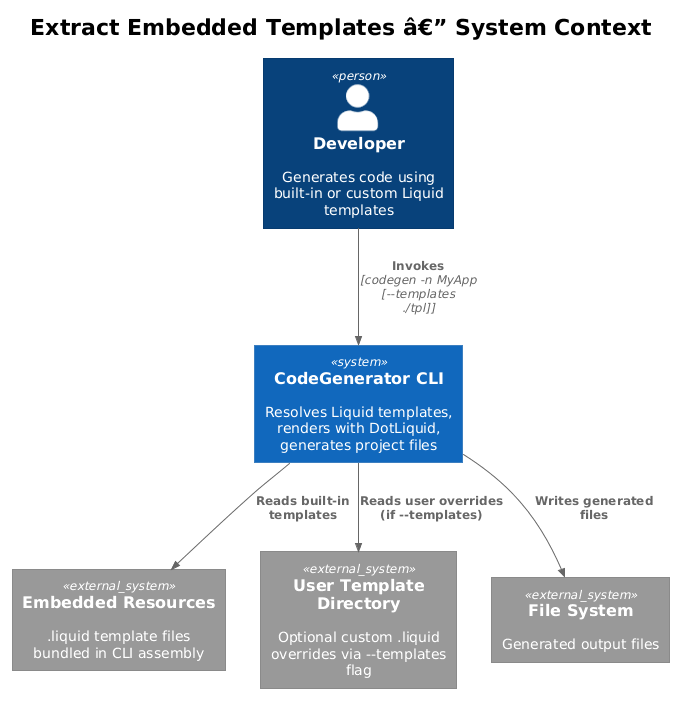
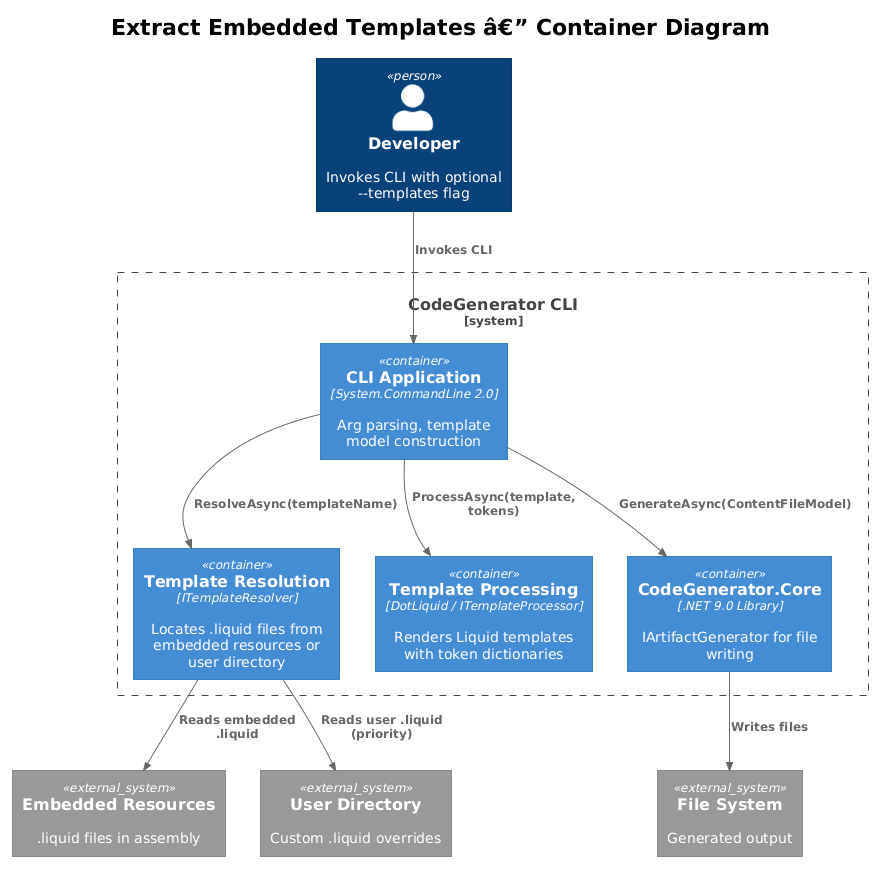
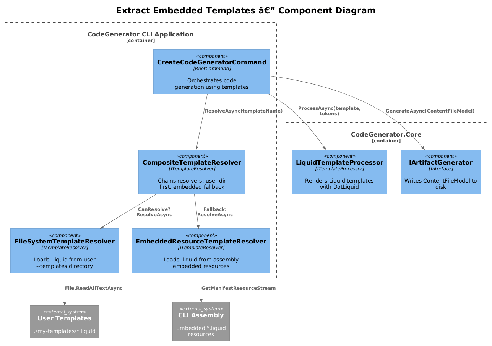
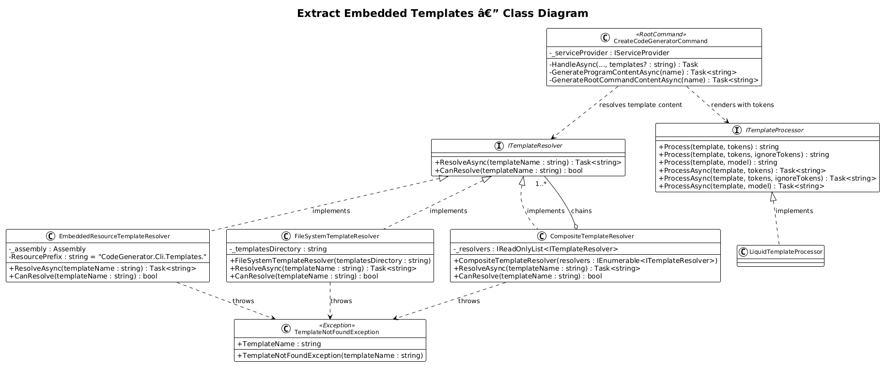
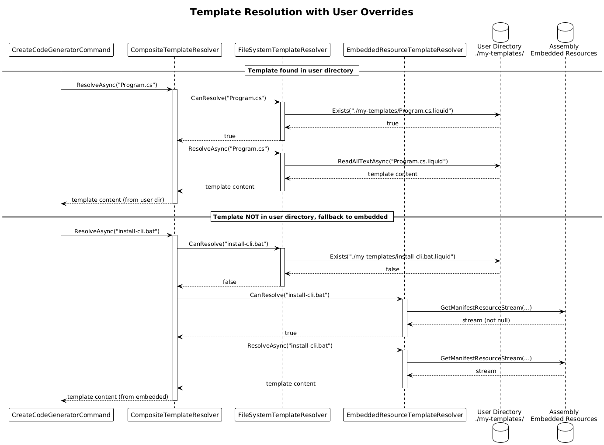
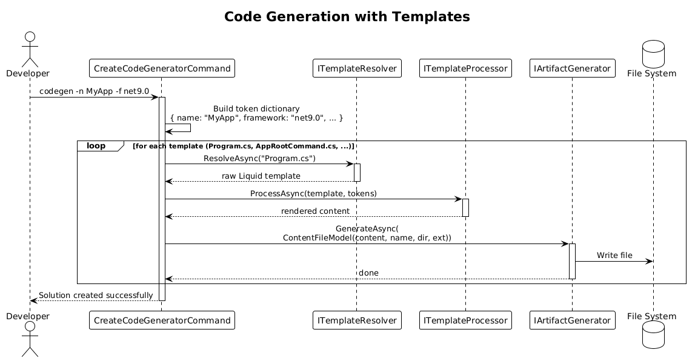

# Extract Embedded Templates — Detailed Design

**Status:** Implemented
**Feature:** 45

## 1. Overview

The `CreateCodeGeneratorCommand` currently contains 500+ lines of embedded C# string templates built with interpolated strings (`$@"..."`). Methods like `GenerateProgramContent(name)`, `GenerateRootCommandContent(name)`, `GenerateCliProjectContent(...)`, and others return large string blocks that are difficult to maintain, lack syntax highlighting, and cannot be customized by users.

This feature extracts those templates into proper Liquid (`.liquid`) files stored as embedded resources in the assembly. It introduces an `ITemplateResolver` abstraction that locates templates either from embedded resources (default) or from a user-provided directory (via a new `--templates` flag). The existing `ITemplateProcessor` / `LiquidTemplateProcessor` pipeline handles rendering, so no new template engine is needed.

**Actors:** Developer — invokes `codegen -n MyApp` (uses built-in templates) or `codegen -n MyApp --templates ./my-templates` (uses custom template overrides).

**Scope:** Template file extraction, `ITemplateResolver` abstraction and its implementations, migration of `Generate*Content` methods to use `ITemplateProcessor.ProcessAsync`, the new `--templates` CLI option, and embedded resource configuration in the `.csproj`. This covers vision item 1.8 from `codegenerator-cli-vision.md`.

## 2. Architecture

### 2.1 C4 Context Diagram

Shows the template resolution system in context — the developer, the CLI, embedded resources, and optional user template directory.



The developer invokes the CLI. Templates are resolved first from a user-provided directory (if `--templates` is specified), then from embedded resources bundled in the assembly.

### 2.2 C4 Container Diagram

Shows how the template resolver sits between the CLI commands and the template processor.



| Container | Technology | Responsibility |
|-----------|------------|----------------|
| CLI Application | System.CommandLine 2.0 | Arg parsing, command routing, template model construction |
| Template Resolution | Embedded Resources, File System | Locates `.liquid` template files from embedded resources or user directory |
| Template Processing | DotLiquid via `ITemplateProcessor` | Renders Liquid templates with token dictionaries |
| CodeGenerator.Core | .NET 9.0 Library | `IArtifactGenerator`, `ITemplateProcessor`, `LiquidTemplateProcessor` |

### 2.3 C4 Component Diagram

Shows the internal components: resolvers, processors, and their relationship to the CLI commands.



## 3. Component Details

### 3.1 Template File Structure

Templates are stored as embedded resources under a `Templates/` folder in the `CodeGenerator.Cli` project:

```
src/CodeGenerator.Cli/
  Templates/
    Program.cs.liquid
    AppRootCommand.cs.liquid
    HelloWorldCommand.cs.liquid
    EnterpriseSolutionCommand.cs.liquid
    CliProject.csproj.liquid
    install-cli.bat.liquid
```

Each `.liquid` file uses DotLiquid syntax with tokens like `{{ name }}`, `{{ framework }}`, `{{ package_references }}`, etc.

The `.csproj` includes them as embedded resources:

```xml
<ItemGroup>
  <EmbeddedResource Include="Templates\**\*.liquid" />
</ItemGroup>
```

### 3.2 ITemplateResolver — Template Location Abstraction

- **Responsibility:** Resolves a template by name, returning its raw Liquid content string. Decouples template location from template rendering.
- **Namespace:** `CodeGenerator.Cli.Templates`

```csharp
public interface ITemplateResolver
{
    Task<string> ResolveAsync(string templateName);
    bool CanResolve(string templateName);
}
```

- **Contract:**
  - `templateName` uses a simple name like `"Program.cs"` — the resolver appends `.liquid` and handles path/resource logic
  - Returns the raw template content as a string
  - Throws `TemplateNotFoundException` if the template cannot be found
  - `CanResolve` allows checking availability without exception cost

### 3.3 EmbeddedResourceTemplateResolver

- **Responsibility:** Resolves templates from assembly embedded resources.
- **Namespace:** `CodeGenerator.Cli.Templates`

```csharp
public class EmbeddedResourceTemplateResolver : ITemplateResolver
{
    private readonly Assembly _assembly;
    private const string ResourcePrefix = "CodeGenerator.Cli.Templates.";

    public EmbeddedResourceTemplateResolver()
    {
        _assembly = typeof(EmbeddedResourceTemplateResolver).Assembly;
    }

    public async Task<string> ResolveAsync(string templateName)
    {
        var resourceName = $"{ResourcePrefix}{templateName}.liquid";
        using var stream = _assembly.GetManifestResourceStream(resourceName)
            ?? throw new TemplateNotFoundException(templateName);
        using var reader = new StreamReader(stream);
        return await reader.ReadToEndAsync();
    }

    public bool CanResolve(string templateName)
    {
        var resourceName = $"{ResourcePrefix}{templateName}.liquid";
        return _assembly.GetManifestResourceStream(resourceName) != null;
    }
}
```

### 3.4 FileSystemTemplateResolver

- **Responsibility:** Resolves templates from a user-provided directory on disk, specified via `--templates`.
- **Namespace:** `CodeGenerator.Cli.Templates`

```csharp
public class FileSystemTemplateResolver : ITemplateResolver
{
    private readonly string _templatesDirectory;

    public FileSystemTemplateResolver(string templatesDirectory)
    {
        _templatesDirectory = templatesDirectory;
    }

    public async Task<string> ResolveAsync(string templateName)
    {
        var filePath = Path.Combine(_templatesDirectory, $"{templateName}.liquid");
        if (!File.Exists(filePath))
            throw new TemplateNotFoundException(templateName);
        return await File.ReadAllTextAsync(filePath);
    }

    public bool CanResolve(string templateName)
    {
        var filePath = Path.Combine(_templatesDirectory, $"{templateName}.liquid");
        return File.Exists(filePath);
    }
}
```

### 3.5 CompositeTemplateResolver

- **Responsibility:** Chains multiple resolvers with priority ordering. Checks the user directory first (if provided), then falls back to embedded resources.
- **Namespace:** `CodeGenerator.Cli.Templates`

```csharp
public class CompositeTemplateResolver : ITemplateResolver
{
    private readonly IReadOnlyList<ITemplateResolver> _resolvers;

    public CompositeTemplateResolver(IEnumerable<ITemplateResolver> resolvers)
    {
        _resolvers = resolvers.ToList();
    }

    public async Task<string> ResolveAsync(string templateName)
    {
        foreach (var resolver in _resolvers)
        {
            if (resolver.CanResolve(templateName))
                return await resolver.ResolveAsync(templateName);
        }
        throw new TemplateNotFoundException(templateName);
    }

    public bool CanResolve(string templateName)
    {
        return _resolvers.Any(r => r.CanResolve(templateName));
    }
}
```

### 3.6 Migration of Generate*Content Methods

Each `Generate*Content` method in `CreateCodeGeneratorCommand` is replaced by a template resolve + process call. For example, `GenerateProgramContent(name)` becomes:

**Before:**
```csharp
private static string GenerateProgramContent(string name) => $@"using {name}.Cli.Commands;
using CodeGenerator.Angular;
...
";
```

**After:**
```csharp
private async Task<string> GenerateProgramContentAsync(string name)
{
    var template = await _templateResolver.ResolveAsync("Program.cs");
    var tokens = new Dictionary<string, object>
    {
        { "name", name }
    };
    return await _templateProcessor.ProcessAsync(template, tokens);
}
```

**Corresponding `Program.cs.liquid`:**
```liquid
using {{ name }}.Cli.Commands;
using CodeGenerator.Angular;
using CodeGenerator.Core;
using CodeGenerator.Flask;
using CodeGenerator.React;
using Microsoft.Extensions.Configuration;
using Microsoft.Extensions.DependencyInjection;
using Microsoft.Extensions.Logging;
using System.CommandLine;

var configuration = new ConfigurationBuilder()
    .AddEnvironmentVariables()
    .Build();

var services = new ServiceCollection();
// ... rest of template with {{ name }} tokens
```

### 3.7 New --templates Option

Added to `CreateCodeGeneratorCommand`:

```csharp
var templatesOption = new Option<string?>(
    aliases: ["--templates"],
    description: "Path to custom Liquid template directory (overrides built-in templates)");

AddOption(templatesOption);
```

When provided, the `CompositeTemplateResolver` is constructed with a `FileSystemTemplateResolver` (for the user directory) followed by the `EmbeddedResourceTemplateResolver` (fallback).

### 3.8 DI Registration

```csharp
// In Program.cs or a service registration extension
if (templatesDir != null)
{
    services.AddSingleton<ITemplateResolver>(sp =>
        new CompositeTemplateResolver(new ITemplateResolver[]
        {
            new FileSystemTemplateResolver(templatesDir),
            new EmbeddedResourceTemplateResolver()
        }));
}
else
{
    services.AddSingleton<ITemplateResolver, EmbeddedResourceTemplateResolver>();
}
```

### 3.9 TemplateNotFoundException

```csharp
public class TemplateNotFoundException : Exception
{
    public string TemplateName { get; }

    public TemplateNotFoundException(string templateName)
        : base($"Template '{templateName}' was not found in any configured resolver.")
    {
        TemplateName = templateName;
    }
}
```

## 4. Data Model

The class diagram shows the resolver hierarchy, template processor integration, and the migrated command structure.



## 5. Key Workflows

### 5.1 Template Resolution with User Overrides

Shows the full flow when `--templates` is provided — the composite resolver checks the user directory first, then falls back to embedded resources.



### 5.2 Code Generation with Templates

Shows how `CreateCodeGeneratorCommand.HandleAsync` uses the template resolver and processor to generate files.



## 6. Template Inventory

| Template File | Replaces Method | Liquid Tokens |
|---------------|-----------------|---------------|
| `Program.cs.liquid` | `GenerateProgramContent(name)` | `{{ name }}` |
| `AppRootCommand.cs.liquid` | `GenerateRootCommandContent(name)` | `{{ name }}` |
| `HelloWorldCommand.cs.liquid` | `GenerateHelloWorldCommandContent(name)` | `{{ name }}` |
| `EnterpriseSolutionCommand.cs.liquid` | `GenerateEnterpriseSolutionCommandContent(name)` | `{{ name }}` |
| `CliProject.csproj.liquid` | `GenerateCliProjectContent(...)` | `{{ name }}`, `{{ framework }}`, `{{ package_references }}` |
| `install-cli.bat.liquid` | `GenerateInstallCliBatContent(name)` | `{{ name }}`, `{{ tool_command_name }}` |

## 7. Open Questions

1. **Template versioning:** If a user overrides only some templates, their overrides might become stale when the CLI is upgraded. Should templates include a version comment that the CLI can check?
2. **Template listing command:** Should there be a `codegen templates list` command to show available template names and their current source (embedded vs. user override)?
3. **Partial templates:** DotLiquid supports `` for template partials. Should shared sections (e.g., copyright headers, using blocks) be extracted into partials?
4. **Template validation:** When loading user templates, should the CLI validate that all required tokens are present in the template? This would catch errors like a user template missing `{{ name }}`.
5. **Resource naming:** Embedded resource names depend on folder structure and namespace. If the project namespace changes, resource names change too. Consider using a manifest or constant-based lookup.
