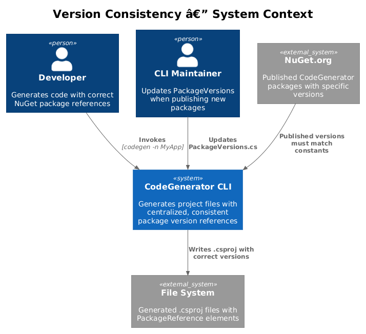
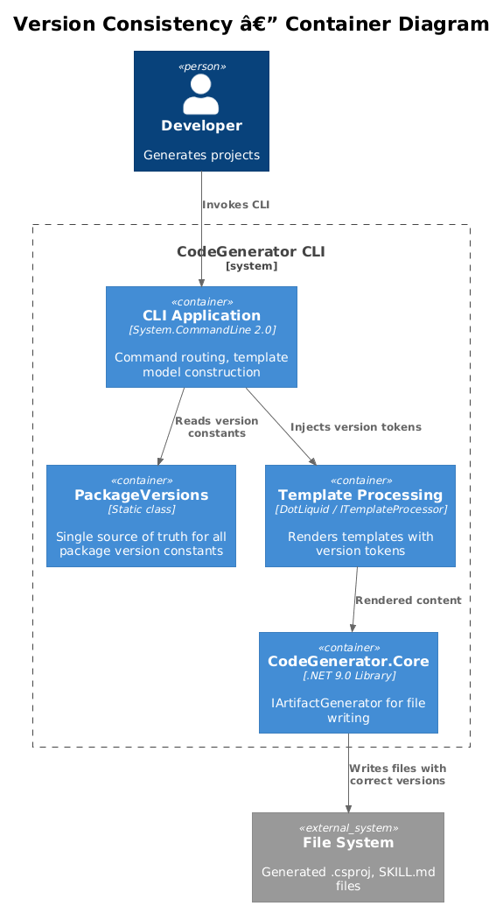
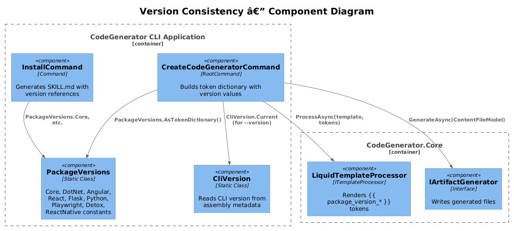
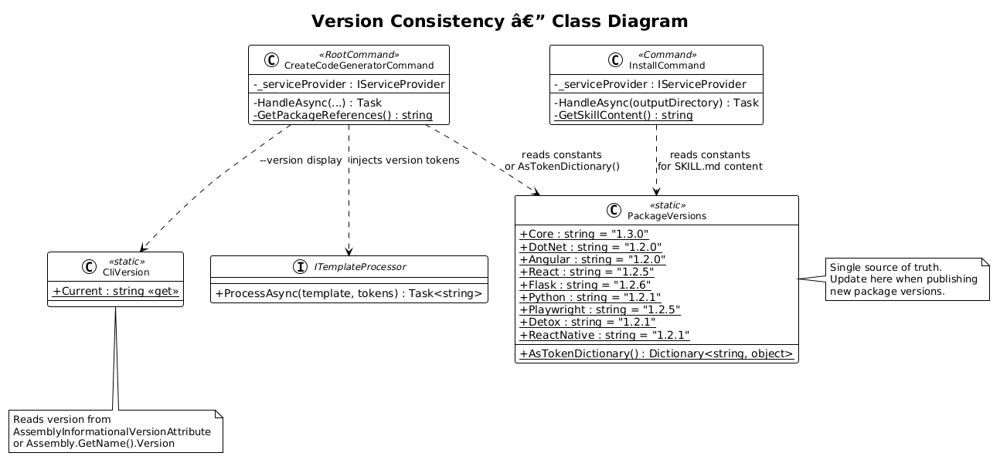
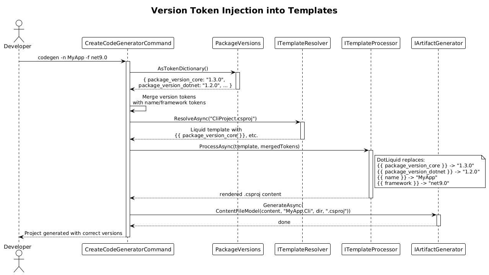
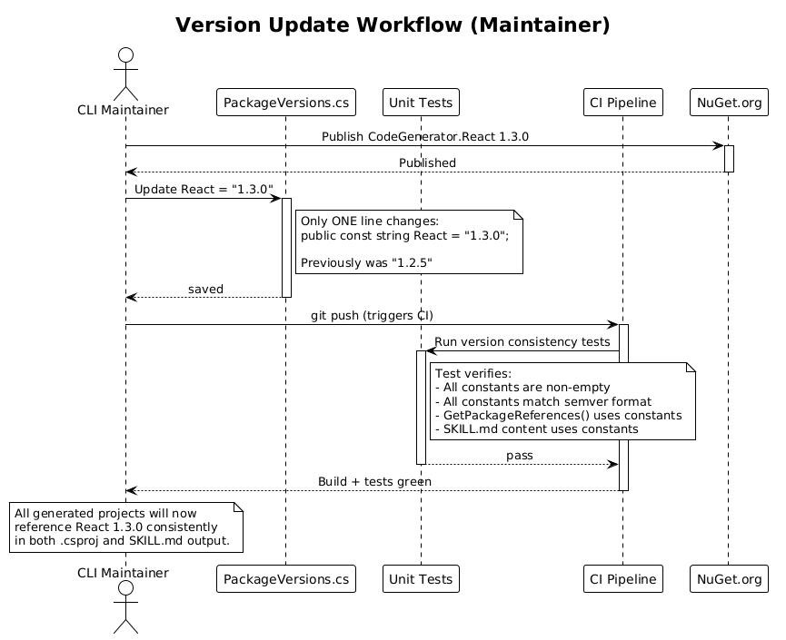

# Version Consistency — Detailed Design

**Status:** Proposed
**Feature:** 46

## 1. Overview

Package version numbers in the CodeGenerator CLI are currently inconsistent across the codebase. The `GetPackageReferences()` method in `CreateCodeGeneratorCommand` references versions like `1.2.0` for Core and DotNet, `1.2.2` for React and Flask, `1.2.5` for Playwright, and `1.2.1` for Python, Detox, and ReactNative. Meanwhile, the `InstallCommand` SKILL.md content references different versions: `1.3.0` for Core, `1.2.5` for React, and `1.2.6` for Flask.

This feature centralizes version numbers into a single `PackageVersions` static class with named constants, and introduces a mechanism to inject these versions into Liquid templates via tokens like `{{ package_version_core }}`. This ensures that when a package is published at a new version, only one location needs updating.

**Actors:** CLI maintainer — updates a single constant when publishing new package versions. Developer — receives consistent, correct version references in generated project files.

**Scope:** The `PackageVersions` static class, migration of `GetPackageReferences()` and SKILL.md content to use centralized versions, Liquid template token injection for version values, and optional assembly-metadata-based version reading. This covers vision item 1.9 from `codegenerator-cli-vision.md`.

## 2. Architecture

### 2.1 C4 Context Diagram

Shows the version consistency concern in context — generated projects need correct NuGet package references.



### 2.2 C4 Container Diagram

Shows how the `PackageVersions` class feeds into template processing and project generation.



| Container | Technology | Responsibility |
|-----------|------------|----------------|
| CLI Application | System.CommandLine 2.0 | Orchestrates code generation, constructs template token dictionaries |
| PackageVersions | Static class with constants | Single source of truth for all CodeGenerator package version strings |
| Template Processing | DotLiquid / ITemplateProcessor | Renders templates with version tokens |
| CodeGenerator.Core | .NET 9.0 Library | `IArtifactGenerator` for file writing |

### 2.3 C4 Component Diagram

Shows how version constants flow from `PackageVersions` through template tokens into generated output.



## 3. Component Details

### 3.1 PackageVersions — Static Constants Class

- **Responsibility:** Single source of truth for all CodeGenerator NuGet package version strings. Every place that references a package version reads from this class.
- **Namespace:** `CodeGenerator.Cli`
- **Location:** `src/CodeGenerator.Cli/PackageVersions.cs`

```csharp
namespace CodeGenerator.Cli;

/// <summary>
/// Centralized package version constants for all CodeGenerator NuGet packages.
/// Update these values when publishing new package versions.
/// </summary>
public static class PackageVersions
{
    public const string Core = "1.3.0";
    public const string DotNet = "1.2.0";
    public const string Angular = "1.2.0";
    public const string React = "1.2.5";
    public const string Flask = "1.2.6";
    public const string Python = "1.2.1";
    public const string Playwright = "1.2.5";
    public const string Detox = "1.2.1";
    public const string ReactNative = "1.2.1";
}
```

### 3.2 Assembly Metadata Approach (Alternative)

For the CLI's own version (displayed in `--version` output), the version can be read from assembly metadata at runtime:

```csharp
public static class CliVersion
{
    public static string Current =>
        typeof(CliVersion).Assembly
            .GetCustomAttribute<AssemblyInformationalVersionAttribute>()
            ?.InformationalVersion
        ?? typeof(CliVersion).Assembly.GetName().Version?.ToString()
        ?? "0.0.0";
}
```

This is complementary to `PackageVersions` — the assembly metadata approach handles the CLI tool's own version, while `PackageVersions` handles the NuGet package versions referenced in generated projects. These are distinct version numbers since packages are published independently.

### 3.3 Migration of GetPackageReferences()

**Before (hardcoded, inconsistent):**
```csharp
private static string GetPackageReferences() => @"  <ItemGroup>
    <PackageReference Include=""QuinntyneBrown.CodeGenerator.Core"" Version=""1.2.0"" />
    <PackageReference Include=""QuinntyneBrown.CodeGenerator.DotNet"" Version=""1.2.0"" />
    <PackageReference Include=""QuinntyneBrown.CodeGenerator.Angular"" Version=""1.2.0"" />
    <PackageReference Include=""QuinntyneBrown.CodeGenerator.React"" Version=""1.2.2"" />
    ...
  </ItemGroup>";
```

**After (centralized):**
```csharp
private static string GetPackageReferences() => $@"  <ItemGroup>
    <PackageReference Include=""QuinntyneBrown.CodeGenerator.Core"" Version=""{PackageVersions.Core}"" />
    <PackageReference Include=""QuinntyneBrown.CodeGenerator.DotNet"" Version=""{PackageVersions.DotNet}"" />
    <PackageReference Include=""QuinntyneBrown.CodeGenerator.Angular"" Version=""{PackageVersions.Angular}"" />
    <PackageReference Include=""QuinntyneBrown.CodeGenerator.React"" Version=""{PackageVersions.React}"" />
    <PackageReference Include=""QuinntyneBrown.CodeGenerator.Flask"" Version=""{PackageVersions.Flask}"" />
    <PackageReference Include=""QuinntyneBrown.CodeGenerator.Python"" Version=""{PackageVersions.Python}"" />
    <PackageReference Include=""QuinntyneBrown.CodeGenerator.Playwright"" Version=""{PackageVersions.Playwright}"" />
    <PackageReference Include=""QuinntyneBrown.CodeGenerator.Detox"" Version=""{PackageVersions.Detox}"" />
    <PackageReference Include=""QuinntyneBrown.CodeGenerator.ReactNative"" Version=""{PackageVersions.ReactNative}"" />
  </ItemGroup>";
```

### 3.4 Template Token Injection

When Feature 45 (Extract Embedded Templates) is implemented, version values are injected into the template token dictionary:

```csharp
var tokens = new Dictionary<string, object>
{
    { "name", name },
    { "framework", framework },
    { "package_version_core", PackageVersions.Core },
    { "package_version_dotnet", PackageVersions.DotNet },
    { "package_version_angular", PackageVersions.Angular },
    { "package_version_react", PackageVersions.React },
    { "package_version_flask", PackageVersions.Flask },
    { "package_version_python", PackageVersions.Python },
    { "package_version_playwright", PackageVersions.Playwright },
    { "package_version_detox", PackageVersions.Detox },
    { "package_version_reactnative", PackageVersions.ReactNative },
};
```

A helper method on `PackageVersions` simplifies this:

```csharp
public static class PackageVersions
{
    // ... constants ...

    public static Dictionary<string, object> AsTokenDictionary()
    {
        return new Dictionary<string, object>
        {
            { "package_version_core", Core },
            { "package_version_dotnet", DotNet },
            { "package_version_angular", Angular },
            { "package_version_react", React },
            { "package_version_flask", Flask },
            { "package_version_python", Python },
            { "package_version_playwright", Playwright },
            { "package_version_detox", Detox },
            { "package_version_reactnative", ReactNative },
        };
    }
}
```

**Corresponding `CliProject.csproj.liquid` usage:**
```liquid
<PackageReference Include="QuinntyneBrown.CodeGenerator.Core" Version="{{ package_version_core }}" />
<PackageReference Include="QuinntyneBrown.CodeGenerator.DotNet" Version="{{ package_version_dotnet }}" />
```

### 3.5 Migration of InstallCommand SKILL.md Content

The `SkillContent` constant in `InstallCommand` also contains hardcoded version numbers. After this feature, it should reference `PackageVersions`:

```csharp
private static string GetSkillContent() => $@"---
name: code-generator
...
## Package References

```xml
<PackageReference Include=""QuinntyneBrown.CodeGenerator.Core"" Version=""{PackageVersions.Core}"" />
...
```
...";
```

## 4. Data Model

The class diagram shows `PackageVersions`, its relationship to the commands, and how tokens flow into templates.



## 5. Key Workflows

### 5.1 Version Token Injection into Templates

Shows how `PackageVersions` feeds version values through the template processing pipeline.



### 5.2 Version Update Workflow (Maintainer)

Shows the maintainer workflow when publishing a new package version.



## 6. Current Version Inconsistencies

This table documents the current state of version references across the codebase to illustrate the problem being solved:

| Package | CreateCodeGeneratorCommand | InstallCommand SKILL.md | Correct |
|---------|---------------------------|------------------------|---------|
| Core | 1.2.0 | 1.3.0 | 1.3.0 |
| DotNet | 1.2.0 | 1.2.0 | 1.2.0 |
| Angular | 1.2.0 | 1.2.0 | 1.2.0 |
| React | 1.2.2 | 1.2.5 | 1.2.5 |
| Flask | 1.2.2 | 1.2.6 | 1.2.6 |
| Python | 1.2.1 | 1.2.1 | 1.2.1 |
| Playwright | 1.2.5 | 1.2.5 | 1.2.5 |
| Detox | 1.2.1 | 1.2.1 | 1.2.1 |
| ReactNative | 1.2.1 | 1.2.1 | 1.2.1 |

## 7. Open Questions

1. **Should versions be in a shared project?** If other projects (e.g., CodeGenerator.DotNet) also need to reference package versions, the `PackageVersions` class could live in a shared assembly rather than `CodeGenerator.Cli`.
2. **NuGet version query at runtime?** A more advanced approach could query the NuGet API for the latest published version at generation time. This adds network dependency and latency but ensures templates always reference the latest. Likely better as a separate feature.
3. **Version range syntax:** Should templates use exact versions (`1.3.0`) or version ranges (`1.3.*`, `[1.3.0,2.0.0)`)? Exact versions are more predictable; ranges allow automatic minor updates.
4. **CI/CD integration:** Should the CI pipeline automatically update `PackageVersions.cs` when a package is published? This could be a post-publish script that updates the constant and creates a PR.
5. **Multiple version tracks:** If CodeGenerator supports both .NET 8 and .NET 9, package versions might differ per target. Is per-framework versioning needed?
