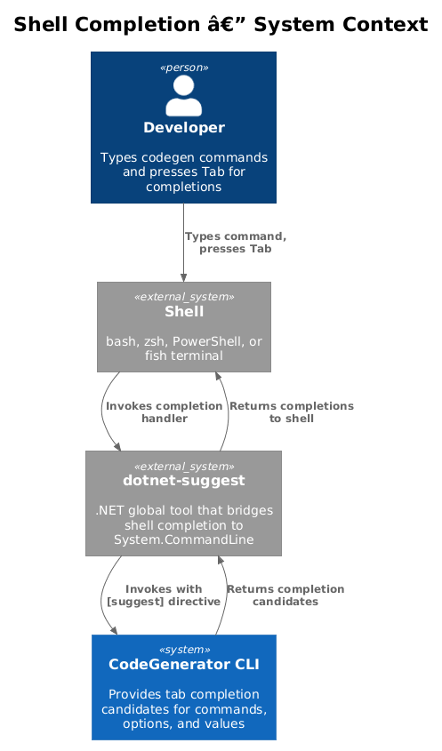
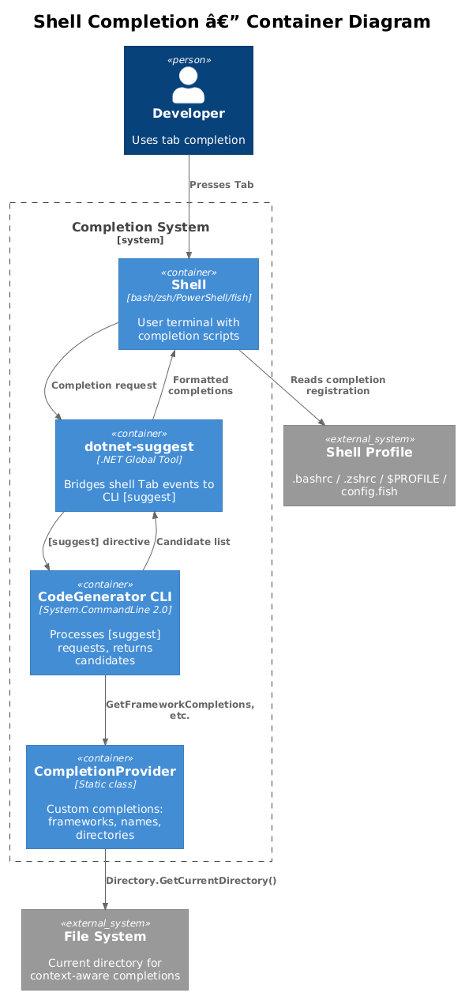
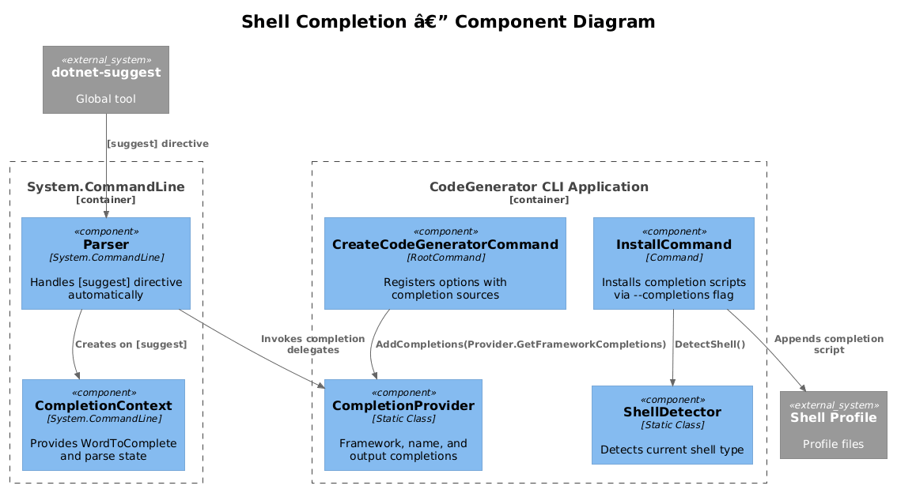
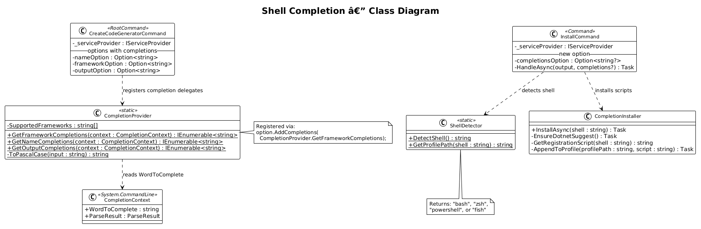
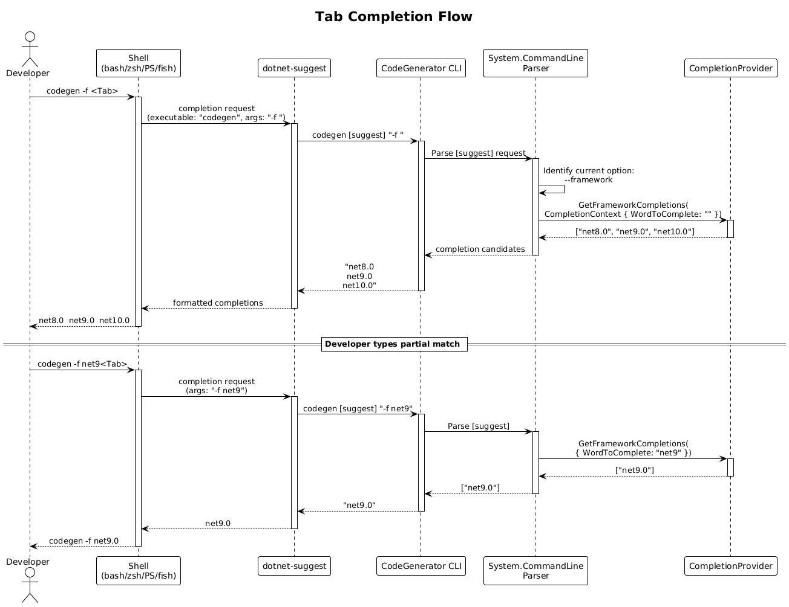
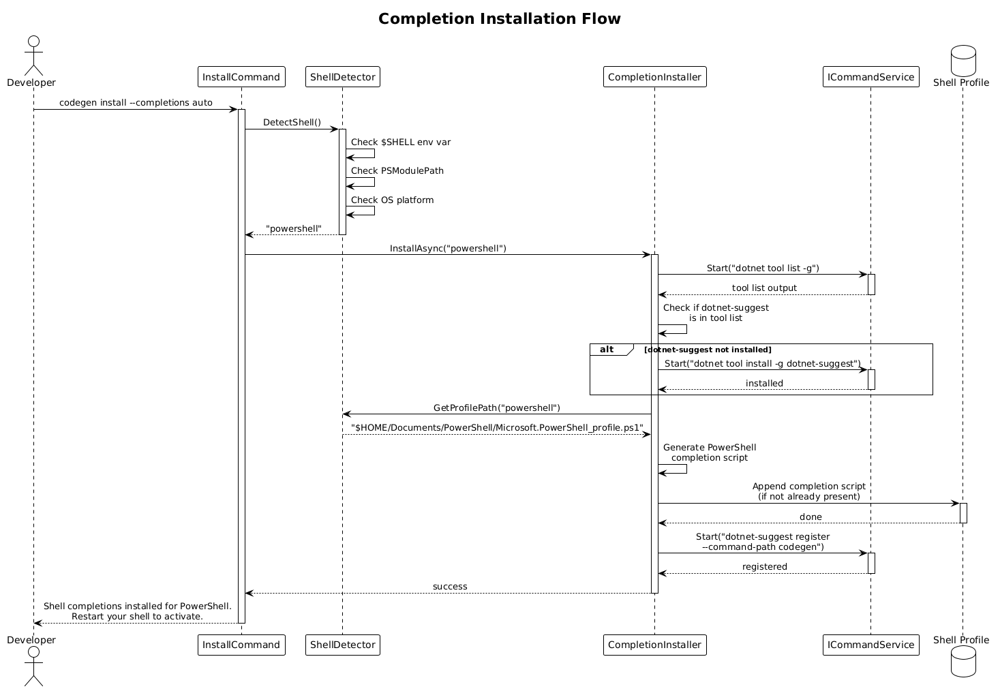

# Shell Completion — Detailed Design

**Status:** Implemented
**Feature:** 47

## 1. Overview

System.CommandLine 2.0 has built-in support for shell tab completions via the `dotnet-suggest` global tool. This feature enables CodeGenerator CLI to provide tab-completion for commands, options, and option values across bash, zsh, PowerShell, and fish shells. Beyond the automatic completions that System.CommandLine provides for registered options and commands, this feature adds custom completions for dynamic values like `--framework` (suggesting `net8.0`, `net9.0`, `net10.0`) and contextual completions for `--name` (suggesting names based on the current directory).

The `install` subcommand is extended to optionally set up shell completion registration scripts, so users can get completions working with a single command.

**Actors:** Developer — presses Tab while typing a `codegen` command to get context-aware suggestions for commands, options, and option values.

**Scope:** The `dotnet-suggest` integration, custom `CompletionProvider` for dynamic option values, shell-specific registration scripts, and extensions to the `install` command. This covers vision item 1.10 from `codegenerator-cli-vision.md`.

## 2. Architecture

### 2.1 C4 Context Diagram

Shows the shell completion system in context — the developer's shell, the CLI, and the `dotnet-suggest` infrastructure.



When the developer presses Tab, the shell invokes `dotnet-suggest` which in turn invokes the CodeGenerator CLI with a special `[suggest]` directive. The CLI returns completion candidates, which `dotnet-suggest` passes back to the shell.

### 2.2 C4 Container Diagram

Shows the internal containers involved in providing completions.



| Container | Technology | Responsibility |
|-----------|------------|----------------|
| Shell | bash / zsh / PowerShell / fish | User's terminal, invokes dotnet-suggest on Tab |
| dotnet-suggest | .NET Global Tool | Bridges shell completion protocol to System.CommandLine |
| CLI Application | System.CommandLine 2.0 | Processes `[suggest]` requests, returns completion candidates |
| CompletionProvider | Custom class | Provides dynamic completions for framework, name, etc. |

### 2.3 C4 Component Diagram

Shows the components involved: the System.CommandLine completion infrastructure, custom completion sources, and the install command extensions.



## 3. Component Details

### 3.1 dotnet-suggest Integration

System.CommandLine 2.0 supports completions through the `dotnet-suggest` global tool. The integration requires:

1. **Install dotnet-suggest:** `dotnet tool install -g dotnet-suggest`
2. **Register the CLI:** The CLI must be registered with dotnet-suggest so the shell knows to invoke it for completions
3. **Shell profile setup:** A shell-specific script must be added to the user's profile (`.bashrc`, `.zshrc`, PowerShell `$PROFILE`, `config.fish`)

System.CommandLine automatically handles the `[suggest]` directive when invoked by dotnet-suggest. No custom middleware is needed for basic command and option name completions.

### 3.2 Custom Completions for --framework

The `--framework` option currently accepts any string. By adding a `CompletionSource`, Tab completion will suggest known framework monikers:

```csharp
var frameworkOption = new Option<string>(
    aliases: ["-f", "--framework"],
    description: "The target framework (e.g. net8.0, net9.0)",
    getDefaultValue: () => "net9.0");

frameworkOption.AddCompletions(CompletionProvider.GetFrameworkCompletions);
```

### 3.3 Custom Completions for --name

The `--name` option can suggest names based on the current directory name or common patterns:

```csharp
var nameOption = new Option<string>(
    aliases: ["-n", "--name"],
    description: "The name of the solution to create")
{
    IsRequired = true
};

nameOption.AddCompletions(CompletionProvider.GetNameCompletions);
```

### 3.4 CompletionProvider — Custom Completion Logic

- **Responsibility:** Provides dynamic completion candidates for CLI options based on context (current directory, known values, etc.).
- **Namespace:** `CodeGenerator.Cli.Completions`
- **Location:** `src/CodeGenerator.Cli/Completions/CompletionProvider.cs`

```csharp
namespace CodeGenerator.Cli.Completions;

public static class CompletionProvider
{
    private static readonly string[] SupportedFrameworks =
    [
        "net8.0",
        "net9.0",
        "net10.0",
    ];

    public static IEnumerable<string> GetFrameworkCompletions(CompletionContext context)
    {
        var textToMatch = context.WordToComplete ?? string.Empty;
        return SupportedFrameworks
            .Where(f => f.StartsWith(textToMatch, StringComparison.OrdinalIgnoreCase));
    }

    public static IEnumerable<string> GetNameCompletions(CompletionContext context)
    {
        var currentDir = Directory.GetCurrentDirectory();
        var dirName = new DirectoryInfo(currentDir).Name;

        var suggestions = new List<string>();

        // Suggest current directory name as PascalCase
        var pascalName = ToPascalCase(dirName);
        if (!string.IsNullOrEmpty(pascalName))
        {
            suggestions.Add(pascalName);
            suggestions.Add($"{pascalName}.CodeGenerator");
        }

        var textToMatch = context.WordToComplete ?? string.Empty;
        return suggestions
            .Where(s => s.StartsWith(textToMatch, StringComparison.OrdinalIgnoreCase));
    }

    public static IEnumerable<string> GetOutputCompletions(CompletionContext context)
    {
        // Suggest subdirectories of the current directory
        var currentDir = Directory.GetCurrentDirectory();
        var textToMatch = context.WordToComplete ?? string.Empty;

        return Directory.GetDirectories(currentDir)
            .Select(d => Path.GetFileName(d))
            .Where(d => d.StartsWith(textToMatch, StringComparison.OrdinalIgnoreCase))
            .Take(20);
    }

    private static string ToPascalCase(string input)
    {
        if (string.IsNullOrEmpty(input)) return input;
        return string.Join("", input
            .Split(['-', '_', ' ', '.'], StringSplitOptions.RemoveEmptyEntries)
            .Select(word => char.ToUpper(word[0]) + word[1..]));
    }
}
```

### 3.5 Shell Registration Scripts

Each shell requires a one-time setup to integrate with `dotnet-suggest`. These scripts are generated by the `install` command.

**Bash (`~/.bashrc` addition):**
```bash
export PATH="$PATH:$HOME/.dotnet/tools"
# Register dotnet-suggest shell integration
if command -v dotnet-suggest > /dev/null 2>&1; then
    _dotnet_suggest_bash_complete()
    {
        local completions
        completions="$(dotnet-suggest get --executable "$1" -- "${COMP_WORDS[@]}" 2>/dev/null)"
        COMPREPLY=( $(compgen -W "$completions" -- "${COMP_WORDS[$COMP_CWORD]}") )
    }
    complete -F _dotnet_suggest_bash_complete codegen
fi
```

**Zsh (`~/.zshrc` addition):**
```zsh
export PATH="$PATH:$HOME/.dotnet/tools"
if command -v dotnet-suggest > /dev/null 2>&1; then
    _dotnet_suggest_zsh_complete()
    {
        local completions
        completions=("${(@f)$(dotnet-suggest get --executable "$words[1]" -- "${words[@]}" 2>/dev/null)}")
        compadd -a completions
    }
    compdef _dotnet_suggest_zsh_complete codegen
fi
```

**PowerShell (`$PROFILE` addition):**
```powershell
if (Get-Command dotnet-suggest -ErrorAction SilentlyContinue) {
    Register-ArgumentCompleter -Native -CommandName codegen -ScriptBlock {
        param($wordToComplete, $commandAst, $cursorPosition)
        $result = dotnet-suggest get --executable codegen -- "$commandAst" 2>$null
        $result -split "`n" | ForEach-Object {
            [System.Management.Automation.CompletionResult]::new($_, $_, 'ParameterValue', $_)
        }
    }
}
```

**Fish (`~/.config/fish/completions/codegen.fish`):**
```fish
if command -v dotnet-suggest > /dev/null 2>&1
    complete -c codegen -f -a "(dotnet-suggest get --executable codegen -- (commandline -cp) 2>/dev/null)"
end
```

### 3.6 Install Command Extensions

The `install` command gains a `--completions` flag to set up shell completions:

```csharp
var completionsOption = new Option<string?>(
    aliases: ["--completions"],
    description: "Install shell completions (bash, zsh, powershell, fish, auto)");

completionsOption.AddCompletions("bash", "zsh", "powershell", "fish", "auto");
```

When `--completions auto` is specified, the installer detects the current shell:
- Checks `$SHELL` environment variable on Unix
- Checks `$PSVersionTable` presence for PowerShell
- Falls back to PowerShell on Windows

The installer then:
1. Verifies `dotnet-suggest` is installed (installs if missing)
2. Appends the appropriate script to the shell profile
3. Registers the CLI executable with `dotnet-suggest register`

```csharp
public static class ShellDetector
{
    public static string DetectShell()
    {
        if (Environment.GetEnvironmentVariable("PSModulePath") != null)
            return "powershell";

        var shell = Environment.GetEnvironmentVariable("SHELL") ?? "";
        if (shell.Contains("zsh")) return "zsh";
        if (shell.Contains("bash")) return "bash";
        if (shell.Contains("fish")) return "fish";

        return RuntimeInformation.IsOSPlatform(OSPlatform.Windows)
            ? "powershell"
            : "bash";
    }
}
```

## 4. Data Model

The class diagram shows the completion provider, shell detector, and their relationship to the CLI command structure.



## 5. Key Workflows

### 5.1 Tab Completion Flow

Shows the end-to-end flow when a developer presses Tab in their shell.



### 5.2 Completion Installation Flow

Shows the flow when a developer runs `codegen install --completions auto`.



## 6. Completion Matrix

| Option | Completion Type | Values |
|--------|----------------|--------|
| (commands) | Automatic (System.CommandLine) | `install`, `scaffold`, `enterprise-solution`, `hello` |
| `-n / --name` | Custom (CompletionProvider) | PascalCase directory name, `{Dir}.CodeGenerator` |
| `-o / --output` | Custom (CompletionProvider) | Subdirectories of current directory |
| `-f / --framework` | Custom (CompletionProvider) | `net8.0`, `net9.0`, `net10.0` |
| `--slnx` | Automatic (bool) | (no value needed, flag toggle) |
| `--local-source-root` | File system (System.CommandLine default) | Directory paths |
| `--templates` | File system (System.CommandLine default) | Directory paths |

## 7. Open Questions

1. **dotnet-suggest vs. native approach:** System.CommandLine's `dotnet-suggest` requires installing a separate global tool. An alternative is to generate static completion scripts that the CLI can output via `codegen completions bash` (similar to `kubectl completion bash`). This removes the dotnet-suggest dependency but loses dynamic completions.
2. **Auto-install dotnet-suggest:** Should `codegen install --completions auto` automatically run `dotnet tool install -g dotnet-suggest` if it is not installed? This is convenient but modifies the user's global tool list without explicit consent.
3. **Completion for scaffold subcommand:** The `scaffold` command accepts a YAML config path. Should completions filter to only `.yaml`/`.yml` files?
4. **Framework list freshness:** The `SupportedFrameworks` array is hardcoded. Should it be loaded from a config file or determined at runtime from the installed .NET SDKs (e.g., `dotnet --list-sdks`)?
5. **Windows Terminal vs. legacy cmd:** Completions work best in Windows Terminal with PowerShell. Should the install command warn if the user is running cmd.exe, where completions are not supported?
