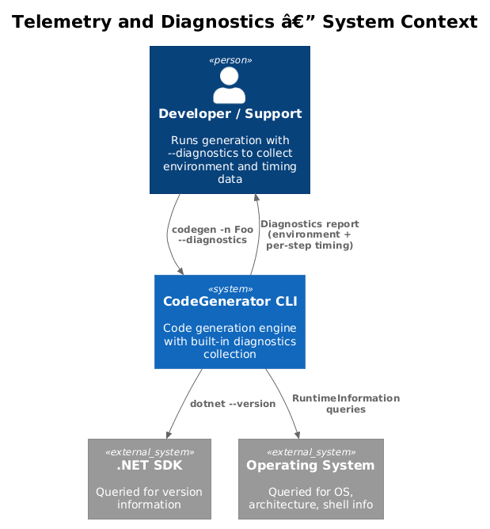
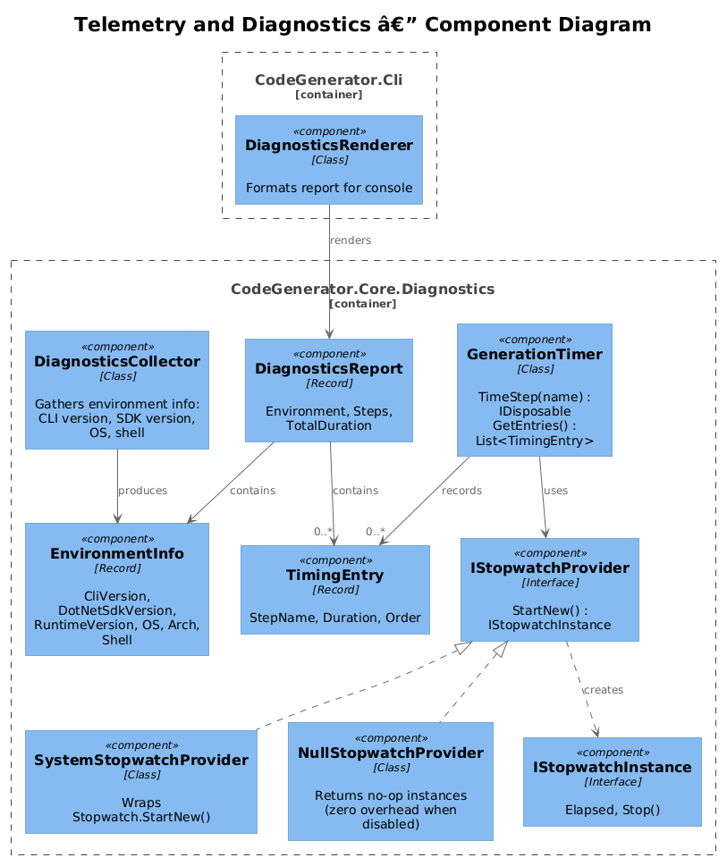
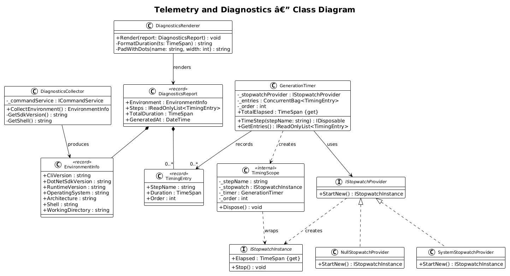
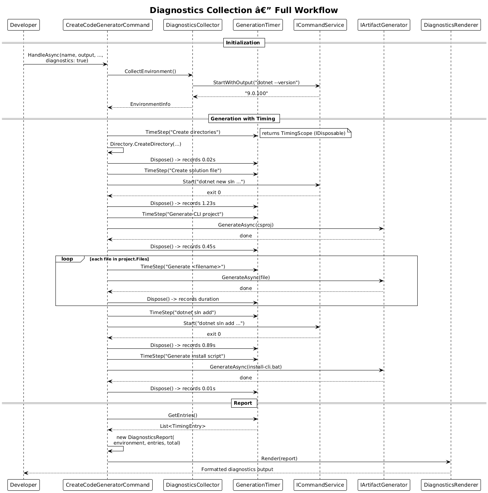
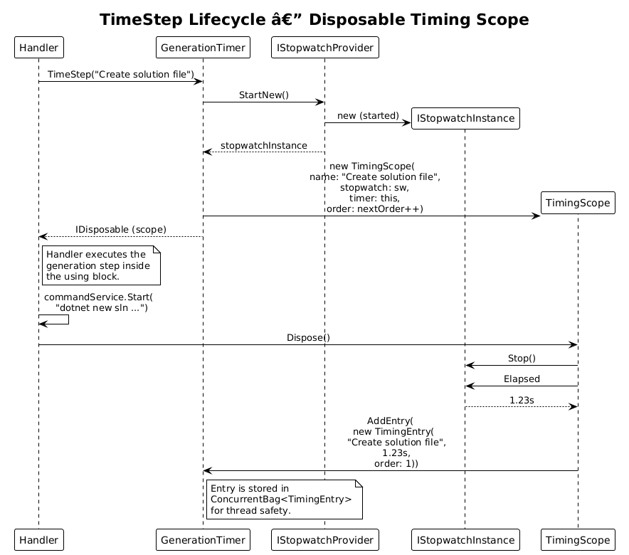

# Telemetry and Diagnostics — Detailed Design

**Feature:** 49-telemetry-and-diagnostics (Vision 1.12)
**Status:** Implemented
**Requirements:** codegenerator-cli-vision.md section 1.12 — "Telemetry and Diagnostics"

---

## 1. Overview

When generation is slow, fails unexpectedly, or produces incorrect output, there is currently no built-in way to collect diagnostic information about the environment or profile the timing of individual generation steps. Users reporting issues must manually gather .NET SDK versions, OS details, and timing measurements.

### Problem

- Debugging generation failures requires manual investigation: "What SDK version are you using? What OS? Did the solution creation step take unusually long?"
- There is no per-step timing: the user sees total elapsed time (if they measure it themselves) but cannot identify which generation phase is the bottleneck.
- Environment mismatches (wrong .NET SDK version, missing tools) are discovered only through cryptic error messages.

### Goal

Add a `--diagnostics` flag that, when enabled, collects and displays:

1. **Environment information:** CLI version, .NET SDK version, runtime version, OS, architecture, shell.
2. **Per-step timing:** Duration of each major generation phase (solution creation, project generation, file generation, `dotnet sln add`, etc.).
3. **Total elapsed time** for the entire generation run.

The output is displayed at the end of generation as a formatted diagnostics report.

### Actors

| Actor | Description |
|-------|-------------|
| **Developer** | Runs `codegen -n Foo --diagnostics` to profile generation timing |
| **Support/Maintainer** | Asks user to run with `--diagnostics` and share the report for troubleshooting |
| **CI Pipeline** | Captures diagnostics output for performance regression tracking |

### Scope

This design covers the `--diagnostics` option on `CreateCodeGeneratorCommand`, the diagnostics collection infrastructure in `CodeGenerator.Core`, and the rendering of the diagnostics report. It does not cover telemetry upload, persistent storage of diagnostics data, or integration with external monitoring systems.

### Design Principles

- **Opt-in.** Diagnostics collection only activates when `--diagnostics` is passed. Default behavior has zero overhead.
- **Non-invasive.** Timing hooks wrap existing generation steps without modifying strategy implementations.
- **Testable.** Time measurement is abstracted behind `IStopwatchProvider` so tests can control time.
- **Human-readable.** Output is formatted for console consumption, not JSON (though JSON export could be added later).

---

## 2. Architecture

### 2.1 C4 Context Diagram

Shows how diagnostics fits into the system landscape. The CLI collects environment and timing data during generation and displays a report.



### 2.2 C4 Container Diagram

The logical containers involved in diagnostics collection and rendering.


### 2.3 C4 Component Diagram

Internal components: the collector, timer, report model, and renderer.



---

## 3. Component Details

### 3.1 DiagnosticsCollector

- **Responsibility:** Gather static environment information at the start of a generation run.
- **Namespace:** `CodeGenerator.Core.Diagnostics`
- **Key members:**
  - `EnvironmentInfo CollectEnvironment()` — synchronously collects all environment data
- **Data collected:**
  - CLI version: read from the executing assembly's `AssemblyInformationalVersionAttribute`
  - .NET SDK version: run `dotnet --version` via `ICommandService` and capture output
  - .NET runtime version: `Environment.Version` or `RuntimeInformation.FrameworkDescription`
  - OS: `RuntimeInformation.OSDescription`
  - Architecture: `RuntimeInformation.OSArchitecture`
  - Shell: detect from environment (`SHELL` on Unix, `COMSPEC` on Windows)
  - Working directory: `Environment.CurrentDirectory`

### 3.2 EnvironmentInfo

- **Responsibility:** Immutable record holding all collected environment data.
- **Type:** `record`
- **Members:**
  - `string CliVersion`
  - `string DotNetSdkVersion`
  - `string RuntimeVersion`
  - `string OperatingSystem`
  - `string Architecture`
  - `string Shell`
  - `string WorkingDirectory`

### 3.3 IStopwatchProvider

- **Responsibility:** Abstraction over `System.Diagnostics.Stopwatch` to enable deterministic testing.
- **Namespace:** `CodeGenerator.Core.Diagnostics`
- **Key members:**
  - `IStopwatchInstance StartNew()` — create and start a new stopwatch
- **Default implementation:** `SystemStopwatchProvider` wraps `Stopwatch.StartNew()`.
- **Test implementation:** `FakeStopwatchProvider` returns controllable elapsed times.

### 3.4 IStopwatchInstance

- **Responsibility:** Represents a running stopwatch.
- **Key members:**
  - `TimeSpan Elapsed { get; }` — current elapsed time
  - `void Stop()` — stop the stopwatch

### 3.5 GenerationTimer

- **Responsibility:** Track timing for named generation steps. Acts as the central timing registry for a single generation run.
- **Namespace:** `CodeGenerator.Core.Diagnostics`
- **Key members:**
  - `IDisposable TimeStep(string stepName)` — start timing a named step; returns a disposable that records elapsed time when disposed
  - `List<TimingEntry> GetEntries()` — return all recorded step timings
  - `TimeSpan TotalElapsed` — total time from first step start to last step end
- **Usage pattern:**
  ```csharp
  using (timer.TimeStep("Create solution file"))
  {
      commandService.Start("dotnet new sln ...");
  }
  // Timing for "Create solution file" is automatically recorded
  ```
- **Thread safety:** Uses `ConcurrentBag<TimingEntry>` internally.

### 3.6 TimingEntry

- **Responsibility:** Record of a single timed step.
- **Type:** `record`
- **Members:**
  - `string StepName` — human-readable step name
  - `TimeSpan Duration` — how long the step took
  - `int Order` — sequence number (order in which steps were started)

### 3.7 DiagnosticsReport

- **Responsibility:** Aggregate model containing both environment info and timing data for a generation run.
- **Namespace:** `CodeGenerator.Core.Diagnostics`
- **Key members:**
  - `EnvironmentInfo Environment { get; }`
  - `List<TimingEntry> Steps { get; }`
  - `TimeSpan TotalDuration { get; }`
  - `DateTime GeneratedAt { get; }`

### 3.8 DiagnosticsRenderer

- **Responsibility:** Format `DiagnosticsReport` for console output.
- **Namespace:** `CodeGenerator.Cli.Rendering`
- **Output format:**
  ```
  Diagnostics Report
  ==================

  Environment
  -----------
  CLI Version:      1.2.0
  .NET SDK:         9.0.100
  Runtime:          .NET 9.0.0
  OS:               Windows 11 (10.0.26200)
  Architecture:     X64
  Shell:            cmd.exe
  Working Dir:      C:\projects\output

  Timing
  ------
  Create solution file .............. 1.23s
  Generate CLI project .............. 0.45s
  Generate Program.cs ............... 0.02s
  Generate AppRootCommand.cs ........ 0.01s
  Generate HelloWorldCommand.cs ..... 0.01s
  Generate EnterpriseSolutionCommand  0.01s
  dotnet sln add .................... 0.89s
  Generate install-cli.bat .......... 0.01s
  ----------------------------------
  Total                               2.63s
  ```

---

## 4. Data Model

### 4.1 Class Diagram



### 4.2 Entity Descriptions

| Entity | Description |
|--------|-------------|
| `DiagnosticsCollector` | Gathers static environment information (SDK version, OS, shell, etc.) |
| `EnvironmentInfo` | Immutable record of all collected environment data |
| `IStopwatchProvider` | Abstraction over `Stopwatch` for testable time measurement |
| `SystemStopwatchProvider` | Default implementation wrapping `System.Diagnostics.Stopwatch` |
| `IStopwatchInstance` | Interface for a running stopwatch with `Elapsed` and `Stop()` |
| `GenerationTimer` | Central timing registry; `TimeStep(name)` returns a disposable that records duration |
| `TimingEntry` | Immutable record of a single step's name, duration, and order |
| `DiagnosticsReport` | Aggregate model with `EnvironmentInfo`, `List<TimingEntry>`, and total duration |
| `DiagnosticsRenderer` | Formats `DiagnosticsReport` for human-readable console output |

---

## 5. Key Workflows

### 5.1 Diagnostics Collection During Generation

The user runs generation with `--diagnostics`. Timing hooks wrap each major step, and environment info is collected upfront.



**Steps:**

1. User invokes `codegen -n Foo --diagnostics`.
2. `CreateCodeGeneratorCommand.HandleAsync` receives `diagnostics: true`.
3. Handler creates a `GenerationTimer` (injected via DI, activated only when diagnostics is enabled).
4. Handler calls `DiagnosticsCollector.CollectEnvironment()` to gather environment info.
5. Each major generation step is wrapped with `timer.TimeStep(name)`:
   a. `using (timer.TimeStep("Create solution file"))` around `commandService.Start("dotnet new sln ...")`.
   b. `using (timer.TimeStep("Generate CLI project"))` around `artifactGenerator.GenerateAsync(csproj)`.
   c. `using (timer.TimeStep("Generate <filename>"))` around each file generation call.
   d. `using (timer.TimeStep("dotnet sln add"))` around `commandService.Start("dotnet sln add ...")`.
6. Generation completes. Handler constructs `DiagnosticsReport` from environment info and timer entries.
7. Handler passes `DiagnosticsReport` to `DiagnosticsRenderer` for console output.

### 5.2 TimeStep Lifecycle



**Steps:**

1. Caller enters `using (timer.TimeStep("Create solution file"))`.
2. `GenerationTimer` calls `IStopwatchProvider.StartNew()` to create a stopwatch.
3. Returns a `TimingScope` disposable that holds the step name and stopwatch reference.
4. Caller executes the generation step inside the using block.
5. `TimingScope.Dispose()` is called (end of using block).
6. `TimingScope` calls `stopwatch.Stop()` and reads `stopwatch.Elapsed`.
7. `TimingScope` adds a `TimingEntry(stepName, elapsed, order)` to the `GenerationTimer`.

---

## 6. API Contracts

### 6.1 Updated HandleAsync Signature

```csharp
private async Task HandleAsync(
    string name,
    string outputDirectory,
    string framework,
    bool slnx,
    string? localSourceRoot,
    bool diagnostics)  // new parameter
```

### 6.2 GenerationTimer API

```csharp
public class GenerationTimer
{
    public GenerationTimer(IStopwatchProvider stopwatchProvider);

    /// <summary>
    /// Start timing a named step. Dispose the return value to record the duration.
    /// </summary>
    public IDisposable TimeStep(string stepName);

    /// <summary>
    /// Get all recorded timing entries in execution order.
    /// </summary>
    public IReadOnlyList<TimingEntry> GetEntries();

    /// <summary>
    /// Total elapsed time across all steps.
    /// </summary>
    public TimeSpan TotalElapsed { get; }
}
```

### 6.3 Conditional Activation Pattern

When `--diagnostics` is not passed, the handler should not pay the cost of timing. Two approaches:

**Option A: Null object.** Register a `NullGenerationTimer` that returns no-op disposables. The `using` blocks still execute but the stopwatch is never started.

**Option B: Conditional wrapping.** The handler checks the `diagnostics` flag before wrapping steps:

```csharp
IDisposable step = diagnostics ? timer.TimeStep("Create solution") : NullDisposable.Instance;
using (step)
{
    commandService.Start("dotnet new sln ...");
}
```

Option A is preferred for cleaner code in the handler.

### 6.4 DiagnosticsCollector API

```csharp
public class DiagnosticsCollector
{
    public DiagnosticsCollector(ICommandService commandService);

    public EnvironmentInfo CollectEnvironment();
}
```

---

## 7. DI Registration

### 7.1 Core Services

```csharp
public static void AddDiagnosticsServices(this IServiceCollection services)
{
    services.AddSingleton<IStopwatchProvider, SystemStopwatchProvider>();
    services.AddSingleton<DiagnosticsCollector>();
    services.AddSingleton<GenerationTimer>();
}
```

### 7.2 CLI Services

```csharp
services.AddDiagnosticsServices();
services.AddSingleton<DiagnosticsRenderer>();
```

### 7.3 Null Object for Disabled Diagnostics

When `--diagnostics` is not passed, the `GenerationTimer` is still injected but uses a `NullStopwatchProvider` that returns no-op instances. This eliminates the need for conditional logic in the handler.

```csharp
// At startup, based on parsed options:
if (diagnosticsEnabled)
    services.AddSingleton<IStopwatchProvider, SystemStopwatchProvider>();
else
    services.AddSingleton<IStopwatchProvider, NullStopwatchProvider>();
```

---

## 8. Integration with Generation Pipeline

The timing hooks need to wrap existing code in `CreateCodeGeneratorCommand.HandleAsync`. The current handler code:

```csharp
// Current (no timing)
commandService.Start($"dotnet new sln -n {name}", solution.SolutionDirectory);
```

Becomes:

```csharp
// With diagnostics support
using (timer.TimeStep("Create solution file"))
{
    commandService.Start($"dotnet new sln -n {name}", solution.SolutionDirectory);
}
```

The `timer` is injected via DI. When diagnostics is disabled, `timer.TimeStep` returns a no-op disposable, so the cost is one method call and one empty `Dispose()`.

### Steps to Instrument

| Step Name | Code Being Wrapped |
|-----------|--------------------|
| `Create solution file` | `commandService.Start("dotnet new sln/slnx ...")` |
| `Generate CLI project` | `artifactGenerator.GenerateAsync(csproj ContentFileModel)` |
| `Generate <filename>` | Each `artifactGenerator.GenerateAsync(file)` in the file loop |
| `dotnet sln add` | `commandService.Start("dotnet sln add ...")` |
| `Generate install script` | `artifactGenerator.GenerateAsync(install-cli.bat)` |
| `Create directories` | `Directory.CreateDirectory(...)` calls (grouped as one step) |

---

## 9. Limitations and Edge Cases

| Case | Handling |
|------|----------|
| **`dotnet --version` not available** | `DiagnosticsCollector` catches the exception and records "unknown" for SDK version. |
| **Nested/overlapping steps** | `GenerationTimer` records each step independently by start time. Overlapping steps (if introduced with future parallel generation) are each timed from their own start to their own stop. |
| **Very fast steps (< 1ms)** | Displayed as "< 0.01s" rather than "0.00s" to indicate the step did execute. |
| **Diagnostics + Dry-run** | Both flags can be active simultaneously. Timing is still collected even when dry-run prevents disk writes. Environment info is still gathered. |
| **Long-running commands** | Timing is accurate regardless of duration. The `Stopwatch` class has sufficient precision. |

---

## 10. Testing Strategy

| Test Type | Description |
|-----------|-------------|
| **Unit: DiagnosticsCollector** | Mock `ICommandService` to return a known SDK version string. Verify `EnvironmentInfo` fields are populated. |
| **Unit: GenerationTimer** | Use `FakeStopwatchProvider` with controlled elapsed times. Verify `TimeStep` records correct durations. Verify `GetEntries` returns entries in order. |
| **Unit: NullGenerationTimer** | Verify `TimeStep` returns a no-op disposable. Verify `GetEntries` returns empty. Verify zero allocation overhead. |
| **Unit: DiagnosticsRenderer** | Feed known `DiagnosticsReport`. Assert formatted output matches expected layout. |
| **Integration: Full generation with diagnostics** | Run `CreateCodeGeneratorCommand` with `--diagnostics`. Verify report is printed with non-zero timings for each step. |

---

## 11. Open Questions

| # | Question | Context |
|---|----------|---------|
| 1 | Should the diagnostics report also be available as JSON (e.g., `--diagnostics --format json`)? | JSON output is useful for CI pipelines that parse diagnostics data. Adds complexity to the renderer. |
| 2 | Should `GenerationTimer` support hierarchical/nested steps (e.g., "Generate project" containing "Generate file" sub-steps)? | Hierarchical timing provides more detail but complicates the API. Flat list is simpler and sufficient for initial implementation. |
| 3 | Should diagnostics include memory usage (peak working set, GC collections)? | Memory data is useful for debugging performance but adds noise. Could be a `--diagnostics-verbose` level. |
| 4 | Should the timing infrastructure be built into the generation pipeline (e.g., `ArtifactGenerator` auto-times each strategy dispatch) rather than manually instrumented in the handler? | Auto-timing is more complete but requires changes to `ArtifactGenerator`. Manual instrumentation is simpler and does not touch core engine code. |
| 5 | Should `GenerationTimer` be registered as scoped (per-generation) or singleton? | Singleton means a single timer for the CLI process lifetime. Scoped makes more sense if the CLI ever supports multiple generation runs in one process. For a CLI tool, singleton is fine. |
| 6 | Should there be a `--diagnostics-output <path>` flag to write the report to a file? | Useful for CI. Could write both to console and to file. Adds a parameter but is straightforward. |
