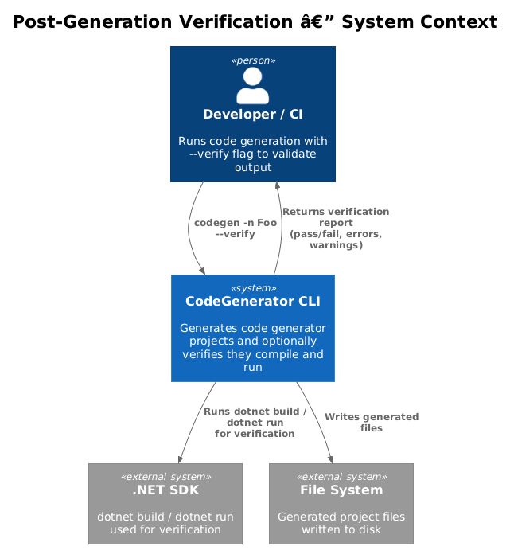
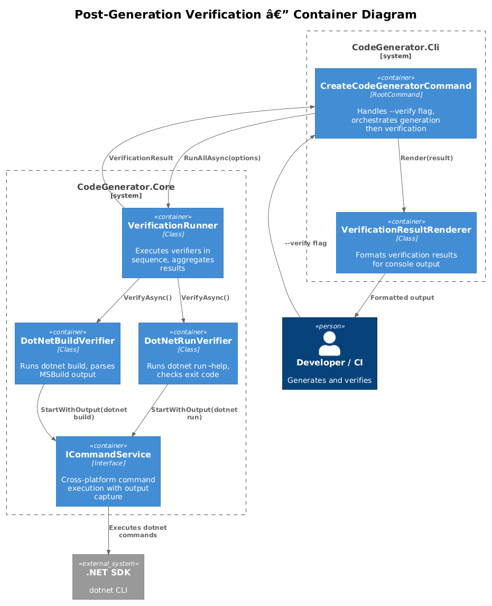
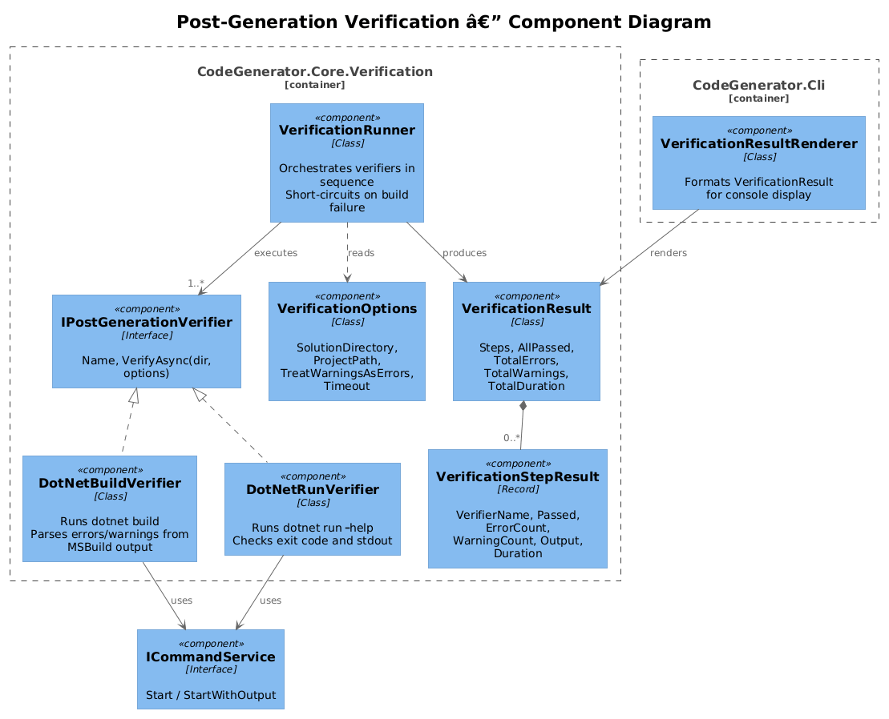
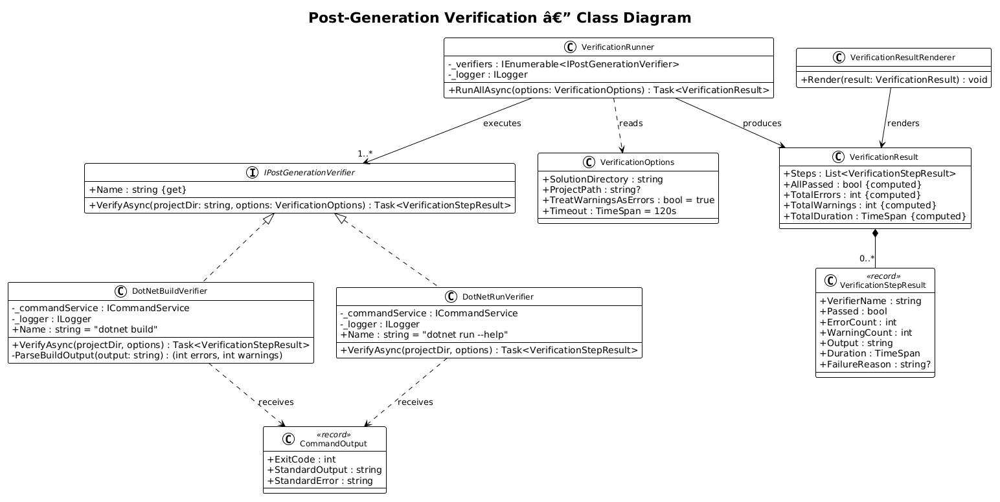
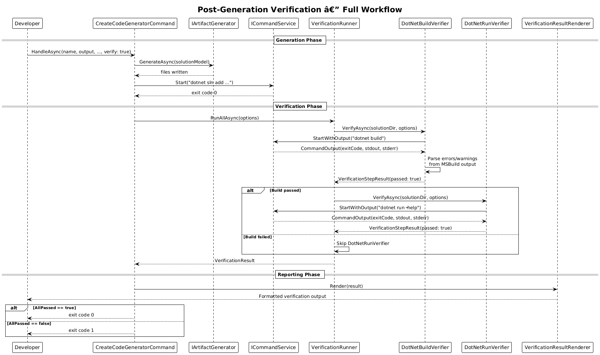
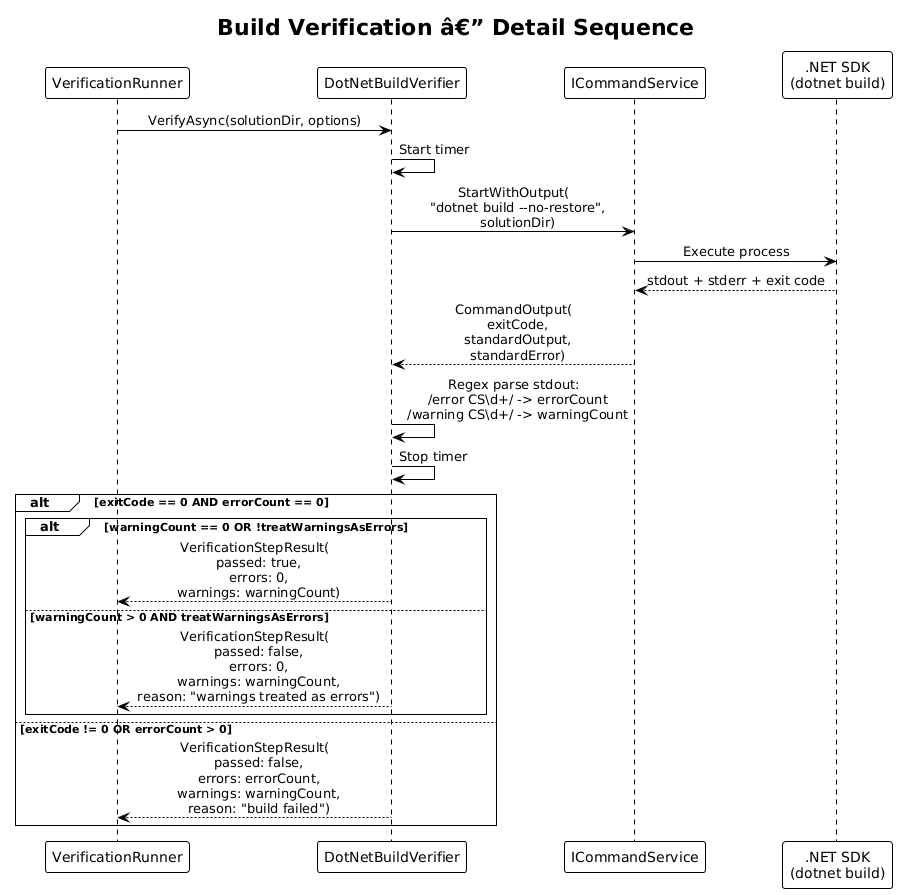

# Post-Generation Verification — Detailed Design

**Feature:** 48-post-generation-verification (Vision 1.11)
**Status:** Implemented
**Requirements:** codegenerator-cli-vision.md section 1.11 — "Post-Generation Verification"

---

## 1. Overview

After generating a project, the CodeGenerator CLI currently leaves the user to manually verify that the generated output is valid. There is no built-in mechanism to confirm that the generated solution compiles, that the CLI tool runs, or that the output meets basic quality thresholds.

### Problem

- `CreateCodeGeneratorCommand.HandleAsync` writes files and runs `dotnet sln add`, then prints "Next steps" telling the user to run `dotnet build` manually.
- Generated projects may fail to compile due to missing NuGet packages, version mismatches, or template bugs. The user discovers this only after manually building.
- There is no automated feedback loop: a broken template can ship and silently produce non-compiling output for every invocation.

### Goal

Add an optional `--verify` flag that, after generation completes, automatically:

1. Runs `dotnet build` on the generated solution and asserts zero warnings and zero errors.
2. Runs `dotnet run -- --help` on the generated CLI project and asserts a zero exit code.
3. Displays a structured verification report showing pass/fail status for each check.

### Actors

| Actor | Description |
|-------|-------------|
| **Developer** | Runs `codegen -n Foo --verify` to generate and immediately validate output |
| **CI Pipeline** | Runs generation with `--verify` to gate releases on template correctness |
| **Template Author** | Uses `--verify` during development to catch template regressions early |

### Scope

This design covers the `--verify` option on `CreateCodeGeneratorCommand`, the verifier interfaces and implementations in `CodeGenerator.Core`, and the integration point between the generation pipeline and the verification step. It does not cover custom user-defined verification rules or integration testing beyond smoke tests.

### Design Principles

- **Opt-in.** Verification only runs when `--verify` is passed. Default behavior is unchanged.
- **Composable.** Individual verifiers (`DotNetBuildVerifier`, `DotNetRunVerifier`) are independent and can be extended with new verifiers without modifying existing code.
- **Reuses existing infrastructure.** Verification commands run through the existing `ICommandService` abstraction for cross-platform support.
- **Clear reporting.** Verification output is structured and machine-readable, not just log messages.

---

## 2. Architecture

### 2.1 C4 Context Diagram

Shows how post-generation verification fits into the system landscape. After generating files, the framework optionally invokes the .NET SDK to verify output.



### 2.2 C4 Container Diagram

The logical containers involved in verification and how they relate to the existing generation engine.



### 2.3 C4 Component Diagram

Internal components: the `IPostGenerationVerifier` interface, concrete verifiers, and the `VerificationResult` model.



---

## 3. Component Details

### 3.1 IPostGenerationVerifier

- **Responsibility:** Define a single verification check that can be run against a generated project directory.
- **Namespace:** `CodeGenerator.Core.Verification`
- **Key members:**
  - `string Name { get; }` — human-readable name of the verification (e.g., "dotnet build", "dotnet run --help")
  - `Task<VerificationStepResult> VerifyAsync(string projectDirectory, VerificationOptions options)` — run the verification and return a structured result
- **Lifetime:** Registered as singletons in DI. Multiple verifiers are discovered and executed in sequence.

### 3.2 DotNetBuildVerifier

- **Responsibility:** Run `dotnet build` on the generated solution directory and parse the output for errors and warnings.
- **Namespace:** `CodeGenerator.Core.Verification`
- **Behavior:**
  - Executes `dotnet build --no-restore` (restore is assumed to have already occurred or will be triggered by the build).
  - Captures stdout and stderr via `ICommandService` (requires a new overload or wrapper that captures output — see section 6.1).
  - Parses MSBuild output for lines matching `error CS\d+` and `warning CS\d+` patterns.
  - Returns `VerificationStepResult` with pass/fail, error count, warning count, and raw output.
- **Pass criteria:** Exit code 0, zero errors, zero warnings.

### 3.3 DotNetRunVerifier

- **Responsibility:** Run `dotnet run -- --help` on the generated CLI project and verify it exits successfully.
- **Namespace:** `CodeGenerator.Core.Verification`
- **Behavior:**
  - Executes `dotnet run --project <project-path> -- --help`.
  - Checks exit code: 0 means pass, non-zero means fail.
  - Captures stdout to confirm the help text was produced (non-empty output).
  - Returns `VerificationStepResult` with pass/fail and captured output.
- **Pass criteria:** Exit code 0 and non-empty stdout.

### 3.4 VerificationOptions

- **Responsibility:** Configuration for the verification run.
- **Namespace:** `CodeGenerator.Core.Verification`
- **Key members:**
  - `string SolutionDirectory { get; }` — path to the generated solution root
  - `string? ProjectPath { get; }` — path to the specific project to verify with `dotnet run` (defaults to the CLI project)
  - `bool TreatWarningsAsErrors { get; set; }` — if true, warnings also cause failure (default: true per vision spec)
  - `TimeSpan Timeout { get; set; }` — maximum time for each verification step (default: 120 seconds)

### 3.5 VerificationStepResult

- **Responsibility:** Result of a single verification check.
- **Type:** `record`
- **Members:**
  - `string VerifierName` — which verifier produced this result
  - `bool Passed` — whether the check succeeded
  - `int ErrorCount` — number of errors detected
  - `int WarningCount` — number of warnings detected
  - `string Output` — captured stdout/stderr
  - `TimeSpan Duration` — how long the check took
  - `string? FailureReason` — human-readable explanation if `Passed` is false

### 3.6 VerificationResult

- **Responsibility:** Aggregate result of all verification checks.
- **Namespace:** `CodeGenerator.Core.Verification`
- **Key members:**
  - `List<VerificationStepResult> Steps` — results from each verifier
  - `bool AllPassed` — computed: `Steps.All(s => s.Passed)`
  - `int TotalErrors` — computed: `Steps.Sum(s => s.ErrorCount)`
  - `int TotalWarnings` — computed: `Steps.Sum(s => s.WarningCount)`
  - `TimeSpan TotalDuration` — computed: `Steps.Sum(s => s.Duration)`

### 3.7 VerificationRunner

- **Responsibility:** Orchestrate execution of all registered `IPostGenerationVerifier` instances in sequence and aggregate results.
- **Namespace:** `CodeGenerator.Core.Verification`
- **Key members:**
  - `Task<VerificationResult> RunAllAsync(VerificationOptions options)` — iterates all verifiers, collects results
- **Behavior:** Runs verifiers sequentially (build must pass before run is attempted). If `DotNetBuildVerifier` fails, `DotNetRunVerifier` is skipped (short-circuit on build failure).
- **Dependencies:** `IEnumerable<IPostGenerationVerifier>` via DI, `ILogger<VerificationRunner>`

### 3.8 VerificationResultRenderer

- **Responsibility:** Format `VerificationResult` for console output.
- **Namespace:** `CodeGenerator.Cli.Rendering`
- **Output format:**
  ```
  Verification Results
  ====================
  [PASS] dotnet build         (0 errors, 0 warnings) — 12.3s
  [PASS] dotnet run --help    (exit code 0)           — 3.1s
  --------------------
  All checks passed. Total: 15.4s
  ```
  Or on failure:
  ```
  Verification Results
  ====================
  [FAIL] dotnet build         (2 errors, 1 warning)   — 8.7s
         error CS1002: ; expected (Program.cs:14)
         error CS0246: type not found (Commands/Foo.cs:3)
  [SKIP] dotnet run --help    (skipped: build failed)
  --------------------
  Verification FAILED. 2 errors, 1 warning. Total: 8.7s
  ```

---

## 4. Data Model

### 4.1 Class Diagram



### 4.2 Entity Descriptions

| Entity | Description |
|--------|-------------|
| `IPostGenerationVerifier` | Interface for a single verification check run against a generated project |
| `DotNetBuildVerifier` | Verifier that runs `dotnet build` and parses MSBuild output for errors/warnings |
| `DotNetRunVerifier` | Verifier that runs `dotnet run -- --help` and checks exit code |
| `VerificationOptions` | Configuration for the verification run: paths, timeout, warning treatment |
| `VerificationStepResult` | Result of a single verification step: pass/fail, counts, output, duration |
| `VerificationResult` | Aggregate of all step results with computed totals |
| `VerificationRunner` | Orchestrator that executes verifiers in sequence and aggregates results |
| `VerificationResultRenderer` | Formats `VerificationResult` for console display |

---

## 5. Key Workflows

### 5.1 Verification After Generation

The user runs generation with `--verify`. After all files are written and commands complete, the verification pipeline executes.



**Steps:**

1. User invokes `codegen -n Foo --verify`.
2. `CreateCodeGeneratorCommand.HandleAsync` receives `verify: true`.
3. Handler runs the normal generation pipeline (create solution, projects, files, `dotnet sln add`).
4. Generation completes. Handler creates `VerificationOptions` pointing to the generated solution directory.
5. Handler calls `VerificationRunner.RunAllAsync(options)`.
6. `VerificationRunner` iterates registered verifiers:
   a. `DotNetBuildVerifier.VerifyAsync` — runs `dotnet build`, parses output, returns `VerificationStepResult`.
   b. If build passed: `DotNetRunVerifier.VerifyAsync` — runs `dotnet run -- --help`, checks exit code, returns `VerificationStepResult`.
   c. If build failed: `DotNetRunVerifier` is skipped.
7. `VerificationRunner` aggregates step results into `VerificationResult`.
8. Handler passes `VerificationResult` to `VerificationResultRenderer` for console output.
9. If `AllPassed` is false, handler returns exit code 1 (so CI pipelines detect failure).

### 5.2 Build Verification Detail



**Steps:**

1. `DotNetBuildVerifier.VerifyAsync` is called with `VerificationOptions`.
2. Verifier constructs command: `dotnet build --no-restore`.
3. Verifier calls `ICommandService.StartWithOutput(command, solutionDirectory)` (new overload that captures stdout/stderr).
4. Verifier receives exit code and captured output.
5. Verifier parses output lines for `error` and `warning` patterns using regex.
6. Verifier creates `VerificationStepResult` with pass/fail based on exit code and error/warning counts.

---

## 6. API Contracts

### 6.1 ICommandService Enhancement

The current `ICommandService.Start` does not capture command output. Verification requires parsing stdout/stderr. A new method or wrapper is needed:

```csharp
public interface ICommandService
{
    // Existing
    int Start(string command, string workingDirectory = null, bool waitForExit = true);

    // New — captures output for parsing
    CommandOutput StartWithOutput(string command, string workingDirectory = null);
}

public record CommandOutput(int ExitCode, string StandardOutput, string StandardError);
```

The `CommandService` implementation sets `RedirectStandardOutput = true` and `RedirectStandardError = true` on the `ProcessStartInfo` when called via `StartWithOutput`.

### 6.2 Updated HandleAsync Signature

```csharp
private async Task HandleAsync(
    string name,
    string outputDirectory,
    string framework,
    bool slnx,
    string? localSourceRoot,
    bool verify)  // new parameter
```

### 6.3 DI Registration

```csharp
// In ConfigureServices or Program.cs
services.AddSingleton<IPostGenerationVerifier, DotNetBuildVerifier>();
services.AddSingleton<IPostGenerationVerifier, DotNetRunVerifier>();
services.AddSingleton<VerificationRunner>();
services.AddSingleton<VerificationResultRenderer>();
```

---

## 7. DI Registration

### 7.1 Core Services

```csharp
public static void AddVerificationServices(this IServiceCollection services)
{
    services.AddSingleton<IPostGenerationVerifier, DotNetBuildVerifier>();
    services.AddSingleton<IPostGenerationVerifier, DotNetRunVerifier>();
    services.AddSingleton<VerificationRunner>();
}
```

### 7.2 CLI Services

```csharp
services.AddVerificationServices();
services.AddSingleton<VerificationResultRenderer>();
```

---

## 8. Limitations and Edge Cases

| Case | Handling |
|------|----------|
| **No .NET SDK installed** | `DotNetBuildVerifier` catches `Win32Exception` / exit code from `ICommandService` and returns a fail result with "dotnet SDK not found" message. |
| **NuGet restore required** | If `--no-restore` fails because packages are not cached, a retry with restore could be attempted. Initial implementation uses `dotnet build` (with implicit restore) for reliability. |
| **Generated project has intentional warnings** | `TreatWarningsAsErrors` is configurable in `VerificationOptions`. The `--verify` flag defaults to strict (warnings = failure) per the vision spec, but this can be relaxed. |
| **Long build times** | `VerificationOptions.Timeout` defaults to 120 seconds. If the build exceeds this, the process is killed and the step is marked as failed with a timeout message. |
| **Non-CLI projects** | `DotNetRunVerifier` only applies to projects with `OutputType=Exe`. For library projects, only `DotNetBuildVerifier` runs. The verifier checks the `.csproj` for `<OutputType>Exe</OutputType>` before attempting `dotnet run`. |
| **Dry-run mode interaction** | When `--dry-run` is active, `--verify` is ignored (nothing was written to disk, so there is nothing to build). A warning is logged. |

---

## 9. Testing Strategy

| Test Type | Description |
|-----------|-------------|
| **Unit: DotNetBuildVerifier** | Mock `ICommandService` to return predefined output. Verify parsing of error/warning patterns. Verify pass/fail logic based on exit code and counts. |
| **Unit: DotNetRunVerifier** | Mock `ICommandService` to return predefined exit codes. Verify pass on exit 0, fail on non-zero. |
| **Unit: VerificationRunner** | Mock verifiers. Verify sequential execution, short-circuit on build failure, correct aggregation of results. |
| **Unit: VerificationResultRenderer** | Feed known `VerificationResult` objects. Assert formatted output matches expected strings. |
| **Integration: Full generation + verify** | Run `CreateCodeGeneratorCommand` with `--verify` against a temp directory. Assert that the generated project compiles and runs. |
| **Integration: Broken template** | Intentionally produce invalid code. Run with `--verify`. Assert exit code 1 and error details in output. |

---

## 10. Open Questions

| # | Question | Context |
|---|----------|---------|
| 1 | Should `ICommandService.StartWithOutput` be added to the existing interface or introduced as a separate `ICommandOutputService`? | Adding to `ICommandService` is simpler but changes an existing contract. A separate interface avoids breaking changes. |
| 2 | Should verification run `dotnet restore` explicitly before `dotnet build --no-restore`, or just use `dotnet build` with implicit restore? | Explicit restore gives clearer error messages for NuGet failures. Implicit restore is simpler. |
| 3 | Should the `--verify` flag be available on all generation commands or only on `CreateCodeGeneratorCommand`? | Other commands (e.g., scaffold) also produce compilable output. Verification could be a cross-cutting concern. |
| 4 | Should verification results be written to a JSON file for CI consumption? | A `--verify-output <path>` flag could write structured results. Useful for CI but adds complexity. |
| 5 | Should there be a `--verify-only` mode that verifies an existing generated project without regenerating? | Useful for template authors who want to test existing output. Could be a separate command rather than a flag. |
| 6 | Should custom verifiers be pluggable via the same DI discovery pattern used for `IArtifactGenerationStrategy<T>`? | Would allow template authors to add project-specific verification (e.g., "run unit tests"). Adds complexity. |
