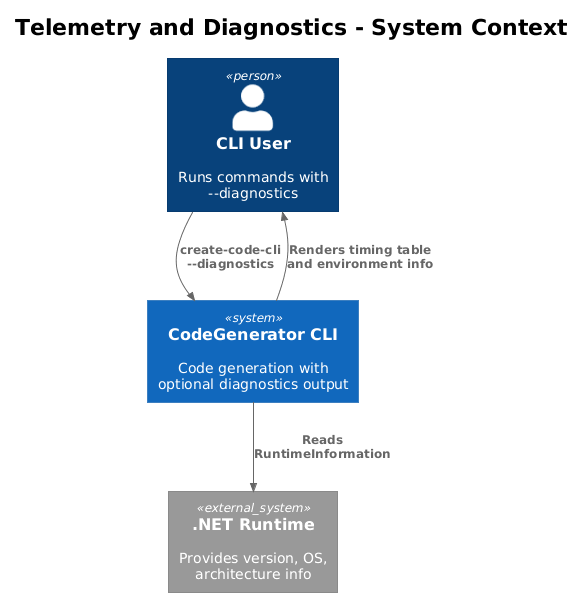
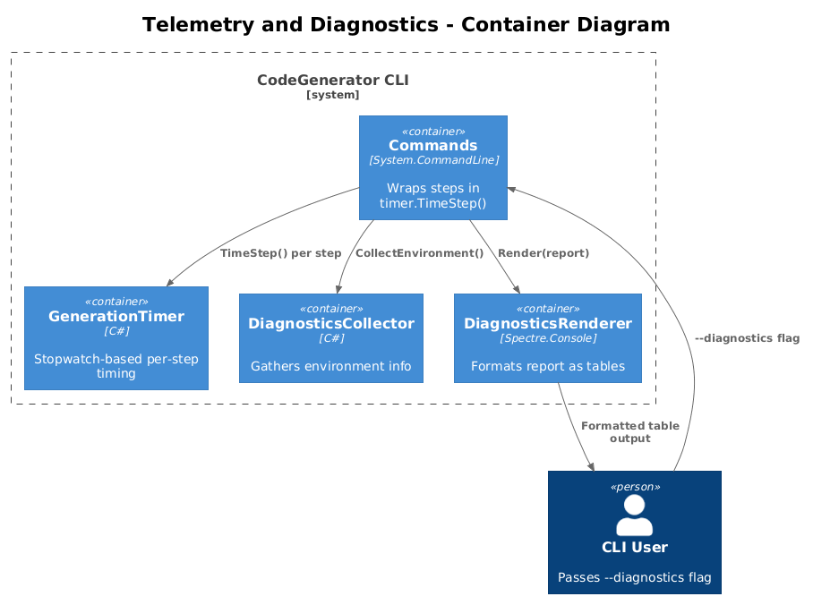
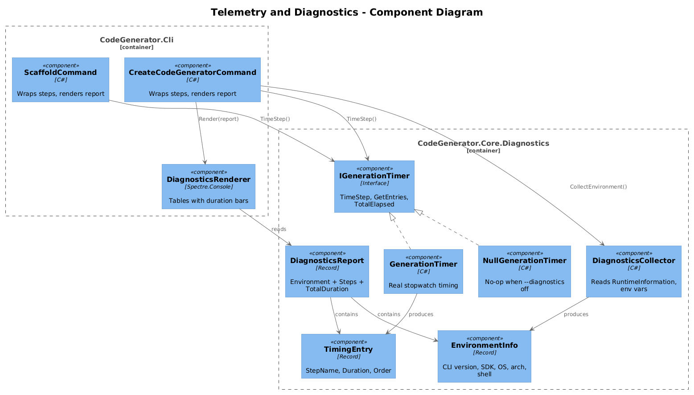
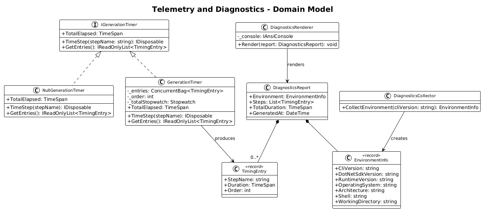
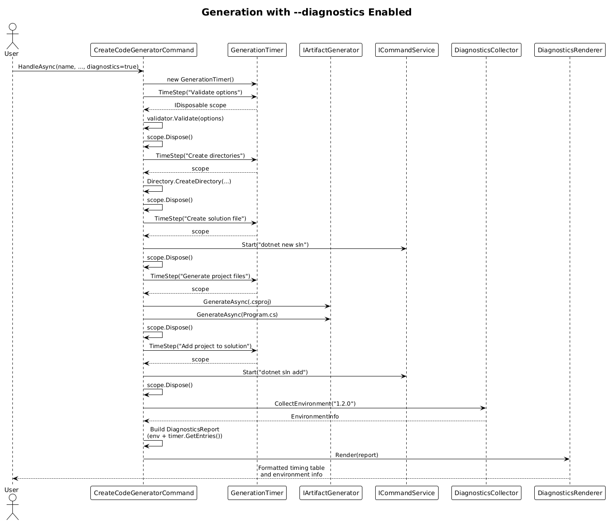
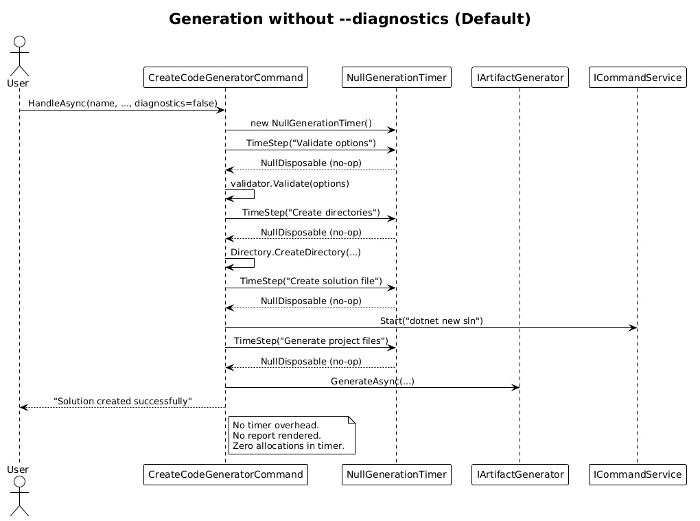
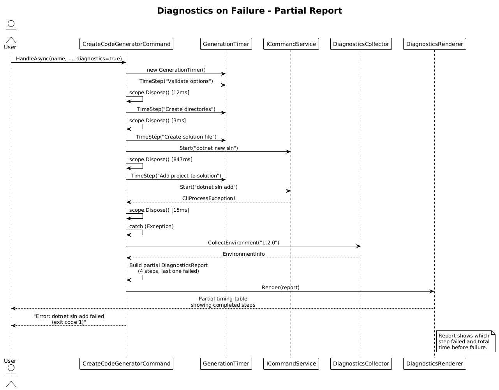

# Telemetry and Diagnostics — Detailed Design

## 1. Overview

When generation fails or produces unexpected output, users have no visibility into what happened — which steps ran, how long each took, or what environment the CLI was running in. The `--diagnostics` flag will expose per-step timing, environment info, and a structured report that aids debugging and support.

Core data-collection classes already exist in `CodeGenerator.Core.Diagnostics`: `GenerationTimer` (stopwatch-based per-step timing), `DiagnosticsCollector` (environment info gathering), `DiagnosticsReport`, `EnvironmentInfo`, and `TimingEntry`. Console rendering infrastructure exists in `CodeGenerator.Cli.Rendering` with `SpectreConsoleRenderer` for rich output.

**What's missing:**
- A `--diagnostics` flag on CLI commands.
- DI registration for `GenerationTimer` and `DiagnosticsCollector`.
- A `DiagnosticsRenderer` to format the report to the console.
- Integration hooks in command handlers to wrap generation steps with `timer.TimeStep()`.
- A null-object timer for zero overhead when `--diagnostics` is off.

**Actors:** CLI user debugging generation issues, support/triage  
**Scope:** `CodeGenerator.Cli` (commands, rendering, DI), `CodeGenerator.Core.Diagnostics`

## 2. Architecture

### 2.1 C4 Context Diagram


### 2.2 C4 Container Diagram


### 2.3 C4 Component Diagram


## 3. Component Details

### 3.1 GenerationTimer (Exists)

**Location:** `src/CodeGenerator.Core/Diagnostics/GenerationTimer.cs`

**Responsibility:** Measures elapsed time for named generation steps using `Stopwatch`. Thread-safe via `ConcurrentBag<TimingEntry>` and `Interlocked.Increment` for ordering.

**API:**
```csharp
public IDisposable TimeStep(string stepName);  // using (timer.TimeStep("Build .csproj")) { ... }
public IReadOnlyList<TimingEntry> GetEntries();
public TimeSpan TotalElapsed { get; }
```

**No changes needed.** Already complete.

### 3.2 NullGenerationTimer (New)

**Location:** `src/CodeGenerator.Core/Diagnostics/NullGenerationTimer.cs`

**Responsibility:** No-op timer for when `--diagnostics` is not set. Zero allocation, zero overhead.

```csharp
public class NullGenerationTimer : GenerationTimer
{
    private static readonly IDisposable NullScope = new NullDisposable();

    public new IDisposable TimeStep(string stepName) => NullScope;

    private class NullDisposable : IDisposable
    {
        public void Dispose() { }
    }
}
```

**Design decision:** Subclass rather than interface to avoid changing every call site. Commands always call `timer.TimeStep()` — the null variant simply returns a no-op disposable without starting a stopwatch. Since `TimeStep` is not virtual on the current class, either make it virtual or extract an `IGenerationTimer` interface. **Recommendation:** Extract `IGenerationTimer` interface.

### 3.3 IGenerationTimer (New)

**Location:** `src/CodeGenerator.Core/Diagnostics/IGenerationTimer.cs`

```csharp
public interface IGenerationTimer
{
    IDisposable TimeStep(string stepName);
    IReadOnlyList<TimingEntry> GetEntries();
    TimeSpan TotalElapsed { get; }
}
```

`GenerationTimer` implements this. `NullGenerationTimer` implements it with no-ops.

### 3.4 DiagnosticsCollector (Exists)

**Location:** `src/CodeGenerator.Core/Diagnostics/DiagnosticsCollector.cs`

**Responsibility:** Gathers environment info: CLI version, .NET SDK version, runtime version, OS, architecture, shell, working directory.

**No changes needed.** Already complete.

### 3.5 DiagnosticsRenderer (New)

**Location:** `src/CodeGenerator.Cli/Rendering/DiagnosticsRenderer.cs`

**Responsibility:** Formats a `DiagnosticsReport` to the console using Spectre.Console tables.

```csharp
public class DiagnosticsRenderer
{
    private readonly IAnsiConsole _console;

    public DiagnosticsRenderer(IAnsiConsole console) { ... }

    public void Render(DiagnosticsReport report)
    {
        // Section 1: Environment info table
        RenderEnvironment(report.Environment);

        // Section 2: Step timing table with duration bars
        RenderTimings(report.Steps, report.TotalDuration);

        // Section 3: Summary line
        RenderSummary(report);
    }
}
```

**Output format:**
```
─── Diagnostics ───────────────────────────────

  Environment
  ┌────────────────────┬──────────────────────────┐
  │ CLI Version        │ 1.2.0                    │
  │ .NET SDK           │ 9.0.1                    │
  │ Runtime            │ .NET 9.0.1               │
  │ OS                 │ Windows 11 (10.0.26200)  │
  │ Architecture       │ ARM64                    │
  │ Shell              │ bash                     │
  │ Working Directory  │ C:\projects\MyApp        │
  └────────────────────┴──────────────────────────┘

  Step Timings
  ┌───┬──────────────────────────┬──────────┬────────────────────────┐
  │ # │ Step                     │ Duration │                        │
  ├───┼──────────────────────────┼──────────┼────────────────────────┤
  │ 1 │ Validate options         │    12 ms │ █                      │
  │ 2 │ Create directories       │     3 ms │                        │
  │ 3 │ Create solution file     │   847 ms │ ██████████████████████ │
  │ 4 │ Generate .csproj         │    28 ms │ █                      │
  │ 5 │ Generate project files   │    45 ms │ █                      │
  │ 6 │ Add project to solution  │   312 ms │ ████████               │
  │ 7 │ Generate install script  │     5 ms │                        │
  └───┴──────────────────────────┴──────────┴────────────────────────┘

  Total: 1.252s | Files: 6 | Generated at: 2026-04-03T14:22:31Z
```

### 3.6 Program.cs — DI Registration

**Current state:** No diagnostics services registered.

**Target state:**
```csharp
services.AddSingleton<DiagnosticsCollector>();
// Timer is registered per-command based on --diagnostics flag (see 3.7)
```

`DiagnosticsCollector` is stateless, registered as singleton. `GenerationTimer` is scoped per command execution (one timer per generation run).

### 3.7 CreateCodeGeneratorCommand — --diagnostics Flag

**Responsibility:** Add `--diagnostics` flag. When set, wrap generation steps in `timer.TimeStep()`, collect environment info, and render the report after generation completes.

**Changes:**
1. Add `--diagnostics` option:
   ```csharp
   var diagnosticsOption = new Option<bool>(
       aliases: ["--diagnostics"],
       description: "Show environment info and per-step timing",
       getDefaultValue: () => false);
   ```
2. Update `HandleAsync` signature to include `bool diagnostics`.
3. Resolve `IGenerationTimer`: if `diagnostics` is true → `new GenerationTimer()`, else → `new NullGenerationTimer()`.
4. Wrap each generation step:
   ```csharp
   using (timer.TimeStep("Validate options"))
   {
       var validationResult = validator.Validate(options);
       ...
   }

   using (timer.TimeStep("Create directories"))
   {
       Directory.CreateDirectory(solution.SolutionDirectory);
       ...
   }

   using (timer.TimeStep("Create solution file"))
   {
       commandService.Start("dotnet new sln ...");
   }
   // ... etc for each logical step
   ```
5. After generation, if `diagnostics` is true:
   ```csharp
   var collector = _serviceProvider.GetRequiredService<DiagnosticsCollector>();
   var report = new DiagnosticsReport
   {
       Environment = collector.CollectEnvironment(cliVersion),
       Steps = timer.GetEntries().ToList(),
       TotalDuration = timer.TotalElapsed,
   };
   var renderer = new DiagnosticsRenderer(AnsiConsole.Console);
   renderer.Render(report);
   ```

### 3.8 ScaffoldCommand — --diagnostics Flag

**Same pattern as 3.7.** Add `--diagnostics` option, wrap `engine.ScaffoldAsync` and validation in `timer.TimeStep()` calls, render report when enabled.

**Timing steps for scaffold:**
1. "Load configuration file"
2. "Validate YAML"
3. "Scaffold files"
4. "Run post-scaffold commands"

## 4. Data Model

### 4.1 Class Diagram


### 4.2 Entity Descriptions

| Entity | Description | Status |
|---|---|---|
| `IGenerationTimer` | Interface for timing steps. `TimeStep`, `GetEntries`, `TotalElapsed`. | **New** |
| `GenerationTimer` | Real implementation using `Stopwatch` and `ConcurrentBag`. | Exists |
| `NullGenerationTimer` | No-op implementation for zero overhead when disabled. | **New** |
| `TimingEntry` | Record: `StepName`, `Duration`, `Order`. | Exists |
| `DiagnosticsCollector` | Gathers CLI version, .NET SDK, OS, architecture, shell, cwd. | Exists |
| `EnvironmentInfo` | Record holding all environment data fields. | Exists |
| `DiagnosticsReport` | Aggregate: `EnvironmentInfo` + `List<TimingEntry>` + `TotalDuration` + `GeneratedAt`. | Exists |
| `DiagnosticsRenderer` | Formats `DiagnosticsReport` using Spectre.Console tables. | **New** |

## 5. Key Workflows

### 5.1 Generation with --diagnostics


1. User runs `create-code-cli -n MyApp --diagnostics`.
2. `HandleAsync` creates `GenerationTimer` (real, not null).
3. Each generation step is wrapped: `using (timer.TimeStep("step name")) { ... }`.
4. After generation completes (success or failure), `DiagnosticsCollector.CollectEnvironment()` gathers env info.
5. `DiagnosticsReport` is assembled from timer entries + environment.
6. `DiagnosticsRenderer.Render(report)` outputs the formatted table.

### 5.2 Generation without --diagnostics


1. User runs `create-code-cli -n MyApp` (no `--diagnostics` flag).
2. `HandleAsync` creates `NullGenerationTimer`.
3. `timer.TimeStep(...)` returns a no-op disposable — zero overhead.
4. No report rendered. Normal output only.

### 5.3 Diagnostics on Failure


1. User runs `create-code-cli -n MyApp --diagnostics`.
2. Steps 1-4 complete, tracked by timer.
3. Step 5 ("Add project to solution") throws `CliProcessException`.
4. Catch block still renders the diagnostics report (partial — only completed steps shown).
5. The timing report shows which step failed and how far generation got.
6. Error message displayed after diagnostics table.

## 6. API Contracts

### CLI Flag

```
create-code-cli -n MyApp --diagnostics
create-code-cli scaffold -c config.yaml --diagnostics
```

| Flag | Type | Default | Description |
|---|---|---|---|
| `--diagnostics` | `bool` | `false` | Show environment info and per-step timing after generation |

### DiagnosticsReport JSON (Future)

For machine-readable output (not in initial scope, but the model supports it):
```json
{
  "environment": {
    "cliVersion": "1.2.0",
    "dotNetSdkVersion": "9.0.1",
    "runtimeVersion": ".NET 9.0.1",
    "operatingSystem": "Windows 11 (10.0.26200)",
    "architecture": "ARM64",
    "shell": "bash",
    "workingDirectory": "C:\\projects\\MyApp"
  },
  "steps": [
    { "stepName": "Validate options", "duration": "00:00:00.012", "order": 1 },
    { "stepName": "Create solution file", "duration": "00:00:00.847", "order": 3 }
  ],
  "totalDuration": "00:00:01.252",
  "generatedAt": "2026-04-03T14:22:31Z"
}
```

## 7. Security Considerations

- `DiagnosticsCollector` exposes the working directory and shell name. This is intentional for debugging and only shown when the user explicitly opts in with `--diagnostics`.
- CLI version is embedded at build time from assembly metadata — no external lookup.
- No network calls. All data collected locally.

## 8. Open Questions

1. **Should `--diagnostics` also increase log verbosity?** It could set the log level to `Debug` when enabled, surfacing internal logging from strategies and services. Recommendation: keep `--diagnostics` focused on timing/environment. Add a separate `--verbose` flag for log verbosity in a future iteration.
2. **Should the report be written to a file?** A `--diagnostics-output <path>` option could write the JSON report to disk for automated analysis. Recommendation: defer — console output is sufficient for initial implementation.
3. **CLI version source?** `DiagnosticsCollector.CollectEnvironment(cliVersion)` takes a string parameter. This should come from `Assembly.GetEntryAssembly().GetName().Version`. Wire this in `Program.cs` or the command handler.
